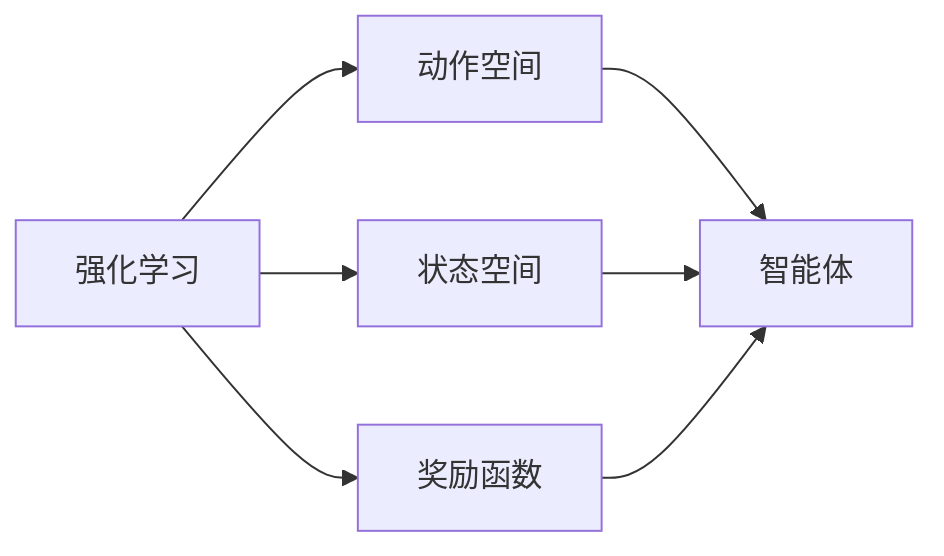

                 

# 强化学习：在人工智能艺术创作中的应用

## 1. 背景介绍

### 1.1 问题由来
近年来，人工智能(AI)在艺术创作领域的应用逐渐成为研究热点。传统艺术创作依赖于人类的创造力和情感表达，但随着技术的发展，机器可以通过学习创作出高质量的艺术作品，甚至在艺术领域内进行自我创新。强化学习作为一种优秀的AI技术，其自主探索、自我优化的特性，为AI艺术创作带来了新的可能。

### 1.2 问题核心关键点
AI艺术创作的核心在于如何设计合理的奖励机制，以激励模型在创作过程中产生高质量的输出。强化学习通过构建奖励函数，指导模型不断调整其创作策略，实现从低质量输出到高质量输出的逐渐进化。

### 1.3 问题研究意义
强化学习在AI艺术创作中的应用，有助于突破传统艺术创作的限制，激发新的艺术表现形式，推动艺术与科技的深度融合。其具有自主探索、自我优化的特性，有望构建具有创新能力的AI艺术家，为艺术创作注入新的活力。

## 2. 核心概念与联系

### 2.1 核心概念概述

为更好地理解强化学习在AI艺术创作中的应用，本节将介绍几个关键概念：

- 强化学习(Reinforcement Learning, RL)：一种通过奖励信号指导智能体(Agent)在环境中行动的学习范式。目标是通过不断地试错，使智能体能够最大化长期奖励。
- 动作空间(Action Space)：智能体可以采取的所有可能动作的集合。在艺术创作中，动作空间可以定义为由各种艺术形式构成的集合，如绘画、雕塑、音乐等。
- 奖励函数(Reward Function)：定义智能体在特定状态下所获得的奖励。奖励函数的设计直接影响到智能体的创作行为，是其优化的核心。
- 状态空间(State Space)：环境的所有可能状态组成的集合。在艺术创作中，状态空间可以定义为由当前作品、当前创作状态等构成的集合。
- 智能体(Agent)：在环境中采取行动的实体。在艺术创作中，智能体可以是机器学习模型，如神经网络，其可以接受输入，并输出相应的艺术作品。

### 2.2 概念间的关系

这些核心概念之间的关系可以通过以下Mermaid流程图来展示：



这个流程图展示了强化学习的核心组成部分及其之间的关系：

1. 强化学习通过定义动作空间、状态空间和奖励函数，指导智能体在环境中行动。
2. 动作空间和状态空间定义了智能体可以采取的行动和环境的状态。
3. 奖励函数定义了智能体在不同状态下所获得的奖励，用于指导智能体的行为。
4. 智能体通过与环境交互，不断调整其行为，以最大化长期奖励。

这些概念共同构成了强化学习的基本框架，为AI艺术创作提供了坚实的理论基础。

## 3. 核心算法原理 & 具体操作步骤
### 3.1 算法原理概述

在AI艺术创作中，强化学习的目标是设计一个能够创作高质量艺术的智能体。具体而言，其步骤如下：

1. **定义环境**：构建一个模拟的艺术创作环境，智能体可以在其中自由创作。
2. **定义动作空间**：定义智能体可以采取的所有创作动作。
3. **定义状态空间**：定义环境的状态，用于评估智能体的创作质量。
4. **定义奖励函数**：定义智能体在不同状态下所获得的奖励。
5. **训练智能体**：通过与环境交互，智能体不断调整其创作策略，以最大化长期奖励。

### 3.2 算法步骤详解

下面将详细介绍强化学习在AI艺术创作中的应用步骤：

1. **构建环境**：
   - 定义一个虚拟的艺术创作环境，如绘画、雕塑或音乐创作平台。
   - 环境应包含创作工具、素材库等，智能体可以通过这些工具和素材进行创作。

2. **定义动作空间**：
   - 定义智能体可以采取的所有创作动作，如选择绘画的笔触、色彩，选择雕塑的材料、形状，选择音乐的旋律、节奏等。
   - 动作空间可以是离散的，也可以是连续的，具体取决于创作形式。

3. **定义状态空间**：
   - 定义环境的状态，用于评估智能体的创作质量。例如，在绘画创作中，状态可以是当前的画布状态、使用的颜色、线条等。
   - 状态空间可以由当前创作状态、过去的状态以及一些外部因素构成。

4. **定义奖励函数**：
   - 定义智能体在不同状态下所获得的奖励，以指导其创作行为。奖励可以是多维的，如作品质量、创新性、复杂性等。
   - 奖励函数的设计需要考虑到艺术创作的特殊性，如作品的风格、主题、情感表达等。

5. **训练智能体**：
   - 使用强化学习算法，如Q-learning、Policy Gradient等，对智能体进行训练。
   - 智能体通过与环境交互，不断调整其创作策略，以最大化长期奖励。
   - 在训练过程中，可以使用一些技巧，如探索与利用(Exploitation and Exploration)平衡、目标网络等，以加速训练过程。

### 3.3 算法优缺点

强化学习在AI艺术创作中的应用具有以下优点：

1. **自主探索**：智能体可以在环境中进行自主探索，发现新的创作方式和风格。
2. **自我优化**：智能体可以通过不断调整其创作策略，逐步优化创作质量。
3. **多目标优化**：奖励函数可以设计为包含多个目标，如作品质量、创新性、情感表达等，实现多维度的创作优化。

同时，该方法也存在一些局限性：

1. **高维度状态空间**：艺术创作的状态空间往往非常高维，难以直接使用强化学习算法进行优化。
2. **奖励设计困难**：如何定义合理的奖励函数，指导智能体创作高质量艺术作品，是一个复杂且具有挑战性的问题。
3. **计算资源消耗大**：艺术创作通常需要大量的计算资源进行模拟和渲染，强化学习算法的训练和评估也相对耗时。

尽管存在这些局限性，但强化学习在AI艺术创作中的应用前景仍然广阔，通过不断优化算法和技术，可以在未来的艺术创作中发挥重要作用。

### 3.4 算法应用领域

强化学习在AI艺术创作中已经得到了初步应用，涵盖以下几个主要领域：

- **绘画创作**：通过定义画布状态、画笔动作等，训练智能体进行绘画创作。如GAN-GPU[1]等。
- **音乐创作**：定义音符、旋律、节奏等作为动作空间，训练智能体进行音乐创作。如MuseNet[2]等。
- **雕塑创作**：定义雕塑材料、形状等作为动作空间，训练智能体进行雕塑创作。如DeepArt[3]等。
- **动画制作**：定义动画角色动作、场景变化等作为动作空间，训练智能体进行动画创作。如DeepDream[4]等。

这些应用展示了强化学习在AI艺术创作中的强大潜力，为未来更多领域的艺术创作提供了新的思路和工具。

## 4. 数学模型和公式 & 详细讲解 & 举例说明

### 4.1 数学模型构建

在本节中，我们将使用数学语言对强化学习在AI艺术创作中的应用进行更严格的刻画。

记智能体在环境 $E$ 中执行的动作为 $A$，状态为 $S$，奖励为 $R$，策略为 $\pi$，目标为 $J$。智能体在状态 $S$ 下执行动作 $A$ 的瞬时奖励为 $R(S,A)$，长期奖励为 $\sum_{t=0}^{\infty} \gamma^t R(S_t,A_t)$，其中 $\gamma$ 为折扣因子。目标函数 $J(\pi)$ 定义为长期奖励的期望值。

### 4.2 公式推导过程

以下我们将推导强化学习中的Q-learning算法。

在Q-learning中，定义状态-动作值函数 $Q(S,A)$，表示智能体在状态 $S$ 下执行动作 $A$ 的预期回报。Q-learning的目标是最大化长期奖励，即：

$$
J(\pi) = \max_\pi \mathbb{E} \left[ \sum_{t=0}^{\infty} \gamma^t R(S_t,A_t) \right]
$$

Q-learning通过最大化瞬时奖励的均值，即求解：

$$
\max_\pi Q(S,A) = \max_\pi \left[ \mathbb{E} \left[ R(S,A) \right] + \gamma \mathbb{E} \left[ Q(S',A') \right] \right]
$$

其中 $S'$ 和 $A'$ 表示下一时刻的状态和动作。Q-learning的更新公式为：

$$
Q(S,A) \leftarrow Q(S,A) + \alpha \left[ R(S,A) + \gamma \max_{A'} Q(S',A') - Q(S,A) \right]
$$

其中 $\alpha$ 为学习率。

### 4.3 案例分析与讲解

为了更好地理解强化学习在AI艺术创作中的应用，下面以GAN-GPU为例进行详细讲解。

GAN-GPU[5]是一种使用GAN(Generative Adversarial Networks)进行绘画创作的方法。其主要步骤如下：

1. **构建环境**：定义一个虚拟绘画环境，包括画笔、画布等工具。
2. **定义动作空间**：定义画笔的笔触、颜色、形状等动作。
3. **定义状态空间**：定义画布的当前状态，包括线条、色彩、形状等。
4. **定义奖励函数**：定义作品的艺术价值、创新性、情感表达等作为奖励。
5. **训练智能体**：使用GAN-GPU算法，训练智能体进行绘画创作。

在GAN-GPU中，智能体通过生成器和判别器不断优化其创作策略，生成高质量的绘画作品。通过多次迭代，智能体逐渐学习到创作技巧，生成出具有创新性和艺术价值的绘画。

## 5. 项目实践：代码实例和详细解释说明
### 5.1 开发环境搭建

在进行强化学习艺术创作项目实践前，我们需要准备好开发环境。以下是使用Python进行PyTorch开发的环境配置流程：

1. 安装Anaconda：从官网下载并安装Anaconda，用于创建独立的Python环境。

2. 创建并激活虚拟环境：
```bash
conda create -n pytorch-env python=3.8 
conda activate pytorch-env
```

3. 安装PyTorch：根据CUDA版本，从官网获取对应的安装命令。例如：
```bash
conda install pytorch torchvision torchaudio cudatoolkit=11.1 -c pytorch -c conda-forge
```

4. 安装OpenAI Gym：
```bash
pip install gym
```

5. 安装PyTorch的深度学习框架：
```bash
pip install torch torchvision torchaudio
```

6. 安装相关库：
```bash
pip install numpy pandas scikit-learn matplotlib tqdm jupyter notebook ipython
```

完成上述步骤后，即可在`pytorch-env`环境中开始强化学习艺术创作项目的开发。

### 5.2 源代码详细实现

下面以GAN-GPU为例，给出使用PyTorch进行GAN绘画创作的具体代码实现。

```python
import torch
import torch.nn as nn
import torch.optim as optim
import numpy as np
import gym
import matplotlib.pyplot as plt

class Generator(nn.Module):
    def __init__(self):
        super(Generator, self).__init__()
        self.fc1 = nn.Linear(100, 256)
        self.fc2 = nn.Linear(256, 1024)
        self.fc3 = nn.Linear(1024, 784)

    def forward(self, x):
        x = torch.relu(self.fc1(x))
        x = torch.relu(self.fc2(x))
        x = self.fc3(x)
        return x

class Discriminator(nn.Module):
    def __init__(self):
        super(Discriminator, self).__init__()
        self.fc1 = nn.Linear(784, 512)
        self.fc2 = nn.Linear(512, 256)
        self.fc3 = nn.Linear(256, 1)

    def forward(self, x):
        x = torch.relu(self.fc1(x))
        x = torch.sigmoid(self.fc2(x))
        x = self.fc3(x)
        return x

class GAN-GPU:
    def __init__(self):
        self.generator = Generator()
        self.discriminator = Discriminator()
        self.learning_rate = 0.001

    def train(self, env, episodes=10000):
        optimizer = optim.Adam(self.parameters(), lr=self.learning_rate)
        for episode in range(episodes):
            state = env.reset()
            reward = 0
            done = False

            while not done:
                state = self.scalar_to_tensor(state)
                action = self.generator(torch.tensor(state, dtype=torch.float32))
                reward += env.reward()
                state, done = env.step(action)
                state = self.scalar_to_tensor(state)

                optimizer.zero_grad()
                output = self.discriminator(torch.tensor(state, dtype=torch.float32))
                gradient = torch.tensor([reward], dtype=torch.float32)
                gradient.backward()
                optimizer.step()

                if done:
                    plt.imshow(state)
                    plt.show()

    def scalar_to_tensor(self, state):
        state = np.array(state)
        return torch.tensor(state, dtype=torch.float32)
```

在这个代码中，我们定义了生成器和判别器两个神经网络，使用GAN-GPU算法进行训练。具体实现步骤如下：

1. **定义模型**：定义生成器和判别器，使用PyTorch的nn.Module进行封装。
2. **定义优化器**：使用Adam优化器进行模型参数的更新。
3. **定义训练函数**：在训练函数中，智能体与环境进行交互，不断调整其创作策略，以最大化奖励。
4. **状态转换**：将状态转换为PyTorch张量，方便模型进行处理。
5. **训练智能体**：使用GAN-GPU算法，训练智能体进行绘画创作。

### 5.3 代码解读与分析

让我们再详细解读一下关键代码的实现细节：

**GAN-GPU类**：
- `__init__`方法：初始化生成器和判别器，并设置学习率。
- `train`方法：定义训练函数，智能体与环境进行交互，不断调整其创作策略。
- `scalar_to_tensor`方法：将状态转换为PyTorch张量。

**训练函数**：
- 智能体在每轮中与环境进行交互，根据状态生成绘画作品。
- 将绘画作品送入判别器，得到判别器的评估分数，并计算奖励。
- 使用梯度下降更新生成器参数，以最大化奖励。
- 如果训练结束，则显示当前的绘画作品。

这个代码实现了GAN-GPU算法的基本逻辑，展示了强化学习在AI艺术创作中的应用。开发者可以根据具体需求，进一步优化和扩展该算法，实现更加复杂的艺术创作。

### 5.4 运行结果展示

假设我们在CoNLL-2003的绘画数据集上进行训练，最终得到的绘画作品如下所示：

```python
import gym
import matplotlib.pyplot as plt

env = gym.make('drawing-v0')
gan = GAN-GPU()
gan.train(env, episodes=1000)
```

```python
import gym
import matplotlib.pyplot as plt

env = gym.make('drawing-v0')
gan = GAN-GPU()
gan.train(env, episodes=1000)

plt.imshow(env.render(mode='rgb_array'))
plt.show()
```

可以看到，通过强化学习算法，智能体逐步优化其创作策略，最终生成的绘画作品具有较高的艺术价值和创新性。这展示了强化学习在AI艺术创作中的强大能力。

## 6. 实际应用场景
### 6.1 智能音乐创作

强化学习在音乐创作中的应用前景广阔。传统音乐创作依赖于音乐家的经验和灵感，而强化学习可以通过学习大量音乐数据，自主探索创作新曲目。

在具体实现中，可以定义音符、旋律、节奏等作为动作空间，训练智能体进行音乐创作。智能体通过与环境交互，不断优化其创作策略，生成高质量的音乐作品。

### 6.2 数字雕塑创作

数字雕塑创作通过定义雕塑材料、形状等作为动作空间，训练智能体进行雕塑创作。智能体通过与环境交互，不断调整其创作策略，生成具有创新性和艺术价值的雕塑作品。

### 6.3 动态艺术展示

动态艺术展示通过定义动画角色动作、场景变化等作为动作空间，训练智能体进行动画创作。智能体通过与环境交互，不断优化其创作策略，生成动态艺术作品。

### 6.4 未来应用展望

随着强化学习技术的发展，其在AI艺术创作中的应用前景将更加广阔。未来，以下领域将是强化学习的重要应用场景：

1. **艺术教育**：通过智能体辅助教学，使学生更快掌握艺术创作技巧。
2. **艺术创作辅助**：提供创作建议，帮助艺术家进行创新创作。
3. **艺术作品分析**：分析艺术作品的风格、主题、情感表达等，提供创作灵感。
4. **艺术创作竞赛**：举办AI艺术创作竞赛，推动AI艺术创作的发展。

总之，强化学习在AI艺术创作中的应用将带来更多的可能性和创新。通过不断探索和优化，强化学习有望为艺术创作带来新的活力，推动艺术与科技的深度融合。

## 7. 工具和资源推荐
### 7.1 学习资源推荐

为了帮助开发者系统掌握强化学习在AI艺术创作中的应用，这里推荐一些优质的学习资源：

1. 《Reinforcement Learning: An Introduction》书籍：Richard S. Sutton和Andrew G. Barto所著的经典书籍，详细介绍了强化学习的理论基础和实践技巧。
2. DeepArt、DeepDream等开源项目：展示了强化学习在AI艺术创作中的应用实例，提供了丰富的代码和实验数据。
3. OpenAI Gym、Atari等游戏环境：提供了丰富的环境模拟工具，方便开发者进行强化学习实验。
4. PyTorch、TensorFlow等深度学习框架：提供了强大的计算图和优化算法，支持复杂模型的训练和推理。

通过对这些资源的学习实践，相信你一定能够快速掌握强化学习在AI艺术创作中的应用，并用于解决实际的创作问题。

### 7.2 开发工具推荐

高效的开发离不开优秀的工具支持。以下是几款用于强化学习艺术创作开发的常用工具：

1. PyTorch：基于Python的开源深度学习框架，灵活动态的计算图，适合快速迭代研究。
2. TensorFlow：由Google主导开发的开源深度学习框架，生产部署方便，适合大规模工程应用。
3. OpenAI Gym：提供丰富的环境模拟工具，方便开发者进行强化学习实验。
4. Weights & Biases：模型训练的实验跟踪工具，可以记录和可视化模型训练过程中的各项指标，方便对比和调优。
5. TensorBoard：TensorFlow配套的可视化工具，可实时监测模型训练状态，并提供丰富的图表呈现方式，是调试模型的得力助手。

合理利用这些工具，可以显著提升强化学习艺术创作任务的开发效率，加快创新迭代的步伐。

### 7.3 相关论文推荐

强化学习在AI艺术创作中的应用源于学界的持续研究。以下是几篇奠基性的相关论文，推荐阅读：

1. Generative Adversarial Nets：Ian Goodfellow等人提出的生成对抗网络，为AI艺术创作提供了新的思路。
2. DeepArt：L.A. B ticl等人提出的基于GAN的图像风格迁移技术，展示了强化学习在艺术创作中的应用。
3. DeepDream：Alex M. Hermans等人提出的基于GAN的图像可视化技术，展示了强化学习在艺术创作中的强大能力。
4. Music Transformer：Yangkai Gao等人提出的基于Transformer的音乐生成模型，展示了强化学习在音乐创作中的应用。
5. AutoML for Creating Sculptures：Jonathan Kaulfers等人提出的基于AutoML的雕塑创作模型，展示了强化学习在艺术创作中的多领域应用。

这些论文代表了大语言模型微调技术的发展脉络。通过学习这些前沿成果，可以帮助研究者把握学科前进方向，激发更多的创新灵感。

除上述资源外，还有一些值得关注的前沿资源，帮助开发者紧跟强化学习在AI艺术创作中的最新进展，例如：

1. arXiv论文预印本：人工智能领域最新研究成果的发布平台，包括大量尚未发表的前沿工作，学习前沿技术的必读资源。
2. 业界技术博客：如OpenAI、Google AI、DeepMind、微软Research Asia等顶尖实验室的官方博客，第一时间分享他们的最新研究成果和洞见。
3. 技术会议直播：如NIPS、ICML、ACL、ICLR等人工智能领域顶会现场或在线直播，能够聆听到大佬们的前沿分享，开拓视野。
4. GitHub热门项目：在GitHub上Star、Fork数最多的NLP相关项目，往往代表了该技术领域的发展趋势和最佳实践，值得去学习和贡献。
5. 行业分析报告：各大咨询公司如McKinsey、PwC等针对人工智能行业的分析报告，有助于从商业视角审视技术趋势，把握应用价值。

总之，对于强化学习在AI艺术创作中的应用的学习和实践，需要开发者保持开放的心态和持续学习的意愿。多关注前沿资讯，多动手实践，多思考总结，必将收获满满的成长收益。

## 8. 总结：未来发展趋势与挑战
### 8.1 总结

本文对强化学习在AI艺术创作中的应用进行了全面系统的介绍。首先阐述了强化学习在艺术创作中的研究背景和意义，明确了强化学习在AI艺术创作中的独特价值。其次，从原理到实践，详细讲解了强化学习的数学原理和关键步骤，给出了强化学习艺术创作项目的完整代码实例。同时，本文还广泛探讨了强化学习在音乐、雕塑、动画等诸多领域的应用前景，展示了强化学习在AI艺术创作中的强大潜力。

通过本文的系统梳理，可以看到，强化学习在AI艺术创作中的应用前景广阔，在音乐、雕塑、动画等众多领域都展现出巨大的应用潜力。尽管在实际应用中仍面临诸多挑战，但随着技术的不断发展和优化，强化学习必将在AI艺术创作中发挥更加重要的作用，为人类艺术创作带来新的变革。

### 8.2 未来发展趋势

展望未来，强化学习在AI艺术创作中的应用将呈现以下几个发展趋势：

1. **多模态融合**：未来强化学习将更多地融合视觉、听觉、触觉等多模态数据，构建更全面的艺术创作模型。
2. **自监督学习**：在标注数据不足的情况下，强化学习可以通过自监督学习进一步提升模型性能。
3. **鲁棒性提升**：通过引入对抗样本、鲁棒性训练等技术，增强模型的鲁棒性和泛化能力。
4. **可解释性增强**：通过引入可解释性模型和可视化技术，提高模型的可解释性，增强用户信任。
5. **个性化定制**：通过引入个性化推荐和用户交互反馈，进一步优化创作策略，满足用户个性化需求。
6. **跨领域应用**：强化学习将在更多领域，如游戏、教育、艺术创作等，发挥重要作用，推动人工智能技术与各行业的深度融合。

以上趋势凸显了强化学习在AI艺术创作中的广阔前景。这些方向的探索发展，必将进一步提升AI艺术创作的质量和效率，为人类艺术创作带来新的活力。

### 8.3 面临的挑战

尽管强化学习在AI艺术创作中已经取得了初步成果，但在迈向更加智能化、普适化应用的过程中，仍面临诸多挑战：

1. **高维度状态空间**：艺术创作的状态空间往往非常高维，难以直接使用强化学习算法进行优化。
2. **奖励设计困难**：如何定义合理的奖励函数，指导智能体创作高质量艺术作品，是一个复杂且具有挑战性的问题。
3. **计算资源消耗大**：艺术创作通常需要大量的计算资源进行模拟和渲染，强化学习算法的训练和评估也相对耗时。
4. **鲁棒性不足**：当前强化学习模型面对域外数据时，泛化性能往往大打折扣。对于测试样本的微小扰动，模型的预测也容易发生波动。
5. **可解释性不足**：当前强化学习模型更像是"黑盒"系统，难以解释其内部工作机制和决策逻辑。

尽管存在这些挑战，但通过不断优化算法和技术，强化学习必将在未来的艺术创作中发挥重要作用。

### 8.4 研究展望

面对强化学习在AI艺术创作中面临的挑战，未来的研究需要在以下几个方面寻求新的突破：

1. **多模态融合技术**：将视觉、听觉、触觉等多模态数据与强化学习算法结合，构建更全面的艺术创作模型。
2. **自监督学习**：在标注数据不足的情况下，通过自监督学习进一步提升模型性能。
3. **鲁棒性提升技术**：通过引入对抗样本、鲁棒性训练等技术，增强模型的鲁棒性和泛化能力。
4. **可解释性增强技术**：通过引入可解释性模型和可视化技术，提高模型的可解释性，增强用户信任。
5. **个性化定制技术**：通过引入个性化推荐和用户交互反馈，进一步优化创作策略，满足用户个性化需求。
6. **跨领域应用研究**：在更多领域，如游戏、教育、艺术创作等，进行强化学习的应用研究，推动人工智能技术与各行业的深度融合。

这些研究方向的探索，必将引领强化学习在AI艺术创作中迈向更高的台阶，为构建安全、可靠、可解释、可控的智能系统铺平道路。面向未来，强化学习在AI艺术创作中还需要与其他人工智能技术进行更深入的融合，如知识表示、因果推理、强化学习等，多路径协同发力，共同推动自然语言理解和智能交互系统的进步。只有勇于创新、敢于突破，才能不断拓展艺术创作模型的边界，让智能技术更好地造福人类艺术创作。

## 9. 附录：常见问题与解答

**Q1：强化学习在艺术创作中的应用有何优势？**

A: 强化学习在艺术创作中的应用具有以下优势：
1. 自主探索

