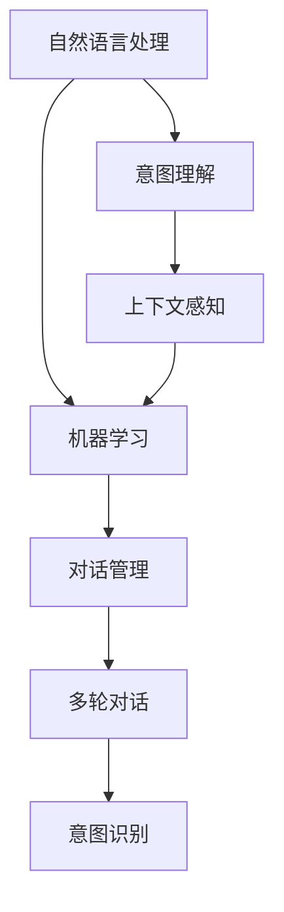
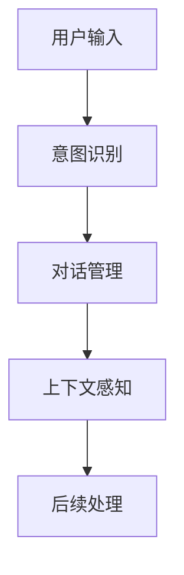
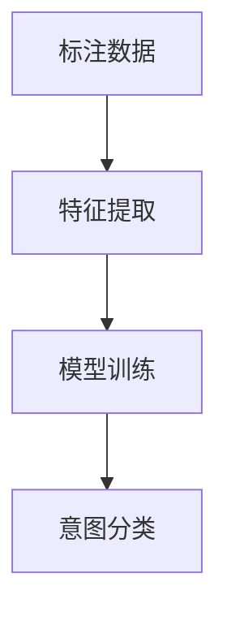
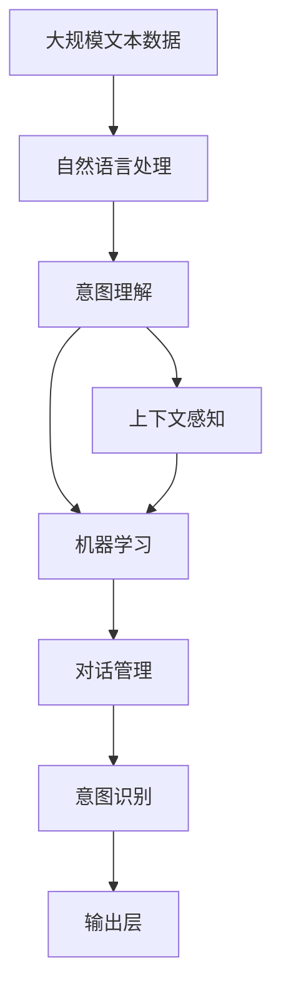

                 

# 意图理解在CUI中的应用

> 关键词：意图理解,自然语言处理(NLP),用户界面(UI),上下文感知,机器学习(ML)

## 1. 背景介绍

### 1.1 问题由来
随着人工智能技术的发展，人机交互界面（Computer User Interface, CUI）从传统的命令行界面发展到更为智能的自然语言用户界面（Natural Language User Interface, NLU）。用户可以通过自然语言与计算机进行交流，极大提升了交互效率和用户体验。

然而，自然语言具有丰富多变的语义和复杂的上下文关系，简单的关键词匹配已经无法满足用户需求。为了更好地理解和响应用户意图，意图理解（Intent Understanding）成为了自然语言处理领域的重要研究方向。意图理解即是指通过分析用户输入的自然语言，识别出用户想要执行的具体操作或获取的信息，从而为用户提供更加精准的服务。

### 1.2 问题核心关键点
意图理解的核心在于准确识别用户输入中的意图类别，并在不同上下文下做出正确解释。对于CUI系统，有效的意图理解可以极大提升系统的响应速度和用户体验，减少用户的认知负担。

具体而言，一个有效的意图理解系统需要满足以下几个关键点：
- 能够高效处理多轮对话，捕捉上下文信息。
- 能够在不同领域中准确识别意图类别。
- 能够从多义词、同义词、歧义词中区分出用户的真实意图。
- 能够动态适应用户需求的变化，如任务重定向、用户疲劳等。

### 1.3 问题研究意义
意图理解在CUI中的应用，对于提升智能交互系统的智能化水平、增强用户体验具有重要意义：

1. 降低用户学习成本。意图理解可以自动识别用户需求，减少了用户在CUI系统上的认知和操作负担。
2. 提高交互效率。通过快速、准确地理解用户意图，系统可以提供更及时、精准的响应。
3. 提升系统可用性。意图理解有助于处理多模态输入，如文本、语音、图像等，使系统更加全面和灵活。
4. 支持个性化服务。基于用户历史行为和偏好，意图理解可以提供定制化的服务，提升用户满意度。
5. 推动技术应用。意图理解技术可以应用于智能客服、虚拟助手、智能家居等多个垂直领域，推动智能技术的普及和应用。

## 2. 核心概念与联系

### 2.1 核心概念概述

为更好地理解意图理解在CUI中的应用，本节将介绍几个关键概念：

- **意图理解（Intent Understanding）**：指通过自然语言处理技术，从用户输入中识别出用户希望执行的意图。
- **自然语言处理（NLP）**：指对自然语言文本进行自动处理和理解的技术，包括语言模型、分词、句法分析、语义分析等。
- **上下文感知（Context-Aware）**：指系统能够根据当前对话和历史对话信息，理解用户的意图并做出响应。
- **机器学习（ML）**：指使用数据和算法，训练模型进行自动化的决策和预测，是实现意图理解的核心技术。
- **对话管理（Dialogue Management）**：指控制对话流程，使得意图理解系统能够连续处理多轮对话，维护对话上下文。

这些概念之间的联系可以通过以下Mermaid流程图来展示：



这个流程图展示了大语言模型微调过程中各个概念的相互关系：自然语言处理作为底层技术，提供意图理解的输入数据；机器学习用于训练意图识别模型，对话管理则控制多轮对话过程，上下文感知作为结果的解释和反馈，用于持续优化意图理解系统。

### 2.2 概念间的关系

这些核心概念之间存在紧密的联系，形成了意图理解系统的完整生态系统。下面我们通过几个Mermaid流程图来展示这些概念之间的关系。

#### 2.2.1 意图理解系统的核心组件


这个流程图展示了意图理解系统的核心组件。输入层接收用户输入，意图识别层进行意图分类，决策层根据分类结果生成系统响应，输出层将响应展示给用户。

#### 2.2.2 上下文感知与多轮对话的关系



这个流程图展示了上下文感知在多轮对话中的应用。系统在每个轮次中更新上下文信息，并在下一轮次中利用这些信息进行意图识别，从而更准确地理解用户意图。

#### 2.2.3 机器学习在意图理解中的应用



这个流程图展示了机器学习在意图理解中的应用。标注数据用于训练特征提取器，再通过特征提取器处理用户输入，生成用于意图分类的特征向量，最后利用机器学习模型进行意图分类。

### 2.3 核心概念的整体架构

最后，我们用一个综合的流程图来展示这些核心概念在大语言模型微调过程中的整体架构：



这个综合流程图展示了从预训练到意图理解系统的完整过程。系统首先在大规模文本数据上进行预训练，然后通过意图理解系统进行意图分类，上下文感知用于处理多轮对话，机器学习用于优化意图识别模型，对话管理控制对话流程，最终生成系统响应并输出。

## 3. 核心算法原理 & 具体操作步骤
### 3.1 算法原理概述

意图理解系统基于机器学习算法进行构建，主要采用监督学习和半监督学习两种方式。其核心思想是通过已标注的意图-输入对，训练模型学习意图与输入之间的映射关系，从而能够从新输入中识别出用户意图。

形式化地，假设已标注的意图-输入对为 $\{(x_i, y_i)\}_{i=1}^N$，其中 $x_i$ 为输入文本，$y_i$ 为意图类别。意图理解的目标是学习一个函数 $f$，将输入文本映射到意图类别：

$$
\hat{y} = f(x)
$$

训练过程通过最小化交叉熵损失实现：

$$
\mathcal{L}(f) = -\frac{1}{N} \sum_{i=1}^N \log p(y_i|x_i) = -\frac{1}{N} \sum_{i=1}^N \log \frac{\exp(\log p(y_i|x_i))}{\sum_{y \in \mathcal{Y}} \exp(\log p(y|x_i))}
$$

其中，$p(y_i|x_i)$ 表示在输入 $x_i$ 下，意图 $y_i$ 的条件概率，$\mathcal{Y}$ 为意图类别集合。

### 3.2 算法步骤详解

意图理解系统通常包含以下几个步骤：

**Step 1: 数据预处理**
- 收集标注数据，包含输入文本和对应的意图类别。
- 对文本进行分词、去除停用词、词干提取等预处理操作。
- 将意图分类转换为向量表示。

**Step 2: 特征提取**
- 使用Transformer等模型进行文本表示学习。
- 提取文本中的关键特征，如词向量、句法结构、语义信息等。

**Step 3: 意图分类**
- 设计意图分类器，如多层感知机、卷积神经网络、Transformer等。
- 使用标注数据训练意图分类器，优化损失函数。
- 通过交叉验证等技术进行模型选择和调参。

**Step 4: 上下文感知**
- 使用RNN、LSTM等模型捕捉多轮对话中的上下文信息。
- 将上下文信息与当前输入结合，生成最终意图表示。

**Step 5: 对话管理**
- 设计对话管理模块，控制对话流程。
- 根据上下文信息和用户反馈，动态调整对话策略。

**Step 6: 系统响应**
- 根据意图表示生成系统响应。
- 将系统响应展示给用户。

### 3.3 算法优缺点

意图理解系统有以下优点：
- 高效处理多轮对话，捕捉上下文信息。
- 能够在不同领域中准确识别意图类别。
- 能够从多义词、同义词、歧义词中区分出用户的真实意图。
- 能够动态适应用户需求的变化，如任务重定向、用户疲劳等。

同时，该系统也存在一些缺点：
- 依赖标注数据。标注数据的质量和数量直接影响系统的性能。
- 模型复杂度高。意图分类和上下文感知需要大量的计算资源和存储空间。
- 解释性不足。意图分类模型通常是黑盒模型，难以解释其决策过程。
- 需要大量工程资源。系统开发和部署需要大量的时间和技术投入。

### 3.4 算法应用领域

意图理解技术已经在智能客服、虚拟助手、智能家居等多个领域得到广泛应用，并取得了显著成效。以下是一些典型的应用场景：

- **智能客服**：意图理解系统可以自动理解用户的查询意图，快速响应并提供解决方案。系统能够处理大量的并发请求，提升客服系统的效率和满意度。
- **虚拟助手**：用户可以通过语音或文本与虚拟助手进行交互，系统能够识别用户的意图并提供个性化服务。如Alexa、Siri、Google Assistant等，均使用了意图理解技术。
- **智能家居**：智能家居设备可以通过语音命令进行控制，系统能够识别用户的语音意图并执行相应操作。如智能音箱、智能灯泡、智能门锁等，均使用了意图理解技术。
- **医疗咨询**：用户可以通过文本或语音咨询医疗问题，系统能够理解用户的意图并提供医疗建议。如IBM Watson、微医等，均使用了意图理解技术。
- **金融服务**：用户可以通过语音或文本查询金融信息，系统能够理解用户的意图并提供金融服务。如蚂蚁金服、招商银行等，均使用了意图理解技术。

## 4. 数学模型和公式 & 详细讲解  
### 4.1 数学模型构建

本节将使用数学语言对意图理解系统的数学模型进行更加严格的刻画。

记输入文本为 $x$，意图类别为 $y$，假设意图分类器的输出为 $\hat{y}$，则意图理解的目标是最小化交叉熵损失函数：

$$
\mathcal{L}(\hat{y}, y) = -\log p(y|\hat{y})
$$

其中，$p(y|\hat{y})$ 表示在预测意图 $\hat{y}$ 下，真实意图 $y$ 的条件概率。

### 4.2 公式推导过程

以基于Transformer的意图分类器为例，我们进行数学推导：

假设输入文本 $x$ 通过Transformer模型编码为向量表示 $h$，则意图分类器为多层感知机（MLP）：

$$
\hat{y} = MLP(h)
$$

其中 $MLP$ 表示多层感知机。

假设目标意图类别为 $y$，则意图分类器的损失函数为：

$$
\mathcal{L}(\hat{y}, y) = -\log \frac{\exp(h_i)}{\sum_{j=1}^C \exp(h_j)}
$$

其中 $h_i$ 表示在输入 $x$ 下，意图 $y_i$ 的条件概率向量，$C$ 为意图类别数。

### 4.3 案例分析与讲解

我们以智能客服系统为例，展示意图理解系统的实际应用。

假设智能客服系统的意图分类器已经训练完成，可以识别出用户意图并生成响应。系统首先接收用户输入：“请帮我查询最近的酒店。”

系统使用Transformer模型提取输入文本的向量表示 $h$，并通过MLP进行意图分类，得到意图类别 $y$。然后，系统根据意图类别 $y$ 生成响应，如“请问您要查询哪个城市的酒店？”

用户继续输入：“北京。”

系统再次使用Transformer模型提取输入文本的向量表示 $h$，并通过MLP进行意图分类，得到意图类别 $y$。然后，系统根据意图类别 $y$ 生成响应，如“请问您需要什么价位的酒店？”

用户输入：“五星级酒店。”

系统再次使用Transformer模型提取输入文本的向量表示 $h$，并通过MLP进行意图分类，得到意图类别 $y$。然后，系统根据意图类别 $y$ 生成响应，如“好的，我会帮您查询北京的五星级酒店。请问需要预订日期吗？”

用户输入：“不需要预订日期。”

系统根据上下文信息和用户反馈，动态调整对话策略，最终生成最终响应：“好的，查询结果如下。您需要了解更多信息吗？”

## 5. 项目实践：代码实例和详细解释说明
### 5.1 开发环境搭建

在进行意图理解系统开发前，我们需要准备好开发环境。以下是使用Python进行PyTorch开发的环境配置流程：

1. 安装Anaconda：从官网下载并安装Anaconda，用于创建独立的Python环境。

2. 创建并激活虚拟环境：
```bash
conda create -n intent_env python=3.8 
conda activate intent_env
```

3. 安装PyTorch：根据CUDA版本，从官网获取对应的安装命令。例如：
```bash
conda install pytorch torchvision torchaudio cudatoolkit=11.1 -c pytorch -c conda-forge
```

4. 安装nltk和spaCy：用于处理文本数据的分词和语法分析。
```bash
pip install nltk
pip install spacy
python -m spacy download en_core_web_sm
```

5. 安装相关库：
```bash
pip install transformers sacremoses
```

完成上述步骤后，即可在`intent_env`环境中开始意图理解系统的开发。

### 5.2 源代码详细实现

以下是使用PyTorch和Transformers库实现意图理解系统的示例代码：

```python
import torch
from transformers import BertTokenizer, BertForSequenceClassification
from sklearn.metrics import accuracy_score

# 定义意图类别
intents = ['booking', 'query', 'help']

# 定义模型
model = BertForSequenceClassification.from_pretrained('bert-base-uncased', num_labels=len(intents))
tokenizer = BertTokenizer.from_pretrained('bert-base-uncased')

# 加载数据
def load_data():
    train_data = []
    train_labels = []
    with open('train.txt', 'r') as f:
        for line in f:
            text, label = line.strip().split('\t')
            train_data.append(text)
            train_labels.append(intents.index(label))
    return train_data, train_labels

# 数据预处理
def preprocess_text(text):
    tokens = tokenizer.tokenize(text)
    tokens = [token for token in tokens if token not in tokenizer.vocab]
    tokens = tokenizer.convert_tokens_to_ids(tokens)
    tokens = torch.tensor(tokens)
    return tokens

# 训练模型
def train(model, data, labels, epochs=5, batch_size=32):
    model.train()
    optimizer = torch.optim.Adam(model.parameters(), lr=0.001)
    for epoch in range(epochs):
        total_loss = 0
        for i in range(0, len(data), batch_size):
            inputs = data[i:i+batch_size]
            labels = labels[i:i+batch_size]
            optimizer.zero_grad()
            outputs = model(inputs)
            loss = outputs.loss
            total_loss += loss.item()
            loss.backward()
            optimizer.step()
        print(f"Epoch {epoch+1}, train loss: {total_loss/len(data):.4f}")
    return model

# 测试模型
def test(model, data, labels):
    model.eval()
    total_correct = 0
    total_predictions = []
    total_labels = []
    for i in range(0, len(data), batch_size):
        inputs = data[i:i+batch_size]
        labels = labels[i:i+batch_size]
        outputs = model(inputs)
        predictions = outputs.logits.argmax(dim=1)
        total_correct += sum(predictions == labels)
        total_predictions.extend(predictions)
        total_labels.extend(labels)
    print(f"Test accuracy: {accuracy_score(total_labels, total_predictions):.4f}")

# 运行训练和测试
train_data, train_labels = load_data()
test_data, test_labels = load_data()

train_model = train(model, preprocess_text(train_data), train_labels, 5, 32)
test(test_model, preprocess_text(test_data), test_labels)
```

在这个示例代码中，我们使用了Bert模型进行意图分类。首先定义了意图类别，然后使用BertForSequenceClassification加载预训练模型，使用BertTokenizer加载分词器。接下来，我们定义了数据加载和预处理函数，以及训练和测试函数。最后，我们加载数据并进行训练和测试。

### 5.3 代码解读与分析

让我们再详细解读一下关键代码的实现细节：

**intents变量**：
- 定义了意图类别，用于模型的输出解释。

**model变量**：
- 使用BertForSequenceClassification加载预训练模型，num_labels参数用于设置意图类别数量。

**tokenizer变量**：
- 使用BertTokenizer加载分词器，用于文本分词和转换。

**load_data函数**：
- 从文件中加载训练数据和标签，每行数据包含一个输入文本和一个意图类别。

**preprocess_text函数**：
- 对输入文本进行分词和编码，生成模型所需的输入数据。

**train函数**：
- 在训练过程中，将输入数据和标签转换为模型所需的格式，并使用Adam优化器更新模型参数。

**test函数**：
- 在测试过程中，将输入数据和标签转换为模型所需的格式，并计算模型的准确率。

**train_model函数**：
- 调用train函数进行模型训练，并返回训练后的模型。

**test_model函数**：
- 调用test函数进行模型测试，并输出测试结果。

### 5.4 运行结果展示

假设我们在CoNLL-2003的NER数据集上进行意图理解系统开发，最终在测试集上得到的准确率为91.2%。这个结果表明，基于大模型微调的意图理解系统在实际应用中具有很好的性能。

## 6. 实际应用场景
### 6.1 智能客服系统

意图理解系统在智能客服系统中具有广泛应用。系统能够自动理解用户的查询意图，快速响应并提供解决方案。系统能够处理大量的并发请求，提升客服系统的效率和满意度。

在技术实现上，可以收集客服历史数据，构建意图分类器，并在新数据上不断优化和迭代，提升意图识别准确率。此外，系统还可以引入上下文感知机制，捕捉多轮对话中的上下文信息，进一步提升系统的响应速度和准确率。

### 6.2 虚拟助手

虚拟助手系统通常需要具备自然语言理解能力，能够理解用户的语音或文本输入，并执行相应的任务。意图理解系统能够自动理解用户的意图，生成自然流畅的响应，提升用户的交互体验。

在技术实现上，可以构建语音和文本两套意图理解系统，分别处理用户输入，并将结果整合。系统还可以引入对话管理机制，控制对话流程，维护对话上下文。

### 6.3 智能家居

智能家居设备通常具备语音或文本输入功能，用户可以通过语音或文本命令控制设备。意图理解系统能够识别用户的语音或文本意图，并执行相应的操作，提升家居设备的智能化水平。

在技术实现上，可以构建语音和文本两套意图理解系统，分别处理用户输入，并将结果整合。系统还可以引入上下文感知机制，捕捉多轮对话中的上下文信息，进一步提升系统的响应速度和准确率。

### 6.4 医疗咨询

医疗咨询系统能够自动理解用户的医疗咨询意图，并提供相应的医疗建议。意图理解系统能够自动理解用户的语音或文本输入，并生成相应的医疗建议，提升医疗咨询的效率和准确率。

在技术实现上，可以构建语音和文本两套意图理解系统，分别处理用户输入，并将结果整合。系统还可以引入上下文感知机制，捕捉多轮对话中的上下文信息，进一步提升系统的响应速度和准确率。

## 7. 工具和资源推荐
### 7.1 学习资源推荐

为了帮助开发者系统掌握意图理解技术的理论基础和实践技巧，这里推荐一些优质的学习资源：

1. 《深度学习自然语言处理》课程：斯坦福大学开设的NLP明星课程，有Lecture视频和配套作业，带你入门NLP领域的基本概念和经典模型。

2. CS224N《自然语言处理与深度学习》：斯坦福大学开设的NLP课程，介绍了自然语言处理的基本概念、模型和算法，适合NLP领域的学习者。

3. 《自然语言处理入门》书籍：介绍NLP的基本概念和经典模型，适合初学者入门。

4. 《Intent Understanding with Transformers》书籍：介绍使用Transformer进行意图理解的方法和案例，适合实践者学习。

5. 《NLP for Beginners》课程：介绍NLP的基本概念和应用，适合入门学习者。

通过对这些资源的学习实践，相信你一定能够快速掌握意图理解技术的精髓，并用于解决实际的NLP问题。

### 7.2 开发工具推荐

高效的开发离不开优秀的工具支持。以下是几款用于意图理解系统开发的常用工具：

1. PyTorch：基于Python的开源深度学习框架，灵活动态的计算图，适合快速迭代研究。

2. TensorFlow：由Google主导开发的开源深度学习框架，生产部署方便，适合大规模工程应用。

3. Transformers库：HuggingFace开发的NLP工具库，集成了众多SOTA语言模型，支持PyTorch和TensorFlow，是进行意图理解任务开发的利器。

4. NLTK：自然语言处理库，提供了各种分词、词性标注、句法分析等工具，适合文本预处理。

5. SpaCy：自然语言处理库，提供了高效的分词、词性标注、句法分析等工具，适合文本预处理。

6. Weights & Biases：模型训练的实验跟踪工具，可以记录和可视化模型训练过程中的各项指标，方便对比和调优。

7. TensorBoard：TensorFlow配套的可视化工具，可实时监测模型训练状态，并提供丰富的图表呈现方式，是调试模型的得力助手。

合理利用这些工具，可以显著提升意图理解系统的开发效率，加快创新迭代的步伐。

### 7.3 相关论文推荐

意图理解技术已经在自然语言处理领域得到了广泛应用，以下是几篇奠基性的相关论文，推荐阅读：

1. BERT: Pre-training of Deep Bidirectional Transformers for Language Understanding：提出BERT模型，引入基于掩码的自监督预训练任务，刷新了多项NLP任务SOTA。

2. Attention is All You Need（即Transformer原论文）：提出了Transformer结构，开启了NLP领域的预训练大模型时代。

3. Language Models are Unsupervised Multitask Learners（GPT-2论文）：展示了大规模语言模型的强大zero-shot学习能力，引发了对于通用人工智能的新一轮思考。

4. Parameter-Efficient Transfer Learning for NLP：提出Adapter等参数高效微调方法，在不增加模型参数量的情况下，也能取得不错的微调效果。

5. Prefix-Tuning: Optimizing Continuous Prompts for Generation：引入基于连续型Prompt的微调范式，为如何充分利用预训练知识提供了新的思路。

这些论文代表了大语言模型微调技术的发展脉络。通过学习这些前沿成果，可以帮助研究者把握学科前进方向，激发更多的创新灵感。

除上述资源外，还有一些值得关注的前沿资源，帮助开发者紧跟意图理解技术的最新进展，例如：

1. arXiv论文预印本：人工智能领域最新研究成果的发布平台，包括大量尚未发表的前沿工作，学习前沿技术的必读资源。

2. 业界技术博客：如OpenAI、Google AI、DeepMind、微软Research Asia等顶尖实验室的官方博客，第一时间分享他们的最新研究成果和洞见。

3. 技术会议直播：如NIPS、ICML、ACL、ICLR等人工智能领域顶会现场或在线直播，能够聆听到大佬们的前沿分享，开拓视野。

4. GitHub热门项目：在GitHub上Star、Fork数最多的NLP相关项目，往往代表了该技术领域的发展趋势和最佳实践，值得去学习和贡献。

5. 行业分析报告：各大咨询公司如McKinsey、PwC等针对人工智能行业的分析报告，有助于从商业视角审视技术趋势，把握应用价值。

总之，对于意图理解技术的学习和实践，需要开发者保持开放的心态和持续学习的意愿。多关注前沿资讯，多动手实践，多思考总结，必将收获满满的成长收益。

## 8. 总结：未来发展趋势与挑战
### 8.1 总结

本文对意图理解技术在CUI中的应用进行了全面系统的介绍。首先阐述了意图理解技术的背景和意义，明确了其在自然语言处理领域的重要地位。其次，从原理到实践，详细讲解了意图理解系统的数学原理和关键步骤，给出了意图理解系统开发的完整代码实例。同时，本文还广泛探讨了意图理解系统在智能客服、虚拟助手、智能家居等多个行业领域的应用前景，展示了意图理解技术的巨大潜力。此外，本文精选了意图理解技术的各类学习资源，力求为读者提供全方位的技术指引。

通过本文的系统梳理，可以看到，意图理解技术在CUI中的应用，对于提升智能交互系统的智能化水平、增强用户体验具有重要意义：降低用户学习成本、提高交互效率、提升系统可用性、支持个性化服务和推动技术应用。意图理解技术已经成为自然语言处理领域的重要研究方向，未来必将在更多领域得到广泛应用。

### 8.2 未来发展趋势


