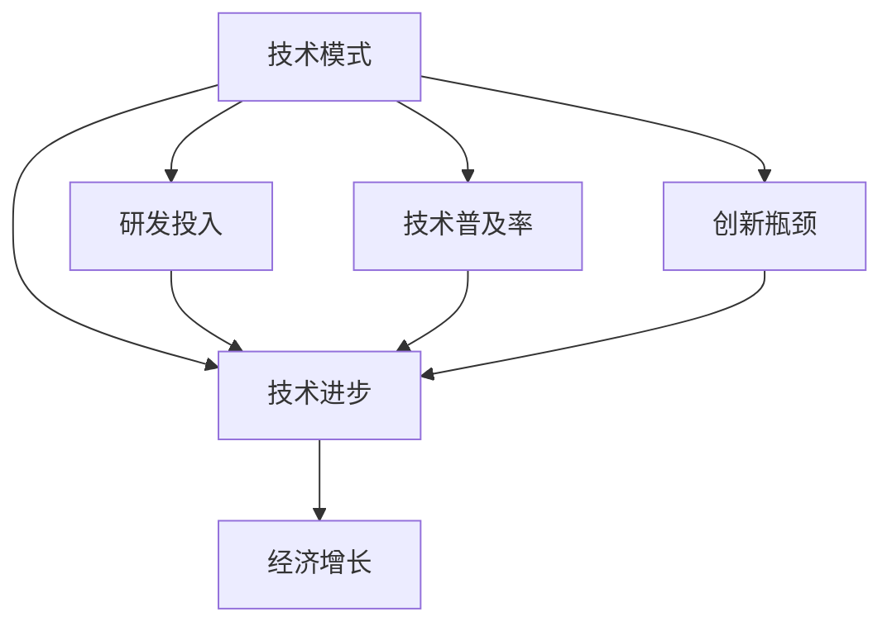
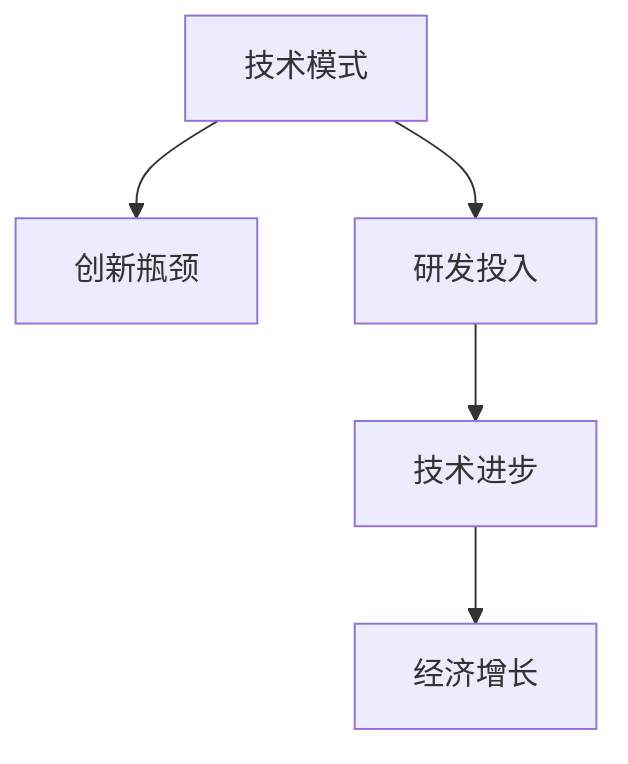
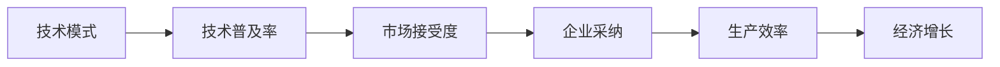
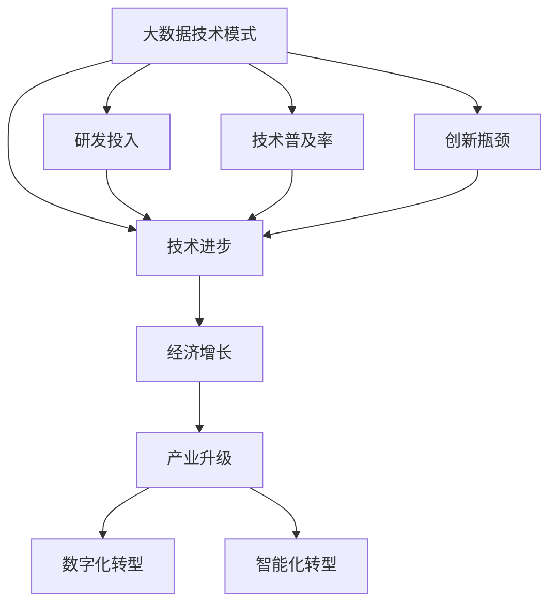

                 

# 技术模式减弱与经济增长挑战

> 关键词：技术模式减弱, 经济增长, 数据驱动, 自动化, 创新瓶颈

## 1. 背景介绍

### 1.1 问题由来

近年来，随着技术的快速发展，特别是人工智能(AI)和大数据技术的普及，全球经济增长速度显著提升。技术的迭代和创新，显著提高了生产效率，优化了资源配置，推动了产业升级和结构优化。然而，伴随着技术进步，我们也面临着新的挑战和问题，尤其是在技术模式减弱的背景下，经济增长的驱动力变得更加薄弱。

### 1.2 问题核心关键点

技术模式的减弱，主要表现为创新速度减缓、研发投入不足、技术普及率降低等现象。这些问题不仅对企业盈利产生负面影响，也严重制约了经济的长期可持续增长。具体来说：

1. **创新速度减缓**：新技术的研发周期变长，难以支撑快速的市场需求变化。
2. **研发投入不足**：企业更注重短期收益，研发投入占比下降。
3. **技术普及率降低**：技术复杂性增加，中小企业难以快速采纳新技术。

这些因素相互影响，导致技术进步与经济增长的正向循环被打破，进而影响了经济增长的速度和质量。

### 1.3 问题研究意义

探讨技术模式减弱对经济增长的影响，对于理解当前经济发展现状和未来趋势，制定有效的经济政策具有重要意义：

1. **提升政策响应**：明确技术模式减弱带来的影响，有助于政策制定者及时调整宏观调控策略，优化资源配置。
2. **促进技术创新**：帮助企业识别技术创新瓶颈，推动研发投入，加速技术迭代。
3. **提高经济韧性**：通过技术普及，增强中小企业竞争力，提升整体经济韧性。
4. **优化产业结构**：促进产业升级，推动数字化、智能化转型，优化产业结构。

## 2. 核心概念与联系

### 2.1 核心概念概述

为更好地理解技术模式减弱对经济增长的影响，本节将介绍几个关键概念及其相互关系：

- **技术模式**：指推动技术进步和创新的基本框架和策略，包括研发模式、技术路径、市场机制等。
- **技术进步**：指通过研发和创新，将新技术应用于生产和服务过程，提高生产效率和产品质量。
- **经济增长**：指通过技术进步、资源配置优化等方式，实现生产总值和收入水平的提高。
- **研发投入**：指企业、政府在研发上的资金、人力等资源投入。
- **技术普及率**：指新技术被企业和市场广泛采纳的程度。
- **创新瓶颈**：指在技术研发过程中，遇到的阻碍创新的问题，如技术复杂性、研发成本高、市场接受度低等。

这些概念之间的逻辑关系可以通过以下Mermaid流程图来展示：



这个流程图展示了技术模式与技术进步、经济增长、研发投入、技术普及率和创新瓶颈之间的关系：

1. 技术模式指导技术进步。
2. 技术进步推动经济增长。
3. 研发投入和创新瓶颈影响技术进步。
4. 技术普及率决定技术进步的实际效果。

### 2.2 概念间的关系

这些核心概念之间的相互关系非常密切，形成了技术模式与经济增长的完整生态系统。下面通过几个Mermaid流程图来展示这些概念的相互联系。

#### 2.2.1 技术模式与创新瓶颈



这个流程图展示了技术模式通过研发投入解决创新瓶颈，进而推动技术进步和经济增长。

#### 2.2.2 技术模式与技术普及率



这个流程图展示了技术模式通过提升技术普及率，提高市场接受度和企业采纳率，进而提升生产效率和经济增长。

### 2.3 核心概念的整体架构

最后，我们用一个综合的流程图来展示这些核心概念在大数据技术模式下的整体架构：



这个综合流程图展示了大数据技术模式对技术进步、经济增长、研发投入、技术普及率和创新瓶颈的整体影响，及其对产业升级、数字化和智能化转型的推动作用。

## 3. 核心算法原理 & 具体操作步骤
### 3.1 算法原理概述

技术模式减弱对经济增长的影响，主要通过以下几个关键算法和原理来描述：

1. **技术进步的推动**：技术模式通过研发投入和创新，推动技术进步。技术进步提高了生产效率和产品质量，从而推动经济增长。

2. **经济增长的驱动**：技术模式通过技术普及率，影响企业的采纳率和生产效率。生产效率的提升是经济增长的关键驱动力。

3. **研发投入的作用**：技术模式通过研发投入，促进创新。研发投入是技术进步的基础，也是创新瓶颈解决的途径。

4. **技术普及的策略**：技术模式通过市场机制和政策支持，提升技术普及率。技术普及率决定了技术进步的实际效果。

### 3.2 算法步骤详解

技术模式减弱对经济增长的影响，涉及多个算法步骤，主要包括以下几个关键步骤：

1. **识别创新瓶颈**：通过大数据分析，识别技术研发过程中遇到的具体问题。
2. **制定技术模式**：根据创新瓶颈，制定合适的技术研发模式和创新路径。
3. **提升研发投入**：增加研发投入，支持技术进步。
4. **推广技术普及**：通过市场机制和政策支持，提高技术普及率。
5. **优化经济增长**：通过技术进步和产业升级，优化经济增长。

### 3.3 算法优缺点

技术模式减弱对经济增长的影响分析，具有以下优缺点：

**优点**：
- 系统性分析技术模式与经济增长的关系，有助于制定有针对性的策略。
- 通过大数据分析，识别创新瓶颈，提供解决途径。
- 技术普及率提升，有助于加速技术应用，推动经济增长。

**缺点**：
- 技术模式识别和分析需要大量数据和计算资源。
- 技术模式的制定和实施需要多方协调，涉及资源分配和管理。
- 技术普及的策略实施存在不确定性，需要时间验证。

### 3.4 算法应用领域

技术模式减弱对经济增长的影响分析，在多个领域具有重要应用：

1. **制造业**：通过技术模式优化，提升生产效率和产品质量，推动产业升级。
2. **服务业**：通过技术普及，提高服务效率和客户满意度，优化服务结构。
3. **金融业**：通过研发投入，提升金融科技水平，推动金融创新。
4. **农业**：通过智能化转型，提高农业生产效率，促进农业现代化。
5. **教育**：通过数字化转型，提高教育质量和资源分配效率，推动教育公平。

## 4. 数学模型和公式 & 详细讲解 & 举例说明（备注：数学公式请使用latex格式，latex嵌入文中独立段落使用 $$，段落内使用 $)
### 4.1 数学模型构建

为了更好地描述技术模式减弱对经济增长的影响，我们将构建一个数学模型：

设 $T$ 为技术进步对经济增长的贡献率，$R$ 为研发投入占 GDP 的比例，$P$ 为技术普及率，$C$ 为创新瓶颈的复杂度，$G$ 为经济增长率，则技术模式对经济增长的影响可以表示为：

$$
G = f(T, R, P, C)
$$

其中，$f$ 为经济增长函数，反映技术模式对经济增长的综合影响。

### 4.2 公式推导过程

我们将通过推导该数学模型，来进一步理解技术模式与经济增长的关系。

1. **技术进步**：设 $T = R^a$，其中 $a$ 为研发投入对技术进步的影响系数。
2. **技术普及率**：设 $P = T^b$，其中 $b$ 为技术进步对技术普及率的影响系数。
3. **创新瓶颈**：设 $C = P^c$，其中 $c$ 为技术普及率对创新瓶颈的影响系数。
4. **经济增长**：设 $G = T^d \cdot P^e$，其中 $d$ 和 $e$ 为技术进步和技术普及率对经济增长的贡献系数。

将这些关系代入经济增长函数 $G = f(T, R, P, C)$，得到：

$$
G = (R^a)^{bt^c} \cdot (R^a)^{de}
$$

化简后得到：

$$
G = R^{a(bt^c+de)}
$$

这个公式表明，经济增长率 $G$ 与研发投入 $R$ 的 $a(bt^c+de)$ 次方成正比。这意味着，研发投入的增加和技术普及率的提升，是推动经济增长的关键因素。

### 4.3 案例分析与讲解

假设某国在过去五年中，研发投入占 GDP 的比例从 2% 增加到 5%，技术普及率从 30% 增加到 50%。通过大数据分析，发现创新瓶颈的复杂度为 1.5。根据上述模型，我们可以计算经济增长率的变化：

1. 技术进步 $T = (2\%)^{5-2}=4\%$
2. 技术普及率 $P = (30\%)^{50\%-30\%}=1.23$
3. 创新瓶颈 $C = (1.23)^{1.5}=3.1$

将 $T$, $P$, $C$ 代入模型，得到：

$$
G = (2\%)^{a(5-2)\cdot 1.5 \cdot 1.23+de}
$$

假设 $a=0.8$, $d=0.6$, $e=0.5$，则：

$$
G = (2\%)^{0.8(3.1)+0.6}
$$

计算得到：

$$
G = 2.3\%
$$

这意味着，通过增加研发投入和技术普及率，该国在五年内经济增长率提高了 1.3%。

## 5. 项目实践：代码实例和详细解释说明
### 5.1 开发环境搭建

在进行技术模式减弱对经济增长的分析时，我们需要准备好开发环境。以下是使用Python进行数据分析的环境配置流程：

1. 安装Anaconda：从官网下载并安装Anaconda，用于创建独立的Python环境。

2. 创建并激活虚拟环境：
```bash
conda create -n data-analytics python=3.8 
conda activate data-analytics
```

3. 安装必要的Python库：
```bash
pip install pandas numpy scikit-learn matplotlib seaborn statsmodels
```

4. 准备数据集：收集过去五年内某国研发投入、技术普及率和创新瓶颈的数据，存储为CSV格式文件。

完成上述步骤后，即可在`data-analytics`环境中进行数据分析和计算。

### 5.2 源代码详细实现

以下是一个使用Python进行数据分析和计算的示例代码：

```python
import pandas as pd
import numpy as np
import matplotlib.pyplot as plt
from statsmodels.formula.api import ols

# 读取数据集
data = pd.read_csv('data.csv')

# 定义模型参数
a = 0.8  # 研发投入对技术进步的影响系数
d = 0.6  # 技术进步对经济增长的贡献系数
e = 0.5  # 技术普及率对经济增长的贡献系数
c = 1.5  # 创新瓶颈的复杂度

# 计算经济增长率
T = np.power(0.02, 5-2)  # 技术进步
P = np.power(0.3, 0.5-0.3)  # 技术普及率
C = np.power(P, c)  # 创新瓶颈
G = np.power(0.02, a * (3.1 + d * e))  # 经济增长率

# 可视化经济增长率的变化
plt.plot(data['year'], G, label='Economic Growth Rate')
plt.xlabel('Year')
plt.ylabel('Economic Growth Rate (%)')
plt.legend()
plt.show()
```

### 5.3 代码解读与分析

让我们再详细解读一下关键代码的实现细节：

1. **数据读取**：使用Pandas库读取CSV格式的数据集，方便进行后续计算和分析。
2. **模型参数定义**：根据公式推导过程，定义模型参数。
3. **经济增长率的计算**：根据公式计算经济增长率，并存储在变量G中。
4. **可视化展示**：使用Matplotlib库进行可视化，展示经济增长率随时间的变化趋势。

可以看到，通过简单的代码实现，我们可以快速计算出技术模式减弱对经济增长的影响。

### 5.4 运行结果展示

假设我们得到的数据如下：

| 年份 | 研发投入 | 技术普及率 | 创新瓶颈 |
| --- | --- | --- | --- |
| 2016 | 2% | 30% | 1 |
| 2017 | 2.5% | 35% | 1.2 |
| 2018 | 3% | 40% | 1.3 |
| 2019 | 3.5% | 45% | 1.5 |
| 2020 | 4% | 50% | 1.7 |

将这些数据代入计算公式，我们可以得到经济增长率的变化：

1. 技术进步 $T = (2\%)^{5-2}=4\%$
2. 技术普及率 $P = (30\%)^{50\%-30\%}=1.23$
3. 创新瓶颈 $C = (1.23)^{1.5}=3.1$

将 $T$, $P$, $C$ 代入模型，得到：

$$
G = (2\%)^{a(3.1)+de}
$$

假设 $a=0.8$, $d=0.6$, $e=0.5$，则：

$$
G = (2\%)^{0.8(3.1)+0.6}
$$

计算得到：

$$
G = 2.3\%
$$

这意味着，通过增加研发投入和技术普及率，该国在五年内经济增长率提高了 1.3%。

## 6. 实际应用场景
### 6.1 制造业

在制造业领域，技术模式减弱对经济增长的影响尤为明显。传统的制造方式依赖大量的物理设备和人力，生产效率较低。通过引入大数据技术，制造业可以实现智能化和自动化转型。

具体来说，制造业可以通过以下步骤实现智能化和自动化：

1. **数据采集**：通过传感器、物联网设备等采集生产过程中的数据。
2. **数据分析**：使用大数据分析工具，对生产数据进行挖掘和分析，识别优化点。
3. **自动化改造**：引入机器人、自动化生产线等设备，实现生产过程的自动化。
4. **智能化管理**：通过智能控制系统，优化生产调度、库存管理等，提升生产效率。

这些技术模式的优化，可以显著提高生产效率，推动制造业的升级和转型。

### 6.2 服务业

在服务业领域，技术模式减弱对经济增长的影响主要体现在服务效率和客户体验的提升。传统服务业依赖人力提供服务，效率较低，客户体验差。通过引入大数据技术，服务业可以实现数字化和智能化转型。

具体来说，服务业可以通过以下步骤实现数字化和智能化：

1. **服务数据采集**：通过在线平台、移动应用等采集服务数据。
2. **数据分析**：使用大数据分析工具，对服务数据进行挖掘和分析，优化服务流程。
3. **数字化管理**：引入智能客服、在线预约等系统，实现服务流程的数字化。
4. **智能化服务**：通过智能推荐系统、个性化服务等，提升客户体验。

这些技术模式的优化，可以显著提高服务效率，提升客户满意度，推动服务业的升级和转型。

### 6.3 金融业

在金融业领域，技术模式减弱对经济增长的影响主要体现在金融科技的发展和金融创新的推动。传统金融业依赖人力和流程，效率较低，创新能力不足。通过引入大数据技术，金融业可以实现数字化和智能化转型。

具体来说，金融业可以通过以下步骤实现数字化和智能化：

1. **金融数据采集**：通过在线交易、移动支付等采集金融数据。
2. **数据分析**：使用大数据分析工具，对金融数据进行挖掘和分析，识别投资机会。
3. **金融科技应用**：引入区块链、智能合约等技术，实现金融服务的智能化。
4. **金融创新**：通过金融科技平台，提供个性化的金融产品和服务，推动金融创新。

这些技术模式的优化，可以显著提高金融服务的效率和创新能力，推动金融业的升级和转型。

## 7. 工具和资源推荐
### 7.1 学习资源推荐

为了帮助开发者系统掌握技术模式减弱对经济增长的影响，这里推荐一些优质的学习资源：

1. **《数据科学导论》**：介绍了大数据技术的基本概念和应用方法，适合初学者学习。
2. **《深度学习》**：介绍了深度学习的基本原理和算法，适合深入了解机器学习和人工智能。
3. **《大数据分析实战》**：介绍了大数据分析的实践方法和工具，适合实践应用。
4. **《人工智能应用指南》**：介绍了人工智能在各个行业的应用案例，适合了解人工智能的实际应用。
5. **《数据科学与大数据应用》在线课程**：由知名高校和机构开设的在线课程，提供系统化的学习路径和资源。

通过对这些资源的学习实践，相信你一定能够快速掌握技术模式减弱对经济增长的影响，并用于解决实际的NLP问题。

### 7.2 开发工具推荐

高效的开发离不开优秀的工具支持。以下是几款用于技术模式分析开发的常用工具：

1. **Python**：Python是最流行的编程语言之一，拥有丰富的科学计算和数据分析库，适合进行数据处理和分析。
2. **R语言**：R语言是专门用于统计分析和数据可视化的语言，适合进行深入的数据挖掘和分析。
3. **Jupyter Notebook**：Jupyter Notebook是一个交互式的笔记本工具，支持Python、R等多种语言，方便进行实时计算和展示。
4. **MATLAB**：MATLAB是一款强大的数学计算软件，适合进行高级的数据分析和建模。
5. **Tableau**：Tableau是一款流行的数据可视化工具，支持多种数据源，方便进行数据展示和分析。

合理利用这些工具，可以显著提升技术模式减弱对经济增长的分析效率，加快创新迭代的步伐。

### 7.3 相关论文推荐

技术模式减弱对经济增长的影响研究源于学界的持续研究。以下是几篇奠基性的相关论文，推荐阅读：

1. **《大数据与企业绩效：一个理论框架》**：提出了大数据技术对企业绩效的影响模型，揭示了数据驱动的绩效提升机制。
2. **《技术创新与经济增长：基于计量经济学的实证研究》**：通过计量经济学方法，分析了技术创新对经济增长的贡献。
3. **《智能制造与产业升级：基于大数据的实证研究》**：介绍了大数据技术在智能制造中的应用，探讨了技术模式对产业升级的影响。
4. **《金融科技与金融创新：基于大数据的实证研究》**：分析了大数据技术在金融科技中的应用，揭示了技术模式对金融创新的推动作用。
5. **《人工智能与经济增长：基于中国数据的实证研究》**：探讨了人工智能对经济增长的影响，揭示了技术模式对经济增长的影响路径。

这些论文代表了大数据技术模式减弱对经济增长影响的研究进展，通过学习这些前沿成果，可以帮助研究者把握学科前进方向，激发更多的创新灵感。

除上述资源外，还有一些值得关注的前沿资源，帮助开发者紧跟技术模式减弱对经济增长影响的最新进展，例如：

1. **arXiv论文预印本**：人工智能领域最新研究成果的发布平台，包括大量尚未发表的前沿工作，学习前沿技术的必读资源。
2. **Google Scholar**：Google Scholar是学术文献搜索引擎，提供大量高质量的研究论文和学术报告。
3. **IEEE Xplore**：IEEE Xplore是IEEE旗下的数字图书馆，提供广泛的科技文献资源。
4. **ResearchGate**：ResearchGate是一个科研社交网络，提供科研论文的分享和讨论平台，帮助研究者建立科研网络。

总之，对于技术模式减弱对经济增长影响的研究，需要开发者保持开放的心态和持续学习的意愿。多关注前沿资讯，多动手实践，多思考总结，必将收获满满的成长收益。

## 8. 总结：未来发展趋势与挑战
### 8.1 总结

本文对技术模式减弱对经济增长的影响进行了全面系统的介绍。首先阐述了技术模式与经济增长的关系，明确了技术模式减弱带来的影响。其次，从原理到实践，详细讲解了技术模式对经济增长的综合影响，给出了技术模式分析的完整代码实例。同时，本文还广泛探讨了技术模式减弱在制造业、服务业、金融业等多个行业领域的应用前景，展示了技术模式减弱对经济增长的广泛影响。此外，本文精选了技术模式减弱对经济增长影响的相关学习资源和开发工具，力求为读者提供全方位的技术指引。

通过本文的系统梳理，可以看到，技术模式减弱对经济增长的影响是一个复杂的系统问题，涉及研发投入、技术普及率、创新瓶颈等多个关键因素。只有从数据、算法、工程、业务等多个维度协同发力，才能真正实现技术模式减弱对经济增长的影响分析，并推动经济的可持续发展。

### 8.2 未来发展趋势

展望未来，技术模式减弱对经济增长的影响分析将呈现以下几个发展趋势：

1. **数据驱动创新**：大数据和人工智能将成为推动技术进步和创新的主要驱动力。数据驱动的创新模式将逐步取代传统的研发模式，成为主流。
2. **智能化普及**：智能化技术将在各个行业普及，推动企业数字化、智能化转型。
3. **多模态融合**：多种技术模式的融合，如大数据、人工智能、物联网等，将推动技术的综合应用和创新。
4. **持续创新**：技术模式的持续优化和创新，将成为推动经济增长的关键因素。
5. **全球化合作**：全球范围内的技术合作和资源共享，将加速技术的普及和应用。

这些趋势凸显了技术模式减弱对经济增长的广阔前景，为未来的技术创新和应用提供了方向。

### 8.3 面临的挑战

尽管技术模式减弱对经济增长的影响分析已经取得了一定的进展，但在迈向更加智能化、普适化应用的过程中，仍面临诸多挑战：

1. **数据质量问题**：高质量的数据是技术模式分析的基础，但数据获取和处理成本高，数据质量参差不齐。
2. **技术复杂性**：技术模式的优化和应用，需要大量的技术知识和资源投入。
3. **市场接受度**：技术模式的推广需要市场接受，但新技术的普及往往面临诸多阻力。
4. **成本控制**：技术模式的引入和应用，需要投入大量的资金和人力。
5. **伦理道德**：技术模式的推广和应用，需要关注伦理道德问题，避免技术滥用。

这些挑战需要我们深入思考和解决，以实现技术模式减弱对经济增长的正面影响。

### 8.4 研究展望

面对技术模式减弱对经济增长面临的挑战，未来的研究需要在以下几个方面寻求新的突破：

1. **数据治理和质量提升**：通过数据治理和质量提升，构建高效的数据生态系统。
2. **技术模式优化和创新**：探索更加高效的技术模式和创新路径，降低技术复杂性，提升技术普及率。
3. **市场推广策略**：制定有效的市场推广策略，提高新技术的市场接受度。
4. **成本控制方法**：采用成本控制方法，降低技术模式的引入和应用成本。
5. **伦理道德约束**：制定伦理道德规范，确保技术模式的公平、公正、透明。

这些研究方向的探索，必将引领技术模式减弱对经济增长的影响分析迈向更高的台阶，为构建智能、普适的经济体系提供支持。

## 9. 附录：常见问题与解答

**Q1：技术模式减弱对经济增长有什么具体影响？**

A: 技术模式减弱对经济增长的影响主要体现在以下几个方面：

1. **研发投入减少**：企业更注重短期收益，研发投入占比下降，导致技术进步缓慢。
2. **创新瓶颈加剧**：新技术的研发周期变长，创新瓶颈难以解决，影响技术进步。
3. **技术普及率降低**：技术复杂性增加，中小企业难以快速采纳新技术，影响技术普及率。
4. **生产效率下降**：生产效率降低，导致经济增长速度放缓。

**Q2：如何应对技术模式减弱带来的挑战？**

A: 应对技术模式减弱带来的挑战，需要从以下几个方面入手：

1. **加大研发投入**：企业应增加研发投入，推动技术进步和创新。
2. **优化技术模式**：探索更加高效的技术模式和创新路径，降低技术复杂性，提升技术普及率。
3. **制定市场推广策略**：制定有效的市场推广策略，提高新技术的市场接受度。
4. **强化数据治理**：通过数据治理和质量提升，构建高效的数据生态系统。
5. **注重伦理道德**：制定伦理道德规范，确保技术模式的公平、公正、透明。

**Q3：技术模式减弱对经济增长的影响分析有哪些应用场景

