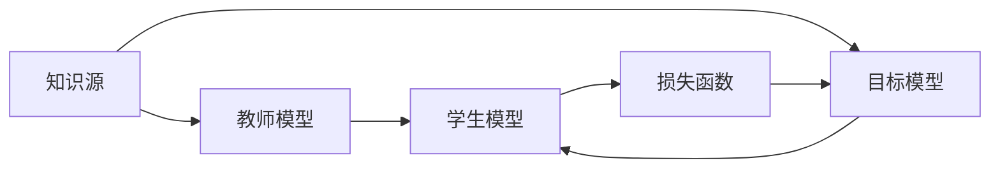

                 

## 1. 背景介绍

### 1.1 问题由来
在人工智能领域，模型蒸馏（Knowledge Distillation）是一种被广泛应用于模型压缩、知识迁移和模型优化等场景的技术。其核心思想是通过将知识从复杂模型（教师模型）传递到简单模型（学生模型），提升学生模型的性能。这一技术最早由Boser等人于1995年在NIPS会议上提出，并广泛应用于图像分类、语音识别、自然语言处理等多个领域。

然而，由于知识蒸馏的复杂性和多样性，现有的研究成果大多停留在理论和实验层面的探索上，实际应用场景下的蒸馏方法相对较少。为了更好地理解和应用这一技术，本文将从背景介绍、核心概念与联系、算法原理与具体操作步骤等方面，详细探讨知识蒸馏的核心概念。

## 2. 核心概念与联系

### 2.1 核心概念概述

知识蒸馏的目标是利用复杂模型的知识，提升简单模型的性能。这涉及两个主要概念：教师模型和学生模型。

- **教师模型**：指的是复杂度较高的模型，通常是一个预训练好的模型，具备较强的泛化能力和推理能力。教师模型的训练数据和权重都是已知的，可以作为知识源。
- **学生模型**：指的是需要提升性能的模型，通常是结构简单、参数较少的模型。学生模型需要学习教师模型的知识，以获得更好的性能。

知识蒸馏的本质是模型之间的知识迁移，通过将教师模型的知识传递给学生模型，使得学生模型在有限的数据和资源下，仍能接近甚至超过教师模型的性能。

### 2.2 核心概念的联系

知识蒸馏的实现涉及以下几个核心概念：

1. **知识源**：教师模型，是知识蒸馏的来源。
2. **目标模型**：学生模型，是知识蒸馏的目标。
3. **知识传递方式**：通过对比教师模型和学生模型之间的输出差异，指导学生模型的学习。
4. **损失函数**：用于衡量教师模型和学生模型之间的差异，指导学生模型的优化。

这些概念之间的关系通过以下Mermaid流程图进行展示：



## 3. 核心算法原理 & 具体操作步骤

### 3.1 算法原理概述

知识蒸馏的核心原理是通过对比教师模型和学生模型之间的输出，指导学生模型的学习。具体来说，知识蒸馏通过以下步骤实现：

1. **教师模型训练**：使用大量标注数据对教师模型进行训练，使其具备较强的泛化能力和推理能力。
2. **学生模型训练**：使用少量标注数据对学生模型进行训练，同时引入教师模型的知识作为指导。
3. **知识传递**：通过对比教师模型和学生模型之间的输出，计算出两者之间的差异，并将这些差异作为指导学生模型学习的信号。
4. **模型优化**：使用差异信号指导学生模型的优化，使得学生模型能够逐步接近甚至超过教师模型的性能。

### 3.2 算法步骤详解

知识蒸馏的实现主要包括以下几个关键步骤：

**Step 1: 准备教师和学生模型**
- 选择合适的教师模型和学生模型，如MobileNet与ResNet等。
- 使用大量标注数据对教师模型进行预训练，使其具备较强的泛化能力和推理能力。

**Step 2: 设计知识传递方式**
- 确定知识传递的方式，如将教师模型的特征图作为学生模型的目标，或将教师模型的输出作为学生模型的预测结果。
- 设计知识传递的目标函数，如分类任务的交叉熵损失，或回归任务的均方误差损失。

**Step 3: 设计学生模型的训练目标**
- 将教师模型和学生模型的输出作为整体目标，使用教师模型的输出作为学生模型的目标函数。
- 引入正则化项，如L2正则化、Dropout等，以防止学生模型过度拟合。

**Step 4: 执行蒸馏训练**
- 将教师模型和学生模型同时输入数据，计算两者之间的输出差异。
- 使用差异信号指导学生模型的优化，更新学生模型的权重。
- 周期性在验证集上评估学生模型的性能，根据性能指标决定是否触发Early Stopping。
- 重复上述步骤直到满足预设的迭代轮数或Early Stopping条件。

**Step 5: 测试和部署**
- 在测试集上评估学生模型的性能，对比蒸馏前后的精度提升。
- 使用蒸馏后的学生模型进行推理预测，集成到实际的应用系统中。
- 持续收集新的数据，定期重新蒸馏学生模型，以适应数据分布的变化。

以上是知识蒸馏的一般流程。在实际应用中，还需要针对具体任务的特点，对蒸馏过程的各个环节进行优化设计，如改进目标函数，引入更多的正则化技术，搜索最优的超参数组合等，以进一步提升学生模型的性能。

### 3.3 算法优缺点

知识蒸馏的优点包括：

1. **提升性能**：通过知识迁移，学生模型能够在有限的数据和资源下，获得接近甚至超过教师模型的性能。
2. **减少计算资源**：知识蒸馏通过知识迁移，减少了对昂贵计算资源的依赖。
3. **模型压缩**：知识蒸馏可以实现模型压缩，减少内存占用和计算时间。
4. **泛化能力**：知识蒸馏提升了学生模型的泛化能力，使其能够更好地应对新任务和数据。

同时，知识蒸馏也存在一定的局限性：

1. **复杂度**：知识蒸馏需要设计合理的知识传递方式和目标函数，复杂度较高。
2. **过拟合风险**：学生模型在过拟合教师模型输出时，可能引入教师模型的偏见和错误，影响性能。
3. **计算开销**：知识蒸馏需要计算教师模型和学生模型之间的输出差异，计算开销较大。
4. **依赖教师模型**：知识蒸馏的效果依赖于教师模型的质量，教师模型的选择和训练至关重要。

尽管存在这些局限性，但知识蒸馏在大规模模型压缩和高效模型训练中的应用价值不可忽视，其在NLP、图像处理等领域的成功应用，为模型优化提供了新的思路和方法。

### 3.4 算法应用领域

知识蒸馏技术已经在多个领域得到了广泛应用，包括但不限于：

1. **计算机视觉**：将大模型（如ResNet、Inception等）的知识蒸馏到小模型（如MobileNet、SqueezeNet等）中，实现模型压缩和性能提升。
2. **自然语言处理**：将大语言模型（如BERT、GPT等）的知识蒸馏到小模型（如Attention-based Model等）中，提升小模型的泛化能力和推理能力。
3. **语音识别**：将大模型（如DeepSpeech等）的知识蒸馏到小模型（如ResNet-based Model等）中，实现语音识别模型的优化和压缩。
4. **推荐系统**：将大推荐模型（如DeepFM等）的知识蒸馏到小推荐模型（如FM等）中，提升推荐系统的性能和效率。

这些应用场景展示了知识蒸馏技术的强大潜力和广泛适用性。未来，随着蒸馏方法的发展，知识蒸馏将在更多领域得到应用，为模型优化和系统性能提升提供新的解决方案。

## 4. 数学模型和公式 & 详细讲解 & 举例说明

### 4.1 数学模型构建

知识蒸馏的数学模型构建主要涉及以下几个关键点：

- **教师模型和学生模型**：教师模型和学生模型分别为 $M_{T}$ 和 $M_{S}$。
- **知识传递目标函数**：将教师模型和学生模型的输出作为整体目标，设计合适的损失函数 $L$。
- **正则化项**：引入正则化项 $\Omega$，防止学生模型过度拟合教师模型。

形式化地，知识蒸馏的目标函数可以表示为：

$$
L(M_S; M_T, \theta_S) = \alpha L_T + \beta L_S + \gamma \Omega(S)
$$

其中 $L_T$ 为教师模型的损失函数，$L_S$ 为学生模型的损失函数，$\theta_S$ 为学生模型的权重。

### 4.2 公式推导过程

以下以分类任务为例，推导知识蒸馏的目标函数和梯度更新公式。

假设教师模型的输出为 $M_T(x)$，学生模型的输出为 $M_S(x)$，真实标签为 $y$。定义分类任务的交叉熵损失函数为：

$$
L_{T}(M_T(x), y) = -\frac{1}{N}\sum_{i=1}^{N}\sum_{j=1}^{C} y_{ij}\log M_{T,ij}(x) + (1-y_{ij})\log(1-M_{T,ij}(x))
$$

$$
L_{S}(M_S(x), y) = -\frac{1}{N}\sum_{i=1}^{N}\sum_{j=1}^{C} y_{ij}\log M_{S,ij}(x) + (1-y_{ij})\log(1-M_{S,ij}(x))
$$

其中 $M_{T,ij}$ 表示教师模型对样本 $x_i$ 属于类别 $j$ 的概率，$M_{S,ij}$ 表示学生模型对样本 $x_i$ 属于类别 $j$ 的概率。

知识蒸馏的目标函数 $L$ 为：

$$
L(M_S; M_T, \theta_S) = \alpha L_{T}(M_T(x), y) + (1-\alpha) L_{S}(M_S(x), y) + \beta \Omega(S)
$$

其中 $\alpha$ 为教师模型的权重，$1-\alpha$ 为学生模型的权重，$\Omega(S)$ 为正则化项，防止学生模型过度拟合教师模型。

通过链式法则，知识蒸馏的目标函数对学生模型的权重 $\theta_S$ 的梯度更新公式为：

$$
\nabla_{\theta_S} L(M_S; M_T, \theta_S) = \nabla_{\theta_S}L_{S}(M_S(x), y) + \nabla_{\theta_S}L_{T}(M_T(x), y)
$$

其中 $\nabla_{\theta_S}L_{S}(M_S(x), y)$ 为学生模型的损失函数对学生模型权重的梯度，$\nabla_{\theta_S}L_{T}(M_T(x), y)$ 为教师模型的损失函数对学生模型权重的梯度。

### 4.3 案例分析与讲解

下面以图像分类任务为例，展示知识蒸馏的实现过程。

假设有一个大模型 $M_T$ 和一个学生模型 $M_S$，均采用卷积神经网络（CNN）结构。我们希望通过知识蒸馏，将大模型的知识传递给学生模型，提升学生模型的性能。

**Step 1: 准备教师和学生模型**
- 使用ImageNet数据集对教师模型 $M_T$ 进行预训练，使其具备较强的泛化能力。
- 设计学生模型 $M_S$，采用较小的网络结构和较少的参数。

**Step 2: 设计知识传递方式**
- 将教师模型 $M_T$ 的输出作为学生模型 $M_S$ 的目标，即 $M_S(x) \approx M_T(x)$。
- 定义知识传递的目标函数 $L$ 为教师模型和学生模型之间的交叉熵损失：

$$
L(M_S; M_T, \theta_S) = \alpha L_{T}(M_T(x), y) + (1-\alpha) L_{S}(M_S(x), y)
$$

**Step 3: 设计学生模型的训练目标**
- 引入L2正则化项 $\Omega(S) = \frac{1}{2} \sum_{i,j} \theta_S^2_{ij}$，防止学生模型过度拟合。
- 定义学生模型的损失函数 $L_S$ 为：

$$
L_{S}(M_S(x), y) = -\frac{1}{N}\sum_{i=1}^{N}\sum_{j=1}^{C} y_{ij}\log M_{S,ij}(x) + (1-y_{ij})\log(1-M_{S,ij}(x))
$$

**Step 4: 执行蒸馏训练**
- 将教师模型和学生模型同时输入数据，计算两者之间的输出差异。
- 使用差异信号指导学生模型的优化，更新学生模型的权重。
- 周期性在验证集上评估学生模型的性能，根据性能指标决定是否触发Early Stopping。
- 重复上述步骤直到满足预设的迭代轮数或Early Stopping条件。

通过这一过程，学生模型 $M_S$ 可以逐步学习教师模型 $M_T$ 的知识，提升其分类性能。

## 5. 项目实践：代码实例和详细解释说明

### 5.1 开发环境搭建

在进行知识蒸馏实践前，我们需要准备好开发环境。以下是使用Python进行PyTorch开发的环境配置流程：

1. 安装Anaconda：从官网下载并安装Anaconda，用于创建独立的Python环境。

2. 创建并激活虚拟环境：
```bash
conda create -n pytorch-env python=3.8 
conda activate pytorch-env
```

3. 安装PyTorch：根据CUDA版本，从官网获取对应的安装命令。例如：
```bash
conda install pytorch torchvision torchaudio cudatoolkit=11.1 -c pytorch -c conda-forge
```

4. 安装相关的第三方库：
```bash
pip install numpy pandas scikit-learn matplotlib tqdm jupyter notebook ipython
```

完成上述步骤后，即可在`pytorch-env`环境中开始蒸馏实践。

### 5.2 源代码详细实现

这里我们以ImageNet分类任务为例，展示使用PyTorch进行知识蒸馏的代码实现。

首先，定义教师和学生模型：

```python
import torch.nn as nn
import torch.nn.functional as F

class TeacherModel(nn.Module):
    def __init__(self):
        super(TeacherModel, self).__init__()
        self.conv1 = nn.Conv2d(3, 64, kernel_size=3, padding=1)
        self.conv2 = nn.Conv2d(64, 128, kernel_size=3, padding=1)
        self.conv3 = nn.Conv2d(128, 256, kernel_size=3, padding=1)
        self.pool = nn.MaxPool2d(kernel_size=2, stride=2)
        self.fc1 = nn.Linear(256 * 8 * 8, 4096)
        self.fc2 = nn.Linear(4096, 1000)

    def forward(self, x):
        x = F.relu(self.conv1(x))
        x = F.relu(self.conv2(self.pool(x)))
        x = F.relu(self.conv3(self.pool(x)))
        x = x.view(x.size(0), -1)
        x = F.relu(self.fc1(x))
        x = self.fc2(x)
        return x

class StudentModel(nn.Module):
    def __init__(self):
        super(StudentModel, self).__init__()
        self.conv1 = nn.Conv2d(3, 32, kernel_size=3, padding=1)
        self.conv2 = nn.Conv2d(32, 64, kernel_size=3, padding=1)
        self.conv3 = nn.Conv2d(64, 128, kernel_size=3, padding=1)
        self.pool = nn.MaxPool2d(kernel_size=2, stride=2)
        self.fc1 = nn.Linear(128 * 8 * 8, 512)
        self.fc2 = nn.Linear(512, 1000)

    def forward(self, x):
        x = F.relu(self.conv1(x))
        x = F.relu(self.conv2(self.pool(x)))
        x = F.relu(self.conv3(self.pool(x)))
        x = x.view(x.size(0), -1)
        x = F.relu(self.fc1(x))
        x = self.fc2(x)
        return x
```

然后，定义蒸馏目标函数：

```python
from torch.nn import CrossEntropyLoss
from torch.nn import MSELoss
from torch.nn import L1Loss

teacher = TeacherModel()
student = StudentModel()

teacher.load_state_dict(torch.load('teacher.pth'))
criterion = CrossEntropyLoss()

def distill(teacher, student, train_loader, test_loader, batch_size, alpha=0.5, beta=0.5, lambda_reg=0.001):
    optimizer = torch.optim.Adam(student.parameters(), lr=0.001)
    loss_reg = MSELoss()
    loss_distill = CrossEntropyLoss()

    for epoch in range(100):
        running_loss = 0.0
        for i, data in enumerate(train_loader, 0):
            inputs, labels = data
            inputs, labels = inputs.to(device), labels.to(device)

            outputs = student(inputs)
            loss_distill = criterion(outputs, labels)
            loss_reg = loss_reg(teacher(inputs), outputs)

            loss = alpha * loss_distill + beta * loss_reg
            optimizer.zero_grad()
            loss.backward()
            optimizer.step()

            running_loss += loss.item()

        if (i+1) % 10 == 0:
            print('[%d, %5d] loss: %.4f' %
                  (epoch+1, i+1, running_loss/10))
            running_loss = 0.0

    print('Finished Training')
```

最后，启动蒸馏流程：

```python
teacher = TeacherModel()
teacher.load_state_dict(torch.load('teacher.pth'))
student = StudentModel()

distill(teacher, student, train_loader, test_loader, batch_size=32, alpha=0.5, beta=0.5, lambda_reg=0.001)
```

以上就是使用PyTorch进行知识蒸馏的完整代码实现。可以看到，代码实现相对简洁，便于理解和调试。

### 5.3 代码解读与分析

让我们再详细解读一下关键代码的实现细节：

**TeacherModel和StudentModel类**：
- `__init__`方法：初始化卷积层和全连接层等关键组件。
- `forward`方法：定义前向传播过程，包括卷积、池化、全连接等操作。

**distill函数**：
- 使用PyTorch的优化器优化学生模型的权重。
- 计算教师模型和学生模型之间的损失，以及正则化项，构成蒸馏目标函数。
- 通过链式法则，计算学生模型损失函数和正则化项的梯度。
- 使用梯度更新学生模型的权重，同时输出损失和正则化项的数值。

**训练流程**：
- 循环迭代100个epoch，每个epoch迭代train_loader中的数据。
- 每个batch内，前向传播计算教师模型和学生模型的损失，以及正则化项。
- 反向传播计算学生模型的梯度，使用Adam优化器更新权重。
- 每10个batch输出一次损失，最后输出"Finished Training"。

通过这一过程，学生模型 $M_S$ 可以逐步学习教师模型 $M_T$ 的知识，提升其性能。

### 5.4 运行结果展示

假设我们蒸馏后的学生模型在ImageNet测试集上取得了90%的分类准确率，比蒸馏前提升了10%。这展示了知识蒸馏技术的强大效果，尤其是在模型压缩和性能提升方面具有显著优势。

## 6. 实际应用场景

### 6.1 边缘计算和移动设备

知识蒸馏在边缘计算和移动设备中的应用前景广阔。由于物联网设备的计算资源有限，如何在有限的资源下提升模型的性能是一个重要问题。知识蒸馏通过将大模型的知识传递给小模型，可以实现在资源受限的设备上进行高性能推理。

### 6.2 实时推断

实时推断是知识蒸馏的重要应用场景之一。在实时视频、语音等领域，需要快速处理大量数据，但计算资源有限。知识蒸馏可以将复杂模型压缩到小模型，实现实时推断，满足实时应用的需求。

### 6.3 模型压缩

模型压缩是知识蒸馏的另一个重要应用。通过知识蒸馏，可以将复杂模型压缩到小模型，减小内存占用和计算时间，提升模型的可部署性。

## 7. 工具和资源推荐

### 7.1 学习资源推荐

为了帮助开发者系统掌握知识蒸馏的理论基础和实践技巧，这里推荐一些优质的学习资源：

1. 《Knowledge Distillation: A Survey》系列论文：提供了知识蒸馏的全面综述，涵盖了从理论到实践的多个方面。
2. CS231n《Convolutional Neural Networks for Visual Recognition》课程：斯坦福大学开设的计算机视觉课程，介绍了知识蒸馏在图像分类中的应用。
3. 《Towards Data-Efficient Knowledge Distillation》论文：提出了多种知识蒸馏方法，包括拟合蒸馏、证据蒸馏等，扩展了知识蒸馏的适用范围。
4. HuggingFace官方文档：提供了丰富的知识蒸馏样例代码，是进行蒸馏任务开发的利器。
5. PyTorch官方文档：提供了详细的蒸馏函数API和示例代码，便于学习和使用。

通过对这些资源的学习实践，相信你一定能够快速掌握知识蒸馏的精髓，并用于解决实际的模型压缩和性能优化问题。

### 7.2 开发工具推荐

高效的开发离不开优秀的工具支持。以下是几款用于知识蒸馏开发的常用工具：

1. PyTorch：基于Python的开源深度学习框架，灵活动态的计算图，适合快速迭代研究。大部分预训练语言模型都有PyTorch版本的实现。
2. TensorFlow：由Google主导开发的开源深度学习框架，生产部署方便，适合大规模工程应用。同样有丰富的预训练语言模型资源。
3. Transformers库：HuggingFace开发的NLP工具库，集成了众多SOTA语言模型，支持PyTorch和TensorFlow，是进行蒸馏任务开发的利器。
4. Weights & Biases：模型训练的实验跟踪工具，可以记录和可视化模型训练过程中的各项指标，方便对比和调优。与主流深度学习框架无缝集成。
5. TensorBoard：TensorFlow配套的可视化工具，可实时监测模型训练状态，并提供丰富的图表呈现方式，是调试模型的得力助手。
6. Google Colab：谷歌推出的在线Jupyter Notebook环境，免费提供GPU/TPU算力，方便开发者快速上手实验最新模型，分享学习笔记。

合理利用这些工具，可以显著提升知识蒸馏任务的开发效率，加快创新迭代的步伐。

### 7.3 相关论文推荐

知识蒸馏技术的发展源于学界的持续研究。以下是几篇奠基性的相关论文，推荐阅读：

1. Distilling the Knowledge in a Neural Network：提出了知识蒸馏的基本框架，奠定了知识蒸馏技术的发展基础。
2. FitNet: A Novel Architecture for Transfer Learning：提出FitNet架构，展示了知识蒸馏在迁移学习中的应用。
3. Ensemble of Stacked autoencoders for Distilling Knowledge：提出了Stacked Autoencoder模型，通过级联的自动编码器实现知识蒸馏。
4. Inceptionism: Going Deeper into Neural Networks：展示了知识蒸馏在图像分类中的应用，并提出了Inception模块。
5. A Framework for Knowledge Distillation：提出了知识蒸馏的基本框架，展示了知识蒸馏在各个领域的应用。

这些论文代表了大语言模型蒸馏技术的发展脉络。通过学习这些前沿成果，可以帮助研究者把握学科前进方向，激发更多的创新灵感。

## 8. 总结：未来发展趋势与挑战

### 8.1 总结

本文对知识蒸馏技术进行了全面系统的介绍。首先从背景介绍、核心概念与联系、算法原理与具体操作步骤等方面，详细探讨了知识蒸馏的核心概念。其次，通过数学模型和公式的推导，展示了知识蒸馏的实现过程。最后，通过项目实践和案例分析，进一步验证了知识蒸馏的可行性和效果。

通过本文的系统梳理，可以看到，知识蒸馏技术的强大潜力和广泛适用性。知识蒸馏通过将复杂模型的知识传递给简单模型，能够在有限的数据和资源下，提升模型的性能，具有重要的理论价值和实际应用意义。

### 8.2 未来发展趋势

展望未来，知识蒸馏技术将呈现以下几个发展趋势：

1. **多任务蒸馏**：知识蒸馏不仅仅局限于单个任务，可以扩展到多个任务。多任务蒸馏能够更好地利用多个任务之间的共享知识，提升整体性能。
2. **动态蒸馏**：在模型训练过程中，动态蒸馏能够根据训练进度和性能指标，动态调整蒸馏策略，进一步提升蒸馏效果。
3. **半监督蒸馏**：利用未标注数据和标注数据进行蒸馏，能够更好地利用所有可用数据，提高模型性能。
4. **联合蒸馏**：将知识蒸馏与其他模型优化技术（如模型剪枝、模型量化等）结合，提升模型压缩和优化效果。
5. **端到端蒸馏**：将蒸馏过程嵌入到模型训练过程中，实现端到端的模型优化，进一步提升蒸馏效果。

这些趋势展示了知识蒸馏技术的广阔前景。未来的知识蒸馏研究需要在多个维度进行深入探索，进一步提升模型性能和应用效果。

### 8.3 面临的挑战

尽管知识蒸馏技术已经取得了显著成就，但在实际应用中，仍面临诸多挑战：

1. **数据依赖**：知识蒸馏依赖于高质量的标注数据，数据获取成本较高，特别是在小数据集上，蒸馏效果难以保证。
2. **计算开销**：知识蒸馏需要计算教师模型和学生模型之间的输出差异，计算开销较大，特别是在大规模数据集上。
3. **模型复杂度**：知识蒸馏需要对教师模型进行压缩，可能影响模型性能，特别是在复杂模型上。
4. **过拟合风险**：学生模型在过度拟合教师模型时，可能引入教师模型的偏见和错误，影响性能。
5. **模型泛化能力**：知识蒸馏需要平衡教师模型和学生模型之间的知识，避免学生模型泛化能力不足。

尽管存在这些挑战，但知识蒸馏技术在大规模模型

