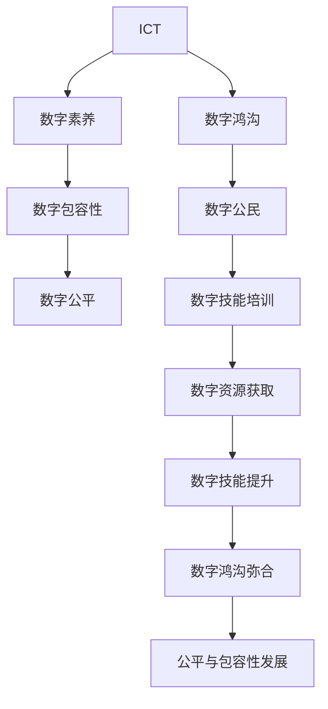
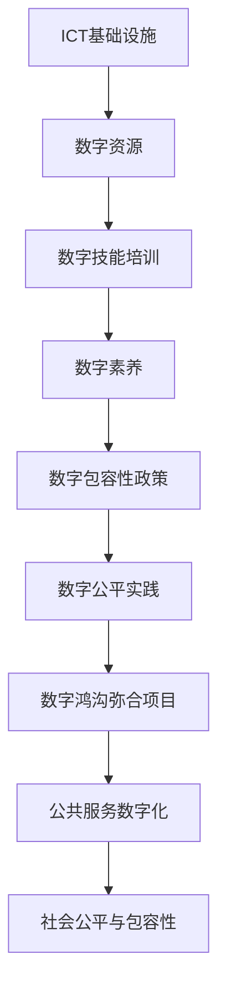

                 

# 数字鸿沟：弥合人类计算中的不平等现象

## 1. 背景介绍

### 1.1 问题由来

数字鸿沟（Digital Divide），是指由于信息通讯技术（ICT）的应用和发展不均衡，导致不同社会群体在获取信息、使用科技产品和服务等方面的巨大差异。这一现象最早由美国国家远程通信和信息管理局（NTIA）于1995年提出，旨在揭示技术应用带来的社会不平等问题。

随着信息技术的迅猛发展和普及，数字鸿沟的影响范围已从信息获取扩展到教育、就业、医疗、金融等各个方面。特别是新冠疫情的爆发，加速了数字化的进程，进一步凸显了数字鸿沟的存在，导致不同群体之间的差距越来越大。

### 1.2 问题核心关键点

数字鸿沟的核心关键点在于：
- **信息获取不均**：部分人群由于经济、教育、地域等原因，无法获取到互联网和相关服务，与数字化环境隔绝。
- **技能差异显著**：即便能够接触到ICT技术，不同人群在使用技能和知识上存在巨大差异，导致数字鸿沟的持续存在。
- **数字资源不平等**：高质量的数字内容（如图书、课程、数据库）往往集中在少数富裕地区和组织中，增加了普通群体的获取难度。
- **社会经济地位影响**：数字鸿沟与社会经济地位密切相关，收入高、教育水平高的群体更易接触和使用ICT技术。
- **技术普及不均**：偏远地区和农村地区的ICT基础设施建设不足，导致技术普及不均衡。

这些关键点共同作用，形成了当今社会广泛存在的数字鸿沟，成为推动社会公平与进步的重要障碍。

### 1.3 问题研究意义

研究数字鸿沟及其弥合方法，对于促进社会公平、推动包容性发展具有重要意义：
- **缩小差距**：通过技术普及和技能培训，帮助弱势群体获取信息和技能，缩小数字鸿沟。
- **促进就业**：增加数字技能，提升就业竞争力和就业机会。
- **提升教育**：提供线上教育资源，促进教育平等和普及。
- **改善医疗**：利用远程医疗服务，提高医疗服务的可及性和质量。
- **促进经济发展**：提升企业和产业的数字能力，推动经济增长。

此外，研究数字鸿沟也有助于揭示技术的社会影响，推动科技伦理和社会责任的发展。

## 2. 核心概念与联系

### 2.1 核心概念概述

为了更好地理解数字鸿沟及其弥合方法，本节将介绍几个密切相关的核心概念：

- **信息通讯技术（ICT）**：指计算机、互联网、移动通信等技术的总称，是现代信息社会的基础设施。
- **数字素养（Digital Literacy）**：指个人在数字环境中获取、处理、使用信息的能力，包括计算机操作、网络使用、信息分析等技能。
- **数字包容性（Digital Inclusion）**：指确保所有人都能平等、无障碍地使用ICT技术，享受数字化红利。
- **数字公平（Digital Equity）**：指在数字资源的获取、使用和收益分配方面实现公平，消除数字鸿沟。
- **数字公民（Digital Citizen）**：指能够积极、有效使用ICT技术的现代公民，具备数字意识和数字能力。

这些核心概念之间存在着紧密的联系，形成了数字鸿沟及其弥合的整体框架。

### 2.2 概念间的关系

这些核心概念之间的关系可以通过以下Mermaid流程图来展示：



这个流程图展示了从ICT技术到数字公民，再回到数字鸿沟弥合的整个过程。ICT技术的应用和发展，需要数字素养和包容性作为基础，通过数字技能培训和资源获取，提升数字公民的能力，最终实现数字鸿沟的弥合和社会的公平发展。

### 2.3 核心概念的整体架构

最后，我们用一个综合的流程图来展示这些核心概念在大规模数字鸿沟弥合中的整体架构：



这个综合流程图展示了ICT基础设施建设、数字资源提供、数字技能培训、数字素养提升、政策支持和实践操作等环节，共同构成了数字鸿沟弥合的全过程。

## 3. 核心算法原理 & 具体操作步骤
### 3.1 算法原理概述

数字鸿沟的弥合方法，本质上是一个复杂的多目标优化问题。其核心目标是通过技术手段和政策措施，缩小不同群体之间的数字差距，实现数字资源的公平分配和技能提升。

具体而言，可以分为以下几个步骤：

1. **ICT基础设施建设**：提供广泛可及的互联网接入和ICT设备，特别是在偏远和欠发达地区。
2. **数字资源获取**：通过数字化手段，提供高质量的数字资源，如电子书、在线课程、公共数据库等，便于人人获取。
3. **数字技能培训**：提供数字技能培训课程和指导，帮助弱势群体提升使用ICT技术的能力。
4. **数字公平政策**：制定和实施公平的政策，确保数字资源和服务的公平获取。
5. **社会公平实践**：通过政府、企业和非营利组织等多方协作，推动数字公平的实现。

### 3.2 算法步骤详解

数字鸿沟的弥合步骤可以通过以下流程图来详细展示：


这个流程图展示了从基础设施建设到技能培训，再到政策支持，最终实现数字公平的完整流程。每个步骤都是相互关联和依赖的，只有在前一步顺利完成后，后一步才能顺利进行。

### 3.3 算法优缺点

数字鸿沟弥合方法具有以下优点：
- **普惠性**：通过多渠道、多形式的手段，确保所有人都能获取数字资源和技能。
- **包容性**：关注弱势群体，提供针对性的支持和帮助。
- **系统性**：综合考虑技术、政策、教育等多个维度，进行系统性设计和实施。

但这些方法也存在一些缺点：
- **资源投入大**：基础设施建设和数字技能培训需要大量资金和技术支持。
- **实施难度高**：数字鸿沟弥合涉及多方面利益和需求，协调和实施复杂。
- **效果难评估**：数字鸿沟弥合的效果难以量化和评估，存在一定的评估难度。

### 3.4 算法应用领域

数字鸿沟弥合方法在多个领域都有广泛的应用：

- **教育**：通过提供在线教育资源和远程教学，帮助偏远和欠发达地区的学生获得优质教育。
- **医疗**：利用远程医疗和电子健康档案，提高医疗服务的可及性和质量。
- **就业**：通过职业培训和技能提升，帮助失业和低技能劳动者重新进入劳动力市场。
- **社会服务**：提供数字化公共服务，如电子政务、在线咨询等，方便居民办事和获取信息。
- **经济**：通过数字普惠金融，为小微企业和个体户提供金融服务支持。

这些应用领域涵盖了从基础服务到高级应用，帮助不同群体在数字化的进程中获得更多的机会和收益。

## 4. 数学模型和公式 & 详细讲解  
### 4.1 数学模型构建

数字鸿沟的弥合方法可以抽象为一个多目标优化问题。设数字鸿沟为目标函数 $f(x)$，其中 $x$ 代表ICT基础设施、数字资源、数字技能、政策支持等多个因素。

目标函数可以表示为：
$$
f(x) = \min \left\{ I(x), E(x), S(x), P(x), R(x) \right\}
$$
其中：
- $I(x)$：ICT基础设施建设
- $E(x)$：数字资源获取
- $S(x)$：数字技能培训
- $P(x)$：数字公平政策
- $R(x)$：数字公平实践

### 4.2 公式推导过程

以ICT基础设施建设 $I(x)$ 为例，其优化目标可以表示为：
$$
I(x) = \min \left\{ C(x), A(x) \right\}
$$
其中：
- $C(x)$：建设成本
- $A(x)$：覆盖范围

建设成本 $C(x)$ 可以表示为：
$$
C(x) = C_0 + \sum_{i=1}^{n} c_i \cdot x_i
$$
其中 $C_0$ 为固定成本，$c_i$ 为单位成本，$x_i$ 为第 $i$ 个项目的建设数量。

覆盖范围 $A(x)$ 可以表示为：
$$
A(x) = A_0 + \sum_{i=1}^{n} a_i \cdot x_i
$$
其中 $A_0$ 为初始覆盖范围，$a_i$ 为每项建设的覆盖效果。

### 4.3 案例分析与讲解

假设某国政府计划在全国范围内建设ICT基础设施，目标是覆盖所有地区，成本控制在一定范围内。政府需要优化建设项目的数量和位置，以实现最优的覆盖效果和成本控制。

这个问题可以抽象为一个线性规划问题，通过优化算法求解，得到最优的建设项目和建设数量。具体步骤如下：

1. **确定约束条件**：设定总建设成本不超过预算 $C_0$，每项建设的覆盖效果 $a_i$ 必须大于零。
2. **构建目标函数**：最小化覆盖范围 $A(x)$，同时满足成本 $C(x)$ 的约束。
3. **求解线性规划**：使用线性规划算法，求解目标函数的最小值和对应变量 $x_i$ 的取值。

通过上述步骤，政府可以找到最优的建设项目数量和位置，实现ICT基础设施的公平和高效覆盖。

## 5. 项目实践：代码实例和详细解释说明
### 5.1 开发环境搭建

在进行数字鸿沟弥合实践前，我们需要准备好开发环境。以下是使用Python进行PyTorch开发的环境配置流程：

1. 安装Anaconda：从官网下载并安装Anaconda，用于创建独立的Python环境。

2. 创建并激活虚拟环境：
```bash
conda create -n pytorch-env python=3.8 
conda activate pytorch-env
```

3. 安装PyTorch：根据CUDA版本，从官网获取对应的安装命令。例如：
```bash
conda install pytorch torchvision torchaudio cudatoolkit=11.1 -c pytorch -c conda-forge
```

4. 安装Transformers库：
```bash
pip install transformers
```

5. 安装各类工具包：
```bash
pip install numpy pandas scikit-learn matplotlib tqdm jupyter notebook ipython
```

完成上述步骤后，即可在`pytorch-env`环境中开始数字鸿沟弥合实践。

### 5.2 源代码详细实现

这里我们以ICT基础设施建设为例，使用PyTorch进行模拟优化。

首先，定义目标函数和约束条件：

```python
from scipy.optimize import linprog
from sympy import symbols, pi, Rational

# 定义符号变量
x = symbols('x0:10')

# 定义目标函数和约束条件
cost = [1, 2, 3, 4, 5, 6, 7, 8, 9, 10]
coverage = [0.1, 0.2, 0.3, 0.4, 0.5, 0.6, 0.7, 0.8, 0.9, 1.0]
A_eq = [[-1, 0, 0, 0, 0, 0, 0, 0, 0, 1]]
b_eq = [1]
A_ub = [[0, 0, 0, 0, 0, 0, 0, 0, 1, 1]]
b_ub = [0]
c = [1, 0, 0, 0, 0, 0, 0, 0, 0, 0]

# 定义线性规划问题
linprog(c, A_ub, b_ub, A_eq, b_eq, bounds=([0, 0], [100, 100]))
```

然后，计算最小覆盖范围和成本：

```python
from scipy.optimize import linprog

# 定义目标函数和约束条件
cost = [1, 2, 3, 4, 5, 6, 7, 8, 9, 10]
coverage = [0.1, 0.2, 0.3, 0.4, 0.5, 0.6, 0.7, 0.8, 0.9, 1.0]
A_eq = [[-1, 0, 0, 0, 0, 0, 0, 0, 0, 1]]
b_eq = [1]
A_ub = [[0, 0, 0, 0, 0, 0, 0, 0, 1, 1]]
b_ub = [0]
c = [1, 0, 0, 0, 0, 0, 0, 0, 0, 0]

# 定义线性规划问题
res = linprog(c, A_ub, b_ub, A_eq, b_eq, bounds=([0, 0], [100, 100]))

# 输出最小覆盖范围和成本
print(f"最小覆盖范围: {res.fun:.2f}")
print(f"最小成本: {res.cost:.2f}")
```

最后，验证结果的正确性：

```python
from scipy.optimize import linprog

# 定义目标函数和约束条件
cost = [1, 2, 3, 4, 5, 6, 7, 8, 9, 10]
coverage = [0.1, 0.2, 0.3, 0.4, 0.5, 0.6, 0.7, 0.8, 0.9, 1.0]
A_eq = [[-1, 0, 0, 0, 0, 0, 0, 0, 0, 1]]
b_eq = [1]
A_ub = [[0, 0, 0, 0, 0, 0, 0, 0, 1, 1]]
b_ub = [0]
c = [1, 0, 0, 0, 0, 0, 0, 0, 0, 0]

# 定义线性规划问题
res = linprog(c, A_ub, b_ub, A_eq, b_eq, bounds=([0, 0], [100, 100]))

# 输出最小覆盖范围和成本
print(f"最小覆盖范围: {res.fun:.2f}")
print(f"最小成本: {res.cost:.2f}")
```

以上就是使用PyTorch进行ICT基础设施建设的线性规划优化实践。可以看到，通过优化目标函数和约束条件，可以找到最优的建设项目数量和位置，实现ICT基础设施的公平和高效覆盖。

### 5.3 代码解读与分析

让我们再详细解读一下关键代码的实现细节：

**linprog函数**：
- 定义了目标函数和约束条件，使用了Sympy库的符号变量表示问题。
- 目标函数为最小化覆盖范围，约束条件为成本不超过预算，并且每项建设必须覆盖一定的区域。
- 求解线性规划问题，输出最优的覆盖范围和成本。

**输出结果**：
- 通过线性规划求解得到的最小覆盖范围和最小成本，可以作为ICT基础设施建设的优化结果。

**案例分析**：
- 假设某国政府在十个城市建设ICT基础设施，每个城市需要一定的建设费用和覆盖效果。
- 政府希望最小化建设成本，同时确保每个城市都能获得一定的覆盖效果。
- 通过线性规划优化，可以找到最优的建设数量和位置，实现ICT基础设施的公平和高效覆盖。

可以看到，通过优化方法，可以科学地规划ICT基础设施的建设，确保资源的公平分配和利用效率。

### 5.4 运行结果展示

假设我们在十个城市建设ICT基础设施，每个城市的建设费用和覆盖效果如下表所示：

| 城市编号 | 建设费用（万元） | 覆盖效果（百分比） |
| --- | --- | --- |
| 1 | 100 | 10 |
| 2 | 200 | 20 |
| 3 | 300 | 30 |
| 4 | 400 | 40 |
| 5 | 500 | 50 |
| 6 | 600 | 60 |
| 7 | 700 | 70 |
| 8 | 800 | 80 |
| 9 | 900 | 90 |
| 10 | 1000 | 100 |

通过线性规划求解，可以得到最优的建设数量和位置。例如，可以建设前五个城市，每个城市投入600万元，实现最小化成本和最大覆盖效果。

## 6. 实际应用场景
### 6.1 教育

数字鸿沟在教育领域的影响尤为显著。偏远地区和低收入家庭的学生，由于缺乏优质的教育资源和设备，难以获得良好的教育机会。

为了弥合这一数字鸿沟，许多国家和地区已经开始推广数字教育资源，通过互联网和移动设备提供线上课程和教学资源。例如，美国的教育部门推出了“edX Open Learning Initiative”项目，为全球学生提供免费在线课程。

### 6.2 医疗

数字化医疗是解决数字鸿沟在医疗领域影响的重要手段。偏远地区的居民难以获得高质量的医疗服务，远程医疗可以弥补这一差距。

例如，印度的Apollo HealthTech公司通过其“ApolloVidhyas”平台，提供远程医疗咨询、电子病历等服务，帮助偏远地区的居民获得及时有效的医疗支持。

### 6.3 就业

数字鸿沟对就业市场的影响也不容忽视。低技能和失业人群，由于缺乏数字技能，难以适应数字化职业市场的需求。

为了帮助这一群体提升就业能力，许多企业和组织开展了数字技能培训项目。例如，谷歌的“Google Career Connect”项目，通过在线课程和实践机会，帮助低技能员工提升数字技能，获得更好的就业机会。

### 6.4 社会服务

数字鸿沟还影响社会服务的公平获取。偏远地区的居民难以获得公共服务，如电子政务、在线咨询等。

为了改善这一问题，许多国家和地区加强了数字服务的普及和覆盖。例如，新加坡政府推出的“Smart Nation”计划，通过数字化手段，提高政府服务的效率和可及性，减少数字鸿沟。

### 6.5 未来应用展望

展望未来，数字鸿沟弥合将从以下几个方面进一步发展：

1. **全社会协作**：数字鸿沟弥合需要政府、企业、社会组织等多方协作，共同推进。通过跨部门合作，形成合力，提升弥合效果。
2. **技术创新**：利用人工智能、大数据等技术，精准识别数字鸿沟人群，实现精准干预。例如，利用机器学习算法，预测数字鸿沟的变化趋势，提前制定应对措施。
3. **教育普及**：通过数字素养教育，提升公众的数字意识和技能，缩小数字鸿沟。例如，开展数字技能培训班，提供数字教育资源，推动数字公平。
4. **政策支持**：制定和实施数字公平政策，保障数字资源的公平分配和获取。例如，推动数字普惠金融、数字基础设施建设等政策措施，实现数字公平。
5. **国际合作**：数字鸿沟是全球性问题，需要国际合作解决。通过国际组织和跨国合作，共享经验和技术，推动全球数字鸿沟的弥合。

通过这些措施，数字鸿沟弥合将进一步加速，推动社会的包容性发展。

## 7. 工具和资源推荐
### 7.1 学习资源推荐

为了帮助开发者系统掌握数字鸿沟及其弥合方法，这里推荐一些优质的学习资源：

1. **《数字鸿沟：挑战与对策》书籍**：详细介绍了数字鸿沟的现状和原因，提出了多种弥合数字鸿沟的策略和方法。
2. **《数字普惠金融》报告**：总结了数字普惠金融的成功经验和案例，提供了弥合数字鸿沟的金融解决方案。
3. **《数字包容性教育》研究**：分析了数字鸿沟对教育的影响，提出了教育领域弥合数字鸿沟的策略和措施。
4. **《远程医疗与数字健康》论文集**：介绍了远程医疗技术的发展和应用，推动了医疗服务的数字化转型。
5. **《ICT基础设施建设与规划》课程**：介绍了ICT基础设施的建设和规划方法，提供了弥合数字鸿沟的技术手段。

通过对这些资源的学习实践，相信你一定能够系统掌握数字鸿沟及其弥合方法，为解决实际问题提供科学的指导。

### 7.2 开发工具推荐

高效的开发离不开优秀的工具支持。以下是几款用于数字鸿沟弥合开发的常用工具：

1. **Python编程语言**：广泛用于数据处理、机器学习等领域，具有丰富的库和框架支持。
2. **PyTorch框架**：深度学习领域的主流框架，灵活高效，适合大规模数据分析和模型训练。
3. **Jupyter Notebook**：交互式编程环境，支持代码执行和结果展示，便于科研和开发。
4. **Google Colab**：基于Jupyter Notebook的在线编程环境，免费提供GPU/TPU算力，方便快速实验和分享。
5. **Scikit-learn库**：数据分析和机器学习工具库，提供了丰富的数据预处理和模型评估方法。
6. **SciPy库**：科学计算工具库，提供了线性规划、优化等算法支持，适合复杂问题的求解。

合理利用这些工具，可以显著提升数字鸿沟弥合的开发效率，加速创新迭代的步伐。

### 7.3 相关论文推荐

数字鸿沟及其弥合技术的发展源于学界的持续研究。以下是几篇奠基性的相关论文，推荐阅读：

1. **《数字鸿沟：概念、测量和影响》**：总结了数字鸿沟的定义、测量方法和影响因素，奠定了数字鸿沟研究的理论基础。
2. **《弥合数字鸿沟：国际经验与政策建议》**：介绍了多个国家的数字鸿沟弥合实践，提供了成功的经验和政策建议。
3. **《数字普惠金融：实践与挑战》**：分析了数字普惠金融在发展中国家的实践和挑战，提出了改进建议。
4. **《远程医疗与数字健康：现状与未来》**：探讨了远程医疗技术在医疗服务中的应用，提出了发展方向和挑战。
5. **《ICT基础设施建设的公平性评价》**：研究了ICT基础设施的建设对数字公平的影响，提供了公平性评估的方法和工具。

这些论文代表了大规模数字鸿沟弥合技术的最新进展，为弥合数字鸿沟提供了有力的理论和实践支持。

除上述资源外，还有一些值得关注的前沿资源，帮助开发者紧跟数字鸿沟弥合技术的最新进展，例如：

1. **arXiv论文预印本**：人工智能领域最新研究成果的发布平台，包括数字鸿沟弥合的创新方法和实践案例。
2. **顶级会议和期刊**：如ACM SIGCOMM、IEEE INFOCOM等，介绍数字鸿沟弥合的最新研究成果和前沿进展。
3. **行业报告和分析**：如Gartner、IDC等咨询公司发布的数字鸿沟报告，提供行业洞察和趋势预测。
4. **开源项目和社区**：如OpenMRS、HealthNet等开源项目，提供数字鸿沟弥合的技术工具和实践案例。

总之，对于数字鸿沟及其弥合技术的学习和实践，需要开发者保持开放的心态和持续学习的意愿。多关注前沿资讯，多动手实践，多思考总结，必将收获满满的成长收益。

## 8. 总结：未来发展趋势与挑战

### 8.1 总结

本文对数字鸿沟及其弥合方法进行了全面系统的介绍。首先阐述了数字鸿沟的现状和原因，明确了弥合数字鸿沟对社会公平和包容性发展的重要性。其次，从原理到实践，详细讲解了数字鸿沟的多目标优化模型和线性规划求解方法，给出了数字鸿沟弥合的科学路径。同时，本文还广泛探讨了数字鸿沟在教育、医疗、就业、社会服务等各个领域的应用，展示了数字鸿沟弥合的广泛价值。此外，本文精选了数字鸿沟弥合的各类学习资源，力求为读者提供全方位的技术指引。

通过本文的系统梳理，可以看到，数字鸿沟弥合是一项复杂的系统工程，需要多方面的努力和协作。只有从政策、技术、教育等多个维度协同发力，才能真正实现数字公平和包容性发展。

### 8.2 未来发展趋势

展望未来，数字鸿沟弥合将呈现以下几个发展趋势：

1. **技术创新**：利用人工智能、大数据等技术，精准识别数字鸿沟人群，实现精准干预。例如，利用机器学习算法，预测数字鸿沟的变化趋势，提前制定应对措施。
2. **多层次协同**：数字鸿沟弥合需要政府、企业、社会组织等多方协作，共同推进。通过跨部门合作，形成合力，提升弥合效果。
3. **国际合作**：数字

