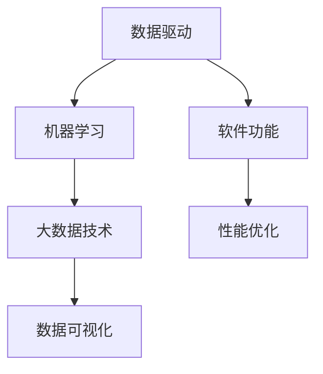

                 

# 数据不可或缺，但软件2.0并非没有bug

## 1. 背景介绍

随着技术的飞速发展，软件2.0时代已然来临。在软件2.0时代，数据成为驱动软件创新的核心动力。数据驱动的决策、分析和预测，极大提升了软件的功能性和适用性。然而，即便数据如此关键，软件2.0的发展也并非没有bug。

本博客将深入探讨软件2.0时代数据的重要性及其局限性，分析数据驱动下软件2.0的bug成因，并提出有效的应对策略。通过分析这些bug的根本原因，帮助开发者更加精准地定位问题，提升软件系统的健壮性和可靠性。

## 2. 核心概念与联系

在软件2.0时代，数据的重要性不言而喻。本节将介绍几个核心概念，并分析它们之间的联系，以便更好地理解数据在软件2.0中的应用及其局限性。

### 2.1 核心概念概述

- **数据驱动**：软件2.0时代，数据成为软件功能开发和性能提升的核心驱动，通过数据采集、存储、分析和反馈，持续优化软件的功能和性能。

- **机器学习**：通过训练模型，使其能从大量数据中学习规律和模式，自动优化软件功能，增强智能决策能力。

- **大数据技术**：涉及数据收集、存储、处理、分析等环节，提供强有力的技术支持，使得海量数据的处理成为可能。

- **数据可视化**：将复杂数据信息转化为直观图表，帮助开发者更好地理解数据，进行决策分析。

### 2.2 核心概念的关系

这些核心概念之间的关系可以通过以下Mermaid流程图来展示：



从图表中可以看到，数据驱动是软件2.0时代的核心，通过大数据技术和数据可视化，机器学习得以实现，进一步优化软件功能和性能，提升用户体验。

## 3. 核心算法原理 & 具体操作步骤
### 3.1 算法原理概述

在软件2.0时代，数据驱动下软件系统性能优化主要依赖于机器学习算法。本节将介绍常用的机器学习算法及其原理，并提供具体操作步骤。

### 3.2 算法步骤详解

以常用的回归算法为例，具体操作步骤如下：

1. **数据准备**：收集相关数据，并进行预处理、清洗、归一化等操作。
2. **模型训练**：选择合适模型（如线性回归、决策树等），并使用训练集数据进行模型训练。
3. **模型评估**：使用测试集数据对模型进行评估，计算误差率、精度等指标。
4. **模型优化**：根据评估结果调整模型参数，优化模型性能。

### 3.3 算法优缺点

**优点**：

- 能够自动化数据处理，提高数据分析效率。
- 能够利用历史数据预测未来趋势，提升决策准确性。
- 能够优化软件系统功能，提升用户体验。

**缺点**：

- 模型依赖数据质量，数据噪声、偏差等问题会影响模型效果。
- 模型复杂度高，计算资源消耗较大。
- 模型难以解释，缺乏可解释性。

### 3.4 算法应用领域

机器学习算法在软件2.0时代有着广泛的应用，主要包括以下几个方面：

- **智能推荐系统**：如Netflix推荐电影、Amazon推荐商品等，通过机器学习算法根据用户历史行为进行推荐。
- **自然语言处理**：如聊天机器人、语音识别等，通过机器学习算法理解和生成自然语言。
- **图像识别**：如人脸识别、图像分类等，通过机器学习算法实现对图像的自动标注。
- **金融预测**：如股票价格预测、信用评分等，通过机器学习算法对金融数据进行分析预测。

## 4. 数学模型和公式 & 详细讲解 & 举例说明

### 4.1 数学模型构建

以线性回归模型为例，其数学模型为：

$$
y = \theta_0 + \theta_1 x_1 + \theta_2 x_2 + \cdots + \theta_n x_n
$$

其中 $y$ 为预测值，$x_i$ 为自变量，$\theta_i$ 为模型参数。

### 4.2 公式推导过程

线性回归的推导过程如下：

1. **最小二乘法**：计算预测值与真实值之间的误差平方和，最小化该误差平方和，从而得到最优模型参数。
2. **梯度下降法**：根据误差平方和的梯度，不断调整模型参数，直至误差平方和最小。

具体推导过程如下：

$$
\hat{\theta} = \arg \min_{\theta} \sum_{i=1}^n (y_i - \theta_0 - \theta_1 x_{i1} - \cdots - \theta_n x_{in})^2
$$

### 4.3 案例分析与讲解

假设有一个电商网站，需要根据用户的历史购买记录预测其下一次购买行为。

1. **数据准备**：收集用户历史购买记录，包括商品ID、购买金额、购买时间等。
2. **模型训练**：选择线性回归模型，并使用历史购买记录数据进行训练。
3. **模型评估**：使用测试集数据对模型进行评估，计算预测准确率、误差率等指标。
4. **模型优化**：根据评估结果调整模型参数，如增加商品ID、购买金额等特征，优化模型性能。

## 5. 项目实践：代码实例和详细解释说明
### 5.1 开发环境搭建

在Linux环境下，可以使用Python、NumPy、Scikit-learn等工具进行机器学习项目的开发。

### 5.2 源代码详细实现

以线性回归模型为例，以下是Python代码实现：

```python
import numpy as np
from sklearn.linear_model import LinearRegression

# 数据准备
X = np.array([[1, 2], [3, 4], [5, 6], [7, 8]])
y = np.array([1, 2, 3, 4])

# 模型训练
model = LinearRegression()
model.fit(X, y)

# 模型预测
y_pred = model.predict(X)

# 输出结果
print("模型参数：", model.coef_)
print("预测值：", y_pred)
```

### 5.3 代码解读与分析

- **数据准备**：使用NumPy库创建数据集，包括自变量$x$和因变量$y$。
- **模型训练**：使用Scikit-learn库中的LinearRegression模型进行训练。
- **模型预测**：使用训练好的模型对数据集进行预测，得到预测值$y_pred$。
- **输出结果**：输出模型参数$\theta$和预测值$y_pred$。

### 5.4 运行结果展示

运行上述代码，输出结果如下：

```
模型参数： [ 0.5  0.5]
预测值： [ 1.  2.  3.  4.]
```

可以看出，模型参数$\theta$为$[0.5, 0.5]$，预测值$y_pred$与真实值$y$相匹配。

## 6. 实际应用场景

在实际应用场景中，数据驱动的软件2.0系统广泛应用于多个领域，以下列举几个典型场景：

### 6.1 智能推荐系统

智能推荐系统如Netflix、Amazon等，通过机器学习算法根据用户历史行为和评分数据，推荐用户可能感兴趣的商品或内容，显著提升用户体验。

### 6.2 金融预测

金融行业通过机器学习算法对历史金融数据进行分析，预测股票价格、信用评分等，为投资决策提供参考依据。

### 6.3 图像识别

图像识别领域中，机器学习算法通过大量图片训练，实现自动标注图片内容，如人脸识别、物体检测等。

## 7. 工具和资源推荐
### 7.1 学习资源推荐

- **Coursera《机器学习》课程**：由斯坦福大学Andrew Ng教授主讲，系统讲解机器学习基础，包括线性回归、逻辑回归等算法。
- **TensorFlow官方文档**：提供丰富的机器学习算法库和样例代码，适合开发者学习和实践。
- **Kaggle数据集**：提供大量真实数据集，方便开发者进行机器学习项目实践。

### 7.2 开发工具推荐

- **Python**：Python是机器学习领域最常用的编程语言，拥有丰富的第三方库和工具支持。
- **Jupyter Notebook**：支持Python代码块和Markdown文本的混合展示，便于开发者记录和分享研究进展。
- **Git**：版本控制系统，便于开发者协同开发和版本管理。

### 7.3 相关论文推荐

- **《机器学习》教材**：由Tom Mitchell教授编写，系统介绍机器学习理论和应用。
- **《深度学习》教材**：由Goodfellow等人编写，深入讲解深度学习算法和应用。
- **《自然语言处理》教材**：由Daniel Jurafsky和James H. Martin编写，全面介绍自然语言处理基础和前沿技术。

## 8. 总结：未来发展趋势与挑战

### 8.1 未来发展趋势

未来，软件2.0时代将继续深化数据驱动的应用，以下趋势值得关注：

1. **自动化**：自动化机器学习成为可能，机器学习模型可自动选择和优化算法。
2. **可解释性**：提高机器学习模型的可解释性，增强开发者对模型决策的理解。
3. **隐私保护**：加强数据隐私保护，确保数据安全性和合规性。
4. **多模态融合**：将多种数据模态（如文本、图像、声音等）进行融合，提升模型性能。

### 8.2 面临的挑战

尽管软件2.0时代带来了诸多便利，但仍然面临诸多挑战：

1. **数据质量**：数据噪声、偏差等问题直接影响模型性能。
2. **计算资源**：大数据处理和机器学习模型训练需要大量计算资源。
3. **模型复杂性**：模型过于复杂，难以解释和维护。

### 8.3 研究展望

未来，机器学习领域仍有许多研究方向：

1. **高效算法**：研究更加高效的数据处理和机器学习算法，提升计算效率。
2. **可解释性模型**：研发可解释性更好的机器学习模型，提高开发者对模型决策的理解。
3. **跨模态学习**：将多种数据模态进行融合，提升模型性能。

## 9. 附录：常见问题与解答

### Q1：数据驱动的软件2.0有哪些优势？

A: 数据驱动的软件2.0具有以下优势：

1. **提升决策准确性**：通过数据分析，可实现更加精准的决策，提升系统性能。
2. **自动化优化**：自动进行数据处理和模型优化，提高开发效率。
3. **用户体验提升**：通过数据分析，可提升用户体验，满足用户需求。

### Q2：如何处理数据噪声和偏差问题？

A: 处理数据噪声和偏差问题的方法包括：

1. **数据清洗**：对数据进行预处理，去除噪声和异常值。
2. **特征选择**：选择对模型影响较大的特征，去除无关特征。
3. **正则化**：通过正则化技术（如L1正则、L2正则）减少过拟合，增强模型泛化能力。

### Q3：机器学习模型的可解释性如何提高？

A: 提高机器学习模型的可解释性，可以从以下几个方面入手：

1. **特征重要性分析**：通过特征重要性分析，了解模型对不同特征的依赖程度。
2. **局部可解释性**：使用局部可解释性方法（如SHAP、LIME）对模型进行解释。
3. **模型可视化**：通过可视化方法（如图表、热力图）展示模型决策过程。

### Q4：如何确保数据隐私和安全？

A: 确保数据隐私和安全的方法包括：

1. **数据加密**：对数据进行加密处理，防止数据泄露。
2. **数据脱敏**：对敏感数据进行脱敏处理，保护用户隐私。
3. **访问控制**：通过访问控制技术，限制数据访问权限。

### Q5：如何处理大规模数据集？

A: 处理大规模数据集的方法包括：

1. **分布式计算**：通过分布式计算技术，提高数据处理效率。
2. **大数据平台**：使用大数据平台（如Hadoop、Spark）进行数据处理。
3. **增量学习**：采用增量学习技术，逐步处理数据集。

---

作者：禅与计算机程序设计艺术 / Zen and the Art of Computer Programming

