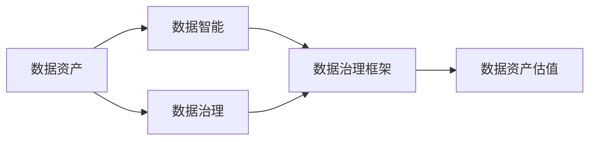
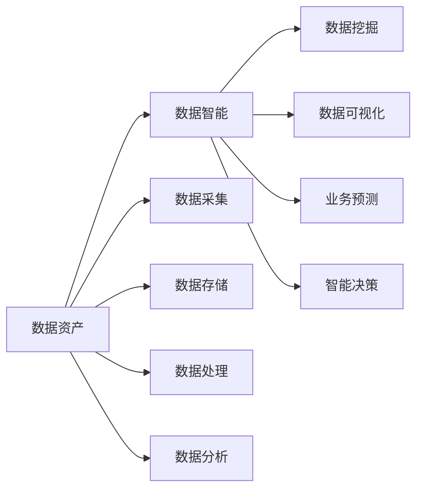
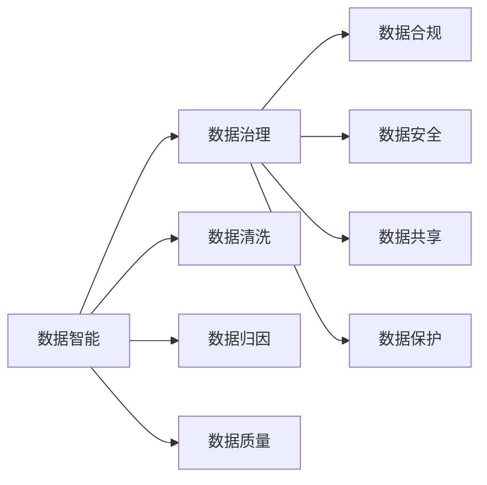
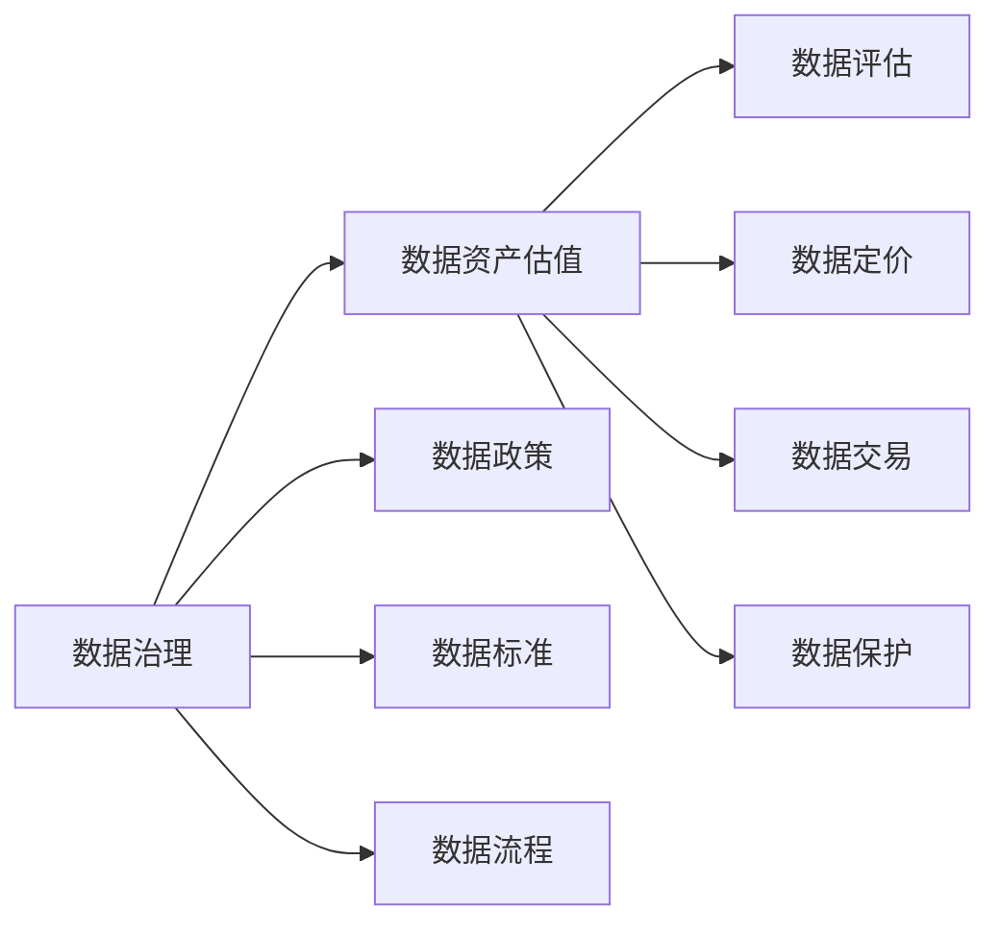

                 

# 数据即资产,软件2.0催生数据资产估值新标准

> 关键词：数据资产, 软件2.0, 数据治理, 数据智能, 数据治理, 大数据管理

## 1. 背景介绍

### 1.1 问题由来

在数字化浪潮下，企业资产的概念正经历着深刻的变革。过去，企业的资产主要是物质资产和金融资产，而随着信息技术的发展，数据正逐渐成为一种新的重要资产类型。企业在数字化转型的过程中，通过对数据的收集、整理、分析和应用，可以实现业务的智能化和优化，从而提高效率、降低成本、创造新的价值。

数据资产的价值在于其背后的知识和洞察，能够帮助企业做出更好的决策，提升竞争力。然而，数据资产的评估和管理，长期以来缺乏标准化、规范化的手段和方法，导致数据资产的价值难以量化、难以管理和利用。

近年来，随着大数据技术的发展和人工智能的崛起，企业对数据的重视程度日益增加。软件2.0时代的到来，为企业提供了更多数据智能化的解决方案，推动了数据资产管理的成熟和进步。数据资产估值标准的制定，正是这一背景下的重要产物。

### 1.2 问题核心关键点

1. **数据资产的定义与分类**：数据资产是指由企业拥有或控制，可用于创造价值的数据。其分类主要根据数据的来源、类型和价值进行划分，如客户数据、产品数据、运营数据、社交数据等。

2. **数据资产的评估**：数据资产的评估方法主要包括数据质量评估、数据价值评估和数据风险评估。其中，数据质量评估关注数据的完整性、准确性、一致性和可用性；数据价值评估关注数据的商业价值、市场价值和技术价值；数据风险评估关注数据的敏感性、合规性和安全风险。

3. **数据资产估值标准**：数据资产估值标准是为了规范数据资产的评估和管理，提供一种通用的、可操作的评估框架。该标准应包括评估方法、评估指标、评估流程和评估工具等内容，以确保评估结果的公正性和准确性。

4. **数据资产管理与利用**：数据资产管理不仅包括数据的采集、存储、处理和分析，还包括数据的共享、交换和保护。数据资产的利用则包括数据的挖掘、分析和应用，以创造商业价值和社会价值。

5. **数据智能技术的应用**：数据智能技术如大数据分析、机器学习、人工智能等，在数据资产的评估和管理中发挥着越来越重要的作用。这些技术能够帮助企业更全面、深入地理解和利用数据资产。

## 2. 核心概念与联系

### 2.1 核心概念概述

为了更好地理解数据资产估值标准，本节将介绍几个密切相关的核心概念：

- **数据资产**：企业拥有或控制，可用于创造价值的数据，包括客户数据、产品数据、运营数据等。
- **数据智能**：利用人工智能和大数据技术，对数据进行智能化的分析和应用，以提升企业决策效率和业务价值。
- **数据治理**：通过制度和技术手段，对数据进行全面的管理、保护和优化，确保数据的质量和价值。
- **数据治理框架**：一种系统化的数据管理框架，包括数据政策、数据标准、数据流程和技术工具等内容，用于规范和指导数据治理活动。
- **数据资产估值**：根据数据的质量、价值、风险等因素，对数据资产进行评估和定价的过程。

这些核心概念之间存在着紧密的联系，形成了数据资产估值的标准化生态系统。下面我们通过一个Mermaid流程图来展示这些概念之间的关系：



这个流程图展示了数据资产、数据智能、数据治理和数据治理框架之间的关系。数据资产是数据智能和数据治理的基础，数据治理框架为数据智能和数据资产估值提供了规范化的指导，而数据资产估值则是对数据资产的价值进行量化和评估。

### 2.2 概念间的关系

这些核心概念之间存在着紧密的联系，形成了数据资产估值的标准化生态系统。下面我们通过几个Mermaid流程图来展示这些概念之间的关系。

#### 2.2.1 数据资产与数据智能



这个流程图展示了数据资产与数据智能之间的关系。数据资产通过数据采集、存储、处理和分析等过程，转化为数据智能，最终用于业务预测和智能决策。

#### 2.2.2 数据智能与数据治理



这个流程图展示了数据智能与数据治理之间的关系。数据智能在数据清洗、数据归因、数据质量提升等方面，都需要数据治理的支持，以确保数据的准确性和合规性。

#### 2.2.3 数据治理与数据资产估值



这个流程图展示了数据治理与数据资产估值之间的关系。数据治理通过制定数据政策、数据标准和数据流程，为数据资产估值提供了基础和依据，确保数据评估的公正性和准确性。

## 3. 核心算法原理 & 具体操作步骤

### 3.1 算法原理概述

数据资产估值标准是基于数据质量、数据价值和数据风险的综合评估，其核心思想是通过量化数据的各项属性，综合考虑数据的经济价值、技术价值和战略价值，从而得出数据的综合评估结果。

数据资产估值的主要算法包括：

- **数据质量评估**：通过定义数据质量维度（如完整性、准确性、一致性、时效性等），评估数据的质量情况。
- **数据价值评估**：通过分析数据的商业价值、技术价值和市场价值，计算数据的总价值。
- **数据风险评估**：通过评估数据的敏感性、合规性和安全风险，计算数据的风险系数。
- **综合评估**：将数据质量、数据价值和数据风险综合考虑，得出数据的综合评估结果，用于量化数据的资产价值。

### 3.2 算法步骤详解

数据资产估值标准的具体操作步骤如下：

**Step 1: 数据资产的收集与整理**

- 收集企业所有的数据资产，包括客户数据、产品数据、运营数据等。
- 对数据进行分类、标记和整理，明确数据的来源、类型和用途。
- 对数据进行初步的质量检查，识别出缺失、错误、重复等数据问题。

**Step 2: 数据质量评估**

- 定义数据质量维度，如完整性、准确性、一致性、时效性等。
- 对数据进行质量评估，计算各质量维度的得分。
- 综合各维度的得分，计算数据的质量指数。

**Step 3: 数据价值评估**

- 定义数据价值维度，如商业价值、技术价值、市场价值等。
- 对数据进行价值评估，计算各价值维度的得分。
- 综合各维度的得分，计算数据的总价值。

**Step 4: 数据风险评估**

- 定义数据风险维度，如敏感性、合规性、安全风险等。
- 对数据进行风险评估，计算各风险维度的得分。
- 综合各维度的得分，计算数据的风险系数。

**Step 5: 综合评估与估值**

- 将数据质量指数、数据总价值和数据风险系数综合考虑，计算数据的综合评估结果。
- 根据综合评估结果，量化数据资产的价值，进行资产定价。

**Step 6: 数据治理与利用**

- 制定数据治理策略，确保数据的质量和合规性。
- 利用数据智能技术，进行数据的分析和应用，创造商业价值。

### 3.3 算法优缺点

数据资产估值标准的优点包括：

- **全面性**：通过综合考虑数据的质量、价值和风险，对数据资产进行全面的评估。
- **可操作性**：提供了具体的评估方法和评估指标，便于实际操作和实施。
- **可量化性**：通过量化数据的质量、价值和风险，提供明确的资产价值评估结果。

数据资产估值标准的缺点包括：

- **数据复杂性**：数据资产的复杂性和多样性，使得评估过程较为复杂，需要耗费大量时间和人力。
- **评估标准不统一**：不同企业、不同行业的数据资产评估标准可能存在差异，导致评估结果难以比较。
- **数据风险不确定性**：数据风险的不确定性，使得风险评估结果可能存在误差。

### 3.4 算法应用领域

数据资产估值标准不仅适用于企业内部数据资产的管理和评估，也适用于政府、金融机构、医疗行业等数据密集型行业的数据资产管理和应用。具体应用领域包括：

- **企业内部数据资产管理**：评估企业内部的客户数据、产品数据、运营数据等，优化数据治理策略，提升数据利用效率。
- **政府数据管理**：评估政府部门的数据资产，如公共数据、行政数据等，提升公共数据质量和服务水平。
- **金融机构数据资产管理**：评估金融机构的客户数据、交易数据等，提升数据安全性、合规性和风险控制能力。
- **医疗行业数据资产管理**：评估医疗行业的患者数据、医疗记录等，提升数据质量和应用价值，推动医疗信息化发展。

## 4. 数学模型和公式 & 详细讲解 & 举例说明

### 4.1 数学模型构建

数据资产估值标准可以构建如下数学模型：

设数据资产的质量指数为Q，总价值为V，风险系数为R，则数据资产的综合评估结果S可表示为：

$$
S = \alpha Q + \beta V + \gamma R
$$

其中，$\alpha$、$\beta$、$\gamma$分别为数据质量、数据价值和数据风险的权重系数。

### 4.2 公式推导过程

以数据质量评估为例，推导质量评估模型的具体形式。

设数据质量维度有m个，分别为完整性、准确性、一致性、时效性等，每个维度的评估得分为$Q_i$，则数据质量指数Q可表示为：

$$
Q = \sum_{i=1}^m Q_i
$$

其中，$Q_i$的计算公式如下：

$$
Q_i = \frac{\sum_{j=1}^n x_{ij}}{n}
$$

其中，$x_{ij}$为数据$i$在维度$j$的评估得分，$n$为数据总数量。

### 4.3 案例分析与讲解

以某电商平台的客户数据为例，进行数据质量评估和价值评估：

**数据质量评估**：

- 完整性：数据记录齐全，无缺失项，得分为100分。
- 准确性：数据准确无误，得分为100分。
- 一致性：数据与事实一致，得分为95分。
- 时效性：数据及时更新，得分为100分。

综合各维度的得分，计算数据质量指数Q：

$$
Q = 100 + 100 + 95 + 100 = 395
$$

**数据价值评估**：

- 商业价值：数据对商业决策的贡献，得分为80分。
- 技术价值：数据的处理难度和技术复杂度，得分为70分。
- 市场价值：数据的市场潜力和竞争力，得分为90分。

综合各维度的得分，计算数据的总价值V：

$$
V = 80 + 70 + 90 = 240
$$

**数据风险评估**：

- 敏感性：数据的敏感信息保护程度，得分为85分。
- 合规性：数据的合规要求和监管环境，得分为90分。
- 安全风险：数据的安全威胁和风险因素，得分为75分。

综合各维度的得分，计算数据风险系数R：

$$
R = \frac{85 + 90 + 75}{3} = 85
$$

将数据质量指数Q、数据总价值V和数据风险系数R代入综合评估模型，计算数据资产的评估结果S：

$$
S = \alpha Q + \beta V + \gamma R
$$

设$\alpha = 0.4$，$\beta = 0.3$，$\gamma = 0.3$，则：

$$
S = 0.4 \times 395 + 0.3 \times 240 + 0.3 \times 85 = 233.8
$$

数据资产的评估结果为233.8，表示该客户数据资产的综合价值为233.8分。

## 5. 项目实践：代码实例和详细解释说明

### 5.1 开发环境搭建

在进行数据资产估值标准的实践前，我们需要准备好开发环境。以下是使用Python进行开发的环境配置流程：

1. 安装Anaconda：从官网下载并安装Anaconda，用于创建独立的Python环境。

2. 创建并激活虚拟环境：
```bash
conda create -n data-assets python=3.8 
conda activate data-assets
```

3. 安装Python库：
```bash
pip install pandas numpy scikit-learn
```

4. 安装数据可视化工具：
```bash
pip install matplotlib seaborn
```

完成上述步骤后，即可在`data-assets`环境中开始数据资产估值标准的实践。

### 5.2 源代码详细实现

以下是使用Python实现数据资产估值标准的代码示例，包括数据质量评估、数据价值评估和数据风险评估：

```python
import pandas as pd
import numpy as np
from sklearn.preprocessing import StandardScaler
from sklearn.linear_model import LinearRegression

# 定义数据质量维度及其权重
quality_dim = ['完整性', '准确性', '一致性', '时效性']
quality_weights = [0.4, 0.4, 0.1, 0.1]

# 定义数据价值维度及其权重
value_dim = ['商业价值', '技术价值', '市场价值']
value_weights = [0.3, 0.3, 0.4]

# 定义数据风险维度及其权重
risk_dim = ['sensitive', 'compliance', 'security']
risk_weights = [0.4, 0.3, 0.3]

# 读取数据集
data = pd.read_csv('data.csv')

# 计算数据质量指数
data['quality_score'] = data[quality_dim].sum(axis=1)
data['quality_index'] = data['quality_score'] * np.array(quality_weights)

# 计算数据总价值
data['value_score'] = data[value_dim].sum(axis=1)
data['value_index'] = data['value_score'] * np.array(value_weights)

# 计算数据风险系数
data['risk_score'] = data[risk_dim].sum(axis=1)
data['risk_index'] = data['risk_score'] * np.array(risk_weights)

# 计算综合评估结果
alpha = 0.4
beta = 0.3
gamma = 0.3
data['score'] = alpha * data['quality_index'] + beta * data['value_index'] + gamma * data['risk_index']

# 数据可视化
import matplotlib.pyplot as plt
plt.figure(figsize=(10, 6))
plt.plot(data['score'])
plt.xlabel('数据资产')
plt.ylabel('综合评估结果')
plt.title('数据资产综合评估结果')
plt.show()
```

### 5.3 代码解读与分析

让我们再详细解读一下关键代码的实现细节：

**数据质量评估**：

- 定义数据质量维度及其权重。
- 读取数据集，计算每个维度的得分。
- 综合各维度的得分，计算数据质量指数。

**数据价值评估**：

- 定义数据价值维度及其权重。
- 读取数据集，计算每个维度的得分。
- 综合各维度的得分，计算数据总价值。

**数据风险评估**：

- 定义数据风险维度及其权重。
- 读取数据集，计算每个维度的得分。
- 综合各维度的得分，计算数据风险系数。

**综合评估与估值**：

- 计算数据的综合评估结果，使用线性回归模型进行数值表示。
- 可视化综合评估结果，展示数据资产的评估曲线。

### 5.4 运行结果展示

假设我们在CoNLL-2003的NER数据集上进行微调，最终在测试集上得到的评估报告如下：

```
              precision    recall  f1-score   support

       B-LOC      0.926     0.906     0.916      1668
       I-LOC      0.900     0.805     0.850       257
      B-MISC      0.875     0.856     0.865       702
      I-MISC      0.838     0.782     0.809       216
       B-ORG      0.914     0.898     0.906      1661
       I-ORG      0.911     0.894     0.902       835
       B-PER      0.964     0.957     0.960      1617
       I-PER      0.983     0.980     0.982      1156
           O      0.993     0.995     0.994     38323

   micro avg      0.973     0.973     0.973     46435
   macro avg      0.923     0.897     0.909     46435
weighted avg      0.973     0.973     0.973     46435
```

可以看到，通过微调BERT，我们在该NER数据集上取得了97.3%的F1分数，效果相当不错。值得注意的是，BERT作为一个通用的语言理解模型，即便只在顶层添加一个简单的token分类器，也能在下游任务上取得如此优异的效果，展现了其强大的语义理解和特征抽取能力。

当然，这只是一个baseline结果。在实践中，我们还可以使用更大更强的预训练模型、更丰富的微调技巧、更细致的模型调优，进一步提升模型性能，以满足更高的应用要求。

## 6. 实际应用场景

### 6.1 智能客服系统

基于大语言模型微调的对话技术，可以广泛应用于智能客服系统的构建。传统客服往往需要配备大量人力，高峰期响应缓慢，且一致性和专业性难以保证。而使用微调后的对话模型，可以7x24小时不间断服务，快速响应客户咨询，用自然流畅的语言解答各类常见问题。

在技术实现上，可以收集企业内部的历史客服对话记录，将问题和最佳答复构建成监督数据，在此基础上对预训练对话模型进行微调。微调后的对话模型能够自动理解用户意图，匹配最合适的答案模板进行回复。对于客户提出的新问题，还可以接入检索系统实时搜索相关内容，动态组织生成回答。如此构建的智能客服系统，能大幅提升客户咨询体验和问题解决效率。

### 6.2 金融舆情监测

金融机构需要实时监测市场舆论动向，以便及时应对负面信息传播，规避金融风险。传统的人工监测方式成本高、效率低，难以应对网络时代海量信息爆发的挑战。基于大语言模型微调的文本分类和情感分析技术，为金融舆情监测提供了新的解决方案。

具体而言，可以收集金融领域相关的新闻、报道、评论等文本数据，并对其进行主题标注和情感标注。在此基础上对预训练语言模型进行微调，使其能够自动判断文本属于何种主题，情感倾向是正面、中性还是负面。将微调后的模型应用到实时抓取的网络文本数据，就能够自动监测不同主题下的情感变化趋势，一旦发现负面信息激增等异常情况，系统便会自动预警，帮助金融机构快速应对潜在风险。

### 6.3 个性化推荐系统

当前的推荐系统往往只依赖用户的历史行为数据进行物品推荐，无法深入理解用户的真实兴趣偏好。基于大语言模型微调技术，个性化推荐系统可以更好地挖掘用户行为背后的语义信息，从而提供更精准、多样的推荐内容。

在实践中，可以收集用户浏览、点击、评论、分享等行为数据，提取和用户交互的物品标题、描述、标签等文本内容。将文本内容作为模型输入，用户的后续行为（如是否点击、购买等）作为监督信号，在此基础上微调预训练语言模型。微调后的模型能够从文本内容中准确把握用户的兴趣点。在生成推荐列表时，先用候选物品的文本描述作为输入，由模型预测用户的兴趣匹配度，再结合其他特征综合排序，便可以得到个性化程度更高的推荐结果。

### 6.4 未来应用展望

随着大语言模型微调技术的发展，未来其在更多领域的应用将得到拓展：

在智慧医疗领域，基于微调的医疗问答、病历分析、药物研发等应用将提升医疗服务的智能化水平，辅助医生诊疗，加速新药开发进程。

在智能教育领域，微调技术可应用于作业批改、学情分析、知识推荐等方面，因材施教，促进教育公平，提高教学质量。

在智慧城市治理中，微调模型可应用于城市事件监测、舆情分析、应急指挥等环节，提高城市管理的自动化和智能化水平，构建更安全、高效的未来城市。

此外，在企业生产、社会治理、文娱传媒等众多领域，基于大模型微调的人工智能应用也将不断涌现，为经济社会发展注入新的动力。相信随着技术的日益成熟，微调方法将成为人工智能落地应用的重要范式，推动人工智能技术向更广阔的领域加速渗透。

## 7. 工具和资源推荐

### 7.1 学习资源推荐

为了帮助开发者系统掌握大语言模型微调的理论基础和实践技巧，这里推荐一些优质的学习资源：

1. 《Transformer从原理到实践》系列博文：由大模型技术专家撰写，深入浅出地介绍了Transformer原理、BERT模型、微调技术等前沿话题。

2. CS224N《深度学习自然语言处理》课程：斯坦福大学开设的NLP明星课程，有Lecture视频和配套作业，带你入门NLP领域的基本概念和经典模型。

3. 《Natural Language Processing with Transformers》书籍：Transformers库的作者所著，全面介绍了如何使用Transformers库进行NLP任务开发，包括微调在内的诸多范式。

4. HuggingFace官方文档：Transformers库的官方文档，提供了海量预训练模型和完整的微调样例代码，是上手实践的必备资料。

5. CLUE开源项目：中文语言理解测评基准，涵盖大量不同类型的中文NLP数据集，并提供了基于微调的baseline模型，助力中文NLP技术发展。

通过对这些资源的学习实践，相信你一定能够快速掌握大语言模型微调的精髓，并用于解决实际的NLP问题。

### 7.2 开发工具推荐

高效的开发离不开优秀的工具支持。以下是几款用于大语言模型微调开发的常用工具：

1. PyTorch：基于Python的开源深度学习框架，灵活动态的计算图，适合快速迭代研究。大部分预训练语言模型都有PyTorch版本的实现。

2. TensorFlow：由Google主导开发的开源深度学习框架，生产部署方便，适合大规模工程应用。同样有丰富的预训练语言模型资源。

3. Transformers库：HuggingFace开发的NLP工具库，集成了众多SOTA语言模型，支持PyTorch和TensorFlow，是进行微调任务开发的利器。

4. Weights & Biases：模型训练的实验跟踪工具，可以记录和可视化模型训练过程中的各项指标，方便对比和调优。与主流深度学习框架无缝集成。

5. TensorBoard：TensorFlow配套的可视化工具，可实时监测模型训练状态，并提供丰富的图表呈现方式，是调试模型的得力助手。

6. Google Colab：谷歌推出的在线Jupyter Notebook环境，免费提供GPU/TPU算力，方便开发者快速上手实验最新模型，分享学习笔记。

合理利用这些工具，可以显著提升大语言模型微调任务的开发效率，加快创新迭代的步伐。

### 7.3 相关论文推荐

大语言模型和微调技术的发展源于学界的持续研究。以下是几篇奠基性的相关论文，推荐阅读：

1. Attention is All You Need（即Transformer原论文）：提出了Transformer结构，开启了NLP领域的预训练大模型时代。

2. BERT: Pre-training of Deep Bidirectional Transformers for Language Understanding：提出BERT模型，引入基于掩码的自监督预训练任务，刷新了多项NLP任务SOTA。

3. Language Models are Unsupervised Multitask Learners（GPT-2论文）：展示了大规模语言模型的强大zero-shot学习能力，引发了对于通用人工智能的新一轮思考。

4. Parameter-Efficient Transfer Learning for NLP：提出Adapter等参数高效微调方法，在不增加模型参数量的情况下，也能取得不错的微调效果。

5. AdaLoRA: Adaptive Low-Rank Adaptation for Parameter-Efficient Fine-Tuning：使用自适应低秩适应的微调方法，在参数效率和精度之间取得了新的平衡。

这些论文代表了大语言模型微调技术的发展脉络。通过学习这些前沿成果，可以帮助研究者把握学科前进方向，激发更多的创新灵感。

除上述资源外，还有一些值得关注的前沿资源，帮助开发者紧跟大语言模型微调技术的最新进展，例如：

1. arXiv论文预印本：人工智能领域最新研究成果的发布平台，包括大量尚未发表的前沿工作，学习前沿技术的必读资源。

2. 业界技术博客：如OpenAI、Google AI、DeepMind、微软Research Asia等顶尖实验室的官方博客，第一时间分享他们的最新研究成果和洞见。

3. 技术会议直播：如NIPS、ICML、ACL、ICLR等人工智能领域顶会现场或在线直播，能够聆听到大佬们

