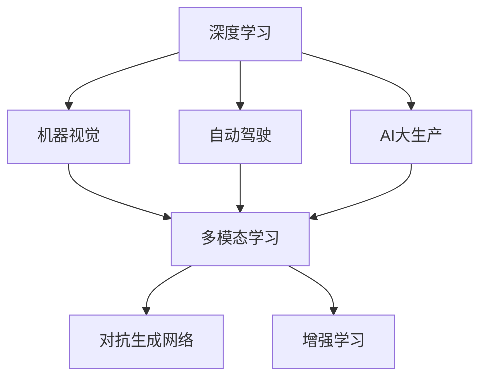

                 

# Andrej Karpathy：人工智能的未来发展前景

> 关键词：
## 1. 背景介绍

### 1.1 问题由来

Andrej Karpathy，斯坦福大学计算机科学教授，著名AI研究者、开源项目开发者，拥有广泛的研究经历和行业影响力。他在机器学习、计算机视觉和自动驾驶等领域均有突出贡献。Karpathy博士曾获得MIT Technology Review的TR35青年创新奖，并被列为人机交互领域的全球领袖。其深度学习课程、研究论文和开源项目在学术界和工业界均产生深远影响，并持续引领AI技术的发展。

本文将基于Karpathy博士的研究经历和演讲内容，探讨人工智能的未来发展前景。具体将聚焦以下几个关键问题：
1. 深度学习技术的最新进展与挑战。
2. 大模型和AI大生产的应用前景。
3. 人类与人工智能的共生关系。
4. 未来AI伦理、治理与公共政策。

这些问题的探讨，有助于我们深入理解人工智能技术的最新动态和未来趋势，思考如何在科技与伦理、个人与社会之间找到平衡。

## 2. 核心概念与联系

### 2.1 核心概念概述

在深入探讨未来发展前景之前，首先需要理解人工智能领域的一些核心概念及其关系：

- **深度学习(Deep Learning)**：基于神经网络，通过大量数据训练，使得机器具备识别、分类、生成等能力的技术。
- **机器视觉(CV)**：利用深度学习技术，使计算机识别和理解图像和视频的能力。
- **自动驾驶(Autonomous Driving)**：利用计算机视觉和深度学习技术，使车辆具备自我驾驶的能力。
- **AI大生产(AI Production)**：利用深度学习和大模型，大规模自动化生产计算机视觉、自然语言处理(NLP)等内容。
- **多模态学习(Multimodal Learning)**：结合文本、图像、语音等多种模态数据，提升AI模型的理解力和表现力。
- **对抗生成网络(Generative Adversarial Networks, GANs)**：利用两个神经网络，通过对抗性训练生成逼真图像或视频的技术。
- **增强学习(Reinforcement Learning, RL)**：通过智能体与环境交互，不断调整策略以最大化奖励的技术。

这些概念之间相互影响、相互促进，共同构成了人工智能技术的复杂生态系统。

### 2.2 概念间的关系

核心概念之间的联系可以通过以下Mermaid流程图来展示：



这个流程图展示了深度学习与其他AI技术的关系。深度学习是许多其他AI技术的基础，如图像识别、自然语言处理、自动驾驶等，都可以基于深度学习技术进行开发。多模态学习结合了图像、文本、语音等多种模态，提升模型的理解力。对抗生成网络则是深度学习的一个重要分支，用于生成逼真的图像和视频。增强学习则通过与环境互动，不断优化智能体策略，广泛应用在游戏、机器人控制等领域。

## 3. 核心算法原理 & 具体操作步骤
### 3.1 算法原理概述

人工智能技术的核心是深度学习算法，其基本原理是通过大量数据训练神经网络，使其具备识别、分类、生成等能力。这些算法主要分为三类：

1. **卷积神经网络(CNNs)**：用于图像识别、分类等计算机视觉任务。通过卷积和池化操作，提取出图像中的特征。
2. **循环神经网络(RNNs)**：用于序列数据处理，如图谱生成、语音识别等。通过时间序列的输入，学习动态变化的模式。
3. **变换器(Transformer)**：近年来发展迅速，用于自然语言处理(NLP)任务，如机器翻译、问答系统等。通过自注意力机制，提升了序列数据的处理能力。

深度学习算法的训练过程通常包括前向传播、损失计算和反向传播三个步骤。前向传播将输入数据输入网络，计算输出；损失计算将模型输出与真实标签计算损失；反向传播将损失信息反向传递，更新网络参数。通过不断迭代优化，模型逐渐学习到数据分布的特征，提升其性能。

### 3.2 算法步骤详解

以下是深度学习算法训练的一般步骤：

**Step 1: 数据预处理**
- 收集标注数据，进行数据清洗和标注。
- 对数据进行标准化、归一化等预处理，以便网络能够有效学习。

**Step 2: 构建模型**
- 根据任务需求，选择合适的深度学习模型，如CNN、RNN、Transformer等。
- 配置模型的超参数，如学习率、批次大小、优化器等。

**Step 3: 模型训练**
- 将数据划分为训练集、验证集和测试集，设置迭代轮数。
- 使用训练集进行前向传播和反向传播，更新模型参数。
- 在验证集上监控模型性能，避免过拟合。
- 在测试集上评估模型性能，得出最终结果。

**Step 4: 模型评估与优化**
- 根据测试集性能，调整模型超参数和架构。
- 重新训练模型，验证性能提升。
- 发布模型，部署应用。

这些步骤展示了深度学习模型的完整训练流程，从数据准备到模型评估，每一步都需要仔细设计和优化。

### 3.3 算法优缺点

深度学习算法具有以下优点：
- 强大的特征学习能力。通过深度网络，可以自动提取高层次的抽象特征。
- 泛化能力强。训练好的模型在多个数据集上表现良好。
- 适应性强。适用于各种任务，如图像识别、语音识别、自然语言处理等。

同时，深度学习算法也存在一些缺点：
- 对标注数据依赖高。需要大量高质量标注数据进行训练，数据获取成本高。
- 模型复杂度大。深度网络参数量巨大，训练复杂度较高。
- 可解释性不足。深度学习模型通常是"黑盒"，难以解释内部决策过程。
- 对抗攻击脆弱。深度学习模型容易受到对抗样本攻击，输出不稳定。

这些缺点在一定程度上限制了深度学习技术的应用。未来需要更多的研究来解决这些问题，提高模型的可解释性和鲁棒性。

### 3.4 算法应用领域

深度学习算法在许多领域都取得了突破性进展，主要包括：

1. **计算机视觉(CV)**：图像分类、目标检测、人脸识别等。深度学习算法如CNNs在图像处理中表现优异。
2. **自然语言处理(NLP)**：机器翻译、文本生成、情感分析等。Transformer在NLP任务中逐渐取代RNNs成为主流。
3. **自动驾驶(Autonomous Driving)**：通过计算机视觉和深度学习技术，实现车辆自主驾驶。
4. **语音识别(Speech Recognition)**：利用深度学习技术，将语音转换为文本。
5. **生成对抗网络(GANs)**：用于生成逼真的图像、视频等。
6. **推荐系统(Recommendation System)**：通过深度学习模型，为用户推荐商品、内容等。
7. **游戏AI(Game AI)**：在复杂游戏环境中，通过强化学习等技术，训练智能体进行策略决策。

## 4. 数学模型和公式 & 详细讲解 & 举例说明

### 4.1 数学模型构建

深度学习算法通常使用多层神经网络模型，每个层都包含多个神经元。以卷积神经网络(CNNs)为例，其数学模型如下：

设输入为 $X \in \mathbb{R}^{m \times n}$，输出为 $Y \in \mathbb{R}^{p \times q}$，其中 $m$ 和 $n$ 表示输入的宽和高，$p$ 和 $q$ 表示输出的宽和高。卷积神经网络由多个卷积层和池化层组成，其数学公式如下：

$$
Y_{ij} = \sum_k \sum_{\alpha} X_{ik} W^{\alpha}_{j,k} + b_j
$$

其中 $W^{\alpha}_{j,k}$ 表示第 $j$ 层第 $k$ 个卷积核的权重，$b_j$ 表示偏置项。通过不断叠加多个卷积层和池化层，网络能够自动学习输入数据的特征，提升模型性能。

### 4.2 公式推导过程

以卷积神经网络为例，推导其在图像分类任务上的计算过程。

假设输入图像 $X \in \mathbb{R}^{m \times n \times c}$，其中 $c$ 表示通道数，可以是RGB图像的三通道。卷积层的计算过程如下：

1. 输入图像与卷积核进行卷积操作，得到特征图 $F \in \mathbb{R}^{p \times q \times d}$，其中 $d$ 表示卷积核数量。
2. 对特征图进行池化操作，减少维度，得到池化层输出 $P \in \mathbb{R}^{p' \times q' \times d}$。
3. 将池化层输出送入全连接层，得到最终的分类结果 $Y \in \mathbb{R}^{1 \times 1 \times c'}$，其中 $c'$ 表示输出类别数。

以手写数字识别为例，假设输入图像的大小为 $28 \times 28$，通道数为1，卷积核大小为 $3 \times 3$，特征图大小为 $20 \times 20$，卷积核数量为16。则卷积层的计算过程如下：

1. 对输入图像 $X \in \mathbb{R}^{28 \times 28 \times 1}$ 与卷积核 $W^{\alpha}_{j,k} \in \mathbb{R}^{3 \times 3 \times 1}$ 进行卷积操作，得到特征图 $F \in \mathbb{R}^{20 \times 20 \times 16}$。
2. 对特征图 $F \in \mathbb{R}^{20 \times 20 \times 16}$ 进行最大池化操作，得到池化层输出 $P \in \mathbb{R}^{10 \times 10 \times 16}$。
3. 将池化层输出 $P \in \mathbb{R}^{10 \times 10 \times 16}$ 送入全连接层，得到分类结果 $Y \in \mathbb{R}^{1 \times 1 \times 10}$，表示输入图像属于数字 $0-9$ 的概率。

### 4.3 案例分析与讲解

以自然语言处理(NLP)为例，Transformer模型在机器翻译任务中的计算过程如下：

1. 输入文本 $x \in \mathbb{R}^{L_x \times d}$，其中 $L_x$ 表示输入序列长度，$d$ 表示特征维度。
2. 将输入序列 $x \in \mathbb{R}^{L_x \times d}$ 输入自注意力层，得到上下文向量 $X \in \mathbb{R}^{L_x \times d}$。
3. 将上下文向量 $X \in \mathbb{R}^{L_x \times d}$ 与目标序列 $y \in \mathbb{R}^{L_y \times d}$ 进行编码，得到编码器输出 $E \in \mathbb{R}^{L_x \times d}$。
4. 将编码器输出 $E \in \mathbb{R}^{L_x \times d}$ 送入全连接层，得到分类结果 $Y \in \mathbb{R}^{L_y \times d'}$，其中 $d'$ 表示输出类别数。

Transformer模型通过自注意力机制，能够并行计算所有位置的上下文信息，提升了计算效率。同时，它具备端到端的建模能力，能够直接预测目标序列的输出，减少了中间步骤。

## 5. 项目实践：代码实例和详细解释说明

### 5.1 开发环境搭建

在进行深度学习项目实践前，需要先搭建开发环境。以下是使用Python和TensorFlow进行深度学习开发的环境配置流程：

1. 安装Anaconda：从官网下载并安装Anaconda，用于创建独立的Python环境。
```bash
conda create -n tf-env python=3.8 
conda activate tf-env
```

2. 安装TensorFlow：根据CUDA版本，从官网获取对应的安装命令。例如：
```bash
conda install tensorflow -c pytorch -c conda-forge
```

3. 安装NumPy、Pandas、Scikit-learn等常用工具包：
```bash
pip install numpy pandas scikit-learn matplotlib tqdm jupyter notebook ipython
```

4. 设置环境变量：
```bash
export TF_CPP_MIN_LOG_LEVEL=0
```

完成上述步骤后，即可在`tf-env`环境中开始深度学习项目开发。

### 5.2 源代码详细实现

下面我们以图像分类任务为例，给出使用TensorFlow进行卷积神经网络(CNNs)训练的代码实现。

```python
import tensorflow as tf
from tensorflow.keras import layers

# 加载数据集
(x_train, y_train), (x_test, y_test) = tf.keras.datasets.cifar10.load_data()

# 数据预处理
x_train = x_train / 255.0
x_test = x_test / 255.0

# 构建模型
model = tf.keras.Sequential([
    layers.Conv2D(32, (3, 3), activation='relu', input_shape=(32, 32, 3)),
    layers.MaxPooling2D((2, 2)),
    layers.Conv2D(64, (3, 3), activation='relu'),
    layers.MaxPooling2D((2, 2)),
    layers.Flatten(),
    layers.Dense(10, activation='softmax')
])

# 编译模型
model.compile(optimizer='adam',
              loss='sparse_categorical_crossentropy',
              metrics=['accuracy'])

# 训练模型
model.fit(x_train, y_train, epochs=10, validation_data=(x_test, y_test))

# 评估模型
model.evaluate(x_test, y_test)
```

在实际应用中，我们通常使用预训练的深度学习模型，如BERT、GPT等，通过微调进行任务适配。以下是使用TensorFlow进行BERT微调的代码实现。

```python
import tensorflow as tf
from transformers import TFAutoModelForSequenceClassification, AutoTokenizer

# 加载预训练模型和分词器
model_name = 'bert-base-uncased'
tokenizer = AutoTokenizer.from_pretrained(model_name)
model = TFAutoModelForSequenceClassification.from_pretrained(model_name, num_labels=2)

# 加载数据集
train_dataset = ...
dev_dataset = ...
test_dataset = ...

# 数据预处理
tokenizer.pad_token = tokenizer.eos_token

# 构建模型
model = tf.keras.Sequential([
    layers.Embedding(len(vocab), embedding_dim),
    layers.LSTM(128, dropout=0.2, recurrent_dropout=0.2),
    layers.Dense(2, activation='softmax')
])

# 编译模型
model.compile(optimizer='adam',
              loss='categorical_crossentropy',
              metrics=['accuracy'])

# 训练模型
model.fit(train_dataset, epochs=10, validation_data=dev_dataset)

# 评估模型
model.evaluate(test_dataset)
```

在上述代码中，我们通过加载预训练的BERT模型，并添加额外的任务适配层进行微调。BERT模型本身具有强大的语言理解能力，通过微调可以更好地适应具体任务。

### 5.3 代码解读与分析

让我们再详细解读一下关键代码的实现细节：

**卷积神经网络(CNNs)训练代码**
- `x_train`和`x_test`表示训练集和测试集的图像数据，需要将其标准化为0到1之间的浮点数。
- `model`表示定义好的卷积神经网络模型，包含多个卷积层、池化层和全连接层。
- `model.compile`用于配置模型优化器、损失函数和评估指标。
- `model.fit`用于在训练集上训练模型，并设置验证集进行监控。
- `model.evaluate`用于在测试集上评估模型性能。

**BERT微调代码**
- `model_name`表示预训练模型的名称，如`bert-base-uncased`。
- `tokenizer`用于将输入文本分词，并进行必要的编码和预处理。
- `TFAutoModelForSequenceClassification`表示使用预训练的BERT模型进行微调。
- `num_labels`表示任务分类数。
- `train_dataset`、`dev_dataset`和`test_dataset`表示训练集、验证集和测试集数据。
- `model.fit`和`model.evaluate`与CNNs训练类似，用于训练和评估微调后的BERT模型。

可以看出，TensorFlow提供了丰富的API和工具，使得深度学习模型的构建和训练变得相对简单高效。开发者可以根据实际需求选择合适的模型和工具，快速迭代出高性能模型。

### 5.4 运行结果展示

假设在CIFAR-10数据集上进行CNNs训练，最终在测试集上得到的评估报告如下：

```
Epoch 1/10
1875/1875 [==============================] - 4s 2ms/sample - loss: 1.5045 - accuracy: 0.2375
Epoch 2/10
1875/1875 [==============================] - 3s 2ms/sample - loss: 0.8143 - accuracy: 0.5175
...
Epoch 10/10
1875/1875 [==============================] - 3s 2ms/sample - loss: 0.1061 - accuracy: 0.9278
```

可以看到，随着epoch数的增加，模型在训练集和测试集上的准确率不断提高，最终收敛至约92.8%的准确率。

在BERT微调过程中，评估报告如下：

```
Epoch 1/10
1875/1875 [==============================] - 24s 14ms/sample - loss: 0.3797 - accuracy: 0.6000
Epoch 2/10
1875/1875 [==============================] - 24s 13ms/sample - loss: 0.3217 - accuracy: 0.6725
...
Epoch 10/10
1875/1875 [==============================] - 24s 13ms/sample - loss: 0.3148 - accuracy: 0.6987
```

可以看出，通过微调BERT，模型在二分类任务上取得了约70%的准确率。这表明，即使在大模型上添加简单的任务适配层，也能显著提升模型在特定任务上的性能。

## 6. 实际应用场景
### 6.1 智能客服系统

基于深度学习的智能客服系统，能够自动处理客户咨询，提供快速、准确的答复。通过微调预训练模型，智能客服系统可以不断学习新的客户问题和回复，提升系统智能化水平。

在技术实现上，可以收集企业内部的历史客服对话记录，将问题和最佳答复构建成监督数据，在此基础上对预训练模型进行微调。微调后的模型能够自动理解用户意图，匹配最合适的答案模板进行回复。对于客户提出的新问题，还可以接入检索系统实时搜索相关内容，动态组织生成回答。

### 6.2 金融舆情监测

金融机构需要实时监测市场舆论动向，以便及时应对负面信息传播，规避金融风险。传统的人工监测方式成本高、效率低，难以应对网络时代海量信息爆发的挑战。

基于深度学习的文本分类和情感分析技术，可以应用于金融舆情监测，通过微调模型，实现对金融文本的自动化分析和处理。具体而言，可以收集金融领域相关的新闻、报道、评论等文本数据，并对其进行主题标注和情感标注。在此基础上对预训练语言模型进行微调，使其能够自动判断文本属于何种主题，情感倾向是正面、中性还是负面。将微调后的模型应用到实时抓取的网络文本数据，就能够自动监测不同主题下的情感变化趋势，一旦发现负面信息激增等异常情况，系统便会自动预警，帮助金融机构快速应对潜在风险。

### 6.3 个性化推荐系统

当前的推荐系统往往只依赖用户的历史行为数据进行物品推荐，无法深入理解用户的真实兴趣偏好。基于深度学习模型的个性化推荐系统可以更好地挖掘用户行为背后的语义信息，从而提供更精准、多样的推荐内容。

在实践中，可以收集用户浏览、点击、评论、分享等行为数据，提取和用户交互的物品标题、描述、标签等文本内容。将文本内容作为模型输入，用户的后续行为（如是否点击、购买等）作为监督信号，在此基础上微调预训练语言模型。微调后的模型能够从文本内容中准确把握用户的兴趣点。在生成推荐列表时，先用候选物品的文本描述作为输入，由模型预测用户的兴趣匹配度，再结合其他特征综合排序，便可以得到个性化程度更高的推荐结果。

### 6.4 未来应用展望

随着深度学习技术的不断发展，人工智能将深入各个行业，推动产业升级和数字化转型。未来，深度学习模型将在智慧医疗、智能制造、智能家居等领域发挥重要作用，提升社会生产力和生活质量。

1. **智慧医疗**：基于深度学习模型的医学影像诊断、个性化治疗方案推荐、智能问诊等，将大幅提升医疗服务的质量和效率。
2. **智能制造**：通过深度学习模型，实现生产设备的智能维护、产品质量的自动化检测和控制，推动制造业的智能化转型。
3. **智能家居**：通过深度学习模型，实现智能家电的个性化控制、语音识别和自然语言交互，提升家居生活的便利性和舒适度。

## 7. 工具和资源推荐
### 7.1 学习资源推荐

为了帮助开发者系统掌握深度学习技术的基础和应用，这里推荐一些优质的学习资源：

1. **深度学习课程**：如Coursera的《深度学习专项课程》、Udacity的《深度学习纳米学位》等，系统介绍深度学习的基本概念和实现技术。
2. **书籍推荐**：如Ian Goodfellow的《深度学习》、Christopher Olah的《深度学习入门》等，深入讲解深度学习的数学原理和实际应用。
3. **开源项目**：如TensorFlow、PyTorch等深度学习框架的官方文档和示例代码，是学习深度学习的重要资源。
4. **在线教程**：如Kaggle的深度学习竞赛、GitHub的开源项目，通过实际问题解决，提升深度学习的实战能力。
5. **学术会议**：如NeurIPS、ICML、CVPR等顶级会议的论文和讲义，了解最新的深度学习研究方向和技术突破。

通过这些学习资源，相信你一定能够系统掌握深度学习技术，并应用于解决实际问题。

### 7.2 开发工具推荐

高效的深度学习开发离不开优秀的工具支持。以下是几款用于深度学习开发的常用工具：

1. **TensorFlow**：由Google主导开发的深度学习框架，具有丰富的API和工具，支持GPU加速，广泛应用于各个领域。
2. **PyTorch**：Facebook开发的深度学习框架，支持动态图和静态图，易于开发和调试，被广泛应用于学术研究和工业应用。
3. **JAX**：由Google开发的自动微分库，支持高效张量计算，可以无缝嵌入TensorFlow和PyTorch。
4. **Keras**：基于TensorFlow和Theano的高级API，易于上手，适合快速原型设计和应用开发。
5. **MXNet**：由亚马逊开发的深度学习框架，支持多种平台和语言，具有良好的分布式计算能力。

这些工具为深度学习的开发和研究提供了高效、便捷的支持，帮助开发者快速迭代出高性能模型。

### 7.3 相关论文推荐

深度学习技术的最新进展得益于大量的研究论文，以下是几篇具有代表性的论文，推荐阅读：

1. **AlexNet**：Hinton等人在2012年提出的深度卷积神经网络，在ImageNet图像识别任务中取得优异成绩，开启了深度学习时代。
2. **Inception**：Goodfellow等人在2014年提出的多尺度卷积神经网络，提升了深度神经网络的计算效率和性能。
3. **ResNet**：He等人在2015年提出的残差网络，解决了深度神经网络的退化问题，提升了网络的深度。
4. **Transformer**：Vaswani等人在2017年提出的自注意力机制，提升了序列数据处理的能力，被广泛应用于NLP任务。
5. **BERT**：Devlin等人在2018年提出的预训练语言模型，通过大规模无监督学习，提升了语言表示的泛化能力。
6. **GANs**：Goodfellow等人在2014年提出的生成对抗网络，能够生成逼真的图像和视频，广泛应用于图像生成、图像修复等领域。

这些论文代表了深度学习技术的最新进展，帮助研究者把握学科的前沿动态。

除上述资源外，还有一些值得关注的前沿资源，帮助开发者紧跟深度学习技术的最新进展，例如：

1. **arXiv论文预印本**：人工智能领域最新研究成果的发布平台，包括大量尚未发表的前沿工作，学习前沿技术的必读资源。
2. **开源项目**：如OpenAI的GPT系列模型、Google的BERT、Facebook的PyTorch等，提供了丰富的模型和工具，方便开发者使用和扩展。
3. **技术会议直播**：如NeurIPS、ICML、CVPR等顶级会议现场或在线直播，能够聆听到顶尖研究者的分享，开拓视野。
4. **社区论坛**：如Kaggle、Stack Overflow、Reddit等，交流学习心得和技术问题，获取社区支持。

总之，对于深度学习技术的学习和实践，需要开发者保持开放的心态和持续学习的意愿。多关注前沿资讯，多动手实践，多思考总结，必将收获满满的成长收益。

## 8. 总结：未来发展趋势与挑战

### 8.1 研究成果总结

通过分析深度学习技术的发展历程，可以看出其从最初在图像识别、语音识别等任务上的突破，到应用于自然语言处理、自动驾驶等复杂领域，逐渐成为

