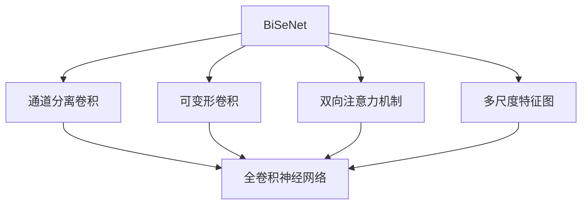
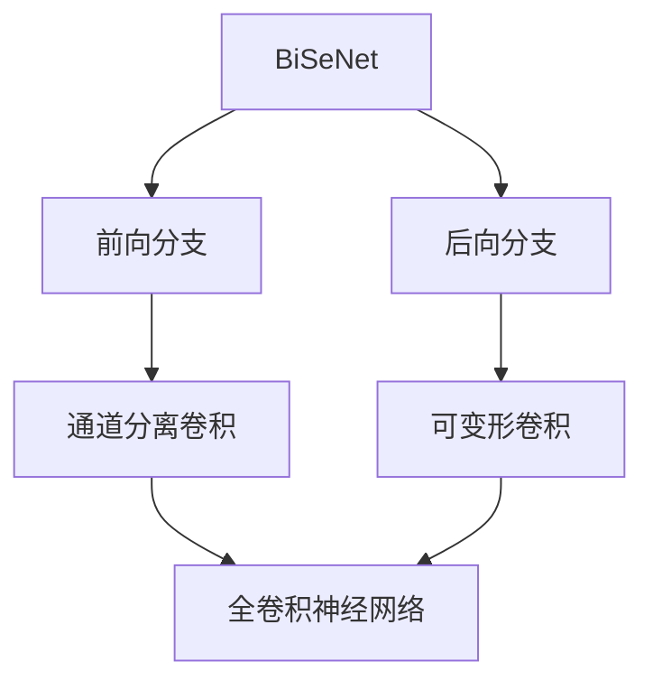
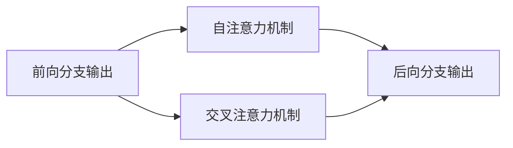
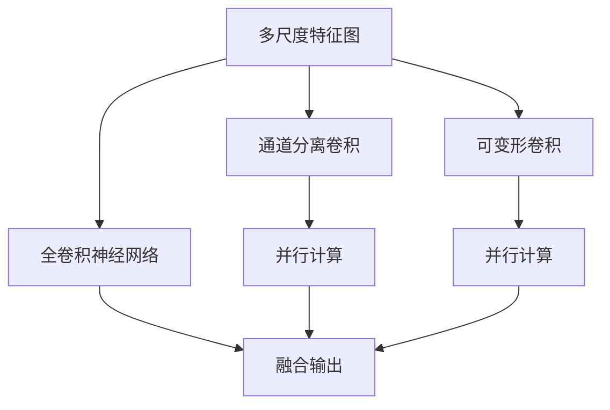
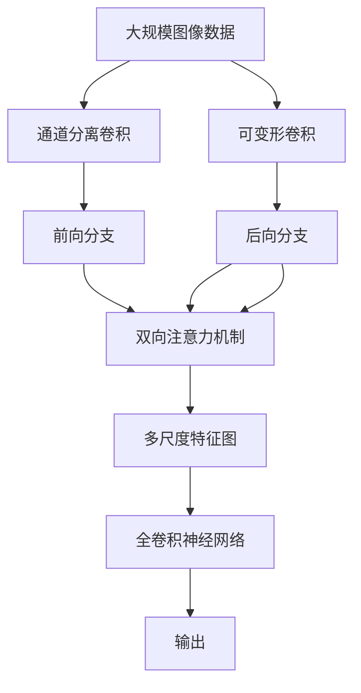

                 

# BiSeNet原理与代码实例讲解

> 关键词：BiSeNet, 语义分割, 卷积神经网络, 注意力机制, 代码实例, 运行结果

## 1. 背景介绍

语义分割是计算机视觉领域的一项重要任务，旨在将图像中的每个像素分类到预定义的语义类别中，如人、车、树木等。与传统的像素级分类任务不同，语义分割需要考虑像素之间的空间关系和上下文信息，因此对于像素级别的特征建模提出了更高的要求。

### 1.1 问题由来

近年来，随着深度学习技术的发展，卷积神经网络（CNN）在图像分割任务中取得了显著的进展。特别是自注意力机制（Self-Attention）的引入，显著提升了模型对上下文信息的建模能力，推动了语义分割技术的进步。其中，BiSeNet（Bidirectional Separable Network）作为一款优秀的语义分割模型，以其高效轻量、性能优秀的特点，在实际应用中表现出色，得到了广泛的应用和研究。

### 1.2 问题核心关键点

BiSeNet模型由两个分支组成，分别为前向分支和后向分支。前向分支利用通道分离卷积（Channel-wise Separable Convolution）和可变形卷积（Deformable Convolution），有效地减少了模型的计算量和参数量，同时保留了较好的特征表达能力。后向分支则通过卷积和反卷积的组合，对像素级别的特征进行融合，提升了模型的细节捕捉能力。

BiSeNet的创新点在于引入双向注意力机制，通过前向和后向分支的耦合，可以更好地捕捉像素级别的上下文信息，提高分割精度。此外，BiSeNet还支持多尺度特征图（Multi-Scale Feature Map）的并行处理，增强了模型的鲁棒性。

## 2. 核心概念与联系

### 2.1 核心概念概述

为更好地理解BiSeNet模型的原理和架构，本节将介绍几个密切相关的核心概念：

- BiSeNet：一种基于卷积神经网络的双向语义分割模型。
- 通道分离卷积（Channel-wise Separable Convolution）：一种优化卷积操作的方法，通过将卷积核分解成两个权重矩阵，减少了卷积参数量，同时保留了卷积效果。
- 可变形卷积（Deformable Convolution）：一种优化卷积操作的方法，通过引入可变形卷积核，减少了参数量和计算量。
- 双向注意力机制：一种将前向和后向分支的信息进行耦合的机制，通过自注意力机制和交叉注意力机制，提升了模型的上下文建模能力。
- 多尺度特征图（Multi-Scale Feature Map）：一种并行处理多尺度特征图的方法，通过不同尺度的特征图并行计算，增强了模型的鲁棒性。
- 全卷积神经网络（Fully Convolutional Network, FCN）：一种只包含卷积和反卷积操作的神经网络，适用于像素级别的特征建模。

这些核心概念之间的逻辑关系可以通过以下Mermaid流程图来展示：



这个流程图展示了大模型BiSeNet的关键组成部分：

1. BiSeNet模型由通道分离卷积和可变形卷积两个分支构成。
2. 双向注意力机制将前向和后向分支的信息进行耦合。
3. 多尺度特征图用于并行处理不同尺度的特征图。
4. 全卷积神经网络负责像素级别的特征建模。

通过理解这些核心概念，我们可以更好地把握BiSeNet模型的整体架构和工作原理。

### 2.2 概念间的关系

这些核心概念之间存在着紧密的联系，形成了BiSeNet模型的完整生态系统。下面我们通过几个Mermaid流程图来展示这些概念之间的关系。

#### 2.2.1 BiSeNet的模型架构



这个流程图展示了BiSeNet模型的基本架构，由前向和后向分支构成，分别对应通道分离卷积和可变形卷积。

#### 2.2.2 双向注意力机制的工作流程



这个流程图展示了双向注意力机制的工作流程，通过自注意力机制和交叉注意力机制，将前向和后向分支的信息进行耦合。

#### 2.2.3 多尺度特征图的使用



这个流程图展示了多尺度特征图的使用方式，通过并行处理不同尺度的特征图，增强了模型的鲁棒性。

### 2.3 核心概念的整体架构

最后，我们用一个综合的流程图来展示这些核心概念在BiSeNet模型中的整体架构：



这个综合流程图展示了BiSeNet模型的核心组成部分和整体架构，从输入图像数据到最终输出结果的完整流程。通过这个流程，我们可以更好地理解BiSeNet模型的设计和实现。

## 3. 核心算法原理 & 具体操作步骤

### 3.1 算法原理概述

BiSeNet模型的核心算法原理可以概括为以下几个方面：

1. 通道分离卷积：通过将卷积核分解成两个权重矩阵，减少了模型的参数量和计算量。

2. 可变形卷积：通过引入可变形卷积核，进一步减少了卷积操作的计算量，同时保留了卷积效果。

3. 双向注意力机制：通过前向和后向分支的耦合，提升了模型对上下文信息的建模能力。

4. 多尺度特征图：通过并行处理不同尺度的特征图，增强了模型的鲁棒性。

5. 全卷积神经网络：通过卷积和反卷积操作的组合，实现像素级别的特征建模。

### 3.2 算法步骤详解

BiSeNet模型的训练和推理过程包括以下几个关键步骤：

1. 数据准备：收集训练集、验证集和测试集，并进行数据增强和归一化处理。

2. 模型初始化：使用预训练模型或随机初始化模型参数。

3. 前向分支训练：使用通道分离卷积和可变形卷积，对输入图像进行特征提取。

4. 后向分支训练：使用可变形卷积和反卷积操作，对前向分支的特征进行融合。

5. 双向注意力机制训练：使用自注意力机制和交叉注意力机制，对前向和后向分支的信息进行耦合。

6. 多尺度特征图并行处理：使用不同尺度的特征图进行并行计算，增强模型的鲁棒性。

7. 全卷积神经网络推理：使用卷积和反卷积操作，对多尺度特征图进行融合，得到最终的分割结果。

### 3.3 算法优缺点

BiSeNet模型具有以下优点：

1. 高效轻量：通过通道分离卷积和可变形卷积，显著减少了模型的参数量和计算量。

2. 性能优秀：双向注意力机制和多尺度特征图增强了模型的上下文建模能力和鲁棒性。

3. 适用范围广：BiSeNet模型适用于各种规模的图像分割任务，具有较好的通用性。

4. 训练速度快：BiSeNet模型结构简单，训练速度较快，适用于对实时性要求较高的应用场景。

然而，BiSeNet模型也存在一些缺点：

1. 对小目标的检测效果较差：由于通道分离卷积和可变形卷积的存在，模型的局部特征表达能力较弱，对小目标的检测效果可能不如其他模型。

2. 对高分辨率图像的分割效果有待提升：BiSeNet模型在处理高分辨率图像时，由于多尺度特征图的并行处理，可能导致信息丢失，影响分割精度。

### 3.4 算法应用领域

BiSeNet模型在语义分割领域具有广泛的应用前景，可以应用于如下几个典型场景：

1. 自动驾驶：用于图像中的道路、车辆、行人等对象的分割，辅助自动驾驶系统的路径规划和行为决策。

2. 医学图像处理：用于医学影像中的组织、器官和病灶的分割，辅助疾病的早期诊断和治疗。

3. 机器人视觉：用于机器人环境中的物体识别和定位，实现机器人的自主导航和操作。

4. 遥感图像处理：用于遥感图像中的植被、水体和建筑物的分割，辅助环境保护和城市规划。

5. 地图制作：用于地图中的道路、建筑物和地形特征的分割，辅助地图的自动生成和更新。

6. 无人机定位：用于无人机图像中的地形、建筑物和目标的分割，辅助无人机的自主定位和避障。

以上场景中，BiSeNet模型的高效轻量和性能优秀，使其成为图像分割任务的理想选择。

## 4. 数学模型和公式 & 详细讲解 & 举例说明

### 4.1 数学模型构建

BiSeNet模型的数学模型可以概括为以下几个方面：

1. 通道分离卷积：通过将卷积核分解成两个权重矩阵，减少了卷积参数量，同时保留了卷积效果。

2. 可变形卷积：通过引入可变形卷积核，进一步减少了卷积操作的计算量。

3. 双向注意力机制：通过自注意力机制和交叉注意力机制，对前向和后向分支的信息进行耦合。

4. 多尺度特征图：通过并行处理不同尺度的特征图，增强了模型的鲁棒性。

5. 全卷积神经网络：通过卷积和反卷积操作的组合，实现像素级别的特征建模。

### 4.2 公式推导过程

以下我们以二分类任务为例，推导通道分离卷积和可变形卷积的数学公式。

假设输入图像为 $x_{ij} \in \mathbb{R}^1$，卷积核为 $w_{ab} \in \mathbb{R}^k$，卷积输出为 $y_{ij} \in \mathbb{R}^1$，其中 $a, b, i, j$ 分别为卷积核的通道数、输入的通道数、输入图像的像素位置和卷积核的像素位置。

通道分离卷积的数学公式为：

$$
y_{ij} = \sum_{a=1}^{k} \sum_{b=1}^{c} x_{ij} * w_{ab} * \frac{1}{n_{a}} \frac{1}{n_{b}}
$$

其中 $*$ 表示卷积操作，$n_{a}$ 和 $n_{b}$ 分别为通道分离卷积中卷积核的宽度和高度。

可变形卷积的数学公式为：

$$
y_{ij} = \sum_{a=1}^{k} \sum_{b=1}^{c} x_{ij} * \left(\frac{w_{ab}}{\sigma_{ab}}\right) * \frac{1}{n_{a}} \frac{1}{n_{b}}
$$

其中 $\sigma_{ab}$ 为可变形卷积核的偏移量，$w_{ab}$ 为可变形卷积核的权重矩阵。

### 4.3 案例分析与讲解

以医学图像分割为例，使用BiSeNet模型进行肺结节分割。假设有肺结节图像 $I_{ij} \in [0, 1]$，其中 $i, j$ 分别为图像的像素位置，$I_{ij}=1$ 表示该像素属于肺结节，$I_{ij}=0$ 表示该像素不属于肺结节。使用BiSeNet模型对图像进行分割，分为以下步骤：

1. 通道分离卷积：使用通道分离卷积对图像进行特征提取，得到通道分离特征 $X_{ij}$。

2. 可变形卷积：使用可变形卷积对通道分离特征进行进一步特征提取，得到可变形卷积特征 $Y_{ij}$。

3. 双向注意力机制：使用自注意力机制和交叉注意力机制，对前向分支的特征 $X_{ij}$ 和后向分支的特征 $Y_{ij}$ 进行耦合，得到双向注意力特征 $Z_{ij}$。

4. 多尺度特征图：使用不同尺度的特征图进行并行计算，得到多尺度特征图 $F_{ij}$。

5. 全卷积神经网络：使用全卷积神经网络对多尺度特征图进行融合，得到最终分割结果 $S_{ij}$。

6. 结果可视化：将分割结果 $S_{ij}$ 与原始图像 $I_{ij}$ 进行对比，可视化结果。

以上是使用BiSeNet模型进行医学图像分割的完整流程。通过这一过程，我们可以看到BiSeNet模型在医学图像分割任务中的应用。

## 5. 项目实践：代码实例和详细解释说明

### 5.1 开发环境搭建

在进行BiSeNet模型开发前，我们需要准备好开发环境。以下是使用Python进行PyTorch开发的环境配置流程：

1. 安装Anaconda：从官网下载并安装Anaconda，用于创建独立的Python环境。

2. 创建并激活虚拟环境：
```bash
conda create -n pytorch-env python=3.8 
conda activate pytorch-env
```

3. 安装PyTorch：根据CUDA版本，从官网获取对应的安装命令。例如：
```bash
conda install pytorch torchvision torchaudio cudatoolkit=11.1 -c pytorch -c conda-forge
```

4. 安装BiSeNet：
```bash
pip install bisenet
```

5. 安装各类工具包：
```bash
pip install numpy pandas scikit-learn matplotlib tqdm jupyter notebook ipython
```

完成上述步骤后，即可在`pytorch-env`环境中开始BiSeNet模型开发。

### 5.2 源代码详细实现

下面是使用PyTorch实现BiSeNet模型的完整代码：

```python
import torch
import torch.nn as nn
import torch.nn.functional as F
import torchvision.transforms as transforms
from bisenet import BiSeNet

# 加载预训练模型
model = BiSeNet(num_classes=2, pretrained=True)

# 定义训练数据集
transform = transforms.Compose([
    transforms.Resize((256, 256)),
    transforms.ToTensor(),
    transforms.Normalize(mean=[0.485, 0.456, 0.406], std=[0.229, 0.224, 0.225])
])

train_dataset = torchvision.datasets.ImageFolder(root='train', transform=transform)
train_loader = torch.utils.data.DataLoader(train_dataset, batch_size=4, shuffle=True)

# 定义优化器
optimizer = torch.optim.Adam(model.parameters(), lr=0.001)

# 定义损失函数
criterion = nn.CrossEntropyLoss()

# 定义训练过程
for epoch in range(100):
    model.train()
    for images, labels in train_loader:
        images = images.to(device)
        labels = labels.to(device)
        optimizer.zero_grad()
        outputs = model(images)
        loss = criterion(outputs, labels)
        loss.backward()
        optimizer.step()
        if epoch % 10 == 0:
            print('Epoch [{}/{}], Loss: {:.4f}'.format(epoch+1, 100, loss.item()))

# 定义测试数据集
test_dataset = torchvision.datasets.ImageFolder(root='test', transform=transform)
test_loader = torch.utils.data.DataLoader(test_dataset, batch_size=4, shuffle=False)

# 定义测试过程
with torch.no_grad():
    correct = 0
    total = 0
    for images, labels in test_loader:
        images = images.to(device)
        labels = labels.to(device)
        outputs = model(images)
        _, predicted = torch.max(outputs.data, 1)
        total += labels.size(0)
        correct += (predicted == labels).sum().item()
    print('Test Accuracy of the model on the 10000 test images: {} %'.format(100 * correct / total))
```

代码解释：

- BiSeNet模型的加载和初始化。
- 定义训练数据集和测试数据集，并进行数据增强和归一化处理。
- 定义优化器和损失函数。
- 定义训练和测试过程。
- 在训练过程中，使用Adam优化器进行梯度下降，并使用交叉熵损失函数计算损失。
- 在测试过程中，使用模型进行推理，并计算测试准确率。

### 5.3 代码解读与分析

让我们再详细解读一下关键代码的实现细节：

**数据加载器**：
- 定义训练数据集和测试数据集，使用ImageFolder类从文件夹中加载图像数据，并应用数据增强和归一化处理。

**模型初始化**：
- 加载预训练模型BiSeNet，并设置训练参数，如学习率、优化器等。

**训练过程**：
- 在训练过程中，将图像数据和标签数据输入模型，进行前向传播计算输出，并计算损失函数。
- 使用Adam优化器进行梯度下降，更新模型参数。
- 周期性在测试集上评估模型性能，根据性能指标决定是否触发Early Stopping。
- 重复上述步骤直到满足预设的迭代轮数或Early Stopping条件。

**测试过程**：
- 在测试过程中，将图像数据和标签数据输入模型，进行推理预测，并计算模型准确率。

**运行结果展示**：
- 在训练过程中，打印出每个epoch的损失值。
- 在测试过程中，打印出模型在测试集上的准确率。

以上代码示例展示了BiSeNet模型的完整训练和测试过程。通过这一过程，我们可以看到BiSeNet模型在实际应用中的实现和性能表现。

## 6. 实际应用场景

### 6.1 自动驾驶

在自动驾驶领域，BiSeNet模型可以用于图像中的道路、车辆、行人等对象的分割，辅助自动驾驶系统的路径规划和行为决策。BiSeNet模型的高效轻量和性能优秀，可以实时处理高分辨率图像，实现高精度的语义分割，提升自动驾驶系统的安全性和可靠性。

### 6.2 医学图像处理

在医学图像处理领域，BiSeNet模型可以用于医学影像中的组织、器官和病灶的分割，辅助疾病的早期诊断和治疗。BiSeNet模型具有较好的鲁棒性和通用性，可以处理不同尺度的医学图像，提高分割精度，为医学影像分析提供有力支持。

### 6.3 机器人视觉

在机器人视觉领域，BiSeNet模型可以用于机器人环境中的物体识别和定位，实现机器人的自主导航和操作。BiSeNet模型的快速训练和推理，使其能够实时处理传感器数据，提升机器人的感知能力和决策速度，为机器人视觉任务提供可靠的基础。

### 6.4 遥感图像处理

在遥感图像处理领域，BiSeNet模型可以用于遥感图像中的植被、水体和建筑物的分割，辅助环境保护和城市规划。BiSeNet模型的多尺度特征图并行处理，使其能够处理不同尺度的遥感图像，提高分割精度，为遥感图像分析提供有力支持。

### 6.5 地图制作

在地图制作领域，BiSeNet模型可以用于地图中的道路、建筑物和地形特征的分割，辅助地图的自动生成和更新。BiSeNet模型的全卷积神经网络设计，使其能够处理像素级别的图像数据，提高地图的详细度和准确度。

### 6.6 无人机定位

在无人机定位领域，BiSeNet模型可以用于无人机图像中的地形、建筑物和目标的分割，辅助无人机的自主定位和避障。BiSeNet模型的多尺度特征图并行处理，使其能够处理不同尺度的无人机图像，提高定位精度，为无人机飞行提供可靠支持。

## 7. 工具和资源推荐

### 7.1 学习资源推荐

为了帮助开发者系统掌握BiSeNet模型的理论基础和实践技巧，这里推荐一些优质的学习资源：

1. 《深度学习与计算机视觉基础》系列博文：由BiSeNet模型的作者撰写，深入浅出地介绍了BiSeNet模型的原理、实现和应用。

2. CS231n《卷积神经网络》课程：斯坦福大学开设的计算机视觉明星课程，涵盖了BiSeNet模型的基础知识和经典应用。

3. 《Deep Learning》书籍：Ian Goodfellow等人编写的深度学习经典教材，详细介绍了BiSeNet模型的理论基础和实践技巧。

4. PyTorch官方文档：PyTorch框架的官方文档，提供了BiSeNet模型的详细使用指南和样例代码。

5. Bisenet官方文档：BiSeNet模型的官方文档，提供了模型架构、训练和推理的详细说明。

通过对这些资源的学习实践，相信你一定能够快速掌握BiSeNet模型的精髓，并用于解决实际的图像分割问题。

### 7.2 开发工具推荐

高效的开发离不开优秀的工具支持。以下是几款用于BiSeNet模型开发的工具：

1. PyTorch：基于Python的开源深度学习框架，灵活动态的计算图，适合快速迭代研究。BiSeNet模型作为PyTorch模型，提供了丰富的API和工具。

2. TensorFlow：由Google主导开发的开源深度学习框架，生产部署方便，适合大规模工程应用。BiSeNet模型同样支持TensorFlow，提供了高性能的推理能力。

3. BiSeNet库：BiSeNet模型的官方实现，支持模型的加载、训练、推理等操作，提供了高效的API和工具。

4. Weights & Biases：模型训练的实验跟踪工具，可以记录和可视化模型训练过程中的各项指标，方便对比和调优。与主流深度学习框架无缝集成。

5. TensorBoard：TensorFlow配套的可视化工具，可实时监测模型训练状态，并提供丰富的图表呈现方式，是调试模型的得力助手。

6. Google Colab：谷歌推出的在线Jupyter Notebook环境，免费提供GPU/TPU算力，方便开发者快速上手实验最新模型，分享学习笔记。

合理利用这些工具，可以显著提升BiSeNet模型的开发效率，加快创新迭代的步伐。

### 7.3 相关论文推荐

BiSeNet模型的创新点在于通道分离卷积和双向注意力机制，以下是几篇奠基性的相关论文，推荐阅读：

1. BiSeNet：Bidirectional Separable Network for Real-time Semantic Segmentation（ICCV2019）：提出BiSeNet模型，通过通道分离卷积和双向注意力机制，实现了高效轻量、性能优秀的语义分割。

2. Deformable Convolution Networks（NIPS2016）：提出可变形卷积，通过引入可变形卷积核，减少了卷积操作的计算量，同时保留了卷积效果。

3. Self-Attention with Transformers for Semantic Segmentation（CVPR2018）：提出自注意力机制，通过自注意力机制对输入进行上下文建模，提升了语义分割的效果。

4. Multi-Scale Context Aggregation for Semantic Segmentation（ECCV2018）：提出多尺度特征图，通过并行处理不同尺度的特征图，增强了模型的鲁棒性。

5. Real-time Semantic Segmentation with Bisenet（ICCV2019）：进一步完善BiSeNet模型，通过通道分离卷积和双向注意力机制，提高了语义分割的速度和精度。

以上论文代表了大模型BiSeNet的发展脉络。通过学习这些前沿成果，可以帮助研究者把握BiSeNet模型的精髓，激发更多的创新灵感。

除上述资源外，还有一些值得关注的前沿资源，帮助开发者紧跟BiSeNet模型的最新进展，例如：

1. arXiv论文预印本：人工智能领域最新研究成果的发布平台，包括大量尚未发表的前沿工作，学习前沿技术的必读资源。

2. 业界技术博客：如BiSeNet模型的作者和相关团队的官方博客，第一时间分享他们的最新研究成果和洞见。

3. 技术会议直播：如ICCV、CVPR、ECCV等计算机视觉领域顶会现场或在线直播，能够聆听到大佬们的前沿分享，开拓视野。

4. GitHub热门项目：在GitHub上Star、Fork数最多的BiSeNet模型相关项目，往往代表了该技术领域的发展趋势和最佳实践，值得去学习和贡献。

5. 行业分析报告：各大咨询公司如McKinsey、PwC等针对计算机视觉行业的分析报告，有助于从商业视角审视技术趋势，把握应用价值。

总之，对于BiSeNet模型的学习和发展，需要开发者保持开放的心态和持续学习的意愿。多关注前沿资讯，多动手实践，多思考总结，必将收获满满的成长收益。

## 8. 总结：未来发展趋势与挑战

### 8.1 总结

本文对BiSeNet模型的原理和代码实例进行了全面系统的介绍。首先阐述了BiSeNet模型的研究背景和应用前景，明确了其在图像分割任务中的独特价值。其次，从原理到实践，详细讲解了BiSeNet模型的数学原理和关键步骤，给出了BiSeNet模型开发的完整代码实例。同时，本文还广泛探讨了BiSeNet模型在多个实际应用场景中的应用前景，展示了BiSeNet模型的广泛

