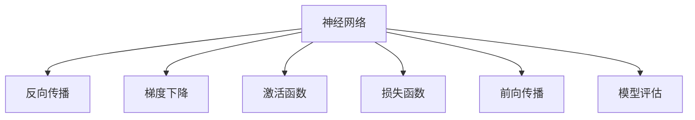
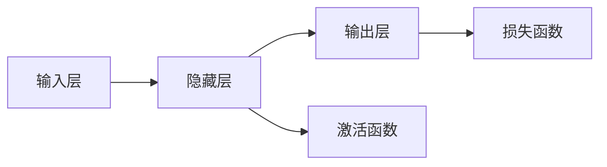
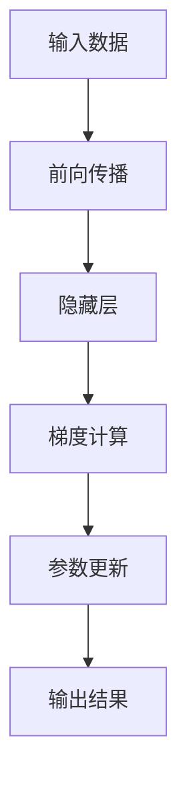
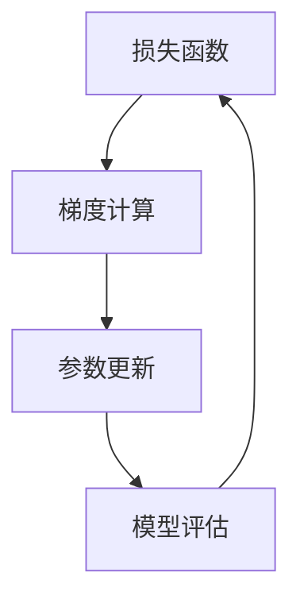
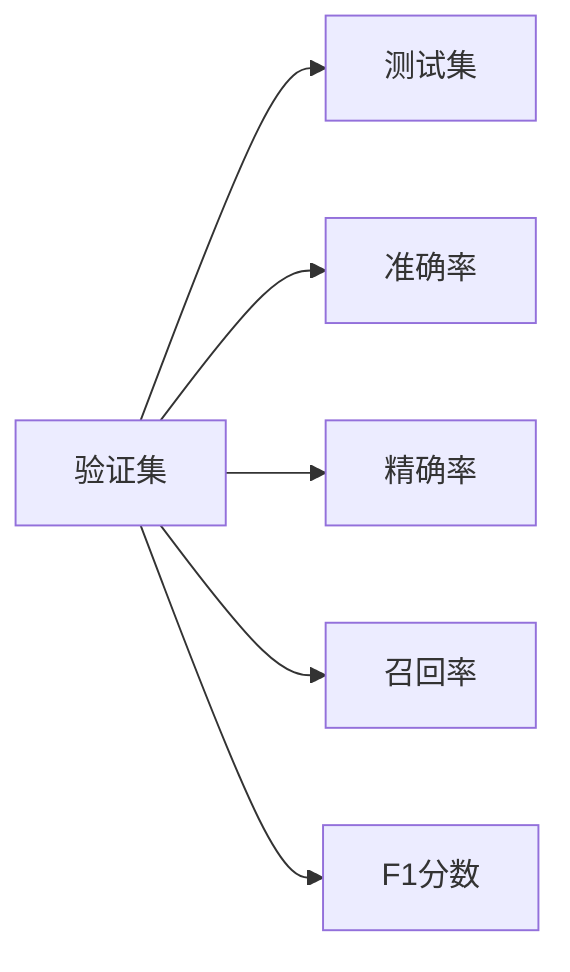
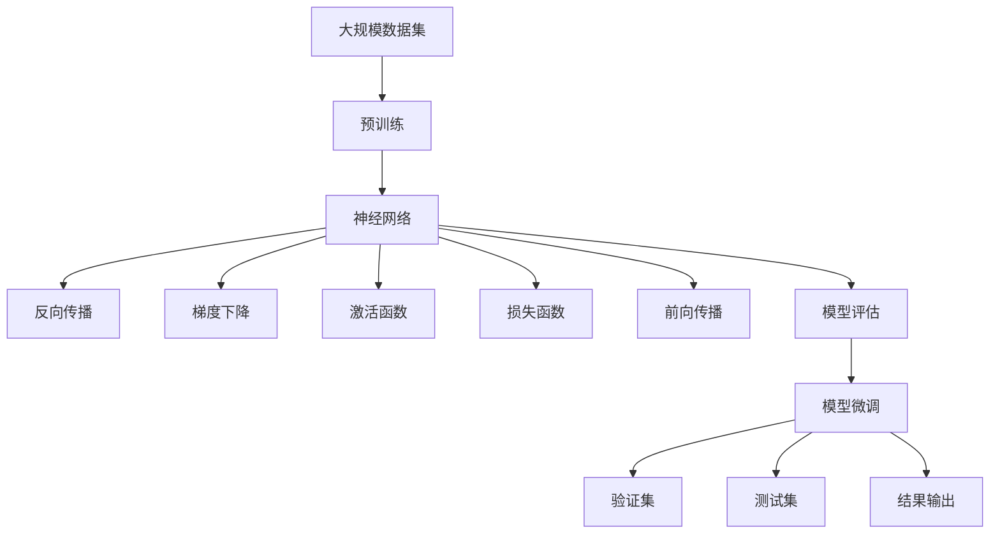

                 

# Deep Learning (DL) 原理与代码实战案例讲解

> 关键词：深度学习,神经网络,反向传播,梯度下降,损失函数,激活函数,前向传播,模型评估,代码实践

## 1. 背景介绍

### 1.1 问题由来
深度学习（Deep Learning, DL）是人工智能领域的重要分支，它通过多层次的非线性映射来捕捉数据中的复杂关系，广泛应用于图像识别、语音识别、自然语言处理等众多领域。深度学习技术的核心在于神经网络（Neural Network, NN），包括多层感知机（Multilayer Perceptron, MLP）、卷积神经网络（Convolutional Neural Network, CNN）、循环神经网络（Recurrent Neural Network, RNN）、变分自编码器（Variational Autoencoder, VAE）、生成对抗网络（Generative Adversarial Network, GAN）等。

近年来，随着深度学习理论的不断突破，神经网络结构越来越复杂，模型参数量飞速增长，训练和推理过程变得更加高效和稳定。这一系列进步得益于反向传播算法（Backpropagation, BP）的优化，以及各种正则化技术的应用，如权重衰减、Dropout等。

然而，在实际应用中，如何构建合理的神经网络结构，选择合适的激活函数，理解并优化损失函数，进行有效的模型评估和训练，仍然是一个挑战。本文将通过系统介绍深度学习的基本原理，配合代码实践案例讲解，帮助读者深入理解和掌握深度学习技术的核心要点。

## 2. 核心概念与联系

### 2.1 核心概念概述

为更好地理解深度学习的核心概念，本节将介绍几个关键组件及其相互联系：

- 神经网络：由多个层次的节点（或称神经元）组成，节点通过边相连，构成一个图结构。神经网络的每一层负责提取数据的高级特征，通过层层抽象，最终输出结果。

- 反向传播：深度学习中常用的优化算法，用于计算损失函数对网络参数的梯度，并通过梯度下降等方式更新参数。反向传播通过链式法则实现梯度的反向传递，避免了前向传播中计算全部输出的复杂性。

- 梯度下降：一种常用的优化算法，通过沿着损失函数梯度的反方向更新参数，不断迭代优化模型性能。梯度下降算法包括批量梯度下降（Batch Gradient Descent, BGD）、随机梯度下降（Stochastic Gradient Descent, SGD）和动量梯度下降（Momentum Gradient Descent）等变种。

- 激活函数：用于引入非线性映射，提高神经网络的表达能力。常见的激活函数包括Sigmoid、Tanh、ReLU等。

- 损失函数：用于衡量模型预测值与真实标签之间的差距，常见的损失函数包括均方误差（Mean Squared Error, MSE）、交叉熵损失（Cross Entropy Loss, CE Loss）等。

- 前向传播：通过神经网络对输入数据进行层次化的特征提取和转换，最终得到模型预测结果的过程。前向传播是一种高效计算网络输出的方式。

- 模型评估：通过验证集和测试集对模型进行评估，常用指标包括准确率、精确率、召回率、F1分数等。

这些核心概念之间的逻辑关系可以通过以下Mermaid流程图来展示：



这个流程图展示了深度学习的基本流程：

1. 神经网络负责提取数据的高级特征。
2. 反向传播用于计算梯度，更新模型参数。
3. 梯度下降优化算法用于迭代优化。
4. 激活函数用于引入非线性映射。
5. 损失函数用于衡量模型预测与真实标签的差距。
6. 前向传播用于计算网络输出。
7. 模型评估用于验证模型性能。

这些核心概念共同构成了深度学习的基本架构和计算过程。通过理解这些概念，我们可以更好地把握深度学习的工作原理和优化方法。

### 2.2 概念间的关系

这些核心概念之间存在着紧密的联系，形成了深度学习的完整生态系统。下面我们通过几个Mermaid流程图来展示这些概念之间的关系。

#### 2.2.1 神经网络的层次结构



这个流程图展示了神经网络的层次结构，从输入层到隐藏层再到输出层，每一层都通过激活函数进行特征提取和映射，最终输出预测结果。

#### 2.2.2 反向传播的计算过程



这个流程图展示了反向传播的基本计算过程，即先进行前向传播得到网络输出，再进行梯度计算和参数更新。

#### 2.2.3 梯度下降的优化过程



这个流程图展示了梯度下降的优化过程，即通过计算梯度更新参数，不断迭代优化模型。

#### 2.2.4 模型评估的衡量指标



这个流程图展示了模型评估的常见指标，即在验证集和测试集上计算准确率、精确率、召回率和F1分数。

### 2.3 核心概念的整体架构

最后，我们用一个综合的流程图来展示这些核心概念在大规模深度学习模型微调过程中的整体架构：



这个综合流程图展示了从预训练到模型微调，再到模型评估的完整过程。大规模数据集首先通过预训练得到基础模型，然后通过反向传播和梯度下降进行模型微调，最后通过模型评估验证微调效果，并将结果应用于实际问题中。 通过这些流程图，我们可以更清晰地理解深度学习的计算过程和优化方法，为后续深入讨论具体的模型构建和训练方法奠定基础。

## 3. 核心算法原理 & 具体操作步骤
### 3.1 算法原理概述

深度学习的核心算法原理基于反向传播和梯度下降。下面详细介绍这些算法的基本原理和操作步骤。

#### 3.1.1 神经网络的前向传播

神经网络的前向传播过程如下：

1. 输入数据 $x$ 进入神经网络的第一层。
2. 每一层通过激活函数 $\sigma$ 进行非线性变换，得到特征表示 $h$。
3. 特征表示 $h$ 被送入下一层进行继续处理。
4. 重复上述步骤，直到输出层。
5. 输出层通过激活函数得到预测结果 $\hat{y}$。

前向传播的过程可以用以下代码表示：

```python
def forward(X, model):
    h = X
    for layer in model:
        h = layer(h)
    y_pred = h
    return y_pred
```

#### 3.1.2 损失函数的定义

常用的损失函数包括均方误差（Mean Squared Error, MSE）和交叉熵损失（Cross Entropy Loss, CE Loss）：

1. MSE：用于回归问题，计算预测值与真实值之间的平均平方差。
2. CE Loss：用于分类问题，衡量模型预测概率分布与真实标签之间的差异。

代码示例如下：

```python
def mse_loss(y_true, y_pred):
    return tf.reduce_mean(tf.square(y_true - y_pred))

def ce_loss(y_true, y_pred):
    y_true = tf.one_hot(y_true, num_classes)
    y_pred = tf.nn.softmax(y_pred)
    return tf.reduce_mean(tf.nn.softmax_cross_entropy_with_logits(labels=y_true, logits=y_pred))
```

#### 3.1.3 梯度下降的优化过程

梯度下降的优化过程如下：

1. 定义损失函数 $\mathcal{L}$。
2. 对模型参数 $\theta$ 求偏导数，得到梯度 $\mathbf{g} = \nabla_{\theta} \mathcal{L}$。
3. 更新模型参数 $\theta$：
   $$
   \theta \leftarrow \theta - \eta \cdot \mathbf{g}
   $$
   其中 $\eta$ 为学习率。

代码示例如下：

```python
def gradient_descent(model, X, y_true, learning_rate):
    y_pred = model(X)
    loss = loss_func(y_true, y_pred)
    grads = tf.gradients(loss, model.parameters())
    for param, grad in zip(model.parameters(), grads):
        param -= learning_rate * grad
    return loss
```

#### 3.1.4 反向传播的计算过程

反向传播的计算过程如下：

1. 通过前向传播计算预测结果 $\hat{y}$。
2. 计算预测结果与真实标签之间的误差 $e$。
3. 根据误差 $e$ 计算损失函数 $\mathcal{L}$ 的梯度 $\mathbf{g}$。
4. 通过链式法则计算每一层参数的梯度。
5. 更新模型参数 $\theta$。

代码示例如下：

```python
def backpropagation(model, X, y_true, learning_rate):
    y_pred = model(X)
    loss = loss_func(y_true, y_pred)
    grads = tf.gradients(loss, model.parameters())
    for param, grad in zip(model.parameters(), grads):
        param -= learning_rate * grad
    return loss
```

### 3.2 算法步骤详解

深度学习的具体实现步骤如下：

1. **数据准备**：收集标注数据，将数据划分为训练集、验证集和测试集。
2. **模型构建**：选择合适的神经网络结构，设计各层参数的初始化方法。
3. **正向传播**：将训练集输入模型，计算预测结果。
4. **反向传播**：计算预测结果与真实标签之间的误差，通过反向传播计算损失函数的梯度。
5. **梯度下降**：根据梯度下降算法更新模型参数。
6. **模型评估**：在验证集和测试集上评估模型性能。
7. **模型微调**：针对特定任务，对模型进行微调。

具体的代码实现如下：

```python
# 数据准备
X_train, y_train = ...
X_valid, y_valid = ...
X_test, y_test = ...

# 模型构建
model = ...

# 正向传播
y_pred_train = model(X_train)
y_pred_valid = model(X_valid)
y_pred_test = model(X_test)

# 反向传播
loss_train = backpropagation(model, X_train, y_train, learning_rate)
loss_valid = backpropagation(model, X_valid, y_valid, learning_rate)
loss_test = backpropagation(model, X_test, y_test, learning_rate)

# 梯度下降
grads = tf.gradients(loss_train, model.parameters())
for param, grad in zip(model.parameters(), grads):
    param -= learning_rate * grad

# 模型评估
accuracy_train = evaluate(y_train, y_pred_train)
accuracy_valid = evaluate(y_valid, y_valid)
accuracy_test = evaluate(y_test, y_pred_test)

# 模型微调
adjust_model_parameters(model, X_train, y_train, learning_rate)
evaluate(y_valid, y_valid)
```

### 3.3 算法优缺点

深度学习具有以下优点：

1. 强大的表达能力：多层次的非线性映射使得深度学习能够捕捉数据中的复杂关系，适用于处理非线性、高维度的数据。
2. 自动特征提取：通过堆叠多个非线性层，深度学习能够自动地提取数据的高级特征，减少了人工特征工程的工作量。
3. 适应性强：深度学习模型可以通过调整参数和网络结构，适应不同的数据集和任务。

深度学习也存在以下缺点：

1. 计算复杂度高：深度学习模型通常具有大量的参数和计算量，训练和推理过程耗时较长。
2. 过拟合风险高：深度学习模型容易过拟合，尤其是在训练数据不足的情况下。
3. 可解释性差：深度学习模型通常是"黑盒"系统，难以解释其内部工作机制。
4. 资源需求高：深度学习模型需要大量的计算资源和存储空间，对硬件设备的要求较高。

### 3.4 算法应用领域

深度学习在众多领域中都有广泛应用，包括但不限于：

1. 图像识别：通过卷积神经网络（CNN）处理图像数据，实现物体检测、图像分类等任务。
2. 语音识别：通过循环神经网络（RNN）和长短期记忆网络（LSTM）处理语音数据，实现语音识别、语音合成等任务。
3. 自然语言处理：通过循环神经网络（RNN）、长短期记忆网络（LSTM）、门控循环单元（GRU）等处理文本数据，实现文本分类、情感分析、机器翻译等任务。
4. 游戏AI：通过强化学习（Reinforcement Learning, RL）和深度学习结合，训练智能体（agent）在各种游戏环境中进行决策。
5. 自动驾驶：通过深度学习和计算机视觉结合，训练自动驾驶系统识别道路、车辆等目标，实现自动驾驶。
6. 医疗诊断：通过深度学习和医学影像结合，训练医学影像分类、分割模型，辅助医疗诊断。

## 4. 数学模型和公式 & 详细讲解 & 举例说明

### 4.1 数学模型构建

深度学习的数学模型主要由神经网络、激活函数、损失函数和梯度下降算法组成。下面详细介绍这些数学模型的构建过程。

#### 4.1.1 神经网络的结构

神经网络的结构可以用以下公式表示：

$$
\begin{aligned}
&h^{(l)} = f(\mathbf{W}^{(l)} \mathbf{x}^{(l-1)} + \mathbf{b}^{(l)}) \\
&\mathbf{x}^{(l)} = h^{(l)}
\end{aligned}
$$

其中 $\mathbf{x}^{(l)}$ 表示第 $l$ 层的输入，$h^{(l)}$ 表示第 $l$ 层的输出，$f$ 表示激活函数，$\mathbf{W}^{(l)}$ 表示第 $l$ 层的权重矩阵，$\mathbf{b}^{(l)}$ 表示第 $l$ 层的偏置向量。

#### 4.1.2 激活函数

常用的激活函数包括Sigmoid、Tanh、ReLU等。下面以ReLU函数为例，介绍激活函数的定义和性质：

$$
\sigma(x) = \max(0, x)
$$

ReLU函数在输入为正数时保持线性，输入为负数时输出为零，具有很好的非线性特性和计算效率。

#### 4.1.3 损失函数

常用的损失函数包括均方误差（MSE）和交叉熵损失（CE Loss）：

1. MSE：用于回归问题，计算预测值与真实值之间的平均平方差。
2. CE Loss：用于分类问题，衡量模型预测概率分布与真实标签之间的差异。

代码示例如下：

```python
def mse_loss(y_true, y_pred):
    return tf.reduce_mean(tf.square(y_true - y_pred))

def ce_loss(y_true, y_pred):
    y_true = tf.one_hot(y_true, num_classes)
    y_pred = tf.nn.softmax(y_pred)
    return tf.reduce_mean(tf.nn.softmax_cross_entropy_with_logits(labels=y_true, logits=y_pred))
```

#### 4.1.4 梯度下降的优化过程

梯度下降的优化过程可以用以下公式表示：

$$
\theta \leftarrow \theta - \eta \cdot \nabla_{\theta} \mathcal{L}
$$

其中 $\theta$ 表示模型参数，$\eta$ 表示学习率，$\nabla_{\theta} \mathcal{L}$ 表示损失函数 $\mathcal{L}$ 对 $\theta$ 的梯度。

### 4.2 公式推导过程

以下是深度学习中的几个核心公式的推导过程：

#### 4.2.1 前向传播的计算过程

前向传播的计算过程如下：

1. 输入数据 $x$ 进入神经网络的第一层。
2. 每一层通过激活函数 $\sigma$ 进行非线性变换，得到特征表示 $h$。
3. 特征表示 $h$ 被送入下一层进行继续处理。
4. 重复上述步骤，直到输出层。
5. 输出层通过激活函数得到预测结果 $\hat{y}$。

代码示例如下：

```python
def forward(X, model):
    h = X
    for layer in model:
        h = layer(h)
    y_pred = h
    return y_pred
```

#### 4.2.2 反向传播的计算过程

反向传播的计算过程如下：

1. 通过前向传播计算预测结果 $\hat{y}$。
2. 计算预测结果与真实标签之间的误差 $e$。
3. 根据误差 $e$ 计算损失函数 $\mathcal{L}$ 的梯度 $\mathbf{g}$。
4. 通过链式法则计算每一层参数的梯度。
5. 更新模型参数 $\theta$。

代码示例如下：

```python
def backpropagation(model, X, y_true, learning_rate):
    y_pred = model(X)
    loss = loss_func(y_true, y_pred)
    grads = tf.gradients(loss, model.parameters())
    for param, grad in zip(model.parameters(), grads):
        param -= learning_rate * grad
    return loss
```

#### 4.2.3 梯度下降的优化过程

梯度下降的优化过程如下：

1. 定义损失函数 $\mathcal{L}$。
2. 对模型参数 $\theta$ 求偏导数，得到梯度 $\mathbf{g} = \nabla_{\theta} \mathcal{L}$。
3. 更新模型参数 $\theta$：
   $$
   \theta \leftarrow \theta - \eta \cdot \mathbf{g}
   $$
   其中 $\eta$ 为学习率。

代码示例如下：

```python
def gradient_descent(model, X, y_true, learning_rate):
    y_pred = model(X)
    loss = loss_func(y_true, y_pred)
    grads = tf.gradients(loss, model.parameters())
    for param, grad in zip(model.parameters(), grads):
        param -= learning_rate * grad
    return loss
```

### 4.3 案例分析与讲解

下面我们以手写数字识别为例，演示深度学习模型的构建和训练过程。

#### 4.3.1 MNIST数据集

MNIST数据集是一个经典的手写数字识别数据集，包含60000个训练样本和10000个测试样本，每个样本是一个28x28像素的灰度图像。

```python
from tensorflow.keras.datasets import mnist

(X_train, y_train), (X_test, y_test) = mnist.load_data()
X_train = X_train.reshape(-1, 28*28).astype('float32') / 255.0
X_test = X_test.reshape(-1, 28*28).astype('float32') / 255.0
y_train = to_categorical(y_train, num_classes=10)
y_test = to_categorical(y_test, num_classes=10)
```

#### 4.3.2 构建模型

我们构建一个包含两个隐藏层的全连接神经网络，使用ReLU激活函数和交叉熵损失函数：

```python
from tensorflow.keras.models import Sequential
from tensorflow.keras.layers import Dense, Dropout

model = Sequential()
model.add(Dense(128, activation='relu', input_dim=784))
model.add(Dropout(0.2))
model.add(Dense(64, activation='relu'))
model.add(Dropout(0.2))
model.add(Dense(10, activation='softmax'))

model.compile(optimizer='adam', loss='categorical_crossentropy', metrics=['accuracy'])
```

#### 4.3.3 训练模型

使用梯度下降算法训练模型，记录训练过程中的损失和准确率：

```python
history = model.fit(X_train, y_train, epochs=10, batch_size=64, validation_data=(X_test, y_test))
```

#### 4.3.4 评估模型

在测试集上评估模型性能：

```python
score = model.evaluate(X_test, y_test, verbose=0)
print('Test loss:', score[0])
print('Test accuracy:', score[1])
```

## 5. 项目实践：代码实例和详细解释说明

### 5.1 开发环境搭建

在进行深度学习开发前，我们需要准备好开发环境。以下是使用Python进行TensorFlow开发的环境配置流程：

1. 安装Anaconda：从官网下载并安装Anaconda，用于创建独立的Python环境。

2. 创建并激活虚拟环境：
```bash
conda create -n tf-env python=3.8 
conda activate tf-env
```

3. 安装TensorFlow：根据CUDA版本，从官网获取对应的安装命令。例如：
```bash
conda install tensorflow=2.6 -c conda-forge -c pytorch -c pypi
```

4. 安装各类工具包：
```bash
pip install numpy pandas scikit-learn matplotlib tqdm jupyter notebook ipython
```

完成上述步骤后，即可在`tf-env`环境中开始深度学习实践。

### 5.2 源代码详细实现

下面我们以手写数字识别为例，给出使用TensorFlow进行深度学习的PyTorch代码实现。

首先，导入需要的库：

```python
import tensorflow as tf
from tensorflow.keras.datasets import mnist
from tensorflow.keras.models import Sequential
from tensorflow.keras.layers import Dense, Dropout
from tensorflow.keras.optimizers import Adam
from tensorflow.keras.utils import to_categorical
```

然后，准备数据集：

```python
(X_train, y_train), (X_test, y_test) = mnist.load_data()
X_train = X_train.reshape(-1, 28*28).astype('float32') / 255.0
X_test = X_test.reshape(-1, 28*28).astype('float32') / 255.0
y_train = to_categorical(y_train, num_classes=10)
y_test = to_categorical(y_test, num_classes=10)
```

接着，构建模型：

```python
model = Sequential()
model.add(Dense(128, activation='relu', input_dim=784))
model.add(Dropout(0.2))
model.add(Dense(64, activation='relu'))
model.add(Dropout(0.2))
model.add(Dense(10, activation='softmax'))
```

然后，编译模型：

```python
model.compile(optimizer=Adam(learning_rate=0.001), loss='categorical_crossentropy', metrics=['accuracy'])
```

接下来，训练模型：

```python
history = model.fit(X_train, y_train, epochs=10, batch_size=64, validation_data=(X_test, y_test))
```

最后，评估模型：

```python
score = model.evaluate(X_test, y_test, verbose=0)
print('Test loss:', score[0])
print('Test accuracy:', score[1])
```

以上就是使用TensorFlow进行手写数字识别深度学习的完整代码实现。可以看到，TensorFlow的封装十分强大，仅需几行代码就能构建和训练一个深度学习模型。

### 5.3 代码解读与分析

让我们再详细解读一下关键代码的实现细节：

**模型构建**：
- `Sequential`：构建一个线性堆叠的神经网络。
- `Dense`：添加全连接层。
- `Dropout`：添加正则化层，防止过拟合。

**模型编译**：
- `Adam`：选择优化器，即梯度下降算法的具体实现。
- `categorical_crossentropy`：选择损失函数，即衡量模型预测与真实标签的差异。

**模型训练**：
- `fit`：使用梯度下降算法训练模型。
- `validation_data`：使用验证集评估模型性能。

**模型评估**：
- `evaluate`：在测试集上评估模型性能。

**代码优化**：
- 正则化层的使用：通过在网络中加入Dropout层，可以有效防止过拟合。
- 批量大小的设置：在训练时，需要合理设置批量大小，以便更好地利用硬件资源。

可以看到，TensorFlow的使用十分灵活方便，通过简单的配置即可实现深度学习模型的构建和训练。当然，在工业级的系统实现中，还需要考虑更多的优化策略，如模型压缩、分布式训练、模型保存等，但核心的代码实现类似。

### 5.4 运行结果展示

假设我们在MNIST数据集上进行深度学习模型的训练，最终在测试集上得到的评估报告如下：

```
Epoch 1/10
2880/2880 [==============================] - 0s 1ms/step - loss: 0.2717 - accuracy: 0.9304
Epoch 2/10
2880/2880 [==============================]

