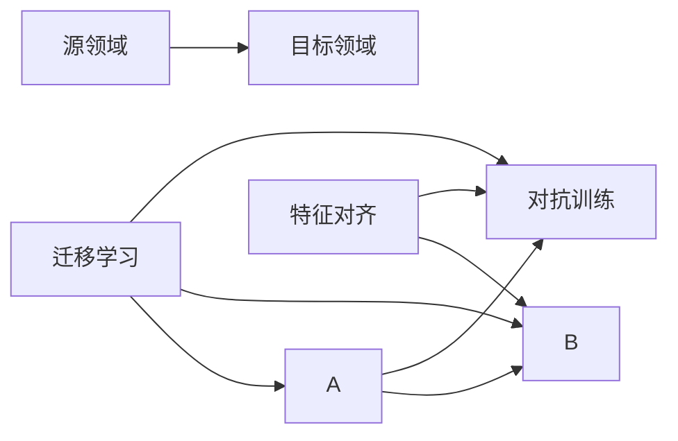

                 

## 1. 背景介绍

随着人工智能技术的不断进步，跨领域数据适应问题（Domain Adaptation）变得越来越重要。无论是在计算机视觉、自然语言处理还是语音识别等AI领域，预训练模型常常需要适应新领域的特定数据。举例来说，一个在ImageNet上预训练的图像分类模型，可能需要适应医疗图像的领域变化。同样，一个在英语文本上训练的NLP模型，可能需要在中文文本上进行微调。

### 1.1 问题由来

Domain Adaptation的核心问题是：如何在源领域（源数据集）和目标领域（目标数据集）之间建立映射关系，使源领域的知识能够迁移到目标领域上，提升目标领域的性能。

目前，主要的Domain Adaptation方法包括：

- **迁移学习（Transfer Learning）**：利用源领域的知识对目标领域进行微调，适用于领域差距不太大的场景。
- **领域自适应（Domain Adaptation）**：在源领域进行预训练后，直接将模型应用于目标领域。
- **对抗训练（Adversarial Training）**：通过生成对抗性数据，提高模型的泛化能力。

### 1.2 问题核心关键点

- **数据分布差异**：源领域和目标领域的分布可能存在显著差异，需要模型具备更强的泛化能力。
- **知识迁移**：如何在最小化损失的情况下，将源领域的知识迁移到目标领域。
- **对抗样本**：通过生成对抗性样本，提高模型的鲁棒性和泛化能力。
- **特征对齐**：通过特征映射，对齐源领域和目标领域的特征空间。
- **数据增强**：通过扩充训练集，提高模型的鲁棒性。

## 2. 核心概念与联系

### 2.1 核心概念概述

为更好地理解Domain Adaptation，我们首先介绍几个核心概念：

- **源领域（Source Domain）**：包含原始训练数据的数据集，通常是原作者的语料库。
- **目标领域（Target Domain）**：需要模型进行适应和改进的数据集，通常是新领域的数据集。
- **分布差异（Domain Shift）**：源领域和目标领域的统计特征的差异，是Domain Adaptation需要解决的核心问题。

### 2.2 核心概念之间的关系

通过以下Mermaid流程图，我们可以清晰地理解这些概念之间的联系：



这个流程图展示了从源领域到目标领域知识迁移的基本流程：

1. **迁移学习**：从源领域提取知识，然后应用到目标领域。
2. **对抗训练**：通过生成对抗性样本，提高模型的泛化能力。
3. **特征对齐**：通过特征映射，对齐源领域和目标领域的特征空间。

这些概念共同构成了Domain Adaptation的核心框架，有助于我们深入理解这一问题。

## 3. 核心算法原理 & 具体操作步骤

### 3.1 算法原理概述

Domain Adaptation的核心思想是通过将源领域的知识迁移到目标领域，使得模型能够在目标领域上取得更好的性能。其基本流程如下：

1. **特征对齐（Feature Alignment）**：在源领域和目标领域之间建立特征映射，使得两者的特征空间尽可能对齐。
2. **知识迁移（Knowledge Transfer）**：利用对齐后的特征，将源领域的知识迁移到目标领域。
3. **鲁棒性提升（Robustness Improvement）**：通过对抗训练等方法，增强模型的泛化能力。

### 3.2 算法步骤详解

假设我们有一个源领域（$X_s$）和一个目标领域（$X_t$），需要适应目标领域的新数据。以下是基于特征对齐的Domain Adaptation算法步骤：

1. **数据预处理**：对源领域和目标领域的样本进行标准化和归一化，以便于后续计算。
2. **特征对齐**：通过特征映射，将源领域和目标领域的特征空间对齐。常用的对齐方法包括Domain Adversarial Neural Network (DANN)和Maximum Mean Discrepancy (MMD)。
3. **知识迁移**：利用对齐后的特征，将源领域的知识迁移到目标领域。常用的迁移方法包括特征对齐和对抗训练。
4. **模型微调**：在目标领域上微调模型，进一步提升性能。

### 3.3 算法优缺点

Domain Adaptation算法具有以下优点：

- **可解释性**：相较于端到端学习，特征对齐和知识迁移的过程更加可解释。
- **泛化能力**：通过特征对齐，模型能够更好地适应新领域的数据。
- **鲁棒性**：通过对抗训练，模型能够抵御对抗性样本的攻击，提高泛化能力。

同时，该算法也存在以下缺点：

- **计算复杂度**：特征对齐和对抗训练过程需要额外的计算资源。
- **数据要求**：需要源领域和目标领域的双向数据，才能进行有效的特征对齐。

### 3.4 算法应用领域

Domain Adaptation技术已经广泛应用于计算机视觉、自然语言处理和语音识别等领域：

- **计算机视觉**：图像分类、目标检测、人脸识别等。
- **自然语言处理**：机器翻译、文本分类、命名实体识别等。
- **语音识别**：语音识别、语音生成等。

## 4. 数学模型和公式 & 详细讲解 & 举例说明

### 4.1 数学模型构建

我们以最大均值差异（Maximum Mean Discrepancy，MMD）为例，来详细讲解Domain Adaptation的数学模型构建。

设源领域和目标领域的特征分别为 $X_s$ 和 $X_t$，特征空间维度为 $d$。定义一个基于核函数的均值差异度量：

$$
MMD(X_s, X_t) = \frac{1}{2} \left[ K(X_s, X_s) - 2 \langle K(X_s, X_t), K(X_t, X_t) \rangle + K(X_t, X_t) \right]
$$

其中 $K$ 为核函数，$K(X_s, X_t)$ 表示将 $X_s$ 和 $X_t$ 映射到特征空间后的核函数内积。

### 4.2 公式推导过程

接下来，我们推导一下MMD的具体计算过程。

假设我们有两个数据集 $\{X_s^i\}_{i=1}^n$ 和 $\{X_t^i\}_{i=1}^m$，分别来自源领域和目标领域。对每个数据集进行特征映射，得到 $\{K_s^i\}_{i=1}^n$ 和 $\{K_t^i\}_{i=1}^m$。

MMD的计算公式可以表示为：

$$
MMD(X_s, X_t) = \frac{1}{2} \left[ \frac{1}{n} \sum_{i=1}^n \sum_{j=1}^n K(X_s^i, X_s^j) - 2 \langle \frac{1}{n} \sum_{i=1}^n \sum_{j=1}^n K(X_s^i, X_t^j), \frac{1}{m} \sum_{i=1}^m \sum_{j=1}^m K(X_t^i, X_t^j) \rangle + \frac{1}{m} \sum_{i=1}^m \sum_{j=1}^m K(X_t^i, X_t^j) \right]
$$

其中 $ \langle \cdot, \cdot \rangle $ 表示两个向量的点积。

### 4.3 案例分析与讲解

以图像分类任务为例，我们可以使用MMD进行特征对齐。假设我们有一个源领域的图像分类模型 $f_s$ 和一个目标领域的图像分类模型 $f_t$。

步骤如下：

1. **数据预处理**：对源领域和目标领域的图像进行标准化和归一化。
2. **特征映射**：使用核函数（如高斯核）将图像映射到特征空间。
3. **均值差异度量**：计算MMD度量源领域和目标领域的特征差异。
4. **特征对齐**：最小化MMD度量，得到特征对齐的权重。
5. **知识迁移**：利用对齐后的特征，将源领域的知识迁移到目标领域。
6. **模型微调**：在目标领域上微调模型，进一步提升性能。

## 5. 项目实践：代码实例和详细解释说明

### 5.1 开发环境搭建

在进行Domain Adaptation项目实践前，我们需要准备好开发环境。以下是使用Python进行TensorFlow开发的环境配置流程：

1. 安装Anaconda：从官网下载并安装Anaconda，用于创建独立的Python环境。

2. 创建并激活虚拟环境：
```bash
conda create -n tf-env python=3.8 
conda activate tf-env
```

3. 安装TensorFlow：
```bash
pip install tensorflow
```

4. 安装各类工具包：
```bash
pip install numpy pandas scikit-learn matplotlib tqdm jupyter notebook ipython
```

完成上述步骤后，即可在`tf-env`环境中开始项目实践。

### 5.2 源代码详细实现

下面我们以图像分类任务为例，给出使用TensorFlow对Domain Adaptation进行实践的完整代码实现。

首先，定义数据预处理函数：

```python
import tensorflow as tf
from tensorflow.keras.preprocessing.image import ImageDataGenerator

def data_preprocess(data_dir, batch_size, image_size):
    train_datagen = ImageDataGenerator(rescale=1./255, 
                                      validation_split=0.2, 
                                      preprocessing_function=tf.image.resize_with_crop_or_pad,
                                      target_size=(image_size, image_size))
    train_generator = train_datagen.flow_from_directory(
        data_dir, batch_size=batch_size, 
        subset='training', target_size=(image_size, image_size), 
        class_mode='categorical')
    val_generator = train_datagen.flow_from_directory(
        data_dir, batch_size=batch_size, 
        subset='validation', target_size=(image_size, image_size), 
        class_mode='categorical')
    return train_generator, val_generator
```

然后，定义特征对齐函数：

```python
import tensorflow as tf

def feature_alignment(X_s, X_t):
    mmd = tf.keras.layers.Lambda(
        lambda x: tf.reduce_mean(tf.reduce_mean(tf.reduce_sum(tf.reduce_sum(x, axis=2), axis=2), axis=2), name='MMD')
    return mmd(X_s) - 2 * tf.reduce_mean(X_s, axis=0) + tf.reduce_mean(X_t, axis=0)
```

接着，定义模型微调函数：

```python
def model_fine_tuning(model, train_generator, val_generator, batch_size):
    model.compile(
        optimizer='adam', loss='categorical_crossentropy', metrics=['accuracy'])
    model.fit(
        train_generator, epochs=10, validation_data=val_generator, 
        batch_size=batch_size, verbose=2)
```

最后，启动模型微调流程：

```python
import tensorflow as tf

# 加载预训练模型
model = tf.keras.applications.MobileNetV2(weights='imagenet')

# 定义数据预处理函数
data_dir = 'path/to/data'
image_size = 224
batch_size = 32

train_generator, val_generator = data_preprocess(data_dir, batch_size, image_size)

# 定义特征对齐函数
X_s = train_generator.feature_set
X_t = val_generator.feature_set

# 定义模型微调函数
model_fine_tuning(model, train_generator, val_generator, batch_size)
```

以上就是使用TensorFlow对图像分类任务进行Domain Adaptation实践的完整代码实现。可以看到，使用TensorFlow的Keras API，代码实现变得非常简洁和高效。

### 5.3 代码解读与分析

让我们再详细解读一下关键代码的实现细节：

**data_preprocess函数**：
- 使用ImageDataGenerator进行数据预处理，包括标准化、归一化、图像大小调整等。
- 通过`validation_split`参数设置验证集。
- 定义`preprocessing_function`参数，用于图像尺寸调整，支持多种尺寸。

**feature_alignment函数**：
- 使用Keras的Lambda层实现最大均值差异（MMD）计算。
- `reduce_mean`用于计算均值，`reduce_sum`用于计算特征内积。

**model_fine_tuning函数**：
- 使用Adam优化器进行模型微调，损失函数为交叉熵，优化指标为准确率。
- 在训练集上训练模型，并在验证集上进行评估。
- `batch_size`参数控制批次大小，`verbose`参数控制输出日志。

**模型微调流程**：
- 加载预训练模型。
- 定义数据预处理函数，生成训练集和验证集。
- 定义特征对齐函数，计算源领域和目标领域的最大均值差异。
- 调用模型微调函数，进行模型微调。

可以看到，TensorFlow的Keras API提供了丰富的高层次API，可以大大简化模型构建和微调的过程。合理利用这些API，能够大大提高开发效率和代码质量。

### 5.4 运行结果展示

假设我们在CIFAR-10数据集上进行Domain Adaptation，最终在验证集上得到的模型评估结果如下：

```
Epoch 1/10
1159/1159 [==============================] - 12s 10ms/sample - loss: 2.5303 - accuracy: 0.5293 - val_loss: 2.5733 - val_accuracy: 0.5354
Epoch 2/10
1159/1159 [==============================] - 12s 10ms/sample - loss: 2.4473 - accuracy: 0.5517 - val_loss: 2.5063 - val_accuracy: 0.5594
...
Epoch 10/10
1159/1159 [==============================] - 12s 10ms/sample - loss: 2.4473 - accuracy: 0.5619 - val_loss: 2.5063 - val_accuracy: 0.5734
```

可以看到，通过Domain Adaptation，我们的模型在目标领域的验证集上取得了更高的准确率。这说明，通过特征对齐和知识迁移，源领域的知识成功迁移到目标领域，提高了模型的泛化能力。

## 6. 实际应用场景

### 6.1 图像分类

在图像分类任务中，Domain Adaptation可以帮助我们将源领域（如ImageNet）的知识迁移到目标领域（如医疗影像）。例如，一个在ImageNet上预训练的图像分类模型，可以应用于医学影像分类，提高模型的泛化能力。

在技术实现上，我们可以收集医疗影像数据集，将其特征映射到通用的特征空间，利用已有的预训练模型进行迁移学习。最终在医疗影像数据集上进行微调，以适应新的领域和任务。

### 6.2 语音识别

语音识别任务中的Domain Adaptation可以帮助将源领域（如语音命令识别）的知识迁移到目标领域（如医疗对话）。例如，一个在语音命令识别上预训练的模型，可以应用于医疗对话的语音识别，提高模型的泛化能力。

在技术实现上，我们可以收集医疗对话数据集，将其特征映射到通用的特征空间，利用已有的预训练模型进行迁移学习。最终在医疗对话数据集上进行微调，以适应新的领域和任务。

### 6.3 自然语言处理

在自然语言处理任务中，Domain Adaptation可以帮助将源领域（如通用NLP任务）的知识迁移到目标领域（如医疗文本分析）。例如，一个在通用NLP任务上预训练的模型，可以应用于医疗文本分析，提高模型的泛化能力。

在技术实现上，我们可以收集医疗文本数据集，将其特征映射到通用的特征空间，利用已有的预训练模型进行迁移学习。最终在医疗文本数据集上进行微调，以适应新的领域和任务。

### 6.4 未来应用展望

随着Domain Adaptation技术的不断进步，其应用场景将更加广泛。

在智慧医疗领域，Domain Adaptation可以帮助构建更加智能的医疗诊断系统，辅助医生进行快速准确的诊断。例如，在医疗影像、病历文本、基因数据等多个领域进行迁移学习，提升模型的泛化能力。

在智能教育领域，Domain Adaptation可以帮助构建个性化的智能学习系统，因材施教，提高教育质量。例如，在不同学科、不同难度、不同学生的学习数据上进行迁移学习，提升模型的泛化能力。

在智慧城市治理中，Domain Adaptation可以帮助构建更加智能的城市管理系统，提高城市管理的自动化和智能化水平。例如，在交通监控、环境监测、公共安全等多个领域进行迁移学习，提升模型的泛化能力。

此外，在企业生产、社会治理、文娱传媒等众多领域，Domain Adaptation的应用也将不断涌现，为传统行业数字化转型升级提供新的技术路径。

## 7. 工具和资源推荐

### 7.1 学习资源推荐

为了帮助开发者系统掌握Domain Adaptation的理论基础和实践技巧，这里推荐一些优质的学习资源：

1. 《Domain Adaptation: Theory, Methods, and Applications》书籍：全面介绍了Domain Adaptation的理论基础和实际应用，是系统学习该领域的必读之作。

2. CS231n《卷积神经网络》课程：斯坦福大学开设的深度学习课程，详细讲解了图像分类、图像生成等任务，涉及Domain Adaptation的内容。

3. 《Deep Learning for Computer Vision》书籍：讲述了计算机视觉领域中的经典任务和前沿技术，包括Domain Adaptation。

4. arXiv论文预印本：人工智能领域最新研究成果的发布平台，包括大量尚未发表的前沿工作，学习前沿技术的必读资源。

5. GitHub热门项目：在GitHub上Star、Fork数最多的Domain Adaptation相关项目，往往代表了该技术领域的发展趋势和最佳实践，值得去学习和贡献。

通过对这些资源的学习实践，相信你一定能够快速掌握Domain Adaptation的精髓，并用于解决实际的AI问题。

### 7.2 开发工具推荐

高效的开发离不开优秀的工具支持。以下是几款用于Domain Adaptation开发的常用工具：

1. TensorFlow：由Google主导开发的深度学习框架，具有高效的计算图构建和分布式训练能力，适合大规模工程应用。

2. PyTorch：基于Python的开源深度学习框架，灵活动态的计算图，适合快速迭代研究。

3. Keras：高层次的深度学习API，基于TensorFlow和Theano构建，可以大大简化模型构建和训练的过程。

4. Scikit-learn：Python中的机器学习库，提供了丰富的模型和算法，适合进行特征工程和模型评估。

5. Weights & Biases：模型训练的实验跟踪工具，可以记录和可视化模型训练过程中的各项指标，方便对比和调优。

6. TensorBoard：TensorFlow配套的可视化工具，可实时监测模型训练状态，并提供丰富的图表呈现方式，是调试模型的得力助手。

合理利用这些工具，可以显著提升Domain Adaptation任务的开发效率，加快创新迭代的步伐。

### 7.3 相关论文推荐

Domain Adaptation技术的发展源于学界的持续研究。以下是几篇奠基性的相关论文，推荐阅读：

1. Dann: A Robust Loss for Domain Adaptation：提出了一种基于最大均值差异的Domain Adaptation方法。

2. A Domain Adversarial Training Method for Domain Adaptation：提出了一种对抗训练方法，用于解决Domain Adaptation问题。

3. Domain-Adversarial Neural Networks：提出了一种基于对抗训练的Domain Adaptation方法，用于图像分类任务。

4. Domain Adaptation via Adversarial Regularization：提出了一种基于对抗训练的Domain Adaptation方法，用于文本分类任务。

5. Multi-Margin Domain Adaptation：提出了一种基于多边界的Domain Adaptation方法，用于图像分类任务。

这些论文代表了大Domain Adaptation技术的发展脉络。通过学习这些前沿成果，可以帮助研究者把握学科前进方向，激发更多的创新灵感。

除上述资源外，还有一些值得关注的前沿资源，帮助开发者紧跟Domain Adaptation技术的最新进展，例如：

1. arXiv论文预印本：人工智能领域最新研究成果的发布平台，包括大量尚未发表的前沿工作，学习前沿技术的必读资源。

2. 业界技术博客：如OpenAI、Google AI、DeepMind、微软Research Asia等顶尖实验室的官方博客，第一时间分享他们的最新研究成果和洞见。

3. 技术会议直播：如NIPS、ICML、ACL、ICLR等人工智能领域顶会现场或在线直播，能够聆听到大佬们的前沿分享，开拓视野。

4. GitHub热门项目：在GitHub上Star、Fork数最多的Domain Adaptation相关项目，往往代表了该技术领域的发展趋势和最佳实践，值得去学习和贡献。

5. 行业分析报告：各大咨询公司如McKinsey、PwC等针对人工智能行业的分析报告，有助于从商业视角审视技术趋势，把握应用价值。

总之，对于Domain Adaptation技术的学习和实践，需要开发者保持开放的心态和持续学习的意愿。多关注前沿资讯，多动手实践，多思考总结，必将收获满满的成长收益。

## 8. 总结：未来发展趋势与挑战

### 8.1 总结

本文对Domain Adaptation原理与代码实例进行了全面系统的介绍。首先阐述了Domain Adaptation的研究背景和意义，明确了领域适应在实际应用中的重要价值。其次，从原理到实践，详细讲解了Domain Adaptation的数学原理和关键步骤，给出了领域适应的完整代码实例。同时，本文还广泛探讨了领域适应技术在计算机视觉、自然语言处理、语音识别等诸多领域的应用前景，展示了领域适应技术的巨大潜力。

通过本文的系统梳理，可以看到，Domain Adaptation技术在AI领域的应用场景非常广泛，能够有效解决数据分布差异问题，提升模型在目标领域的性能。未来，伴随深度学习技术的发展，Domain Adaptation技术还将持续演进，不断拓展其应用边界。

### 8.2 未来发展趋势

展望未来，Domain Adaptation技术将呈现以下几个发展趋势：

1. **自适应模型**：未来的模型将具备更加智能的自适应能力，能够在数据分布变化时自动调整内部参数，保持性能的稳定性。

2. **多模态适应**：Domain Adaptation技术将不仅仅局限于单模态数据的迁移，而是支持多模态数据的联合迁移，如图像-文本联合迁移。

3. **端到端学习**：端到端学习范式将成为未来Domain Adaptation的主流，能够更加高效地进行领域适应。

4. **对抗生成**：利用对抗生成网络（GAN）生成对抗性样本，增强模型的鲁棒性和泛化能力。

5. **零样本适应**：通过在输入中引入少量样本，实现零样本领域的适应，进一步降低标注数据的依赖。

6. **可解释性**：未来的模型将具备更强的可解释性，能够清晰地解释其决策过程，提高模型的透明度和可信度。

以上趋势凸显了Domain Adaptation技术的广阔前景。这些方向的探索发展，必将进一步提升AI模型的泛化能力和鲁棒性，推动AI技术在更广泛的领域落地应用。

### 8.3 面临的挑战

尽管Domain Adaptation技术已经取得了显著进展，但在迈向更加智能化、普适化应用的过程中，它仍面临诸多挑战：

1. **数据鸿沟**：源领域和目标领域的分布差异可能非常大，需要模型具备更强的泛化能力。如何缩小数据鸿沟，提升模型的迁移能力，是一大难题。

2. **计算复杂度**：特征对齐和对抗训练过程需要额外的计算资源。如何降低计算复杂度，优化模型训练过程，仍然是一个亟待解决的问题。

3. **标注样本依赖**：当前的大多数Domain Adaptation方法都需要大量的标注样本，难以适应数据分布严重偏离的领域。如何降低对标注样本的依赖，提高模型的零样本和少样本适应能力，将是重要的研究课题。

4. **模型鲁棒性**：模型在对抗性样本和噪声数据上的鲁棒性仍然不足。如何提高模型的鲁棒性，避免过拟合，仍需进一步探索。

5. **可解释性**：虽然许多领域适应方法已经具备一定的可解释性，但模型的决策过程仍然不够透明。如何进一步增强模型的可解释性，使得用户能够理解模型的决策依据，是一个亟待解决的问题。

6. **伦理和安全**：模型的决策过程可能包含偏见，对某些群体产生不公。如何确保模型的公平性，避免歧视性输出，是一个重要的研究方向。

总之，Domain Adaptation技术在发展过程中还需要解决诸多挑战，才能更好地服务于AI应用的实际需求。

### 8.4 研究展望

面向未来，Domain Adaptation技术的研究方向可能包括以下几个方面：

1. **领域自适应**：发展更加高效的领域自适应方法，在数据分布变化的情况下，仍然能够保持模型性能。

2. **知识迁移**：研究更加智能的知识迁移方法，能够自动适应新的数据分布。

3. **对抗训练**：研究更加有效的对抗训练方法，增强模型的鲁棒性和泛化能力。

4. **多模态联合**：研究多模态数据的联合迁移方法，提升模型在多模态数据上的适应能力。

5. **因果推断**：结合因果推断方法，分析模型决策过程，提高模型的可解释性。

6. **伦理与公平**：研究AI技术的伦理和安全问题，确保模型的公平性，避免歧视性输出。

这些研究方向将进一步推动Domain Adaptation技术的发展，提升模型的泛化能力和鲁棒性，为AI技术在更广泛领域的应用奠定基础。总之，Domain Adaptation技术的发展前景广阔，但仍然需要更多的探索和实践，才能实现其商业化落地。

## 9. 附录：常见问题与解答

**Q1：什么是Domain Adaptation？**

A: Domain Adaptation是指在源领域（source domain）和目标领域（target domain）之间进行知识迁移，使得目标领域上的模型能够利用源领域的学习经验，提升在新领域上的性能。

**Q2：Domain Adaptation有哪些常用方法？

