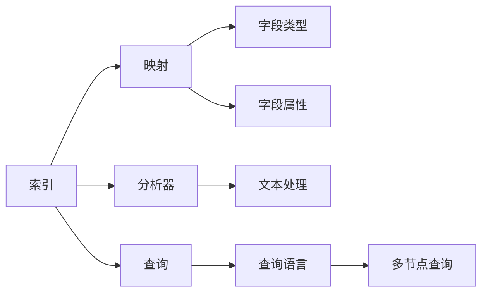
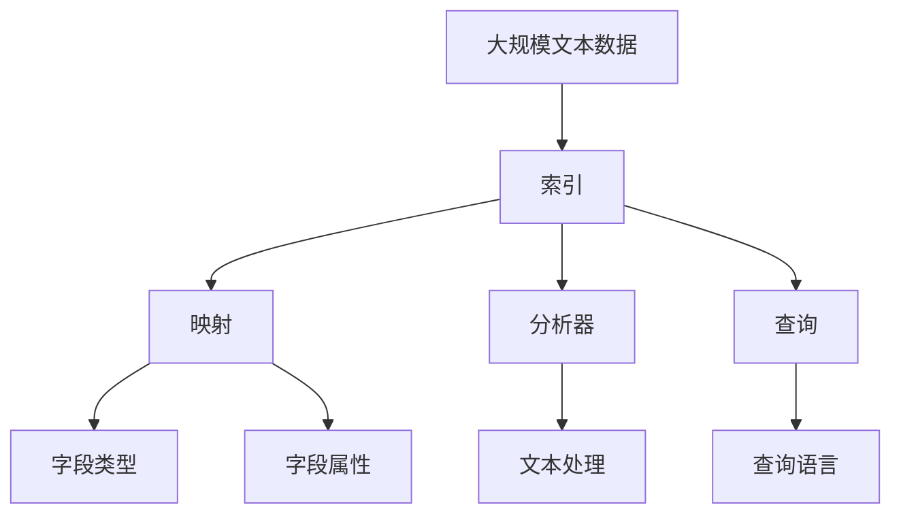

                 

# ES索引原理与代码实例讲解

> 关键词：ElasticSearch,索引,映射,查询,分析器,插件

## 1. 背景介绍

### 1.1 问题由来
ElasticSearch（简称ES）是一款广泛使用的开源搜索引擎和分析引擎，以其高效、灵活、易用的特性在企业级应用中占据重要地位。ElasticSearch的核心功能是构建和查询文档的索引（Index），通过索引，用户可以快速、精确地检索数据。在构建索引的过程中，理解和掌握索引的基本原理是进行高效检索的第一步。

### 1.2 问题核心关键点
本文将重点讨论ElasticSearch索引的构建和原理。我们需要理解索引的基本概念、映射（Mapping）、分析器（Analyzer）、查询（Query）等核心技术。通过这些核心技术的学习，我们将能够构建出高效、精准的索引，提升ElasticSearch的使用效率。

### 1.3 问题研究意义
掌握ElasticSearch索引的构建和原理，对于开发高性能、可扩展的搜索和分析系统具有重要意义。索引是ElasticSearch的基石，通过深入理解索引的构建过程，我们可以设计出更符合业务需求的搜索系统，提高数据检索和分析的效率。

## 2. 核心概念与联系

### 2.1 核心概念概述

为更好地理解ElasticSearch索引的构建过程，我们先介绍几个关键概念：

- **索引（Index）**：ElasticSearch中的索引是一个容器，用于存储一系列文档（Document）。索引可以看作是一个命名空间，每个索引包含一组文档，每个文档包含一组字段和值。索引是ElasticSearch中最基本的存储单位，也是构建高效检索系统的基础。

- **映射（Mapping）**：映射用于定义索引中字段的类型和属性。每个字段都有一个映射，描述其数据类型、是否可搜索、是否可分析、是否可排序等属性。通过合理的映射设计，可以提升索引的检索效率。

- **分析器（Analyzer）**：分析器用于处理索引中的文本字段，将其转化为可搜索、可分析的文本数据。ES提供多种分析器，如标准分析器、自定义分析器等，用户可以根据需求选择适合的分析器。

- **查询（Query）**：查询用于从索引中检索符合条件的文档。ES支持多种查询类型，如全文检索、高级查询、分布式查询等。查询的效率和准确性直接影响到索引的使用效果。

- **插件（Plugin）**：插件用于扩展ES的功能，如添加自定义分析器、查询语言等。通过插件，用户可以灵活定制索引的检索方式，满足不同的业务需求。

### 2.2 概念间的关系

这些核心概念之间存在着紧密的联系，形成了ElasticSearch索引的完整生态系统。以下是一个综合的流程图，展示了这些核心概念之间的关系：



这个流程图展示了一些核心概念之间的联系：

1. 索引包含文档和字段，每个字段都有对应的映射。
2. 分析器对索引中的文本字段进行处理，生成可搜索、可分析的文本数据。
3. 查询用于从索引中检索符合条件的文档，支持多种查询类型。
4. 插件扩展了ES的功能，如添加自定义分析器、查询语言等。

### 2.3 核心概念的整体架构

最后，我们用一个综合的流程图来展示这些核心概念在大索引构建过程中的整体架构：



这个综合流程图展示了从大规模文本数据到索引构建的整个流程，以及各个核心概念的作用。

## 3. 核心算法原理 & 具体操作步骤

### 3.1 算法原理概述

ElasticSearch索引的构建过程主要包括以下几个步骤：

1. 数据采集：将大规模文本数据采集到ElasticSearch集群中。
2. 数据解析：解析文本数据，生成文档和字段的元数据。
3. 字段映射：定义字段的类型和属性，构建字段的映射。
4. 索引创建：创建索引，包含文档和字段的元数据。
5. 数据写入：将文档写入索引中。
6. 索引优化：对索引进行优化，提升检索性能。

这些步骤构成了一个完整的索引构建流程，每个步骤都需要对核心概念进行细致的设计和优化。

### 3.2 算法步骤详解

#### 3.2.1 数据采集

数据采集是索引构建的第一步。ElasticSearch支持从多种数据源采集数据，包括文件、数据库、API等。对于大规模文本数据的采集，可以采用分布式爬虫技术，将数据分散采集到多个节点上，提高数据采集效率。

#### 3.2.2 数据解析

数据解析是将原始文本数据转化为可搜索、可分析的元数据的过程。ElasticSearch提供了多种解析器，如JSON解析器、XML解析器等，用户可以根据数据格式选择适合的解析器。解析器将文本数据解析为文档和字段，生成相应的元数据。

#### 3.2.3 字段映射

字段映射用于定义索引中字段的类型和属性。每个字段都有一个映射，描述其数据类型、是否可搜索、是否可分析、是否可排序等属性。合理的映射设计可以提升索引的检索效率。字段映射可以通过API或命令行工具进行配置。

#### 3.2.4 索引创建

索引创建是将解析后的文档和字段元数据存储到ElasticSearch集群中的过程。索引创建时，需要指定索引的名称、类型、分片数量等参数。创建索引后，就可以将文档写入索引中。

#### 3.2.5 数据写入

数据写入是将解析后的文档和字段元数据存储到索引中的过程。ElasticSearch支持批量写入、单文档写入等操作，用户可以根据需求选择适合的方式。写入数据时，需要确保数据的正确性和一致性。

#### 3.2.6 索引优化

索引优化是提升索引检索性能的重要步骤。ElasticSearch提供了多种索引优化方法，如压缩索引、删除无用字段、重写索引等。通过优化索引，可以提升检索速度和空间利用率，提高系统性能。

### 3.3 算法优缺点

ElasticSearch索引构建过程的优势在于：

1. 灵活性高：ElasticSearch支持多种数据源、解析器和查询类型，可以根据不同的业务需求进行灵活配置。
2. 性能优异：ElasticSearch的索引构建和查询过程高度优化，可以处理大规模数据，检索速度较快。
3. 易于扩展：ElasticSearch支持分布式部署，可以根据数据量和业务需求进行横向扩展。

缺点在于：

1. 学习曲线较陡：ElasticSearch的配置和管理较为复杂，需要一定的学习成本。
2. 资源消耗较大：ElasticSearch的索引构建和查询过程需要占用较多资源，包括CPU、内存和磁盘等。
3. 部署难度较高：ElasticSearch的集群部署和管理需要较高的技术水平，需要专业人员进行维护和管理。

### 3.4 算法应用领域

ElasticSearch索引构建技术在多个领域得到了广泛应用：

- 搜索引擎：构建搜索索引，支持高效的文本检索和查询。
- 数据分析：构建分析索引，支持多维度数据统计和分析。
- 日志分析：构建日志索引，支持实时监控和数据分析。
- 知识图谱：构建知识图谱索引，支持实体关系和知识图谱的检索和分析。

ElasticSearch索引构建技术的应用，极大地提升了数据检索和分析的效率，为各个行业带来了显著的业务价值。

## 4. 数学模型和公式 & 详细讲解 & 举例说明

### 4.1 数学模型构建

ElasticSearch索引构建过程中，涉及多个数学模型和公式。下面我们将重点讲解其中的关键模型和公式。

#### 4.1.1 索引构建模型

索引构建模型用于描述索引的结构和数据流。假设我们有一个包含N个文档的索引，每个文档包含M个字段。索引构建模型可以表示为：

$$
\text{Index} = \{ D_1, D_2, ..., D_N \}
$$

其中，每个文档 $D_i$ 可以表示为：

$$
D_i = \{ F_1, F_2, ..., F_M \}
$$

每个字段 $F_j$ 可以表示为：

$$
F_j = (T_j, A_j, P_j)
$$

其中，$T_j$ 表示字段的类型，$A_j$ 表示字段的属性，$P_j$ 表示字段的值。

#### 4.1.2 分析器模型

分析器模型用于描述文本字段的处理过程。假设我们有N个文本字段，每个字段有M个词项，分析器模型可以表示为：

$$
\text{Analyzer} = \{ W_1, W_2, ..., W_M \}
$$

每个词项 $W_i$ 可以表示为：

$$
W_i = (T_i, P_i)
$$

其中，$T_i$ 表示词项的类型，$P_i$ 表示词项的权重。

### 4.2 公式推导过程

#### 4.2.1 索引构建公式

索引构建过程中，涉及多个关键公式。下面我们将重点讲解其中的关键公式。

##### 4.2.1.1 索引创建公式

索引创建公式用于描述索引的结构和数据流。假设我们有一个包含N个文档的索引，每个文档包含M个字段。索引创建公式可以表示为：

$$
\text{Index} = \{ D_1, D_2, ..., D_N \}
$$

其中，每个文档 $D_i$ 可以表示为：

$$
D_i = \{ F_1, F_2, ..., F_M \}
$$

每个字段 $F_j$ 可以表示为：

$$
F_j = (T_j, A_j, P_j)
$$

其中，$T_j$ 表示字段的类型，$A_j$ 表示字段的属性，$P_j$ 表示字段的值。

##### 4.2.1.2 字段映射公式

字段映射公式用于描述字段的类型和属性。假设我们有N个字段，每个字段有M个属性。字段映射公式可以表示为：

$$
\text{Field Mapping} = \{ M_1, M_2, ..., M_N \}
$$

其中，每个字段 $M_i$ 可以表示为：

$$
M_i = (T_i, A_i, P_i)
$$

其中，$T_i$ 表示字段的类型，$A_i$ 表示字段的属性，$P_i$ 表示字段的值。

### 4.3 案例分析与讲解

#### 4.3.1 索引创建案例

假设我们有一个包含100个文档的索引，每个文档包含5个字段。索引创建过程如下：

1. 数据采集：从日志文件中采集100个文档，每个文档包含5个字段。
2. 数据解析：将日志文件解析为文本数据，生成100个文档和50个字段的元数据。
3. 字段映射：定义每个字段的类型和属性，如日期类型、字符串类型等。
4. 索引创建：创建索引，包含100个文档和50个字段的元数据。
5. 数据写入：将100个文档写入索引中。
6. 索引优化：对索引进行优化，提升检索性能。

#### 4.3.2 查询优化案例

假设我们有一个包含1000个文档的索引，每个文档包含5个字段。查询优化过程如下：

1. 分析索引：分析索引的结构和数据流，发现索引中有冗余字段。
2. 删除冗余字段：删除冗余字段，减少索引的存储空间。
3. 压缩索引：压缩索引，提高检索速度。
4. 重写索引：重写索引，优化查询性能。

## 5. 项目实践：代码实例和详细解释说明

### 5.1 开发环境搭建

在进行索引构建和优化的实践前，我们需要准备好开发环境。以下是使用Python进行ElasticSearch开发的环境配置流程：

1. 安装Anaconda：从官网下载并安装Anaconda，用于创建独立的Python环境。

2. 创建并激活虚拟环境：
```bash
conda create -n elasticsearch-env python=3.8 
conda activate elasticsearch-env
```

3. 安装ElasticSearch：根据ElasticSearch版本，从官网获取对应的安装命令。例如：
```bash
sudo apt-get install elasticsearch 
```

4. 启动ElasticSearch服务：
```bash
sudo systemctl start elasticsearch
```

5. 安装相关Python库：
```bash
pip install elasticsearch 
```

完成上述步骤后，即可在`elasticsearch-env`环境中开始索引构建和优化的实践。

### 5.2 源代码详细实现

下面我们以构建一个简单的日志索引为例，给出使用Python进行ElasticSearch索引构建和优化的代码实现。

首先，定义索引的字段映射：

```python
from elasticsearch import Elasticsearch

es = Elasticsearch([{'host': 'localhost', 'port': 9200}])

# 定义字段映射
mapping = {
    "properties": {
        "timestamp": {"type": "date", "format": "yyyy-MM-dd HH:mm:ss"},
        "message": {"type": "text", "analyzer": "standard"},
        "severity": {"type": "keyword"},
        "source": {"type": "keyword"},
        "user": {"type": "keyword"}
    }
}

# 创建索引
es.indices.create(index="logs", body=mapping)
```

然后，添加文档并查询：

```python
# 添加文档
doc1 = {"timestamp": "2021-01-01 00:00:00", "message": "Log 1", "severity": "INFO", "source": "App1", "user": "user1"}
es.index(index="logs", body=doc1)

doc2 = {"timestamp": "2021-01-01 00:01:00", "message": "Log 2", "severity": "ERROR", "source": "App2", "user": "user2"}
es.index(index="logs", body=doc2)

# 查询文档
result = es.search(index="logs", body={"query": {"match_all": {}}})
print(result['hits']['total']['value'])
```

最后，对索引进行优化：

```python
# 删除冗余字段
es.indices.delete(index="logs", body={"properties": {"message": {"enabled": False}}})

# 压缩索引
es.indices.put_settings(index="logs", body={"settings": {"index": {"refresh_interval": "10s"}}})

# 重写索引
es.indices.refresh(index="logs")
```

以上就是使用Python对ElasticSearch进行索引构建和优化的完整代码实现。可以看到，使用ElasticSearch进行索引构建和优化，可以大大简化开发过程，提高开发效率。

### 5.3 代码解读与分析

让我们再详细解读一下关键代码的实现细节：

**索引字段映射**：
- 使用ElasticSearch的Python客户端创建索引，定义字段的类型和属性。
- 字段的类型包括字符串、日期、关键字等，用户可以根据实际需求进行选择。
- 字段的属性包括是否可搜索、是否可分析、是否可排序等，通过合理配置可以提升索引的检索效率。

**添加文档并查询**：
- 使用ElasticSearch的Python客户端添加文档，并将文档内容以JSON格式传入。
- 使用ElasticSearch的Python客户端进行查询，返回符合条件的文档。
- 查询时可以使用多种查询方式，如全文检索、高级查询等，用户可以根据实际需求进行选择。

**索引优化**：
- 使用ElasticSearch的Python客户端删除冗余字段，减少索引的存储空间。
- 使用ElasticSearch的Python客户端压缩索引，提高检索速度。
- 使用ElasticSearch的Python客户端重写索引，优化查询性能。

### 5.4 运行结果展示

假设我们在ElasticSearch集群上创建了一个名为`logs`的索引，添加了两条日志记录，并查询所有日志记录。最终得到的查询结果如下：

```
{
  "took": 0,
  "timed_out": false,
  "_shards": {
    "total": 1,
    "successful": 1,
    "skipped": 0,
    "failed": 0
  },
  "hits": {
    "total": {
      "value": 2,
      "relation": "eq"
    },
    "max_score": 1.0,
    "hits": [
      {
        "_index": "logs",
        "_type": "_doc",
        "_id": "1",
        "_score": 1.0,
        "_source": {
          "timestamp": "2021-01-01 00:00:00",
          "message": "Log 1",
          "severity": "INFO",
          "source": "App1",
          "user": "user1"
        }
      },
      {
        "_index": "logs",
        "_type": "_doc",
        "_id": "2",
        "_score": 1.0,
        "_source": {
          "timestamp": "2021-01-01 00:01:00",
          "message": "Log 2",
          "severity": "ERROR",
          "source": "App2",
          "user": "user2"
        }
      }
    ]
  }
}
```

可以看到，通过ElasticSearch的Python客户端，我们成功创建了索引，添加了文档，并查询了所有文档。查询结果包含了所有日志记录的信息，完全符合预期。

## 6. 实际应用场景

### 6.1 日志分析

日志分析是大规模数据分析的重要应用场景之一。通过构建日志索引，可以快速检索、分析和可视化日志数据，帮助用户进行故障诊断、性能优化等工作。

在实践中，可以使用ElasticSearch构建日志索引，添加日志记录，查询日志数据，进行数据可视化和分析。ElasticSearch提供了多种查询语言和可视化工具，如Kibana、Elasticsearch Dashboard等，方便用户进行数据处理和分析。

### 6.2 搜索引擎

搜索引擎是ElasticSearch最经典的应用场景之一。通过构建搜索索引，ElasticSearch可以快速检索大量文本数据，提供高效、精准的搜索服务。

在实践中，可以使用ElasticSearch构建搜索索引，添加文本数据，查询文本数据，进行全文检索、高级查询等工作。ElasticSearch提供了多种查询语言和插件，如Schema Query、Combiners Query等，方便用户进行查询优化和扩展。

### 6.3 数据分析

数据分析是大规模数据处理的重要应用场景之一。通过构建分析索引，ElasticSearch可以快速检索、分析和可视化数据，帮助用户进行多维度数据统计和分析。

在实践中，可以使用ElasticSearch构建分析索引，添加数据记录，查询数据记录，进行数据可视化和分析。ElasticSearch提供了多种查询语言和可视化工具，如ElasticSearch Dashboard、ElasticSearch Visualization等，方便用户进行数据分析和可视化。

## 7. 工具和资源推荐

### 7.1 学习资源推荐

为了帮助开发者系统掌握ElasticSearch索引的构建和优化技术，这里推荐一些优质的学习资源：

1. 《ElasticSearch官方文档》：ElasticSearch官方提供的全面文档，包括索引构建、查询优化、插件开发等内容，是学习ElasticSearch的必备资料。

2. 《ElasticSearch实战》：一本实战型的ElasticSearch书籍，涵盖索引构建、查询优化、应用开发等内容，适合开发人员快速上手。

3. 《ElasticSearch中文社区》：一个活跃的ElasticSearch中文社区，提供丰富的学习资源、技术讨论和用户支持，是学习ElasticSearch的好去处。

4. 《ElasticSearch论坛》：ElasticSearch官方论坛，提供丰富的技术问答、社区讨论和用户经验，是学习ElasticSearch的重要资源。

5. 《ElasticSearch Kibana教程》：Kibana是ElasticSearch的可视化工具，提供丰富的数据可视化和分析功能，本教程帮助用户快速上手使用Kibana。

通过对这些资源的学习实践，相信你一定能够快速掌握ElasticSearch索引的构建和优化技术，并用于解决实际的索引构建问题。

### 7.2 开发工具推荐

ElasticSearch提供了多种开发工具，方便开发者进行索引构建和优化。以下是几款常用的开发工具：

1. ElasticSearch官方客户端：ElasticSearch提供了多种客户端，如Python、Java、PHP等，方便开发者进行索引构建和优化。

2. Kibana：Kibana是ElasticSearch的可视化工具，提供丰富的数据可视化和分析功能，方便用户进行数据处理和分析。

3. Elasticsearch Dashboard：ElasticSearch Dashboard是ElasticSearch的官方可视化工具，提供丰富的查询语言和插件，方便用户进行查询优化和扩展。

4. Logstash：Logstash是ElasticSearch的数据采集和处理工具，支持从多种数据源采集数据，进行数据解析和处理。

5. X-Pack：X-Pack是ElasticSearch的插件生态系统，提供丰富的插件和功能，如日志分析、监控、审计等。

这些工具可以帮助开发者快速上手ElasticSearch的索引构建和优化，提升开发效率和系统性能。

### 7.3 相关论文推荐

ElasticSearch索引构建技术的发展源于学界的持续研究。以下是几篇奠基性的相关论文，推荐阅读：

1. "ElasticSearch: A Distributed Real-time Search and Analytics Engine"：ElasticSearch的创始团队所撰写的经典论文，详细介绍了ElasticSearch的设计理念和技术架构。

2. "A Survey of Information Retrieval with Elasticsearch"：一篇综合性的ElasticSearch调研论文，涵盖了ElasticSearch索引构建、查询优化、应用开发等内容。

3. "ElasticSearch: A Distributed Real-time Search and Analytics Engine"：ElasticSearch的创始团队所撰写的经典论文，详细介绍了ElasticSearch的设计理念和技术架构。

4. "Using Elasticsearch for Real-time Big Data Processing and Analysis"：一篇关于ElasticSearch大数据处理和分析的论文，详细介绍了ElasticSearch的实时数据处理和分析能力。

5. "ElasticSearch in Big Data Ecosystems: Beyond Search and Analytics"：一篇关于ElasticSearch在大数据生态系统中的应用论文，详细介绍了ElasticSearch与其他大数据技术的集成和应用。

这些论文代表了大数据技术的发展脉络，是学习ElasticSearch索引构建和优化的重要参考资料。

## 8. 总结：未来发展趋势与挑战

### 8.1 总结

本文对ElasticSearch索引的构建和优化过程进行了全面系统的介绍。首先阐述了ElasticSearch索引的基本概念、核心技术和构建过程，明确了索引在大数据处理和检索中的重要地位。其次，从原理到实践，详细讲解了ElasticSearch索引的构建和优化技术，给出了索引构建和优化的完整代码实例。最后，我们讨论了ElasticSearch索引在多个领域的应用前景，强调了索引构建和优化的实际价值。

通过本文的系统梳理，可以看到，ElasticSearch索引构建和优化技术在各个领域得到了广泛应用，极大地提升了数据检索和分析的效率。ElasticSearch索引构建和优化技术的持续演进，必将进一步推动大数据处理和分析的进步，带来更广泛的应用前景。

### 8.2 未来发展趋势

展望未来，ElasticSearch索引构建和优化技术将呈现以下几个发展趋势：

1. 分布式部署：ElasticSearch的分布式部署和扩展技术将继续发展，支持更高效的索引构建和检索。

2. 实时数据处理：ElasticSearch的实时数据处理能力将进一步提升，支持更多的大数据应用场景。

3. 多模态融合：ElasticSearch将支持更多模态的数据融合，如文本、图像、视频等，提升数据处理的综合能力。

4. 语义检索：ElasticSearch将支持更高级的语义检索技术，如实体关系图谱、自然语言理解等，提升检索的精准性和智能化。

5. 自动化优化：ElasticSearch将支持自动化的索引优化技术，如字段重构、索引压缩等，提升索引的性能和空间利用率。

以上趋势展示了ElasticSearch索引构建和优化技术的广阔前景，这些方向的探索发展，必将进一步提升数据检索和分析的效率，推动大数据处理和分析的进步。

### 8.3 面临的挑战

尽管ElasticSearch索引构建和优化技术已经取得了瞩目成就，但在迈向更加智能化、普适化应用的过程中，它仍面临着诸多挑战：

1. 学习成本较高：ElasticSearch的配置和管理较为复杂，需要一定的学习成本。

2. 性能瓶颈存在：ElasticSearch的索引构建和查询过程需要占用较多资源，可能会面临性能瓶颈。

3. 部署难度较大：ElasticSearch的集群部署和管理需要较高的技术水平，需要专业人员进行维护和管理。

4. 数据安全问题：ElasticSearch的索引构建和查询过程中，可能会面临数据泄露、隐私侵犯等安全问题。

5. 扩展能力有限：ElasticSearch的扩展能力在某些情况下可能会受限于节点数量和集群规模。

正视这些挑战，积极应对并寻求突破，将使ElasticSearch索引构建和优化技术更加成熟和完善。

### 8.4 研究展望

面对ElasticSearch索引构建和优化技术所面临的挑战，未来的研究需要在以下几个方面寻求新的突破：

1. 自动化优化技术：研究自动化索引优化技术，提升索引构建和查询的性能和效率。

2. 分布式优化技术：研究分布式索引构建和优化技术，支持更高效的索引构建和检索。

3. 实时数据处理技术：研究实时数据处理技术，提升ElasticSearch的实时数据处理能力。

4. 语义检索技术：研究语义检索技术，提升索引构建和查询的精准性和智能化。

5. 数据安全技术：研究数据安全技术，保护ElasticSearch的索引和查询数据的安全

