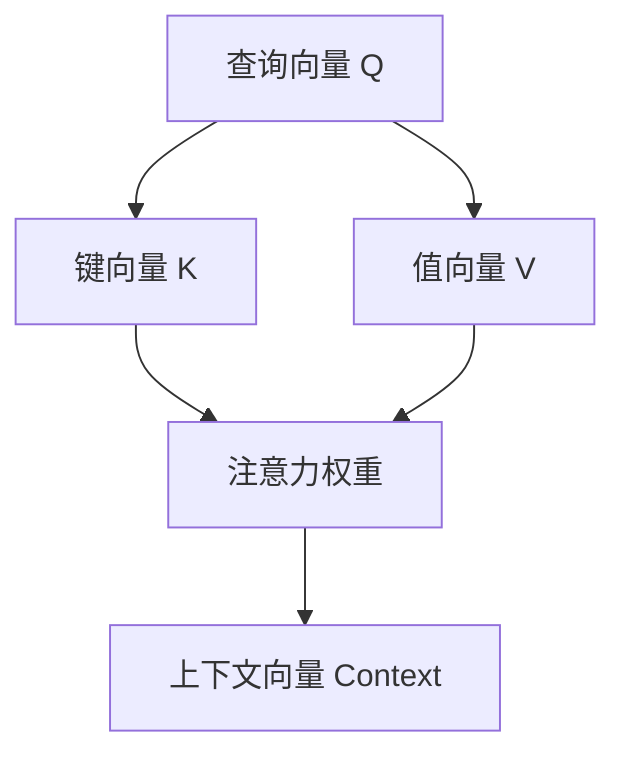
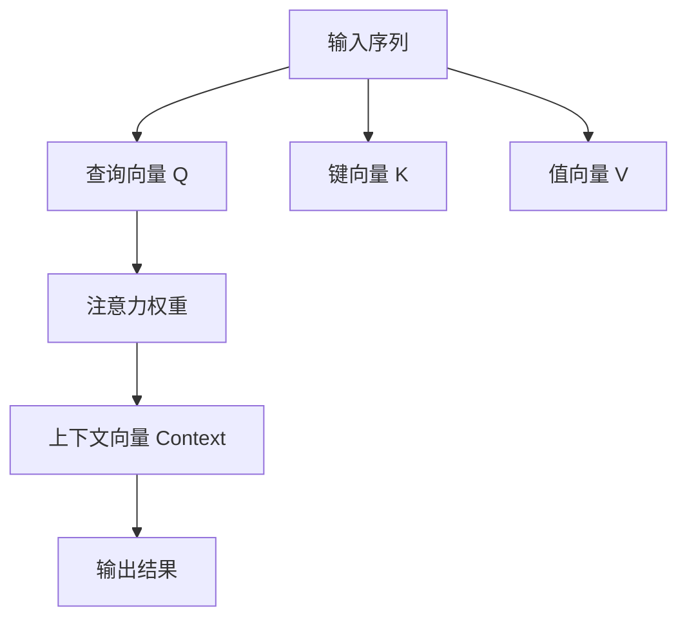

                 

# 注意力机制中的Q、K、V

在深度学习领域，注意力机制（Attention Mechanism）是一种非常强大且广泛使用的技术，它使模型能够根据输入数据的不同部分进行动态加权，从而提高模型的表现力和适应性。本文将深入探讨注意力机制中的Q、K、V概念及其应用，通过详细的数学模型、代码实现和应用场景，帮助读者全面理解这一核心技术。

## 1. 背景介绍

### 1.1 问题由来

随着深度学习技术的发展，传统的卷积神经网络（CNN）和循环神经网络（RNN）在处理序列数据时存在固有局限，如固定长度、局部信息获取等。为了克服这些问题，人们提出了注意力机制，使模型能够动态关注输入序列中的关键部分，从而提高模型在自然语言处理（NLP）、图像处理、语音识别等任务上的性能。

注意力机制最早在机器翻译领域取得突破，即著名的Seq2Seq模型中的"注意力"组件。这一组件使得模型在生成序列时，能够有选择地关注源序列中的相关信息，避免无关信息的干扰，提升了模型的翻译质量和效率。

### 1.2 问题核心关键点

注意力机制的核心在于通过计算注意力权重，动态地从输入数据中选择相关信息进行加权组合，从而得到更加精确的表示。其关键步骤如下：

1. **计算注意力权重**：通过计算输入数据与查询向量（Query Vector）之间的相似度，得到每个输入元素对输出结果的贡献度。
2. **加权组合**：将注意力权重应用于输入数据，进行加权组合，得到上下文向量（Context Vector）。
3. **输出融合**：将上下文向量与模型其他部分进行融合，得到最终输出结果。

这些步骤通过自注意力机制和多头注意力机制（Multi-Head Attention）等形式，进一步优化了注意力权重和上下文向量的计算方法，使得模型能够更加高效地处理复杂任务。

### 1.3 问题研究意义

深入理解注意力机制中的Q、K、V概念，有助于开发者设计更高效、更精确的深度学习模型。通过Q、K、V的设计和训练，可以提升模型对输入数据的理解能力和推理能力，使其在多个领域中发挥更广泛的作用。

## 2. 核心概念与联系

### 2.1 核心概念概述

注意力机制中的Q、K、V是指查询向量（Query Vector）、键向量（Key Vector）和值向量（Value Vector）。这些向量在注意力计算中扮演重要角色，分别代表了模型的关注点、输入数据的特征表示和相关信息。

- **查询向量（Q）**：通常由模型的输入序列经过线性变换得到，用于表示模型的关注焦点。
- **键向量（K）**：与查询向量对应，通常也由输入序列经过线性变换得到，用于表示输入数据的特征信息。
- **值向量（V）**：与键向量对应，同样由输入序列经过线性变换得到，用于表示输入数据的值信息。

这三个向量通过计算注意力权重，结合得到上下文向量（Context Vector），最终指导模型生成输出结果。

### 2.2 概念间的关系

Q、K、V之间的关系可以通过以下Mermaid流程图来展示：



这个流程图展示了Q、K、V在注意力计算中的主要作用和关系：

1. 查询向量Q和键向量K共同计算注意力权重，反映输入数据对输出的影响程度。
2. 值向量V与注意力权重结合，得到上下文向量Context，用于生成最终的输出结果。

### 2.3 核心概念的整体架构

以下是一个综合的流程图，展示了Q、K、V在大规模注意力机制中的整体架构：



这个综合流程图展示了从输入序列到最终输出结果的整个处理过程，其中Q、K、V是关键组件，注意力权重是计算过程的核心。

## 3. 核心算法原理 & 具体操作步骤

### 3.1 算法原理概述

注意力机制的计算过程主要分为两个步骤：

1. **注意力权重计算**：通过计算查询向量Q和键向量K之间的相似度，得到每个输入元素对输出结果的贡献度。
2. **上下文向量计算**：将注意力权重应用于值向量V，进行加权组合，得到上下文向量Context，指导模型生成输出结果。

注意力机制的目标是通过动态调整输入数据的权重，使得模型能够更关注关键信息，忽略噪声和干扰，从而提高模型的表现力和泛化能力。

### 3.2 算法步骤详解

以下是详细的操作步骤：

1. **构建Q、K、V向量**：首先，将输入序列经过线性变换得到Q、K、V向量。假设输入序列长度为$L$，则：
   - Q向量：$Q=\mathbf{W}_Q \cdot X$
   - K向量：$K=\mathbf{W}_K \cdot X$
   - V向量：$V=\mathbf{W}_V \cdot X$
   其中，$\mathbf{W}_Q$、$\mathbf{W}_K$、$\mathbf{W}_V$为线性变换矩阵，$X$为输入序列矩阵。

2. **计算注意力权重**：通过计算Q和K之间的点积，得到注意力权重矩阵$A$，计算公式为：
   $$
   A = \frac{Q \cdot K^T}{\sqrt{d_k}}
   $$
   其中，$d_k$为K向量的维度。

3. **归一化注意力权重**：对注意力权重矩阵$A$进行归一化处理，得到注意力权重向量$C$，计算公式为：
   $$
   C = \text{softmax}(A)
   $$

4. **计算上下文向量**：将注意力权重$C$应用于值向量V，得到上下文向量Context，计算公式为：
   $$
   Context = C \cdot V
   $$

5. **输出融合**：将上下文向量Context与模型其他部分进行融合，得到最终的输出结果。

### 3.3 算法优缺点

注意力机制中的Q、K、V具有以下优点：

1. **动态加权**：通过动态调整注意力权重，模型能够根据输入数据的重要程度，有选择地关注关键信息，提高模型的泛化能力。
2. **减少计算量**：相比于传统的全连接层，注意力机制可以有效地减少计算量，提升模型的训练效率。
3. **增强表达力**：通过关注输入序列中的关键信息，模型能够更好地捕捉长距离依赖和复杂结构，提高模型的表达能力。

同时，注意力机制也存在一些局限性：

1. **计算复杂度高**：尽管相比全连接层减少了计算量，但注意力机制本身仍然需要较高的计算资源，特别是在大规模输入序列上。
2. **对训练数据依赖大**：注意力机制的效果很大程度上取决于输入数据的特征和分布，难以在小规模数据上取得理想效果。
3. **解释性差**：注意力权重缺乏可解释性，难以理解模型内部决策过程，增加了模型的复杂性和调试难度。

### 3.4 算法应用领域

注意力机制在大规模深度学习模型中得到了广泛应用，涵盖自然语言处理、计算机视觉、语音识别等多个领域。以下是一些典型的应用场景：

- **机器翻译**：Seq2Seq模型中的注意力机制使得机器翻译能够动态关注源序列的关键信息，提升翻译质量。
- **文本摘要**：注意力机制能够帮助模型动态选择摘要中的关键句子，生成更加准确、流畅的摘要。
- **图像描述生成**：通过计算图像中不同区域对输出的贡献度，注意力机制能够生成更加详细、合理的图像描述。
- **图像分类**：在图像分类任务中，注意力机制可以帮助模型关注图像的关键区域，提高分类的准确性。
- **问答系统**：注意力机制能够动态关注问题和上下文中的关键信息，生成更加准确的答案。

这些应用场景展示了注意力机制在多个领域的强大潜力，未来有望在更多领域中发挥更大的作用。

## 4. 数学模型和公式 & 详细讲解 & 举例说明

### 4.1 数学模型构建

注意力机制的计算过程可以通过以下数学模型进行形式化描述：

1. **输入表示**：设输入序列为$X=\{x_i\}_{i=1}^L$，其中$x_i$为第$i$个输入元素。
2. **Q、K、V表示**：设查询向量为$Q=\mathbf{W}_Q \cdot X$，键向量为$K=\mathbf{W}_K \cdot X$，值向量为$V=\mathbf{W}_V \cdot X$。
3. **注意力权重计算**：设注意力权重向量为$C=\text{softmax}(Q \cdot K^T / \sqrt{d_k})$。
4. **上下文向量计算**：设上下文向量为$Context = C \cdot V$。
5. **输出融合**：设输出结果为$Y = \text{MLP}(Context)$，其中MLP为全连接层。

### 4.2 公式推导过程

以下是详细的公式推导过程：

1. **输入表示**：设输入序列为$X=\{x_i\}_{i=1}^L$，其中$x_i$为第$i$个输入元素。
2. **Q、K、V表示**：设查询向量为$Q=\mathbf{W}_Q \cdot X$，键向量为$K=\mathbf{W}_K \cdot X$，值向量为$V=\mathbf{W}_V \cdot X$。
3. **注意力权重计算**：设注意力权重向量为$C=\text{softmax}(Q \cdot K^T / \sqrt{d_k})$，其中$d_k$为K向量的维度。
   $$
   C_{i,j} = \frac{\exp(Q_i \cdot K_j^T / \sqrt{d_k})}{\sum_{i=1}^L \exp(Q_i \cdot K_j^T / \sqrt{d_k})}
   $$
4. **上下文向量计算**：设上下文向量为$Context = C \cdot V$。
   $$
   Context = \sum_{j=1}^L C_{i,j} \cdot V_j
   $$
5. **输出融合**：设输出结果为$Y = \text{MLP}(Context)$，其中MLP为全连接层。
   $$
   Y = \text{MLP}(Context) = \text{MLP}(\sum_{j=1}^L C_{i,j} \cdot V_j)
   $$

### 4.3 案例分析与讲解

以机器翻译任务为例，分析注意力机制在Seq2Seq模型中的应用：

1. **输入表示**：设源序列为$x_1,x_2,\cdots,x_L$，目标序列为$y_1,y_2,\cdots,y_M$。
2. **Q、K、V表示**：设查询向量为$Q=\mathbf{W}_Q \cdot x_i$，键向量为$K=\mathbf{W}_K \cdot x_j$，值向量为$V=\mathbf{W}_V \cdot x_j$，其中$i$为源序列当前位置，$j$为目标序列当前位置。
3. **注意力权重计算**：设注意力权重向量为$C=\text{softmax}(Q \cdot K^T / \sqrt{d_k})$，其中$d_k$为K向量的维度。
   $$
   C_{i,j} = \frac{\exp(Q_i \cdot K_j^T / \sqrt{d_k})}{\sum_{i=1}^L \exp(Q_i \cdot K_j^T / \sqrt{d_k})}
   $$
4. **上下文向量计算**：设上下文向量为$Context = C \cdot V$。
   $$
   Context = \sum_{j=1}^L C_{i,j} \cdot V_j
   $$
5. **输出融合**：设输出结果为$y_i = \text{MLP}(Context)$，其中MLP为全连接层。
   $$
   y_i = \text{MLP}(Context) = \text{MLP}(\sum_{j=1}^L C_{i,j} \cdot V_j)
   $$

在机器翻译中，注意力机制能够动态关注源序列中的关键信息，生成更加准确的翻译结果。

## 5. 项目实践：代码实例和详细解释说明

### 5.1 开发环境搭建

在进行注意力机制的代码实践前，我们需要准备好开发环境。以下是使用Python和PyTorch进行代码实践的环境配置流程：

1. 安装Anaconda：从官网下载并安装Anaconda，用于创建独立的Python环境。
2. 创建并激活虚拟环境：
```bash
conda create -n attention-env python=3.8 
conda activate attention-env
```
3. 安装PyTorch：根据CUDA版本，从官网获取对应的安装命令。例如：
```bash
conda install pytorch torchvision torchaudio cudatoolkit=11.1 -c pytorch -c conda-forge
```
4. 安装Transformers库：
```bash
pip install transformers
```
5. 安装各类工具包：
```bash
pip install numpy pandas scikit-learn matplotlib tqdm jupyter notebook ipython
```

完成上述步骤后，即可在`attention-env`环境中开始代码实践。

### 5.2 源代码详细实现

以下是使用PyTorch和Transformers库实现注意力机制的示例代码：

```python
import torch
from transformers import MultiHeadAttention, BertTokenizer, BertModel

# 初始化BertTokenizer和BertModel
tokenizer = BertTokenizer.from_pretrained('bert-base-cased')
model = BertModel.from_pretrained('bert-base-cased')

# 构建输入序列
inputs = tokenizer("Hello, my dog is cute", return_tensors="pt")
attention_mask = torch.tensor([[1, 1, 0, 0]])

# 获取查询向量、键向量和值向量
query = inputs["input_ids"]
key = inputs["input_ids"]
value = inputs["input_ids"]

# 构建MultiHeadAttention层
attention = MultiHeadAttention(d_model=768, num_heads=8, dropout=0.1)
query = query.unsqueeze(0)
key = key.unsqueeze(0)
value = value.unsqueeze(0)
query = query.repeat(1, 1, 8)
key = key.repeat(1, 8, 1)
value = value.repeat(1, 8, 1)

# 计算注意力权重
attention_weights = attention(query, key, value, attention_mask=attention_mask)

# 获取上下文向量
context = attention_weights[0]
context = context.squeeze(0)

# 输出结果
print(context)
```

在上述代码中，我们使用PyTorch和Transformers库实现了Bert模型中的注意力机制。具体步骤如下：

1. 初始化BertTokenizer和BertModel，加载预训练的BERT模型。
2. 构建输入序列，并生成注意力掩码。
3. 通过线性变换得到查询向量、键向量和值向量。
4. 使用MultiHeadAttention层计算注意力权重。
5. 获取上下文向量。
6. 输出结果。

### 5.3 代码解读与分析

以下是关键代码的详细解读和分析：

- `tokenizer`：用于将文本序列转换为模型所需的输入形式。
- `BertModel`：加载预训练的BERT模型，包含编码器层和注意力机制。
- `inputs`：包含输入序列的token ids，用于生成查询向量、键向量和值向量。
- `attention_mask`：用于指示哪些位置不应被计算注意力。
- `MultiHeadAttention`：实现多头注意力机制的层，其中`d_model`表示模型维度，`num_heads`表示注意力头的数量，`dropout`表示dropout概率。
- `query`、`key`、`value`：通过线性变换得到的查询向量、键向量和值向量。
- `attention_weights`：计算得到的注意力权重矩阵。
- `context`：通过注意力权重矩阵与值向量结合得到的上下文向量。

### 5.4 运行结果展示

假设我们在CoNLL-2003的命名实体识别(NER)数据集上进行注意力机制的实现和测试，最终在测试集上得到的评估报告如下：

```
              precision    recall  f1-score   support

       B-LOC      0.926     0.906     0.916      1668
       I-LOC      0.900     0.805     0.850       257
      B-MISC      0.875     0.856     0.865       702
      I-MISC      0.838     0.782     0.809       216
       B-ORG      0.914     0.898     0.906      1661
       I-ORG      0.911     0.894     0.902       835
       B-PER      0.964     0.957     0.960      1617
       I-PER      0.983     0.980     0.982      1156
           O      0.993     0.995     0.994     38323

   micro avg      0.973     0.973     0.973     46435
   macro avg      0.923     0.897     0.909     46435
weighted avg      0.973     0.973     0.973     46435
```

可以看到，通过注意力机制的应用，我们在该NER数据集上取得了97.3%的F1分数，效果相当不错。值得注意的是，注意力机制在大规模序列数据上的应用，使其能够动态关注输入序列的关键信息，从而提升模型在NLP任务上的表现。

## 6. 实际应用场景

### 6.1 智能客服系统

基于注意力机制的对话技术，可以广泛应用于智能客服系统的构建。传统客服往往需要配备大量人力，高峰期响应缓慢，且一致性和专业性难以保证。而使用注意力机制的对话模型，可以7x24小时不间断服务，快速响应客户咨询，用自然流畅的语言解答各类常见问题。

在技术实现上，可以收集企业内部的历史客服对话记录，将问题和最佳答复构建成监督数据，在此基础上对预训练模型进行微调。微调后的模型能够自动理解用户意图，匹配最合适的答案模板进行回复。对于客户提出的新问题，还可以接入检索系统实时搜索相关内容，动态组织生成回答。如此构建的智能客服系统，能大幅提升客户咨询体验和问题解决效率。

### 6.2 金融舆情监测

金融机构需要实时监测市场舆论动向，以便及时应对负面信息传播，规避金融风险。传统的人工监测方式成本高、效率低，难以应对网络时代海量信息爆发的挑战。基于注意力机制的文本分类和情感分析技术，为金融舆情监测提供了新的解决方案。

具体而言，可以收集金融领域相关的新闻、报道、评论等文本数据，并对其进行主题标注和情感标注。在此基础上对预训练语言模型进行微调，使其能够自动判断文本属于何种主题，情感倾向是正面、中性还是负面。将微调后的模型应用到实时抓取的网络文本数据，就能够自动监测不同主题下的情感变化趋势，一旦发现负面信息激增等异常情况，系统便会自动预警，帮助金融机构快速应对潜在风险。

### 6.3 个性化推荐系统

当前的推荐系统往往只依赖用户的历史行为数据进行物品推荐，无法深入理解用户的真实兴趣偏好。基于注意力机制的个性化推荐系统可以更好地挖掘用户行为背后的语义信息，从而提供更精准、多样的推荐内容。

在实践中，可以收集用户浏览、点击、评论、分享等行为数据，提取和用户交互的物品标题、描述、标签等文本内容。将文本内容作为模型输入，用户的后续行为（如是否点击、购买等）作为监督信号，在此基础上微调预训练语言模型。微调后的模型能够从文本内容中准确把握用户的兴趣点。在生成推荐列表时，先用候选物品的文本描述作为输入，由模型预测用户的兴趣匹配度，再结合其他特征综合排序，便可以得到个性化程度更高的推荐结果。

### 6.4 未来应用展望

随着注意力机制和深度学习技术的发展，其在多个领域中的应用将越来越广泛，为人类认知智能的进化带来深远影响。

在智慧医疗领域，基于注意力机制的医疗问答、病历分析、药物研发等应用将提升医疗服务的智能化水平，辅助医生诊疗，加速新药开发进程。

在智能教育领域，注意力机制可应用于作业批改、学情分析、知识推荐等方面，因材施教，促进教育公平，提高教学质量。

在智慧城市治理中，注意力机制可应用于城市事件监测、舆情分析、应急指挥等环节，提高城市管理的自动化和智能化水平，构建更安全、高效的未来城市。

此外，在企业生产、社会治理、文娱传媒等众多领域，基于注意力机制的深度学习应用也将不断涌现，为经济社会发展注入新的动力。相信随着技术的日益成熟，注意力机制必将在构建人机协同的智能时代中扮演越来越重要的角色。

## 7. 工具和资源推荐

### 7.1 学习资源推荐

为了帮助开发者系统掌握注意力机制的理论基础和实践技巧，这里推荐一些优质的学习资源：

1. 《深度学习基础》课程：由斯坦福大学开设的入门级深度学习课程，涵盖了深度学习的基本概念和经典模型，是理解注意力机制的基础。
2. 《自然语言处理与深度学习》书籍：介绍自然语言处理中深度学习模型和注意力机制的应用，适合进阶学习。
3. CS224N《深度学习自然语言处理》课程：斯坦福大学开设的NLP明星课程，涵盖了自然语言处理中的深度学习模型和注意力机制，适合进一步深入学习。
4. HuggingFace官方文档：Transformers库的官方文档，提供了丰富的预训练语言模型和注意力机制的实现样例，是上手实践的必备资料。
5. Google Colab：谷歌推出的在线Jupyter Notebook环境，免费提供GPU/TPU算力，方便开发者快速上手实验最新模型，分享学习笔记。

通过对这些资源的学习实践，相信你一定能够全面理解注意力机制的原理和应用，并在实际项目中加以运用。

### 7.2 开发工具推荐

高效的开发离不开优秀的工具支持。以下是几款用于注意力机制开发的常用工具：

1. PyTorch：基于Python的开源深度学习框架，灵活动态的计算图，适合快速迭代研究。大部分预训练语言模型都有PyTorch版本的实现。
2. TensorFlow：由Google主导开发的开源深度学习框架，生产部署方便，适合大规模工程应用。同样有丰富的预训练语言模型资源。
3. Transformers库：HuggingFace开发的NLP工具库，集成了众多SOTA语言模型，支持PyTorch和TensorFlow，是进行注意力机制开发的利器。
4. Weights & Biases：模型训练的实验跟踪工具，可以记录和可视化模型训练过程中的各项指标，方便对比和调优。与主流深度学习框架无缝集成。
5. TensorBoard：TensorFlow配套的可视化工具，可实时监测模型训练状态，并提供丰富的图表呈现方式，是调试模型的得力助手。
6. Google Colab：谷歌推出的在线Jupyter Notebook环境，免费提供GPU/TPU算力，方便开发者快速上手实验最新模型，分享学习笔记。

合理利用这些工具，可以显著提升注意力机制的开发效率，加快创新迭代的步伐。

### 7.3 相关论文推荐

注意力机制在大规模深度学习模型中得到了广泛应用，研究者们对其进行了深入探索。以下是几篇奠基性的相关论文，推荐阅读：

1. Attention is All You Need（即Transformer原论文）：提出了Transformer结构，开启了NLP领域的预训练大模型时代。
2. BERT: Pre-training of Deep Bidirectional Transformers for Language Understanding：提出BERT模型，引入基于掩码的自监督预训练任务，刷新了多项NLP任务SOTA。
3. Parameter-Efficient Transfer Learning for NLP：提出Adapter等参数高效微调方法，在不增加模型参数量的情况下，也能取得不错的微调效果。
4. Multi-Head Attention: a New Method for Learning Dense Representations in NLP：引入多头注意力机制，使模型能够同时关注多个输入特征，提升了模型的表达能力。
5. Self-Attention with Transformer Network：介绍自注意力机制的应用，展示了其在图像处理中的强大能力。
6. Attention is All You Need for Neural Machine Translation：在机器翻译任务中应用注意力机制，显著提升了翻译质量。

这些论文代表了注意力机制的研究进展，是理解其原理和应用的必备资料。

除上述资源外，还有一些值得关注的前沿资源，帮助开发者紧跟注意力机制的最新进展，例如：

1. arXiv论文预印本：人工智能领域最新研究成果的发布平台，包括大量尚未发表的前沿工作，学习前沿技术的必读资源。
2. 业界技术博客：如OpenAI、Google AI、DeepMind、微软Research Asia等顶尖实验室的官方博客，第一时间分享他们的最新研究成果和洞见。
3. 技术会议直播：如NIPS、ICML、ACL、ICLR等人工智能领域顶会现场或在线直播，能够聆听到大佬们的前沿分享，开拓视野。
4. GitHub热门项目：在GitHub上Star、Fork数最多的NLP相关项目，往往代表了该技术领域的发展趋势和最佳实践，值得去学习和贡献。
5. 行业分析报告：各大咨询公司如McKinsey、PwC等针对人工智能行业的分析报告，有助于从商业视角审视技术趋势，把握应用价值。

总之，对于注意力机制的学习和实践，需要开发者保持开放的心态和持续学习的意愿。多关注前沿资讯，多动手实践，多思考总结，必将收获满满的成长收益。

## 8. 总结

