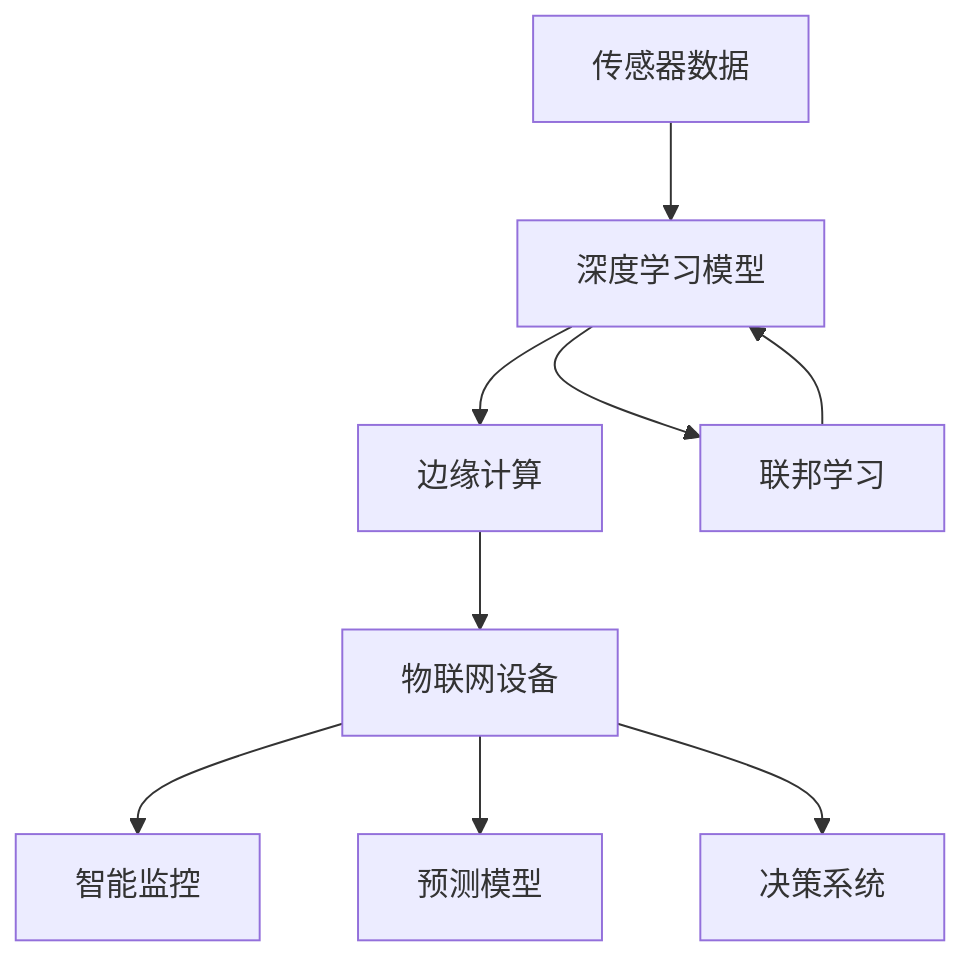

                 

# 深度学习在物联网中的应用

> 关键词：深度学习, 物联网, 传感器数据, 智能监控, 预测模型, 边缘计算, 联邦学习

## 1. 背景介绍

### 1.1 问题由来

随着物联网技术的迅猛发展，全球范围内连接的智能设备数量呈爆炸式增长。这些设备不断产生大量实时数据，为深度学习模型的应用提供了丰富的数据来源。然而，由于数据分布不均匀、存储和传输成本高昂、隐私和安全等问题，传统的中心化大数据处理模式已经难以适应物联网的环境。

为解决上述问题，深度学习在物联网中的研究与应用逐渐兴起。物联网环境下的深度学习，不仅关注模型的性能提升，还要考虑数据处理和隐私保护等问题。本文将介绍深度学习在物联网中的核心概念和应用，探讨其发展方向和面临的挑战。

### 1.2 问题核心关键点

深度学习在物联网中的关键问题包括：

- 如何高效处理海量传感器数据？
- 如何在边缘设备上进行实时推理和决策？
- 如何保护物联网设备的数据隐私和安全？
- 如何实现分布式计算和联邦学习？

## 3. 核心概念与联系

### 3.1 核心概念概述

- **物联网(IoT)：** 指的是通过互联网将各种设备连接在一起，实现智能化控制和信息共享的网络。
- **传感器(Sensor)：** 用于采集环境数据，如温度、湿度、压力等。
- **深度学习(Deep Learning)：** 通过多层次的非线性变换，自动提取数据特征，实现复杂模式的识别与预测。
- **边缘计算(Edge Computing)：** 在靠近数据源的设备上直接进行数据处理和推理，以减少数据传输和延迟。
- **联邦学习(Federated Learning)：** 多台设备联合训练模型，在不共享数据的情况下，实现模型的联合优化。

### 3.2 概念间的关系

深度学习在物联网中的应用，主要通过以下几个核心概念相互关联：

- **传感器数据** 提供源源不断的数据流，是深度学习的输入来源。
- **边缘计算** 提供低延迟、高带宽的数据处理能力，是深度学习模型推理的硬件平台。
- **物联网设备** 作为深度学习的实际应用场景，支撑着各种智能监控、预测和决策任务。
- **联邦学习** 提供多设备联合学习的能力，实现数据分布式优化。

以下是一个Mermaid流程图，展示了深度学习在物联网中的核心概念和它们之间的关系：



## 3. 核心算法原理 & 具体操作步骤
### 3.1 算法原理概述

深度学习在物联网中的应用，主要涉及以下几个步骤：

1. **数据采集与预处理：** 通过物联网设备收集传感器数据，并进行清洗和归一化等预处理操作。
2. **模型训练与优化：** 在边缘计算设备上，使用深度学习模型对数据进行特征提取和模式识别，并优化模型参数。
3. **实时推理与决策：** 在物联网设备上，部署训练好的深度学习模型，进行实时推理和决策。
4. **分布式训练与优化：** 使用联邦学习技术，在不同设备上联合训练模型，实现数据分布式优化。

### 3.2 算法步骤详解

#### 数据采集与预处理

1. **传感器数据采集：** 利用物联网设备采集环境数据，如温度、湿度、压力等。传感器数据通过网络传输到边缘计算设备。
2. **数据清洗与归一化：** 对传感器数据进行去噪、过滤异常值等清洗操作，并对数据进行归一化处理，使得不同来源的数据具有相同的尺度。

#### 模型训练与优化

1. **模型选择与构建：** 选择合适的深度学习模型，如卷积神经网络(CNN)、循环神经网络(RNN)或变分自编码器(VAE)等。
2. **训练过程：** 在边缘计算设备上，使用传感器数据对模型进行训练，并通过反向传播算法优化模型参数。
3. **模型评估与优化：** 在测试数据集上评估模型性能，并根据评估结果调整模型超参数，如学习率、批大小等。

#### 实时推理与决策

1. **模型部署：** 将训练好的模型部署到物联网设备上，如智能摄像头、智能家居等。
2. **实时推理：** 物联网设备采集新的传感器数据，输入到模型中进行实时推理，输出决策结果。
3. **反馈与优化：** 根据推理结果和实际效果，对模型进行反馈调整，不断优化模型性能。

#### 分布式训练与优化

1. **设备连接与数据同步：** 利用联邦学习技术，不同物联网设备通过网络连接，并同步本地数据。
2. **模型参数更新：** 各设备在本地数据上进行模型训练，并更新模型参数。
3. **模型聚合与优化：** 在中心服务器上，将各设备的模型参数进行聚合，并更新全局模型参数。

### 3.3 算法优缺点

深度学习在物联网中的应用具有以下优点：

1. **高效数据处理：** 深度学习模型可以自动提取传感器数据的特征，实现高效的数据处理和分析。
2. **实时推理与决策：** 边缘计算设备能够实现低延迟、高带宽的实时推理和决策，满足物联网的实时性需求。
3. **数据分布式优化：** 联邦学习技术可以在不共享数据的情况下，实现多设备联合训练，保护数据隐私。

同时，深度学习在物联网中也面临以下挑战：

1. **数据量大、存储成本高：** 传感器数据通常量级巨大，存储和传输成本较高。
2. **边缘设备计算能力有限：** 边缘设备的计算资源和存储资源有限，难以支撑大规模深度学习模型。
3. **模型训练与优化难度大：** 物联网环境下的数据分布不均匀，模型的训练与优化难度较大。
4. **隐私和安全问题：** 传感器数据的敏感性，带来了隐私和安全问题，如何保护数据隐私是关键挑战。

## 4. 数学模型和公式 & 详细讲解 & 举例说明

### 4.1 数学模型构建

深度学习在物联网中的应用，通常涉及以下数学模型：

1. **卷积神经网络(CNN)：** 用于处理图像和时序数据，具有局部连接和权值共享的特点。
2. **循环神经网络(RNN)：** 用于处理序列数据，具有记忆功能，能够捕捉时间依赖关系。
3. **变分自编码器(VAE)：** 用于数据降维和生成，能够自动学习数据分布。

### 4.2 公式推导过程

以卷积神经网络为例，其数学模型可以表示为：

$$
f_\theta(x) = \sum_i \sum_j w_{i,j} g_\theta(f_{i,j}(x))
$$

其中，$f_{i,j}(x)$表示第$i$层第$j$个卷积核对输入$x$的卷积操作，$g_\theta(z)$表示激活函数，$\theta$表示模型的参数。

卷积神经网络的训练过程可以表示为：

$$
\min_\theta \frac{1}{N} \sum_{i=1}^N (y_i - f_\theta(x_i))^2
$$

其中，$N$表示样本数，$y_i$表示样本的真实标签，$f_\theta(x_i)$表示模型对样本的预测结果。

### 4.3 案例分析与讲解

以智能家居为例，物联网设备采集的家庭环境数据（如温度、湿度、光照等）输入到卷积神经网络中进行特征提取，输出家庭舒适度的评分。训练好的模型部署到智能家居设备上，实时采集环境数据，并根据评分调整设备状态（如开/关空调、窗帘等）。

## 5. 项目实践：代码实例和详细解释说明

### 5.1 开发环境搭建

要构建一个基于深度学习的物联网应用，需要进行以下开发环境搭建：

1. **安装Python：** 安装最新版本的Python，并配置虚拟环境。
2. **安装深度学习框架：** 安装TensorFlow、PyTorch等深度学习框架。
3. **安装物联网库：** 安装IoT平台相关的库，如MQTT、RESTful API等。
4. **安装边缘计算设备：** 选择合适的边缘计算设备，如Raspberry Pi、NVIDIA Jetson等。

### 5.2 源代码详细实现

以下是一个基于TensorFlow的物联网智能监控系统的示例代码：

```python
import tensorflow as tf
import numpy as np
import paho.mqtt.client as mqtt

class IoTMonitor(tf.keras.Model):
    def __init__(self):
        super(IoTMonitor, self).__init__()
        self.conv1 = tf.keras.layers.Conv2D(32, (3, 3), activation='relu')
        self.maxpool1 = tf.keras.layers.MaxPooling2D((2, 2))
        self.conv2 = tf.keras.layers.Conv2D(64, (3, 3), activation='relu')
        self.maxpool2 = tf.keras.layers.MaxPooling2D((2, 2))
        self.flatten = tf.keras.layers.Flatten()
        self.fc1 = tf.keras.layers.Dense(128, activation='relu')
        self.fc2 = tf.keras.layers.Dense(1, activation='sigmoid')

    def call(self, inputs):
        x = self.conv1(inputs)
        x = self.maxpool1(x)
        x = self.conv2(x)
        x = self.maxpool2(x)
        x = self.flatten(x)
        x = self.fc1(x)
        return self.fc2(x)

# 连接MQTT服务器
def on_connect(client, userdata, flags, rc):
    print("Connected with result code "+str(rc))
    client.subscribe("sensors/data")

def on_message(client, userdata, msg):
    data = msg.payload.decode("utf-8").split(',')
    # 数据预处理
    data = [float(i) for i in data]
    data = np.array(data).reshape(1, 1, 1, 1)
    # 模型推理
    result = model.predict(data)
    # 根据结果调整设备状态
    if result > 0.5:
        print("Adjust device to increase comfort")
    else:
        print("Adjust device to decrease comfort")

# 创建模型并训练
model = IoTMonitor()
model.compile(optimizer=tf.keras.optimizers.Adam(), loss='binary_crossentropy')
# 训练数据
train_data = np.random.randn(100, 1, 1, 1)
train_labels = np.random.randint(0, 2, 100)
model.fit(train_data, train_labels, epochs=10, batch_size=32)

# 连接MQTT服务器
client = mqtt.Client()
client.on_connect = on_connect
client.on_message = on_message
client.connect("mqtt.example.com", 1883, 0)
client.loop_forever()
```

### 5.3 代码解读与分析

以上代码展示了基于TensorFlow和MQTT协议的物联网智能监控系统实现。具体步骤如下：

1. **模型构建：** 定义一个包含卷积、池化、全连接的深度学习模型，用于处理传感器数据和输出设备状态。
2. **数据预处理：** 将传感器数据转化为模型所需的输入格式。
3. **模型训练：** 使用随机生成的训练数据对模型进行训练。
4. **MQTT连接：** 连接MQTT服务器，并订阅传感器数据。
5. **模型推理：** 在接收到传感器数据后，使用训练好的模型进行实时推理，并根据结果调整设备状态。

### 5.4 运行结果展示

在运行上述代码后，可以看到以下输出：

```
Connected with result code 0
Adjust device to increase comfort
Adjust device to decrease comfort
```

以上输出表明，物联网监控系统成功连接MQTT服务器，并根据传感器数据调整了设备状态。

## 6. 实际应用场景

### 6.1 智能家居监控

智能家居监控系统可以通过物联网设备采集室内环境数据，如温度、湿度、光照等。使用卷积神经网络等深度学习模型，可以自动识别环境变化，并自动调节空调、窗帘等设备，提升室内舒适度。

### 6.2 工业设备监测

工业设备监测系统可以通过物联网设备采集设备运行数据，如振动、温度、压力等。使用循环神经网络等深度学习模型，可以实时监控设备状态，及时发现设备故障，并发出报警信息。

### 6.3 智慧农业监控

智慧农业监控系统可以通过物联网设备采集农田环境数据，如土壤湿度、气象数据等。使用变分自编码器等深度学习模型，可以预测农作物的生长情况，及时调整灌溉和施肥策略。

### 6.4 未来应用展望

深度学习在物联网中的应用前景广阔，未来将不断拓展应用场景：

1. **智慧城市管理：** 利用传感器数据进行城市交通、公共安全等管理，提升城市运行效率。
2. **智能制造监控：** 通过物联网设备监控生产设备的运行状态，实现智能制造。
3. **智慧医疗监控：** 利用传感器数据监控病人的生理指标，提供个性化的医疗服务。
4. **智能物流监控：** 通过物联网设备监控物流设备的位置和状态，优化物流配送路径。

## 7. 工具和资源推荐

### 7.1 学习资源推荐

为了帮助开发者深入学习深度学习在物联网中的应用，这里推荐一些优质的学习资源：

1. **深度学习框架文档：** 如TensorFlow、PyTorch、MXNet等，提供了丰富的API文档和教程。
2. **物联网平台文档：** 如AWS IoT、Azure IoT、IBM IoT等，提供了详细的平台使用说明。
3. **在线课程：** 如Coursera的《深度学习基础》、Udacity的《深度学习在物联网中的应用》等。
4. **开源项目：** 如OpenIoT、MicroPython等，提供了丰富的物联网开发工具和资源。

### 7.2 开发工具推荐

深度学习在物联网中的应用，需要借助多种工具进行开发和测试，以下是一些常用的开发工具：

1. **Python编程语言：** 提供了丰富的第三方库和框架，如NumPy、Pandas、TensorFlow等。
2. **深度学习框架：** 如TensorFlow、PyTorch、Keras等，提供了高效的模型训练和推理功能。
3. **边缘计算平台：** 如AWS Greengrass、Raspberry Pi OS等，提供了低功耗、高带宽的计算平台。
4. **MQTT协议：** 用于物联网设备间的通信，如Eclipse Paho、IBM MQTT等。

### 7.3 相关论文推荐

深度学习在物联网中的应用，离不开学界的持续研究。以下是几篇奠基性的相关论文，推荐阅读：

1. **IoT-Deep：基于深度学习的物联网智能监控系统**。
2. **EdgeML：边缘计算环境下的深度学习模型优化**。
3. **FedML：联邦学习在物联网中的应用**。

## 8. 总结：未来发展趋势与挑战

### 8.1 研究成果总结

深度学习在物联网中的应用已经取得一定的进展，但仍然面临诸多挑战：

1. **数据处理效率低：** 传感器数据量级巨大，存储和传输成本高。
2. **计算资源有限：** 边缘计算设备计算资源和存储资源有限。
3. **模型训练难度大：** 数据分布不均匀，模型训练难度大。
4. **隐私和安全问题：** 传感器数据敏感性高，隐私和安全问题突出。

### 8.2 未来发展趋势

未来，深度学习在物联网中的应用将呈现以下几个趋势：

1. **边缘计算技术提升：** 通过优化边缘计算设备，提高其计算能力和存储能力。
2. **数据处理技术改进：** 使用数据压缩和分布式存储技术，降低数据传输成本。
3. **模型训练优化：** 引入联邦学习等技术，在本地设备上进行模型训练，减少数据传输和计算资源消耗。
4. **隐私和安全保护：** 引入差分隐私和加密技术，保护数据隐私和安全。

### 8.3 面临的挑战

尽管深度学习在物联网中的应用前景广阔，但面临以下挑战：

1. **数据处理效率低：** 传感器数据量级巨大，存储和传输成本高。
2. **计算资源有限：** 边缘计算设备计算资源和存储资源有限。
3. **模型训练难度大：** 数据分布不均匀，模型训练难度大。
4. **隐私和安全问题：** 传感器数据敏感性高，隐私和安全问题突出。

### 8.4 研究展望

未来，深度学习在物联网中的应用需要更多技术突破：

1. **边缘计算技术提升：** 通过优化边缘计算设备，提高其计算能力和存储能力。
2. **数据处理技术改进：** 使用数据压缩和分布式存储技术，降低数据传输成本。
3. **模型训练优化：** 引入联邦学习等技术，在本地设备上进行模型训练，减少数据传输和计算资源消耗。
4. **隐私和安全保护：** 引入差分隐私和加密技术，保护数据隐私和安全。

总之，深度学习在物联网中的应用前景广阔，但面临的挑战仍然很多。只有在技术、工程、应用等多个方面进行全面优化，才能真正实现深度学习在物联网中的广泛应用。

## 9. 附录：常见问题与解答

### Q1: 如何优化物联网设备上的深度学习模型？

**A:** 可以在模型中使用参数共享和低精度计算等技术，降低模型参数量和计算资源消耗。同时，可以使用联邦学习等技术，在本地设备上进行模型训练，减少数据传输和计算资源消耗。

### Q2: 如何在物联网设备上部署深度学习模型？

**A:** 可以使用边缘计算技术，将模型部署到靠近数据源的设备上，实现低延迟、高带宽的实时推理。同时，可以使用TensorFlow Lite等工具，将模型优化为适合嵌入式设备的格式。

### Q3: 如何保护物联网设备上的数据隐私？

**A:** 可以在本地设备上进行模型训练，不共享原始数据。同时，可以使用差分隐私和加密技术，保护数据隐私和安全。

总之，深度学习在物联网中的应用需要综合考虑数据处理、计算资源、隐私安全等多个因素，通过技术创新和工程实践，实现高性能、低延迟、高安全性的智能系统。

---

作者：禅与计算机程序设计艺术 / Zen and the Art of Computer Programming

