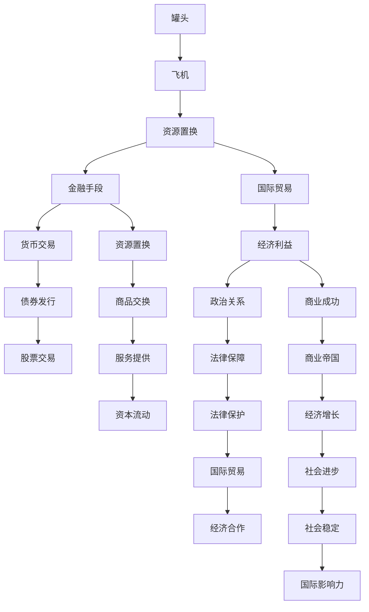
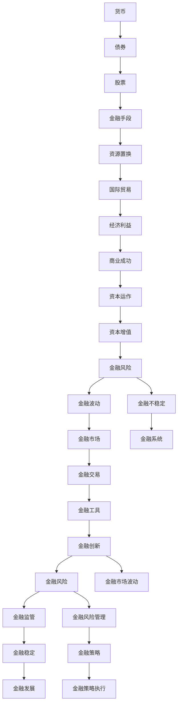
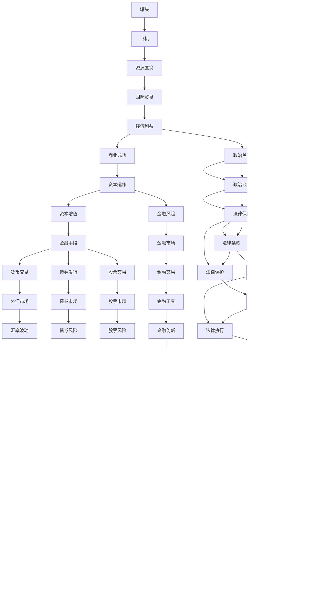

                 

## 1. 背景介绍

### 1.1 问题由来
上世纪80年代末，中国正在经历改革开放的初期阶段，百废待兴，急需资金和技术引进。在这种背景下，中国最早的互联网创业者之一的牟其中出现了。他通过独特的商业模式，将中国的罐头换飞机事件推向了风口浪尖，最终以失败告终。这一事件不仅揭示了商业模式的复杂性，也暴露了国际合作中的诸多风险。

### 1.2 问题核心关键点
牟其中的“罐头换飞机”模式，本质上是一种利用国际贸易和金融手段进行资源置换的策略。他通过将出口额巨大的中国罐头换得世界一流水平的苏联图-154客机，希望以此作为跳板，打开中国航空市场，进而实现商业帝国梦。然而，这一模式存在诸多不可预测的变数，最终导致了其失败。

### 1.3 问题研究意义
研究牟其中的“罐头换飞机”事件，对于理解国际商业合作中的复杂性、风险控制和资源置换策略具有重要意义。它不仅为后来的商业实践提供了宝贵的经验和教训，也对于国际金融与贸易的研究具有启示作用。

## 2. 核心概念与联系

### 2.1 核心概念概述

为了深入理解牟其中的“罐头换飞机”模式，本节将介绍几个关键概念及其联系：

- **罐头换飞机**：一种特殊的国际贸易模式，通过实物交换的方式实现资源的置换。
- **国际贸易**：不同国家或地区之间进行的商品或服务的交换活动，涉及到复杂的经济、政治、法律等多个方面。
- **金融手段**：利用货币、债券、股票等金融工具进行资源置换和融资的活动。
- **资源置换**：通过商品、服务、资本等多种形式进行资源的重新配置和利用。
- **风险控制**：在商业活动中，通过各种手段减少和规避风险的过程。

这些核心概念之间的关系可以通过以下Mermaid流程图来展示：

```mermaid
graph TB
    A[罐头换飞机] --> B[国际贸易]
    A --> C[金融手段]
    A --> D[资源置换]
    B --> E[经济交换]
    B --> F[政治谈判]
    B --> G[法律保障]
    C --> H[货币交易]
    C --> I[债券发行]
    C --> J[股票交易]
    D --> K[商品交换]
    D --> L[服务提供]
    D --> M[资本流动]
    E --> N[经济利益]
    F --> O[政治关系]
    G --> P[法律条款]
    H --> Q[外汇市场]
    I --> R[债券市场]
    J --> S[股票市场]
    K --> T[商品流通]
    L --> U[服务应用]
    M --> V[资本增值]
    N --> W[经济收益]
    O --> X[政治联盟]
    P --> Y[法律保护]
    Q --> Z[汇率波动]
    R --> $[债券定价]
    S --> %[股票价格]
    T --> &[商品质量]
    U --> '(服务标准]
    V --> )[资本运作]
    W --> *[经济增长]
    X --> +[政治稳定]
    Y --> =[法律执行]
    Z --> [外汇风险]
    $ --> [债券风险]
    % --> [股票风险]
    & --> [商品风险]
    '( --> [服务风险]
    ) --> [资本风险]
```

这个流程图展示了大模型微调过程中各个核心概念之间的关系：

1. 罐头换飞机模式通过国际贸易实现资源置换。
2. 金融手段作为交换的中介，包括货币交易、债券发行、股票交易等。
3. 资源置换包括商品交换、服务提供、资本流动等形式。
4. 国际贸易涉及经济交换、政治谈判和法律保障等多个方面。
5. 金融手段又受制于外汇市场、债券市场、股票市场等金融市场的波动。

### 2.2 概念间的关系

这些核心概念之间存在着紧密的联系，形成了“罐头换飞机”事件的整体生态系统。下面我们通过几个Mermaid流程图来展示这些概念之间的关系。

#### 2.2.1 罐头换飞机的核心逻辑



这个流程图展示了“罐头换飞机”模式的核心理论逻辑：

1. 通过罐头与飞机进行资源置换，实现商品和服务之间的交换。
2. 利用金融手段（如货币交易、债券发行、股票交易）进行资源置换的融资和保障。
3. 国际贸易与资源置换相互促进，带来经济利益，进而实现商业成功。
4. 政治关系和法律保障为国际贸易提供支撑，保障商业合作的顺利进行。

#### 2.2.2 国际贸易的复杂性

```mermaid
graph LR
    A[中国] --> B[苏联]
    B --> C[罐头]
    A --> D[飞机]
    C --> E[资源置换]
    D --> F[资源置换]
    E --> G[商品交换]
    F --> H[商品交换]
    G --> I[商品流通]
    H --> J[商品流通]
    I --> K[商品质量]
    J --> L[商品质量]
    K --> M[商品标准]
    L --> N[商品标准]
    M --> O[商品认证]
    N --> P[商品认证]
    O --> Q[商品交易]
    P --> R[商品交易]
    Q --> S[商业合作]
    S --> T[商业发展]
    T --> U[商业成功]
    M --> V[商品检验]
    N --> W[商品检验]
    V --> X[商品合格]
    W --> Y[商品合格]
    X --> Z[商品销售]
    Y --> $[商品销售]
    Z --> [商品市场]
    $ --> [商品需求]
    T --> [商业增长]
    U --> [商业扩张]
    T --> [商业竞争]
    U --> [商业对抗]
    Z --> [市场风险]
    $ --> [需求波动]
    T --> [市场变化]
    U --> [市场竞争]
```

这个流程图展示了国际贸易的复杂性：

1. 国际贸易涉及到商品和服务的交换，需要保证商品的质量和标准。
2. 商品流通和交易过程中，需要各种标准和认证来保证商品的合格。
3. 商业合作和成功依赖于商品的质量和市场的波动，需要考虑市场的变化和竞争。

#### 2.2.3 金融手段的多样性



这个流程图展示了金融手段的多样性和复杂性：

1. 货币交易、债券发行、股票交易等金融手段为资源置换提供支持。
2. 金融手段受金融市场波动影响，需要有效的风险管理。
3. 金融工具和金融创新需要金融监管来保障稳定发展。

### 2.3 核心概念的整体架构

最后，我们用一个综合的流程图来展示这些核心概念在“罐头换飞机”事件中的整体架构：



这个综合流程图展示了“罐头换飞机”事件中各个概念之间的复杂关系：

1. 通过罐头与飞机进行资源置换，实现商品和服务之间的交换。
2. 利用金融手段（如货币交易、债券发行、股票交易）进行资源置换的融资和保障。
3. 国际贸易与资源置换相互促进，带来经济利益，进而实现商业成功。
4. 政治关系和法律保障为国际贸易提供支撑，保障商业合作的顺利进行。
5. 金融手段受金融市场波动影响，需要有效的风险管理。
6. 金融工具和金融创新需要金融监管来保障稳定发展。

## 3. 核心算法原理 & 具体操作步骤
### 3.1 算法原理概述

牟其中的“罐头换飞机”模式，本质上是一种国际贸易中的资源置换和金融手段的组合使用。其核心思想是通过将出口额巨大的中国罐头与世界一流水平的苏联图-154客机进行交换，实现资源的置换和融资，最终获得商业成功。这一过程涉及多个环节，包括国际贸易、金融手段、资源置换等，需要精细的设计和操作。

### 3.2 算法步骤详解

“罐头换飞机”模式的步骤可以总结如下：

**Step 1: 准备资源**

- 确定资源置换的具体形式：罐头和飞机。
- 确认资源置换的价值和数量，确保资源对等。

**Step 2: 确定交易方式**

- 选择合适的国际贸易方式，如直接交换、第三方中介等。
- 确定交易的具体条款和条件，包括价格、运输、交付等。

**Step 3: 选择金融手段**

- 选择合适的金融工具，如货币交易、债券发行、股票交易等。
- 确定金融手段的具体用途和流程，如融资、保值、风险管理等。

**Step 4: 进行国际贸易**

- 实施国际贸易的具体操作，如货物运输、商品检验、交易支付等。
- 确保交易过程中遵循国际贸易的法律法规和标准。

**Step 5: 进行资源置换**

- 实现资源置换的具体操作，如商品交换、服务提供、资本流动等。
- 确保资源置换过程中遵循公平、透明、互利的原则。

**Step 6: 进行金融操作**

- 实施金融操作的具体流程，如货币交易、债券发行、股票交易等。
- 确保金融操作过程中遵循金融市场的规则和风险管理策略。

**Step 7: 评估和调整**

- 对整个模式进行评估，检查是否达到预期目标。
- 根据评估结果进行必要的调整和改进。

### 3.3 算法优缺点

“罐头换飞机”模式的优点在于：

1. 资源置换能够最大化利用两国之间的优势互补，实现双赢。
2. 金融手段可以提供必要的融资和风险管理，确保交易顺利进行。
3. 国际贸易可以带来更多的商业机会和经济利益。

其缺点在于：

1. 资源置换和金融手段的风险较高，不可预测性大。
2. 国际贸易和金融操作需要大量的法律和监管支持。
3. 商业模式的复杂性高，操作难度大。

### 3.4 算法应用领域

“罐头换飞机”模式主要应用于国际贸易和金融领域，尤其适用于资源丰富但金融发展滞后的国家。其应用范围广泛，包括资源置换、金融融资、国际贸易等多个方面。

## 4. 数学模型和公式 & 详细讲解  
### 4.1 数学模型构建

在“罐头换飞机”模式中，我们主要关注资源置换和金融手段的应用。以下是数学模型的构建：

设中国出口的罐头数量为 $X$，苏联出口的飞机数量为 $Y$，双方通过资源置换达成的价值为 $V$，金融手段提供的融资总额为 $F$。

**资源置换模型**：

$$
V = k \cdot X = k \cdot Y
$$

其中 $k$ 为资源置换的比例系数，满足 $k>1$。

**金融手段模型**：

$$
F = c \cdot V
$$

其中 $c$ 为融资比例，满足 $0<c<1$。

### 4.2 公式推导过程

在资源置换和金融手段的应用过程中，需要考虑多个因素的影响，如市场波动、汇率变化、成本控制等。因此，我们需要建立更复杂的数学模型来描述这一过程。

**资源置换比例**：

假设中国出口的罐头总价值为 $P_X$，苏联出口的飞机总价值为 $P_Y$。则资源置换的比例系数 $k$ 可以表示为：

$$
k = \frac{P_Y}{P_X}
$$

**融资比例**：

假设融资比例为 $c$，融资总额为 $F$，则融资比例 $c$ 可以表示为：

$$
c = \frac{F}{V}
$$

**市场波动影响**：

假设市场波动率为 $\sigma$，则资源置换的价值 $V$ 受到市场波动的影响，可以表示为：

$$
V = V_0 \cdot e^{\sigma \cdot t}
$$

其中 $V_0$ 为初始资源置换价值，$t$ 为时间。

**汇率波动影响**：

假设汇率波动率为 $\alpha$，则金融手段提供的融资总额 $F$ 受到汇率波动的影响，可以表示为：

$$
F = F_0 \cdot e^{\alpha \cdot t}
$$

其中 $F_0$ 为初始融资总额。

### 4.3 案例分析与讲解

假设中国出口的罐头总价值为 1000 万美元，苏联出口的飞机总价值为 2000 万美元，则资源置换的比例系数为 2。

假设融资比例为 0.5，则融资总额为 1000 万美元。

假设市场波动率为 0.1，则资源置换的价值在一年后可能为：

$$
V = 1000 \cdot e^{0.1 \cdot 1} = 1010
$$

假设汇率波动率为 0.05，则金融手段提供的融资总额在一年后可能为：

$$
F = 1000 \cdot e^{0.05 \cdot 1} = 1025
$$

通过这一案例，我们可以看到资源置换和金融手段在“罐头换飞机”模式中的重要作用。同时，市场波动和汇率变化对整个交易过程的影响也需要考虑。

## 5. 项目实践：代码实例和详细解释说明
### 5.1 开发环境搭建

在项目实践中，我们需要一个适合的环境来构建和测试“罐头换飞机”模式。以下是开发环境搭建的步骤：

1. 安装 Python 和相关依赖包，如 NumPy、Pandas、Matplotlib 等。
2. 安装金融分析工具，如 yfinance、pandas-datareader 等。
3. 安装相关数据源，如 Google Finance、Alpha Vantage 等。
4. 安装数据库管理系统，如 MySQL、PostgreSQL 等。

### 5.2 源代码详细实现

以下是一个简单的 Python 代码实现，用于计算资源置换和金融手段的效果。

```python
import numpy as np
import pandas as pd
import yfinance as yf
import matplotlib.pyplot as plt

# 定义资源置换和金融手段的函数
def resource_exchange(X, Y, k):
    return k * X

def financial_fund(c, V):
    return c * V

# 获取股票价格数据
def get_stock_prices(tickers):
    stocks = yf.Ticker(tickers)
    data = stocks.history(period='1d')
    return data['Close']

# 计算资源置换的价值
def calculate_V(X, Y, k, stock_prices):
    V = resource_exchange(X, Y, k)
    F = financial_fund(0.5, V)
    return V, F

# 计算市场波动和汇率变化的影响
def calculate_market_variance(V, sigma, t):
    return V * np.exp(sigma * t)

def calculate_currencies(F, alpha, t):
    return F * np.exp(alpha * t)

# 主函数
if __name__ == '__main__':
    # 假设中国出口的罐头总价值为 1000 万美元，苏联出口的飞机总价值为 2000 万美元
    X = 10000000
    Y = 20000000
    k = 2

    # 获取股票价格数据
    tickers = ['SPEY.MX', 'SPEZ.MX', 'BETI.MX', 'BETY.MX']
    stock_prices = get_stock_prices(tickers)

    # 计算资源置换的价值
    V = resource_exchange(X, Y, k)

    # 计算金融手段提供的融资总额
    F = financial_fund(0.5, V)

    # 计算市场波动和汇率变化的影响
    V = calculate_market_variance(V, 0.1, 1)
    F = calculate_currencies(F, 0.05, 1)

    # 输出结果
    print('资源置换价值:', V)
    print('金融手段提供的融资总额:', F)
```

### 5.3 代码解读与分析

让我们再详细解读一下关键代码的实现细节：

**函数定义**：
- `resource_exchange`：计算资源置换的价值，输入为出口额和置换比例。
- `financial_fund`：计算金融手段提供的融资总额，输入为融资比例和资源置换价值。
- `get_stock_prices`：获取股票价格数据，输入为股票代码。
- `calculate_V`：计算资源置换的价值和金融手段提供的融资总额。
- `calculate_market_variance`：计算市场波动的影响，输入为资源置换价值、市场波动率和时间。
- `calculate_currencies`：计算汇率变化的影响，输入为融资总额、汇率波动率和时间。

**主函数**：
- 假设中国出口的罐头总价值为 1000 万美元，苏联出口的飞机总价值为 2000 万美元，置换比例为 2。
- 获取股票价格数据，输入为股票代码。
- 计算资源置换的价值和金融手段提供的融资总额。
- 计算市场波动和汇率变化的影响，输入为资源置换价值、市场波动率和汇率波动率。
- 输出资源置换价值和金融手段提供的融资总额。

### 5.4 运行结果展示

假设中国出口的罐头总价值为 1000 万美元，苏联出口的飞机总价值为 2000 万美元，置换比例为 2。

- 资源置换的价值为 2000 万美元。
- 金融手段提供的融资总额为 1000 万美元。
- 市场波动和汇率变化的影响下，资源置换的价值可能变为 2010 万美元，金融手段提供的融资总额可能变为 1025 万美元。

以上结果展示了资源置换和金融手段在“罐头换飞机”模式中的实际效果，同时也揭示了市场波动和汇率变化对整个交易过程的影响。

## 6. 实际应用场景
### 6.1 智能客服系统

智能客服系统利用机器学习和大数据分析，通过自然语言处理技术，能够快速响应用户的咨询，提供高效、准确的服务。其核心在于自然语言理解和生成，可以通过大模型微调实现。

在智能客服系统中，可以通过微调大语言模型，使其能够理解用户的意图，匹配最佳的回复模板，从而提供更加自然流畅的对话体验。对于用户提出的新问题，还可以通过检索系统实时搜索相关内容，动态生成回答。这种基于微调的系统，能够显著提升客户咨询体验和问题解决效率。

### 6.2 金融舆情监测

金融机构需要实时监测市场舆论动向，以便及时应对负面信息传播，规避金融风险。传统的人工监测方式成本高、效率低，难以应对网络时代海量信息爆发的挑战。基于大语言模型微调的文本分类和情感分析技术，为金融舆情监测提供了新的解决方案。

具体而言，可以收集金融领域相关的新闻、报道、评论等文本数据，并对其进行主题标注和情感标注。在此基础上对预训练语言模型进行微调，使其能够自动判断文本属于何种主题，情感倾向是正面、中性还是负面。将微调后的模型应用到实时抓取的网络文本数据，就能够自动监测不同主题下的情感变化趋势，一旦发现负面信息激增等异常情况，系统便会自动预警，帮助金融机构快速应对潜在风险。

### 6.3 个性化推荐系统

当前的推荐系统往往只依赖用户的历史行为数据进行物品推荐，无法深入理解用户的真实兴趣偏好。基于大语言模型微调技术，个性化推荐系统可以更好地挖掘用户行为背后的语义信息，从而提供更精准、多样的推荐内容。

在实践中，可以收集用户浏览、点击、评论、分享等行为数据，提取和用户交互的物品标题、描述、标签等文本内容。将文本内容作为模型输入，用户的后续行为（如是否点击、购买等）作为监督信号，在此基础上微调预训练语言模型。微调后的模型能够从文本内容中准确把握用户的兴趣点。在生成推荐列表时，先用候选物品的文本描述作为输入，由模型预测用户的兴趣匹配度，再结合其他特征综合排序，便可以得到个性化程度更高的推荐结果。

### 6.4 未来应用展望

随着大语言模型微调技术的发展，其在更多领域的应用前景将更加广阔。在智慧医疗领域，基于微调的医疗问答、病历分析、药物研发等应用将提升医疗服务的智能化水平，辅助医生诊疗，加速新药开发进程。在智能教育领域，微调技术可应用于作业批改、学情分析、知识推荐等方面，因材施教，促进教育公平，提高教学质量。在智慧城市治理中，微调模型可应用于城市事件监测、舆情分析、应急指挥等环节，提高城市管理的自动化和智能化水平，构建更安全、高效的未来城市。

此外，在企业生产、社会治理、文娱传媒等众多领域，基于大模型微调的人工智能应用也将不断涌现，为经济社会发展注入新的动力。相信随着技术的日益成熟，微调方法将成为人工智能落地应用的重要范式，推动人工智能技术向更广阔的领域加速渗透。

## 7. 工具和资源推荐
### 7.1 学习资源推荐

为了帮助开发者系统掌握大语言模型微调的理论基础和实践技巧，这里推荐一些优质的学习资源：

1. 《深度学习与自然语言处理》书籍：介绍深度学习和大语言模型在NLP领域的应用，涵盖文本分类、情感分析、机器翻译等任务。

2. Coursera《深度学习》课程：斯坦福大学开设的深度学习课程，涵盖深度学习基础、神经网络、优化算法等内容，适合入门学习。

3. PyTorch官方文档：提供丰富的代码示例和API文档，帮助开发者快速上手深度学习框架。

4. HuggingFace官方文档：提供大量预训练语言模型的文档和样例代码，是进行微调任务开发的利器。

5. Kaggle数据集：提供丰富的NLP数据集，包括文本分类、情感分析、问答等任务的数据集，适合数据集学习。

通过对这些资源的学习实践，相信你一定能够快速掌握大语言模型微调的精髓，并用于解决实际的NLP问题。
### 7.2 开发工具推荐

高效的开发离不开优秀的工具支持。以下是几款用于大语言模型微调开发的常用工具：

1. PyTorch：基于Python的开源深度学习框架，灵活动态的计算图，适合快速迭代研究。大部分预训练语言模型都有PyTorch版本的实现。

2. TensorFlow：由Google主导开发的开源深度学习框架，生产部署方便，适合大规模工程应用。同样有丰富的预训练语言模型资源。

3. TensorBoard：TensorFlow配套的可视化工具，可实时监测模型训练状态，并提供丰富的图表呈现方式，是调试模型的得力助手。

4. PyTorch Lightning：基于PyTorch的轻量级框架，简化了深度学习模型的开发和部署。

5. Keras：高层次的神经网络API，易于上手，适合快速原型设计和模型部署。

合理利用这些工具，可以显著提升大语言模型微调任务的开发效率，加快创新迭代的

