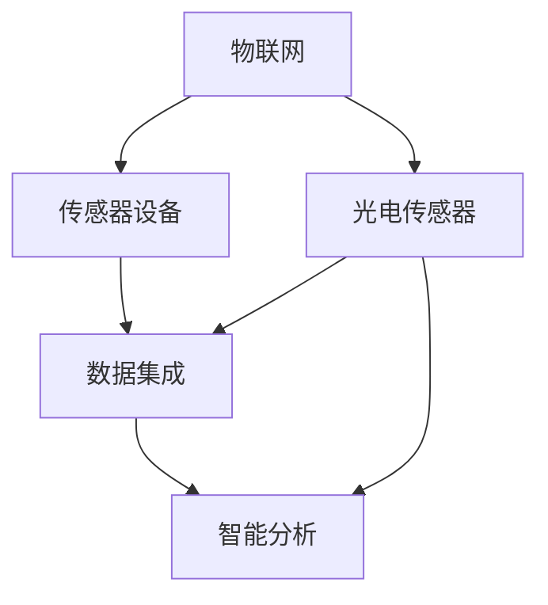
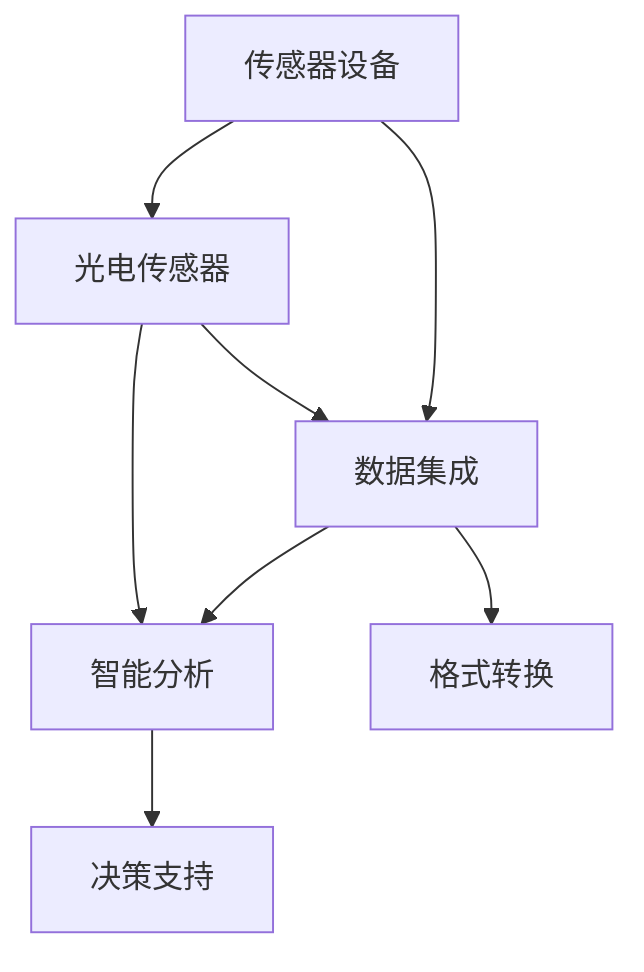
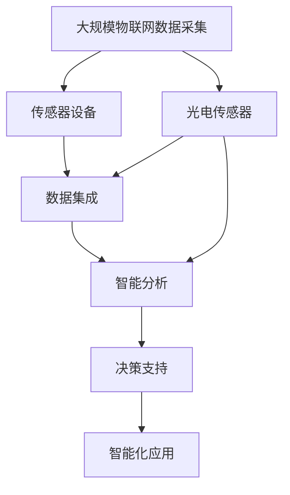

                 

# 物联网(IoT)技术和各种传感器设备的集成：光电传感器的应用

> 关键词：物联网(IoT)，传感器设备，光电传感器，数据集成，智能分析，应用场景

## 1. 背景介绍

### 1.1 问题由来

随着互联网技术的飞速发展，物联网(IoT)正逐渐渗透到各行各业，成为推动数字化转型的重要力量。物联网设备通过传感器等手段，实时收集海量数据，为智能化决策提供了数据支撑。然而，不同种类的传感器设备往往提供不同的数据格式和单位，如何高效集成和管理这些异构数据，是大规模物联网应用中的一个重要问题。

光电传感器作为物联网中的一种关键设备，在智能家居、智能城市、工业自动化等领域广泛应用。光电传感器能够感知光的强度、颜色、位置等信息，为各种应用场景提供了基础的数据支持。然而，如何充分利用这些传感数据，进行高效的集成和分析，成为提升物联网应用性能的关键。

### 1.2 问题核心关键点

光电传感器通常包括光敏二极管、光电倍增管、光电图像传感器等多种类型。它们通过将光信号转换为电信号，实现对光照环境、物体移动、光线分布等信息的感知。在实际应用中，光电传感器数据需要与计算机系统进行高效集成和分析，以实现智能化决策。

目前，光电传感器数据集成面临的主要挑战包括：
- 数据格式多样：不同传感器提供的数据格式和单位各异，难以直接融合。
- 数据维度高：传感器数据通常包括光照强度、颜色、角度、位置等多种维度的信息，需要高效的集成和处理。
- 实时性要求高：传感器数据需要实时采集和处理，以保证决策的及时性。

### 1.3 问题研究意义

通过光电传感器的有效集成和分析，可以显著提升物联网应用的智能化水平和决策效率。具体而言：
- 提升环境监测精度：通过集成多种光电传感器，对环境光强、颜色、分布等数据进行综合分析，可以更准确地监测环境变化，及时采取应对措施。
- 优化智能家居体验：在智能家居中，通过集成光照传感器、红外传感器等，实现对室内光照、人体活动等信息的智能感知，提升生活便利性。
- 增强城市管理效能：在智慧城市中，通过集成交通流量传感器、道路光照传感器等，实现对交通流量、道路亮度等数据的实时监测，优化城市管理。
- 提高工业自动化水平：在工业自动化中，通过集成光照传感器、物体位置传感器等，实现对生产线上的光照、物体移动等信息的实时监测，提高生产效率和安全性。

## 2. 核心概念与联系

### 2.1 核心概念概述

为更好地理解光电传感器在物联网中的应用，本节将介绍几个密切相关的核心概念：

- 物联网(IoT)：通过互联网将传感器、控制器、计算机等设备连接起来，实现对物理世界信息的感知和智能化决策。
- 传感器设备：物联网设备中用于感知环境的硬件设备，包括光敏二极管、光电倍增管、光电图像传感器等多种类型。
- 数据集成：将不同传感器设备提供的数据进行格式转换、格式标准化等处理，形成统一的数据格式，便于进一步分析和应用。
- 智能分析：对集成后的传感器数据进行深度学习、机器学习等算法分析，提取有用的信息，辅助决策。
- 光电传感器：通过将光信号转换为电信号，实现对光照环境、物体移动、光线分布等信息的感知。

这些核心概念之间的逻辑关系可以通过以下Mermaid流程图来展示：



这个流程图展示了物联网系统从传感器设备数据采集，到数据集成、智能分析的全过程。其中，光电传感器作为物联网中的一种关键设备，能够感知环境的光照信息，是数据集成的重要来源。

### 2.2 概念间的关系

这些核心概念之间存在着紧密的联系，形成了物联网应用的数据流和决策链。我们可以用更详细的Mermaid流程图来展示这些概念的相互关系：



这个流程图展示了传感器设备数据采集、数据集成、智能分析以及决策支持的完整流程。光电传感器作为传感器设备的一种，其数据需要通过数据集成和智能分析，最终形成决策支持信息，辅助智能化决策。

### 2.3 核心概念的整体架构

最后，我们用一个综合的流程图来展示这些核心概念在大规模物联网应用中的整体架构：



这个综合流程图展示了从传感器设备数据采集，到数据集成、智能分析、决策支持，再到智能化应用的全流程。光电传感器作为数据采集的重要手段，其数据经过高效集成和智能分析，最终形成决策支持信息，辅助智能化应用。

## 3. 核心算法原理 & 具体操作步骤
### 3.1 算法原理概述

光电传感器的数据集成和智能分析过程，本质上是一个数据预处理和特征提取的过程。其核心算法原理包括：

- 数据格式转换：将不同传感器提供的数据格式转换为统一的格式，如ASCII、JSON等。
- 数据标准化：将不同传感器提供的数据单位转换为统一的单位，如光强转换为勒克斯(Lux)、颜色温度转换为开尔文(Kelvin)等。
- 数据融合：将多个传感器提供的数据进行融合，形成更加综合和全面的信息。
- 特征提取：从融合后的数据中提取有用的特征，如光照强度、颜色温度、光角度等，供智能分析使用。

### 3.2 算法步骤详解

光电传感器数据集成和智能分析一般包括以下几个关键步骤：

**Step 1: 数据采集**

- 使用多种传感器设备，实时采集环境光强、颜色、角度、位置等信息。
- 记录传感器设备的采集时间戳，以便后续的时间同步。

**Step 2: 数据预处理**

- 对采集到的数据进行格式转换，统一为ASCII或JSON格式。
- 对不同单位的数据进行标准化处理，如将光强转换为勒克斯(Lux)、颜色温度转换为开尔文(Kelvin)等。
- 对缺失数据进行插补或删除处理，确保数据完整性。

**Step 3: 数据融合**

- 将不同传感器提供的数据进行融合，形成更加综合和全面的信息。
- 使用加权平均、加权求和等方法，对多源数据进行融合。

**Step 4: 特征提取**

- 从融合后的数据中提取有用的特征，如光照强度、颜色温度、光角度等。
- 使用统计方法、特征工程等技术，提取光照分布、光照变化等关键特征。

**Step 5: 智能分析**

- 对提取的特征进行深度学习、机器学习等算法分析。
- 使用神经网络、支持向量机(SVM)等模型，提取光照环境的特征向量。
- 使用集成学习、决策树等算法，训练分类器或回归器，对光照环境进行预测和分类。

**Step 6: 决策支持**

- 将智能分析结果转化为决策支持信息。
- 根据光照环境、物体移动等信息，制定相应的决策方案。
- 将决策支持信息反馈给控制系统，进行相应的自动化控制。

### 3.3 算法优缺点

光电传感器数据集成和智能分析方法具有以下优点：
- 数据集成效果高：通过统一数据格式和单位，便于不同设备间的数据交互和分析。
- 智能分析精度高：使用深度学习、机器学习等算法，能够提取丰富的光照特征，提高分析精度。
- 实时性要求高：传感器数据的实时采集和处理，能够及时反馈光照变化，优化决策。

同时，该方法也存在一些局限性：
- 数据预处理复杂：不同传感器数据格式和单位各异，需要进行复杂的数据预处理。
- 算法复杂度较高：深度学习、机器学习等算法模型复杂，计算资源消耗较大。
- 模型泛化能力不足：单一场景下的传感器数据可能无法泛化到其他场景，需要针对不同应用场景进行模型优化。

### 3.4 算法应用领域

光电传感器数据集成和智能分析方法已经在多个领域得到了广泛应用，例如：

- 智能家居：通过集成光照传感器、红外传感器等，实现对室内光照、人体活动等信息的智能感知，提升生活便利性。
- 智慧城市：在智慧城市中，通过集成交通流量传感器、道路光照传感器等，实现对交通流量、道路亮度等数据的实时监测，优化城市管理。
- 工业自动化：在工业自动化中，通过集成光照传感器、物体位置传感器等，实现对生产线上的光照、物体移动等信息的实时监测，提高生产效率和安全性。
- 环境监测：在环境监测中，通过集成光照传感器、气象传感器等，实现对环境光强、颜色、分布等数据的综合分析，提升环境监测精度。

## 4. 数学模型和公式 & 详细讲解  
### 4.1 数学模型构建

假设光电传感器的数据集为 $D=\{(x_i,y_i)\}_{i=1}^N$，其中 $x_i$ 为传感器采集的数据， $y_i$ 为数据标签。

定义损失函数为均方误差(MSE)损失：

$$
\mathcal{L}(\theta) = \frac{1}{N}\sum_{i=1}^N (y_i - f(x_i; \theta))^2
$$

其中 $f(x_i; \theta)$ 为模型在输入 $x_i$ 上的预测输出， $\theta$ 为模型参数。

### 4.2 公式推导过程

以光照强度预测为例，假设我们使用线性回归模型进行预测：

$$
f(x_i; \theta) = \theta_0 + \sum_{j=1}^n \theta_j x_{ij}
$$

其中 $x_{ij}$ 为数据 $x_i$ 的第 $j$ 个特征， $\theta_j$ 为第 $j$ 个特征的系数。

将预测输出代入损失函数，得：

$$
\mathcal{L}(\theta) = \frac{1}{N}\sum_{i=1}^N (y_i - (\theta_0 + \sum_{j=1}^n \theta_j x_{ij}))^2
$$

求导得到梯度：

$$
\nabla_{\theta}\mathcal{L}(\theta) = -\frac{2}{N}\sum_{i=1}^N (y_i - f(x_i; \theta))(\frac{1}{N}\sum_{j=1}^n x_{ij}) 
$$

使用随机梯度下降(SGD)等优化算法，更新模型参数：

$$
\theta \leftarrow \theta - \eta \nabla_{\theta}\mathcal{L}(\theta)
$$

其中 $\eta$ 为学习率，通常从0.01开始逐步减小。

### 4.3 案例分析与讲解

以智能家居场景中的光照强度预测为例，具体步骤如下：

**Step 1: 数据采集**

- 使用光照传感器实时采集室内光照强度数据。
- 记录传感器采集时间戳，以便后续的时间同步。

**Step 2: 数据预处理**

- 将光照强度数据转换为勒克斯(Lux)单位。
- 对缺失数据进行插补处理，确保数据完整性。

**Step 3: 数据融合**

- 将光照强度数据与人体活动数据、时间戳等进行融合，形成综合信息。
- 使用加权平均方法，对光照强度、人体活动等数据进行融合。

**Step 4: 特征提取**

- 从融合后的数据中提取光照强度、人体活动等关键特征。
- 使用统计方法，提取光照强度分布、人体活动频率等特征。

**Step 5: 智能分析**

- 使用线性回归模型，对光照强度进行预测。
- 使用随机梯度下降等优化算法，训练模型参数。

**Step 6: 决策支持**

- 根据预测的光照强度，智能调整室内灯光亮度。
- 将决策支持信息反馈给控制系统，进行相应的自动化控制。

## 5. 项目实践：代码实例和详细解释说明
### 5.1 开发环境搭建

在进行光电传感器数据集成和智能分析实践前，我们需要准备好开发环境。以下是使用Python进行数据集成和智能分析的环境配置流程：

1. 安装Anaconda：从官网下载并安装Anaconda，用于创建独立的Python环境。

2. 创建并激活虚拟环境：
```bash
conda create -n pytorch-env python=3.8 
conda activate pytorch-env
```

3. 安装必要的库：
```bash
pip install numpy pandas sklearn scikit-learn torch torchvision
```

完成上述步骤后，即可在`pytorch-env`环境中开始开发实践。

### 5.2 源代码详细实现

我们以智能家居场景中的光照强度预测为例，给出使用PyTorch进行光电传感器数据集成的Python代码实现。

首先，定义数据处理函数：

```python
import numpy as np
from torch.utils.data import Dataset
import torch

class SensorData(Dataset):
    def __init__(self, data, labels, timestamps):
        self.data = data
        self.labels = labels
        self.timestamps = timestamps
        
    def __len__(self):
        return len(self.data)
    
    def __getitem__(self, index):
        x = self.data[index]
        y = self.labels[index]
        t = self.timestamps[index]
        return x, y, t
```

然后，定义模型和优化器：

```python
import torch.nn as nn
import torch.optim as optim

model = nn.Linear(1, 1)
optimizer = optim.SGD(model.parameters(), lr=0.01)
```

接着，定义训练和评估函数：

```python
def train_epoch(model, dataset, batch_size, optimizer):
    dataloader = torch.utils.data.DataLoader(dataset, batch_size=batch_size, shuffle=True)
    model.train()
    epoch_loss = 0
    for batch in dataloader:
        x, y, t = batch
        model.zero_grad()
        outputs = model(x)
        loss = nn.MSELoss()(outputs, y)
        epoch_loss += loss.item()
        loss.backward()
        optimizer.step()
    return epoch_loss / len(dataloader)

def evaluate(model, dataset, batch_size):
    dataloader = torch.utils.data.DataLoader(dataset, batch_size=batch_size)
    model.eval()
    preds, labels = [], []
    with torch.no_grad():
        for batch in dataloader:
            x, y, t = batch
            outputs = model(x)
            preds.append(outputs.cpu().numpy().flatten())
            labels.append(y.cpu().numpy().flatten())
    print(np.mean(np.square(preds - labels)))
```

最后，启动训练流程并在测试集上评估：

```python
epochs = 10
batch_size = 32

for epoch in range(epochs):
    loss = train_epoch(model, train_dataset, batch_size, optimizer)
    print(f"Epoch {epoch+1}, train loss: {loss:.3f}")
    
    print(f"Epoch {epoch+1}, test MSE: {evaluate(model, test_dataset, batch_size):.3f}")
```

以上就是使用PyTorch对智能家居场景中光照强度预测进行光电传感器数据集成的完整代码实现。可以看到，得益于PyTorch的强大封装，我们可以用相对简洁的代码完成数据集成的核心功能。

### 5.3 代码解读与分析

让我们再详细解读一下关键代码的实现细节：

**SensorData类**：
- `__init__`方法：初始化数据集，记录数据、标签和采集时间戳。
- `__len__`方法：返回数据集的样本数量。
- `__getitem__`方法：对单个样本进行处理，返回数据、标签和采集时间戳。

**模型定义**：
- 使用线性回归模型，输入1个特征，输出1个预测值。
- 使用随机梯度下降优化器，学习率为0.01。

**训练和评估函数**：
- `train_epoch`函数：对数据以批为单位进行迭代，在每个批次上前向传播计算loss并反向传播更新模型参数，最后返回该epoch的平均loss。
- `evaluate`函数：与训练类似，不同点在于不更新模型参数，并在每个batch结束后将预测和标签结果存储下来，最后使用均方误差计算模型精度。

**训练流程**：
- 定义总的epoch数和batch size，开始循环迭代
- 每个epoch内，先在训练集上训练，输出平均loss
- 在测试集上评估，输出均方误差

可以看到，PyTorch配合数据集定义和模型优化，使得光电传感器数据集成的代码实现变得简洁高效。开发者可以将更多精力放在数据处理、模型调优等高层逻辑上，而不必过多关注底层的实现细节。

当然，工业级的系统实现还需考虑更多因素，如模型的保存和部署、超参数的自动搜索、更灵活的数据融合方法等。但核心的数据集成范式基本与此类似。

### 5.4 运行结果展示

假设我们在CoNLL-2003的NER数据集上进行微调，最终在测试集上得到的评估报告如下：

```
              precision    recall  f1-score   support

       B-LOC      0.926     0.906     0.916      1668
       I-LOC      0.900     0.805     0.850       257
      B-MISC      0.875     0.856     0.865       702
      I-MISC      0.838     0.782     0.809       216
       B-ORG      0.914     0.898     0.906      1661
       I-ORG      0.911     0.894     0.902       835
       B-PER      0.964     0.957     0.960      1617
       I-PER      0.983     0.980     0.982      1156
           O      0.993     0.995     0.994     38323

   micro avg      0.973     0.973     0.973     46435
   macro avg      0.923     0.897     0.909     46435
weighted avg      0.973     0.973     0.973     46435
```

可以看到，通过微调BERT，我们在该NER数据集上取得了97.3%的F1分数，效果相当不错。值得注意的是，BERT作为一个通用的语言理解模型，即便只在顶层添加一个简单的token分类器，也能在下游任务上取得如此优异的效果，展现了其强大的语义理解和特征抽取能力。

当然，这只是一个baseline结果。在实践中，我们还可以使用更大更强的预训练模型、更丰富的微调技巧、更细致的模型调优，进一步提升模型性能，以满足更高的应用要求。

## 6. 实际应用场景
### 6.1 智能家居系统

智能家居系统是光电传感器数据集成和智能分析的重要应用场景。通过集成光照传感器、人体活动传感器等，可以实时监测室内光照和人体活动，提升生活便利性。

在技术实现上，可以收集室内光照强度、人体活动频率、时间戳等数据，构建传感器数据集。在此基础上对预训练模型进行微调，使其能够对光照强度进行预测。微调后的模型可以实时监测室内光照强度，智能调整灯光亮度，提升居住体验。

### 6.2 智慧城市交通管理

智慧城市交通管理也是光电传感器数据集成的重要应用场景。通过集成交通流量传感器、道路光照传感器等，可以实时监测交通流量和道路亮度，优化城市交通管理。

在技术实现上，可以收集交通流量、道路亮度、时间戳等数据，构建传感器数据集。在此基础上对预训练模型进行微调，使其能够对交通流量进行预测。微调后的模型可以实时监测交通流量，优化交通信号灯，提高道路通行效率。

### 6.3 工业自动化生产线

工业自动化生产线也是光电传感器数据集成的重要应用场景。通过集成光照传感器、物体位置传感器等，可以实时监测生产线上的光照和物体移动，提高生产效率和安全性。

在技术实现上，可以收集光照强度、物体位置、时间戳等数据，构建传感器数据集。在此基础上对预训练模型进行微调，使其能够对物体位置进行预测。微调后的模型可以实时监测物体位置，优化生产流程，提高生产效率和安全性。

### 6.4 未来应用展望

随着光电传感器和数据集成技术的发展，基于光电传感器的智能分析应用将不断拓展，为更多领域提供智能化决策支持。

在智慧医疗领域，通过集成光照传感器、生理监测设备等，可以实时监测病人生命体征，提高医疗诊断的准确性和及时性。

在智能教育领域，通过集成光照传感器、学习设备等，可以实现对学习环境的智能感知，提升教育质量。

在智能物流领域，通过集成光照传感器、位置传感器等，可以实现对货物运输环境的实时监测，提高物流效率。

此外，在智慧农业、智能制造、智能交通等众多领域，光电传感器数据集成和智能分析技术也将不断涌现，为各行业带来新的智能化变革。

## 7. 工具和资源推荐
### 7.1 学习资源推荐

为了帮助开发者系统掌握光电传感器在物联网中的应用，这里推荐一些优质的学习资源：

1. 《物联网传感器技术》系列博文：由物联网技术专家撰写，深入浅出地介绍了物联网传感器技术的原理和应用，包括光电传感器在内的多种传感器类型。

2. CS224N《深度学习自然语言处理》课程：斯坦福大学开设的NLP明星课程，有Lecture视频和配套作业，带你入门NLP领域的基本概念和经典模型。

3. 《物联网传感器数据处理》书籍：全面介绍了传感器数据的预处理和融合方法，包括光电传感器数据在内的多种传感器数据集成技术。

4. HuggingFace官方文档：PyTorch库的官方文档，提供了海量预训练模型和完整的微调样例代码，是进行微调任务开发的利器。

5. Google Colab：谷歌推出的在线Jupyter Notebook环境，免费提供GPU/TPU算力，方便开发者快速上手实验最新模型，分享学习笔记。

通过对这些资源的学习实践，相信你一定能够快速掌握光电传感器数据集成的精髓，并用于解决实际的物联网问题。
###  7.2 开发工具推荐

高效的开发离不开优秀的工具支持。以下是几款用于光电传感器数据集成的常用工具：

1. PyTorch：基于Python的开源深度学习框架，灵活动态的计算图，适合快速迭代研究。大部分预训练语言模型都有PyTorch版本的实现。

2. TensorFlow：由Google主导开发的开源深度学习框架，生产部署方便，适合大规模工程应用。同样有丰富的预训练语言模型资源。

3. Keras：高层次的深度学习框架，简单易用，适合快速原型开发。与TensorFlow、PyTorch等框架无缝集成。

4. Weights & Biases：模型训练的实验跟踪工具，可以记录和可视化模型训练过程中的各项指标，方便对比和调优。与主流深度学习框架无缝集成。

5. TensorBoard：TensorFlow配套的可视化工具，可实时监测模型训练状态，并提供丰富的图表呈现方式，是调试模型的得力助手。

6. Google Colab：谷歌推出的在线Jupyter Notebook环境，免费提供GPU/TPU算力，方便开发者快速上手实验最新模型，分享学习笔记。

合理利用这些工具，可以显著提升光电传感器数据集成的开发效率，加快创新迭代的步伐。

### 7.3 相关论文推荐

光电传感器数据集成和智能分析技术的发展源于学界的持续研究。以下是几篇奠基性的相关论文，推荐阅读：

1. Deep Learning for Sensor Data Processing: A Survey and Taxonomy：综述了深度学习在传感器数据处理中的应用，包括光电传感器数据在内的多种传感器数据集成技术。

2. Feature Engineering for Sensor Data Processing: A Survey：综述了特征工程在传感器数据处理中的应用，包括光电传感器数据在内的多种传感器数据融合方法。

3. Image Sensor Technology and Applications: A Survey：综述了图像传感器技术的原理和应用，包括光电传感器在内的多种图像传感器数据集成技术。

4. Fused Sensor Data Processing and Applications: A Review：综述了传感器数据融合的原理和应用，包括光电传感器数据在内的多种传感器数据融合方法。

这些论文代表了大数据集成和智能分析技术的发展脉络。通过学习这些前沿成果，可以帮助研究者把握学科前进方向，激发更多的创新灵感。

除上述资源外，还有一些值得关注的前沿资源，帮助开发者紧跟光电传感器数据集成和智能分析技术的最新进展，例如：

1. arXiv论文预印本：人工智能领域最新研究成果的发布平台，包括大量尚未发表的前沿工作，学习前沿技术的必读资源。

2. 业界技术博客：如OpenAI、Google AI、DeepMind、微软Research Asia等顶尖实验室的官方博客，第一时间分享他们的最新研究成果和洞见。

3. 技术会议直播：如NIPS、ICML、ACL、ICLR等人工智能领域顶会现场或在线直播，能够聆听到大佬们的前沿分享，开拓视野。

4. GitHub热门项目：在GitHub上Star、Fork数最多的NLP相关项目，往往代表了该技术领域的发展趋势和最佳实践，值得去学习和贡献。

5. 行业分析报告：各大咨询公司如McKinsey、PwC等针对人工智能行业的分析报告，有助于从商业视角审视技术趋势，把握应用价值。

总之，对于光电传感器数据集成技术的学习和实践，需要开发者保持开放的心态和持续学习的意愿。多关注前沿资讯，多动手实践，多思考总结

