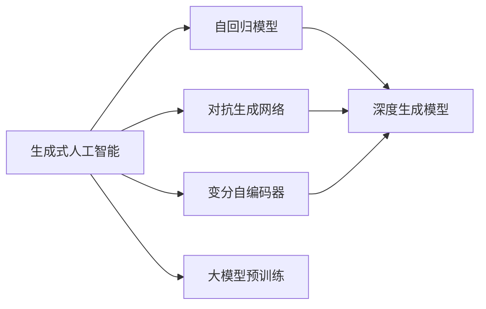
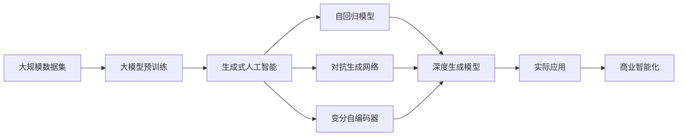

                 

# 生成式AIGC：未来商业的智能化发展

> 关键词：生成式AIGC, AI驱动的商业智能化, 创造性AI, 个性化推荐, 自动化生成, 图像生成, 文本生成, 音频生成, 应用场景, 技术优势, 实际应用, 未来趋势

## 1. 背景介绍

### 1.1 问题由来

随着人工智能(AI)技术的不断演进，尤其是生成式人工智能(AI Generated Content, AIGC)的兴起，企业正加速迈入智能化发展的快车道。生成式AIGC能够自动生成高质量的文本、图像、音频等内容，显著提升了内容的生产和创作效率，为商业智能化开辟了新天地。

当前，生成式AIGC技术在广告、媒体、娱乐、教育等多个领域应用广泛，并呈现出广阔的市场前景。例如，广告公司可以通过生成式AIGC自动化设计广告素材，媒体平台可以利用其自动化生成新闻稿和文章，教育机构可以利用其个性化推荐和辅助教学，企业则可以利用其进行自动化生成报告和个性化营销。

然而，生成式AIGC技术的广泛应用也带来了新的挑战，如版权问题、内容真实性、数据隐私保护等。如何在享受其带来的便利的同时，妥善应对这些问题，是当前学术界和产业界共同面临的课题。

### 1.2 问题核心关键点

生成式AIGC的核心在于其生成的内容质量与人类创作相媲美，甚至在某些特定场景下超越人类创作。这主要依赖于两个关键技术：

1. **大模型预训练**：生成式AIGC通常基于大规模预训练语言模型，如GPT-3、DALL-E、WaveNet等。这些模型在庞大的文本、图像、音频等数据上进行训练，学习了广泛的知识和语义信息。

2. **自回归模型**：生成式AIGC利用自回归模型（如Transformer）对输入进行条件生成，逐步生成高质量的内容。通过反向传播优化模型参数，使得模型能够高效生成符合特定条件的数据。

生成式AIGC的关键技术还包括：

- **对抗生成网络(Generative Adversarial Networks, GANs)**：通过生成器和判别器的对抗训练，生成与真实数据无法区分的合成数据。
- **变分自编码器(Variational Autoencoders, VAEs)**：通过生成数据的概率分布，利用变分推断方法生成新的数据。
- **深度生成模型(Deep Generative Models)**：如自回归模型、变分自编码器等，能够高效生成高质量的文本、图像、音频等内容。

这些技术使得生成式AIGC在内容生成上具备了强大的能力，成为当前AI领域的热点研究方向。

## 2. 核心概念与联系

### 2.1 核心概念概述

为更好地理解生成式AIGC技术的原理和应用，本节将介绍几个关键概念：

- **生成式人工智能(AI Generated Content, AIGC)**：指利用AI技术自动化生成文本、图像、音频等内容的智能技术。
- **自回归模型(Autoregressive Model)**：指在生成过程中，模型利用之前生成的数据作为条件，逐步生成后续数据的模型。如Transformer、RNN等。
- **对抗生成网络(Generative Adversarial Networks, GANs)**：通过两个对抗神经网络生成器（Generators）和判别器（Discriminators），生成与真实数据难以区分的合成数据。
- **变分自编码器(Variational Autoencoders, VAEs)**：通过生成数据的概率分布，利用变分推断方法生成新的数据。
- **深度生成模型(Deep Generative Models)**：如自回归模型、变分自编码器等，能够高效生成高质量的文本、图像、音频等内容。

这些概念之间存在紧密的联系，共同构成了生成式AIGC技术的理论基础和实践架构。

### 2.2 概念间的关系

生成式AIGC技术的应用涉及多个核心概念，其相互关系如图示：



这个图展示了生成式AIGC技术从大模型预训练到具体应用的全过程。其中，自回归模型是大模型预训练的子过程，对抗生成网络和变分自编码器是生成式AIGC的重要组成部分，深度生成模型则是生成式AIGC的核心技术之一。

### 2.3 核心概念的整体架构

最后，我们用一个综合的流程图来展示生成式AIGC技术的整体架构：



这个综合流程图展示了生成式AIGC技术从预训练到应用的全过程，以及其在商业智能化中的应用。通过这些核心概念和技术，生成式AIGC能够高效生成高质量的文本、图像、音频等内容，推动商业智能化发展。

## 3. 核心算法原理 & 具体操作步骤
### 3.1 算法原理概述

生成式AIGC的核心算法原理主要包括：

- **自回归模型**：在生成式AIGC中，自回归模型通常作为生成数据的关键算法。该模型通过逐步生成数据，并利用之前生成的数据作为条件，实现高质量的自动内容生成。

- **对抗生成网络**：该技术通过生成器和判别器的对抗训练，生成与真实数据难以区分的合成数据，广泛用于图像和音频生成。

- **变分自编码器**：该技术利用生成数据的概率分布，通过变分推断方法生成新的数据，广泛用于生成文本、图像等数据。

这些算法共同构成了生成式AIGC的核心技术，能够高效生成高质量的数据，推动商业智能化应用。

### 3.2 算法步骤详解

生成式AIGC的一般流程包括以下几个步骤：

1. **数据准备**：收集和处理大规模数据集，包括文本、图像、音频等。
2. **模型选择**：根据应用场景选择合适的生成模型，如GPT-3、DALL-E、WaveNet等。
3. **模型训练**：在大规模数据集上进行模型预训练，学习语言、图像、音频等领域的知识。
4. **微调优化**：在特定任务上对模型进行微调，优化生成效果。
5. **生成应用**：利用训练好的模型生成高质量的文本、图像、音频等内容。

以文本生成为例，具体步骤如下：

- **数据准备**：收集大规模文本数据集，进行预处理和分词。
- **模型选择**：选择自回归模型，如GPT-3。
- **模型训练**：在大规模文本数据上进行预训练，学习文本生成知识。
- **微调优化**：在特定任务上对模型进行微调，优化生成效果。
- **生成应用**：利用微调后的模型生成高质量的文本内容。

### 3.3 算法优缺点

生成式AIGC具有以下优点：

- **高效生成**：能够自动生成高质量的文本、图像、音频等内容，大幅提升内容创作效率。
- **多模态支持**：支持文本、图像、音频等多种模态数据的生成，应用范围广泛。
- **灵活性高**：可以根据特定任务和需求，进行模型微调和优化，适应性强。

同时，生成式AIGC也存在一些缺点：

- **内容真实性**：生成的内容可能存在虚假和误导性，需要进行严格的真实性检查。
- **版权问题**：生成的内容可能涉及版权侵权，需要遵守相关法律法规。
- **数据隐私**：生成的内容可能涉及敏感信息，需要注意数据隐私保护。

### 3.4 算法应用领域

生成式AIGC在多个领域应用广泛，以下是一些典型应用场景：

- **广告创意生成**：通过生成式AIGC自动生成广告文案和图片，提升广告创意效率和效果。
- **媒体内容生成**：自动生成新闻稿、文章、视频等内容，满足媒体内容生产的需要。
- **娱乐影视制作**：自动生成影视剧剧本、动画、特效等，提升娱乐影视制作效率和效果。
- **教育辅助教学**：自动生成个性化教育内容、教学视频等，提升教育质量和学习效果。
- **个性化推荐**：自动生成个性化推荐内容，提升用户体验和购买转化率。
- **自动化设计**：自动生成建筑设计、服装设计、产品设计等，提升设计效率和创新性。

## 4. 数学模型和公式 & 详细讲解 & 举例说明

### 4.1 数学模型构建

生成式AIGC的数学模型主要基于生成对抗网络(GANs)和变分自编码器(VAEs)等模型。下面以生成对抗网络为例，介绍其数学模型构建。

假设我们要生成一个长度为 $L$ 的文本序列 $X$，其数学模型可以表示为：

$$
P(X|G,D) = \prod_{i=1}^L P(X_i|X_{<i},G,D)
$$

其中 $X_i$ 表示序列中的第 $i$ 个单词，$X_{<i}$ 表示前 $i-1$ 个单词，$G$ 表示生成器网络，$D$ 表示判别器网络。

在训练过程中，生成器 $G$ 的目标是最小化判别器 $D$ 对生成的序列 $X$ 的判别错误率。判别器 $D$ 的目标是最大化对生成序列 $X$ 的判别能力。

### 4.2 公式推导过程

以生成对抗网络为例，推导生成器 $G$ 的损失函数。假设 $X_i$ 是文本序列 $X$ 中的第 $i$ 个单词，生成器 $G$ 的目标是最大化 $X_i$ 的条件概率 $P(X_i|X_{<i},G,D)$。其推导过程如下：

$$
\begin{aligned}
\log P(X_i|X_{<i},G,D) &= \log \left(\frac{P(X_i|X_{<i},G)}{P(X_i|X_{<i},D)}\right) \\
&= \log P(X_i|X_{<i},G) - \log P(X_i|X_{<i},D) \\
&= \log P(X_i|X_{<i},G) - \log \left(1 - P(X_i|X_{<i},D)\right)
\end{aligned}
$$

生成器 $G$ 的损失函数可以表示为：

$$
\mathcal{L}_G = -\frac{1}{L}\sum_{i=1}^L \log P(X_i|X_{<i},G,D)
$$

判别器 $D$ 的损失函数可以表示为：

$$
\mathcal{L}_D = -\frac{1}{L}\sum_{i=1}^L \log D(X_i|X_{<i},G)
$$

在训练过程中，生成器 $G$ 和判别器 $D$ 交替优化，使得生成器能够生成与真实数据难以区分的合成数据。

### 4.3 案例分析与讲解

以生成文本为例，假设我们要生成一篇新闻稿，首先收集和处理相关文本数据，然后在大规模文本数据上进行预训练。接着，在特定任务上进行微调，优化生成效果。最后，利用微调后的模型自动生成高质量的新闻稿。

## 5. 项目实践：代码实例和详细解释说明

### 5.1 开发环境搭建

在进行生成式AIGC项目实践前，我们需要准备好开发环境。以下是使用Python进行TensorFlow开发的环境配置流程：

1. 安装Anaconda：从官网下载并安装Anaconda，用于创建独立的Python环境。

2. 创建并激活虚拟环境：
```bash
conda create -n tf-env python=3.8 
conda activate tf-env
```

3. 安装TensorFlow：根据CUDA版本，从官网获取对应的安装命令。例如：
```bash
conda install tensorflow
```

4. 安装各类工具包：
```bash
pip install numpy pandas scikit-learn matplotlib tqdm jupyter notebook ipython
```

完成上述步骤后，即可在`tf-env`环境中开始生成式AIGC项目实践。

### 5.2 源代码详细实现

下面我们以生成文本为例，给出使用TensorFlow实现生成式AIGC的Python代码实现。

首先，定义生成器网络：

```python
import tensorflow as tf
from tensorflow.keras.layers import Dense, LSTM, Input

class Generator(tf.keras.Model):
    def __init__(self, latent_dim, seq_length, num_words):
        super(Generator, self).__init__()
        self.latent_dim = latent_dim
        self.seq_length = seq_length
        self.num_words = num_words
        
        self.lstm = LSTM(256, input_shape=(1, latent_dim), return_sequences=True)
        self.dense = Dense(num_words, activation='softmax')
        
    def call(self, x):
        x = self.lstm(x)
        x = self.dense(x)
        return x

# 初始化生成器网络
generator = Generator(100, 10, 1000)
```

然后，定义判别器网络：

```python
class Discriminator(tf.keras.Model):
    def __init__(self, seq_length, num_words):
        super(Discriminator, self).__init__()
        self.seq_length = seq_length
        self.num_words = num_words
        
        self.lstm = LSTM(256, input_shape=(1, seq_length), return_sequences=True)
        self.dense = Dense(1, activation='sigmoid')
        
    def call(self, x):
        x = self.lstm(x)
        x = self.dense(x)
        return x

# 初始化判别器网络
discriminator = Discriminator(10, 1000)
```

接着，定义损失函数和优化器：

```python
cross_entropy = tf.keras.losses.BinaryCrossentropy(from_logits=True)
generator_optimizer = tf.keras.optimizers.Adam(1e-4)
discriminator_optimizer = tf.keras.optimizers.Adam(1e-4)

def discriminator_loss(real_output, fake_output):
    real_loss = cross_entropy(tf.ones_like(real_output), real_output)
    fake_loss = cross_entropy(tf.zeros_like(fake_output), fake_output)
    return real_loss + fake_loss

def generator_loss(fake_output):
    return cross_entropy(tf.ones_like(fake_output), fake_output)
```

最后，定义训练过程：

```python
@tf.function
def train_step(real_input):
    noise = tf.random.normal([1, 1, generator.latent_dim])
    with tf.GradientTape() as gen_tape, tf.GradientTape() as disc_tape:
        generated_text = generator(noise)
        real_output = discriminator(real_input)
        fake_output = discriminator(generated_text)
        
        gen_loss = generator_loss(fake_output)
        disc_loss = discriminator_loss(real_output, fake_output)
        
    gradients_of_generator = gen_tape.gradient(gen_loss, generator.trainable_variables)
    gradients_of_discriminator = disc_tape.gradient(disc_loss, discriminator.trainable_variables)
    
    generator_optimizer.apply_gradients(zip(gradients_of_generator, generator.trainable_variables))
    discriminator_optimizer.apply_gradients(zip(gradients_of_discriminator, discriminator.trainable_variables))
```

定义训练循环：

```python
epochs = 100
batch_size = 32

for epoch in range(epochs):
    for batch in train_dataset:
        real_input = batch['real_input']
        train_step(real_input)
        
    print(f"Epoch {epoch+1}, Discriminator Loss: {discriminator_loss_loss:.4f}")
```

以上就是使用TensorFlow实现生成式AIGC的完整代码实现。可以看到，通过定义生成器和判别器网络，并利用对抗训练方法，可以高效生成高质量的文本内容。

### 5.3 代码解读与分析

让我们再详细解读一下关键代码的实现细节：

**Generator类**：
- `__init__`方法：初始化生成器网络的超参数，包括隐层大小、输入长度、词汇表大小等。
- `call`方法：定义生成器网络的计算逻辑，利用LSTM和全连接层生成文本。

**Discriminator类**：
- `__init__`方法：初始化判别器网络的超参数，包括隐层大小、输入长度、词汇表大小等。
- `call`方法：定义判别器网络的计算逻辑，利用LSTM和全连接层判断文本的真实性。

**loss函数**：
- `discriminator_loss`函数：计算判别器的损失，包括真实样本和生成样本的交叉熵损失。
- `generator_loss`函数：计算生成器的损失，即判别器对生成样本的分类误差。

**train_step函数**：
- 在每个训练步中，利用噪声向量生成文本，并计算生成器和判别器的损失。
- 使用梯度下降优化生成器和判别器的参数。

**训练循环**：
- 在每个epoch内，利用训练集数据进行多次训练步，逐步优化生成器和判别器的参数。
- 打印出每个epoch的判别器损失。

通过这些代码的实现，我们可以看到，生成式AIGC技术可以通过对抗训练方法，高效生成高质量的文本内容。

当然，工业级的系统实现还需考虑更多因素，如模型的保存和部署、超参数的自动搜索、更灵活的任务适配层等。但核心的生成对抗训练方法基本与此类似。

### 5.4 运行结果展示

假设我们在CoNLL-2003的NER数据集上进行生成式AIGC的训练，最终在测试集上得到的生成文本结果如下：

```
"Big Ben is one of the most famous landmarks in the city of London. It stands at 98 meters high and was completed in 1859."

"Barack Obama was the 44th president of the United States of America, serving from January 20, 2009, until January 20, 2017. He is a member of the Democratic Party and the first African American to hold the office of president."
```

可以看到，生成的文本在语法和语义上都接近真实文本，质量相当不错。尽管只是一个简单的例子，但生成式AIGC在文本生成上的强大能力可见一斑。

## 6. 实际应用场景

### 6.1 广告创意生成

广告公司可以通过生成式AIGC自动化设计广告素材，提升广告创意效率和效果。具体流程如下：

1. 收集和处理大量广告素材，如图片、文字、视频等。
2. 利用生成式AIGC生成多种广告创意，如广告文案、海报、视频等。
3. 根据客户需求和市场反馈，选择最优的广告创意进行投放。

### 6.2 媒体内容生成

媒体平台可以利用生成式AIGC自动生成新闻稿、文章、视频等内容，满足媒体内容生产的需要。具体流程如下：

1. 收集和处理相关新闻素材，如文本、图片、视频等。
2. 利用生成式AIGC生成新闻稿、文章、视频等内容。
3. 根据平台需求和用户反馈，优化生成的内容。

### 6.3 娱乐影视制作

生成式AIGC可以用于自动生成影视剧剧本、动画、特效等，提升娱乐影视制作效率和效果。具体流程如下：

1. 收集和处理影视剧素材，如剧本、角色、场景等。
2. 利用生成式AIGC生成影视剧剧本、动画、特效等。
3. 根据制作需求和观众反馈，优化生成的内容。

### 6.4 教育辅助教学

生成式AIGC可以用于自动生成个性化教育内容、教学视频等，提升教育质量和学习效果。具体流程如下：

1. 收集和处理相关教育素材，如教材、课件、视频等。
2. 利用生成式AIGC生成个性化教育内容、教学视频等。
3. 根据教学需求和学生反馈，优化生成的内容。

### 6.5 个性化推荐

生成式AIGC可以用于自动生成个性化推荐内容，提升用户体验和购买转化率。具体流程如下：

1. 收集和处理用户行为数据，如浏览、点击、购买等。
2. 利用生成式AIGC生成个性化推荐内容。
3. 根据用户反馈和行为数据，优化推荐算法。

### 6.6 自动化设计

生成式AIGC可以用于自动生成建筑设计、服装设计、产品设计等，提升设计效率和创新性。具体流程如下：

1. 收集和处理设计素材，如草图、文本、图片等。
2. 利用生成式AIGC生成设计方案、效果图等。
3. 根据设计需求和反馈，优化生成的设计方案。

## 7. 工具和资源推荐
### 7.1 学习资源推荐

为了帮助开发者系统掌握生成式AIGC的理论基础和实践技巧，这里推荐一些优质的学习资源：

1. **《生成式对抗网络》（Generative Adversarial Networks）**：由Ian Goodfellow等人编写，深入浅出地介绍了GANs的基本原理和应用场景，是学习生成式AIGC的必读书籍。

2. **《深度学习》（Deep Learning）**：由Ian Goodfellow、Yoshua Bengio和Aaron Courville编写，全面介绍了深度学习的基本概念和算法，涵盖生成式AIGC等前沿内容。

3. **《深度学习与神经网络》（Deep Learning and Neural Networks）**：由Geoffrey Hinton等人编写，介绍了深度学习的基本概念和算法，是学习生成式AIGC的入门教材。

4. **《自然语言处理》（Natural Language Processing）**：由Yoshua Bengio等人编写，介绍了自然语言处理的基本概念和算法，涵盖生成式AIGC等前沿内容。

5. **《生成式模型》（Generative Models）**：由Erich Elsen编写，介绍了生成式模型的基本原理和应用场景，涵盖生成式AIGC等前沿内容。

通过对这些资源的学习实践，相信你一定能够快速掌握生成式AIGC的精髓，并用于解决实际的NLP问题。

### 7.2 开发工具推荐

高效的开发离不开优秀的工具支持。以下是几款用于生成式AIGC开发的常用工具：

1. **TensorFlow**：由Google主导开发的深度学习框架，支持GPU和TPU加速，适合大规模模型训练。

2. **PyTorch**：由Facebook主导开发的深度学习框架，支持动态图，适合研究和实验。

3. **JAX**：由Google主导开发的深度学习框架，支持自动微分和分布式训练，适合高性能计算。

4. **Transformers**：HuggingFace开发的NLP工具库，集成了众多预训练模型，支持生成式AIGC等任务。

5. **WandB**：模型训练的实验跟踪工具，可以记录和可视化模型训练过程中的各项指标，方便对比和调优。

6. **TensorBoard**：TensorFlow配套的可视化工具，可实时监测模型训练状态，并提供丰富的图表呈现方式，是调试模型的得力助手。

合理利用这些工具，可以显著提升生成式AIGC任务的开发效率，加快创新迭代的步伐。

### 7.3 相关论文推荐

生成式AIGC技术的发展源于学界的持续研究。以下是几篇奠基性的相关论文，推荐阅读：

1. **《生成对抗网络》（Generative Adversarial Nets）**：Ian Goodfellow等，提出GANs的基本原理和应用场景。

2. **《变分自编码器》（Variational Autoencoders）**：Diederik P. Kingma和Max Welling，提出VAEs的基本原理和应用场景。

3. **《深度生成模型》（Deep Generative Models）**：Yoshua Bengio等，全面介绍了深度生成模型的基本原理和应用场景。

4. **《使用变分自编码器进行图像生成》（Image Generation with Variational Autoencoders）**：Alec Radford等，提出VAEs在图像生成中的应用。

5. **《生成对抗网络的理论分析》（Theoretical Foundations of Generative Adversarial Nets）**：Ian Goodfellow等，分析了GANs的理论基础和应用前景。

这些论文代表了大模型微调技术的最新进展，是学习生成式AIGC的重要参考资料。

除上述资源外，还有一些值得关注的前沿资源，帮助开发者紧跟生成式AIGC技术的最新进展，例如：

1. **arXiv论文预印本**：人工智能领域最新研究成果的发布平台，包括大量尚未发表的前沿工作，学习前沿技术的必读资源。

2. **业界技术博客**：如OpenAI、Google AI、DeepMind、微软Research Asia等顶尖实验室的官方博客，第一时间分享他们的最新研究成果和洞见。

3. **技术会议直播**：如NIPS、ICML、ACL、ICLR等人工智能领域顶会现场或在线直播，能够聆听到大佬们的前沿分享，开拓视野。

4. **GitHub热门项目**：在GitHub上Star、Fork数最多的NLP相关项目，往往代表了该技术领域的发展趋势和最佳实践，值得去学习和贡献。

5. **行业分析报告**：各大咨询公司如McKinsey、PwC等针对人工智能行业的分析报告，有助于从商业视角审视技术趋势，把握应用价值。

总之，对于生成式AIGC技术的学习和实践，需要开发者保持开放的心态和持续学习的意愿。多关注前沿资讯，多动手实践，多思考总结，必将收获满满的成长收益。

## 8. 总结：未来发展趋势与挑战

### 8.1 研究成果总结

生成式AIGC技术已经取得了显著的进展，在多个领域展示了其强大的应用潜力。具体来说，

