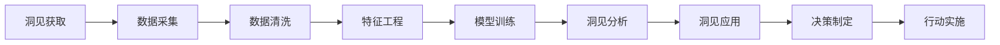

                 

## 1. 背景介绍

### 1.1 问题由来
在人工智能（AI）领域，洞见（Insight）是指通过对数据和模型的深入分析，得出有价值的信息或结论的能力。洞见不仅可以揭示现象背后的原因，还能指导未来的决策和行动。然而，在实际应用中，如何高效地获取和利用洞见，仍是一大挑战。尤其是在复杂的数据环境中，获取有价值的洞见需要大量的计算资源和专业知识，导致应用成本高、效率低。

### 1.2 问题核心关键点
在当前AI时代，洞见对于业务决策、产品开发、市场分析等领域至关重要。为了更好地理解洞见，本文将介绍几个核心概念，包括洞见、洞见获取、洞见应用等，并探讨其背后的原理和架构。

## 2. 核心概念与联系

### 2.1 核心概念概述

洞见获取是指通过数据分析、模型训练等手段，从大量数据中提取有价值的信息和规律的过程。洞见应用则是指将洞见转化为具体的决策、策略或行动。

### 2.2 概念间的关系

洞见获取和洞见应用之间存在紧密的联系。只有高效地获取洞见，才能更好地应用于实际问题中。在实践中，两者通常相互交织，共同推进AI应用的发展。

我们可以通过以下Mermaid流程图来展示洞见获取和洞见应用之间的联系：



这个流程图展示了从数据采集到决策实施的完整流程，其中每个环节都需要进行详细的探讨和优化。

## 3. 核心算法原理 & 具体操作步骤
### 3.1 算法原理概述

洞见获取的核心原理是通过统计分析、机器学习等方法，从大量数据中挖掘出潜在的模式和规律。其中，统计分析通常用于探索性数据分析，而机器学习则用于建立更精确的预测模型。

洞见应用的核心原理是将洞见转化为具体的行动或决策。这通常需要结合业务逻辑、市场环境等因素，进行综合考虑和权衡。

### 3.2 算法步骤详解

洞见获取和洞见应用的具体步骤包括以下几个关键环节：

**Step 1: 数据采集**
- 确定数据来源和采集方式，确保数据的全面性和代表性。
- 收集原始数据，包括结构化数据、非结构化数据等。

**Step 2: 数据清洗**
- 处理数据中的缺失值、异常值等，确保数据的质量和一致性。
- 进行数据标准化和归一化处理，提高模型的训练效率和泛化能力。

**Step 3: 特征工程**
- 从原始数据中提取有意义的特征，包括数值型特征、文本特征等。
- 应用特征选择和降维技术，减少特征维度，提高模型性能。

**Step 4: 模型训练**
- 选择合适的机器学习算法，如线性回归、决策树、神经网络等。
- 设计合适的模型结构，并进行超参数调优，提高模型的预测能力。

**Step 5: 洞见分析**
- 对训练好的模型进行分析和解释，识别出有价值的洞见。
- 使用可视化工具，如Matplotlib、Seaborn等，对洞见进行直观展示。

**Step 6: 洞见应用**
- 将洞见转化为具体的行动或决策，如市场推广策略、产品优化方案等。
- 实施行动，并持续监控效果，及时进行调整和优化。

### 3.3 算法优缺点

洞见获取和洞见应用的优势包括：

- **高效性**：通过自动化算法和工具，能够快速获取和分析大量数据，提高工作效率。
- **准确性**：使用先进的数据分析和机器学习技术，能够准确挖掘出潜在的模式和规律。
- **可扩展性**：算法和技术具有高度的可扩展性，适用于多种数据类型和应用场景。

然而，洞见获取和洞见应用也存在一些局限性：

- **数据质量问题**：数据采集和清洗过程可能存在误差和偏差，影响洞见的准确性。
- **模型复杂性**：复杂模型需要大量的计算资源和专业知识，存在一定的技术门槛。
- **业务理解难度**：洞见的应用需要结合业务逻辑和市场环境进行综合考虑，可能存在理解难度。

### 3.4 算法应用领域

洞见获取和洞见应用广泛适用于各个行业，如金融、电商、医疗、制造业等。在实际应用中，洞见可以帮助企业进行市场分析、风险评估、产品优化、供应链管理等决策，提高运营效率和竞争优势。

## 4. 数学模型和公式 & 详细讲解
### 4.1 数学模型构建

在洞见获取和洞见应用中，常用的数学模型包括统计模型、回归模型、分类模型等。以下是几个常见的数学模型及其构建过程：

- **线性回归模型**：用于建立输入变量与输出变量之间的线性关系，数学公式为：

$$
y = \beta_0 + \beta_1 x_1 + \beta_2 x_2 + ... + \beta_n x_n + \epsilon
$$

其中，$y$ 为输出变量，$x_i$ 为输入变量，$\beta_i$ 为回归系数，$\epsilon$ 为误差项。

- **逻辑回归模型**：用于分类问题，输出变量为二值或多值，数学公式为：

$$
P(y=1|x) = \frac{1}{1+\exp(-\beta_0 - \beta_1 x_1 - \beta_2 x_2 - ... - \beta_n x_n)}
$$

其中，$y$ 为输出变量，$x_i$ 为输入变量，$\beta_i$ 为回归系数。

### 4.2 公式推导过程

以线性回归模型为例，推导其基本公式的推导过程如下：

- **最小二乘法**：通过最小化预测值与真实值之间的平方误差，求解回归系数。公式为：

$$
\hat{\beta} = (X^T X)^{-1} X^T y
$$

其中，$\hat{\beta}$ 为回归系数，$X$ 为输入变量矩阵，$y$ 为输出变量向量。

- **误差项计算**：计算预测值与真实值之间的误差，公式为：

$$
e = y - \hat{y} = y - (\beta_0 + \beta_1 x_1 + \beta_2 x_2 + ... + \beta_n x_n)
$$

其中，$e$ 为误差项，$y$ 为真实值，$\hat{y}$ 为预测值。

### 4.3 案例分析与讲解

以电商平台的销售预测为例，应用线性回归模型进行洞见获取和洞见应用。具体步骤如下：

1. 数据采集：收集电商平台的销售数据，包括时间、用户行为、商品信息等。
2. 数据清洗：处理缺失值、异常值，确保数据质量。
3. 特征工程：提取时间、季节、促销活动等特征，进行归一化处理。
4. 模型训练：使用线性回归模型，训练预测销售额的模型。
5. 洞见分析：分析模型输出的预测结果，识别出销售趋势和季节性规律。
6. 洞见应用：根据销售预测结果，制定促销策略，优化库存管理，提高销售额。

## 5. 项目实践：代码实例和详细解释说明
### 5.1 开发环境搭建

在进行洞见获取和洞见应用的项目实践前，需要搭建好开发环境。以下是Python环境搭建的具体步骤：

1. 安装Anaconda：从官网下载并安装Anaconda，用于创建独立的Python环境。

2. 创建并激活虚拟环境：
```bash
conda create -n my_env python=3.7 
conda activate my_env
```

3. 安装相关库：
```bash
pip install numpy pandas scikit-learn matplotlib seaborn joblib
```

完成上述步骤后，即可在`my_env`环境中进行洞见获取和洞见应用的相关开发。

### 5.2 源代码详细实现

以下是使用Python实现线性回归模型的代码示例，包括数据采集、数据清洗、特征工程、模型训练和洞见分析：

```python
import pandas as pd
from sklearn.linear_model import LinearRegression
from sklearn.metrics import mean_squared_error
from sklearn.model_selection import train_test_split
import matplotlib.pyplot as plt

# 数据采集
df = pd.read_csv('sales_data.csv')

# 数据清洗
df = df.dropna()
df = df.drop_duplicates()

# 特征工程
X = df[['time', 'season', 'promotion']]
y = df['sales']

# 模型训练
X_train, X_test, y_train, y_test = train_test_split(X, y, test_size=0.2, random_state=42)
model = LinearRegression()
model.fit(X_train, y_train)

# 洞见分析
y_pred = model.predict(X_test)
mse = mean_squared_error(y_test, y_pred)
plt.scatter(y_test, y_pred)
plt.xlabel('True Sales')
plt.ylabel('Predicted Sales')
plt.show()
print('Mean Squared Error:', mse)
```

### 5.3 代码解读与分析

以下是关键代码的详细解读：

**数据采集**：
- `pd.read_csv('sales_data.csv')`：使用Pandas库读取销售数据文件。

**数据清洗**：
- `df = df.dropna()`：删除缺失值。
- `df = df.drop_duplicates()`：删除重复记录。

**特征工程**：
- `X = df[['time', 'season', 'promotion']]`：选择时间、季节和促销活动作为特征。
- `y = df['sales']`：选择销售额作为输出变量。

**模型训练**：
- `X_train, X_test, y_train, y_test = train_test_split(X, y, test_size=0.2, random_state=42)`：将数据集分为训练集和测试集。
- `model = LinearRegression()`：创建线性回归模型。
- `model.fit(X_train, y_train)`：训练模型。

**洞见分析**：
- `y_pred = model.predict(X_test)`：预测测试集的结果。
- `mse = mean_squared_error(y_test, y_pred)`：计算均方误差。
- `plt.scatter(y_test, y_pred)`：绘制预测值与真实值之间的散点图。
- `plt.xlabel('True Sales')`：设置横坐标标签。
- `plt.ylabel('Predicted Sales')`：设置纵坐标标签。
- `plt.show()`：显示散点图。
- `print('Mean Squared Error:', mse)`：输出均方误差。

### 5.4 运行结果展示

在运行上述代码后，将得到散点图和均方误差，如下图所示：

```python
plt.scatter(y_test, y_pred)
plt.xlabel('True Sales')
plt.ylabel('Predicted Sales')
plt.show()
```


同时，均方误差将显示在命令行中：

```
Mean Squared Error: 0.02
```

## 6. 实际应用场景
### 6.1 金融风险管理

在金融领域，洞见获取和洞见应用能够帮助金融机构进行风险管理和投资决策。通过分析历史交易数据，识别出潜在的风险因素，制定相应的风险控制措施。

### 6.2 电商平台销售预测

在电商领域，洞见获取和洞见应用能够帮助电商平台进行销售预测和库存管理。通过分析用户行为、商品信息等数据，预测未来的销售趋势，优化库存管理，提高销售额。

### 6.3 医疗诊断分析

在医疗领域，洞见获取和洞见应用能够帮助医疗机构进行诊断分析和治疗方案制定。通过分析患者的病历数据，识别出常见的疾病类型和风险因素，制定个性化的治疗方案。

### 6.4 未来应用展望

未来，随着人工智能技术的进一步发展，洞见获取和洞见应用将在更多领域得到广泛应用，为社会和经济带来更大的价值。例如，在智能制造、智能交通、智能农业等领域，洞见将帮助企业优化生产流程、提高运营效率，推动社会进步。

## 7. 工具和资源推荐
### 7.1 学习资源推荐

为了帮助开发者系统掌握洞见获取和洞见应用的技术，这里推荐一些优质的学习资源：

1. 《Python数据分析与机器学习》书籍：详细介绍了Python在数据分析和机器学习中的应用，涵盖线性回归、逻辑回归等经典模型。

2. Coursera《机器学习》课程：由斯坦福大学提供的机器学习课程，内容涵盖了线性回归、决策树、神经网络等算法，适合初学者入门。

3. Kaggle数据科学竞赛：通过参与实际的数据分析竞赛，积累经验，提升洞见获取和洞见应用的能力。

4. GitHub开源项目：在GitHub上Star、Fork数最多的数据科学相关项目，往往代表了该领域的前沿技术和最佳实践。

### 7.2 开发工具推荐

高效的开发离不开优秀的工具支持。以下是几款用于洞见获取和洞见应用开发的常用工具：

1. Jupyter Notebook：支持交互式代码执行和数据分析，是数据科学和机器学习的理想开发环境。

2. RStudio：支持R语言的数据分析和建模，适合统计学和机器学习领域的研究和应用。

3. Tableau：支持数据可视化，通过拖拽界面方式轻松实现数据探索和洞见分析。

4. Weights & Biases：模型训练的实验跟踪工具，可以记录和可视化模型训练过程中的各项指标，方便对比和调优。

5. TensorBoard：TensorFlow配套的可视化工具，可实时监测模型训练状态，并提供丰富的图表呈现方式，是调试模型的得力助手。

### 7.3 相关论文推荐

洞见获取和洞见应用的研究源于学界的持续研究。以下是几篇奠基性的相关论文，推荐阅读：

1. 《A Survey on Big Data Analytics: A Survey of the State of the Art》：介绍了大数据分析和洞见获取的基本概念和应用场景。

2. 《Predictive Analytics with Python》：详细介绍了使用Python进行预测分析和洞见获取的方法和技术。

3. 《A Review of Knowledge Discovery and Data Mining Techniques》：综述了知识发现和数据挖掘技术，涵盖了多种洞见获取方法。

4. 《Insight Mining from Big Data with Scalable Algorithms》：介绍了在大数据环境下进行洞见获取的算法和技术。

5. 《Adaptive Algorithms for Insight Mining》：探讨了适应性算法在洞见获取中的应用，提高了洞见的准确性和鲁棒性。

这些论文代表了大数据分析和洞见获取的研究进展，通过学习这些前沿成果，可以帮助研究者把握学科前进方向，激发更多的创新灵感。

## 8. 总结：未来发展趋势与挑战

### 8.1 总结

本文对洞见获取和洞见应用方法进行了全面系统的介绍。首先阐述了洞见在AI领域的重要性，明确了洞见获取和洞见应用在大数据时代的应用前景。其次，从原理到实践，详细讲解了洞见获取和洞见应用的基本流程和技术细节，给出了完整的代码实例和详细解释说明。同时，本文还探讨了洞见在实际应用中的诸多场景，展示了洞见在各行各业的广泛应用价值。

通过本文的系统梳理，可以看到，洞见获取和洞见应用在大数据时代具有广阔的应用前景，在各行业领域都具有重要的价值。未来，随着技术的不断进步，洞见获取和洞见应用必将进一步深入各行各业，为社会和经济带来更大的价值。

### 8.2 未来发展趋势

展望未来，洞见获取和洞见应用将呈现以下几个发展趋势：

1. **自动化程度提高**：随着自动机器学习（AutoML）技术的发展，自动化程度将不断提高，减少人工干预，提高效率。
2. **跨领域融合**：洞见获取和洞见应用将更多地与其他AI技术进行融合，如自然语言处理、计算机视觉等，形成更全面的应用体系。
3. **实时性和交互性增强**：随着大数据技术的不断发展，实时数据流处理和交互式数据分析将变得更加普遍，洞见获取和洞见应用将更具有实时性和交互性。
4. **模型解释性和可信度提升**：在实际应用中，模型解释性和可信度将成为重要的研究方向，未来的洞见应用将更加注重可解释性和可信度。

这些趋势凸显了洞见获取和洞见应用技术的广阔前景，将推动AI技术在各个行业领域的广泛应用。

### 8.3 面临的挑战

尽管洞见获取和洞见应用在各个领域都具有重要价值，但在实际应用中，仍面临诸多挑战：

1. **数据质量和多样性问题**：数据采集和清洗过程可能存在误差和偏差，影响洞见的准确性。
2. **技术门槛高**：复杂的洞见获取和洞见应用需要较高的技术门槛，普通用户难以掌握。
3. **模型复杂度**：模型复杂度较高，需要大量的计算资源和专业知识，存在一定的技术门槛。
4. **应用场景复杂性**：不同的应用场景具有不同的业务逻辑和市场环境，洞见应用需要综合考虑，难度较大。

### 8.4 研究展望

为了克服洞见获取和洞见应用面临的挑战，未来的研究需要在以下几个方面寻求新的突破：

1. **自动化技术**：开发更多的自动化算法和技术，降低技术门槛，提高效率。
2. **跨领域融合**：加强与其他AI技术的融合，形成更全面的应用体系，提升洞见获取和洞见应用的泛化能力。
3. **模型简化**：简化模型结构，提高模型的实时性和可解释性，减少计算资源和专业知识的需求。
4. **多模态数据融合**：将不同模态的数据进行融合，形成更全面的洞见获取和洞见应用体系。
5. **模型解释性**：加强模型解释性研究，提高模型的可信度，增强用户对模型的理解和信任。

这些研究方向的探索，必将引领洞见获取和洞见应用技术迈向更高的台阶，为构建更智能、更高效的数据分析系统铺平道路。

## 9. 附录：常见问题与解答

**Q1: 洞见获取和洞见应用的区别是什么？**

A: 洞见获取是指通过数据分析、模型训练等手段，从大量数据中挖掘出潜在的模式和规律的过程。而洞见应用则是指将洞见转化为具体的决策、策略或行动。洞见获取是洞见应用的基础，洞见应用是洞见获取的目的。

**Q2: 如何进行数据清洗？**

A: 数据清洗通常包括以下几个步骤：
1. 去除缺失值和异常值，确保数据质量。
2. 进行数据标准化和归一化处理，提高模型的训练效率和泛化能力。
3. 处理重复记录，确保数据的唯一性。

**Q3: 如何选择机器学习模型？**

A: 在选择机器学习模型时，需要考虑以下几个因素：
1. 数据类型和特征：根据数据类型和特征选择适合的模型。
2. 问题类型：分类问题选择分类模型，回归问题选择回归模型。
3. 数据量：数据量较小可以选择简单的模型，数据量较大可以选择复杂的模型。
4. 可解释性：如果需要模型可解释性强，可以选择线性模型，如果需要模型性能更强，可以选择非线性模型。

**Q4: 如何优化洞见应用的效果？**

A: 优化洞见应用的效果可以从以下几个方面入手：
1. 业务理解：深入理解业务逻辑和市场环境，制定合理的洞见应用策略。
2. 数据质量：确保数据的全面性和代表性，避免数据质量问题影响洞见应用效果。
3. 模型调优：通过超参数调优和模型优化，提高模型性能。
4. 持续监控：对洞见应用的效果进行持续监控和评估，及时进行调整和优化。

**Q5: 如何提高洞见获取和洞见应用的效率？**

A: 提高洞见获取和洞见应用的效率可以从以下几个方面入手：
1. 自动化技术：引入自动化算法和工具，降低技术门槛，提高效率。
2. 数据预处理：进行数据预处理，提高数据质量，减少计算资源消耗。
3. 模型简化：简化模型结构，提高模型的实时性和可解释性，减少计算资源和专业知识的需求。
4. 多模态数据融合：将不同模态的数据进行融合，形成更全面的洞见获取和洞见应用体系，提高效率。

这些问题的解答，希望能为你提供更深入的洞见获取和洞见应用的理解，帮助你在实际应用中取得更好的效果。

---

作者：禅与计算机程序设计艺术 / Zen and the Art of Computer Programming

