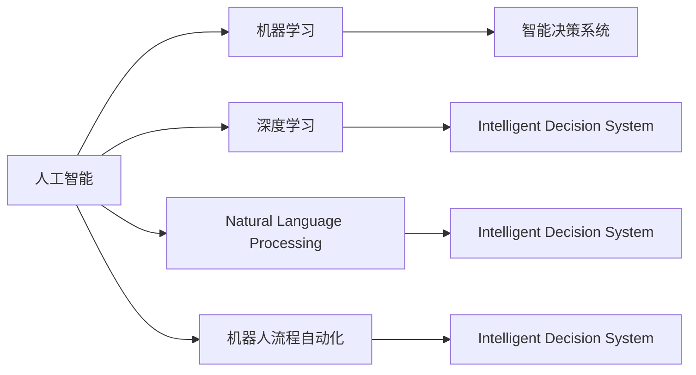

                 

# 生产力革命：AI带来的新机遇

## 1. 背景介绍

### 1.1 问题由来
随着人工智能(AI)技术的迅猛发展，AI已经在各行各业中广泛应用，并在一些领域取得显著成果。然而，AI技术的普及并不意味着其生产力效能得到了全面释放。AI应用场景的复杂性，使得它在一些传统行业中的落地仍然面临许多挑战。为了应对这些挑战，人们提出了“生产力革命”的概念，旨在通过AI技术的全面应用，彻底改变各行各业的运营模式，提升生产力水平。

### 1.2 问题核心关键点
生产力革命的核心在于AI技术的全面应用，通过提高决策效率、降低运营成本、增强客户体验等手段，提升企业竞争力和经济效益。具体来说，以下几个关键点需重点关注：

- **决策效率的提升**：AI可以通过大量数据分析，辅助企业做出更精准的决策，加快决策速度。
- **运营成本的降低**：AI技术可以自动化处理大量重复性工作，减少人力投入，降低运营成本。
- **客户体验的改善**：AI可以提供更个性化的服务，增强用户体验，提高客户满意度和忠诚度。
- **产品质量的提升**：AI可以通过模式识别、异常检测等手段，提升产品和服务质量，满足客户需求。
- **数据驱动的管理**：AI可以全面分析数据，发现隐藏的管理洞见，辅助企业进行更有效的管理。

### 1.3 问题研究意义
研究生产力革命的意义在于，AI技术的全面应用可以显著提升企业的运营效率，降低成本，提高客户体验，进而带来更大规模的经济增长。具体来说，AI的全面应用可以：

- **降低运营成本**：自动化流程和机器人操作可以取代人力，降低人工成本。
- **提升产品质量**：AI在质量控制和检测中的应用，可以提升产品的一致性和质量。
- **增强决策支持**：通过大数据分析，AI可以提供深入的业务洞察，辅助决策。
- **改善客户体验**：AI可以提供个性化的服务，提升客户满意度和忠诚度。
- **加速技术创新**：AI技术的应用可以加速新产品和新服务的开发，推动行业进步。

## 2. 核心概念与联系

### 2.1 核心概念概述

为了更好地理解生产力革命中AI技术的应用，本节将介绍几个关键概念及其相互联系：

- **人工智能(AI)**：指能够模拟人类智能的计算机程序，包括学习、推理、感知、自然语言处理等能力。
- **机器学习(ML)**：一种数据驱动的技术，通过训练模型以预测未来结果。
- **深度学习(Deep Learning)**：机器学习的一个分支，通过神经网络进行复杂非线性建模。
- **自然语言处理(NLP)**：一种AI技术，使计算机能够理解、解释和生成人类语言。
- **机器人流程自动化(RPA)**：通过软件工具模拟人类操作，自动化执行重复性工作。
- **智能决策系统(IDS)**：一种基于AI技术的决策支持系统，辅助管理层进行决策。
- **工业物联网(IIoT)**：通过传感器、智能设备等，实现对工业设备的实时监控和自动化控制。

这些概念构成了AI技术在生产力革命中的应用基础，它们之间的相互联系如下图所示：



### 2.2 概念间的关系

这些核心概念之间的联系可以从不同的角度进行理解：

- **AI与ML的关系**：ML是AI的一个子集，旨在通过数据驱动的方式，使机器具备学习能力。
- **DL与ML的关系**：DL是ML的一个分支，通过深度神经网络进行复杂模式识别和预测。
- **NLP在AI中的应用**：NLP是AI的一个关键领域，通过理解语言，使机器能够与人类自然交互。
- **RPA与AI的关系**：RPA利用AI技术，实现业务流程的自动化。
- **IDS与AI的关系**：IDS利用AI进行数据驱动的决策支持。
- **IIoT与AI的关系**：IIoT利用AI进行设备监控和控制。

这些联系表明，AI技术在生产力革命中的应用是多层面的，不同领域的AI技术可以相互补充，共同提升生产力水平。

## 3. 核心算法原理 & 具体操作步骤

### 3.1 算法原理概述

AI技术在生产力革命中的应用，主要依赖于以下核心算法原理：

- **监督学习(Supervised Learning)**：利用标注数据训练模型，使其能够预测未来结果。
- **无监督学习(Unsupervised Learning)**：从大量未标注数据中发现隐藏的模式。
- **半监督学习(Semi-supervised Learning)**：结合少量标注数据和大量未标注数据，提高模型性能。
- **强化学习(Reinforcement Learning)**：通过试错的方式，学习最优策略以实现特定目标。
- **迁移学习(Transfer Learning)**：将一个领域学到的知识迁移到另一个领域。
- **多任务学习(Multi-task Learning)**：同时训练多个相关任务，共享特征表示。
- **自监督学习(Self-supervised Learning)**：利用预训练技术，通过数据自身的内在关系进行学习。

这些算法原理在大规模生产环境中得到了广泛应用，提升了企业的运营效率和产品质量。

### 3.2 算法步骤详解

以下是一个基于监督学习的AI应用示例，详细说明其步骤：

1. **数据收集**：收集生产数据，例如传感器监测的数据、销售记录等。
2. **数据预处理**：清洗数据，处理缺失值，进行特征工程。
3. **模型训练**：选择适当的模型，利用标注数据进行训练。
4. **模型评估**：使用验证数据集对模型进行评估，调整超参数。
5. **模型部署**：将模型部署到生产环境中，进行实时预测。
6. **反馈机制**：收集实时数据反馈，不断调整模型参数，提升模型性能。

### 3.3 算法优缺点

基于监督学习的AI应用具有以下优点：

- **准确性高**：使用标注数据训练模型，模型性能可靠。
- **泛化能力强**：训练数据量大，模型泛化能力强。
- **可解释性强**：通过理解模型参数，可以进行逻辑推理和解释。

然而，基于监督学习的AI应用也存在以下缺点：

- **数据依赖性强**：需要大量的标注数据，标注成本高。
- **模型复杂度高**：模型结构复杂，维护成本高。
- **模型更新困难**：模型需要定期更新，重新训练，工作量大。

### 3.4 算法应用领域

AI技术在生产力革命中的应用领域非常广泛，包括但不限于：

- **制造业**：通过智能监控和预测维护，降低设备停机时间，提高生产效率。
- **医疗健康**：利用AI进行疾病诊断和个性化治疗，提高医疗服务质量。
- **金融服务**：通过智能投顾和风险控制，提升金融服务效率和安全性。
- **零售业**：利用AI进行客户行为分析，提供个性化推荐，提高销售额。
- **物流运输**：通过智能调度和路径规划，降低运输成本，提升配送效率。
- **能源行业**：利用AI进行能源需求预测和优化调度，降低能源消耗。
- **农业**：通过智能监测和数据分析，提高农作物产量和质量。

## 4. 数学模型和公式 & 详细讲解 & 举例说明

### 4.1 数学模型构建

在AI应用中，常用的数学模型包括线性回归、逻辑回归、决策树、支持向量机等。以线性回归模型为例，其数学模型构建如下：

$$
y = \beta_0 + \beta_1 x_1 + \beta_2 x_2 + \ldots + \beta_n x_n + \epsilon
$$

其中，$y$表示目标变量，$x_i$表示输入变量，$\beta_i$表示模型参数，$\epsilon$表示误差项。

### 4.2 公式推导过程

线性回归模型的最小二乘法推导如下：

1. **最小化误差**：最小化残差平方和（RSS）。
2. **求解参数**：通过求偏导数，得到参数$\beta_i$的求解公式。

### 4.3 案例分析与讲解

以智能推荐系统为例，通过用户行为数据训练模型，预测用户对商品的兴趣程度。模型结构包括用户特征、商品特征和交互行为，采用线性回归或逻辑回归进行训练。训练数据通过交叉验证和网格搜索优化超参数，模型预测结果与用户实际购买行为对比，不断迭代优化。

## 5. 项目实践：代码实例和详细解释说明

### 5.1 开发环境搭建

项目实践通常需要搭建适合的环境，如Python环境、机器学习框架、数据库等。以下是一个典型的开发环境搭建流程：

1. **安装Python**：安装最新版本的Python，推荐使用Anaconda进行环境管理。
2. **安装机器学习框架**：安装常用的机器学习框架，如Scikit-Learn、TensorFlow等。
3. **安装数据库**：安装数据库管理系统，如MySQL、PostgreSQL等。
4. **安装工具包**：安装常用的工具包，如NumPy、Pandas等。
5. **安装可视化工具**：安装可视化工具，如Matplotlib、Seaborn等。

### 5.2 源代码详细实现

以下是一个基于线性回归模型的推荐系统代码示例：

```python
import pandas as pd
from sklearn.linear_model import LinearRegression

# 加载数据
data = pd.read_csv('recommendation_data.csv')

# 分割数据集
X_train, X_test, y_train, y_test = train_test_split(X, y, test_size=0.2)

# 训练模型
model = LinearRegression()
model.fit(X_train, y_train)

# 评估模型
score = model.score(X_test, y_test)
print('模型评估得分：', score)

# 预测结果
y_pred = model.predict(X_test)
print('预测结果：', y_pred)
```

### 5.3 代码解读与分析

上述代码实现了基于线性回归模型的推荐系统。具体步骤如下：

1. **数据加载**：使用Pandas加载推荐数据集。
2. **数据分割**：使用train_test_split分割数据集，分为训练集和测试集。
3. **模型训练**：使用LinearRegression训练模型，拟合训练数据。
4. **模型评估**：使用测试集评估模型性能，输出模型评估得分。
5. **预测结果**：使用训练好的模型对测试集进行预测，输出预测结果。

### 5.4 运行结果展示

假设模型训练过程中，评估得分达到了0.8，表示模型预测准确率较高。通过预测结果，可以为每个用户推荐最相关的商品，提升用户购买意愿和满意度。

## 6. 实际应用场景

### 6.1 智能制造

在制造业中，AI技术可以用于智能制造，通过智能监控和预测维护，提高生产效率和设备利用率。具体应用场景包括：

- **设备监控**：利用传感器监测设备运行状态，提前预警故障。
- **预测维护**：通过数据分析，预测设备故障，进行预防性维护。
- **质量控制**：利用AI进行异常检测，提升产品质量。
- **生产调度**：通过智能调度，优化生产流程，提高生产效率。

### 6.2 智慧医疗

在医疗健康领域，AI技术可以用于疾病诊断、个性化治疗和医疗管理。具体应用场景包括：

- **疾病诊断**：利用深度学习进行医学影像分析，辅助医生诊断。
- **个性化治疗**：通过数据分析，制定个性化治疗方案。
- **医疗管理**：利用AI进行患者管理，提升医院运营效率。
- **药物研发**：利用AI进行药物筛选和设计，加速新药开发。

### 6.3 智能客服

在金融服务领域，AI技术可以用于智能客服，通过智能机器人进行客户咨询和问题解答。具体应用场景包括：

- **客户咨询**：利用自然语言处理技术，理解客户问题，提供准确解答。
- **自动化服务**：通过机器人流程自动化，提升服务效率和质量。
- **客户管理**：利用AI进行客户分析，提升客户满意度和忠诚度。
- **风险控制**：通过数据分析，预测客户风险，进行风险管理。

## 7. 工具和资源推荐

### 7.1 学习资源推荐

以下是一些推荐的AI学习资源：

1. **Coursera**：提供大量AI和机器学习的在线课程，涵盖从入门到高级内容。
2. **Udacity**：提供专业化的AI和机器学习项目，适合实战学习。
3. **Kaggle**：提供大量AI竞赛和数据集，适合动手实践。
4. **Google AI**：提供大量AI和机器学习资源，包括论文、博客和教程。
5. **DeepLearning.AI**：提供AI和深度学习课程，适合全面学习。

### 7.2 开发工具推荐

以下是一些推荐的AI开发工具：

1. **Jupyter Notebook**：一个开源的Web应用程序，支持多语言的编程和数据可视化。
2. **PyCharm**：一个流行的Python IDE，支持大量Python库和框架。
3. **Visual Studio Code**：一个轻量级的IDE，支持Python和Jupyter Notebook。
4. **TensorFlow**：一个流行的开源深度学习框架，支持分布式训练和模型部署。
5. **PyTorch**：一个开源的深度学习框架，支持动态计算图和GPU加速。

### 7.3 相关论文推荐

以下是一些推荐的AI相关论文：

1. **TensorFlow白皮书**：介绍TensorFlow的设计理念和核心技术。
2. **深度学习基础**：介绍深度学习的原理和算法。
3. **机器学习实战**：介绍机器学习的应用案例和实践方法。
4. **深度学习架构**：介绍深度学习的架构设计和优化策略。
5. **神经网络理论**：介绍神经网络的基本理论和应用。

## 8. 总结：未来发展趋势与挑战

### 8.1 研究成果总结

生产力革命的提出，推动了AI技术在各行各业的全面应用，显著提升了企业的运营效率和产品质量。主要研究成果包括：

- **机器学习算法的优化**：通过算法优化，提高了模型的训练速度和预测精度。
- **深度学习模型的应用**：通过深度学习模型的应用，提升了复杂问题的解决能力。
- **自然语言处理技术的发展**：通过NLP技术的发展，提高了人机交互的效率和质量。
- **机器人流程自动化的普及**：通过RPA的普及，减少了人工操作，提高了工作效率。
- **智能决策系统的应用**：通过智能决策系统的应用，提高了企业的决策能力和运营效率。
- **工业物联网的部署**：通过IIoT的部署，提升了工业设备的监控和控制能力。

### 8.2 未来发展趋势

未来AI技术的发展趋势包括：

- **更强的计算能力**：随着硬件设备的进步，AI计算能力将进一步提升。
- **更高的模型精度**：通过算法优化和数据增强，AI模型的精度将进一步提高。
- **更广泛的应用场景**：AI技术将在更多领域得到应用，推动生产力革命的深入发展。
- **更高效的数据处理**：通过数据处理技术的发展，AI模型将能够处理更大规模的数据。
- **更智能的决策支持**：通过智能决策系统的提升，企业决策能力将进一步增强。
- **更安全的AI应用**：通过AI应用的安全保障措施，确保企业数据和客户隐私的安全。

### 8.3 面临的挑战

尽管AI技术在生产力革命中取得了显著进展，但仍面临以下挑战：

- **数据隐私和安全**：AI应用需要大量数据，数据隐私和安全问题亟待解决。
- **模型的可解释性**：AI模型的决策过程缺乏可解释性，难以满足某些行业的监管需求。
- **技术的普及度**：AI技术在企业中的应用普及度不高，需要进一步推广和普及。
- **人才的短缺**：AI技术人才短缺，难以满足企业对AI技术的需求。
- **技术的稳定性和可靠性**：AI技术在应用过程中可能存在稳定性问题，需要不断优化和迭代。

### 8.4 研究展望

未来AI技术的研究展望包括：

- **AI与物联网的融合**：将AI技术与物联网结合，提升工业设备的智能化水平。
- **AI与区块链的融合**：利用区块链技术保障AI应用的数据安全。
- **AI与边缘计算的融合**：通过边缘计算技术，提升AI模型的实时性。
- **AI与机器人的融合**：通过机器人技术，提升AI应用的自动化水平。
- **AI与量子计算的融合**：利用量子计算技术，提升AI计算能力。
- **AI与5G技术的融合**：利用5G技术，提升AI应用的实时性和可靠性。

## 9. 附录：常见问题与解答

### Q1：什么是AI与生产力革命？

A: AI与生产力革命是指通过人工智能技术全面应用于生产过程，提升企业的运营效率、降低成本、改善客户体验，从而推动经济增长的过程。

### Q2：AI技术在生产中如何提升效率？

A: AI技术可以通过自动化流程、优化生产调度、提高设备利用率、智能监控和预测维护等方式，显著提升生产效率。

### Q3：AI技术的未来发展趋势是什么？

A: AI技术的未来发展趋势包括更强的计算能力、更高的模型精度、更广泛的应用场景、更高效的数据处理、更智能的决策支持、更安全的AI应用等方面。

### Q4：AI技术面临的挑战有哪些？

A: AI技术面临的挑战包括数据隐私和安全问题、模型的可解释性、技术的普及度、人才的短缺、技术的稳定性和可靠性等。

### Q5：AI技术在哪些行业有应用前景？

A: AI技术在制造业、医疗健康、金融服务、零售业、物流运输、能源行业、农业等多个行业都有应用前景。

---

作者：禅与计算机程序设计艺术 / Zen and the Art of Computer Programming

