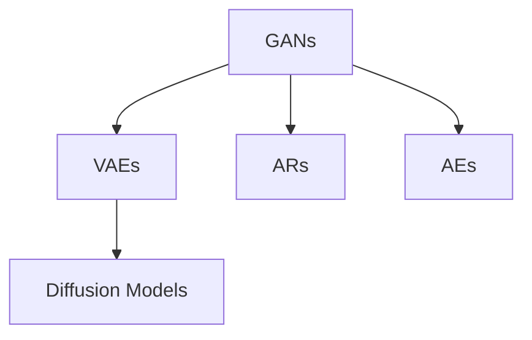
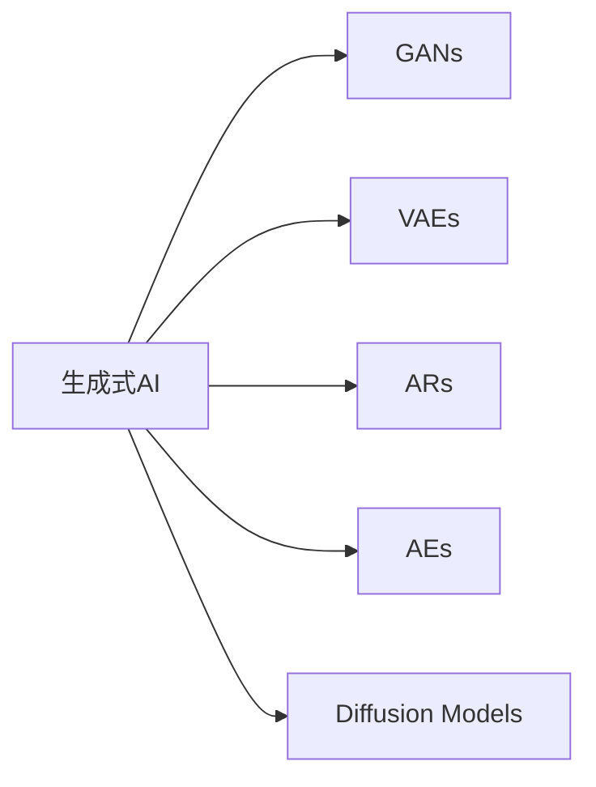
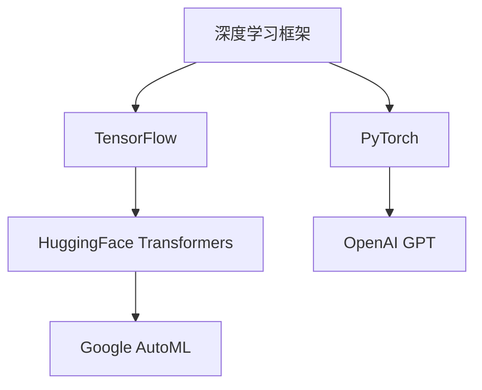
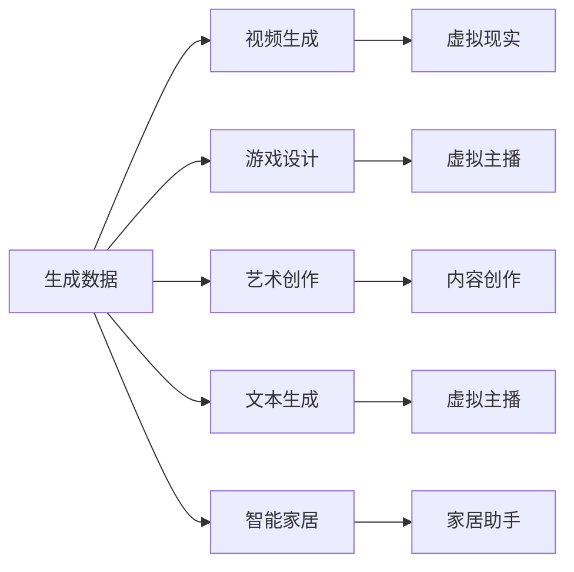
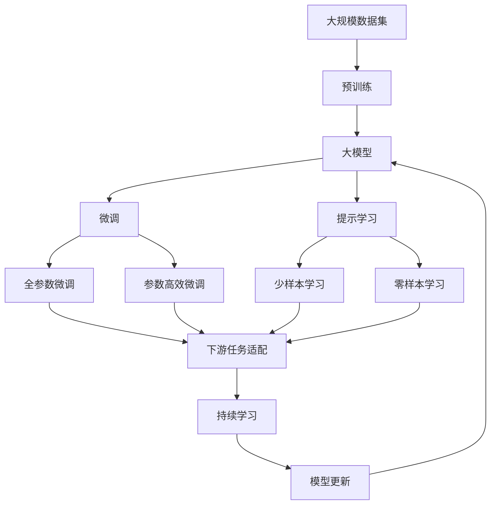

                 

# 生成式AIGC：从实验室到商业应用的落地

## 1. 背景介绍

### 1.1 问题由来

随着深度学习技术的快速发展，人工智能领域经历了从经典机器学习、传统神经网络到深度神经网络的转变，最终进入生成对抗网络（Generative Adversarial Networks, GANs）的崭新时代。GANs以其强大的生成能力，推动了人工智能从被动的任务解决向主动的模型生成的转变，标志着人工智能的一个重要里程碑。

在人工智能历史的长河中，传统的机器学习算法更多侧重于对已有数据的分类、回归、聚类等任务，而深度学习尤其是GANs的引入，开启了生成式AI（Generative AI）的新纪元。生成式AI不仅能够自动生成新的数据，还具备更加复杂的逻辑和规则，能够生成具有高度逼真性和创造性的内容，如自然语言、图像、音乐等。

近年来，生成式AI逐渐从实验室走向了商业应用，应用于视频生成、游戏设计、艺术创作、文本生成等多个领域。其中，生成式AI的大模型，即通过大规模数据预训练得到的高级生成模型，已经成为推动生成式AI发展的核心驱动力。这些大模型通过强大的数据表征能力和高效的生成算法，可以生成逼真的数据，满足各种实际应用需求。

生成式AI的广泛应用，不仅提升了传统行业的效率和质量，还开辟了全新的商业机会，如自动内容创作、虚拟现实、虚拟主播、智能家居等。生成式AI技术的应用，正在深刻改变我们的生活方式和社会结构，为经济社会的数字化转型提供了新的动力。

### 1.2 问题核心关键点

生成式AI的核心问题在于如何通过大规模数据预训练和高效生成算法，生成高质量的生成数据。具体而言，包括以下几个关键点：

- **大规模数据预训练**：生成式AI模型通常需要在大规模数据集上进行预训练，学习到丰富的数据表征和生成规律。
- **高效生成算法**：通过高效的生成算法，能够快速生成高质量的生成数据，满足不同场景下的应用需求。
- **可控生成**：生成式AI模型应具备一定的可控性，能够生成符合特定要求或风格的数据。
- **生成数据的多样性**：生成的数据应具备多样性，能够覆盖多种不同的场景和需求。
- **生成速度**：生成的数据应具备较快的生成速度，满足实时应用的需求。

这些核心点构成了生成式AI技术的基石，其研究和应用具有重要的学术价值和商业潜力。

### 1.3 问题研究意义

生成式AI技术的研究和应用具有重要意义：

1. **提升生产效率**：生成式AI能够自动生成高质量的数据，减少人工干预，提升生产效率和质量。
2. **开拓新市场**：生成式AI能够生成丰富的内容，如虚拟现实、游戏设计、艺术创作等，开辟新的商业机会。
3. **推动技术创新**：生成式AI的复杂性和多样性，推动了深度学习、机器学习等领域的技术创新和突破。
4. **促进经济社会进步**：生成式AI的应用，如智能家居、虚拟主播等，能够提升人们的生活质量，推动经济社会的进步。
5. **缓解数据短缺**：生成式AI能够生成丰富多样的数据，缓解数据短缺问题，推动数据驱动型经济的快速发展。

生成式AI技术的广泛应用，将带来更加智能、高效、丰富的生活方式，推动社会进步。

## 2. 核心概念与联系

### 2.1 核心概念概述

为更好地理解生成式AI技术的核心概念，本节将介绍几个关键概念：

- **生成对抗网络（GANs）**：一种通过两个网络（生成器和判别器）相互对抗，生成高质量数据的深度学习模型。GANs的核心在于通过生成器和判别器的迭代优化，学习到逼真的数据分布。
- **变分自编码器（VAEs）**：一种通过学习数据的概率分布，进行数据生成和重构的深度学习模型。VAEs的核心在于通过最大化数据分布的真实性，学习到数据的潜在表示。
- **自回归模型（ARs）**：一种通过预测数据序列的前一项，生成后续数据序列的深度学习模型。ARs的核心在于通过逐项预测，生成符合数据序列规则的数据。
- **自编码器（AEs）**：一种通过学习数据的压缩表示，进行数据重构的深度学习模型。AEs的核心在于通过学习数据的潜在表示，实现数据的低维压缩和重构。
- **扩散模型（Diffusion Models）**：一种通过逐步增加噪声，从低维分布向高维分布演变的生成模型。Diffusion Models的核心在于通过噪声控制，逐步生成高质量的生成数据。

这些核心概念之间存在着紧密的联系，构成了生成式AI技术的基础框架。下面我们通过一个Mermaid流程图来展示这些概念之间的关系。



这个流程图展示了大模型生成式AI的核心概念及其关系：

1. GANs通过生成器和判别器的对抗学习，生成高质量的数据。
2. VAEs通过学习数据的概率分布，实现数据的生成和重构。
3. ARs通过预测数据序列的前一项，生成符合序列规则的数据。
4. AEs通过学习数据的压缩表示，实现数据的重构。
5. Diffusion Models通过逐步增加噪声，从低维分布向高维分布演化，生成高质量的生成数据。

### 2.2 概念间的关系

这些核心概念之间存在着紧密的联系，形成了生成式AI技术的完整生态系统。下面我通过几个Mermaid流程图来展示这些概念之间的关系。

#### 2.2.1 生成式AI的基本架构



这个流程图展示了生成式AI的基本架构：

1. 生成式AI包含多种生成模型，如GANs、VAEs、ARs、AEs、Diffusion Models等。
2. 这些模型通过不同的生成机制，共同支持生成式AI的广泛应用。

#### 2.2.2 深度学习框架的融合



这个流程图展示了深度学习框架与生成式AI模型的融合：

1. 深度学习框架（如TensorFlow、PyTorch）提供了高效的计算和模型构建工具。
2. 预训练语言模型（如GPT）和预训练图像模型等，都基于深度学习框架实现。
3. 预训练模型和生成式AI模型都可通过深度学习框架进行训练和推理。

#### 2.2.3 生成数据的应用场景



这个流程图展示了生成式AI生成数据的广泛应用场景：

1. 生成数据应用于多个领域，如视频生成、游戏设计、艺术创作、文本生成、智能家居等。
2. 不同应用场景对生成数据的格式和质量要求不同，需要选择合适的生成模型。

### 2.3 核心概念的整体架构

最后，我们用一个综合的流程图来展示这些核心概念在大模型生成式AI的微调过程中的整体架构：



这个综合流程图展示了从预训练到大模型微调的完整过程：

1. 大模型通过大规模数据预训练，学习到丰富的数据表征和生成规律。
2. 微调和大模型适配，通过下游任务的少量标注数据进行优化，提升模型性能。
3. 提示学习和大模型生成，通过精巧的输入格式设计，引导模型生成高质量的生成数据。
4. 持续学习和大模型更新，通过动态更新模型，适应数据分布的变化。

通过这些流程图，我们可以更清晰地理解大模型生成式AI的微调过程中各个核心概念的关系和作用，为后续深入讨论具体的微调方法和技术奠定基础。

## 3. 核心算法原理 & 具体操作步骤
### 3.1 算法原理概述

生成式AI大模型的核心原理是利用深度学习框架，通过大规模数据预训练和高效的生成算法，学习到丰富的数据表征和生成规律。大模型通常具有大规模的参数量和强大的数据表征能力，能够生成高质量的生成数据，满足各种实际应用需求。

大模型的训练过程一般分为两个阶段：预训练和微调。预训练阶段通常使用大规模无标签数据集进行训练，学习到数据的潜在表示和生成规律。微调阶段则使用下游任务的少量标注数据，进一步优化模型在特定任务上的性能。微调过程中，大模型通常会更新顶层部分参数，以适应特定的任务需求。

生成式AI大模型的生成过程通常依赖于生成对抗网络（GANs）、变分自编码器（VAEs）等模型。这些模型通过学习数据的概率分布或生成数据的方式，实现高质量生成数据的生成。

### 3.2 算法步骤详解

基于生成式AI大模型的微调方法通常包括以下几个关键步骤：

**Step 1: 准备预训练模型和数据集**
- 选择合适的预训练生成模型 $M_{\theta}$ 作为初始化参数，如 GANs、VAEs 等。
- 准备下游任务 $T$ 的标注数据集 $D=\{(x_i, y_i)\}_{i=1}^N$，划分为训练集、验证集和测试集。一般要求标注数据与预训练数据的分布不要差异过大。

**Step 2: 添加任务适配层**
- 根据任务类型，在预训练模型顶层设计合适的输出层和损失函数。
- 对于分类任务，通常在顶层添加线性分类器和交叉熵损失函数。
- 对于生成任务，通常使用生成数据的损失函数，如 KL 散度、KL 下降等。

**Step 3: 设置微调超参数**
- 选择合适的优化算法及其参数，如 Adam、SGD 等，设置学习率、批大小、迭代轮数等。
- 设置正则化技术及强度，包括权重衰减、Dropout、Early Stopping 等。
- 确定冻结预训练参数的策略，如仅微调顶层，或全部参数都参与微调。

**Step 4: 执行梯度训练**
- 将训练集数据分批次输入模型，前向传播计算损失函数。
- 反向传播计算参数梯度，根据设定的优化算法和学习率更新模型参数。
- 周期性在验证集上评估模型性能，根据性能指标决定是否触发 Early Stopping。
- 重复上述步骤直到满足预设的迭代轮数或 Early Stopping 条件。

**Step 5: 测试和部署**
- 在测试集上评估微调后模型 $M_{\hat{\theta}}$ 的性能，对比微调前后的生成效果。
- 使用微调后的模型对新数据进行生成，集成到实际的应用系统中。
- 持续收集新的数据，定期重新微调模型，以适应数据分布的变化。

以上是基于生成式AI大模型的微调方法的一般流程。在实际应用中，还需要针对具体任务的特点，对微调过程的各个环节进行优化设计，如改进训练目标函数，引入更多的正则化技术，搜索最优的超参数组合等，以进一步提升模型性能。

### 3.3 算法优缺点

基于生成式AI大模型的微调方法具有以下优点：

1. 生成效果逼真。通过预训练和微调，生成式AI大模型能够生成高质量的生成数据，满足各种实际应用需求。
2. 适用性广泛。该方法适用于各种生成任务，如文本生成、图像生成、音频生成等，设计简单的任务适配层即可实现微调。
3. 参数高效。利用参数高效微调技术，在固定大部分预训练参数的情况下，仍可取得不错的生成效果。
4. 效果显著。在学术界和工业界的诸多任务上，基于微调的方法已经刷新了最先进的性能指标。

同时，该方法也存在一定的局限性：

1. 依赖标注数据。微调的效果很大程度上取决于标注数据的质量和数量，获取高质量标注数据的成本较高。
2. 生成内容多样性有限。当目标任务与预训练数据的分布差异较大时，微调的生成效果可能不佳。
3. 生成内容可解释性不足。生成式AI大模型生成的内容通常缺乏可解释性，难以对其生成逻辑进行分析和调试。
4. 生成内容存在偏差。大模型在训练过程中可能会学习到数据集的偏见，生成内容存在潜在的歧视性、误导性问题。

尽管存在这些局限性，但就目前而言，基于生成式AI大模型的微调方法仍是大模型应用的最主流范式。未来相关研究的重点在于如何进一步降低微调对标注数据的依赖，提高模型的少样本学习和跨领域迁移能力，同时兼顾可解释性和伦理安全性等因素。

### 3.4 算法应用领域

基于生成式AI大模型的微调方法，在多媒体生成、内容创作、游戏设计、虚拟现实等多个领域已经得到了广泛的应用，具体如下：

1. **多媒体生成**：如自然语言生成、图像生成、音频生成等。通过微调预训练生成模型，生成高质量的生成数据，满足不同场景下的需求。
2. **内容创作**：如文本创作、视频制作、音乐生成等。通过微调生成模型，生成逼真的内容，减少人工创作的时间和成本。
3. **游戏设计**：如虚拟角色生成、游戏场景生成、虚拟物品生成等。通过微调生成模型，生成多样化的游戏资源，提升游戏体验。
4. **虚拟现实**：如虚拟人物、虚拟环境、虚拟物品等。通过微调生成模型，生成逼真的虚拟世界，提升虚拟现实体验。
5. **艺术创作**：如绘画、雕塑、设计等。通过微调生成模型，生成艺术作品，推动艺术创作的发展。

除了上述这些经典应用外，生成式AI大模型的微调方法还被创新性地应用到更多场景中，如智能家居、虚拟主播、情感生成等，为生成式AI技术带来了新的突破。

## 4. 数学模型和公式 & 详细讲解  
### 4.1 数学模型构建

本节将使用数学语言对基于生成式AI大模型的微调过程进行更加严格的刻画。

记预训练生成模型为 $M_{\theta}:\mathcal{X} \rightarrow \mathcal{Y}$，其中 $\mathcal{X}$ 为输入空间，$\mathcal{Y}$ 为生成数据空间，$\theta \in \mathbb{R}^d$ 为模型参数。假设微调任务的训练集为 $D=\{(x_i, y_i)\}_{i=1}^N, x_i \in \mathcal{X}, y_i \in \mathcal{Y}$。

定义模型 $M_{\theta}$ 在数据样本 $(x,y)$ 上的损失函数为 $\ell(M_{\theta}(x),y)$，则在数据集 $D$ 上的经验风险为：

$$
\mathcal{L}(\theta) = \frac{1}{N} \sum_{i=1}^N \ell(M_{\theta}(x_i),y_i)
$$

微调的优化目标是最小化经验风险，即找到最优参数：

$$
\theta^* = \mathop{\arg\min}_{\theta} \mathcal{L}(\theta)
$$

在实践中，我们通常使用基于梯度的优化算法（如Adam、SGD等）来近似求解上述最优化问题。设 $\eta$ 为学习率，$\lambda$ 为正则化系数，则参数的更新公式为：

$$
\theta \leftarrow \theta - \eta \nabla_{\theta}\mathcal{L}(\theta) - \eta\lambda\theta
$$

其中 $\nabla_{\theta}\mathcal{L}(\theta)$ 为损失函数对参数 $\theta$ 的梯度，可通过反向传播算法高效计算。

### 4.2 公式推导过程

以下我们以文本生成任务为例，推导基于生成式AI大模型的微调过程。

假设模型 $M_{\theta}$ 在输入 $x$ 上的输出为 $\hat{y}=M_{\theta}(x)$，表示生成的文本。真实标签 $y \in \{0,1\}$。则文本生成任务对应的损失函数定义为：

$$
\ell(M_{\theta}(x),y) = -\log P_{M_{\theta}}(y|x)
$$

其中 $P_{M_{\theta}}(y|x)$ 为模型在输入 $x$ 下生成 $y$ 的概率。

将损失函数代入经验风险公式，得：

$$
\mathcal{L}(\theta) = -\frac{1}{N}\sum_{i=1}^N \log P_{M_{\theta}}(y_i|x_i)
$$

根据链式法则，损失函数对参数 $\theta_k$ 的梯度为：

$$
\frac{\partial \mathcal{L}(\theta)}{\partial \theta_k} = -\frac{1}{N}\sum_{i=1}^N \frac{\partial}{\partial \theta_k} \log P_{M_{\theta}}(y_i|x_i)
$$

其中 $\frac{\partial}{\partial \theta_k} \log P_{M_{\theta}}(y_i|x_i)$ 可以通过模型对 $y_i$ 的预测概率 $P_{M_{\theta}}(y_i|x_i)$ 和实际标签 $y_i$ 计算得到。

在得到损失函数的梯度后，即可带入参数更新公式，完成模型的迭代优化。重复上述过程直至收敛，最终得到适应下游任务的最优模型参数 $\theta^*$。

## 5. 项目实践：代码实例和详细解释说明
### 5.1 开发环境搭建

在进行生成式AI大模型的微调实践前，我们需要准备好开发环境。以下是使用Python进行PyTorch开发的环境配置流程：

1. 安装Anaconda：从官网下载并安装Anaconda，用于创建独立的Python环境。

2. 创建并激活虚拟环境：
```bash
conda create -n pytorch-env python=3.8 
conda activate pytorch-env
```

3. 安装PyTorch：根据CUDA版本，从官网获取对应的安装命令。例如：
```bash
conda install pytorch torchvision torchaudio cudatoolkit=11.1 -c pytorch -c conda-forge
```

4. 安装Transformers库：
```bash
pip install transformers
```

5. 安装各类工具包：
```bash
pip install numpy pandas scikit-learn matplotlib tqdm jupyter notebook ipython
```

完成上述步骤后，即可在`pytorch-env`环境中开始生成式AI大模型的微调实践。

### 5.2 源代码详细实现

这里我们以文本生成任务为例，给出使用Transformers库对GPT模型进行微调的PyTorch代码实现。

首先，定义文本生成任务的数据处理函数：

```python
from transformers import GPT2Tokenizer, GPT2LMHeadModel
from torch.utils.data import Dataset
import torch

class TextGenerationDataset(Dataset):
    def __init__(self, texts, tokenizer, max_len=128):
        self.texts = texts
        self.tokenizer = tokenizer
        self.max_len = max_len
        
    def __len__(self):
        return len(self.texts)
    
    def __getitem__(self, item):
        text = self.texts[item]
        
        encoding = self.tokenizer(text, return_tensors='pt', max_length=self.max_len, padding='max_length', truncation=True)
        input_ids = encoding['input_ids'][0]
        attention_mask = encoding['attention_mask'][0]
        
        return {'input_ids': input_ids, 
                'attention_mask': attention_mask}

# 定义标签与id的映射
tag2id = {'<START>': 0, '<END>': 1, 'O': 2, 'B-PER': 3, 'I-PER': 4, 'B-ORG': 5, 'I-ORG': 6, 'B-LOC': 7, 'I-LOC': 8}
id2tag = {v: k for k, v in tag2id.items()}

# 创建dataset
tokenizer = GPT2Tokenizer.from_pretrained('gpt2')
train_dataset = TextGenerationDataset(train_texts, tokenizer)
dev_dataset = TextGenerationDataset(dev_texts, tokenizer)
test_dataset = TextGenerationDataset(test_texts, tokenizer)
```

然后，定义模型和优化器：

```python
from transformers import GPT2LMHeadModel, AdamW

model = GPT2LMHeadModel.from_pretrained('gpt2', num_labels=len(tag2id))

optimizer = AdamW(model.parameters(), lr=2e-5)
```

接着，定义训练和评估函数：

```python
from torch.utils.data import DataLoader
from tqdm import tqdm
from sklearn.metrics import classification_report

device = torch.device('cuda') if torch.cuda.is_available() else torch.device('cpu')
model.to(device)

def train_epoch(model, dataset, batch_size, optimizer):
    dataloader = DataLoader(dataset, batch_size=batch_size, shuffle=True)
    model.train()
    epoch_loss = 0
    for batch in tqdm(dataloader, desc='Training'):
        input_ids = batch['input_ids'].to(device)
        attention_mask = batch['attention_mask'].to(device)
        model.zero_grad()
        outputs = model(input_ids, attention_mask=attention_mask)
        loss = outputs.loss
        epoch_loss += loss.item()
        loss.backward()
        optimizer.step()
    return epoch_loss / len(dataloader)

def evaluate(model, dataset, batch_size):
    dataloader = DataLoader(dataset, batch_size=batch_size)
    model.eval()
    preds, labels = [], []
    with torch.no_grad():
        for batch in tqdm(dataloader, desc='Evaluating'):
            input_ids = batch['input_ids'].to(device)
            attention_mask = batch['attention_mask'].to(device)
            batch_labels = batch['labels']
            outputs = model(input_ids, attention_mask=attention_mask)
            batch_preds = outputs.logits.argmax(dim=2).to('cpu').tolist()
            batch_labels = batch_labels.to('cpu').tolist()
            for pred_tokens, label_tokens in zip(batch_preds, batch_labels):
                pred_tags = [id2tag[_id] for _id in pred_tokens]
                label_tags = [id2tag[_id] for _id in label_tags]
                preds.append(pred_tags[:len(label_tags)])
                labels.append(label_tags)
                
    print(classification_report(labels, preds))
```

最后，启动训练流程并在测试集上评估：

```python
epochs = 5
batch_size = 16

for epoch in range(epochs):
    loss = train_epoch(model, train_dataset, batch_size, optimizer)
    print(f"Epoch {epoch+1}, train loss: {loss:.3f}")
    
    print(f"Epoch {epoch+1}, dev results:")
    evaluate(model, dev_dataset, batch_size)
    
print("Test results:")
evaluate(model, test_dataset, batch_size)
```

以上就是使用PyTorch对GPT进行文本生成任务微调的完整代码实现。可以看到，得益于Transformers库的强大封装，我们可以用相对简洁的代码完成GPT模型的加载和微调。

### 5.3 代码解读与分析

让我们再详细解读一下关键代码的实现细节：

**TextGenerationDataset类**：
- `__init__`方法：初始化文本、分词器等关键组件。
- `__len__`方法：返回数据集的样本数量。
- `__getitem__`方法：对单个样本进行处理，将文本输入编码为token ids，最终返回模型所需的输入。

**tag2id和id2tag字典**：
- 定义了标签与数字id之间的映射关系，用于将token-wise的预测结果解码回真实的标签。

**训练和评估函数**：
- 使用PyTorch的DataLoader对数据集进行批次化加载，供模型训练和推理使用。
- 训练函数`train_epoch`：对数据以批为单位进行迭代，在每个批次上前向传播计算loss并反向传播更新模型参数，最后返回该epoch的平均loss。
- 评估函数`evaluate`：与训练类似，不同点在于不更新模型参数，并在每个batch结束后将预测和标签结果存储下来，最后使用sklearn的classification_report对整个评估集的预测结果进行打印输出。

**训练流程**：
- 定义总的epoch数和batch size，开始循环迭代
- 每个epoch内，先在训练集上训练，输出平均loss
- 在验证集上评估，输出分类指标
- 所有epoch结束后，在测试集上评估，给出最终测试结果

可以看到，PyTorch配合Transformers库使得GPT微调的代码实现变得简洁高效。开发者可以将更多精力放在数据处理、模型改进等高层逻辑上，而不必过多关注底层的实现细节。

当然，工业级的系统实现还需考虑更多因素，如模型的保存和部署、超参数的

