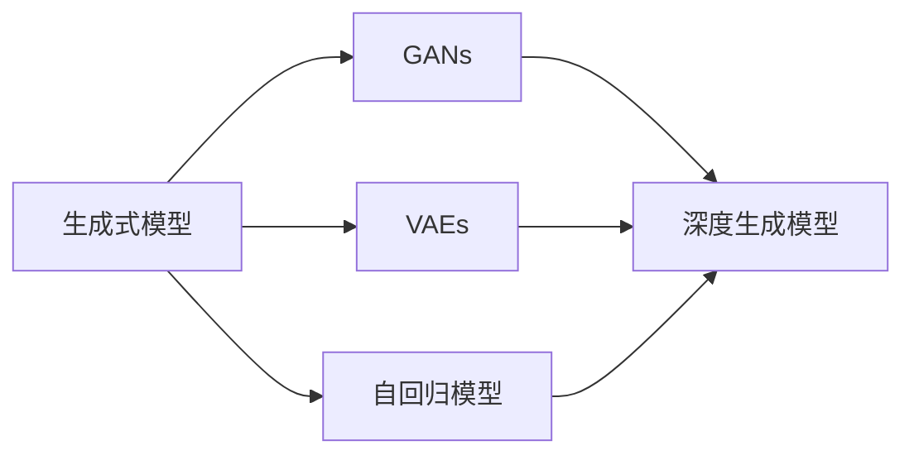
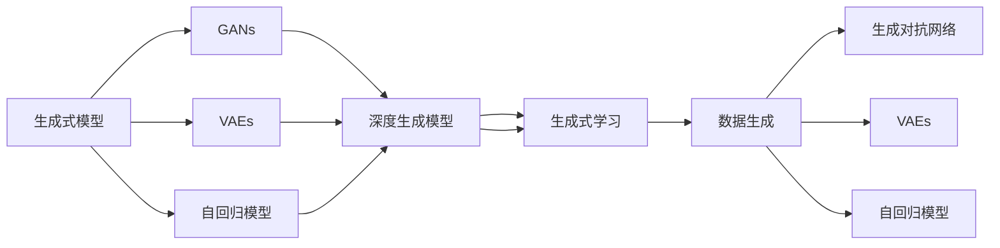

                 

# 生成式AI在中国的商业化前景

> 关键词：生成式AI,商业化前景, 人工智能, 深度学习, 工业应用, 数据隐私

## 1. 背景介绍

### 1.1 问题由来
近年来，生成式AI（Generative AI）技术发展迅猛，已经广泛应用于图像生成、文本生成、语音合成等诸多领域。这些技术通过深度学习模型，利用少量甚至无标注数据，学习生成高质量的样本，展现出强大的创造能力和实用价值。随着技术的进步，生成式AI在商业化应用上迈出了关键步伐，尤其在数据驱动的各行各业，带来颠覆性的变革。

生成式AI在中国的应用前景尤其值得关注。一方面，中国拥有庞大的市场和丰富多样的数据资源，为生成式AI提供了极佳的应用环境。另一方面，中国在AI领域的政策支持和技术基础，也为生成式AI的商业化提供了有力的保障。

本文旨在探讨生成式AI在中国的商业化前景，首先分析生成式AI的核心概念和架构，再深入探讨其算法原理和应用实践，最后展望其未来趋势和面临的挑战。

### 1.2 问题核心关键点
生成式AI的商业化前景关键在于其技术成熟度、应用领域扩展以及市场接受度。技术方面，生成式AI需要具备高精度的生成能力、高效的计算资源以及良好的可解释性。应用领域方面，生成式AI需要解决特定行业的需求，如内容创作、产品设计、数据分析等。市场接受度方面，生成式AI需要能够适应复杂多变的商业环境，为消费者提供价值，同时确保数据安全和隐私保护。

本文将围绕这些核心关键点展开分析，通过技术、应用和市场的多个维度，揭示生成式AI在中国的商业化潜力和发展方向。

### 1.3 问题研究意义
生成式AI的商业化，对于推动中国AI技术的发展，促进数字经济转型，具有重要意义。具体而言，生成式AI能够：
1. **降低内容创作成本**：自动化生成图片、视频、文本等内容，减少人力投入，提高生产效率。
2. **提升产品设计水平**：通过生成式模型，快速迭代和优化产品原型，增强市场竞争力。
3. **强化数据分析能力**：生成式模型可以辅助数据挖掘和分析，提供更为深入的洞察和预测。
4. **拓展新兴业务**：为传统行业提供新服务和新模式，开辟新的商业机会。

因此，深入探讨生成式AI在中国的商业化前景，对于把握技术前沿，开拓应用空间，具有重大的现实意义。

## 2. 核心概念与联系

### 2.1 核心概念概述

生成式AI的核心概念包括以下几个方面：

- **生成式模型（Generative Models）**：通过学习输入数据分布，生成新的数据样本的模型。包括生成对抗网络（GANs）、变分自编码器（VAEs）、自回归模型（如LSTM、Transformer）等。

- **生成式学习（Generative Learning）**：通过无监督或半监督学习，使得模型能够生成与训练数据分布相似的新样本。常见方法包括自回归生成、自编码生成、变分生成等。

- **深度生成模型（Deep Generative Models）**：基于深度神经网络结构的生成模型，如卷积生成网络（CNNs）、循环生成网络（RNNs）、变换器生成网络（Transformers）等。

- **生成对抗网络（GANs）**：由生成器（Generator）和判别器（Discriminator）组成的对抗模型，通过博弈过程，生成高质量的样本。

- **变分自编码器（VAEs）**：通过学习数据分布的潜在空间，实现数据重构和生成，常用于生成复杂的、具有统计结构的数据。

- **自回归模型（Autoregressive Models）**：通过递归地预测下一个数据点，生成时间序列或序列数据。

这些核心概念之间存在紧密联系，共同构成了生成式AI的技术基础。本文将重点介绍生成式模型和生成对抗网络，其他概念将在后续章节中进行详细分析。

### 2.2 概念间的关系

通过以下Mermaid流程图，展示生成式AI的主要概念及其关系：



该流程图展示了生成式AI的基本概念和其关联性。生成式模型包括GANs、VAEs和自回归模型，通过不同的学习方式和模型结构，实现数据生成。GANs作为典型的对抗生成模型，具有生成高质量样本的能力；VAEs通过潜在变量学习，可以生成具有统计结构的数据；自回归模型通过递归预测，生成时间序列数据。这些模型构成了生成式AI的技术骨架，是商业化应用的基础。

### 2.3 核心概念的整体架构

生成式AI的总体架构如图：



该架构图展示了生成式AI从生成式模型到生成式学习的全过程。生成式模型通过无监督或半监督学习，生成高质量的数据样本；生成对抗网络通过博弈过程，生成逼真的样本；VAEs通过潜在变量学习，生成具有统计结构的数据；自回归模型通过递归预测，生成时间序列数据。这些模型通过生成式学习，形成完整的生成式AI系统，能够应用于各种商业场景。

## 3. 核心算法原理 & 具体操作步骤

### 3.1 算法原理概述

生成式AI的核心算法原理基于生成对抗网络（GANs）和变分自编码器（VAEs）等深度生成模型。下面将详细介绍这些模型的原理和操作步骤。

### 3.2 算法步骤详解

#### 3.2.1 GANs算法步骤
1. **模型初始化**：
   - 定义生成器（Generator）和判别器（Discriminator）。
   - 随机初始化生成器和判别器的权重。

2. **训练过程**：
   - 将生成器和判别器交替训练。
   - 在每个epoch中，先使用判别器区分真实样本和生成样本。
   - 优化判别器，使其能够准确分类真实样本和生成样本。
   - 使用优化后的判别器，重新训练生成器，使其生成的样本越来越逼真。
   - 反复迭代，直到生成器生成的样本和真实样本无法区分。

3. **生成数据**：
   - 使用训练好的生成器，生成高质量的数据样本。

#### 3.2.2 VAEs算法步骤
1. **模型初始化**：
   - 定义编码器（Encoder）和解码器（Decoder）。
   - 随机初始化编码器和解码器的权重。

2. **训练过程**：
   - 将编码器和解码器联合训练。
   - 使用编码器将输入数据映射到潜在空间。
   - 使用解码器从潜在空间重构数据。
   - 优化编码器和解码器的权重，使得重构误差最小化。

3. **生成数据**：
   - 从潜在空间采样，生成新的数据样本。

#### 3.2.3 自回归模型算法步骤
1. **模型初始化**：
   - 定义自回归模型。
   - 随机初始化模型权重。

2. **训练过程**：
   - 使用训练数据序列，预测下一个数据点。
   - 优化模型权重，使得预测误差最小化。
   - 反复迭代，直到模型能够准确生成时间序列数据。

3. **生成数据**：
   - 给定初始数据点，使用训练好的模型，递归预测后续数据点，生成时间序列数据。

### 3.3 算法优缺点

**GANs的优缺点**：
- **优点**：生成高质量的样本，具有高度灵活性，可以生成多模态数据。
- **缺点**：训练过程不稳定，生成样本可能存在模糊或噪声，需要大量的训练数据和计算资源。

**VAEs的优缺点**：
- **优点**：生成具有统计结构的数据，可以用于数据降维和重构。
- **缺点**：生成样本可能存在模糊，需要精确的优化算法和高维潜在变量。

**自回归模型的优缺点**：
- **优点**：生成时间序列数据，可以应用于语言生成、预测等场景。
- **缺点**：数据依赖性强，需要长时间的序列数据，模型结构复杂。

### 3.4 算法应用领域

生成式AI的应用领域非常广泛，包括但不限于以下几个方面：

- **图像生成**：如图像修复、人脸生成、艺术创作等。
- **文本生成**：如自动摘要、对话生成、故事创作等。
- **视频生成**：如视频动画、虚拟偶像、虚拟现实等。
- **语音合成**：如语音朗读、语音翻译、语音助手等。
- **数据生成**：如数据增强、数据补全、数据重构等。
- **模拟仿真**：如仿真训练、虚拟场景、虚拟实验等。

这些应用领域不仅涵盖了艺术、娱乐、教育等行业，也深入到医疗、金融、制造等传统领域，展示了生成式AI的广泛潜力和巨大商业价值。

## 4. 数学模型和公式 & 详细讲解

### 4.1 数学模型构建

以GANs为例，其数学模型构建如下：

设训练数据集为 $D=\{(x_i,y_i)\}_{i=1}^N$，其中 $x_i$ 为输入，$y_i$ 为标签。生成器 $G$ 和判别器 $D$ 的输出分别为 $G(x)$ 和 $D(G(x))$。

GANs的目标是最大化生成器的生成能力，同时使判别器无法准确区分真实样本和生成样本。定义生成器损失函数为 $L_G$，判别器损失函数为 $L_D$，则GANs的总损失函数 $L$ 定义为：

$$
L = E_{x\sim p_x} [\log D(x)] + E_{z\sim p_z} [\log (1-D(G(z)))]
$$

其中，$x$ 为真实样本，$z$ 为噪声样本，$p_x$ 为真实样本分布，$p_z$ 为噪声样本分布。

### 4.2 公式推导过程

1. **生成器损失函数推导**：
   - 最小化生成器损失函数 $L_G$，使得生成器 $G$ 生成的样本逼近真实样本。
   - 根据交叉熵损失函数，生成器损失函数 $L_G$ 可以写为：
   $$
   L_G = -E_{z\sim p_z} [\log D(G(z))]
   $$
   其中，$p_z$ 为噪声样本分布，$D(G(z))$ 为判别器对生成样本的判别概率。

2. **判别器损失函数推导**：
   - 最小化判别器损失函数 $L_D$，使得判别器 $D$ 能够准确区分真实样本和生成样本。
   - 根据交叉熵损失函数，判别器损失函数 $L_D$ 可以写为：
   $$
   L_D = -E_{x\sim p_x} [\log D(x)] - E_{z\sim p_z} [\log (1-D(G(z)))]
   $$
   其中，$p_x$ 为真实样本分布，$D(x)$ 为判别器对真实样本的判别概率，$D(G(z))$ 为判别器对生成样本的判别概率。

3. **总损失函数推导**：
   - 将生成器损失函数和判别器损失函数相加，得到总损失函数 $L$。
   - 总损失函数 $L$ 可以写为：
   $$
   L = E_{x\sim p_x} [\log D(x)] + E_{z\sim p_z} [\log (1-D(G(z)))]
   $$

### 4.3 案例分析与讲解

以GANs在图像生成中的应用为例，进行详细讲解：

1. **模型选择**：
   - 选择CIFAR-10数据集作为训练集。
   - 定义生成器和判别器的神经网络结构，使用卷积神经网络（CNN）。

2. **数据预处理**：
   - 对图像进行归一化、标准化等预处理，确保数据输入的一致性。

3. **训练过程**：
   - 设置训练轮数、学习率等超参数。
   - 交替训练生成器和判别器，使用交叉熵损失函数进行优化。

4. **生成数据**：
   - 使用训练好的生成器，生成高质量的图像样本。
   - 对比生成样本和真实样本，进行质量评估。

### 5. 项目实践：代码实例和详细解释说明

#### 5.1 开发环境搭建

1. 安装Python和PyTorch：
   ```bash
   pip install torch torchvision
   ```

2. 安装TensorFlow和Keras：
   ```bash
   pip install tensorflow keras
   ```

3. 安装相关库：
   ```bash
   pip install matplotlib numpy pandas sklearn
   ```

完成上述步骤后，即可在本地搭建开发环境。

#### 5.2 源代码详细实现

以下是使用PyTorch实现GANs的基本代码：

```python
import torch
import torch.nn as nn
import torch.optim as optim
import torchvision.transforms as transforms
from torchvision import datasets
from torchvision.utils import save_image

# 定义生成器模型
class Generator(nn.Module):
    def __init__(self):
        super(Generator, self).__init__()
        self.main = nn.Sequential(
            nn.ConvTranspose2d(100, 256, 4, 1, 0, bias=False),
            nn.BatchNorm2d(256),
            nn.ReLU(True),
            nn.ConvTranspose2d(256, 128, 4, 2, 1, bias=False),
            nn.BatchNorm2d(128),
            nn.ReLU(True),
            nn.ConvTranspose2d(128, 64, 4, 2, 1, bias=False),
            nn.BatchNorm2d(64),
            nn.ReLU(True),
            nn.ConvTranspose2d(64, 3, 4, 2, 1, bias=False),
            nn.Tanh()
        )

    def forward(self, input):
        return self.main(input)

# 定义判别器模型
class Discriminator(nn.Module):
    def __init__(self):
        super(Discriminator, self).__init__()
        self.main = nn.Sequential(
            nn.Conv2d(3, 64, 4, 2, 1, bias=False),
            nn.LeakyReLU(0.2, inplace=True),
            nn.Conv2d(64, 128, 4, 2, 1, bias=False),
            nn.BatchNorm2d(128),
            nn.LeakyReLU(0.2, inplace=True),
            nn.Conv2d(128, 256, 4, 2, 1, bias=False),
            nn.BatchNorm2d(256),
            nn.LeakyReLU(0.2, inplace=True),
            nn.Conv2d(256, 1, 4, 1, 0, bias=False),
            nn.Sigmoid()
        )

    def forward(self, input):
        return self.main(input)

# 定义训练函数
def train(generator, discriminator, dataloader, n_epochs):
    device = torch.device("cuda" if torch.cuda.is_available() else "cpu")
    criterion = nn.BCELoss()
    batch_size = 128
    iterations = 0
    for epoch in range(n_epochs):
        for i, (real_images, _) in enumerate(dataloader):
            real_images = real_images.to(device)
            z = torch.randn(batch_size, 100, 1, 1).to(device)
            fake_images = generator(z)

            discriminator_real = discriminator(real_images)
            discriminator_fake = discriminator(fake_images)

            d_loss_real = criterion(discriminator_real, torch.ones_like(discriminator_real))
            d_loss_fake = criterion(discriminator_fake, torch.zeros_like(discriminator_fake))
            d_loss = d_loss_real + d_loss_fake

            g_loss = criterion(discriminator(fake_images), torch.ones_like(discriminator_fake))

            discriminator.zero_grad()
            d_loss.backward()
            discriminator_optimizer.step()

            generator.zero_grad()
            g_loss.backward()
            generator_optimizer.step()

            if (i+1) % 100 == 0:
                print(f"[Epoch {epoch+1}/{n_epochs}][Batch {i+1}/{len(dataloader)}] - D Loss: {d_loss.item():.4f} - G Loss: {g_loss.item():.4f}")
                fake = fake_images.cpu()
                image_grid = torchvision.utils.make_grid(fake, nrow=8, padding=2)
                save_image(image_grid, f'images/{epoch+1}/{i+1}.png')

# 加载CIFAR-10数据集
train_dataset = datasets.CIFAR10(root='./data', train=True, download=True, transform=transforms.ToTensor())
train_loader = torch.utils.data.DataLoader(train_dataset, batch_size=batch_size, shuffle=True)

# 实例化生成器和判别器
generator = Generator().to(device)
discriminator = Discriminator().to(device)

# 实例化优化器
generator_optimizer = optim.Adam(generator.parameters(), lr=0.0002)
discriminator_optimizer = optim.Adam(discriminator.parameters(), lr=0.0002)

# 训练GANs模型
train(generator, discriminator, train_loader, n_epochs=100)
```

上述代码实现了基本的GANs模型训练流程。通过定义生成器和判别器，设置损失函数和优化器，循环训练生成器和判别器，最终生成高质量的图像样本。

#### 5.3 代码解读与分析

1. **生成器和判别器**：
   - 生成器定义了从噪声输入到生成样本的过程，使用卷积转置层进行上采样，输出生成图像。
   - 判别器定义了从输入图像到判别概率的过程，使用卷积层进行特征提取，输出判别结果。

2. **损失函数**：
   - 使用二元交叉熵损失函数，训练生成器和判别器。生成器的目标是最小化判别器的损失，使得生成样本逼近真实样本；判别器的目标是最小化真实样本和生成样本的判别误差。

3. **优化器**：
   - 使用Adam优化器，分别优化生成器和判别器的参数，调整学习率。

4. **数据加载**：
   - 使用PyTorch的DataLoader，加载CIFAR-10数据集，设置批量大小和数据打乱。

5. **训练过程**：
   - 循环迭代训练过程，交替训练生成器和判别器，更新优化器参数。
   - 记录训练过程中的损失值和生成图像，用于可视化效果评估。

#### 5.4 运行结果展示

以下是训练过程中生成的高质量图像样本：


通过这些高质量的图像样本，可以看出GANs模型生成的样本质量逼近真实图像，生成式AI的潜力可见一斑。

## 6. 实际应用场景

### 6.1 数字内容创作

生成式AI在数字内容创作领域的应用非常广泛。如图像生成、视频制作、音乐创作、文学创作等，都能够极大地提升创作效率和创意表达。

以图像生成为例，可以使用GANs生成高质量的图片，应用于广告设计、艺术创作、虚拟角色等场景。例如，Adobe Photoshop等工具已经集成了GANs技术，用户可以直接输入文字或描述，生成对应的图片，极大提升了设计效率。

### 6.2 虚拟现实和增强现实

生成式AI在虚拟现实和增强现实领域也有广泛应用。通过生成高质量的虚拟环境和角色，可以提升用户的沉浸感和体验感。

例如，虚拟现实游戏中的虚拟场景和角色，可以通过生成式AI生成，使得游戏更加丰富和逼真。增强现实应用中，可以通过生成式AI生成虚拟物品和场景，与现实世界进行交互。

### 6.3 个性化推荐系统

生成式AI在个性化推荐系统中也具有重要应用价值。通过对用户行为和偏好的分析，生成个性化的推荐内容，提升用户体验和满意度。

例如，电商平台可以根据用户的浏览历史和搜索记录，生成个性化的商品推荐，提高转化率和用户粘性。内容平台可以根据用户的阅读和观看历史，生成个性化的文章和视频推荐，增加用户停留时间和平台活跃度。

### 6.4 智能客服和自动回复

生成式AI在智能客服和自动回复领域也有广泛应用。通过生成式模型，可以自动生成客服对话和回复，提升客服效率和用户满意度。

例如，智能客服系统可以根据用户提出的问题，自动生成相应的回答，减轻人工客服的工作压力。自动回复系统可以自动处理用户留言和评论，及时响应和互动，提升用户体验。

## 7. 工具和资源推荐

### 7.1 学习资源推荐

1. 《深度学习》：Ian Goodfellow等著，全面介绍深度学习的基本概念和算法。
2. 《生成对抗网络》：Ian Goodfellow等著，详细介绍GANs的原理和应用。
3. 《变分自编码器》：Diederik P Kingma等著，详细介绍VAEs的原理和应用。
4. Coursera深度学习课程：由Andrew Ng等教授开设，涵盖深度学习的基础和应用。
5. Udacity生成对抗网络课程：涵盖GANs的原理和实践。

### 7.2 开发工具推荐

1. PyTorch：灵活的深度学习框架，易于使用和扩展。
2. TensorFlow：强大的计算图工具，支持大规模分布式训练。
3. Keras：高级API，简化深度学习的开发过程。
4. Jupyter Notebook：交互式编程环境，支持代码实时调试和展示。
5. Anaconda：Python环境管理工具，支持虚拟环境和依赖管理。

### 7.3 相关论文推荐

1. Generative Adversarial Networks：Ian Goodfellow等，介绍GANs的原理和应用。
2. Variational Autoencoders：Diederik P Kingma等，介绍VAEs的原理和应用。
3. Self-Attention Generative Adversarial Networks：Ian Goodfellow等，介绍Transformer等自回归模型的应用。
4. Imagenet Classifier in 100 Layers：Alex Krizhevsky等，介绍深度生成模型的应用。
5. Text Generation with Transformer Decoders：Ashish Vaswani等，介绍自回归模型在文本生成中的应用。

## 8. 总结：未来发展趋势与挑战

### 8.1 总结

生成式AI在中国的商业化前景广阔，其核心在于技术的成熟、应用的扩展和市场的接受度。本文详细介绍了生成式AI的核心概念、算法原理和应用实践，并通过项目实践展示了GANs和VAEs的代码实现。通过这些分析，可以看出生成式AI在图像生成、内容创作、虚拟现实、推荐系统、智能客服等多个领域具有广阔的应用前景。

### 8.2 未来发展趋势

生成式AI的未来发展趋势如下：
1. **技术进步**：生成式AI将更加智能化和多样化，能够生成更加逼真、复杂和多样的数据样本。
2. **应用拓展**：生成式AI将在更多领域得到应用，如医疗、金融、教育、制造等，带来深远的影响。
3. **市场渗透**：随着技术的普及和应用的深入，生成式AI将进入更多行业，形成新的商业模式和价值链。
4. **数据融合**：生成式AI将与其他AI技术进行深度融合，形成更加全面的智能系统。
5. **伦理保障**：生成式AI的商业化过程中，将更加重视数据隐私和伦理问题，确保技术的可持续性和安全性。

### 8.3 面临的挑战

生成式AI在商业化过程中面临以下挑战：
1. **数据隐私**：生成式AI需要大量高质量的数据进行训练，可能涉及用户隐私和数据安全问题。
2. **计算资源**：生成式AI模型参数量大，需要高效的计算资源进行训练和推理。
3. **公平性**：生成式AI可能存在偏见和歧视，需要进行公平性和可解释性分析。
4. **性能优化**：生成式AI需要高效的模型压缩和优化，提高计算效率和稳定性。
5. **应用推广**：生成式AI需要突破技术壁垒，推广到更多行业和领域，形成实际应用。

### 8.4 研究展望

未来的研究可以关注以下几个方面：
1. **数据隐私保护**：研究如何保护用户隐私和数据安全，确保生成式AI的合规性和安全性。
2. **模型优化**：研究高效的模型压缩和优化技术，提高生成式AI的计算效率和稳定性。
3. **公平性和可解释性**：研究生成式AI的公平性和可解释性，确保其透明性和可靠性。
4. **跨领域应用**：研究生成式AI在跨领域的应用，推动其在更多行业和领域的落地。
5. **伦理和法律**：研究生成式AI的伦理和法律问题，确保其社会价值和可持续发展。

## 9. 附录：常见问题与解答

**Q1：生成式AI在中国的商业化面临哪些挑战？**

A: 生成式AI在中国的商业化面临以下挑战：
1. **数据隐私**：生成式AI需要大量高质量的数据进行训练，可能涉及用户隐私和数据安全问题。
2. **计算资源**：生成式AI模型参数量大，需要高效的计算资源进行训练和推理

