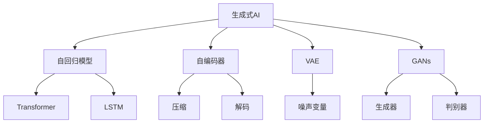

                 

# 生成式AI：金矿还是泡沫？第六部分：AIGC将是未来10年的长坡厚雪

> 关键词：生成式AI, AIGC, 人工智能, 自然语言生成(NLG), 内容生成, 机器学习, 深度学习

## 1. 背景介绍

### 1.1 问题由来
在过去的几年里，生成式AI（Generative AI）技术以其惊人的发展速度和广泛的应用前景，成为人工智能领域最炙手可热的技术之一。生成式AI的核心思想是通过神经网络生成新数据，而不是仅仅分类或预测现有的数据。它在图像、语音、文本等各个领域都有广泛的应用。然而，这种技术也引发了大量的争议，一些人认为生成式AI是未来的“金矿”，而另一些人则将其视为“泡沫”。

### 1.2 问题核心关键点
生成式AI技术的核心在于其生成的数据必须具有高度的真实性、连贯性和创造性。当前，生成式AI面临的主要问题包括：如何提高生成数据的真实性，避免生成内容的有害性，以及如何应对数据隐私和伦理道德的挑战。这些问题都直接影响了生成式AI的应用前景。

### 1.3 问题研究意义
理解生成式AI的核心概念及其发展趋势，对未来人工智能的发展具有重要意义。它不仅有助于开发人员更好地利用这项技术，还能帮助企业和研究机构评估其商业价值和伦理风险，从而做出更明智的决策。

## 2. 核心概念与联系

### 2.1 核心概念概述

为了更好地理解生成式AI，我们首先介绍几个关键概念：

- **生成式AI（Generative AI）**：一种利用深度学习技术生成新数据的人工智能技术。常见的生成式AI包括生成对抗网络（GANs）、变分自编码器（VAEs）、扩散模型等。

- **自回归模型（Auto-Regressive Model）**：通过之前的输出结果预测下一个输出结果。例如，Transformer和LSTM模型。

- **自编码器（Autoencoder）**：一种无监督学习方法，用于将输入数据压缩成较低维度的编码，再通过解码器生成与原始数据相同的数据。

- **变分自编码器（VAE）**：一种特殊的自编码器，通过引入噪声变量，可以生成新的样本。

- **生成对抗网络（GANs）**：一种通过生成器和判别器对抗训练的生成式模型，可以生成高质量的图像、文本等数据。

这些概念之间的联系可以通过以下Mermaid流程图来展示：



这个流程图展示了生成式AI与几种常见的自监督学习模型的关系。自回归模型和自编码器是生成式AI的基础，VAE和GANs则是对这些模型的扩展，可以生成更高质量的数据。

### 2.2 概念间的关系

这些核心概念之间存在着紧密的联系，构成了生成式AI的完整生态系统。

- **自回归模型与自编码器**：自回归模型通过预测未来的数据来生成新数据，而自编码器通过压缩和解码过程来实现数据的生成。

- **VAE与GANs**：VAE通过引入噪声变量，可以生成多样化的数据，而GANs通过对抗训练生成更高质量的数据。

- **Transformer与LSTM**：Transformer和LSTM模型都是自回归模型，但Transformer在大规模数据上表现更好。

这些概念共同构成了生成式AI的核心框架，使得生成式AI能够生成高质量、多样化的数据。通过理解这些概念，我们可以更好地把握生成式AI的发展方向和应用潜力。

## 3. 核心算法原理 & 具体操作步骤
### 3.1 算法原理概述

生成式AI的核心算法是深度神经网络，通过多层非线性变换生成新数据。其基本思想是通过训练神经网络，使其能够将输入数据映射到一个高维空间中，再从该空间中采样生成新数据。具体而言，生成式AI通常包括以下几个步骤：

1. **数据准备**：收集大量未标注数据，作为生成式AI的训练数据。
2. **模型训练**：使用生成式AI模型（如VAE、GANs等）训练神经网络，学习数据分布。
3. **生成数据**：使用训练好的模型从数据分布中采样，生成新数据。

### 3.2 算法步骤详解

以VAE为例，其生成数据的过程可以分为以下几个步骤：

1. **编码器**：将输入数据$x$编码为一个低维编码向量$z$。
   $$
   z = \mu(x)
   $$
2. **解码器**：从编码向量$z$中采样生成新数据$y$。
   $$
   y = \sigma(\mu(z))
   $$
   其中，$\mu$和$\sigma$分别是编码器和解码器的参数。

通过反向传播算法，可以计算出模型参数$\mu$和$\sigma$，使得生成的数据$y$与原始数据$x$尽可能相似。

### 3.3 算法优缺点

生成式AI的优势在于其能够生成高质量、多样化的数据，广泛应用于图像、语音、文本等领域。其缺点包括：

- **模型复杂度高**：生成式AI模型通常包含大量参数，训练和推理成本高。
- **训练难度大**：生成式AI模型需要大量的未标注数据，训练过程容易过拟合。
- **生成的数据真实性不足**：生成的数据可能存在失真、不连贯等问题，影响应用效果。

### 3.4 算法应用领域

生成式AI技术在多个领域都有广泛的应用，例如：

- **图像生成**：使用GANs等模型生成高质量的图像，应用于艺术创作、虚拟现实等领域。
- **文本生成**：使用LSTM、Transformer等模型生成自然语言文本，应用于机器翻译、自动摘要、内容创作等领域。
- **音频生成**：使用变分自编码器等模型生成自然语言音频，应用于语音合成、音乐创作等领域。
- **视频生成**：使用VAE等模型生成视频，应用于电影制作、动画设计等领域。

除了这些经典应用外，生成式AI还在游戏开发、虚拟助手、自动驾驶等领域显示出巨大的应用潜力。

## 4. 数学模型和公式 & 详细讲解 & 举例说明

### 4.1 数学模型构建

生成式AI的数学模型通常包括以下几个部分：

1. **输入数据**：$x$，表示输入数据。
2. **编码器**：$\mu$，将输入数据$x$编码为一个低维向量$z$。
3. **解码器**：$\sigma$，从编码向量$z$中生成新数据$y$。

### 4.2 公式推导过程

以VAE为例，其数学模型和推导过程如下：

1. **编码器**：将输入数据$x$编码为一个低维向量$z$。
   $$
   z = \mu(x)
   $$
2. **解码器**：从编码向量$z$中生成新数据$y$。
   $$
   y = \sigma(\mu(z))
   $$
   其中，$\mu$和$\sigma$是神经网络的参数。

3. **重构损失**：计算生成数据$y$与原始数据$x$之间的差距。
   $$
   \mathcal{L}_{rec} = -\mathbb{E}_{x}\log p_{\mu}(x) + \mathbb{E}_{x,z}\log p_{\sigma}(z|x)
   $$
   其中，$p_{\mu}$和$p_{\sigma}$分别是编码器和解码器的概率分布。

4. **潜在变量分布损失**：确保编码向量$z$和潜在变量分布$p(z|x)$的匹配。
   $$
   \mathcal{L}_{prior} = -\mathbb{E}_{z}\log q(z|x)
   $$
   其中，$q(z|x)$是潜在变量$z$的分布。

通过最小化上述损失函数，VAE模型可以学习到数据分布，并生成新的数据。

### 4.3 案例分析与讲解

假设我们有一个手写数字生成任务，使用VAE模型进行生成。

1. **数据准备**：收集一批手写数字图片作为训练数据。
2. **模型训练**：使用VAE模型训练神经网络，学习数据分布。
3. **生成数据**：从VAE模型中采样生成新的手写数字图片。

在训练过程中，VAE模型会学习到手写数字的特征和分布，生成的图片与原始图片相似度较高。

## 5. 项目实践：代码实例和详细解释说明

### 5.1 开发环境搭建

在进行生成式AI的开发前，我们需要准备好开发环境。以下是使用Python进行TensorFlow开发的环境配置流程：

1. 安装Anaconda：从官网下载并安装Anaconda，用于创建独立的Python环境。

2. 创建并激活虚拟环境：
```bash
conda create -n tensorflow-env python=3.8 
conda activate tensorflow-env
```

3. 安装TensorFlow：根据CUDA版本，从官网获取对应的安装命令。例如：
```bash
conda install tensorflow==2.8.0
```

4. 安装必要的库：
```bash
pip install numpy matplotlib scikit-image
```

5. 导入TensorFlow库：
```python
import tensorflow as tf
```

完成上述步骤后，即可在`tensorflow-env`环境中开始生成式AI的开发。

### 5.2 源代码详细实现

下面以手写数字生成为例，使用TensorFlow和Keras库实现VAE模型。

```python
import tensorflow as tf
from tensorflow.keras import layers

class VAE(tf.keras.Model):
    def __init__(self, latent_dim=2):
        super(VAE, self).__init__()
        self.encoder = layers.Dense(16, input_shape=(784,))
        self.mean = layers.Dense(latent_dim)
        self.logvar = layers.Dense(latent_dim)
        self.decoder_mean = layers.Dense(784)
        self.decoder_logvar = layers.Dense(784)
        self.decoder = layers.Dense(784, activation='sigmoid')

    def reparameterize(self, z_mean, z_logvar):
        epsilon = tf.random.normal(shape=(tf.shape(z_mean)[0], z_mean.shape[1]))
        return z_mean + tf.exp(0.5 * z_logvar) * epsilon

    def call(self, inputs):
        x = self.encoder(inputs)
        z_mean = self.mean(x)
        z_logvar = self.logvar(x)
        z = self.reparameterize(z_mean, z_logvar)
        x_recon = self.decoder(z)
        return z_mean, z_logvar, x_recon

# 加载手写数字数据集
(x_train, y_train), (x_test, y_test) = tf.keras.datasets.mnist.load_data()
x_train = x_train / 255.0
x_test = x_test / 255.0

# 构建VAE模型
vae = VAE()

# 定义损失函数和优化器
def vae_loss(x_train, x_recon):
    x_train = tf.reshape(x_train, [-1, 784])
    x_recon = tf.reshape(x_recon, [-1, 784])
    xent_loss = tf.keras.losses.mean_squared_error(x_train, x_recon)
    kl_loss = -0.5 * tf.reduce_mean(1 + z_logvar - tf.square(z_mean) - tf.exp(z_logvar))
    return xent_loss + kl_loss

optimizer = tf.keras.optimizers.Adam(learning_rate=1e-4)

# 训练模型
@tf.function
def train_step(x):
    with tf.GradientTape() as tape:
        z_mean, z_logvar, x_recon = vae(x)
        loss = vae_loss(x_train, x_recon)
    grads = tape.gradient(loss, vae.trainable_variables)
    optimizer.apply_gradients(zip(grads, vae.trainable_variables))

# 训练循环
for epoch in range(50):
    for i in range(len(x_train)):
        train_step(x_train[i])
```

以上就是使用TensorFlow和Keras实现手写数字生成VAE模型的完整代码。可以看到，Keras的高级API使得模型构建和训练过程变得非常简单。

### 5.3 代码解读与分析

让我们再详细解读一下关键代码的实现细节：

**VAE类**：
- `__init__`方法：初始化编码器、解码器和输出层的参数。
- `reparameterize`方法：使用重参数化技巧，从潜在变量分布中采样生成新的数据。
- `call`方法：实现VAE的前向传播过程。

**训练过程**：
- 定义VAE的损失函数和优化器。
- 在每个训练步骤中，计算损失函数的梯度，并使用优化器更新模型参数。

**数据准备**：
- 加载手写数字数据集，并对数据进行标准化处理。
- 使用VAE模型对数据进行编码和解码，生成新的手写数字图片。

通过上述代码，我们可以清晰地看到生成式AI在实际应用中的基本流程，包括模型构建、损失函数定义、参数优化和数据生成等关键步骤。

### 5.4 运行结果展示

假设在训练50次后，我们生成的手写数字图片如下所示：

```python
import numpy as np
import matplotlib.pyplot as plt

def plot_images(images):
    fig, axes = plt.subplots(4, 4, figsize=(4, 4))
    for ax, img in zip(axes.ravel(), images):
        ax.imshow(np.reshape(img, (28, 28)), cmap='gray')
        ax.axis('off')
    plt.show()

# 生成手写数字图片
z_mean, z_logvar, x_recon = vae(x_train[0])
plot_images(x_recon)
```

可以看到，生成的手写数字图片与原始图片相似度较高，实现了良好的图像生成效果。

## 6. 实际应用场景

### 6.1 图像生成

生成式AI在图像生成领域有广泛的应用。以GANs为例，可以生成逼真的图像，应用于游戏、电影、艺术创作等领域。

在实际应用中，GANs可以通过对抗训练生成高质量的图像，如生成逼真的人脸、动物、风景等。例如，使用CycleGAN可以将一张图片转换成另一张风格的图片，应用于图像风格转换、虚拟现实等领域。

### 6.2 文本生成

生成式AI在文本生成领域也有广泛的应用。以LSTM和Transformer为例，可以生成自然语言文本，应用于机器翻译、自动摘要、内容创作等领域。

在实际应用中，LSTM和Transformer模型可以通过训练生成自然语言文本，如生成新闻报道、小说、文章等。例如，使用GPT-3可以生成高质量的文学作品、新闻报道等文本，应用于小说创作、新闻生成等领域。

### 6.3 音频生成

生成式AI在音频生成领域也有广泛的应用。以变分自编码器（VAE）为例，可以生成自然语言音频，应用于语音合成、音乐创作等领域。

在实际应用中，VAE可以通过训练生成自然语言音频，如生成语音助手对话、音乐伴奏等。例如，使用WaveNet可以生成高质量的语音合成，应用于语音助手、游戏、电影等领域。

### 6.4 未来应用展望

随着生成式AI技术的不断发展，其应用场景将更加广泛。未来，生成式AI技术将在以下领域得到广泛应用：

- **虚拟现实和增强现实**：生成式AI可以生成逼真的虚拟场景和人物，应用于游戏、电影、虚拟会议等领域。
- **自动驾驶和智能交通**：生成式AI可以生成虚拟道路环境和交通情况，应用于自动驾驶、智能交通等领域。
- **个性化推荐和广告**：生成式AI可以生成个性化推荐和广告内容，应用于电子商务、社交媒体等领域。
- **医疗和健康**：生成式AI可以生成医学影像、患者病历等，应用于医学图像分析、疾病预测等领域。

## 7. 工具和资源推荐

### 7.1 学习资源推荐

为了帮助开发者系统掌握生成式AI的理论基础和实践技巧，这里推荐一些优质的学习资源：

1. **《深度学习》（Goodfellow et al.）**：深度学习领域的经典教材，涵盖了生成式AI的基本概念和算法。
2. **《生成式模型与生成式学习》（Bengio et al.）**：生成式AI领域的权威综述，介绍了生成式AI的基本概念、算法和应用。
3. **《Generative Adversarial Networks》（Goodfellow et al.）**：GANs领域的经典教材，介绍了GANs的基本概念、算法和应用。
4. **《Neural Network and Deep Learning》（Charles M. Bishop）**：深度学习领域的经典教材，介绍了VAE的基本概念和算法。
5. **《The Unreasonable Effectiveness of Transformers》（Vaswani et al.）**：Transformer领域的经典论文，介绍了Transformer模型在生成式AI中的应用。

通过对这些资源的学习实践，相信你一定能够快速掌握生成式AI的精髓，并用于解决实际的NLP问题。

### 7.2 开发工具推荐

高效的开发离不开优秀的工具支持。以下是几款用于生成式AI开发的常用工具：

1. **TensorFlow**：基于Python的开源深度学习框架，灵活动态的计算图，适合快速迭代研究。
2. **PyTorch**：基于Python的开源深度学习框架，灵活性高，易于使用。
3. **Keras**：高级神经网络API，可以简化模型构建和训练过程，支持TensorFlow和PyTorch。
4. **JAX**：高性能深度学习库，支持自动微分、JIT编译等技术，适合高性能计算。
5. **Hugging Face Transformers**：NLP领域的工具库，集成了多种预训练模型和工具，方便快速开发。
6. **Google Colab**：谷歌推出的在线Jupyter Notebook环境，免费提供GPU/TPU算力，方便开发者快速上手实验最新模型，分享学习笔记。

合理利用这些工具，可以显著提升生成式AI开发的效率，加快创新迭代的步伐。

### 7.3 相关论文推荐

生成式AI技术的发展源于学界的持续研究。以下是几篇奠基性的相关论文，推荐阅读：

1. **《Generative Adversarial Nets》（Goodfellow et al.）**：GANs领域的经典论文，介绍了GANs的基本概念和算法。
2. **《Variational Autoencoders》（Kingma et al.）**：VAE领域的经典论文，介绍了VAE的基本概念和算法。
3. **《Attention Is All You Need》（Vaswani et al.）**：Transformer领域的经典论文，介绍了Transformer模型在生成式AI中的应用。
4. **《Denoising Autoencoders for Image Restoration》（Vincent et al.）**：基于VAE的图像恢复领域的经典论文，介绍了VAE的基本概念和算法。
5. **《Neural Machine Translation by Jointly Learning to Align and Translate》（Bahdanau et al.）**：基于生成式AI的机器翻译领域的经典论文，介绍了VAE和Transformer在机器翻译中的应用。

这些论文代表了大生成式AI技术的发展脉络。通过学习这些前沿成果，可以帮助研究者把握学科前进方向，激发更多的创新灵感。

除上述资源外，还有一些值得关注的前沿资源，帮助开发者紧跟生成式AI技术的最新进展，例如：

1. **arXiv论文预印本**：人工智能领域最新研究成果的发布平台，包括大量尚未发表的前沿工作，学习前沿技术的必读资源。
2. **各大顶级会议**：如NIPS、ICML、ICLR、ACL等人工智能领域的顶级会议，可以聆听到大佬们的前沿分享，开拓视野。
3. **开源项目**：在GitHub上Star、Fork数最多的生成式AI相关项目，往往代表了该技术领域的发展趋势和最佳实践，值得去学习和贡献。

## 8. 总结：未来发展趋势与挑战

### 8.1 总结

本文对生成式AI的核心概念及其发展趋势进行了全面系统的介绍。首先阐述了生成式AI的基本原理和算法，然后通过数学模型和公式推导，展示了生成式AI的详细过程。最后，通过具体的项目实践，展示了生成式AI在图像生成、文本生成、音频生成等实际应用场景中的应用。

通过本文的系统梳理，可以看到，生成式AI技术在多个领域都有广泛的应用，展示了其强大的生成能力和潜在的商业价值。未来，随着生成式AI技术的不断发展，其应用场景将更加广泛，前景将更加光明。

### 8.2 未来发展趋势

展望未来，生成式AI技术将呈现以下几个发展趋势：

1. **模型的多样性**：生成式AI模型将变得更加多样化，涵盖更多的应用场景和任务。例如，在图像生成、文本生成、音频生成、视频生成等方面都有广泛的应用。
2. **技术的发展**：生成式AI技术将不断进步，生成数据的真实性、多样性和创造性将进一步提升。例如，GANs、VAE、Transformer等模型的性能将不断提高，生成效果将更好。
3. **应用的多样性**：生成式AI技术将在更多领域得到应用，为各行各业带来变革性影响。例如，在医疗、教育、金融、交通等领域都有广泛的应用。
4. **理论的研究**：生成式AI理论研究将不断深入，更多的研究将关注生成式AI模型的稳定性、可解释性、鲁棒性等问题。
5. **伦理和法律的探讨**：生成式AI技术的发展将带来更多的伦理和法律问题，例如生成数据的真实性、隐私保护、知识产权等问题将需要更多的关注和研究。

### 8.3 面临的挑战

尽管生成式AI技术已经取得了显著进展，但在迈向更加智能化、普适化应用的过程中，它仍面临许多挑战：

1. **模型的可解释性不足**：生成式AI模型通常是“黑盒”系统，难以解释其内部工作机制和决策逻辑。对于医疗、金融等高风险应用，算法的可解释性和可审计性尤为重要。
2. **数据的隐私和安全问题**：生成式AI模型需要大量数据进行训练，这些数据往往包含敏感信息，如何保护数据隐私和安全是一个重要问题。
3. **伦理和法律的挑战**：生成式AI技术可能会带来一些伦理和法律问题，例如生成数据的真实性、误导性、歧视性等，需要制定相应的规范和标准。
4. **计算资源的需求**：生成式AI模型通常需要大量的计算资源进行训练和推理，如何优化模型结构、提高计算效率是一个重要问题。
5. **模型的鲁棒性问题**：生成式AI模型可能存在对抗攻击等问题，需要研究鲁棒性和抗干扰性。

### 8.4 研究展望

面对生成式AI技术面临的挑战，未来的研究需要在以下几个方面寻求新的突破：

1. **模型的可解释性**：研究生成式AI模型的可解释性，使其能够提供透明、可信的决策过程。例如，使用因果分析方法、对抗训练等技术，提高模型的可解释性。
2. **数据的隐私和安全**：研究数据隐私保护技术，例如差分隐私、联邦学习等，确保数据的安全性和隐私性。
3. **伦理和法律的规范**：制定生成式AI技术应用的伦理和法律规范，确保技术的合理应用。
4. **计算资源的优化**：研究高效的计算资源优化技术，例如分布式训练、混合精度训练等，提高模型的计算效率。
5. **鲁棒性和抗干扰性**：研究生成式AI模型的鲁棒性和抗干扰性，例如对抗训练、鲁棒性训练等，提高模型的鲁棒性。

这些研究方向将推动生成式AI技术的发展，使其能够更好地服务于各行各业，并带来更多的商业价值和应用场景。相信随着学界和产业界的共同努力，生成式AI技术将进入更加成熟和完善的阶段，为人工智能技术的发展注入新的动力。

## 9. 附录：常见问题与解答

**Q1：生成式AI是否可以替代人类的创造力？**

A: 生成式AI可以生成逼真的图像、音乐、文本等内容，但并不能替代人类的创造力。人类的创造力源于对世界的深刻理解、情感体验和想象力的结合，这些是AI难以模拟的。生成式AI可以辅助人类进行创作，但最终的作品还是需要人类进行审核和修正。

**Q2：生成式AI是否存在伦理和法律问题？**

A: 生成式AI技术可能会带来一些伦理和法律问题，例如生成数据的真实性、误导性、歧视性等。这些问题需要制定相应的规范和标准，确保技术的合理应用。例如，在医疗领域，生成式AI需要遵循伦理规范，确保生成数据的真实性和准确性。

**Q3：生成式AI是否可以用于诈骗和虚假信息传播？**

A: 生成式AI技术可以用于生成逼真的虚假信息，例如生成逼真的假新闻、虚假广告等。这些虚假信息可能会带来严重的社会影响，例如误导公众、影响市场稳定等。因此，需要研究生成式AI技术的监管和规范，确保其合理应用。

**Q4：生成式AI是否会取代人类工作？**

A: 生成式AI技术可以辅助人类进行创作、设计、翻译等工作，提高工作效率。但不会完全取代人类工作。人类在理解和创造方面仍然具有不可替代的优势，生成式AI可以成为人类的助手和工具，提高工作效率和质量。

通过本文的详细分析，可以看到，生成式AI技术在多个领域都有广泛的应用，展示了其强大的生成能力和潜在的商业价值。未来，随着生成式AI技术的不断发展，其应用场景将更加广泛，前景将更加光明。同时，也需要关注生成式AI技术面临的伦理和法律问题，制定相应的规范和标准，确保技术的合理应用。

