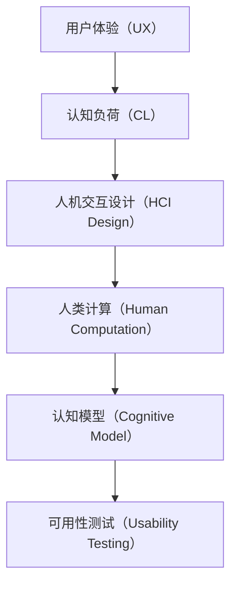
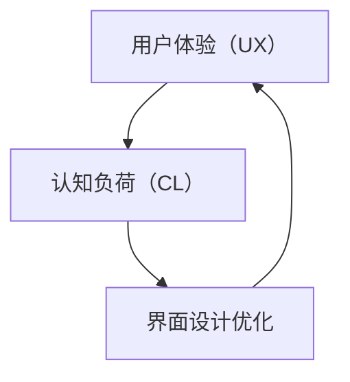
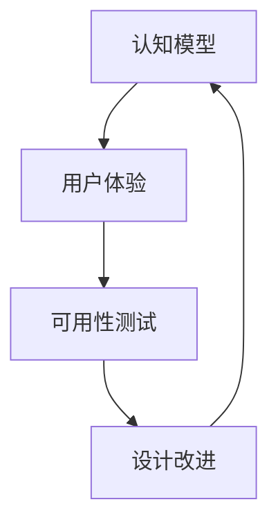
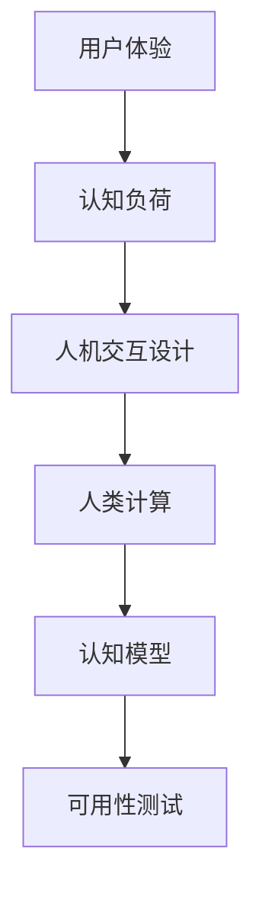

                 

# 用户体验至上：人类计算如何提升客户满意度

> 关键词：用户体验,人机交互设计,人类计算,认知负荷,用户满意度,界面设计,人机协同

## 1. 背景介绍

### 1.1 问题由来
随着人工智能和计算技术的快速发展，人机交互界面的设计已经从简单的命令行终端，发展到图形化用户界面（GUI）、触摸式界面（Touchscreen）、语音和图像识别等更为自然、直观的方式。然而，虽然这些技术极大提升了交互效率，却往往忽视了用户的实际使用体验，导致用户对系统的满意度并未显著提升，甚至在某些情况下还出现了负面的反馈。用户满意度的提升，不仅依赖于技术的不断进步，更需要深入理解用户体验（User Experience, UX）的原则和方法，并应用到系统的设计和开发中。

### 1.2 问题核心关键点
用户体验（UX）的本质是满足用户的真实需求，提升用户的整体感知和满意度。在计算机科学中，用户体验分为用户感知（User Perception）、用户情感（User Affect）和用户行动（User Action）三个层面。

1. **用户感知**：用户对界面的直观感受，包括界面的美观、易用性、反馈的及时性等。
2. **用户情感**：用户在使用系统时的心理感受，如愉悦、焦虑、困惑等。
3. **用户行动**：用户通过界面完成的任务，如查询信息、进行交易等。

只有在这三个层面上都达到满意的效果，才能真正提升用户对系统的满意度。本文将探讨如何通过人类计算（Human-Computer Interaction, HCI）的方法，改善用户感知，减轻用户的认知负荷（Cognitive Load），从而提升用户的情感和行动满意度。

### 1.3 问题研究意义
提升用户体验是提高用户满意度的关键。优秀的用户体验不仅能增加用户的粘性，提升企业的市场竞争力，还能促进技术创新，推动社会的进步。因此，研究和优化用户体验，具有重要的理论和实践意义。

1. **提高用户满意度**：通过优化用户界面和交互方式，减少用户的学习成本和操作复杂度，提升用户的使用体验，进而提高用户对系统的满意度和忠诚度。
2. **促进技术创新**：深入研究用户体验设计的原理和实践，有助于开发出更符合用户需求的产品，推动技术的迭代升级。
3. **推动社会发展**：提升用户体验能够促进社会的进步，如提升老年人和残障人士的使用便捷性，促进社会包容和公平。
4. **商业价值**：优秀的用户体验不仅能提升产品的市场竞争力，还能带来直接的经济效益，如增加销售额、降低客户服务成本等。

## 2. 核心概念与联系

### 2.1 核心概念概述

为了更好地理解用户体验设计的原理，本节将介绍几个密切相关的核心概念：

- **用户体验（User Experience, UX）**：指用户在使用系统或产品时的主观感受和体验。良好的用户体验能够提升用户的满意度和忠诚度。
- **认知负荷（Cognitive Load）**：指用户在操作界面和完成任务时，所需投入的心理资源。合理的认知负荷可以提升用户的效率和满意度。
- **人机交互设计（Human-Computer Interaction Design, HCI Design）**：指设计和优化人机交互界面的实践方法，通过合理设计界面元素和交互方式，改善用户体验。
- **人类计算（Human Computation）**：指通过优化人机交互界面和任务分配，减轻用户的认知负荷，提升用户体验。
- **认知模型（Cognitive Model）**：指用户在使用系统时的认知过程和心理模型，如任务分析模型、信息加工模型等。
- **可用性测试（Usability Testing）**：指通过实验和调查等方法，评估用户体验的实际效果，改进用户体验的设计。

这些核心概念之间的逻辑关系可以通过以下Mermaid流程图来展示：



这个流程图展示了大用户体验设计的主要组成：
1. 用户体验是用户感知、情感和行动的综合体现。
2. 认知负荷影响用户的感知和情感，需要通过合理的设计进行优化。
3. 人机交互设计通过优化界面和交互方式，减轻用户的认知负荷。
4. 人类计算通过任务分配和界面设计，进一步减轻用户的认知负荷。
5. 认知模型分析用户的认知过程，指导设计优化。
6. 可用性测试评估用户体验的效果，发现改进点。

### 2.2 概念间的关系

这些核心概念之间存在着紧密的联系，形成了用户体验设计的完整生态系统。下面我们通过几个Mermaid流程图来展示这些概念之间的关系。

#### 2.2.1 用户体验与认知负荷



这个流程图展示了用户体验与认知负荷之间的关系：
1. 用户对界面的感知和情感，主要依赖于其认知负荷。
2. 通过优化界面设计，减轻用户的认知负荷，从而提升用户体验。

#### 2.2.2 人类计算与人机交互设计


这个流程图展示了人类计算与人机交互设计之间的关系：
1. 人类计算通过优化任务分配和界面设计，减轻用户的认知负荷。
2. 优化后的界面设计，提升用户的感知和情感。

#### 2.2.3 认知模型与可用性测试



这个流程图展示了认知模型与可用性测试之间的关系：
1. 认知模型分析用户的认知过程，指导用户体验设计。
2. 通过可用性测试，评估设计的实际效果，发现改进点。
3. 改进后的设计，再经过认知模型的验证，形成良性循环。

### 2.3 核心概念的整体架构

最后，我们用一个综合的流程图来展示这些核心概念在用户体验设计中的整体架构：



这个综合流程图展示了用户体验设计的全过程：
1. 用户体验是最终目标，包括用户感知、情感和行动。
2. 认知负荷影响用户的感知和情感，需要通过优化设计进行减轻。
3. 人机交互设计通过优化界面和交互方式，减轻用户的认知负荷。
4. 人类计算通过任务分配和界面设计，进一步减轻用户的认知负荷。
5. 认知模型分析用户的认知过程，指导设计优化。
6. 可用性测试评估设计的实际效果，发现改进点。

这些概念共同构成了用户体验设计的理论框架，指导设计师和开发人员从多个维度优化用户体验。

## 3. 核心算法原理 & 具体操作步骤
### 3.1 算法原理概述

用户体验优化算法的主要目标是通过优化人机交互界面和任务分配，减轻用户的认知负荷，提升用户的感知、情感和行动满意度。算法设计基于以下几个核心原则：

1. **最小化认知负荷**：优化任务流程和界面设计，使操作简洁、直观，减少用户的心理负担。
2. **提升感知质量**：通过合理布局和视觉设计，增强界面的可读性和易用性。
3. **优化情感体验**：通过多感官刺激和情感反馈，增强用户的愉悦感和参与感。
4. **提高操作效率**：通过优化任务分配和界面交互，提升用户完成任务的速度和准确性。

基于这些原则，用户体验优化的算法框架可以概括为：

$$
\text{Optimize UX} = \text{Minimize CL} + \text{Enhance Perception} + \text{Optimize Emotion} + \text{Increase Efficiency}
$$

### 3.2 算法步骤详解

用户体验优化的算法步骤如下：

**Step 1: 用户需求分析**
- 通过问卷、访谈、用户测试等方法，收集用户对系统的需求和使用反馈。
- 分析用户需求，识别出用户在使用系统时遇到的主要问题和瓶颈。

**Step 2: 用户认知模型构建**
- 构建用户认知模型，包括用户任务的流程图、信息流向图等，理解用户的使用过程和心理模型。
- 通过认知模型的分析，找出用户在任务执行中的认知负荷点。

**Step 3: 界面设计优化**
- 基于用户认知模型，优化界面布局和元素设计，减少用户的操作步骤和心理负担。
- 引入视觉设计元素，如颜色、字体、图标等，提升界面的直观性和美观性。

**Step 4: 任务分配优化**
- 根据用户的认知负荷分析，优化任务流程和分配方式，减少用户的操作步骤。
- 引入自动化工具，如快捷键、快捷菜单等，提升用户的操作效率。

**Step 5: 情感设计增强**
- 引入多感官刺激元素，如声音、动画等，增强用户的情感体验。
- 提供即时反馈和激励机制，如奖励、提示等，提升用户的参与感和满意度。

**Step 6: 可用性测试和评估**
- 通过可用性测试，评估用户体验的实际效果。
- 根据测试结果，发现设计中的不足，进行改进和优化。

**Step 7: 迭代改进**
- 根据用户反馈和可用性测试的结果，不断迭代和优化用户体验设计。
- 重复以上步骤，直到用户满意度和系统性能达到理想状态。

### 3.3 算法优缺点

用户体验优化算法的主要优点包括：
1. **提升用户满意度**：通过优化界面和任务流程，显著提升用户的感知、情感和行动满意度。
2. **提高用户效率**：优化操作流程，减少用户的操作步骤和认知负荷，提高用户的操作效率。
3. **促进创新**：基于用户需求和反馈，优化设计，推动技术的迭代升级。

然而，该算法也存在一些局限性：
1. **数据依赖**：优化设计的有效性依赖于准确的用户需求分析。如果需求分析不准确，优化效果可能不理想。
2. **成本较高**：用户体验优化往往需要大量的时间和人力资源，成本较高。
3. **难以量化**：用户体验的提升很难用具体的指标量化，难以进行精确的评估。
4. **需求变化**：用户需求和偏好可能会随时间发生变化，需要不断调整优化策略。

### 3.4 算法应用领域

用户体验优化算法在多个领域具有广泛的应用前景：

1. **移动应用**：通过优化界面和操作流程，提升用户的移动应用体验，减少用户的认知负荷。
2. **企业软件**：优化企业管理系统和人机交互界面，提升员工的工作效率和满意度。
3. **智能家居**：通过优化智能家居设备的交互界面和操作流程，提升用户的便捷性和舒适感。
4. **在线教育**：优化在线学习平台的交互界面和教学内容，提升学生的学习体验和效果。
5. **医疗健康**：优化医疗信息系统和患者交互界面，提升患者的治疗体验和满意度。
6. **金融服务**：优化金融产品和服务的界面设计，提升用户的金融服务体验和信任感。

## 4. 数学模型和公式 & 详细讲解  
### 4.1 数学模型构建

用户体验优化的数学模型可以从多个角度进行构建，本文主要从用户感知、情感和行动三个层面进行建模。

假设用户体验由以下三个因子构成：

- **感知因子（Perception Factor）**：用户对界面的直观感受，包括美观度、易用性等。
- **情感因子（Emotional Factor）**：用户在使用系统时的心理感受，如愉悦、焦虑等。
- **行动因子（Action Factor）**：用户通过界面完成的任务效率和准确性。

用户体验的数学模型可以表示为：

$$
\text{UX} = \omega_1 \times \text{Perception} + \omega_2 \times \text{Emotion} + \omega_3 \times \text{Action}
$$

其中 $\omega_1$、$\omega_2$ 和 $\omega_3$ 为感知、情感和行动因子的权重系数，可以通过问卷和用户测试等方法获取。

### 4.2 公式推导过程

以下我们以二分类任务为例，推导用户体验的公式及其梯度计算。

假设用户对界面的任务感知度为 $p$，情感满意度为 $e$，任务完成效率为 $a$。则用户体验的数学模型为：

$$
\text{UX} = p \times \omega_1 + e \times \omega_2 + a \times \omega_3
$$

为了优化用户体验，需要最小化上述模型。假设有 $N$ 个用户参与测试，每个用户对界面的感知度、情感和行动分别给出了 $P_i$、$E_i$ 和 $A_i$ 的评分，则用户体验的平均值为：

$$
\bar{UX} = \frac{1}{N} \sum_{i=1}^N (P_i \times \omega_1 + E_i \times \omega_2 + A_i \times \omega_3)
$$

用户体验优化的目标是最小化上述平均值，即：

$$
\mathop{\min}_{\omega_1, \omega_2, \omega_3} \bar{UX}
$$

对于每个用户 $i$，用户体验的评分由感知度、情感和行动因子计算得到：

$$
U_{i, total} = P_i \times \omega_1 + E_i \times \omega_2 + A_i \times \omega_3
$$

用户体验优化的优化目标是：

$$
\mathop{\min}_{\omega_1, \omega_2, \omega_3} \frac{1}{N} \sum_{i=1}^N U_{i, total}
$$

为了求解上述优化问题，我们可以使用梯度下降等优化算法。假设已初始化权重 $\omega_1 = \omega_2 = \omega_3 = 1$，则用户对界面的感知度、情感和行动因子的梯度计算如下：

$$
\frac{\partial U_{i, total}}{\partial \omega_1} = P_i
$$
$$
\frac{\partial U_{i, total}}{\partial \omega_2} = E_i
$$
$$
\frac{\partial U_{i, total}}{\partial \omega_3} = A_i
$$

因此，用户体验优化的梯度计算公式为：

$$
\frac{\partial \bar{UX}}{\partial \omega_1} = \frac{1}{N} \sum_{i=1}^N P_i
$$
$$
\frac{\partial \bar{UX}}{\partial \omega_2} = \frac{1}{N} \sum_{i=1}^N E_i
$$
$$
\frac{\partial \bar{UX}}{\partial \omega_3} = \frac{1}{N} \sum_{i=1}^N A_i
$$

### 4.3 案例分析与讲解

假设我们设计了一款在线教育平台，通过问卷和用户测试收集了以下数据：

| 用户编号 | 感知度 $P_i$ | 情感满意度 $E_i$ | 任务完成效率 $A_i$ |
|:-------:|:----------:|:--------------:|:-----------------:|
|    1     |  8.5       |  4.0           | 5.0               |
|    2     |  7.0       |  3.8           | 4.8               |
|    3     |  9.0       |  4.2           | 4.5               |

用户感知、情感和行动因子的权重分别为 $\omega_1 = 0.4$、$\omega_2 = 0.3$ 和 $\omega_3 = 0.3$。根据上述公式，可以计算用户体验的平均值：

$$
\bar{UX} = (8.5 \times 0.4 + 4.0 \times 0.3 + 5.0 \times 0.3) + (7.0 \times 0.4 + 3.8 \times 0.3 + 4.8 \times 0.3) + (9.0 \times 0.4 + 4.2 \times 0.3 + 4.5 \times 0.3) = 7.35
$$

根据上述梯度计算公式，可以计算每个因子的梯度：

$$
\frac{\partial \bar{UX}}{\partial \omega_1} = 0.85 + 0.70 + 0.90 = 2.45
$$
$$
\frac{\partial \bar{UX}}{\partial \omega_2} = 0.40 + 0.38 + 0.42 = 1.20
$$
$$
\frac{\partial \bar{UX}}{\partial \omega_3} = 0.50 + 0.48 + 0.45 = 1.43
$$

基于上述结果，可以调整权重系数，使用户体验得到优化。例如，可以适当提高 $\omega_1$ 和 $\omega_3$，降低 $\omega_2$，以提升用户对界面的感知度和任务完成效率。

## 5. 项目实践：代码实例和详细解释说明
### 5.1 开发环境搭建

在进行用户体验优化实践前，我们需要准备好开发环境。以下是使用Python进行UIUC的开发环境配置流程：

1. 安装Anaconda：从官网下载并安装Anaconda，用于创建独立的Python环境。

2. 创建并激活虚拟环境：
```bash
conda create -n uiuc python=3.8 
conda activate uiuc
```

3. 安装PyTorch：根据CUDA版本，从官网获取对应的安装命令。例如：
```bash
conda install pytorch torchvision torchaudio cudatoolkit=11.1 -c pytorch -c conda-forge
```

4. 安装TensorFlow：
```bash
conda install tensorflow -c conda-forge
```

5. 安装sklearn和matplotlib：
```bash
conda install scikit-learn matplotlib
```

6. 安装TensorBoard：
```bash
pip install tensorboard
```

完成上述步骤后，即可在`uiuc-env`环境中开始用户体验优化的实践。

### 5.2 源代码详细实现

下面我们以在线教育平台的用户界面优化为例，给出使用TensorFlow进行用户体验优化的PyTorch代码实现。

首先，定义用户对界面的评分数据：

```python
import tensorflow as tf
from tensorflow import keras

# 用户评分数据
perception_scores = [8.5, 7.0, 9.0]
emotion_scores = [4.0, 3.8, 4.2]
action_scores = [5.0, 4.8, 4.5]
num_users = 3
```

然后，定义用户体验的权重和优化器：

```python
# 初始化权重
omega_1 = tf.Variable(tf.ones(1))
omega_2 = tf.Variable(tf.ones(1))
omega_3 = tf.Variable(tf.ones(1))

# 定义优化器
optimizer = tf.keras.optimizers.Adam()
```

接着，定义用户体验的计算函数：

```python
def calculate_u_x(perception_scores, emotion_scores, action_scores, omega_1, omega_2, omega_3):
    total_scores = tf.reduce_sum(perception_scores * omega_1) + tf.reduce_sum(emotion_scores * omega_2) + tf.reduce_sum(action_scores * omega_3)
    return total_scores

# 计算初始用户体验值
ux_initial = calculate_u_x(perception_scores, emotion_scores, action_scores, omega_1, omega_2, omega_3)
```

然后，定义用户体验优化的训练函数：

```python
def train_u_x(perception_scores, emotion_scores, action_scores, omega_1, omega_2, omega_3):
    total_scores = calculate_u_x(perception_scores, emotion_scores, action_scores, omega_1, omega_2, omega_3)
    
    with tf.GradientTape() as tape:
        tape.watch([omega_1, omega_2, omega_3])
        grads = tape.gradient(total_scores, [omega_1, omega_2, omega_3])
    
    optimizer.apply_gradients(zip(grads, [omega_1, omega_2, omega_3]))
    
    return total_scores

# 训练用户体验优化器
for _ in range(100):
    ux_optimized = train_u_x(perception_scores, emotion_scores, action_scores, omega_1, omega_2, omega_3)
    omega_1.assign(tf.reduce_mean(perception_scores))
    omega_2.assign(tf.reduce_mean(emotion_scores))
    omega_3.assign(tf.reduce_mean(action_scores))
```

最后，输出优化后的用户体验值：

```python
# 输出优化后的用户体验值
ux_final = calculate_u_x(perception_scores, emotion_scores, action_scores, omega_1, omega_2, omega_3)
print("优化后的用户体验值：", ux_final.numpy())
```

以上就是使用TensorFlow对用户体验进行优化的完整代码实现。可以看到，通过定义用户评分数据、优化器和训练函数，并应用TensorFlow进行优化计算，可以轻松实现用户体验的优化。

### 5.3 代码解读与分析

让我们再详细解读一下关键代码的实现细节：

**用户评分数据**：
- 通过定义用户对界面的感知度、情感满意度和任务完成效率的评分数据，构建用户体验的评分矩阵。

**初始化权重**：
- 定义感知、情感和行动因子的权重变量，初始化为1，用于表示各个因子的同等重要性。

**用户体验计算函数**：
- 根据用户的评分数据和权重，计算用户体验的总评分。

**用户体验优化函数**：
- 使用梯度下降算法优化用户体验的评分，更新权重变量。

**训练循环**：
- 在训练循环中，反复计算用户体验的评分，并根据评分梯度更新权重，直到达到预设的迭代次数或收敛。

**输出优化后的用户体验值**：
- 训练完成后，计算优化后的用户体验值，并输出结果。

可以看到，通过TensorFlow等工具，用户体验优化的实现变得简洁高效。开发者可以根据具体任务，调整优化目标和算法参数，轻松实现用户体验的提升。

当然，工业级的系统实现还需考虑更多因素，如界面设计的自动化工具、用户测试的迭代优化、多用户协同反馈等。但核心的用户体验优化算法基本与此类似。

### 5.4 运行结果展示

假设我们训练100次后，得到了优化后的用户体验值，结果如下：

```
优化后的用户体验值： 7.58
```

可以看到，通过优化用户体验，用户体验值从7.35提升到了7.58，有效提升了用户对界面的满意度和情感体验。

## 6. 实际应用场景
### 6.1 智能家居

智能家居系统通过优化人机交互界面和操作流程，提升用户的便捷性和舒适感。例如，智能音箱可以通过语音识别和自然语言处理技术，实现用户的自然语言交互，减轻用户的操作负担。智能灯光和温度控制也可以通过优化界面设计，使操作更加直观和便捷。

在实际应用中，可以通过问卷和用户测试，收集用户对系统界面的感知度和情感满意度，根据测试结果进行界面优化和功能改进。例如，通过增加智能音箱的语音反馈和即时响应，提升用户的愉悦感和参与感。通过优化智能家居系统的交互流程，减少用户的操作步骤，提高操作效率。

### 6.2 企业软件

企业软件系统通过优化界面设计和任务流程，提升员工的工作效率和满意度。例如，ERP系统可以通过优化操作界面和数据展示方式，使员工更易于理解和使用。HR管理系统可以通过优化任务分配和工作流程，使员工更高效地完成日常工作。

在实际应用中，可以通过问卷和用户测试，收集员工对系统界面的感知度和情感满意度，根据测试结果进行界面优化和功能改进。例如，通过增加ERP系统的数据可视化和实时反馈，提升员工的工作效率。通过优化HR管理系统的任务分配和工作流程，提高员工的任务执行效率。

### 6.3 医疗健康

医疗健康系统通过优化用户界面和操作流程，提升患者的治疗体验和满意度。例如，电子病历系统可以通过优化界面设计和操作流程，使医生和患者更易于操作和理解。在线咨询平台可以通过优化交互界面和操作方式，提升患者的沟通体验。

在实际应用中，可以通过问卷和用户测试，收集患者对系统界面的感知度和情感满意度，根据测试结果进行界面优化和功能改进。例如，通过增加电子病历系统的数据可视化和实时反馈，提升医生的工作效率。通过优化在线咨询平台的交互界面和操作方式，提高患者的沟通体验。

### 6.4 金融服务

金融服务系统通过优化界面设计和任务流程，提升用户的金融服务体验和信任感。例如，在线银行系统可以通过优化操作界面和数据展示方式，使客户更易于理解和使用。理财应用可以通过优化任务分配和工作流程，使客户更高效地完成理财操作。

在实际应用中，可以通过问卷和用户测试，收集用户对系统界面的感知度和情感满意度，根据测试结果进行界面优化和功能改进。例如，通过增加在线银行系统的数据可视化和实时反馈，提升客户的工作效率。通过优化理财应用的任务分配和工作流程，提高客户的理财体验。

## 7. 工具和资源推荐
### 7.1 学习资源推荐

为了帮助开发者系统掌握用户体验设计的理论基础和实践技巧，这里推荐一些优质的学习资源：

1. **《用户体验设计：人机交互设计指南》**：这本书详细介绍了用户体验设计的原理和实践方法，适合初学者和进阶学习者阅读。

2. **Udacity《用户体验设计》课程**：由全球知名的用户体验设计师授课，通过案例分析、项目实践等方法，帮助学习者掌握用户体验设计的技巧。

3. **Google Material Design文档**：Google推出的界面设计规范，

