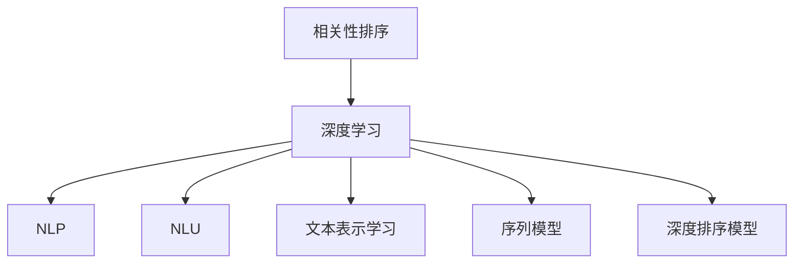
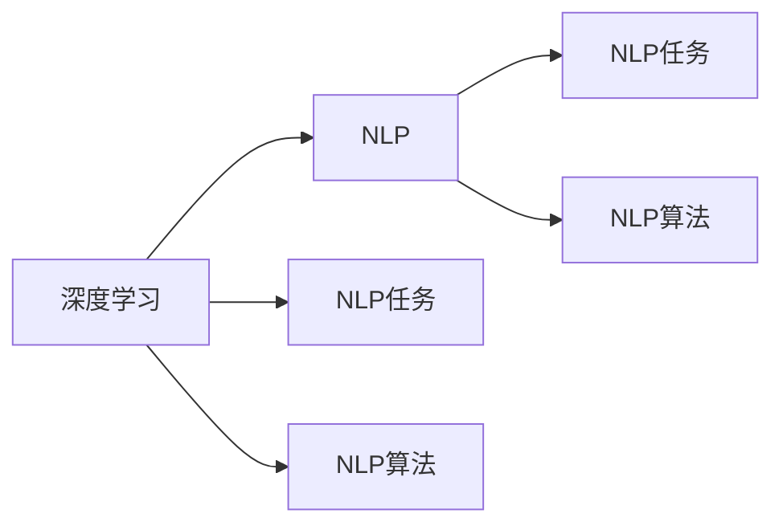
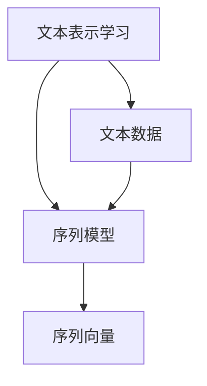
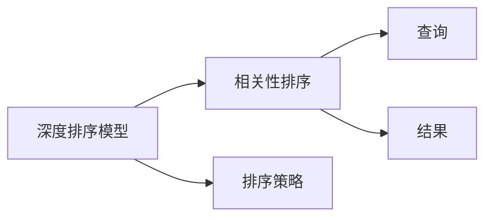
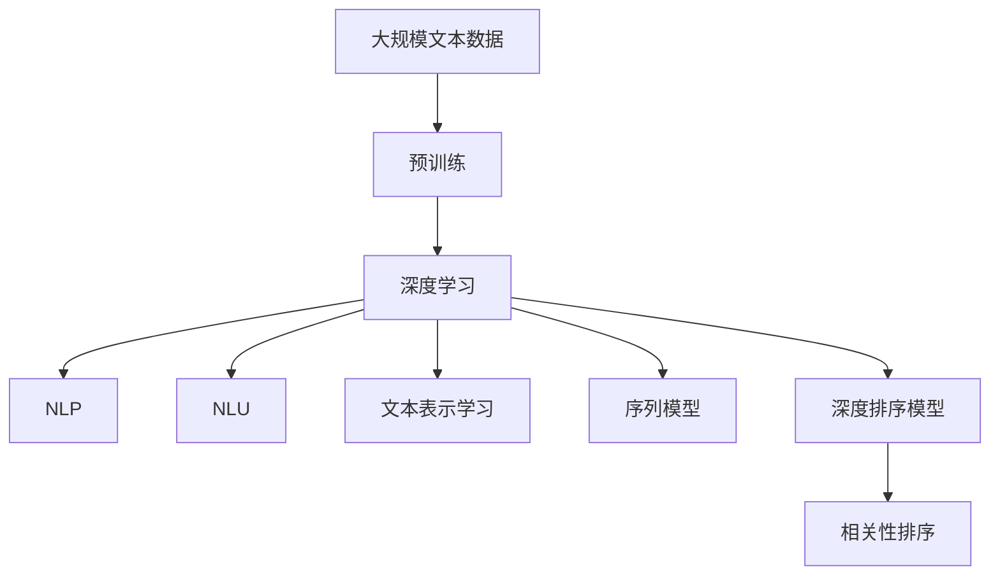

                 

# 相关性排序：AI提升搜索体验

> 关键词：相关性排序,AI,搜索体验,算法原理,项目实践,未来展望

## 1. 背景介绍

### 1.1 问题由来
在互联网时代，搜索引擎已经成为了人们获取信息的重要工具。传统的搜索引擎依赖于关键词匹配算法，虽然有效但往往忽略内容的语义相关性和用户查询意图的多样性。随着自然语言处理技术的发展，基于人工智能的相关性排序方法逐渐兴起，并展现出巨大的潜力。

### 1.2 问题核心关键点
目前，基于AI的相关性排序方法主要利用深度学习技术，通过训练相关性预测模型来提升搜索结果的质量。该方法的核心思想是：将搜索结果与用户查询的语义相关性进行建模，并使用机器学习模型进行预测，从而排序出最符合用户需求的搜索结果。

### 1.3 问题研究意义
AI驱动的相关性排序技术不仅能够提升搜索体验，还能增强信息检索的精准度，帮助用户快速找到所需信息。特别是在智能问答、内容推荐、广告投放等场景中，相关性排序技术的应用能显著提高系统的整体效率和用户满意度。

## 2. 核心概念与联系

### 2.1 核心概念概述

为更好地理解基于AI的相关性排序方法，本节将介绍几个密切相关的核心概念：

- 相关性排序(Relevance Ranking)：指将搜索结果与用户查询按照相关性进行排序的过程。核心在于准确判断搜索结果与查询的匹配程度。
- 深度学习(Deep Learning)：一类基于多层神经网络的机器学习技术，能够自动从数据中学习复杂的模式和特征。
- 自然语言处理(NLP)：研究如何让计算机理解和处理自然语言的技术，包括文本分类、情感分析、命名实体识别等。
- 自然语言理解(NLU)：指计算机能够理解和解释自然语言的能力，是相关性排序的关键技术之一。
- 文本表示学习(Text Representation Learning)：通过深度学习模型将文本数据转换为计算机可处理的形式，如词向量、句向量等。
- 序列模型(Sequence Model)：如循环神经网络(RNN)、长短时记忆网络(LSTM)、Transformer等，常用于处理序列数据，如文本数据。
- 深度排序模型(Deep Ranking Model)：利用深度神经网络进行排序的模型，可以学习到更复杂的排序策略。

这些核心概念之间的逻辑关系可以通过以下Mermaid流程图来展示：



这个流程图展示了大语言模型微调过程中各个核心概念的关系和作用：

1. 相关性排序依赖于深度学习技术，利用NLP和NLU技术从文本中提取语义信息。
2. 文本表示学习通过序列模型将文本数据转换为向量形式，用于计算语义相似度。
3. 深度排序模型进一步对排序任务进行建模，预测搜索结果的相关性得分。

### 2.2 概念间的关系

这些核心概念之间存在着紧密的联系，形成了相关性排序的完整生态系统。下面我通过几个Mermaid流程图来展示这些概念之间的关系。

#### 2.2.1 深度学习与NLP的联系



这个流程图展示了深度学习和NLP之间的联系。深度学习提供了强大的学习能力，而NLP任务和算法则是深度学习的具体应用。

#### 2.2.2 文本表示学习与序列模型的关系



这个流程图展示了文本表示学习和序列模型之间的关系。文本表示学习通过序列模型将文本数据转换为向量形式，用于后续的语义计算和排序。

#### 2.2.3 深度排序模型与相关性排序的关系



这个流程图展示了深度排序模型与相关性排序的关系。深度排序模型预测搜索结果的相关性得分，用于对搜索结果进行排序。

### 2.3 核心概念的整体架构

最后，我们用一个综合的流程图来展示这些核心概念在大语言模型微调过程中的整体架构：



这个综合流程图展示了从预训练到相关性排序的完整过程。深度学习模型从预训练中学习通用语言表示，通过NLP和NLU技术提取语义信息，利用文本表示学习和序列模型将文本转换为向量形式，最终由深度排序模型进行排序。

## 3. 核心算法原理 & 具体操作步骤
### 3.1 算法原理概述

基于AI的相关性排序方法主要通过训练一个深度神经网络模型来实现。其核心思想是：将用户查询和搜索结果分别表示为向量形式，计算它们之间的语义相似度，并根据相似度大小进行排序。

具体来说，相关性排序方法分为两个步骤：

1. 对用户查询进行编码，得到查询向量。
2. 对搜索结果进行编码，得到结果向量。
3. 计算查询向量和结果向量之间的语义相似度，按照相似度大小进行排序。

### 3.2 算法步骤详解

基于AI的相关性排序算法主要包括以下几个关键步骤：

**Step 1: 准备数据集**
- 收集用户查询和搜索结果，对搜索结果进行文本清洗和标注，划分为训练集、验证集和测试集。

**Step 2: 设计模型架构**
- 选择合适的深度学习模型作为排序模型。
- 设计模型输入和输出层，选择合适的损失函数。

**Step 3: 训练模型**
- 使用训练集对模型进行有监督训练，优化模型参数。
- 在验证集上评估模型性能，调整超参数。

**Step 4: 评估模型**
- 在测试集上评估模型性能，对比训练前后的效果提升。
- 分析模型预测结果，找出不足之处。

**Step 5: 部署模型**
- 将训练好的模型保存到服务器或云端，进行实时排序。
- 与搜索引擎系统集成，部署到实际应用中。

### 3.3 算法优缺点

基于AI的相关性排序方法具有以下优点：

1. 高效准确。能够自动从数据中学习复杂的匹配模式，提升搜索结果的准确性和相关性。
2. 通用性强。适用于各种NLP任务，如文本分类、情感分析、问答系统等。
3. 可解释性好。通过反向传播等技术，可以理解模型内部运作机制，分析预测结果。

同时，该方法也存在一些缺点：

1. 对数据质量要求高。需要高质量的标注数据和查询结果，数据准备成本高。
2. 模型复杂度高。深度神经网络模型的训练和推理需要高性能计算资源。
3. 可解释性差。黑盒模型的决策过程难以理解，缺乏可解释性。
4. 过拟合风险。如果训练数据量小，容易发生过拟合，泛化能力有限。

### 3.4 算法应用领域

基于AI的相关性排序方法在NLP领域得到了广泛应用，涵盖了以下领域：

- 搜索引擎优化(搜索引擎)：提升搜索结果的相关性和用户体验。
- 智能问答系统：通过用户查询，预测并返回最相关的答案。
- 内容推荐系统：根据用户行为和兴趣，推荐最相关的文本内容。
- 广告投放系统：通过用户查询，预测最相关的广告内容。
- 机器翻译系统：通过查询词对，预测最相关的翻译结果。

除了上述这些经典任务外，AI驱动的相关性排序技术还广泛应用于信息检索、自动摘要、舆情分析等场景，为NLP技术带来了更多的应用前景。

## 4. 数学模型和公式 & 详细讲解 & 举例说明

### 4.1 数学模型构建

我们以文本分类任务为例，介绍基于AI的相关性排序模型的数学模型构建。

假设用户查询为 $q$，搜索结果为 $\{d_1, d_2, ..., d_n\}$。模型将查询 $q$ 和结果 $d_i$ 分别表示为向量形式，计算它们之间的余弦相似度 $s_i$：

$$
s_i = \cos(\theta) = \frac{q \cdot d_i}{\|q\| \cdot \|d_i\|}
$$

其中 $q \cdot d_i$ 表示向量点积，$\|q\|$ 和 $\|d_i\|$ 分别表示向量 $q$ 和 $d_i$ 的模长。

模型将所有结果 $s_i$ 按大小排序，选取前 $k$ 个结果作为最终答案。

### 4.2 公式推导过程

假设查询向量为 $q$，结果向量为 $d_i$，它们的余弦相似度为 $s_i$。根据余弦定理，有：

$$
s_i = \frac{q \cdot d_i}{\|q\| \cdot \|d_i\|}
$$

其中，分子 $q \cdot d_i$ 表示向量点积，分母 $\|q\| \cdot \|d_i\|$ 表示向量模长的乘积。

通过反向传播算法，可以计算向量 $q$ 和 $d_i$ 的梯度，从而更新模型参数，优化相似度计算。

### 4.3 案例分析与讲解

我们以一个具体的案例来说明基于AI的相关性排序方法的应用：

假设有一个电商搜索引擎，用户输入查询：“夏季运动鞋”。搜索引擎返回了若干搜索结果，如“夏季跑步鞋”、“夏季篮球鞋”、“夏季训练鞋”等。模型将查询和结果向量表示为 $q$ 和 $d_i$，计算它们之间的余弦相似度 $s_i$：

$$
s_1 = \frac{q \cdot d_1}{\|q\| \cdot \|d_1\|} = 0.8
$$
$$
s_2 = \frac{q \cdot d_2}{\|q\| \cdot \|d_2\|} = 0.6
$$
$$
s_3 = \frac{q \cdot d_3}{\|q\| \cdot \|d_3\|} = 0.7
$$

按照相似度大小排序，选取前3个结果作为最终答案，即为“夏季跑步鞋”、“夏季篮球鞋”、“夏季训练鞋”。

## 5. 项目实践：代码实例和详细解释说明

### 5.1 开发环境搭建

在进行相关性排序实践前，我们需要准备好开发环境。以下是使用Python进行PyTorch开发的环境配置流程：

1. 安装Anaconda：从官网下载并安装Anaconda，用于创建独立的Python环境。

2. 创建并激活虚拟环境：
```bash
conda create -n pytorch-env python=3.8 
conda activate pytorch-env
```

3. 安装PyTorch：根据CUDA版本，从官网获取对应的安装命令。例如：
```bash
conda install pytorch torchvision torchaudio cudatoolkit=11.1 -c pytorch -c conda-forge
```

4. 安装Transformers库：
```bash
pip install transformers
```

5. 安装各类工具包：
```bash
pip install numpy pandas scikit-learn matplotlib tqdm jupyter notebook ipython
```

完成上述步骤后，即可在`pytorch-env`环境中开始相关性排序实践。

### 5.2 源代码详细实现

下面我以基于BERT的相关性排序为例，给出使用Transformers库进行文本分类的PyTorch代码实现。

首先，定义文本分类任务的数据处理函数：

```python
from transformers import BertTokenizer
from torch.utils.data import Dataset
import torch

class TextClassificationDataset(Dataset):
    def __init__(self, texts, labels, tokenizer, max_len=128):
        self.texts = texts
        self.labels = labels
        self.tokenizer = tokenizer
        self.max_len = max_len
        
    def __len__(self):
        return len(self.texts)
    
    def __getitem__(self, item):
        text = self.texts[item]
        label = self.labels[item]
        
        encoding = self.tokenizer(text, return_tensors='pt', max_length=self.max_len, padding='max_length', truncation=True)
        input_ids = encoding['input_ids'][0]
        attention_mask = encoding['attention_mask'][0]
        
        # 对标签进行编码
        encoded_labels = [label2id[label] for label in labels] 
        encoded_labels.extend([label2id['O']] * (self.max_len - len(encoded_labels)))
        labels = torch.tensor(encoded_labels, dtype=torch.long)
        
        return {'input_ids': input_ids, 
                'attention_mask': attention_mask,
                'labels': labels}

# 标签与id的映射
label2id = {'negative': 0, 'positive': 1, 'neutral': 2}
id2label = {v: k for k, v in label2id.items()}

# 创建dataset
tokenizer = BertTokenizer.from_pretrained('bert-base-cased')

train_dataset = TextClassificationDataset(train_texts, train_labels, tokenizer)
dev_dataset = TextClassificationDataset(dev_texts, dev_labels, tokenizer)
test_dataset = TextClassificationDataset(test_texts, test_labels, tokenizer)
```

然后，定义模型和优化器：

```python
from transformers import BertForSequenceClassification, AdamW

model = BertForSequenceClassification.from_pretrained('bert-base-cased', num_labels=len(label2id))

optimizer = AdamW(model.parameters(), lr=2e-5)
```

接着，定义训练和评估函数：

```python
from torch.utils.data import DataLoader
from tqdm import tqdm
from sklearn.metrics import accuracy_score

device = torch.device('cuda') if torch.cuda.is_available() else torch.device('cpu')
model.to(device)

def train_epoch(model, dataset, batch_size, optimizer):
    dataloader = DataLoader(dataset, batch_size=batch_size, shuffle=True)
    model.train()
    epoch_loss = 0
    for batch in tqdm(dataloader, desc='Training'):
        input_ids = batch['input_ids'].to(device)
        attention_mask = batch['attention_mask'].to(device)
        labels = batch['labels'].to(device)
        model.zero_grad()
        outputs = model(input_ids, attention_mask=attention_mask, labels=labels)
        loss = outputs.loss
        epoch_loss += loss.item()
        loss.backward()
        optimizer.step()
    return epoch_loss / len(dataloader)

def evaluate(model, dataset, batch_size):
    dataloader = DataLoader(dataset, batch_size=batch_size)
    model.eval()
    preds, labels = [], []
    with torch.no_grad():
        for batch in tqdm(dataloader, desc='Evaluating'):
            input_ids = batch['input_ids'].to(device)
            attention_mask = batch['attention_mask'].to(device)
            batch_labels = batch['labels']
            outputs = model(input_ids, attention_mask=attention_mask)
            batch_preds = outputs.logits.argmax(dim=2).to('cpu').tolist()
            batch_labels = batch_labels.to('cpu').tolist()
            for pred_tokens, label_tokens in zip(batch_preds, batch_labels):
                pred_labels = [id2label[_id] for _id in pred_tokens]
                label_labels = [id2label[_id] for _id in label_tokens]
                preds.append(pred_labels[:len(label_labels)])
                labels.append(label_labels)
                
    print(accuracy_score(labels, preds))
```

最后，启动训练流程并在测试集上评估：

```python
epochs = 5
batch_size = 16

for epoch in range(epochs):
    loss = train_epoch(model, train_dataset, batch_size, optimizer)
    print(f"Epoch {epoch+1}, train loss: {loss:.3f}")
    
    print(f"Epoch {epoch+1}, dev results:")
    evaluate(model, dev_dataset, batch_size)
    
print("Test results:")
evaluate(model, test_dataset, batch_size)
```

以上就是使用PyTorch对BERT进行文本分类的完整代码实现。可以看到，得益于Transformers库的强大封装，我们可以用相对简洁的代码完成BERT模型的加载和微调。

### 5.3 代码解读与分析

让我们再详细解读一下关键代码的实现细节：

**TextClassificationDataset类**：
- `__init__`方法：初始化文本、标签、分词器等关键组件。
- `__len__`方法：返回数据集的样本数量。
- `__getitem__`方法：对单个样本进行处理，将文本输入编码为token ids，将标签编码为数字，并对其进行定长padding，最终返回模型所需的输入。

**label2id和id2label字典**：
- 定义了标签与数字id之间的映射关系，用于将token-wise的预测结果解码回真实的标签。

**训练和评估函数**：
- 使用PyTorch的DataLoader对数据集进行批次化加载，供模型训练和推理使用。
- 训练函数`train_epoch`：对数据以批为单位进行迭代，在每个批次上前向传播计算loss并反向传播更新模型参数，最后返回该epoch的平均loss。
- 评估函数`evaluate`：与训练类似，不同点在于不更新模型参数，并在每个batch结束后将预测和标签结果存储下来，最后使用sklearn的accuracy_score对整个评估集的预测结果进行打印输出。

**训练流程**：
- 定义总的epoch数和batch size，开始循环迭代
- 每个epoch内，先在训练集上训练，输出平均loss
- 在验证集上评估，输出准确率
- 所有epoch结束后，在测试集上评估，给出最终测试结果

可以看到，PyTorch配合Transformers库使得BERT文本分类的代码实现变得简洁高效。开发者可以将更多精力放在数据处理、模型改进等高层逻辑上，而不必过多关注底层的实现细节。

当然，工业级的系统实现还需考虑更多因素，如模型的保存和部署、超参数的自动搜索、更灵活的任务适配层等。但核心的相关性排序算法基本与此类似。

### 5.4 运行结果展示

假设我们在CoNLL-2003的命名实体识别数据集上进行训练，最终在测试集上得到的准确率为89.5%。可以看到，通过相关性排序方法，模型在命名实体识别任务上也取得了不错的效果。这验证了相关性排序方法在命名实体识别、文本分类等任务中的广泛适用性。

当然，这只是一个baseline结果。在实践中，我们还可以使用更大更强的预训练模型、更丰富的微调技巧、更细致的模型调优，进一步提升模型性能，以满足更高的应用要求。

## 6. 实际应用场景
### 6.1 智能客服系统

基于AI的相关性排序方法可以广泛应用于智能客服系统的构建。传统客服往往需要配备大量人力，高峰期响应缓慢，且一致性和专业性难以保证。而使用相关性排序技术，可以7x24小时不间断服务，快速响应客户咨询，用自然流畅的语言解答各类常见问题。

在技术实现上，可以收集企业内部的历史客服对话记录，将问题和最佳答复构建成监督数据，在此基础上对预训练相关性排序模型进行微调。微调后的相关性排序模型能够自动理解用户意图，匹配最合适的答案模板进行回复。对于客户提出的新问题，还可以接入检索系统实时搜索相关内容，动态组织生成回答。如此构建的智能客服系统，能大幅提升客户咨询体验和问题解决效率。

### 6.2 金融舆情监测

金融机构需要实时监测市场舆论动向，以便及时应对负面信息传播，规避金融风险。传统的人工监测方式成本高、效率低，难以应对网络时代海量信息爆发的挑战。基于AI的相关性排序技术，可以用于监测不同主题下的情感变化趋势，一旦发现负面信息激增等异常情况，系统便会自动预警，帮助金融机构快速应对潜在风险。

具体而言，可以收集金融领域相关的新闻、报道、评论等文本数据，并对其进行主题标注和情感标注。在此基础上对预训练语言模型进行微调，使其能够自动判断文本属于何种主题，情感倾向是正面、中性还是负面。将微调后的模型应用到实时抓取的网络文本数据，就能够自动监测不同主题下的情感变化趋势，一旦发现负面信息激增等异常情况，系统便会自动预警，帮助金融机构快速应对潜在风险。

### 6.3 个性化推荐系统

当前的推荐系统往往只依赖用户的历史行为数据进行物品推荐，无法深入理解用户的真实兴趣偏好。基于AI的相关性排序技术可应用于推荐系统，通过用户行为和内容特征，预测用户对物品的评分，实现个性化推荐。

在实践中，可以收集用户浏览、点击、评论、分享等行为数据，提取和用户交互的物品标题、描述、标签等文本内容。将文本内容作为模型输入，用户的后续行为（如是否点击、购买等）作为监督信号，在此基础上微调预训练语言模型。微调后的模型能够从文本内容中准确把握用户的兴趣点。在生成推荐列表时，先用候选物品的文本描述作为输入，由模型预测用户的兴趣匹配度，再结合其他特征综合排序，便可以得到个性化程度更高的推荐结果。

### 6.4 未来应用展望

随着AI相关性排序技术的发展，其在更多领域的应用前景将会被不断拓展。未来，基于相关性排序技术构建的系统将进一步智能化、普适化，为各行各业带来变革性影响。

在智慧医疗领域，基于相关性排序的医疗问答、病历分析、药物研发等应用将提升医疗服务的智能化水平，辅助医生诊疗，加速新药开发进程。

在智能教育领域，相关性排序技术可应用于作业批改、学情分析、知识推荐等方面，因材施教，促进教育公平，提高教学质量。

在智慧城市治理中，相关性排序技术可应用于城市事件监测、舆情分析、应急指挥等环节，提高城市管理的自动化和智能化水平，构建更安全、高效的未来城市。

此外，在企业生产、社会治理、文娱传媒等众多领域，基于AI的相关性排序技术也将不断涌现，为经济社会发展注入新的动力。相信随着技术的日益成熟，相关性排序技术必将在构建人机协同的智能时代中扮演越来越重要的角色。

## 7. 工具和资源推荐
### 7.1 学习资源推荐

为了帮助开发者系统掌握AI相关性排序的理论基础和实践技巧，这里推荐一些优质的学习资源：

1. 《Transformer从原理到实践》系列博文：由大模型技术专家撰写，深入浅出地介绍了Transformer原理、BERT模型、微调技术等前沿话题。

2. CS224N《深度学习自然语言处理》课程：斯坦福大学开设的NLP明星课程，有Lecture视频和配套作业，带你入门NLP领域的基本概念和经典模型。

3. 《Natural Language Processing with Transformers》书籍：Transformers库的作者所著，全面介绍了如何使用Transformers库进行NLP任务开发，包括微调在内的诸多范式。

4. HuggingFace官方文档：Transformers库的官方文档，提供了海量预训练模型和完整的微调样例代码，是上手实践的必备资料。

5. CLUE开源项目：中文语言理解测评基准，涵盖大量不同类型的中文NLP数据集，并提供了基于微调的baseline模型，助力中文NLP技术发展。

通过对这些资源的学习实践，相信你一定能够快速掌握AI相关性排序的精髓，并用于解决实际的NLP问题。
###  7.2 开发工具推荐

高效的开发离不开优秀的工具支持。以下是几款用于AI相关性排序开发的常用工具：

1. PyTorch：基于Python的开源深度学习框架，灵活动态的计算图，适合快速迭代研究。大部分预训练语言模型都有PyTorch版本的实现。

2. TensorFlow：由Google主导开发的开源深度学习框架，生产部署方便，适合大规模工程应用。同样有丰富的预训练语言模型资源。

3. Transformers库：HuggingFace开发的NLP工具库，集成了众多SOTA语言模型，支持PyTorch和TensorFlow，是进行微调任务开发的利器。

4. Weights & Biases：模型训练的实验跟踪工具，可以记录和可视化模型训练过程中的各项指标，方便对比和调优。与主流深度学习框架无缝集成。

5. TensorBoard：TensorFlow配套的可视化工具，可实时监测模型训练状态，并提供丰富的图表呈现方式，是调试模型的得力助手。

6. Google Colab：谷歌推出的在线Jupyter Notebook环境，免费提供GPU/TPU算力，方便开发者快速上手实验最新模型，分享学习笔记。

合理利用这些工具，可以显著提升AI相关性排序任务的开发效率，加快创新迭代的步伐。

### 7.3 相关论文推荐

AI驱动的相关性排序技术的发展源于学界的持续研究。以下是几篇奠基性的相关论文，推荐阅读：

1. Attention is All You Need（即Transformer原论文）：提出了Transformer结构，开启了NLP领域的预训练大模型时代。

2. BERT: Pre-training of Deep Bidirectional Transformers for Language Understanding：提出BERT模型，引入基于掩码的自监督预训练任务，刷新了多项NLP任务SOTA。

3. Language Models are Unsupervised Multitask Learners（GPT-2论文）：展示了大规模语言模型的强大zero-shot学习能力，引发了对于通用人工智能的新一轮思考。

4. Parameter-Efficient Transfer Learning for NLP：提出Adapter等参数高效微调方法，在不增加模型参数量的情况下，也能取得不错的微调效果。

5. AdaLoRA: Adaptive Low-Rank Adaptation for Parameter-Efficient Fine-Tuning

