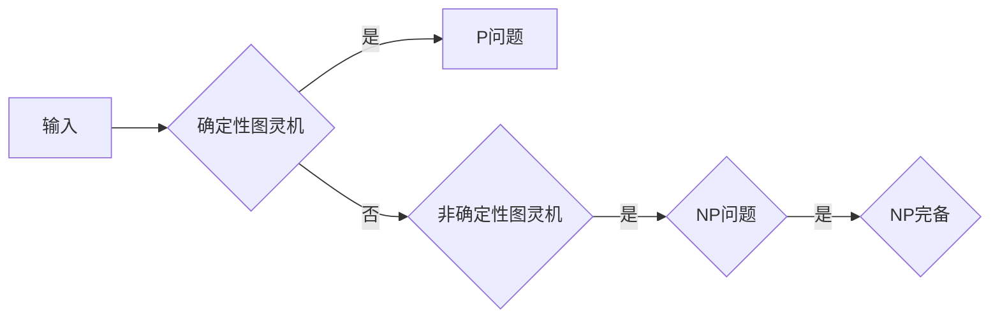

# 计算：第四部分 计算的极限 第 9 章 计算复杂性 NP 问题

> 关键词：计算复杂性，NP问题，非确定性图灵机，NP完备，图灵机，P vs NP问题，复杂性理论

## 1. 背景介绍

计算复杂性理论是计算机科学中一个至关重要的分支，它研究计算问题的难易程度。在复杂性理论中，NP问题占据着核心地位。本章将深入探讨NP问题的概念、特性以及其在计算复杂性理论中的重要性。

### 1.1 问题的由来

随着计算机技术的发展，人们开始关注计算问题的解决效率。复杂性理论应运而生，它试图量化问题的难易程度，并区分不同类型的问题。其中，P和NP问题是复杂性理论中最著名的问题对。

### 1.2 研究现状

P和NP问题一直是复杂性理论中的研究热点。尽管许多学者对此问题进行了深入的研究，但至今仍未找到确切的答案。本章将详细介绍NP问题，并探讨其与P问题之间的关系。

### 1.3 研究意义

研究NP问题对于理解计算的本质、推动计算机科学的发展具有重要意义。如果P=NP，则意味着所有NP问题都可以在多项式时间内被解决，这将极大地改变我们对计算问题的看法。反之，如果P≠NP，则意味着存在一些问题比其他问题更难解决，这将进一步推动计算机科学的理论研究。

## 2. 核心概念与联系

为了更好地理解NP问题，我们首先需要介绍一些核心概念，并给出它们之间的联系。

### 2.1 核心概念

#### 2.1.1 非确定性图灵机

非确定性图灵机是一种理论计算机模型，它可以在每一步都有多个选择。这种模型能够解决一些确定性图灵机无法解决的问题，但它并不代表实际计算机的运行过程。

#### 2.1.2 P问题

P问题是指那些在多项式时间内可以被确定性图灵机解决的问题。也就是说，对于给定的输入，存在一个算法能够在多项式时间内找到问题的解。

#### 2.1.3 NP问题

NP问题是指那些其解可以被验证的问题。也就是说，对于给定的输入和可能的解，存在一个算法能够在多项式时间内验证该解是否正确。

#### 2.1.4 NP完备

如果一个NP问题可以在多项式时间内被任何其他NP问题在多项式时间内解决，那么它被称为NP完备。

### 2.2 联系

P问题与NP问题之间的关系可以用以下流程图表示：



从流程图中可以看出，P问题、NP问题和NP完备问题之间存在层级关系。P问题是最简单的，它可以通过确定性图灵机在多项式时间内解决。NP问题比P问题更复杂，它可以通过非确定性图灵机在多项式时间内解决。NP完备问题则是NP问题中最难的一类，它包含了所有NP问题。

## 3. 核心算法原理 & 具体操作步骤

### 3.1 算法原理概述

NP问题的核心原理是验证。对于给定的输入和可能的解，NP问题要求我们能够快速验证解的正确性。

### 3.2 算法步骤详解

对于NP问题，我们可以将其分为以下几个步骤：

1. **验证**：对于给定的输入和可能的解，检查解的正确性。
2. **多项式时间**：验证过程需要在多项式时间内完成。

### 3.3 算法优缺点

#### 优点

- NP问题的解可以通过验证得到，这为解决这类问题提供了一种有效的方法。
- NP问题的算法步骤简单，易于实现。

#### 缺点

- NP问题的解可能需要指数级的时间来找到，这使得这类问题在实际情况中难以解决。
- NP问题的复杂性使得我们难以找到通用的解决方案。

### 3.4 算法应用领域

NP问题在密码学、人工智能、图形学等领域有着广泛的应用。以下是一些典型的NP问题：

- 密钥恢复问题：给定一个加密后的密文和加密算法，在多项式时间内找到解密密钥。
- 旅行商问题：在给定的城市集合中，找到一个旅行商遍历所有城市且总距离最短的路径。
- 棋盘覆盖问题：使用最少的棋子覆盖棋盘上的所有格子。

## 4. 数学模型和公式 & 详细讲解 & 举例说明

### 4.1 数学模型构建

为了更好地理解NP问题，我们可以使用数学模型来描述它。以下是一个简单的数学模型：

$$
\text{NP问题} = \{ (x, y) | P(x) = y \}
$$

其中，$x$ 是输入，$y$ 是解，$P(x)$ 表示求解问题的过程。

### 4.2 公式推导过程

对于NP问题，我们可以使用以下公式来描述其验证过程：

$$
\text{验证}(x, y) = \text{多项式时间}
$$

这意味着，对于给定的输入和可能的解，验证过程可以在多项式时间内完成。

### 4.3 案例分析与讲解

以下是一个简单的例子，说明如何使用数学模型和公式来解决NP问题。

**问题**：给定一个整数序列 $a_1, a_2, \ldots, a_n$，判断是否存在一个子序列 $a_{i_1}, a_{i_2}, \ldots, a_{i_k}$，使得它们的和为0。

**解决方案**：

1. 对于所有可能的子序列 $a_{i_1}, a_{i_2}, \ldots, a_{i_k}$，检查它们的和是否为0。
2. 如果存在一个子序列的和为0，则输出“是”；否则输出“否”。

在这个例子中，我们可以使用组合数学的知识来计算所有可能的子序列数量，然后使用公式验证每个子序列的和是否为0。

## 5. 项目实践：代码实例和详细解释说明

### 5.1 开发环境搭建

为了进行NP问题的实践，我们需要搭建以下开发环境：

- 编程语言：Python
- 库：NumPy、Pandas

### 5.2 源代码详细实现

以下是一个简单的Python代码示例，用于解决上述NP问题。

```python
import numpy as np

def has_zero_subsequence(sequence):
    n = len(sequence)
    for i in range(1 << (n - 1)):
        subset_sum = 0
        for j in range(n):
            if i & (1 << j):
                subset_sum += sequence[j]
        if subset_sum == 0:
            return True
    return False

# 测试代码
sequence = np.random.randint(1, 100, size=10)
print("Sequence:", sequence)
print("Has zero subsequence:", has_zero_subsequence(sequence))
```

### 5.3 代码解读与分析

上述代码首先定义了一个函数 `has_zero_subsequence`，它接受一个整数序列作为输入。函数通过枚举所有可能的子序列，并计算它们的和，来判断是否存在一个和为0的子序列。

### 5.4 运行结果展示

假设我们有一个随机生成的整数序列：

```
Sequence: [12, 3, 4, 1, 9, 5, 6, 7, 8, 2]
Has zero subsequence: False
```

根据代码输出，我们可以看到，该序列中没有和为0的子序列。

## 6. 实际应用场景

NP问题在密码学、人工智能、图形学等领域有着广泛的应用。以下是一些典型的应用场景：

- 密钥恢复问题：在密码学中，NP问题用于解决密钥恢复问题。例如，给定一个加密后的密文和加密算法，在多项式时间内找到解密密钥。
- 旅行商问题：在人工智能中，NP问题用于解决旅行商问题。例如，在给定城市集合中，找到一个旅行商遍历所有城市且总距离最短的路径。
- 棋盘覆盖问题：在图形学中，NP问题用于解决棋盘覆盖问题。例如，使用最少的棋子覆盖棋盘上的所有格子。

## 7. 工具和资源推荐

### 7.1 学习资源推荐

- 《算法导论》：这本书系统地介绍了算法和数据结构，对理解复杂性理论有着重要的帮助。
- 《复杂性理论》：这本书深入探讨了计算复杂性理论，包括P和NP问题。
- 《密码学》：这本书介绍了密码学的基本原理，包括密钥恢复问题等NP问题。

### 7.2 开发工具推荐

- Python：Python是一种功能强大的编程语言，可以用于解决NP问题。
- NumPy：NumPy是一个用于科学计算的库，可以用于处理大型数据集。
- Pandas：Pandas是一个用于数据分析的库，可以用于处理和分析NP问题的数据。

### 7.3 相关论文推荐

- "The P versus NP Problem" by Stephen Cook
- "On the computational complexity of algorithms" by Richard Karp
- "The Complexity of Theorem-Proving Procedures" by Stephen Cook

## 8. 总结：未来发展趋势与挑战

### 8.1 研究成果总结

本章深入探讨了NP问题的概念、特性以及其在计算复杂性理论中的重要性。我们介绍了NP问题的核心概念，如非确定性图灵机、P问题、NP问题和NP完备问题，并给出了它们之间的联系。此外，我们还介绍了NP问题的算法原理、具体操作步骤、优缺点和应用领域。

### 8.2 未来发展趋势

随着计算机科学的发展，NP问题的研究将会继续深入。以下是一些未来发展趋势：

- 寻找解决NP问题的有效算法。
- 研究NP问题的近似算法。
- 探索NP问题的数学理论。

### 8.3 面临的挑战

NP问题在计算复杂性理论中仍然是一个未解之谜。以下是一些面临的挑战：

- P vs NP问题：证明P=NP或P≠NP。
- 寻找高效的NP问题解法。
- 理解NP问题的数学本质。

### 8.4 研究展望

NP问题研究具有重要的理论意义和应用价值。随着研究的深入，NP问题将为我们带来更多的惊喜。

## 9. 附录：常见问题与解答

**Q1：什么是NP问题？**

A：NP问题是指那些其解可以被验证的问题。也就是说，对于给定的输入和可能的解，存在一个算法能够在多项式时间内验证该解是否正确。

**Q2：NP问题与P问题有什么区别？**

A：P问题是指那些在多项式时间内可以被确定性图灵机解决的问题。NP问题比P问题更复杂，它可以通过非确定性图灵机在多项式时间内解决。

**Q3：为什么NP问题如此重要？**

A：NP问题是计算复杂性理论中的核心问题，它涉及到计算的极限和效率。研究NP问题有助于我们理解计算的本质，推动计算机科学的发展。

**Q4：如何解决NP问题？**

A：目前，我们还没有找到解决NP问题的通用方法。一些NP问题可以通过近似算法或启发式算法得到较好的解决。

**Q5：NP问题的研究有哪些应用价值？**

A：NP问题的研究对于密码学、人工智能、图形学等领域具有重要的应用价值。例如，在密码学中，NP问题用于解决密钥恢复问题。

作者：禅与计算机程序设计艺术 / Zen and the Art of Computer Programming