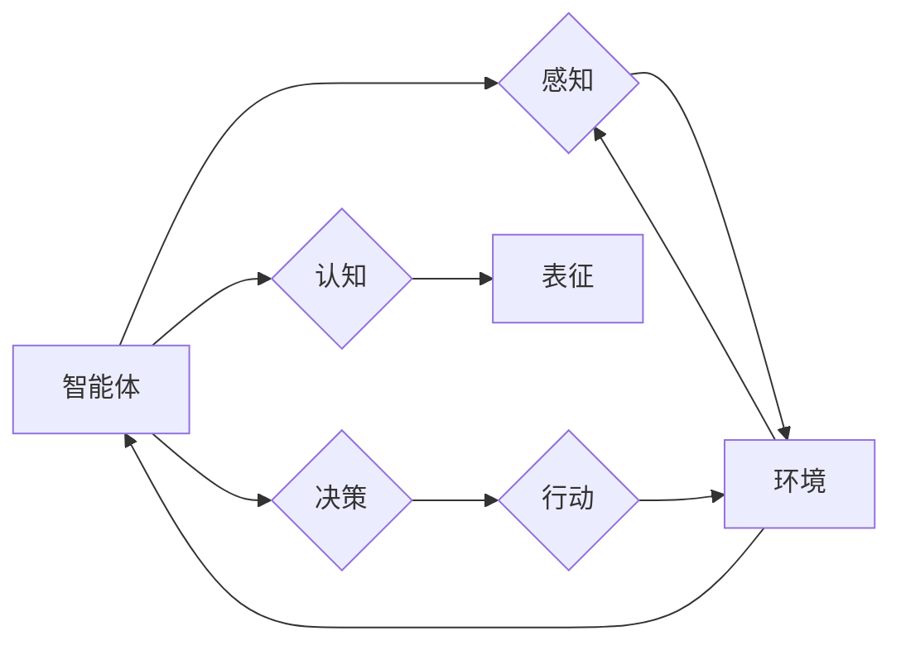

> 认知形式化，具身行为，物理空间，交互，智能体，人工智能，自然语言处理，机器学习，认知科学

# 认知的形式化：具身行为与物理空间及其他人进行交互

认知的形式化是将人类认知过程抽象为可计算、可模拟的模型，以理解和模拟智能体的行为。具身行为是指在物理环境中，智能体通过与物理世界和其他智能体的交互来获取知识和经验。本文将探讨认知的形式化在具身行为中的应用，以及智能体如何与物理空间和其他人进行交互。

## 1. 背景介绍

### 1.1 认知科学的挑战

认知科学是研究人类认知过程的学科，它涉及心理学、神经科学、计算机科学等多个领域。然而，认知科学面临着巨大的挑战，因为人类认知的复杂性使得对其进行精确描述和模拟变得极其困难。

### 1.2 具身行为与认知形式化

具身行为理论认为，认知过程是与物理世界紧密相连的。智能体的认知是通过与物理环境的交互和内在表征的动态交互来实现的。认知形式化提供了一种将具身行为理论转化为可计算模型的方法。

### 1.3 交互与智能体

交互是智能体与物理空间以及其他智能体之间进行的相互作用。在认知形式化中，交互被看作是智能体获取知识和经验的重要途径。

## 2. 核心概念与联系

### 2.1 核心概念原理

- **具身行为**：智能体通过与环境的物理交互来获取知识和经验。
- **认知形式化**：将认知过程转化为可计算模型。
- **交互**：智能体与物理空间和其他智能体之间的相互作用。
- **智能体**：具有认知能力的实体，能够感知环境、制定计划、采取行动。

### 2.2 架构的 Mermaid 流程图



在上述流程图中，智能体通过感知环境来获取信息，然后进行认知和表征，制定决策，并采取行动。行动的结果会影响环境，从而影响智能体的感知和认知过程。

## 3. 核心算法原理 & 具体操作步骤

### 3.1 算法原理概述

认知的形式化通常涉及以下几个步骤：

1. **感知**：智能体通过传感器感知环境信息。
2. **表征**：将感知到的信息转化为内部表征。
3. **决策**：根据内部表征和目标，智能体制定决策。
4. **行动**：智能体执行决策，与物理环境交互。
5. **反馈**：环境反馈影响智能体的感知和决策。

### 3.2 算法步骤详解

1. **感知**：智能体通过传感器（如摄像头、麦克风、触觉传感器等）获取环境信息。
2. **表征**：将感知信息转化为内部表征，如视觉图像、声音波形、触觉数据等。
3. **决策**：智能体根据内部表征和目标，使用机器学习算法（如神经网络、决策树等）制定决策。
4. **行动**：智能体执行决策，如移动、抓取、说话等。
5. **反馈**：环境反馈影响智能体的感知和决策。

### 3.3 算法优缺点

#### 优点

- **可解释性**：形式化模型可以提供对认知过程的直观理解。
- **可模拟性**：形式化模型可以用于模拟和预测智能体的行为。
- **可扩展性**：形式化模型可以轻松扩展到更复杂的认知任务。

#### 缺点

- **复杂性**：形式化模型可能非常复杂，难以理解和实现。
- **计算资源**：形式化模型可能需要大量的计算资源来模拟和预测。

### 3.4 算法应用领域

认知的形式化在以下领域有广泛的应用：

- **人机交互**：设计更自然、更直观的人机交互界面。
- **机器人学**：开发更智能的机器人，能够更好地与人类和环境互动。
- **游戏设计**：创建更具有挑战性和真实感的游戏体验。
- **虚拟现实**：设计更沉浸式的虚拟现实体验。

## 4. 数学模型和公式 & 详细讲解 & 举例说明

### 4.1 数学模型构建

认知的形式化通常涉及以下数学模型：

- **感知模型**：将传感器输入转换为内部表征。
- **表征模型**：将感知信息转化为内部表征。
- **决策模型**：使用机器学习算法进行决策。
- **行动模型**：将决策转换为行动。

### 4.2 公式推导过程

以下是一个简单的感知模型的公式推导过程：

$$
y = f(x) + \epsilon
$$

其中，$x$ 是传感器输入，$y$ 是内部表征，$f$ 是感知模型函数，$\epsilon$ 是噪声。

### 4.3 案例分析与讲解

以一个简单的视觉感知模型为例，该模型使用卷积神经网络（CNN）将图像转换为特征表示。

```python
import torch
import torch.nn as nn

class VisualPerceptionModel(nn.Module):
    def __init__(self):
        super(VisualPerceptionModel, self).__init__()
        self.conv1 = nn.Conv2d(3, 32, kernel_size=3, padding=1)
        self.conv2 = nn.Conv2d(32, 64, kernel_size=3, padding=1)
        self.fc = nn.Linear(64 * 6 * 6, 128)

    def forward(self, x):
        x = nn.functional.relu(self.conv1(x))
        x = nn.functional.max_pool2d(x, 2)
        x = nn.functional.relu(self.conv2(x))
        x = nn.functional.max_pool2d(x, 2)
        x = x.view(-1, 64 * 6 * 6)
        x = nn.functional.relu(self.fc(x))
        return x
```

在这个例子中，输入图像通过两个卷积层和全连接层，最终转换为128维的特征表示。

## 5. 项目实践：代码实例和详细解释说明

### 5.1 开发环境搭建

```bash
# 安装PyTorch
pip install torch torchvision torchaudio

# 安装其他依赖
pip install numpy pandas matplotlib tqdm scikit-learn
```

### 5.2 源代码详细实现

以下是一个简单的视觉感知模型的PyTorch实现：

```python
import torch
import torch.nn as nn
from torchvision import datasets, transforms

# 加载CIFAR-10数据集
transform = transforms.Compose([transforms.ToTensor()])
train_dataset = datasets.CIFAR10(root='./data', train=True, download=True, transform=transform)
train_loader = torch.utils.data.DataLoader(dataset=train_dataset, batch_size=64, shuffle=True)

# 定义模型
model = VisualPerceptionModel()

# 定义损失函数和优化器
criterion = nn.CrossEntropyLoss()
optimizer = torch.optim.Adam(model.parameters(), lr=0.001)

# 训练模型
for epoch in range(10):
    for data, target in train_loader:
        optimizer.zero_grad()
        output = model(data)
        loss = criterion(output, target)
        loss.backward()
        optimizer.step()

    print(f'Epoch {epoch+1}, Loss: {loss.item()}')
```

### 5.3 代码解读与分析

上述代码首先定义了一个简单的视觉感知模型，该模型使用两个卷积层和全连接层来提取图像特征。然后，代码加载CIFAR-10数据集，并使用该数据集进行模型的训练。在每个epoch中，模型的前向传播和反向传播过程被循环执行，以更新模型参数。

### 5.4 运行结果展示

运行上述代码后，模型将在CIFAR-10数据集上进行训练。训练结束后，模型将能够识别图像中的对象，如飞机、汽车、狗等。

## 6. 实际应用场景

认知的形式化在以下实际应用场景中有广泛的应用：

- **自动驾驶**：智能车通过感知周围环境，并使用认知形式化模型来做出驾驶决策。
- **人机交互**：智能助手通过认知形式化模型来理解用户的意图，并做出相应的回应。
- **游戏AI**：游戏中的智能对手通过认知形式化模型来制定策略，以赢得比赛。

## 7. 工具和资源推荐

### 7.1 学习资源推荐

- 《认知科学导论》
- 《机器学习》
- 《深度学习》

### 7.2 开发工具推荐

- PyTorch
- TensorFlow
- Keras

### 7.3 相关论文推荐

- "The Human Brain in the Age of Machine Intelligence"
- "Embodied Cognition: An Introduction"
- "Reinforcement Learning: An Introduction"

## 8. 总结：未来发展趋势与挑战

### 8.1 研究成果总结

认知的形式化为理解人类认知和模拟智能体行为提供了一种新的方法。通过将认知过程形式化，我们可以更好地理解人类行为，并开发出更智能的机器人、智能助手等。

### 8.2 未来发展趋势

- **多模态感知**：结合视觉、听觉、触觉等多模态信息，提高智能体的感知能力。
- **强化学习**：结合强化学习，使智能体能够通过与环境交互来学习。
- **可解释性**：提高模型的可解释性，以便更好地理解智能体的决策过程。

### 8.3 面临的挑战

- **复杂性**：认知过程非常复杂，难以完全形式化。
- **计算资源**：形式化模型通常需要大量的计算资源来模拟和预测。
- **数据**：需要大量的标注数据来训练模型。

### 8.4 研究展望

认知的形式化是人工智能领域的一个重要研究方向。通过不断的研究和探索，我们有望开发出更智能、更可靠的智能体，并最终实现人类水平的智能。

## 9. 附录：常见问题与解答

**Q1：什么是认知的形式化？**

A：认知的形式化是将人类认知过程抽象为可计算、可模拟的模型，以理解和模拟智能体的行为。

**Q2：具身行为与认知形式化有什么关系？**

A：具身行为理论认为，认知过程是与物理世界紧密相连的。认知形式化提供了一种将具身行为理论转化为可计算模型的方法。

**Q3：认知的形式化有哪些应用领域？**

A：认知的形式化在自动驾驶、人机交互、游戏AI等领域有广泛的应用。

**Q4：认知的形式化面临哪些挑战？**

A：认知过程非常复杂，难以完全形式化；形式化模型通常需要大量的计算资源来模拟和预测；需要大量的标注数据来训练模型。

作者：禅与计算机程序设计艺术 / Zen and the Art of Computer Programming