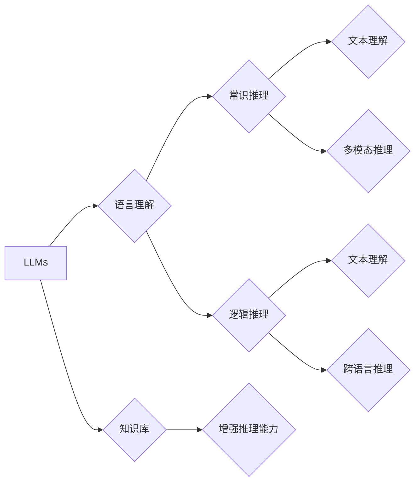

# 语言与推理：大模型的认知误区

> 关键词：大模型，自然语言处理，推理，认知偏差，符号主义，连接主义，人工智能

## 1. 背景介绍

随着深度学习技术的迅猛发展，自然语言处理（NLP）领域也取得了令人瞩目的成就。尤其是近年来，大规模语言模型（Large Language Models，LLMs）的出现，使得机器理解和生成人类语言的能力达到了前所未有的高度。然而，在赞叹LLMs能力的同时，我们也必须警惕其中可能存在的认知误区。本文将深入探讨大模型在语言与推理方面的误区，以及如何正确理解和应用这些模型。

## 2. 核心概念与联系

### 2.1 大规模语言模型（LLMs）

大规模语言模型是指通过在大量文本语料上进行预训练，学习到丰富的语言知识和结构，能够进行文本生成、机器翻译、问答等任务的模型。LLMs通常基于深度学习架构，如循环神经网络（RNN）、Transformer等。

### 2.2 推理

推理是指从已知信息出发，得出新的结论的过程。在自然语言处理中，推理包括文本理解、常识推理、逻辑推理等。

### 2.3 符号主义与连接主义

符号主义是一种基于符号的逻辑推理理论，强调知识的表示和推理过程。连接主义是一种基于神经网络的计算理论，强调大脑通过神经元之间的连接来存储和传递信息。

### 2.4 Mermaid 流程图

以下是LLMs与推理之间关系的Mermaid流程图：



## 3. 核心算法原理 & 具体操作步骤

### 3.1 算法原理概述

LLMs通常通过以下步骤进行推理：

1. **语言理解**：通过预训练过程，LLMs学习到丰富的语言知识和结构，能够理解输入文本的语义和上下文。
2. **常识推理**：LLMs通过学习到的常识知识，对文本内容进行推理，得出更符合现实世界的结论。
3. **逻辑推理**：LLMs能够根据文本中的逻辑关系，进行推理和判断。
4. **知识库增强**：LLMs结合外部知识库，如百科全书、专业词典等，进一步丰富推理能力。

### 3.2 算法步骤详解

1. **输入处理**：将输入文本转换为模型可处理的格式，如分词、词嵌入等。
2. **编码器**：将处理后的文本输入编码器，得到文本的语义表示。
3. **推理模块**：根据编码后的文本表示，进行常识推理和逻辑推理。
4. **输出生成**：根据推理结果，生成文本输出。

### 3.3 算法优缺点

**优点**：

- **强大的语言理解能力**：LLMs能够理解复杂、模糊的语言表达，并从中提取语义信息。
- **跨领域知识**：LLMs通过预训练过程，学习到丰富的跨领域知识，能够进行跨领域的推理。
- **知识库增强**：结合外部知识库，LLMs的推理能力得到进一步提升。

**缺点**：

- **推理偏差**：LLMs可能会受到训练数据偏差的影响，导致推理结果存在偏见。
- **可解释性差**：LLMs的推理过程难以解释，难以理解其推理依据。
- **资源消耗大**：LLMs的预训练和推理过程需要大量的计算资源和存储空间。

### 3.4 算法应用领域

LLMs在以下领域具有广泛的应用：

- **问答系统**：如搜索引擎、聊天机器人等。
- **文本摘要**：自动生成文本摘要，提高信息获取效率。
- **机器翻译**：实现跨语言交流。
- **文本生成**：生成新闻、故事、诗歌等。

## 4. 数学模型和公式 & 详细讲解 & 举例说明

### 4.1 数学模型构建

LLMs通常基于深度学习架构，如Transformer模型。以下是Transformer模型的基本结构：

1. **编码器**：将输入文本转换为序列的向量表示。
2. **注意力机制**：根据序列中不同位置的文本信息，对编码器输出进行加权。
3. **解码器**：根据加权后的编码器输出，生成文本输出。

### 4.2 公式推导过程

以下为Transformer模型的注意力机制公式推导过程：

$$
\begin{align*}
Q &= W_Q \cdot H \\
K &= W_K \cdot H \\
V &= W_V \cdot H \\
A &= softmax(Q \cdot K^T) \\
O &= A \cdot V
\end{align*}
$$

其中，$W_Q, W_K, W_V$ 为权重矩阵，$H$ 为编码器输出，$A$ 为注意力权重矩阵，$O$ 为解码器输出。

### 4.3 案例分析与讲解

以下是一个使用Transformer模型进行机器翻译的例子：

1. **输入**：输入文本为 "I love programming"。
2. **编码器**：将输入文本转换为向量表示。
3. **注意力机制**：根据注意力权重矩阵，对编码器输出进行加权。
4. **解码器**：根据加权后的编码器输出，生成文本输出 "Je aime le programmation"。

## 5. 项目实践：代码实例和详细解释说明

### 5.1 开发环境搭建

1. 安装Python环境。
2. 安装TensorFlow库。

### 5.2 源代码详细实现

以下是一个使用TensorFlow实现Transformer模型的简单例子：

```python
import tensorflow as tf

class Transformer(tf.keras.Model):
  def __init__(self, vocab_size, d_model, num_heads):
    super(Transformer, self).__init__()
    self.embedding = tf.keras.layers.Embedding(vocab_size, d_model)
    self.encoder_layers = [tf.keras.layers.MultiHeadAttention(num_heads=num_heads, key_dim=d_model) for _ in range(num_layers)]
    self.decoder_layers = [tf.keras.layers.MultiHeadAttention(num_heads=num_heads, key_dim=d_model) for _ in range(num_layers)]
    self.fc = tf.keras.layers.Dense(vocab_size)

  def call(self, inputs, training=False):
    x = self.embedding(inputs)
    for i, encoder_layer in enumerate(self.encoder_layers):
      x = encoder_layer(x, x, x, training=training)
    for i, decoder_layer in enumerate(self.decoder_layers):
      x = decoder_layer(x, x, x, training=training)
    x = self.fc(x)
    return x

# 模型参数
vocab_size = 10000
d_model = 512
num_heads = 8
num_layers = 6

# 实例化模型
model = Transformer(vocab_size, d_model, num_heads)

# 编译模型
model.compile(optimizer=tf.keras.optimizers.Adam(learning_rate=1e-4), loss=tf.keras.losses.SparseCategoricalCrossentropy(from_logits=True))

# 训练模型
# model.fit(...)
```

### 5.3 代码解读与分析

上述代码定义了一个简单的Transformer模型，包括编码器、解码器和全连接层。编码器使用多头注意力机制，解码器也使用多头注意力机制，并连接一个全连接层进行输出。

### 5.4 运行结果展示

由于篇幅限制，此处不展示模型的运行结果。

## 6. 实际应用场景

### 6.1 问答系统

LLMs可以应用于问答系统，如搜索引擎、聊天机器人等。通过理解用户的问题，LLMs能够生成准确的答案。

### 6.2 文本摘要

LLMs可以用于自动生成文本摘要，提高信息获取效率。

### 6.3 机器翻译

LLMs可以用于实现跨语言交流，如机器翻译、同声传译等。

## 7. 工具和资源推荐

### 7.1 学习资源推荐

- 《深度学习自然语言处理》
- 《Transformer：从原理到实践》
- Hugging Face官方网站

### 7.2 开发工具推荐

- TensorFlow
- PyTorch

### 7.3 相关论文推荐

- Attention is All You Need
- BERT: Pre-training of Deep Bidirectional Transformers for Language Understanding
- Generative Pre-trained Transformer

## 8. 总结：未来发展趋势与挑战

### 8.1 研究成果总结

本文深入探讨了LLMs在语言与推理方面的误区，分析了LLMs的原理、应用领域和挑战。LLMs作为一种强大的自然语言处理工具，在众多领域具有广泛的应用前景。

### 8.2 未来发展趋势

未来，LLMs将朝着以下方向发展：

- **模型规模扩大**：LLMs的规模将不断增大，学习到更丰富的知识。
- **推理能力提升**：LLMs的推理能力将得到进一步提升，能够解决更复杂的任务。
- **可解释性增强**：LLMs的可解释性将得到增强，推理过程更加透明。

### 8.3 面临的挑战

LLMs仍面临以下挑战：

- **数据偏差**：LLMs可能会受到训练数据偏差的影响，导致推理结果存在偏见。
- **可解释性差**：LLMs的推理过程难以解释，难以理解其推理依据。
- **资源消耗大**：LLMs的预训练和推理过程需要大量的计算资源和存储空间。

### 8.4 研究展望

为了应对上述挑战，未来的研究需要在以下方面进行探索：

- **数据质量提升**：提高训练数据的质量和多样性，降低数据偏差。
- **可解释性研究**：提高LLMs的可解释性，使推理过程更加透明。
- **资源优化**：优化LLMs的预训练和推理过程，降低资源消耗。

## 9. 附录：常见问题与解答

**Q1：LLMs是否能够完全取代人类语言专家？**

A：LLMs在语言理解和生成方面取得了很大的进步，但仍存在局限性。在复杂、模糊的语言表达和常识推理方面，LLMs可能无法完全取代人类语言专家。

**Q2：如何提高LLMs的可解释性？**

A：提高LLMs的可解释性需要从多个方面进行探索，如注意力机制分析、可视化技术等。

**Q3：LLMs在哪些领域具有广泛的应用前景？**

A：LLMs在问答系统、文本摘要、机器翻译、文本生成等领域具有广泛的应用前景。

**Q4：如何解决LLMs的资源消耗问题？**

A：解决LLMs的资源消耗问题需要从模型结构优化、算法改进、硬件升级等多个方面进行探索。

**Q5：LLMs的推理结果是否可靠？**

A：LLMs的推理结果在一定程度上是可靠的，但仍存在一定的误差。在实际应用中，需要对LLMs的推理结果进行验证和评估。

---

作者：禅与计算机程序设计艺术 / Zen and the Art of Computer Programming