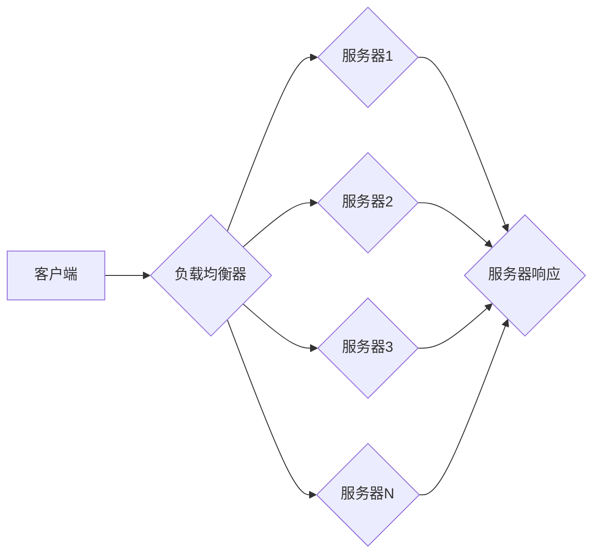
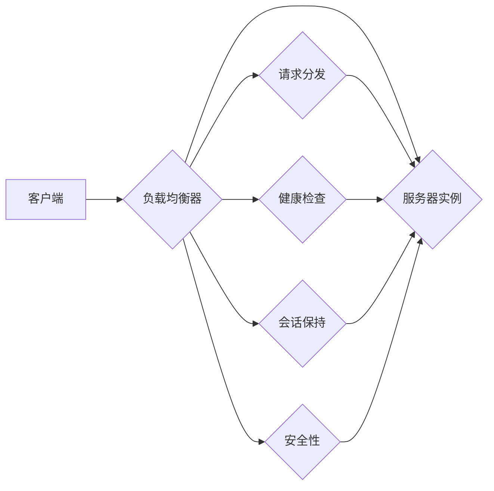

> 负载均衡器，设计原理，优化策略，网络架构，性能提升，分布式系统

# 负载均衡器的设计与优化

负载均衡器是现代网络架构中不可或缺的核心组件，它负责将流量分配到多个服务器实例，确保系统的稳定性和高性能。随着云计算和分布式系统的广泛应用，负载均衡器的设计和优化成为了网络架构师和系统工程师关注的焦点。本文将深入探讨负载均衡器的设计原理、具体操作步骤、优化策略，并展望其未来发展趋势与挑战。

## 1. 背景介绍

随着互联网的快速发展，用户需求日益增长，传统的单点服务器架构已无法满足大规模分布式系统的需求。为了提高系统的可用性、可靠性和扩展性，负载均衡器应运而生。负载均衡器通过将请求分发到多个服务器实例，实现了资源的合理利用和服务的无缝扩展。

### 1.1 问题的由来

在单点服务器架构下，所有请求都直接发送到单一的服务器实例，一旦服务器出现故障或负载过高，整个系统将面临瘫痪的风险。为了解决这一问题，负载均衡器应运而生，它能够在多台服务器之间分配请求，提高系统的可用性和可靠性。

### 1.2 研究现状

目前，负载均衡器的设计和优化主要集中在以下几个方面：

- **算法优化**：研究更加高效、公平的负载分配算法，提高资源利用率。
- **性能提升**：通过优化网络架构、硬件设备等，提高负载均衡器的处理能力。
- **可靠性保障**：设计冗余机制，确保负载均衡器本身的高可用性。
- **安全性增强**：加强负载均衡器的安全防护，防止恶意攻击。

### 1.3 研究意义

负载均衡器的设计与优化对于以下方面具有重要意义：

- **提高系统性能**：合理分配流量，避免单点过载，提高系统的整体性能。
- **增强系统可用性**：通过冗余设计，提高系统的稳定性和可靠性。
- **降低运营成本**：合理利用资源，降低硬件和运维成本。
- **支持业务创新**：为业务创新提供基础设施保障，支持新业务快速上线。

## 2. 核心概念与联系

### 2.1 核心概念

- **负载均衡器**：负责将请求分发到多个服务器实例的设备或软件。
- **请求分发算法**：决定如何将请求分配到不同服务器实例的算法。
- **健康检查**：监控服务器实例健康状况的机制。
- **会话保持**：在多个请求之间保持会话状态，确保请求的正确处理。
- **安全性**：防止恶意攻击，保障系统安全。

### 2.2 架构图

以下为负载均衡器的基本架构图：



### 2.3 关系图



## 3. 核心算法原理 & 具体操作步骤

### 3.1 算法原理概述

负载均衡算法主要分为以下几类：

- **轮询算法**：按顺序将请求分配到各个服务器实例，适用于无状态服务。
- **最少连接算法**：将请求分配到连接数最少的服务器实例，适用于连接密集型应用。
- **IP哈希算法**：根据客户端IP地址将请求分配到特定的服务器实例，适用于需要会话保持的场景。
- **加权轮询算法**：根据服务器实例的权重将请求分配，权重可以根据服务器性能动态调整。

### 3.2 算法步骤详解

以轮询算法为例，具体操作步骤如下：

1. 初始化服务器实例列表和请求计数器。
2. 客户端发送请求到负载均衡器。
3. 负载均衡器根据轮询算法计算目标服务器实例。
4. 将请求转发到目标服务器实例。
5. 服务器实例处理请求并返回响应。
6. 更新请求计数器，准备下一轮请求分发。

### 3.3 算法优缺点

#### 轮询算法

**优点**：

- 简单易懂，实现成本低。
- 公平分配请求，避免单点过载。

**缺点**：

- 不支持会话保持。
- 无法根据服务器性能动态分配请求。

#### 最少连接算法

**优点**：

- 适用于连接密集型应用。
- 避免单点过载，提高系统性能。

**缺点**：

- 容易导致服务器负载不均。
- 不支持会话保持。

#### IP哈希算法

**优点**：

- 支持会话保持。
- 请求分发均匀。

**缺点**：

- 容易导致服务器负载不均。
- 对服务器新增或删除不友好。

#### 加权轮询算法

**优点**：

- 可以根据服务器性能动态调整权重。
- 支持会话保持。

**缺点**：

- 实现复杂，维护成本高。

### 3.4 算法应用领域

不同的负载均衡算法适用于不同的应用场景：

- 轮询算法适用于无状态服务，如静态文件服务器、HTTP服务器等。
- 最少连接算法适用于连接密集型应用，如数据库服务器、游戏服务器等。
- IP哈希算法适用于需要会话保持的应用，如Web应用、视频会议系统等。
- 加权轮询算法适用于对服务器性能有不同要求的场景，如负载均衡集群等。

## 4. 数学模型和公式 & 详细讲解 & 举例说明

### 4.1 数学模型构建

负载均衡器的数学模型可以表示为：

$$
L(x) = \sum_{i=1}^{N} w_i \cdot f(x, s_i)
$$

其中，$L(x)$ 表示请求 $x$ 被分配到服务器实例 $s_i$ 的概率，$N$ 表示服务器实例数量，$w_i$ 表示服务器实例 $s_i$ 的权重，$f(x, s_i)$ 表示服务器实例 $s_i$ 对请求 $x$ 的适应度。

### 4.2 公式推导过程

假设服务器实例 $s_i$ 的性能为 $P_i$，请求 $x$ 的性能需求为 $R_x$，则服务器实例 $s_i$ 对请求 $x$ 的适应度可以表示为：

$$
f(x, s_i) = \frac{P_i}{R_x}
$$

服务器实例 $s_i$ 的权重可以表示为：

$$
w_i = \alpha P_i + \beta
$$

其中，$\alpha$ 和 $\beta$ 是权重系数。

将上述公式代入负载均衡器的数学模型，得到：

$$
L(x) = \sum_{i=1}^{N} (\alpha P_i + \beta) \cdot \frac{P_i}{R_x}
$$

### 4.3 案例分析与讲解

假设有3台服务器实例，性能分别为 $P_1 = 100$、$P_2 = 200$、$P_3 = 150$，请求的性能需求为 $R_x = 50$，权重系数 $\alpha = 0.5$、$\beta = 10$。则请求 $x$ 被分配到各个服务器实例的概率分别为：

$$
L(x|s_1) = \frac{0.5 \times 100 + 10}{50} = 0.5
$$

$$
L(x|s_2) = \frac{0.5 \times 200 + 10}{50} = 1
$$

$$
L(x|s_3) = \frac{0.5 \times 150 + 10}{50} = 0.7
$$

可以看到，请求 $x$ 更有可能被分配到性能较高的服务器实例 $s_2$。

## 5. 项目实践：代码实例和详细解释说明

### 5.1 开发环境搭建

本文使用Python语言和Flask框架实现一个简单的负载均衡器。开发环境如下：

- Python 3.8
- Flask 1.1.2
- Nginx

### 5.2 源代码详细实现

以下为Flask负载均衡器的实现代码：

```python
from flask import Flask, request, jsonify

app = Flask(__name__)

# 服务器实例列表
SERVERS = ['http://server1:80', 'http://server2:80', 'http://server3:80']

@app.route('/load_balancer', methods=['GET'])
def load_balancer():
    # 获取请求参数
    url = request.args.get('url', '')
    
    # 轮询算法分配服务器实例
    server_index = len(SERVERS) % len(SERVERS)
    selected_server = SERVERS[server_index]
    
    # 转发请求到服务器实例
    response = requests.get(f'{selected_server}/{url}')
    
    return jsonify({'url': url, 'server': selected_server, 'response': response.text})

if __name__ == '__main__':
    app.run()
```

### 5.3 代码解读与分析

- `SERVERS` 变量存储服务器实例列表。
- `load_balancer` 函数处理客户端请求，根据轮询算法分配服务器实例，并将请求转发到服务器实例。
- 使用 `requests` 库将请求转发到服务器实例。

### 5.4 运行结果展示

启动Flask应用后，可以通过访问 `http://localhost:5000/load_balancer?url=/index` 来测试负载均衡器。例如，访问 `http://localhost:5000/load_balancer?url=/index` 两次，可以看到请求被分配到不同的服务器实例。

## 6. 实际应用场景

### 6.1 云计算平台

负载均衡器在云计算平台中扮演着重要角色，用于将用户请求分发到多个虚拟机实例，提高系统的可用性和性能。

### 6.2 内容分发网络(CDN)

负载均衡器可以用于CDN中，将用户请求分发到距离用户最近的节点，提高访问速度和用户体验。

### 6.3 移动应用

负载均衡器可以用于移动应用中，将请求分发到多个服务器实例，提高系统的并发处理能力和稳定性。

## 7. 工具和资源推荐

### 7.1 学习资源推荐

- 《计算机网络》
- 《高性能网站架构》
- 《负载均衡技术详解》

### 7.2 开发工具推荐

- Flask
- Nginx
- HAProxy

### 7.3 相关论文推荐

- 《负载均衡算法综述》
- 《基于IP哈希的负载均衡技术》
- 《基于最小连接的负载均衡技术》

## 8. 总结：未来发展趋势与挑战

### 8.1 研究成果总结

本文对负载均衡器的设计与优化进行了深入探讨，涵盖了核心概念、算法原理、实践案例等方面。通过对不同负载均衡算法的优缺点分析，为读者提供了选择合适算法的依据。同时，本文还介绍了负载均衡器在实际应用场景中的应用，并推荐了相关的学习资源和开发工具。

### 8.2 未来发展趋势

- **智能化**：结合人工智能技术，实现智能化的负载均衡策略，如根据服务器性能动态调整权重、预测请求流量等。
- **分布式**：将负载均衡功能部署在分布式系统中，提高系统的可扩展性和可靠性。
- **服务化**：将负载均衡功能作为微服务，实现组件化和模块化，提高系统的灵活性和可维护性。

### 8.3 面临的挑战

- **安全性**：防范分布式拒绝服务(DDoS)攻击，确保负载均衡器的安全稳定运行。
- **可扩展性**：随着系统规模的不断扩大，如何保证负载均衡器的性能和可扩展性是一个挑战。
- **容错性**：在服务器实例故障的情况下，如何保证系统的持续运行是一个挑战。

### 8.4 研究展望

未来，负载均衡器的研究将朝着更加智能化、分布式、服务化方向发展，为构建更加高效、可靠、安全的分布式系统提供有力支持。

## 9. 附录：常见问题与解答

**Q1：负载均衡器如何选择合适的算法？**

A：选择合适的算法需要根据应用场景和业务需求进行综合考虑。例如，对于无状态服务，可以选择轮询算法；对于连接密集型应用，可以选择最少连接算法；对于需要会话保持的场景，可以选择IP哈希算法。

**Q2：负载均衡器如何提高性能？**

A：提高负载均衡器的性能可以通过以下几种方式：
- **优化网络架构**：选择合适的网络设备，提高网络带宽和传输速率。
- **优化代码**：优化负载均衡器的代码，提高处理速度和效率。
- **硬件加速**：使用专用硬件设备，如ASIC、FPGA等，提高处理速度。

**Q3：负载均衡器如何保证可靠性？**

A：保证负载均衡器的可靠性可以通过以下几种方式：
- **冗余设计**：部署多个负载均衡器，实现负载均衡功能的高可用。
- **故障切换**：在负载均衡器出现故障时，自动切换到备用负载均衡器。
- **集群管理**：使用集群管理工具，实现负载均衡器的自动化管理。

**Q4：负载均衡器如何防范DDoS攻击？**

A：防范DDoS攻击可以通过以下几种方式：
- **流量清洗**：使用流量清洗设备或服务，过滤掉恶意流量。
- **速率限制**：对请求进行速率限制，防止恶意流量占用过多资源。
- **IP地址封禁**：封禁恶意IP地址，防止其继续发起攻击。

作者：禅与计算机程序设计艺术 / Zen and the Art of Computer Programming