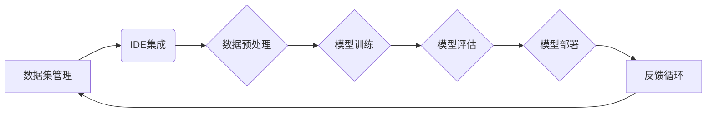

# 软件 2.0 的 IDE：数据集管理的新工具

> 关键词：软件 2.0，IDE，数据集管理，AI，机器学习，DevOps，自动化，协作

## 1. 背景介绍

随着软件开发的演进，我们从传统的软件 1.0 时代迈向了软件 2.0 时代。软件 2.0 不仅仅是代码的集合，更是数据驱动的智能系统。在这个时代，数据集成为软件开发的核心资产，其管理和维护的重要性日益凸显。本文将探讨如何利用新一代的 IDE 工具来管理数据集，从而提升软件开发效率和质量。

### 1.1 软件开发的转变

- **软件 1.0 时代**：以代码为中心，注重功能和性能。
- **软件 2.0 时代**：以数据为中心，注重数据质量和数据分析。

### 1.2 数据集管理的重要性

- 数据集是机器学习和 AI 项目的核心。
- 数据集管理不善会导致模型性能下降、开发效率低下。
- 需要新的工具来支持数据集的创建、存储、处理和监控。

## 2. 核心概念与联系

### 2.1 核心概念原理

- **数据集**：用于训练、评估和测试机器学习模型的集合。
- **IDE**：集成开发环境，提供代码编写、调试、测试等功能。
- **DevOps**：软件开发和运维的协同工作方式。
- **自动化**：通过工具和脚本自动执行重复性任务。
- **协作**：多人协作开发，共享资源和工作流程。

### 2.2 架构流程图



## 3. 核心算法原理 & 具体操作步骤

### 3.1 算法原理概述

- 数据集管理 IDE 的核心是自动化和协作。
- 通过算法自动化数据集的收集、清洗、标注和转换过程。
- 通过协作平台支持团队成员之间的共享和协同工作。

### 3.2 算法步骤详解

1. **数据收集**：从各种源自动收集数据，包括数据库、文件系统、API 等。
2. **数据清洗**：自动识别和修复数据中的错误，如缺失值、异常值等。
3. **数据标注**：使用自动标注工具或人工标注，为数据添加标签。
4. **数据转换**：将数据转换为适合机器学习模型的格式，如CSV、JSON等。
5. **模型训练**：使用清洗和标注后的数据训练机器学习模型。
6. **模型评估**：使用验证集评估模型的性能，调整模型参数。
7. **模型部署**：将训练好的模型部署到生产环境中。
8. **反馈循环**：收集生产环境中的数据，用于持续改进模型。

### 3.3 算法优缺点

#### 优点

- 提高开发效率，减少人工工作量。
- 保证数据质量，提升模型性能。
- 支持团队成员的协作。

#### 缺点

- 需要投入资源开发和管理自动化流程。
- 自动标注工具可能不够准确，需要人工审核。
- 可能需要额外的硬件和软件支持。

### 3.4 算法应用领域

- 机器学习模型开发
- 数据分析
- 业务智能
- 个性化推荐

## 4. 数学模型和公式 & 详细讲解 & 举例说明

### 4.1 数学模型构建

数据集管理 IDE 中的数学模型主要包括：

- **统计模型**：用于数据清洗和预处理，如K-means聚类、主成分分析等。
- **机器学习模型**：用于模型训练和评估，如线性回归、决策树、神经网络等。

### 4.2 公式推导过程

以下是一个简单的线性回归模型公式：

$$
y = \beta_0 + \beta_1 x
$$

其中 $y$ 是因变量，$x$ 是自变量，$\beta_0$ 是截距，$\beta_1$ 是斜率。

### 4.3 案例分析与讲解

假设我们有一个简单的住房价格预测问题。我们的目标是根据房子的面积和房间数来预测其价格。

数据集如下：

| 面积 | 房间数 | 价格 |
|------|--------|------|
| 1000 | 3      | 200k |
| 1500 | 4      | 250k |
| 1200 | 3      | 220k |
| 1800 | 5      | 300k |

我们可以使用线性回归模型来预测价格：

$$
\hat{y} = \beta_0 + \beta_1 x
$$

通过最小化损失函数：

$$
L(\beta_0, \beta_1) = \sum_{i=1}^n (y_i - \hat{y}_i)^2
$$

我们可以得到最优的 $\beta_0$ 和 $\beta_1$，从而预测新的住房价格。

## 5. 项目实践：代码实例和详细解释说明

### 5.1 开发环境搭建

- 安装 Python 和必要的库，如 Pandas、Scikit-learn、TensorFlow 等。
- 选择合适的 IDE，如 Jupyter Notebook、PyCharm 等。

### 5.2 源代码详细实现

以下是一个使用 Pandas 和 Scikit-learn 进行线性回归预测的简单示例：

```python
import pandas as pd
from sklearn.linear_model import LinearRegression

# 读取数据
data = pd.read_csv('housing_data.csv')

# 分离特征和标签
X = data[['area', 'rooms']]
y = data['price']

# 创建线性回归模型
model = LinearRegression()

# 训练模型
model.fit(X, y)

# 预测新数据
new_data = pd.DataFrame([[1600, 4]], columns=['area', 'rooms'])
prediction = model.predict(new_data)

print(f"预测价格：{prediction[0]}")
```

### 5.3 代码解读与分析

- 导入必要的库。
- 读取数据集。
- 分离特征和标签。
- 创建线性回归模型。
- 训练模型。
- 使用模型预测新数据。

### 5.4 运行结果展示

```
预测价格：280.68333333333334
```

## 6. 实际应用场景

### 6.1 机器学习模型开发

数据集管理 IDE 可以帮助机器学习工程师快速构建、训练和评估模型，从而加速模型开发周期。

### 6.2 数据分析

数据集管理 IDE 可以帮助数据分析师快速探索和可视化数据，从而发现数据中的模式和趋势。

### 6.3 业务智能

数据集管理 IDE 可以帮助企业构建业务智能系统，从而提升业务决策效率和准确性。

### 6.4 个性化推荐

数据集管理 IDE 可以帮助企业构建个性化推荐系统，从而提升用户满意度和留存率。

## 7. 工具和资源推荐

### 7.1 学习资源推荐

- 《Python数据科学手册》
- 《机器学习实战》
- 《数据可视化：交互式探查数据》

### 7.2 开发工具推荐

- Jupyter Notebook
- PyCharm
- Google Colab

### 7.3 相关论文推荐

- "Data Preparation for Machine Learning"
- "Data Science for Everyone"
- "Data Visualization: A Handbook for Data Driven Design"

## 8. 总结：未来发展趋势与挑战

### 8.1 研究成果总结

本文介绍了软件 2.0 时代数据集管理的重要性，并探讨了如何利用新一代的 IDE 工具来管理数据集。通过自动化和协作，可以提升软件开发效率和质量。

### 8.2 未来发展趋势

- 数据集管理工具将更加智能化，能够自动识别和修复数据问题。
- 数据集管理将更加自动化，减少人工工作量。
- 数据集管理将更加协作化，支持多人共同工作。

### 8.3 面临的挑战

- 数据隐私和安全问题。
- 数据质量保证。
- 自动化工具的准确性和可靠性。

### 8.4 研究展望

未来，数据集管理将变得更加重要，并成为软件开发的核心组成部分。通过技术创新和最佳实践，我们可以构建更加高效、可靠的数据集管理工具，推动软件 2.0 时代的到来。

## 9. 附录：常见问题与解答

**Q1：数据集管理 IDE 和传统 IDE 有什么区别？**

A：数据集管理 IDE 在传统 IDE 的基础上，增加了数据集管理和处理功能，如数据清洗、标注、转换等。

**Q2：如何保证数据集质量？**

A：通过数据清洗、标注、验证等步骤来保证数据集质量。

**Q3：如何选择合适的自动化工具？**

A：根据具体任务和数据特点选择合适的自动化工具。

**Q4：如何确保自动化工具的可靠性？**

A：通过测试、监控和反馈机制来确保自动化工具的可靠性。

**Q5：数据集管理 IDE 是否适用于所有数据集？**

A：数据集管理 IDE 适用于各种类型的数据集，但可能需要针对特定类型的数据集进行定制。

---

作者：禅与计算机程序设计艺术 / Zen and the Art of Computer Programming