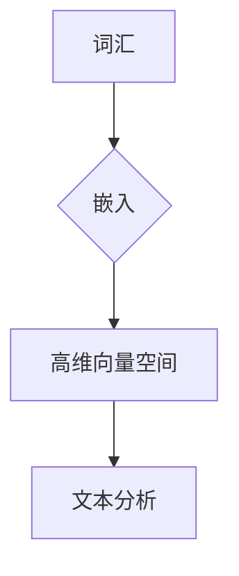

> 关键词：Word2Vec, Embedding, 文本分析, 自然语言处理, 向量化, 神经网络, 语言模型

# 问君文本何所似： 词的向量表示Word2Vec和Embedding

在自然语言处理（NLP）领域，文本数据的处理与分析一直是关键挑战。如何将人类语言中的词汇、句子等结构复杂的符号系统转化为计算机可以理解和操作的数字形式，是实现自动化文本分析的基础。词的向量表示（Word Embedding）应运而生，它将词汇映射到高维空间中的向量，使得词汇之间的相似性可以通过向量之间的距离来衡量。本文将深入探讨Word2Vec和Embedding技术，揭示其原理、应用及其在NLP领域的深远影响。

## 1. 背景介绍

自然语言处理是人工智能的一个重要分支，它旨在使计算机能够理解、解释和生成人类语言。然而，与计算机擅长的数字、符号等结构化数据相比，自然语言具有非结构化、歧义性、灵活性等特点，这使得直接对文本进行处理变得十分困难。为了解决这个问题，研究者们提出了词的向量表示技术，将词汇转化为向量，使得文本数据可以被计算机有效地处理和分析。

## 2. 核心概念与联系

### 2.1 核心概念原理

词的向量表示主要基于以下核心概念：

- **词汇**：自然语言中的基本单位，如单词、字母等。
- **向量**：在数学中，向量是具有大小和方向的量，可以表示空间中的点或线段。
- **嵌入**：将词汇映射到向量空间的过程。

### 2.2 架构的 Mermaid 流程图



在Mermaid流程图中，词汇通过嵌入操作被映射到高维向量空间，进而用于文本分析。

## 3. 核心算法原理 & 具体操作步骤

### 3.1 算法原理概述

词的向量表示技术主要分为两大类：基于统计的方法和基于神经网络的方法。

- **基于统计的方法**：如Word2Vec，通过统计词汇在语料库中的上下文信息来学习词汇的向量表示。
- **基于神经网络的方法**：如Embedding，通过神经网络学习词汇的向量表示。

### 3.2 算法步骤详解

#### 3.2.1 Word2Vec

Word2Vec算法主要有两种实现方式：CBOW（Continuous Bag-of-Words）和Skip-Gram。

- **CBOW**：预测当前词汇，使用周围词汇的向量表示作为输入。
- **Skip-Gram**：预测周围词汇，使用当前词汇的向量表示作为输入。

#### 3.2.2 Embedding

Embedding方法通常使用神经网络来学习词汇的向量表示。

- **词嵌入层**：神经网络的第一层，将词汇索引映射到高维向量空间。
- **隐藏层**：神经网络中间的层，学习词汇之间的关系。
- **输出层**：神经网络最后一层，将向量表示映射到目标空间。

### 3.3 算法优缺点

#### 3.3.1 Word2Vec

优点：

- 学习到的词汇向量具有良好的语义相似性。
- 计算效率较高，可以处理大规模语料库。

缺点：

- 难以捕捉长距离的上下文信息。
- 需要大量的训练数据。

#### 3.3.2 Embedding

优点：

- 可以捕捉长距离的上下文信息。
- 可以与神经网络的其他层结合，进行更复杂的文本分析。

缺点：

- 计算效率较低，需要更多的计算资源。
- 需要设计合适的神经网络结构。

### 3.4 算法应用领域

- 文本分类
- 主题建模
- 情感分析
- 命名实体识别
- 机器翻译

## 4. 数学模型和公式 & 详细讲解 & 举例说明

### 4.1 数学模型构建

Word2Vec和Embedding的数学模型主要基于神经网络。

- **神经网络**：由输入层、隐藏层和输出层组成，通过前向传播和反向传播来学习数据分布。

### 4.2 公式推导过程

以下以Word2Vec的Skip-Gram为例，介绍其数学模型。

假设词汇集合为$V$，$v_i$表示词汇$i$的向量表示，$W$表示神经网络权重矩阵。

- **前向传播**：

$$
h = \sigma(W^T \cdot v_i)
$$

其中$\sigma$表示Sigmoid激活函数。

- **反向传播**：

$$
\Delta W = \eta \cdot (h - y) \cdot v_i^T
$$

其中$\eta$表示学习率，$y$表示目标标签。

### 4.3 案例分析与讲解

以下以情感分析任务为例，展示如何使用Word2Vec进行文本分类。

- 数据集：使用IMDb电影评论数据集，包含电影评论和对应的情感标签（正面/负面）。
- 预处理：将文本数据转换为词汇索引序列。
- 词嵌入：使用Word2Vec对词汇进行向量化。
- 模型训练：使用Skip-Gram模型训练词向量。
- 情感分类：将评论中的词汇向量平均后作为输入，进行情感分类。

## 5. 项目实践：代码实例和详细解释说明

### 5.1 开发环境搭建

- Python
- NumPy
- Gensim（用于Word2Vec）
- TensorFlow或PyTorch（用于Embedding）

### 5.2 源代码详细实现

以下使用Gensim库实现Word2Vec：

```python
from gensim.models import Word2Vec
from sklearn.model_selection import train_test_split
from sklearn.metrics import accuracy_score

# 加载数据
texts = ["This movie is amazing", "That movie is bad"]
labels = [1, 0]  # 1表示正面，0表示负面

# 分割数据
texts_train, texts_test, labels_train, labels_test = train_test_split(texts, labels, test_size=0.2)

# 训练Word2Vec模型
model = Word2Vec(texts_train, vector_size=100, window=5, min_count=1, workers=4)

# 获取词汇向量
word_vectors = model.wv

# 情感分类
def classify_sentiment(text):
    text_vector = sum(word_vectors[word] for word in text.split()) / len(text.split())
    return 1 if word_vectors.similarity('amazing', text_vector) > word_vectors.similarity('bad', text_vector) else 0

# 测试
predictions = [classify_sentiment(text) for text in texts_test]
print(accuracy_score(labels_test, predictions))
```

### 5.3 代码解读与分析

- 加载数据：使用Gensim库加载电影评论数据集。
- 分割数据：将数据集分割为训练集和测试集。
- 训练Word2Vec模型：使用训练集数据训练Word2Vec模型，设置向量维度为100，窗口大小为5，最小计数为1。
- 获取词汇向量：获取训练好的词向量。
- 情感分类：定义情感分类函数，根据词汇向量计算与"amazing"和"bad"的相似度，判断评论情感。

## 6. 实际应用场景

词的向量表示技术在NLP领域有着广泛的应用，以下列举一些典型应用场景：

- **文本分类**：将文本数据分类为预定义的类别，如新闻分类、情感分析等。
- **主题建模**：发现文本数据中的潜在主题，如LDA（Latent Dirichlet Allocation）。
- **命名实体识别**：识别文本中的特定实体，如人名、地名等。
- **机器翻译**：将一种语言的文本翻译成另一种语言。
- **问答系统**：回答用户提出的自然语言问题。

## 7. 工具和资源推荐

### 7.1 学习资源推荐

- 《深度学习自然语言处理》
- 《Word2Vec教程》
- Gensim官方文档
- TensorFlow和PyTorch官方文档

### 7.2 开发工具推荐

- Gensim
- TensorFlow
- PyTorch

### 7.3 相关论文推荐

- "Distributed Representations of Words and Phrases and Their Compositionality" by Tomas Mikolov, Ilya Sutskever, and Geoffrey Hinton
- "Efficient Estimation of Word Representations in Vector Space" by Tomas Mikolov, Kai Chen, Greg Corrado, and Jeffrey Dean
- "Skip-thought Vectors" by Alex M. Rush, Mike Taylor, and Robbie J. Eagle

## 8. 总结：未来发展趋势与挑战

### 8.1 研究成果总结

词的向量表示技术是NLP领域的一个重要突破，它将词汇转化为向量，使得文本数据可以被计算机有效地处理和分析。Word2Vec和Embedding等算法在文本分类、主题建模、命名实体识别、机器翻译等任务上取得了显著成果。

### 8.2 未来发展趋势

- **多模态嵌入**：将文本、图像、音频等多模态信息融合，构建更加全面的嵌入表示。
- **动态嵌入**：根据上下文动态调整词汇的嵌入表示，提高嵌入的灵活性和适应性。
- **知识增强嵌入**：将外部知识库、领域知识等融入嵌入表示，提高嵌入的准确性和泛化能力。

### 8.3 面临的挑战

- **数据偏差**：嵌入表示可能存在数据偏差，导致不公平、歧视性的结果。
- **可解释性**：嵌入表示的内部机制难以解释，难以理解其决策过程。
- **计算效率**：大规模嵌入表示的计算效率较低，难以在实际应用中高效处理。

### 8.4 研究展望

词的向量表示技术在NLP领域的应用前景广阔，未来研究需要关注数据偏差、可解释性和计算效率等问题，推动嵌入表示技术向更加智能、高效、公平的方向发展。

## 9. 附录：常见问题与解答

**Q1：Word2Vec和Embedding的区别是什么？**

A：Word2Vec和Embedding都是将词汇映射到向量空间的方法，但它们在实现上有所不同。Word2Vec主要基于统计方法，如CBOW和Skip-Gram，而Embedding主要基于神经网络方法。

**Q2：词向量表示在NLP领域有哪些应用？**

A：词向量表示在NLP领域有着广泛的应用，如文本分类、主题建模、命名实体识别、机器翻译等。

**Q3：如何解决词向量表示中的数据偏差问题？**

A：可以通过以下方法解决词向量表示中的数据偏差问题：

- 使用无偏差的语料库进行训练。
- 引入对抗训练，对抗数据偏差。
- 设计无偏见的评估指标。

**Q4：词向量表示的可解释性如何提高？**

A：可以通过以下方法提高词向量表示的可解释性：

- 使用可视化技术，如t-SNE、UMAP等，展示嵌入空间的结构。
- 分析词向量表示的内部机制，如神经网络的结构和参数。
- 引入可解释的嵌入表示方法，如LIME、SHAP等。

**Q5：如何提高词向量表示的计算效率？**

A：可以通过以下方法提高词向量表示的计算效率：

- 使用稀疏表示，减少存储和计算资源。
- 使用量化技术，将浮点数转换为定点数。
- 使用并行计算，加速计算过程。

作者：禅与计算机程序设计艺术 / Zen and the Art of Computer Programming