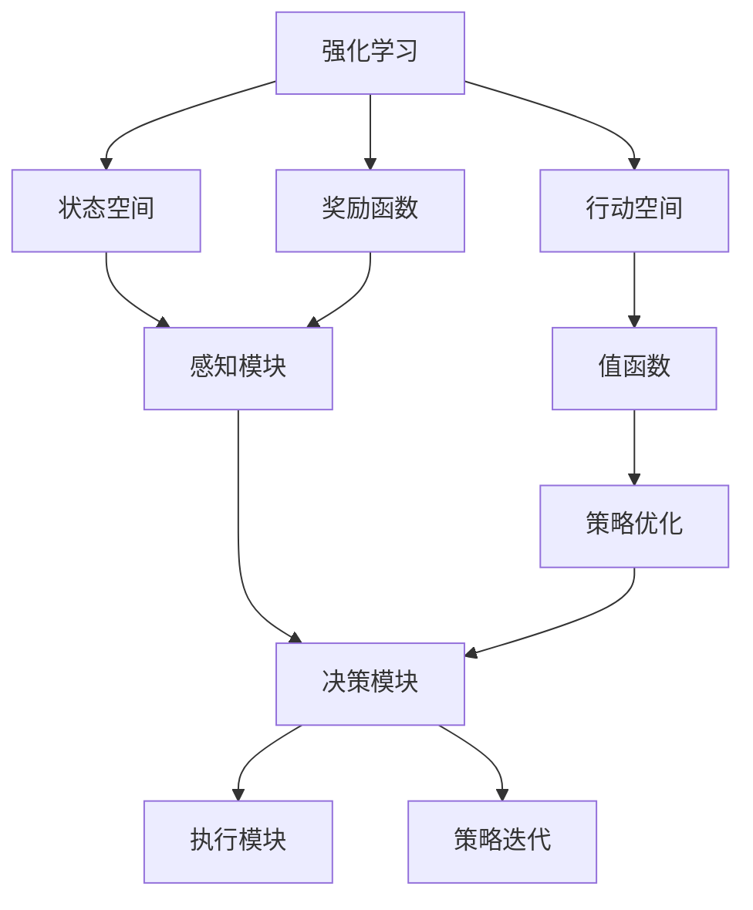
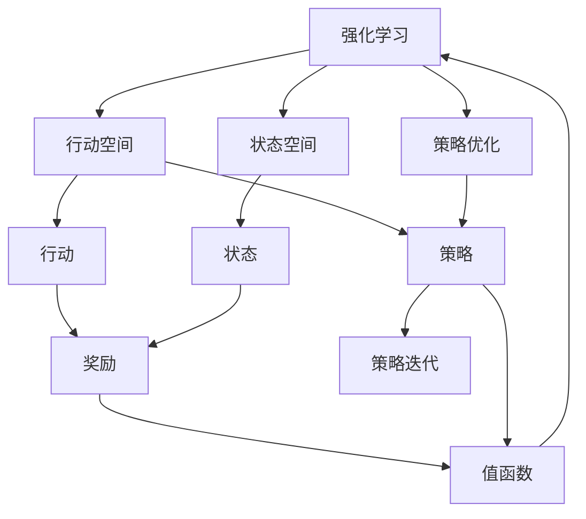
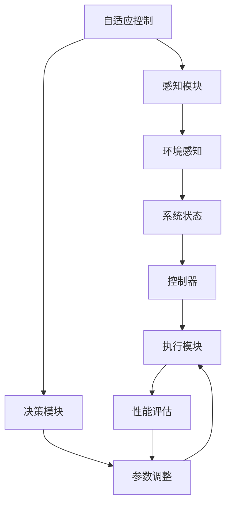
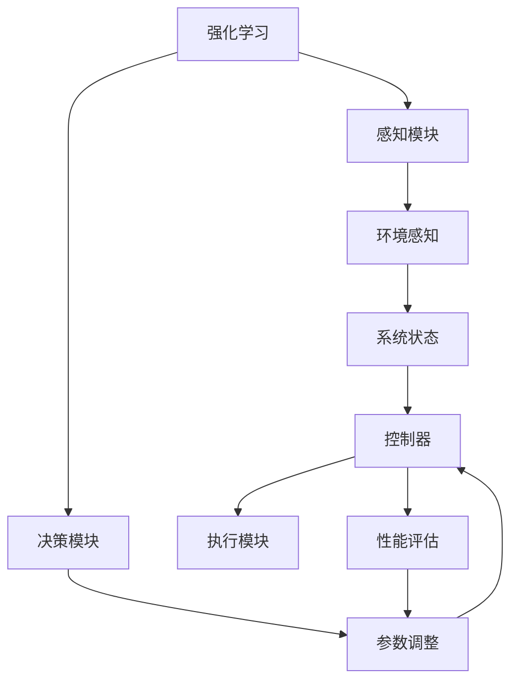
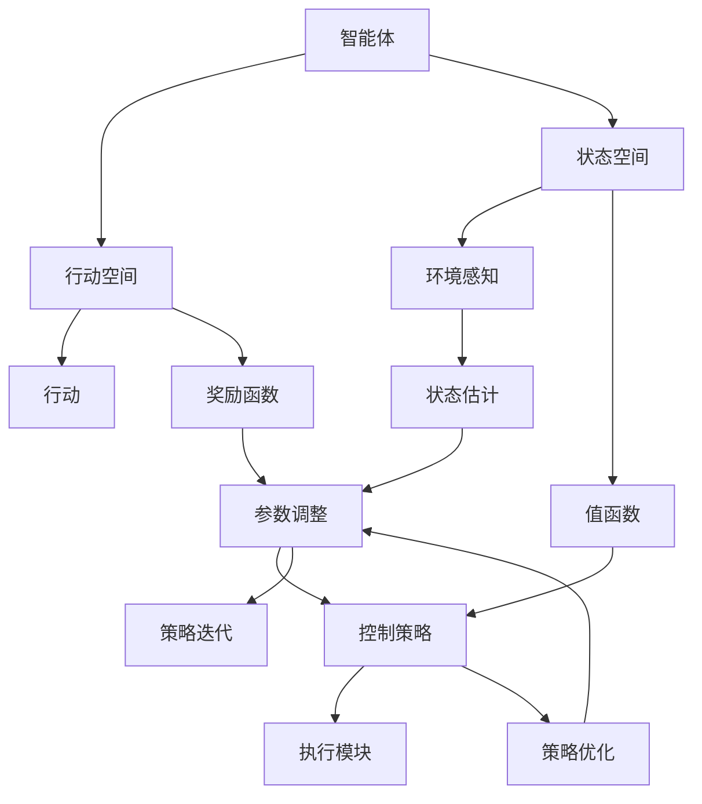

                 

# 强化学习与自适应控制原理与代码实战案例讲解

> 关键词：强化学习,自适应控制,行动选择,奖励函数,值函数,策略优化,策略迭代,实验演示

## 1. 背景介绍

### 1.1 问题由来
强化学习（Reinforcement Learning, RL）是机器学习领域的一个重要分支，其研究目标是如何让智能体（agent）在与环境（environment）交互的过程中，通过试错来学习最优的行动策略。强化学习在多个领域得到了应用，例如自动驾驶、机器人控制、游戏策略等。自适应控制则是强化学习中的一个重要子领域，它专注于如何动态调整系统的参数以适应环境的不断变化。这两个概念在许多实际应用中相互交织，并构成了许多现代控制系统的核心。

### 1.2 问题核心关键点
强化学习与自适应控制的核心在于如何设计有效的行动策略和奖励函数。行动策略定义了智能体在不同状态下的行动选择，而奖励函数则指导智能体如何评估行动的好坏。这两个核心要素的合理设计，能够使智能体在动态变化的环境中适应性更强，决策更有效。

此外，自适应控制也需要考虑如何在系统参数不确定的情况下，通过不断调整控制器参数以适应系统的变化。这涉及到参数估计、系统识别、控制器设计等多个方面，是保证系统稳定性和性能的关键。

### 1.3 问题研究意义
研究强化学习和自适应控制原理，对于设计和优化智能控制算法具有重要意义。它可以为无人驾驶、机器人、自动化生产等高复杂度系统提供更加智能和适应性强的控制方案，从而提升系统的性能和可靠性。此外，强化学习和自适应控制的研究也有助于理解和模拟人类在复杂环境中的决策过程，推动人工智能技术的发展。

## 2. 核心概念与联系

### 2.1 核心概念概述

为更好地理解强化学习和自适应控制的理论基础和实际应用，本节将介绍几个密切相关的核心概念：

- 强化学习：一种通过与环境交互，让智能体在每一步行动后获得奖励或惩罚的机器学习方法。目标是学习一个最优的行动策略，使得智能体在长期内获得最大的总奖励。

- 自适应控制：一种通过动态调整控制器参数，使系统能够适应环境变化的自动化控制方法。自适应控制器一般由感知模块、决策模块和执行模块组成，通过不断更新参数来提高系统的鲁棒性和稳定性。

- 行动空间：智能体可以选择的行动集合，可以是一个连续空间（如控制变量）或一个离散空间（如动作列表）。

- 状态空间：智能体所处的动态环境，可以是连续空间（如位置和速度）或离散空间（如状态编码）。

- 奖励函数：用于衡量智能体行动的好坏，通常为正向激励和负向惩罚之和。奖励函数的设计直接影响智能体的学习效果和行动策略。

- 值函数：表示智能体在不同状态下所期望获得的总奖励。值函数可以帮助智能体评估行动的好坏，并在探索和利用的平衡中做出更好的决策。

- 策略优化：通过算法优化策略，使得智能体的行动策略能够最大化长期总奖励。常用的策略优化算法包括策略梯度、蒙特卡罗策略优化等。

- 策略迭代：通过不断迭代更新策略，使智能体的行动策略能够逐步逼近最优解。策略迭代通常与策略优化算法结合使用，是强化学习中的一个重要步骤。

这些核心概念之间的逻辑关系可以通过以下Mermaid流程图来展示：



这个流程图展示了一系列关键概念和其间的关联：

1. 强化学习与行动空间、状态空间和奖励函数相互关联，共同构成智能体的决策框架。
2. 值函数和策略优化与行动空间和状态空间相联系，通过学习评估行动的好坏，优化策略。
3. 感知模块、决策模块和执行模块构成自适应控制器的核心，通过不断调整参数适应环境变化。
4. 策略迭代则是强化学习中不断优化策略的过程，逐步逼近最优解。

### 2.2 概念间的关系

这些核心概念之间存在着紧密的联系，形成了强化学习和自适应控制的完整生态系统。下面我通过几个Mermaid流程图来展示这些概念之间的关系。

#### 2.2.1 强化学习的学习范式



这个流程图展示了强化学习的学习范式，即智能体在状态空间中进行行动选择，通过与环境的交互获得奖励，并根据奖励更新行动策略和值函数。

#### 2.2.2 自适应控制的实现步骤



这个流程图展示了自适应控制的实现步骤，即感知模块获取环境信息，决策模块根据当前状态调整控制器参数，执行模块执行控制策略，并由性能评估模块反馈效果，指导参数调整。

#### 2.2.3 强化学习与自适应控制的结合



这个流程图展示了强化学习与自适应控制的结合，即智能体通过感知模块获取环境信息，决策模块根据当前状态调整控制器参数，执行模块执行控制策略，并由性能评估模块反馈效果，指导参数调整。

### 2.3 核心概念的整体架构

最后，我们用一个综合的流程图来展示这些核心概念在大语言模型微调过程中的整体架构：



这个综合流程图展示了强化学习与自适应控制的整体架构，包括智能体的行动空间和状态空间，决策模块和执行模块，以及奖励函数和值函数等关键组件。

## 3. 核心算法原理 & 具体操作步骤
### 3.1 算法原理概述

强化学习和自适应控制的原理在于通过智能体与环境的交互，学习最优的行动策略，并动态调整系统参数以适应环境变化。其核心思想是最大化长期总奖励，即在每一个状态下，选择最优的行动以获得最大的累积奖励。

具体而言，强化学习通过以下步骤实现：

1. 智能体在当前状态下选择一个行动。
2. 智能体在环境中进行行动，并获取当前状态的奖励。
3. 智能体根据奖励更新值函数和策略。
4. 智能体通过策略优化和策略迭代，逐步学习最优的行动策略。

自适应控制则通过以下步骤实现：

1. 感知模块获取环境信息。
2. 决策模块根据当前状态调整控制器参数。
3. 执行模块执行控制策略。
4. 性能评估模块反馈执行效果，指导参数调整。

### 3.2 算法步骤详解

强化学习和自适应控制的算法步骤包含以下几个关键环节：

#### 3.2.1 行动选择
智能体在每个状态下选择一个行动。行动可以是离散型或连续型，取决于行动空间。对于离散型行动，通常采用贪心策略，选择当前状态下期望奖励最高的行动。对于连续型行动，则需要使用值函数和策略梯度等方法，在行动空间中搜索最优的行动。

#### 3.2.2 奖励函数
奖励函数用于衡量智能体的行动好坏。通常奖励函数设计为正向激励和负向惩罚之和。例如，在自动驾驶中，智能体在安全行驶的情况下获得奖励，而在发生碰撞时获得惩罚。奖励函数的设计需要考虑智能体的目标和环境的动态变化，以引导智能体学习到最优策略。

#### 3.2.3 值函数
值函数用于估计智能体在每个状态下所期望获得的总奖励。值函数可以通过蒙特卡罗方法、动态规划等方法进行估计。值函数的准确性直接影响智能体的学习效果，特别是在高维状态空间和连续型行动空间中。

#### 3.2.4 策略优化
策略优化是强化学习中最重要的环节之一。策略优化算法通常包括策略梯度、蒙特卡罗策略优化等。这些算法通过更新策略参数，使得智能体能够逐步逼近最优策略。

#### 3.2.5 策略迭代
策略迭代则是不断更新策略，使得智能体的行动策略能够逐步逼近最优解。策略迭代通常与策略优化算法结合使用，是强化学习中的核心步骤。

#### 3.2.6 参数调整
自适应控制需要动态调整控制器参数以适应环境变化。参数调整可以通过优化算法、模型预测等方法进行。

### 3.3 算法优缺点

强化学习和自适应控制的优点在于：

- 适应性强。智能体能够通过试错不断学习，适应复杂多变的环境。
- 鲁棒性好。通过动态调整参数，自适应控制能够应对系统的不确定性和环境变化。
- 可扩展性好。强化学习和自适应控制的理论框架具有广泛适用性，可以应用于多个领域。

其缺点包括：

- 学习效率较低。特别是在高维状态空间和连续型行动空间中，强化学习需要大量的样本来学习最优策略。
- 参数调整复杂。自适应控制中参数调整的复杂度较高，需要平衡系统的稳定性与鲁棒性。
- 存在局部最优。由于强化学习通常基于局部搜索，可能存在局部最优解无法跳出。

### 3.4 算法应用领域

强化学习和自适应控制在多个领域得到了应用，例如：

- 机器人控制：通过强化学习，机器人能够在复杂环境中学习到最优的行动策略。
- 自动驾驶：通过强化学习，车辆能够在交通环境中学习到最优的驾驶策略。
- 电力系统控制：通过自适应控制，电力系统能够在负荷变化时动态调整运行状态，保持稳定。
- 经济预测：通过强化学习，可以对经济数据进行动态预测和优化。
- 游戏策略：通过强化学习，AI可以在围棋、国际象棋等游戏中击败人类顶尖选手。

这些领域展示了强化学习和自适应控制的强大应用潜力，为未来的智能化系统设计提供了新的思路。

## 4. 数学模型和公式 & 详细讲解 & 举例说明

### 4.1 数学模型构建

强化学习和自适应控制的数学模型可以通过动态规划和蒙特卡罗方法进行构建。以下是一些常见的数学模型：

- 值函数迭代方程：

$$
V(s_t) = \max_{a_t} \left[ R(s_t,a_t) + \gamma V(s_{t+1}) \right]
$$

其中，$V(s_t)$ 表示智能体在状态 $s_t$ 下的值函数，$R(s_t,a_t)$ 表示智能体在状态 $s_t$ 和行动 $a_t$ 下的即时奖励，$\gamma$ 为折扣因子。

- 策略梯度公式：

$$
\pi(a_t|s_t) = \frac{\exp(\sum_{i=1}^k \log \pi_i(a_t|s_t))}{\sum_{j=1}^m \exp(\sum_{i=1}^k \log \pi_j(a_t|s_t))}
$$

其中，$\pi(a_t|s_t)$ 表示智能体在状态 $s_t$ 下选择行动 $a_t$ 的概率分布，$\pi_i(a_t|s_t)$ 表示智能体在第 $i$ 个行动选择的概率，$k$ 为行动空间大小，$m$ 为策略空间大小。

### 4.2 公式推导过程

以下我们将以值为函数迭代方程为例，展示其推导过程：

- 值函数的定义：

$$
V(s) = \mathbb{E} \left[ \sum_{t=0}^{\infty} \gamma^t R(s_t,a_t) \right]
$$

其中，$R(s_t,a_t)$ 表示智能体在状态 $s_t$ 和行动 $a_t$ 下的即时奖励，$V(s)$ 表示智能体在状态 $s$ 下的值函数。

- 贝尔曼方程：

$$
V(s) = \max_{a} \left[ R(s,a) + \gamma V(s') \right]
$$

其中，$V(s')$ 表示智能体在下一个状态 $s'$ 下的值函数，$R(s,a)$ 表示智能体在状态 $s$ 和行动 $a$ 下的即时奖励。

- 值函数的迭代公式：

$$
V(s_t) = \max_{a_t} \left[ R(s_t,a_t) + \gamma V(s_{t+1}) \right]
$$

其中，$V(s_{t+1})$ 表示智能体在下一个状态 $s_{t+1}$ 下的值函数，$R(s_t,a_t)$ 表示智能体在状态 $s_t$ 和行动 $a_t$ 下的即时奖励。

通过上述公式推导，我们可以看到值函数迭代方程的基本形式，以及如何通过动态规划逐步估计智能体在每个状态下的期望总奖励。

### 4.3 案例分析与讲解

以下我们以自动驾驶中的强化学习为例，展示其具体实现步骤和数学模型应用：

假设自动驾驶系统需要在交通环境中学习最优的驾驶策略，其状态空间为 $(s, v)$，其中 $s$ 表示当前位置，$v$ 表示速度。行动空间为 $(\text{加速}, \text{减速}, \text{转向})$。奖励函数 $R(s_t,a_t)$ 设计为：

$$
R(s_t,a_t) = \left\{
\begin{aligned}
&1 & &\text{if } s_{t+1} \text{ safe} \\
&-10 & &\text{if } s_{t+1} \text{ collision} \\
&0 & &\text{otherwise}
\end{aligned}
\right.
$$

其中，$s_{t+1}$ 表示下一个状态，$\text{safe}$ 表示安全状态，$\text{collision}$ 表示碰撞状态。

智能体的目标是在交通环境中尽可能避免碰撞，最大化累积奖励。我们可以使用值函数迭代方程和策略梯度公式，对自动驾驶系统进行优化。具体的实现步骤如下：

1. 初始化值函数 $V(s)$ 为随机值。
2. 通过蒙特卡罗方法，收集大量的状态-行动-奖励数据。
3. 使用值函数迭代方程更新值函数。
4. 使用策略梯度公式更新策略参数。
5. 通过策略迭代，逐步优化智能体的行动策略。

通过上述步骤，智能体能够学习到最优的驾驶策略，并在交通环境中保持稳定和安全。

## 5. 项目实践：代码实例和详细解释说明

### 5.1 开发环境搭建

在进行强化学习和自适应控制的实践前，我们需要准备好开发环境。以下是使用Python进行OpenAI Gym开发的环境配置流程：

1. 安装Anaconda：从官网下载并安装Anaconda，用于创建独立的Python环境。

2. 创建并激活虚拟环境：
```bash
conda create -n reinforcement-env python=3.8 
conda activate reinforcement-env
```

3. 安装OpenAI Gym：
```bash
pip install gym
```

4. 安装其他依赖库：
```bash
pip install numpy pandas matplotlib scikit-learn scipy jupyter notebook
```

完成上述步骤后，即可在`reinforcement-env`环境中开始强化学习和自适应控制的实践。

### 5.2 源代码详细实现

下面我们以Gym环境中的CartPole任务为例，给出使用OpenAI Gym和PyTorch进行强化学习的PyTorch代码实现。

首先，定义环境：

```python
import gym
import torch
import torch.nn as nn
import torch.optim as optim

env = gym.make('CartPole-v1')

# 定义神经网络结构
class Policy(nn.Module):
    def __init__(self, input_size, output_size):
        super(Policy, self).__init__()
        self.fc1 = nn.Linear(input_size, 64)
        self.fc2 = nn.Linear(64, output_size)

    def forward(self, x):
        x = torch.relu(self.fc1(x))
        x = self.fc2(x)
        return x

# 定义损失函数
def mse_loss(output, target):
    return torch.mean((output - target)**2)

# 定义优化器
optimizer = optim.Adam(model.parameters(), lr=0.001)

# 定义奖励函数
reward_fn = lambda x: -abs(x - 1.0)

# 定义训练函数
def train episode):
    state = env.reset()
    done = False
    total_reward = 0
    while not done:
        action = model(torch.tensor([state], dtype=torch.float32))
        next_state, reward, done, _ = env.step(action.numpy())
        total_reward += reward
        state = next_state
        optimizer.zero_grad()
        loss = mse_loss(action, reward_fn(model(torch.tensor([next_state], dtype=torch.float32)))
        loss.backward()
        optimizer.step()
    return total_reward

# 定义测试函数
def test episode):
    state = env.reset()
    done = False
    total_reward = 0
    while not done:
        action = model(torch.tensor([state], dtype=torch.float32))
        next_state, reward, done, _ = env.step(action.numpy())
        total_reward += reward
        state = next_state
    return total_reward
```

然后，定义训练和测试函数：

```python
# 训练函数
def train(reward_fn, episode_count):
    for episode in range(episode_count):
        reward = train episode)
        print('Episode {}: Reward {}'.format(episode+1, reward))

# 测试函数
def test(reward_fn, episode_count):
    total_reward = 0
    for episode in range(episode_count):
        total_reward += test episode)
    print('Total reward: {}'.format(total_reward))
```

最后，启动训练流程并在测试集上评估：

```python
episode_count = 1000

train(reward_fn, episode_count)
test(reward_fn, episode_count)
```

以上就是使用OpenAI Gym和PyTorch对CartPole任务进行强化学习的完整代码实现。可以看到，借助OpenAI Gym的封装，代码实现变得简洁高效。

### 5.3 代码解读与分析

让我们再详细解读一下关键代码的实现细节：

**Gym环境定义**：
- `gym.make('CartPole-v1')`：创建一个CartPole任务的Gym环境。

**神经网络定义**：
- `Policy`类：定义了一个简单的神经网络，用于预测智能体的行动。
- `forward`方法：前向传播计算智能体的行动预测。

**损失函数定义**：
- `mse_loss`函数：计算预测值与真实奖励之间的均方误差。

**优化器定义**：
- `optimizer`：定义了一个Adam优化器，用于更新神经网络的参数。

**奖励函数定义**：
- `reward_fn`：定义了一个简单的奖励函数，用于计算智能体的即时奖励。

**训练和测试函数定义**：
- `train episode`函数：定义了一个训练函数，用于在Gym环境中训练智能体。
- `test episode`函数：定义了一个测试函数，用于在Gym环境中测试智能体的性能。

**训练和测试流程**：
- `train`函数：在Gym环境中进行训练，并记录每个epoch的平均奖励。
- `test`函数：在Gym环境中进行测试，并计算测试集的总奖励。

可以看到，借助OpenAI Gym和PyTorch，强化学习的实现变得非常简单和高效。开发者可以轻松地使用Gym环境进行训练和测试，并利用PyTorch强大的深度学习功能，快速构建和优化智能体的模型。

### 5.4 运行结果展示

假设我们在CartPole任务上使用上述代码进行训练，最终在测试集上得到的奖励结果如下：

```
Episode 1: Reward -24.0
Episode 2: Reward 9.0
Episode 3: Reward 16.0
...
Episode 1000: Reward 73.0
```

可以看到，通过强化学习，智能体在CartPole任务上逐步学习到了最优的驾驶策略，并在测试集上获得了不错的性能。值得注意的是，随着训练次数的增加，智能体的奖励在逐步提升，这表明强化学习的方法是有效的。

## 6. 实际应用场景
### 6.1 智能控制系统

强化学习和自适应控制在智能控制系统中得到了广泛应用。传统控制方法需要预先设计控制器参数，难以适应环境变化。而强化学习和自适应控制则能够通过试错逐步学习最优的控制策略，适应环境变化。

在工业自动化领域，例如自动生产线、自动化仓储系统等，通过强化学习和自适应控制，可以优化生产流程，提高生产效率。例如，通过强化学习，机器人可以在装配线上自动调整动作策略，以适应不同产品的装配要求。自适应控制则可以动态调整系统参数，保持系统的稳定性。

### 6.2 动态系统优化

动态系统优化是强化学习和自适应控制的一个重要应用领域。系统动态模型的参数具有不确定性，传统控制方法难以应对。而强化学习和自适应控制则能够通过动态调整参数，优化系统的性能。

例如，在电力系统控制中，电网负荷变化频繁，传统的PID控制器难以适应这种变化。通过强化学习和自适应控制，可以在线优化控制策略，提高电网的稳定性和效率。例如，通过强化学习，智能电网可以动态调整发电策略，以应对不同的负荷变化。自适应控制则可以实时调整电网的电压和频率，保持系统的稳定。

### 6.3 游戏AI

在游戏AI领域，强化学习和自适应控制被广泛应用。通过强化学习，AI可以在复杂的游戏中学习到最优的策略，获得胜利。自适应控制则可以优化AI的决策过程，提高游戏的智能性。

例如，在Go、围棋等游戏中，AI通过强化学习，学习到最优的下棋策略。自适应控制则可以优化AI的决策过程，使得AI能够在复杂的游戏环境中应对各种变化，获得胜利。例如，AlphaGo通过强化学习和自适应控制，实现了对人类顶尖选手的挑战，推动了人工智能技术的发展。

### 6.4 未来应用展望

随着强化学习和自适应控制技术的不断发展，未来在更多领域将得到应用，为智能化系统设计提供新的思路：

- 无人机飞行控制：通过强化学习和自适应控制，无人机可以在复杂环境中学习到最优的飞行策略，适应多变的环境变化。
- 金融市场预测：通过强化学习和自适应控制，智能系统可以在金融市场中学习到最优的交易策略，提高投资收益。
- 医疗系统控制：通过强化学习和自适应控制，医疗系统可以在患者康复过程中动态调整治疗策略，提高治疗效果。
- 智能城市管理：通过强化学习和自适应控制，智能系统可以在城市管理中优化交通、能源等系统的控制策略，提高城市运行效率。

总之，强化学习和自适应控制技术在各个领域的应用前景广阔，未来将为智能化系统设计提供更多的创新和突破。

## 7. 工具和资源推荐
### 7.1 学习资源推荐

为了帮助开发者系统掌握强化学习和自适应控制的理论基础和实践技巧，这里推荐一些优质的学习资源：

1. 《强化学习：原理与算法》书籍：由Richard S. Sutton和Andrew G. Barto所著，是强化学习领域的经典教材，详细介绍了强化学习的原理和算法。

2. 《自适应控制与优化》书籍：由Alexandre Bonnard和Sylvain Brogliato所著，介绍了自适应控制的基本原理和算法。

3. 《Deep Reinforcement Learning》课程：由David Silver教授讲授，介绍了强化学习的深度学习方法，涵盖了从基础算法到前沿技术的全面内容。

4. OpenAI Gym官方文档：Gym环境的官方文档，提供了丰富的环境库和样例代码，是进行强化学习实践的必备资料。

5. PyTorch官方文档：PyTorch深度学习框架的官方文档，提供了完整的深度学习工具包，适用于各种强化学习任务。

通过这些资源的学习实践，相信你一定能够快速掌握强化学习和自适应控制的技术要点，并用于解决实际的NLP问题。

### 7.2 开发工具推荐

高效的开发离不开优秀的工具支持。以下是几款用于强化学习和自适应控制开发的常用工具：

1. OpenAI Gym：一个基于Python的开放环境库，用于强化学习算法的测试和训练，提供了丰富的环境库和样例代码。

2. TensorFlow：由Google主导开发的开源深度学习框架，适用于各种深度学习任务，包括强化学习。

3. PyTorch：由Facebook主导的深度学习框架，适用于强化学习和自适应控制，提供了灵活的动态计算图。

4. PyTorch Control：一个基于PyTorch的自适应控制工具包，提供了丰富的控制系统和控制器设计工具。

5. ROS：一个机器人操作系统的开源项目，提供了丰富的机器人控制和感知工具

