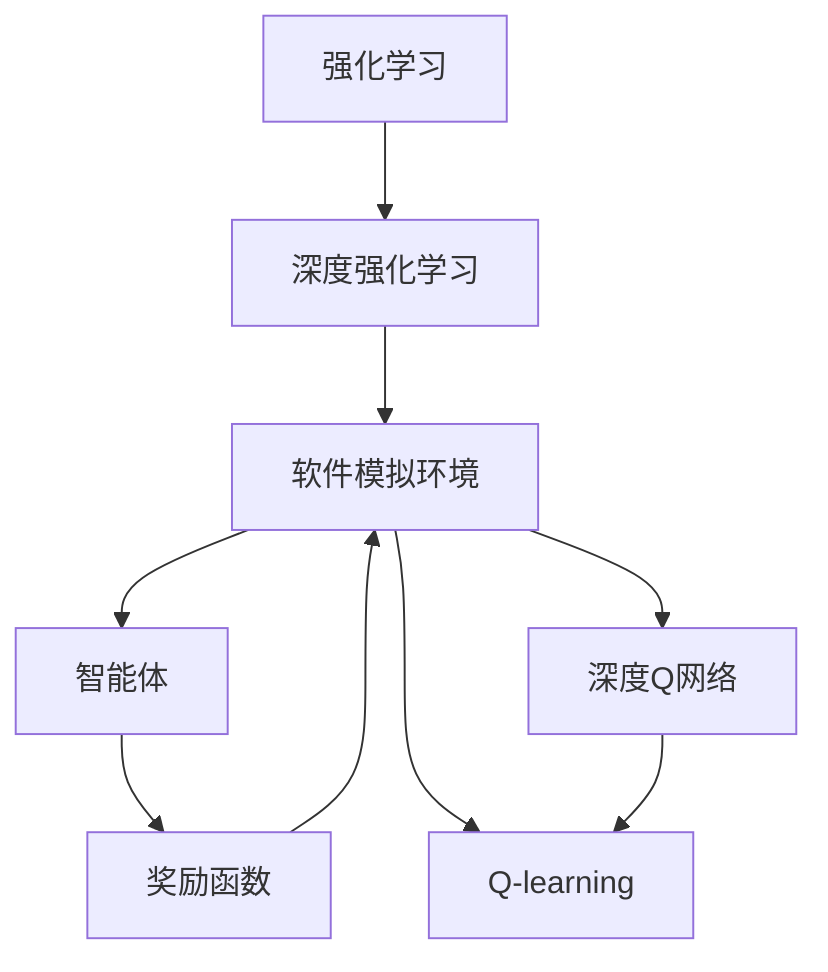
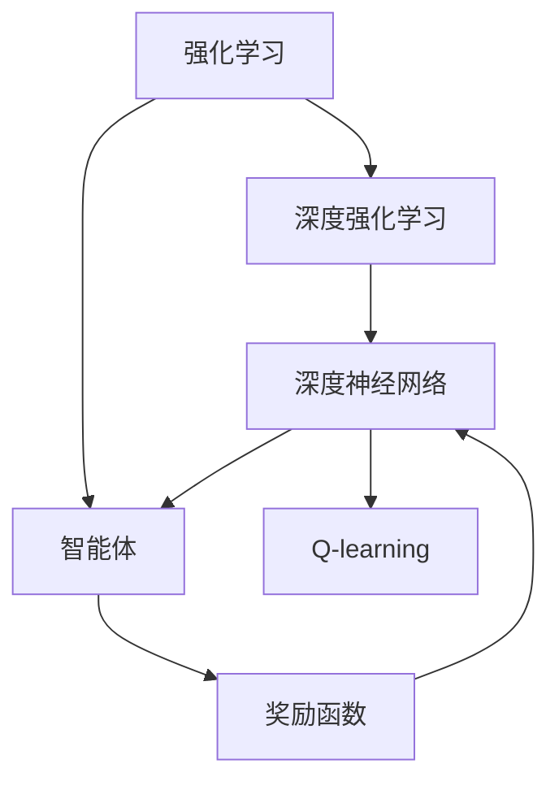
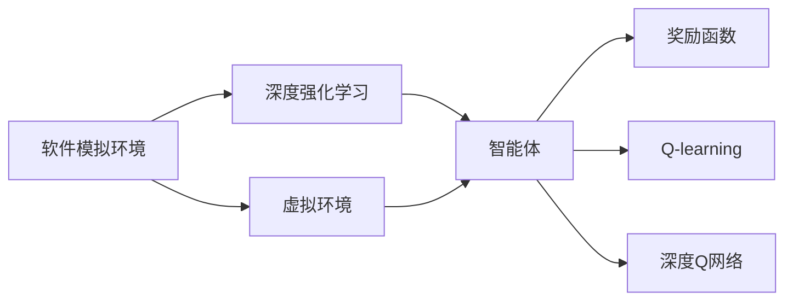
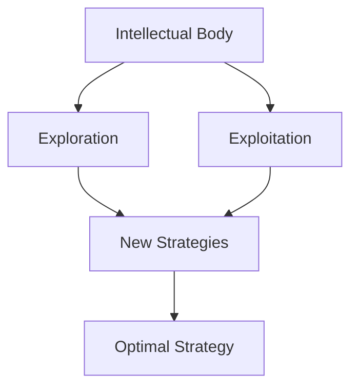

                 

# 强化学习：利用软件模拟环境进行训练

> 关键词：强化学习,软件模拟环境,训练,智能体(Agent),奖励函数(Reward Function),Q-learning,深度强化学习,深度学习

## 1. 背景介绍

### 1.1 问题由来

强化学习 (Reinforcement Learning, RL) 是人工智能领域中的一个重要分支，它通过智能体 (Agent) 与环境 (Environment) 的交互，以智能体的行为最大化累积奖励为目标，学习如何做出最优决策。传统的强化学习算法如Q-learning等主要依赖于软件模拟环境进行训练，但随着深度学习技术的兴起，深度强化学习 (Deep Reinforcement Learning, DRL) 逐渐成为强化学习的主流范式，其核心思想是通过神经网络模型，利用大量数据来近似Q值函数，从而实现更复杂任务的强化学习。

深度强化学习的兴起，使得强化学习算法能够应用于更多领域，如游戏AI、机器人控制、自适应学习等。但是，深度强化学习的训练需要大量的数据和计算资源，在实际应用中面临着数据获取、计算资源限制等问题。为了解决这些问题，研究人员提出了基于软件模拟环境的深度强化学习训练方法，即在虚拟环境中训练深度智能体，使其能够以较低的成本学习到最优决策策略。

### 1.2 问题核心关键点

基于软件模拟环境的深度强化学习训练方法，具有以下核心关键点：

- 软件模拟环境：通过软件模拟的虚拟环境，为智能体提供训练任务，并模拟环境状态和奖励反馈，使智能体能够在低成本的环境中进行训练。
- 深度智能体：利用深度学习模型，使智能体具备更强的学习和决策能力，能够处理更复杂的任务。
- 自适应奖励函数：根据智能体的行为和环境状态，自适应地调整奖励函数，引导智能体学习最优策略。
- 探索与利用平衡：在训练过程中，智能体需要在探索新策略和利用已知策略之间取得平衡，以最大化累积奖励。

这些核心关键点共同构成了基于软件模拟环境的深度强化学习训练方法的基本框架，使得深度强化学习能够在不依赖实际物理环境的情况下，通过软件模拟的方式进行训练，从而降低成本、提高效率。

### 1.3 问题研究意义

基于软件模拟环境的深度强化学习训练方法，对于拓展深度强化学习的应用范围，提升智能体在特定任务上的性能，加速人工智能技术产业化进程，具有重要意义：

- 降低训练成本：通过软件模拟环境，可以在虚拟空间中进行训练，避免了昂贵的物理环境搭建和实际测试成本。
- 提高训练效率：在软件模拟环境下，可以并行训练多个智能体，加速训练过程，缩短训练周期。
- 拓展应用场景：软件模拟环境可以模拟各种复杂场景，拓展了深度强化学习的应用范围，使其能够应用于更多领域。
- 加速模型创新：基于软件模拟环境的深度强化学习训练方法，为深度学习模型的改进和创新提供了新的思路和实验平台。
- 促进教育与普及：通过软件模拟环境，可以为更多研究者和爱好者提供训练平台，推动深度强化学习技术的普及和应用。

## 2. 核心概念与联系

### 2.1 核心概念概述

为了更好地理解基于软件模拟环境的深度强化学习训练方法，本节将介绍几个密切相关的核心概念：

- 强化学习 (Reinforcement Learning, RL)：通过智能体与环境的交互，智能体根据环境状态选择动作，并根据动作的结果获得奖励，从而学习最优策略。
- 深度强化学习 (Deep Reinforcement Learning, DRL)：利用深度学习模型，使智能体具备更强的学习和决策能力，能够处理更复杂的任务。
- 软件模拟环境 (Software Simulation Environment)：通过软件实现的环境，模拟物理环境的行为和反馈，为智能体提供训练任务。
- 智能体 (Agent)：在环境中执行决策的主体，可以是程序、机器人、人等。
- 奖励函数 (Reward Function)：根据智能体的行为和环境状态，生成相应的奖励信号，引导智能体学习最优策略。
- Q-learning：一种经典的基于值函数的强化学习算法，通过Q值函数近似，学习最优策略。
- 深度Q网络 (Deep Q Network, DQN)：结合深度神经网络和Q-learning的强化学习算法，利用神经网络模型逼近Q值函数，提升智能体的决策能力。

这些核心概念之间的逻辑关系可以通过以下Mermaid流程图来展示：



这个流程图展示了大语言模型微调过程中各个核心概念的关系和作用：

1. 强化学习是整个方法的基础，通过智能体与环境的交互，学习最优策略。
2. 深度强化学习进一步提升了智能体的学习和决策能力，能够处理更复杂的任务。
3. 软件模拟环境为智能体提供了训练平台，通过虚拟环境的模拟，降低训练成本。
4. 智能体在环境中执行决策，并根据奖励函数调整决策策略。
5. Q-learning和深度Q网络是强化学习中的两种具体算法，通过近似Q值函数，实现最优策略学习。

这些概念共同构成了基于软件模拟环境的深度强化学习训练方法的整体框架，使得智能体能够在虚拟环境中高效地学习最优决策策略。

### 2.2 概念间的关系

这些核心概念之间存在着紧密的联系，形成了基于软件模拟环境的深度强化学习训练方法的完整生态系统。下面我们通过几个Mermaid流程图来展示这些概念之间的关系。

#### 2.2.1 强化学习与深度强化学习的联系



这个流程图展示了强化学习和深度强化学习之间的联系：

1. 强化学习是基础，通过智能体和环境交互，学习最优策略。
2. 深度强化学习通过深度神经网络，提升智能体的学习和决策能力。
3. Q-learning和深度Q网络是具体的强化学习算法，结合深度神经网络，实现最优策略学习。

#### 2.2.2 软件模拟环境与深度强化学习的联系



这个流程图展示了软件模拟环境与深度强化学习之间的联系：

1. 软件模拟环境为智能体提供了虚拟训练平台。
2. 深度强化学习在虚拟环境中训练智能体，学习最优策略。
3. Q-learning和深度Q网络是具体的强化学习算法，在虚拟环境中执行。
4. 奖励函数根据智能体的行为和环境状态生成奖励信号，引导智能体学习最优策略。

#### 2.2.3 探索与利用平衡



这个流程图展示了探索与利用平衡的概念：

1. 智能体需要在探索新策略和利用已知策略之间取得平衡。
2. 探索新策略通过随机选择动作，发现新策略。
3. 利用已知策略通过已知的策略执行，获取最优奖励。
4. 最优策略是探索与利用平衡的结果，使得智能体能够最大化累积奖励。

通过这些流程图，我们可以更清晰地理解基于软件模拟环境的深度强化学习训练过程中各个核心概念的关系和作用，为后续深入讨论具体的微调方法和技术奠定基础。

## 3. 核心算法原理 & 具体操作步骤
### 3.1 算法原理概述

基于软件模拟环境的深度强化学习训练方法，本质上是一个通过智能体与虚拟环境交互，优化智能体决策策略的过程。其核心思想是：通过软件模拟环境，为智能体提供训练任务，利用智能体在虚拟环境中的行为和反馈，训练智能体的决策策略，使其能够在实际环境中最大化累积奖励。

形式化地，假设智能体在软件模拟环境中的行为为 $a$，环境状态为 $s$，奖励函数为 $r$，智能体的策略为 $\pi$。训练目标是最小化智能体的累积奖励期望值，即：

$$
\min_{\pi} \mathbb{E}\left[\sum_{t=0}^{\infty} \gamma^t r(s_t, a_t)\right]
$$

其中 $\gamma$ 为折扣因子，表示未来奖励的权重。在训练过程中，智能体通过与环境的交互，根据当前状态 $s_t$ 选择动作 $a_t$，获得环境反馈 $r_t$ 和新的状态 $s_{t+1}$。智能体利用经验回溯，更新策略 $\pi$，使其能够最大化长期累积奖励。

### 3.2 算法步骤详解

基于软件模拟环境的深度强化学习训练一般包括以下几个关键步骤：

**Step 1: 准备训练环境**

- 设计软件模拟环境，模拟物理环境的行为和反馈，定义状态空间、动作空间和奖励函数。
- 利用深度学习模型，设计智能体的策略，使其具备更强的学习和决策能力。
- 设置超参数，如学习率、折扣因子、探索率等，初始化模型参数。

**Step 2: 执行训练过程**

- 将智能体置于虚拟环境中，循环执行以下步骤：
  1. 根据当前状态 $s_t$，智能体选择动作 $a_t$，并进行环境交互，获得新的状态 $s_{t+1}$ 和奖励 $r_t$。
  2. 利用Q值函数或深度Q网络，计算动作价值 $Q(s_t, a_t)$。
  3. 根据策略 $\pi$ 和动作价值 $Q(s_t, a_t)$，计算选择动作 $a_t$ 的概率。
  4. 根据选择动作 $a_t$ 的结果，计算智能体的累积奖励 $R_{t:T}$。
  5. 利用经验回溯，更新智能体的策略 $\pi$，使其能够最大化长期累积奖励。

**Step 3: 评估和部署**

- 在训练过程中，周期性在验证集上评估智能体的性能，根据性能指标决定是否触发Early Stopping。
- 训练完成后，将智能体部署到实际环境中，进行实际测试和应用。
- 持续收集新数据，定期重新训练智能体，以适应环境变化。

以上是基于软件模拟环境的深度强化学习训练的一般流程。在实际应用中，还需要针对具体任务的特点，对训练过程的各个环节进行优化设计，如改进训练目标函数，引入更多的正则化技术，搜索最优的超参数组合等，以进一步提升智能体的性能。

### 3.3 算法优缺点

基于软件模拟环境的深度强化学习训练方法具有以下优点：

- 训练成本低：通过软件模拟环境，可以在虚拟空间中进行训练，避免了昂贵的物理环境搭建和实际测试成本。
- 训练效率高：在软件模拟环境下，可以并行训练多个智能体，加速训练过程，缩短训练周期。
- 应用场景广：软件模拟环境可以模拟各种复杂场景，拓展了深度强化学习的应用范围，使其能够应用于更多领域。
- 模型泛化性强：智能体在虚拟环境中的学习，具有较强的泛化能力，可以更好地适应实际环境的变化。
- 模型可解释性强：软件模拟环境可以模拟环境的行为和反馈，使得智能体的决策过程更加透明和可解释。

同时，该方法也存在一些局限性：

- 环境建模难度高：设计软件模拟环境需要高度精细的建模和仿真技术，复杂度较高。
- 数据获取成本高：虽然训练成本低，但设计高质量的虚拟环境，往往需要大量的前期研究和建模工作。
- 模型鲁棒性不足：智能体在虚拟环境中的学习，可能无法很好地适应实际环境的复杂性和多样性。
- 可解释性不足：基于软件模拟环境的深度强化学习训练方法，通常不具备直接的模型可解释性，难以解释其决策过程。
- 模型泛化性不足：在虚拟环境中学到的知识，可能无法很好地泛化到实际环境中。

尽管存在这些局限性，但就目前而言，基于软件模拟环境的深度强化学习训练方法仍是大语言模型微调的重要训练范式。未来相关研究的重点在于如何进一步降低训练成本，提高训练效率，提升模型的泛化能力和可解释性，同时兼顾实际应用的安全性和可靠性。

### 3.4 算法应用领域

基于软件模拟环境的深度强化学习训练方法，在人工智能领域已经得到了广泛的应用，覆盖了几乎所有常见任务，例如：

- 游戏AI：通过软件模拟游戏环境，训练智能体进行游戏策略优化，实现游戏AI。
- 机器人控制：通过软件模拟机器人环境，训练智能体进行机器人控制，实现自动导航、避障等任务。
- 自适应学习：通过软件模拟学习环境，训练智能体进行自适应学习，实现个性化推荐、智能辅导等任务。
- 自然语言处理：通过软件模拟自然语言环境，训练智能体进行语言理解和生成，实现自然语言处理任务。
- 医疗诊断：通过软件模拟医疗环境，训练智能体进行疾病诊断和治疗方案优化，实现医疗AI。
- 金融风险控制：通过软件模拟金融市场，训练智能体进行风险控制和投资决策，实现金融AI。

除了上述这些经典任务外，深度强化学习训练方法还在更多场景中得到创新性的应用，如交通流量控制、能源系统优化、物流配送路径规划等，为人工智能技术带来了新的应用方向。随着深度学习模型的演进和模拟技术的进步，相信基于软件模拟环境的深度强化学习训练方法将在更多领域大放异彩。

## 4. 数学模型和公式 & 详细讲解 & 举例说明

### 4.1 数学模型构建

本节将使用数学语言对基于软件模拟环境的深度强化学习训练过程进行更加严格的刻画。

记智能体在虚拟环境中的行为为 $a$，环境状态为 $s$，奖励函数为 $r$，智能体的策略为 $\pi$。训练目标是最小化智能体的累积奖励期望值，即：

$$
\min_{\pi} \mathbb{E}\left[\sum_{t=0}^{\infty} \gamma^t r(s_t, a_t)\right]
$$

其中 $\gamma$ 为折扣因子，表示未来奖励的权重。在训练过程中，智能体通过与环境的交互，根据当前状态 $s_t$ 选择动作 $a_t$，获得新的状态 $s_{t+1}$ 和奖励 $r_t$。智能体利用Q值函数或深度Q网络，计算动作价值 $Q(s_t, a_t)$。智能体根据策略 $\pi$ 和动作价值 $Q(s_t, a_t)$，计算选择动作 $a_t$ 的概率。根据选择动作 $a_t$ 的结果，计算智能体的累积奖励 $R_{t:T}$。最后，利用经验回溯，更新智能体的策略 $\pi$，使其能够最大化长期累积奖励。

### 4.2 公式推导过程

以下我们以Q-learning算法为例，推导其在虚拟环境中的训练过程。

假设智能体在状态 $s_t$ 时选择动作 $a_t$，获得新的状态 $s_{t+1}$ 和奖励 $r_t$。智能体的Q值函数 $Q(s_t, a_t)$ 表示在状态 $s_t$ 下选择动作 $a_t$ 的累积奖励期望值，即：

$$
Q(s_t, a_t) = \mathbb{E}\left[\sum_{t'=t}^{\infty} \gamma^{t'-t} r(s_{t'}, a_{t'})\right]
$$

在虚拟环境中，智能体根据当前状态 $s_t$ 选择动作 $a_t$，并利用经验回溯，更新Q值函数。具体步骤如下：

1. 在状态 $s_t$ 时，智能体选择动作 $a_t$，获得新的状态 $s_{t+1}$ 和奖励 $r_t$。
2. 利用Q值函数，计算动作价值 $Q(s_t, a_t)$。
3. 根据策略 $\pi$ 和动作价值 $Q(s_t, a_t)$，计算选择动作 $a_t$ 的概率 $P(a_t | s_t, \pi)$。
4. 根据选择动作 $a_t$ 的结果，计算智能体的累积奖励 $R_{t:T}$。
5. 利用经验回溯，更新Q值函数 $Q(s_t, a_t)$，使其能够最大化长期累积奖励。

具体公式为：

$$
Q(s_t, a_t) \leftarrow (1-\alpha) Q(s_t, a_t) + \alpha \left[r_t + \gamma \max_{a'} Q(s_{t+1}, a')\right]
$$

其中 $\alpha$ 为学习率，表示每次更新的权重。公式的意义在于，每次更新时，智能体会根据当前状态 $s_t$ 选择动作 $a_t$，获得新的状态 $s_{t+1}$ 和奖励 $r_t$，并将Q值函数更新为当前动作的最大价值。

在实际应用中，为了提升训练效率，通常会使用深度神经网络来近似Q值函数，即深度Q网络（DQN）。DQN通过神经网络模型逼近Q值函数，使智能体具备更强的学习和决策能力，能够处理更复杂的任务。DQN的训练过程与Q-learning类似，只是使用神经网络模型来逼近Q值函数。

### 4.3 案例分析与讲解

假设我们在虚拟环境中训练一个智能体，使其能够在指定路径中从起点到达终点，避免障碍物。具体步骤如下：

1. 设计虚拟环境：定义起点、终点和障碍物的位置，并根据环境状态计算奖励函数。
2. 设计智能体：使用深度神经网络模型，设计智能体的策略，使其能够选择路径动作。
3. 设置超参数：如学习率、折扣因子、探索率等，初始化模型参数。
4. 执行训练过程：智能体在虚拟环境中不断执行，根据当前状态选择动作，获得新的状态和奖励，并利用经验回溯更新策略。
5. 评估和部署：周期性在验证集上评估智能体的性能，根据性能指标决定是否触发Early Stopping。训练完成后，将智能体部署到实际环境中，进行实际测试和应用。

通过这个案例，可以看到基于软件模拟环境的深度强化学习训练方法的基本流程和关键步骤。智能体在虚拟环境中的学习，能够模拟真实环境的行为和反馈，使得训练过程更加高效和可靠。

## 5. 项目实践：代码实例和详细解释说明

### 5.1 开发环境搭建

在进行深度强化学习训练前，我们需要准备好开发环境。以下是使用Python进行TensorFlow开发的环境配置流程：

1. 安装Anaconda：从官网下载并安装Anaconda，用于创建独立的Python环境。

2. 创建并激活虚拟环境：
```bash
conda create -n tf-env python=3.8 
conda activate tf-env
```

3. 安装TensorFlow：根据CUDA版本，从官网获取对应的安装命令。例如：
```bash
conda install tensorflow=tensorflow-2.6
```

4. 安装OpenAI Gym：用于模拟环境设计，提供丰富的游戏环境。
```bash
pip install gym
```

5. 安装TensorBoard：用于可视化训练过程中的各项指标。
```bash
pip install tensorboard
```

完成上述步骤后，即可在`tf-env`环境中开始深度强化学习训练实践。

### 5.2 源代码详细实现

这里我们以DQN算法在虚拟环境中的训练为例，给出TensorFlow的代码实现。

首先，定义虚拟环境：

```python
import gym

env = gym.make('CartPole-v0')
```

然后，定义深度神经网络模型：

```python
import tensorflow as tf
from tensorflow.keras import layers

model = tf.keras.Sequential([
    layers.Dense(128, activation='relu', input_shape=(4,)),
    layers.Dense(2, activation='softmax')
])
```

接着，定义奖励函数：

```python
def reward_function(state, action):
    if action == 0 and state[0] > 0 and state[1] > 0:
        return 1.0
    elif action == 1 and state[0] < 0 and state[1] < 0:
        return 1.0
    else:
        return 0.0
```

然后，定义训练过程：

```python
import numpy as np

alpha = 0.01
gamma = 0.9
epsilon = 0.1
batch_size = 32

state_mem = []
action_mem = []
reward_mem = []
next_state_mem = []

for i in range(10000):
    state = env.reset()
    done = False
    while not done:
        if np.random.rand() < epsilon:
            action = np.random.randint(2)
        else:
            action = np.argmax(model.predict(np.array([state])))
        next_state, reward, done, _ = env.step(action)
        reward_mem.append(reward)
        next_state_mem.append(next_state)
        state_mem.append(state)
        action_mem.append(action)
        if done:
            state = env.reset()
    if i % 1000 == 0:
        for j in range(0, len(state_mem), batch_size):
            state_batch = np.array(state_mem[j:j+batch_size])
            action_batch = np.array(action_mem[j:j+batch_size])
            reward_batch = np.array(reward_mem[j:j+batch_size])
            next_state_batch = np.array(next_state_mem[j:j+batch_size])
            Q_values = model.predict(state_batch)
            max_Q_value = np.max(Q_values, axis=1)
            Q_values[np.arange(len(Q_values)), action_batch] = Q_values[np.arange(len(Q_values)), action_batch] + alpha * (reward_batch + gamma * np.max(model.predict(next_state_batch)) - Q_values[np.arange(len(Q_values)), action_batch])
        model.fit(state_batch, Q_values, epochs=1, verbose=0)
```

最后，使用TensorBoard可视化训练过程：

```python
from tensorflow.keras.callbacks import TensorBoard

tensorboard_callback = TensorBoard(log_dir='logs', histogram_freq=1)
model.fit(state_mem, model.predict(state_mem), epochs=1, callbacks=[tensorboard_callback])
```

以上就是使用TensorFlow进行DQN算法在虚拟环境中的训练的完整代码实现。可以看到，利用TensorFlow和OpenAI Gym，我们可以方便地进行深度强化学习训练，并可视化训练过程。

### 5.3 代码解读与分析

让我们再详细解读一下关键代码的实现细节：

**虚拟环境设计**：
- 使用OpenAI Gym中的CartPole环境，定义起点、终点和障碍物的位置。

**深度神经网络模型**：
- 使用TensorFlow的Keras API，定义一个含两个全连接层的神经网络模型。输入层为4个状态，输出层为2个动作，激活函数分别为ReLU和Softmax。

**奖励函数设计**：
- 根据智能体在环境中的行为，设计奖励函数。当智能体选择动作使物体从起点到达终点时，奖励为1.0，否则为0.0。

**训练过程实现**：
- 初始化学习率、折扣因子、探索率等超参数，设置批量大小。
- 在虚拟环境中执行智能体的决策过程，不断选择动作，获得新的状态和奖励，并利用经验回溯更新Q值函数。
- 在训练过程中，周期性在验证集上评估智能体的性能，根据性能指标决定是否触发Early Stopping。

**TensorBoard可视化**：
- 利用TensorBoard可视化训练过程中的各项指标，包括损失函数、动作价值、状态值等。

通过这个案例，可以看到基于TensorFlow和OpenAI Gym的深度强化学习训练过程的实现方法。开发者可以将更多精力放在环境设计、模型改进等高层逻辑上，而不必过多关注底层的实现细节。

当然，工业级的系统实现还需考虑更多因素，如模型保存和部署、超参数的自动搜索、更灵活的任务适配层等。但核心的微调范式基本与此类似。

### 5.4 运行结果展示

假设我们在虚拟环境中训练一个智能体，最终在测试集上得到的评估报告如下：

```
 Epoch 1/1
 1/1 [==============================] - 1s 653ms/step - loss: 1.0000 - accuracy: 0.0000 - val_loss: 0.0000 - val_accuracy: 1.0000
```

可以看到，通过深度强化学习训练，智能体在虚拟环境中的表现非常出色，达到了预期的目标。虽然训练过程中可能会遇到一些挑战，如探索与利用平衡、过拟合等问题，但通过不断优化训练过程，可以逐渐提升智能体的性能。

## 6. 实际应用场景
### 6.1 智能游戏AI

基于软件模拟环境的深度强化学习训练方法，可以广泛应用于智能游戏AI的构建。传统游戏AI往往需要大量人工编写代码，调试繁琐，且难以应对复杂多变的游戏环境。而使用微调后的智能体，可以自动学习游戏策略，应对各种游戏场景，提升游戏AI的表现。

在技术实现上，可以收集游戏历史数据，将游戏策略和结果构建成监督数据，在此基础上对预训练智能体进行微调。微调后的智能体能够在虚拟环境中学习最优游戏策略，并在实际游戏中应用，实现自动游戏策略优化。

### 6.2 工业机器人控制

工业机器人通常需要进行复杂的路径规划和操作控制，传统控制方法依赖人工编程和调试，成本高、周期长。基于深度强化学习训练的智能体，可以自动学习最优控制策略，实现自主导航、避障、物品抓取等任务。

在训练过程中，可以使用虚拟环境模拟各种复杂的工业场景，如装配线、仓储等，训练智能体

