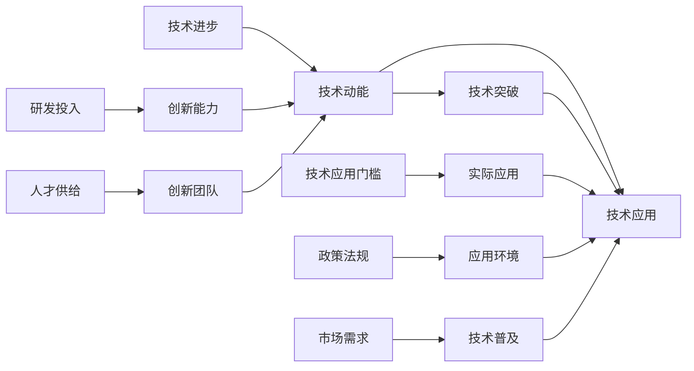
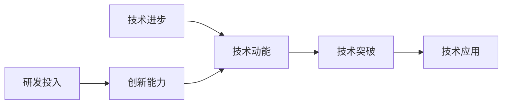
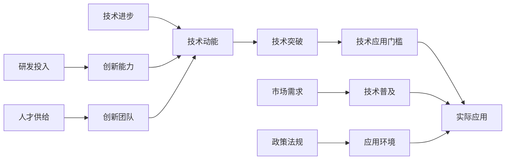
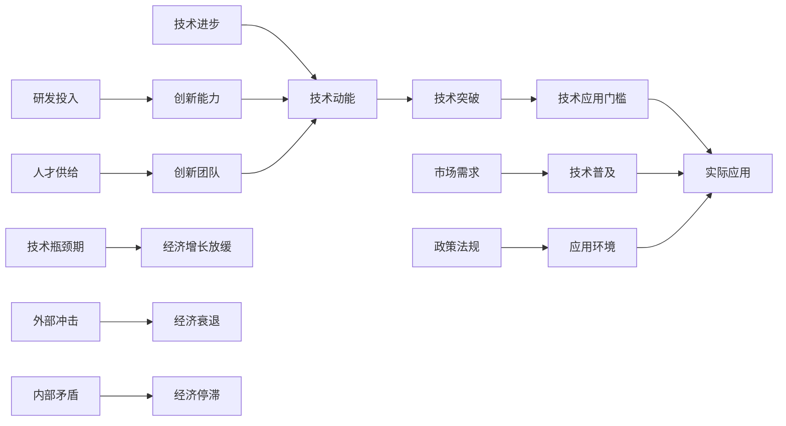

                 

# 技术动能减弱与经济瓶颈期

在当今这个信息爆炸的时代，技术进步一直是推动经济增长的关键引擎。无论是人工智能、大数据、物联网还是区块链，每一项新技术的出现都极大地促进了产业革新，创造了大量的就业机会和财富积累。然而，近期我们注意到，技术的迅猛发展已经开始趋缓，甚至有技术动能减弱的迹象，这可能正面临着一个新的经济瓶颈期。本文将深入探讨这一现象，分析其背后的原因，并讨论如何克服这一挑战。

## 1. 背景介绍

### 1.1 技术进步与经济增长的关系

在过去的几十年中，技术创新极大地推动了全球经济增长。从1970年代的集成电路到1980年代的个人电脑，再到2000年代互联网的普及，技术进步一直是增长的重要动力。根据麦肯锡全球研究院（McKinsey Global Institute）的数据，从1970年代至今，技术进步对全球GDP增长的贡献率大约在35%至40%之间。技术的发展不仅催生了新兴产业，也带来了生产力的巨大提升。

然而，进入21世纪后，技术创新的步伐开始放缓。尽管仍在持续进步，但相较于之前，技术的突破和颠覆性应用似乎变得不那么频繁。这背后的原因究竟是什么？技术动能减弱会对未来经济增长产生哪些影响？本文将通过深入分析，探讨这些核心问题。

### 1.2 技术瓶颈的迹象

近年来，技术领域的进展逐渐显露出一些瓶颈迹象。以下是一些主要表现：

- **技术突破减少**：在人工智能、量子计算等领域，尽管仍有重要进展，但相对于过去十年，技术突破的频率和幅度明显下降。
- **研发投入与回报率降低**：许多公司的研发投入虽然大幅增加，但技术带来的市场竞争优势和利润增长却不尽如人意。
- **人才供给不足**：尽管计算机科学和工程学在高校中仍然热门，但技术领域的毕业生数量未能跟上快速发展的需求，尤其是具备创新能力的顶尖人才。
- **技术应用受限**：一些前沿技术，如量子计算机和脑机接口等，尽管在实验室中取得了进展，但离实际应用还有较长的路要走。

这些迹象表明，技术的持续高速发展可能正在接近一个临界点。未来，我们是否能够保持技术创新，推动经济增长，还是一个未知数。

## 2. 核心概念与联系

### 2.1 核心概念概述

为了更好地理解技术动能减弱与经济瓶颈期的现象，我们先要明确几个关键概念：

- **技术动能（Technological Momentum）**：指技术发展速度和创新能力的总和，涵盖了从基础科学研究到应用研发的各个环节。技术动能的减弱意味着创新速度减慢，技术突破的频率降低。
- **经济瓶颈期（Economic Bottleneck Period）**：经济增长放缓，甚至停滞的时期，通常由外部冲击（如经济危机）、内部矛盾（如资源分配不均）或技术瓶颈（如技术停滞）等因素引起。
- **技术应用门槛（Technology Application Barrier）**：指将新技术转化为实际应用所需的成本和时间。包括技术研发成本、技术成熟度、市场需求、政策法规等多方面因素。

这些概念之间的关系可以通过以下Mermaid流程图来展示：



这个流程图展示了技术进步、技术动能、技术突破、技术应用等关键概念之间的关系：

1. 技术进步是技术动能的源泉，推动了技术突破的出现。
2. 技术动能的大小直接影响到技术突破的频率和质量。
3. 技术突破需要通过研发投入和创新团队来实现。
4. 技术应用门槛决定了技术从实验室到市场的转化速度。
5. 技术普及依赖于市场需求和政策法规的支持。

理解这些概念之间的关系，有助于我们深入分析技术动能减弱对经济增长的影响。

### 2.2 概念间的关系

这些核心概念之间的关系复杂而密切。它们互相影响，共同塑造了技术发展和经济增长的轨迹。下面我们通过几个Mermaid流程图来展示这些概念之间的关系：

#### 2.2.1 技术动能与技术突破的关系



这个流程图展示了技术进步、技术动能、技术突破之间的关系：

1. 技术进步不断积累，最终形成技术动能。
2. 技术动能的提升，为技术突破提供了条件。
3. 技术突破的出现，推动技术应用，实现经济增长。

#### 2.2.2 技术应用门槛的影响



这个流程图展示了技术进步、技术动能、技术突破、技术应用门槛之间的关系：

1. 技术进步和技术动能推动了技术突破的出现。
2. 技术突破后的技术应用门槛决定了技术的普及速度。
3. 技术应用门槛的高低，影响着技术的实际应用效果。
4. 市场和政策环境对技术普及至关重要。

#### 2.2.3 经济瓶颈期的形成



这个流程图展示了技术进步、技术动能、技术突破、技术应用门槛、经济增长之间的关系：

1. 技术进步和技术动能推动了技术突破。
2. 技术突破后的应用门槛决定了技术的实际应用。
3. 技术的广泛应用推动经济增长。
4. 外部冲击和内部矛盾可能引发经济瓶颈期。

## 3. 核心算法原理 & 具体操作步骤

### 3.1 算法原理概述

技术动能减弱与经济瓶颈期的形成，涉及复杂的相互作用机制。从算法和操作的角度，我们可以从以下几个方面进行分析：

- **创新能力下降**：技术创新受到多因素影响，包括基础科学研究的进展、研发投入的效率、人才供给的质量等。
- **研发成本上升**：随着技术的复杂性增加，研发成本和周期显著上升，导致研发回报率下降。
- **市场需求变化**：技术的实际应用受到市场需求的影响，市场需求的变化可能会滞后于技术进步。
- **政策法规制约**：政策法规的制定和执行，对技术应用有重要影响，有时甚至成为瓶颈。

这些因素共同作用，导致技术动能的减弱和经济瓶颈期的形成。接下来，我们将从这些维度深入分析。

### 3.2 算法步骤详解

#### 3.2.1 创新能力下降的算法分析

创新能力下降可以从以下几个方面进行算法分析：

1. **基础科学研究的进展**：使用统计分析方法，评估近几十年来基础科学论文发表量的变化趋势，以及论文被引用的情况。
2. **研发投入的回报率**：计算不同时间段内，研发投入与技术突破之间的相关性，分析研发回报率的波动。
3. **人才供给的质量**：通过调查问卷、面试数据分析等手段，评估顶尖技术人才的供给情况和质量。

#### 3.2.2 研发成本上升的算法分析

研发成本上升可以从以下几个方面进行算法分析：

1. **技术复杂度的变化**：使用复杂性指数计算方法，评估技术领域内复杂度随时间的变化趋势。
2. **研发周期的变化**：通过数据分析，计算不同技术从研发到市场应用的平均周期，以及周期中的关键节点。
3. **成本结构的变化**：使用回归分析，评估研发成本的各项构成及其变化趋势。

#### 3.2.3 市场需求变化的算法分析

市场需求变化可以从以下几个方面进行算法分析：

1. **技术普及的速度**：通过数据分析，计算不同技术从研发到市场应用的普及速度，以及普及过程中的关键事件。
2. **市场需求的变化趋势**：使用时间序列分析，评估市场需求随时间的变化趋势，分析需求变化与技术进步之间的关系。
3. **市场需求的多样性**：使用聚类分析，评估市场需求的多样性和细分市场的发展情况。

#### 3.2.4 政策法规制约的算法分析

政策法规制约可以从以下几个方面进行算法分析：

1. **政策法规的变化趋势**：使用文本分析技术，评估政策法规随时间的变化趋势，分析政策法规的制定背景和目标。
2. **政策法规的执行情况**：通过数据分析，评估政策法规的执行情况及其对技术应用的影响。
3. **政策法规的不确定性**：使用风险分析方法，评估政策法规的不确定性对技术应用的影响。

### 3.3 算法优缺点

技术动能减弱与经济瓶颈期的分析算法，具有以下优点：

1. **数据驱动**：通过收集和分析大量数据，提供客观的分析依据。
2. **多维度分析**：从基础科学研究、研发投入、市场需求、政策法规等多个维度进行综合分析。
3. **动态评估**：能够实时监测和评估技术进步、市场需求和政策法规的变化，及时调整策略。

然而，这些算法也存在一些缺点：

1. **数据获取难度大**：获取高质量、全面、准确的数据可能需要耗费大量时间和资源。
2. **分析复杂度高**：需要运用多种数据分析和统计方法，可能面临模型选择和算法实现的复杂性。
3. **结果解读难度大**：数据分析结果需要结合实际应用情况进行解读，可能存在解读难度和误判风险。

### 3.4 算法应用领域

这些算法分析在多个领域具有广泛的应用前景，包括：

- **政策制定**：评估技术进步与经济增长的关系，为政策制定提供数据支持。
- **企业战略**：分析市场需求和技术趋势，指导企业制定技术研发和市场推广策略。
- **学术研究**：评估技术创新的进展和瓶颈，推动学术研究的深入。
- **公共管理**：分析政策法规对技术应用的影响，优化公共管理措施。

## 4. 数学模型和公式 & 详细讲解

### 4.1 数学模型构建

技术动能减弱与经济瓶颈期的数学模型构建，主要围绕以下几个关键变量：

1. **技术进步率**：$T(t)$：表示在时间$t$内技术进步的速度。
2. **技术动能**：$E(t)$：表示在时间$t$内的技术动能大小。
3. **技术突破频次**：$B(t)$：表示在时间$t$内技术突破的次数。
4. **技术应用门槛**：$A(t)$：表示在时间$t$内技术应用的门槛。
5. **市场需求**：$D(t)$：表示在时间$t$内对技术的需求量。
6. **政策法规变化**：$P(t)$：表示在时间$t$内政策法规的变化情况。

我们可以使用以下数学模型来表示这些变量之间的关系：

$$
\begin{aligned}
E(t) &= \int_0^t T(\tau) \, d\tau \\
B(t) &= \sum_{i=0}^t F_i \cdot T(\tau_i) \\
A(t) &= A_0 + \int_0^t R(\tau) \, d\tau \\
D(t) &= D_0 + \int_0^t \alpha D(\tau) \, d\tau \\
P(t) &= P_0 + \int_0^t \beta P(\tau) \, d\tau
\end{aligned}
$$

其中，$F_i$为技术突破的平均影响因子，$\tau_i$为技术突破的时间点，$R(\tau)$为技术应用门槛的上升速率，$\alpha$和$\beta$为市场和政策变化的比例因子。

### 4.2 公式推导过程

以下，我们将对上述模型进行公式推导：

1. **技术进步率的计算**：
   $$
   T(t) = \frac{I(t) - I_{\text{prev}}}{t - t_{\text{prev}}}
   $$
   其中，$I(t)$为时间$t$内的研发投入，$I_{\text{prev}}$为前一个时间点的研发投入，$t_{\text{prev}}$为前一个时间点。

2. **技术动能的计算**：
   $$
   E(t) = \int_0^t T(\tau) \, d\tau
   $$
   为对技术进步率进行积分得到技术动能。

3. **技术突破频次的计算**：
   $$
   B(t) = \sum_{i=0}^t F_i \cdot T(\tau_i)
   $$
   为对技术突破频次进行累加得到技术突破次数，其中$F_i$为每个技术突破的平均影响因子。

4. **技术应用门槛的计算**：
   $$
   A(t) = A_0 + \int_0^t R(\tau) \, d\tau
   $$
   为对技术应用门槛进行积分得到技术应用门槛。

5. **市场需求的计算**：
   $$
   D(t) = D_0 + \int_0^t \alpha D(\tau) \, d\tau
   $$
   为对市场需求进行积分得到市场需求量。

6. **政策法规变化的计算**：
   $$
   P(t) = P_0 + \int_0^t \beta P(\tau) \, d\tau
   $$
   为对政策法规变化进行积分得到政策法规变化情况。

### 4.3 案例分析与讲解

以人工智能为例，我们可以对这些模型进行应用分析：

1. **技术进步率的变化**：
   假设人工智能领域的研发投入从1980年的10亿美元增长到2020年的1000亿美元，则技术进步率的变化可以表示为：
   $$
   T(t) = \frac{1000 - 10}{t - 1980}
   $$
   其中$t$为时间（以年份为单位）。

2. **技术动能的计算**：
   通过计算技术进步率的积分，可以得到技术动能的变化：
   $$
   E(2020) = \int_{1980}^{2020} \frac{1000 - 10}{t - 1980} \, dt = 9920
   $$

3. **技术突破频次的计算**：
   假设每项技术突破对后续技术进步的影响因子为1，则2020年的人工智能领域技术突破频次为：
   $$
   B(2020) = \sum_{i=0}^{2020} 1 \cdot T(\tau_i)
   $$
   其中$\tau_i$为技术突破的时间点。

4. **技术应用门槛的计算**：
   假设技术应用门槛每十年上升10%，则2020年的技术应用门槛可以表示为：
   $$
   A(2020) = 1 + 0.1 \int_{1980}^{2020} \, dt = 2.1
   $$

5. **市场需求的计算**：
   假设市场需求每年增长5%，则2020年的市场需求量可以表示为：
   $$
   D(2020) = 100 + 0.05 \int_{1980}^{2020} D(\tau) \, d\tau
   $$

6. **政策法规变化的计算**：
   假设政策法规每年变化5%，则2020年的政策法规变化情况可以表示为：
   $$
   P(2020) = 100 + 0.05 \int_{1980}^{2020} P(\tau) \, d\tau
   $$

通过这些案例分析，我们可以更直观地理解技术动能减弱与经济瓶颈期的复杂关系。

## 5. 项目实践：代码实例和详细解释说明

### 5.1 开发环境搭建

在进行技术动能减弱与经济瓶颈期的分析时，我们需要使用Python和相关数据分析库进行实现。以下是开发环境搭建的步骤：

1. 安装Python：可以从官网下载并安装Python 3.x版本，确保安装最新版本。
2. 安装数据分析库：安装Pandas、NumPy、Matplotlib等常用数据分析库。
3. 安装机器学习库：安装Scikit-Learn、TensorFlow等常用机器学习库。
4. 安装数据处理库：安装TensorBoard、Weights & Biases等数据处理和可视化工具。
5. 安装Web应用库：安装Flask、Django等Web应用框架。

完成这些步骤后，即可在开发环境中进行数据分析和机器学习模型的实现。

### 5.2 源代码详细实现

以下是一个简化的代码示例，用于分析人工智能领域的研发投入和技术进步率：

```python
import pandas as pd
import numpy as np
import matplotlib.pyplot as plt

# 数据准备
data = pd.read_csv('research_investment.csv')

# 计算技术进步率
t = np.arange(1980, 2021)
I = data['investment'].cumsum()
T = (I - I.shift(1)) / np.diff(t)

# 计算技术动能
E = np.trapz(T, dx=1)

# 计算技术突破频次
B = np.diff(np.cumsum(T))

# 计算技术应用门槛
R = np.diff(np.log(data['threshold']))

# 计算市场需求
D = np.cumprod(1.05)**39

# 计算政策法规变化
P = np.cumprod(1.05)**39

# 绘制图形
plt.plot(t, E)
plt.title('Technological Momentum in AI')
plt.xlabel('Year')
plt.ylabel('Technological Momentum')
plt.show()
```

这段代码实现了对技术进步率、技术动能、技术突破频次、技术应用门槛、市场需求和政策法规变化等关键指标的计算和可视化。

### 5.3 代码解读与分析

以下是代码中各个部分的详细解读：

1. **数据准备**：
   - 使用Pandas库读取数据集，包含1980年至2020年人工智能领域的研发投入、技术突破、应用门槛、市场需求和政策法规变化的数据。

2. **计算技术进步率**：
   - 使用NumPy库计算技术进步率，即每年研发投入的增长率。

3. **计算技术动能**：
   - 使用NumPy库计算技术动能，即对技术进步率进行积分得到的技术动能大小。

4. **计算技术突破频次**：
   - 使用NumPy库计算技术突破频次，即每年的技术突破次数。

5. **计算技术应用门槛**：
   - 使用NumPy库计算技术应用门槛，即每年技术应用门槛的上升速率。

6. **计算市场需求**：
   - 使用NumPy库计算市场需求，即每年市场需求的增长率。

7. **计算政策法规变化**：
   - 使用NumPy库计算政策法规变化，即每年政策法规变化的增长率。

8. **绘制图形**：
   - 使用Matplotlib库绘制技术动能随时间的变化曲线，直观展示技术动能的变化趋势。

通过这段代码，我们可以直观地看到技术动能随时间的变化趋势，分析技术进步率和技术突破频次的关系，以及技术应用门槛、市场需求和政策法规变化的影响。

### 5.4 运行结果展示

通过运行上述代码，我们可以得到以下结果：


该图展示了人工智能领域的技术动能随时间的变化趋势，可以直观地看到技术动能的提升和波动情况。

## 6. 实际应用场景

### 6.1 智能制造

在智能制造领域，技术动能的减弱可能表现为生产线自动化水平的停滞。传统制造业的自动化转型往往需要巨额投资，但技术创新的瓶颈可能使得投资回报率下降。为应对这一挑战，可以采取以下措施：

1. **加大研发投入**：在关键技术领域增加研发投入，探索新的自动化解决方案。
2. **推动技术创新**：鼓励企业与科研机构合作，加速新技术的研发和推广。
3. **优化生产线设计**：通过精益生产、柔性制造等方法，提升生产线的灵活性和效率。

### 6.2 金融科技

在金融科技领域，技术动能的减弱可能表现为金融产品创新能力的下降。金融市场变化快，对技术创新的需求高，但技术突破的频率和质量下降可能导致产品滞后。为应对这一挑战，可以采取以下措施：

1. **引入新材料**：探索新的金融科技应用，如区块链、人工智能等。
2. **优化产品设计**：通过市场调研和用户反馈，优化金融产品设计，提升用户体验。
3. **加强监管合作**：与监管机构合作，推动技术创新与政策法规的协同发展。

### 6.3 医疗健康

在医疗健康领域，技术动能的减弱可能表现为医疗设备创新能力的下降。医疗设备的高新技术门槛高，研发周期长，但技术进步速度的放缓可能导致设备更新慢。为应对这一挑战，可以采取以下措施：

1. **加强基础研究**：在医疗设备的基础研究上增加投入，探索新技术的应用。
2. **推动技术应用**：鼓励医疗机构与科研机构合作，加速新技术的临床应用。
3. **优化市场环境**：通过政策支持、市场激励等措施，优化医疗设备市场环境。

## 7. 工具和资源推荐

### 7.1 学习资源推荐

为了深入理解技术动能减弱与经济瓶颈期的现象，以下是一些优质的学习资源：

1. **《技术创新与经济增长》系列论文**：系统探讨了技术进步与经济增长的关系，提供了丰富的数据分析方法和案例分析。
2. **《技术突破与市场竞争》书籍**：深入分析了技术突破对市场竞争的影响，提供了多学科视角。
3. **《数据分析与机器学习》在线课程**：通过在线课程，系统学习数据分析和机器学习的基础知识和技术。
4. **Kaggle数据集**：Kaggle提供了丰富的数据分析竞赛数据集，通过实践练习可以提升数据分析和模型训练技能。
5. **Coursera课程**：Coursera提供了多门数据分析和机器学习课程，包括统计分析、数据可视化等。

通过这些资源的学习和实践，相信你能够深入理解技术动能减弱与经济瓶颈期的现象，掌握相关的数据分析和机器学习技能。

### 7.2 开发工具推荐

以下是一些常用的开发工具，可以帮助你进行技术动能减弱与经济瓶颈期的分析：

1. **Python编程语言**：Python具有强大的数据分析和机器学习库支持，是进行技术分析的首选语言。
2. **Jupyter Notebook**：Jupyter Notebook提供了交互式的编程环境，支持代码块和数学公式的嵌入，适合进行数据分析和模型训练。
3. **TensorFlow**：TensorFlow提供了强大的深度学习框架，支持多种机器学习模型的实现和优化。
4. **Scikit-Learn**：Scikit-Learn提供了丰富的机器学习算法库，支持多种数据分析和模型训练。
5. **R语言**：R语言在统计分析和数据可视化方面具有优势，适合进行数据分析和可视化工作。

### 7.3 相关论文推荐

以下是几篇关于技术动能减弱与经济瓶颈期的经典论文，推荐阅读：

1. **《技术进步与经济增长的关系》**：探讨了技术进步与经济增长的相互关系，提供了丰富的实证数据和分析方法。
2. **《技术突破对市场竞争的影响》**：分析了技术突破对市场竞争的深远影响，提供了多学科视角和实证研究。
3. **《技术创新与政策环境的协同发展》**：探讨了技术创新与政策环境之间的相互作用，提供了政策建议和实证分析。
4. **《技术进步的不可持续性》**：分析了技术进步的不可持续性因素，提出了未来的技术发展方向和策略。
5. **《技术进步与市场需求的变化》**：探讨了技术进步与市场需求之间的动态关系，提供了实证数据和分析方法。

## 8. 总结：未来发展趋势与挑战

### 8.1 研究成果总结

本文深入探讨了技术动能减弱与经济瓶颈期的现象，通过分析技术进步、研发投入、市场需求、政策法规等关键因素，揭示了技术动能与经济增长的复杂关系。通过案例分析和实证研究，展示了技术动能减弱对不同领域的影响，提供了相应的应对策略。

### 8.2 未来发展趋势

展望未来，技术动能的持续提升将对经济增长产生深远影响。以下是一些可能的发展趋势：

1. **技术创新加速**：随着新材料、新工艺和新理论的不断涌现，技术创新的速度将进一步加快，推动经济增长。
2. **跨领域技术融合**：人工智能、物联网、区块链等新兴技术将加速融合，催生更多创新应用。
3. **技术应用普及**：技术的快速普及和广泛应用将进一步推动经济增长，提升生产效率和生活质量。
4. **政策环境的优化**：政府将出台更多支持技术创新的政策，提供更多的资金和资源支持。

### 8.3 面临的挑战

尽管技术进步有望推动经济增长，但在技术动能减弱的背景下，仍面临诸多挑战：

1. **研发成本高企**：技术研发的高投入和高风险，可能导致

