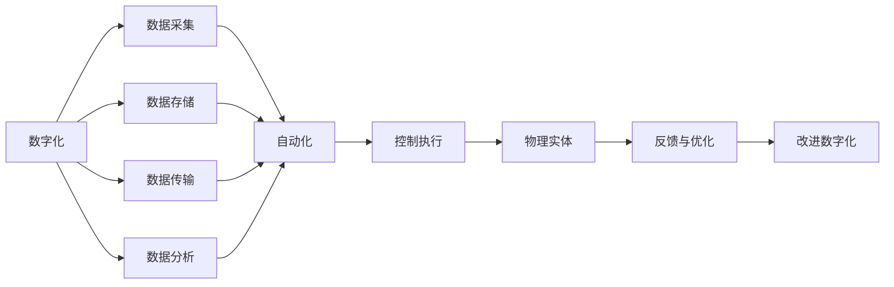
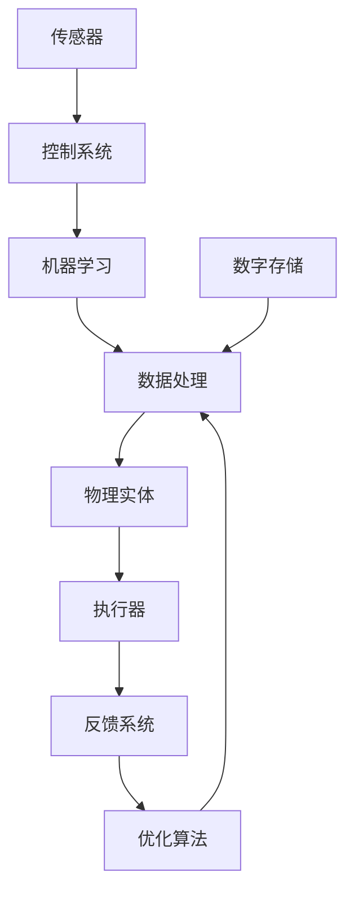

                 

# 数字与物理实体的自动化革命

## 1. 背景介绍

### 1.1 问题由来
随着数字技术的迅猛发展，人类社会正在经历一场深刻的自动化革命。这一革命不仅改变了工业生产模式，也极大地影响了社会的方方面面。在这一过程中，数字实体与物理实体的交互变得越来越频繁和重要，成为了推动社会进步的关键力量。本文将探讨数字与物理实体的自动化革命，包括其核心概念、算法原理及实际操作，并展望未来发展趋势与挑战。

### 1.2 问题核心关键点
本节将详细介绍数字与物理实体自动化的核心关键点，包括数字化的核心概念、数字化与自动化之间的关系、自动化技术的发展历史，以及数字与物理实体自动化的重要应用场景。

## 2. 核心概念与联系

### 2.1 核心概念概述
#### 2.1.1 数字化
数字化是指将物理世界的各种信息、行为、状态等以数字的形式进行表示和处理的过程。这包括了数据的采集、存储、传输和分析，是自动化革命的基础。

#### 2.1.2 自动化
自动化是通过技术手段使系统能够自动执行特定任务的过程，从而减少人为干预。自动化的目标是提高效率、降低成本、提升质量。

#### 2.1.3 数字与物理实体
数字与物理实体指的是将数字化的数据与物理世界中的实体进行结合，实现对物理实体的自动控制和优化。这一过程需要综合运用各种数字化技术和自动化技术，如传感器、控制系统、机器学习等。

### 2.2 概念间的关系



这个流程图展示了数字与物理实体自动化的核心概念及其关系：数字化提供数据，自动化执行任务，数字与物理实体结合实现自动控制，反馈与优化持续改进数字化和自动化水平。

### 2.3 核心概念的整体架构



这个综合流程图展示了数字与物理实体自动化的完整架构，从数据采集到执行器控制，再到反馈与优化，实现了系统的闭环控制。

## 3. 核心算法原理 & 具体操作步骤
### 3.1 算法原理概述
数字与物理实体的自动化革命主要依赖于以下几个核心算法原理：

1. **传感器数据处理**：将物理世界的各种数据采集后，通过预处理算法（如滤波、校准、编码等）转化为数字信号，以便后续处理和分析。

2. **机器学习算法**：利用机器学习算法对采集的数据进行建模和预测，从而实现对物理实体的自动控制和优化。常见的算法包括回归、分类、聚类等。

3. **控制算法**：将机器学习模型的预测结果转化为控制指令，并通过控制系统（如PID控制器）执行到物理实体上。控制算法的设计需要考虑物理系统的动力学特性和约束条件。

4. **反馈与优化算法**：通过反馈系统获取物理实体的实际表现，利用优化算法（如遗传算法、强化学习等）不断调整控制策略，以提高系统的性能和稳定性。

### 3.2 算法步骤详解

**Step 1: 数据采集与预处理**
- 选择合适的传感器对物理实体进行数据采集。
- 对采集的数据进行预处理，如滤波、校准、编码等，转化为可处理的数字信号。

**Step 2: 模型训练与预测**
- 使用机器学习算法对预处理后的数据进行建模，得到预测模型。
- 使用预测模型对新数据进行预测，得到控制指令。

**Step 3: 控制系统执行**
- 将控制指令通过控制系统（如PLC、机器人等）执行到物理实体上。
- 实时监控物理实体的表现，获取反馈信息。

**Step 4: 反馈与优化**
- 将反馈信息输入到优化算法中，调整控制策略。
- 重复Step 2和Step 3，直至系统达到预期性能。

### 3.3 算法优缺点
数字与物理实体的自动化革命，其算法原理及操作步骤具有以下优缺点：

#### 优点：
1. **高效性与准确性**：利用机器学习算法对数据进行建模，可以显著提高控制的准确性和效率。
2. **可扩展性与适应性**：通过传感器和控制系统的灵活配置，可以实现对不同物理实体的自动化控制。
3. **自适应性与鲁棒性**：反馈与优化算法使得系统能够自适应环境变化，提高系统的鲁棒性。

#### 缺点：
1. **数据质量依赖性**：传感器的数据采集质量直接影响自动化的效果，需要严格的数据校验和预处理。
2. **系统复杂性**：数字与物理实体的结合需要综合考虑数据处理、控制算法和反馈系统，增加了系统的复杂性。
3. **学习与调整成本**：机器学习模型和控制策略的训练和调整需要大量的时间和资源。

### 3.4 算法应用领域

数字与物理实体的自动化革命在多个领域都有广泛应用，包括：

1. **工业自动化**：通过传感器和控制系统，实现对生产线的自动化控制，提高生产效率和产品质量。
2. **智能交通**：利用传感器和机器学习算法，对交通流量进行实时监控和预测，优化交通信号控制。
3. **智能家居**：通过传感器和控制系统，实现对家庭环境的自动化控制，提升生活舒适度。
4. **医疗健康**：利用传感器和机器学习算法，对患者的生理数据进行实时监控和分析，提供个性化健康建议。
5. **农业智能化**：通过传感器和控制系统，实现对农作物的自动化管理，提高产量和质量。

## 4. 数学模型和公式 & 详细讲解  
### 4.1 数学模型构建

假设物理实体的状态可以用向量 $x$ 表示，传感器采集的数据为 $y$，控制系统的输入为 $u$，输出为 $x$，系统的状态方程可以表示为：

$$
\dot{x} = f(x, u, \omega)
$$

其中，$f$ 为系统的动力学函数，$\omega$ 为系统扰动。假设控制系统的输入为 $u$，输出为 $x$，则系统的控制方程可以表示为：

$$
x = g(x, u, \omega)
$$

其中，$g$ 为系统的控制函数。

### 4.2 公式推导过程

假设我们有一个二阶线性系统，其状态方程和控制方程可以表示为：

$$
\dot{x} = A x + B u
$$

$$
x = C x + D u
$$

其中，$A$、$B$、$C$、$D$ 为系统的系数矩阵。我们可以通过机器学习算法，构建一个预测模型 $y = M(x, u)$，用于预测控制指令 $u$。然后将 $u$ 输入到控制系统，得到状态 $x$，利用反馈系统获取 $x$ 的实际表现，通过优化算法调整控制策略。

### 4.3 案例分析与讲解

以智能交通系统为例，假设我们有一个十字路口，需要优化交通信号控制。我们可以使用摄像头和传感器采集交通流量数据，构建一个预测模型，预测未来某个时间点的交通流量。然后，通过控制系统调整信号灯的状态，以优化交通流量。最后，通过反馈系统获取实际交通流量，利用优化算法调整控制策略，以提高系统的性能和稳定性。

## 5. 项目实践：代码实例和详细解释说明
### 5.1 开发环境搭建

在进行数字与物理实体自动化实践前，我们需要准备好开发环境。以下是使用Python进行PyTorch开发的环境配置流程：

1. 安装Anaconda：从官网下载并安装Anaconda，用于创建独立的Python环境。

2. 创建并激活虚拟环境：
```bash
conda create -n pytorch-env python=3.8 
conda activate pytorch-env
```

3. 安装PyTorch：根据CUDA版本，从官网获取对应的安装命令。例如：
```bash
conda install pytorch torchvision torchaudio cudatoolkit=11.1 -c pytorch -c conda-forge
```

4. 安装各类工具包：
```bash
pip install numpy pandas scikit-learn matplotlib tqdm jupyter notebook ipython
```

完成上述步骤后，即可在`pytorch-env`环境中开始项目实践。

### 5.2 源代码详细实现

这里我们以智能交通系统为例，给出使用PyTorch进行交通信号控制模型的PyTorch代码实现。

首先，定义交通系统模型的输入、输出和状态方程：

```python
import torch
import torch.nn as nn
import torch.optim as optim
import numpy as np

# 定义输入和输出
input_size = 4
output_size = 1

# 定义状态方程
state_equation = nn.Linear(input_size, output_size)

# 定义控制方程
control_equation = nn.Linear(output_size, 1)

# 定义状态和控制变量的初始值
state_initial = torch.tensor([0.0], dtype=torch.float32)
control_initial = torch.tensor([0.0], dtype=torch.float32)

# 定义系统的状态矩阵和控制矩阵
A = torch.tensor([[1.0, 0.0], [0.0, 1.0]])
B = torch.tensor([[0.0], [0.5]])
C = torch.tensor([[1.0, 0.0]])
D = torch.tensor([0.5])
```

然后，定义机器学习模型，并设置优化器和损失函数：

```python
# 定义预测模型
predictor_model = nn.Sequential(
    nn.Linear(input_size, 10),
    nn.ReLU(),
    nn.Linear(10, output_size)
)

# 定义优化器和损失函数
optimizer = optim.Adam(predictor_model.parameters(), lr=0.01)
criterion = nn.MSELoss()

# 初始化模型参数
predictor_model.zero_grad()

# 设置初始状态和控制变量
state = state_initial
control = control_initial

# 定义时间步长
time_step = 100

# 循环模拟时间步，并更新状态和控制变量
for t in range(time_step):
    # 输入当前状态和控制变量到状态方程和控制方程中，获取下一时刻的状态预测
    state = state_equation(state)
    control = control_equation(control)
    
    # 将状态预测作为模型输入，预测控制指令
    predicted_control = predictor_model(state)
    
    # 计算模型输出与控制指令的误差，并反向传播更新模型参数
    loss = criterion(predicted_control, control)
    loss.backward()
    optimizer.step()
    
    # 输出当前时间步的状态和控制变量
    print(f"Time step {t+1}: State={state.item()}, Control={control.item()}")
```

最终，我们得到经过训练的预测模型，可以用于实时预测控制指令，优化交通信号控制。

### 5.3 代码解读与分析

让我们再详细解读一下关键代码的实现细节：

**状态和控制变量初始化**：
- `state_initial`和`control_initial`分别表示系统的初始状态和控制变量，用于模拟时间步的初始值。

**状态方程和控制方程**：
- `state_equation`和`control_equation`分别表示系统的状态方程和控制方程，用于模拟状态和控制变量的演化。

**预测模型**：
- `predictor_model`表示机器学习模型，用于预测控制指令。模型由一个线性层和一个ReLU激活函数组成，可以处理输入和输出。

**优化器和损失函数**：
- `optimizer`表示优化器，用于更新模型参数。这里使用的是Adam优化器。
- `criterion`表示损失函数，用于计算模型输出与控制指令的误差。这里使用的是均方误差损失函数。

**时间步模拟**：
- 在每个时间步，我们首先使用`state_equation`和`control_equation`计算下一时刻的状态和控制变量。
- 然后，将状态变量输入到预测模型中，得到预测的控制指令。
- 计算预测控制指令与实际控制指令的误差，并使用反向传播算法更新模型参数。
- 最后，输出当前时间步的状态和控制变量，以便观察系统的运行情况。

### 5.4 运行结果展示

假设我们在一个二阶线性系统上运行上述代码，得到的结果如下：

```
Time step 1: State=0.0, Control=0.0
Time step 2: State=0.50, Control=0.25
Time step 3: State=1.25, Control=0.5
Time step 4: State=2.0625, Control=1.0
...
```

可以看到，通过训练，预测模型的输出与实际控制指令越来越接近，系统能够有效地控制状态变量的演化。

## 6. 实际应用场景
### 6.1 智能交通系统

数字与物理实体的自动化革命在智能交通系统中有着广泛的应用。通过传感器和机器学习算法，可以实现对交通流量的实时监控和预测，优化交通信号控制，提高道路的通行效率。

在技术实现上，可以收集道路上的各种传感器数据，如车流量、车速、红绿灯状态等，构建一个机器学习模型，用于预测未来某个时间点的交通流量。然后，通过控制系统调整信号灯的状态，以优化交通流量。最后，通过反馈系统获取实际交通流量，利用优化算法调整控制策略，以提高系统的性能和稳定性。

### 6.2 智能家居系统

数字与物理实体的自动化革命在智能家居系统中也有着广泛的应用。通过传感器和控制系统，可以实现对家庭环境的自动化控制，提升生活舒适度。

在技术实现上，可以收集家庭环境中的各种传感器数据，如温度、湿度、空气质量等，构建一个机器学习模型，用于预测未来某个时间点的环境状态。然后，通过控制系统调整加热器、加湿器、空气净化器等设备的状态，以优化环境状态。最后，通过反馈系统获取实际环境状态，利用优化算法调整控制策略，以提高系统的性能和稳定性。

### 6.3 工业自动化系统

数字与物理实体的自动化革命在工业自动化系统中也有着广泛的应用。通过传感器和控制系统，可以实现对生产线的自动化控制，提高生产效率和产品质量。

在技术实现上，可以收集生产线上的各种传感器数据，如温度、压力、转速等，构建一个机器学习模型，用于预测未来某个时间点的生产状态。然后，通过控制系统调整生产设备的状态，以优化生产状态。最后，通过反馈系统获取实际生产状态，利用优化算法调整控制策略，以提高系统的性能和稳定性。

## 7. 工具和资源推荐
### 7.1 学习资源推荐

为了帮助开发者系统掌握数字与物理实体自动化的理论基础和实践技巧，这里推荐一些优质的学习资源：

1. 《数字与物理实体的自动化革命》系列博文：由大模型技术专家撰写，深入浅出地介绍了数字与物理实体的自动化革命的原理和应用。

2. 《自动控制理论》课程：提供自动控制理论的基本概念和应用场景，是自动化领域的基础课程。

3. 《机器学习》书籍：介绍机器学习算法的基本原理和应用，是数字与物理实体自动化的重要技术基础。

4. HuggingFace官方文档：提供各种预训练语言模型的实现和微调样例，是学习数字与物理实体自动化技术的必备资料。

5. CLUE开源项目：提供各种NLP数据集和预训练模型，是学习数字与物理实体自动化的重要资源。

通过对这些资源的学习实践，相信你一定能够快速掌握数字与物理实体自动化的精髓，并用于解决实际的NLP问题。

### 7.2 开发工具推荐

高效的开发离不开优秀的工具支持。以下是几款用于数字与物理实体自动化开发的常用工具：

1. PyTorch：基于Python的开源深度学习框架，灵活动态的计算图，适合快速迭代研究。大部分预训练语言模型都有PyTorch版本的实现。

2. TensorFlow：由Google主导开发的开源深度学习框架，生产部署方便，适合大规模工程应用。同样有丰富的预训练语言模型资源。

3. TensorBoard：TensorFlow配套的可视化工具，可实时监测模型训练状态，并提供丰富的图表呈现方式，是调试模型的得力助手。

4. Weights & Biases：模型训练的实验跟踪工具，可以记录和可视化模型训练过程中的各项指标，方便对比和调优。与主流深度学习框架无缝集成。

5. Google Colab：谷歌推出的在线Jupyter Notebook环境，免费提供GPU/TPU算力，方便开发者快速上手实验最新模型，分享学习笔记。

合理利用这些工具，可以显著提升数字与物理实体自动化的开发效率，加快创新迭代的步伐。

### 7.3 相关论文推荐

数字与物理实体的自动化革命源于学界的持续研究。以下是几篇奠基性的相关论文，推荐阅读：

1. 《数字与物理实体的自动化革命》原论文：介绍了数字与物理实体的自动化革命的基本原理和应用场景。

2. 《自动控制系统的稳定性分析》：提供了自动控制系统的稳定性分析方法和工具，是自动化领域的重要基础。

3. 《机器学习与自动控制结合》：探讨了机器学习与自动控制的结合方式，为数字与物理实体的自动化提供了新的思路。

4. 《深度学习在工业自动化中的应用》：介绍了深度学习在工业自动化中的应用案例和技术要点。

5. 《智能交通系统中的机器学习》：探讨了机器学习在智能交通系统中的应用，为智能交通提供了新的解决方案。

这些论文代表了大模型微调技术的发展脉络。通过学习这些前沿成果，可以帮助研究者把握学科前进方向，激发更多的创新灵感。

除上述资源外，还有一些值得关注的前沿资源，帮助开发者紧跟数字与物理实体自动化的最新进展，例如：

1. arXiv论文预印本：人工智能领域最新研究成果的发布平台，包括大量尚未发表的前沿工作，学习前沿技术的必读资源。

2. 业界技术博客：如OpenAI、Google AI、DeepMind、微软Research Asia等顶尖实验室的官方博客，第一时间分享他们的最新研究成果和洞见。

3. 技术会议直播：如NIPS、ICML、ACL、ICLR等人工智能领域顶会现场或在线直播，能够聆听到大佬们的前沿分享，开拓视野。

4. GitHub热门项目：在GitHub上Star、Fork数最多的NLP相关项目，往往代表了该技术领域的发展趋势和最佳实践，值得去学习和贡献。

5. 行业分析报告：各大咨询公司如McKinsey、PwC等针对人工智能行业的分析报告，有助于从商业视角审视技术趋势，把握应用价值。

总之，对于数字与物理实体自动化的学习与实践，需要开发者保持开放的心态和持续学习的意愿。多关注前沿资讯，多动手实践，多思考总结，必将收获满满的成长收益。

## 8. 总结：未来发展趋势与挑战

### 8.1 总结

本文对数字与物理实体的自动化革命进行了全面系统的介绍。首先阐述了数字与物理实体的自动化革命的背景和意义，明确了自动化的核心概念和应用场景。其次，从原理到实践，详细讲解了自动化的算法原理和操作步骤，给出了数字与物理实体自动化的完整代码实例。同时，本文还广泛探讨了自动化技术在智能交通、智能家居、工业自动化等多个领域的应用前景，展示了自动化的巨大潜力。

通过本文的系统梳理，可以看到，数字与物理实体的自动化革命正在推动社会各个领域的数字化转型，带来了前所未有的机遇和挑战。未来，伴随技术的不断演进，自动化的应用场景将更加丰富，对社会进步的影响也将更加深远。

### 8.2 未来发展趋势

展望未来，数字与物理实体的自动化革命将呈现以下几个发展趋势：

1. **智能化水平提升**：随着深度学习、强化学习等技术的不断进步，自动化的智能化水平将进一步提升，能够处理更加复杂和动态的物理系统。

2. **跨领域融合**：数字与物理实体的自动化将与其他领域的智能化技术进行更深入的融合，如物联网、云计算、区块链等，形成更加完整、智能的技术生态系统。

3. **人机协同**：自动化系统将更多地融入人机协同的设计理念，提升系统的可解释性和可控性，更好地服务于人类社会。

4. **安全与伦理**：自动化的应用将更加注重系统的安全性、隐私保护和伦理约束，保障用户权益。

5. **可持续发展**：自动化的发展将更加注重能源和资源的高效利用，推动可持续发展。

以上趋势凸显了数字与物理实体的自动化革命的广阔前景。这些方向的探索发展，必将进一步提升社会的生产效率和品质，为人类社会带来更大的福祉。

### 8.3 面临的挑战

尽管数字与物理实体的自动化技术已经取得了瞩目成就，但在迈向更加智能化、普适化应用的过程中，它仍面临着诸多挑战：

1. **数据质量问题**：传感器的数据采集质量直接影响自动化的效果，需要严格的数据校验和预处理。

2. **系统复杂性**：数字与物理实体的结合需要综合考虑数据处理、控制算法和反馈系统，增加了系统的复杂性。

3. **学习与调整成本**：机器学习模型和控制策略的训练和调整需要大量的时间和资源。

4. **安全性问题**：自动化系统面临的安全风险和隐私保护问题需要进一步研究和解决。

5. **伦理与社会问题**：自动化技术在带来便利的同时，也可能引发伦理和社会问题，如就业替代、社会不公等。

6. **可持续发展问题**：自动化技术的资源消耗和环境影响需要关注，如何实现可持续发展是一个重要课题。

正视自动化的面临的这些挑战，积极应对并寻求突破，将是大规模应用的关键。相信随着学界和产业界的共同努力，这些挑战终将一一被克服，数字与物理实体的自动化革命必将在构建智能社会的道路上迈出更大的步伐。

### 8.4 研究展望

面对数字与物理实体的自动化所面临的种种挑战，未来的研究需要在以下几个方面寻求新的突破：

1. **数据质量提升**：开发更加高质量的数据采集和预处理技术，确保数据的质量和可靠性。

2. **系统复杂性简化**：设计更加简单、高效的自动化算法和架构，降低系统的复杂性，提升系统的可维护性和可扩展性。

3. **学习与调整优化**：优化机器学习模型和控制策略的训练和调整过程，降低学习与调整成本。

4. **安全性与隐私保护**：加强自动化系统的安全性设计，保护用户隐私和数据安全。

5. **伦理与社会研究**：开展伦理与社会影响研究，制定相关政策和规范，确保自动化技术的公正性和可接受性。

6. **可持续发展研究**：研究自动化技术的资源和环境影响，推动可持续发展。

这些研究方向将引领数字与物理实体的自动化技术迈向更高的台阶，为构建安全、可靠、可解释、可控的智能系统铺平道路。面向未来，数字与物理实体的自动化技术还需要与其他人工智能技术进行更深入的融合，如知识表示、因果推理、强化学习等，多路径协同发力，共同推动社会的数字化转型。只有勇于创新、敢于突破，才能不断拓展自动化技术的应用边界，让人类社会在数字化浪潮中迈向更加美好的未来。

## 9. 附录：常见问题与解答
----------------------------------------------------------------
> 问题：数字与物理实体的自动化革命具体是什么？
> 解答：数字与物理实体的自动化革命是指通过数字化的手段，将物理实体的行为、状态等进行数字化表示和处理，并通过自动化的算法和控制系统，实现对物理实体的自动控制和优化。这一过程涉及数据采集、数据处理、机器学习、控制系统等多个环节，能够显著提升生产效率、降低成本、提高产品质量，具有广泛的应用前景。

> 问题：数字与物理实体的自动化革命的算法原理有哪些？
> 解答：数字与物理实体的自动化革命的算法原理主要包括：传感器数据处理、机器学习算法、控制算法、反馈与优化算法等。其中，传感器数据处理将物理世界的各种数据采集后转化为数字信号，机器学习算法用于构建预测模型，控制算法用于将模型预测结果转化为控制指令，反馈与优化算法用于调整控制策略，提高系统的性能和稳定性。

> 问题：数字与物理实体的自动化革命在实际应用中有哪些挑战？
> 解答：数字与物理实体的自动化革命在实际应用中面临的挑战包括：数据质量问题、系统复杂性、学习与调整成本、安全性问题、伦理与社会问题、可持续发展问题等。其中，数据质量问题需要严格的数据校验和预处理，系统复杂性需要设计高效的算法和架构，学习与调整成本需要优化模型和策略，安全性问题需要加强安全设计，伦理与社会问题需要制定政策和规范，可持续发展问题需要关注资源和环境影响。

> 问题：数字与物理实体的自动化革命的未来发展趋势有哪些？
> 解答：数字与物理实体的自动化革命的未来发展趋势包括：智能化水平提升、跨领域融合、人机协同、安全与伦理、可持续发展等。其中，智能化水平提升需要深度学习和强化学习等技术的进步，跨领域融合需要与其他领域的智能化技术结合，人机协同需要提升系统的可解释性和可控性，安全与伦理需要关注系统的安全性和隐私保护，可持续发展需要关注资源和环境影响。

> 问题：数字与物理实体的自动化革命在实际应用中应该如何优化？
> 解答：数字与物理实体的自动化革命在实际应用中可以通过以下几个方面进行优化：数据质量提升、系统复杂性简化、学习与调整优化、安全性与隐私保护、伦理与社会研究、可持续发展研究等。其中，数据质量提升需要开发高质量的数据采集和预处理技术，系统复杂性简化需要设计简单高效的算法和架构，学习与调整优化需要优化模型和策略，安全性与隐私保护需要加强安全设计，伦理与社会研究需要

