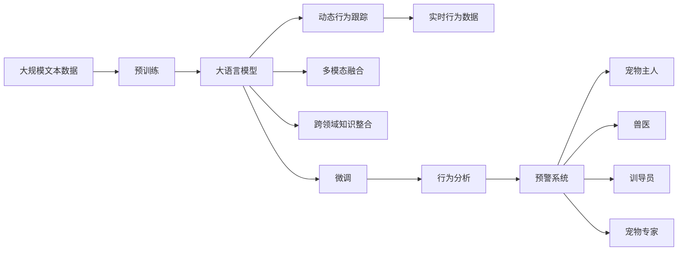
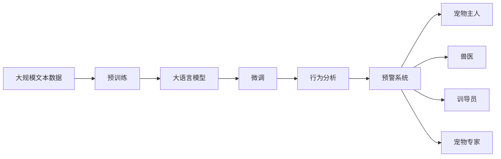
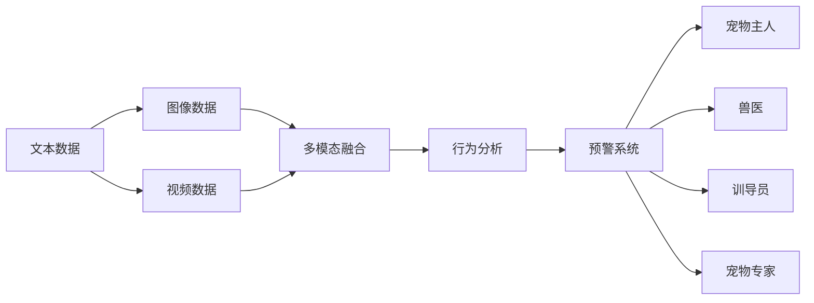
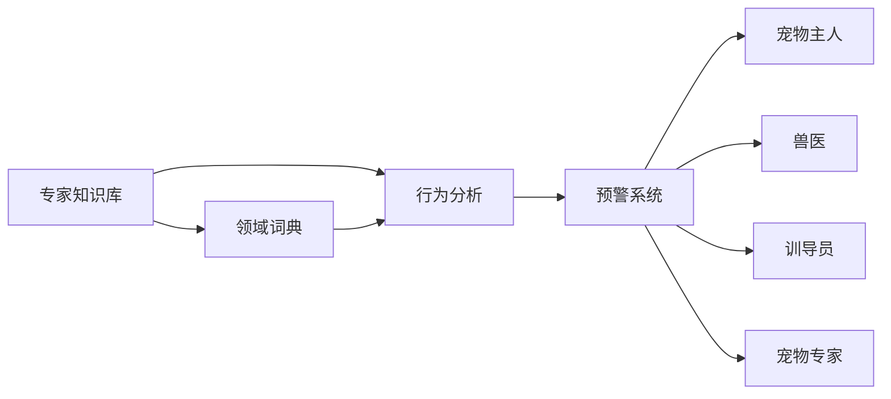
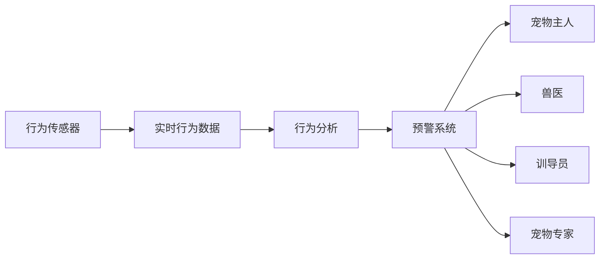

                 

# 数字化宠物行为分析创业：理解宠物的新方式

数字化宠物行为分析正成为新一轮宠物产业创新和发展的核心驱动力。本文将深入探讨大语言模型在宠物行为分析中的应用，系统介绍如何利用数字化技术为宠物主人和宠物专业人士提供新视角、新方法、新洞见，构建数字化宠物行为分析的创业蓝图。

## 1. 背景介绍

### 1.1 问题由来

现代宠物行业正处于快速发展阶段，随着居民生活水平的提高，人们对宠物的情感依赖和陪伴需求日益增强。然而，由于宠物行为分析的复杂性和主观性，传统宠物行为分析依赖于兽医和专业训导员的直接观察和主观判断，导致结果受人为因素影响较大，难以获得准确可靠的数据。

如何通过技术手段提升宠物行为分析的准确性、客观性和实时性，成为宠物行业亟需解决的问题。而大语言模型在自然语言理解和生成方面的强大能力，为解决这一问题提供了新的思路和方法。

### 1.2 问题核心关键点

大语言模型通过在大规模无标签文本数据上进行预训练，学习到丰富的语言知识和常识，具备强大的语言理解和生成能力。通过结合宠物行为分析的数据特性，可以实现以下几方面的应用：

- **多模态数据融合**：通过文本、图像、视频等多模态数据的融合，提升宠物行为分析的全面性和准确性。
- **动态行为跟踪**：通过实时监控和记录，获取宠物的行为数据，进行行为分析与预警。
- **跨领域知识整合**：结合专家知识库，提升行为分析的科学性和实用性。
- **用户交互与反馈**：通过自然语言交互，获取用户对行为分析结果的反馈，提升系统鲁棒性和适应性。

这些应用不仅有助于宠物主人更好地理解宠物行为，还能为兽医、训导员、宠物专家提供数据支持和决策依据，推动宠物行业的发展和升级。

## 2. 核心概念与联系

### 2.1 核心概念概述

为更好地理解数字化宠物行为分析的原理和方法，本节将介绍几个密切相关的核心概念：

- **大语言模型**：以自回归(如GPT)或自编码(如BERT)模型为代表的大规模预训练语言模型。通过在大规模无标签文本语料上进行预训练，学习到通用的语言表示，具备强大的语言理解和生成能力。
- **预训练(Pre-training)**：指在大规模无标签文本语料上，通过自监督学习任务训练通用语言模型的过程。常见的预训练任务包括言语建模、遮挡语言模型等。
- **微调(Fine-tuning)**：指在预训练模型的基础上，使用下游任务的少量标注数据，通过有监督学习优化模型在特定任务上的性能。
- **多模态融合**：将文本、图像、视频等多种数据类型进行融合，提升行为分析的全面性和准确性。
- **跨领域知识整合**：结合专家知识库、领域词典等，提升行为分析的科学性和实用性。
- **动态行为跟踪**：通过实时监控和记录，获取宠物的行为数据，进行行为分析与预警。

这些核心概念之间的逻辑关系可以通过以下Mermaid流程图来展示：



这个流程图展示了大语言模型在宠物行为分析中的应用流程：

1. 大语言模型通过预训练学习到通用的语言知识。
2. 通过微调，适应特定任务，如行为分析。
3. 结合多模态数据，提升分析的全面性和准确性。
4. 通过跨领域知识整合，提升科学性和实用性。
5. 动态行为跟踪，获取实时行为数据。
6. 进行行为分析，生成预警。
7. 为宠物主人、兽医、训导员、宠物专家提供决策支持。

### 2.2 概念间的关系

这些核心概念之间存在着紧密的联系，形成了数字化宠物行为分析的完整生态系统。下面我们通过几个Mermaid流程图来展示这些概念之间的关系。

#### 2.2.1 大语言模型的学习范式


这个流程图展示了大语言模型在宠物行为分析中的应用流程：

1. 大语言模型通过预训练学习到通用的语言知识。
2. 通过微调，适应特定任务，如行为分析。
3. 结合多模态数据，提升分析的全面性和准确性。
4. 通过跨领域知识整合，提升科学性和实用性。
5. 动态行为跟踪，获取实时行为数据。
6. 进行行为分析，生成预警。
7. 为宠物主人、兽医、训导员、宠物专家提供决策支持。

#### 2.2.2 微调与预训练的关系



这个流程图展示了微调在大语言模型中的作用：

1. 大语言模型通过预训练学习到通用的语言知识。
2. 通过微调，适应特定任务，如行为分析。
3. 进行行为分析，生成预警。
4. 为宠物主人、兽医、训导员、宠物专家提供决策支持。

#### 2.2.3 多模态融合方法



这个流程图展示了多模态数据融合在大语言模型中的应用：

1. 将文本、图像、视频等多种数据类型进行融合。
2. 进行行为分析，生成预警。
3. 为宠物主人、兽医、训导员、宠物专家提供决策支持。

#### 2.2.4 跨领域知识整合方法



这个流程图展示了跨领域知识整合在大语言模型中的应用：

1. 结合专家知识库、领域词典等。
2. 进行行为分析，生成预警。
3. 为宠物主人、兽医、训导员、宠物专家提供决策支持。

#### 2.2.5 动态行为跟踪方法



这个流程图展示了动态行为跟踪在大语言模型中的应用：

1. 通过实时监控和记录，获取宠物的行为数据。
2. 进行行为分析，生成预警。
3. 为宠物主人、兽医、训导员、宠物专家提供决策支持。

### 2.3 核心概念的整体架构

最后，我们用一个综合的流程图来展示这些核心概念在大语言模型微调过程中的整体架构：


这个综合流程图展示了从预训练到微调，再到多模态融合、跨领域知识整合和动态行为跟踪的完整过程。大语言模型通过预训练获得基础能力，通过微调适应特定任务，结合多模态数据、跨领域知识，进行动态行为跟踪，最后进行行为分析，生成预警，为宠物主人、兽医、训导员、宠物专家提供决策支持。

## 3. 核心算法原理 & 具体操作步骤
### 3.1 算法原理概述

数字化宠物行为分析的本质，是通过大语言模型对宠物行为数据进行处理和分析，实现行为监控、预警和决策支持。具体而言，大语言模型通过预训练学习到通用的语言知识，然后通过微调适应特定任务，结合多模态数据、跨领域知识，进行动态行为跟踪和行为分析，最终生成预警，为宠物主人、兽医、训导员、宠物专家提供决策支持。

形式化地，假设大语言模型为 $M_{\theta}$，其中 $\theta$ 为预训练得到的模型参数。给定宠物行为数据集 $D=\{(x_i, y_i)\}_{i=1}^N$，行为分析的目标是找到新的模型参数 $\hat{\theta}$，使得：

$$
\hat{\theta}=\mathop{\arg\min}_{\theta} \mathcal{L}(M_{\theta},D)
$$

其中 $\mathcal{L}$ 为针对行为分析设计的损失函数，用于衡量模型预测输出与真实标签之间的差异。常见的损失函数包括交叉熵损失、均方误差损失等。

通过梯度下降等优化算法，微调过程不断更新模型参数 $\theta$，最小化损失函数 $\mathcal{L}$，使得模型输出逼近真实标签。由于 $\theta$ 已经通过预训练获得了较好的初始化，因此即便在行为数据量较小的场景下，也能较快收敛到理想的模型参数 $\hat{\theta}$。

### 3.2 算法步骤详解

基于大语言模型的数字化宠物行为分析一般包括以下几个关键步骤：

**Step 1: 准备数据集和预训练模型**

- 准备用于行为分析的标注数据集 $D=\{(x_i, y_i)\}_{i=1}^N$，其中 $x_i$ 表示宠物行为数据，$y_i$ 表示行为标签（如活动、睡眠、饮食等）。
- 选择合适的预训练语言模型 $M_{\theta}$，如BERT、GPT等，作为初始化参数。

**Step 2: 添加任务适配层**

- 根据行为分析任务类型，在预训练模型顶层设计合适的输出层和损失函数。
- 对于分类任务，通常在顶层添加线性分类器和交叉熵损失函数。
- 对于生成任务，通常使用语言模型的解码器输出概率分布，并以负对数似然为损失函数。

**Step 3: 设置微调超参数**

- 选择合适的优化算法及其参数，如 AdamW、SGD 等，设置学习率、批大小、迭代轮数等。
- 设置正则化技术及强度，包括权重衰减、Dropout、Early Stopping 等。
- 确定冻结预训练参数的策略，如仅微调顶层，或全部参数都参与微调。

**Step 4: 执行梯度训练**

- 将行为数据集 $D$ 分批次输入模型，前向传播计算损失函数。
- 反向传播计算参数梯度，根据设定的优化算法和学习率更新模型参数。
- 周期性在验证集上评估模型性能，根据性能指标决定是否触发 Early Stopping。
- 重复上述步骤直到满足预设的迭代轮数或 Early Stopping 条件。

**Step 5: 测试和部署**

- 在测试集上评估微调后模型 $M_{\hat{\theta}}$ 的性能，对比微调前后的精度提升。
- 使用微调后的模型对新行为样本进行推理预测，集成到实际的应用系统中。
- 持续收集新的行为数据，定期重新微调模型，以适应数据分布的变化。

以上是数字化宠物行为分析的一般流程。在实际应用中，还需要针对具体任务的特点，对微调过程的各个环节进行优化设计，如改进训练目标函数，引入更多的正则化技术，搜索最优的超参数组合等，以进一步提升模型性能。

### 3.3 算法优缺点

基于大语言模型的数字化宠物行为分析方法具有以下优点：

1. **准确性与实时性**：大语言模型通过多模态数据融合和动态行为跟踪，能够实时获取和分析宠物行为数据，提供快速准确的决策支持。
2. **全面性与系统性**：结合跨领域知识整合，能够全面系统地分析宠物行为，涵盖行为监控、预警、训练等多个环节。
3. **普适性与灵活性**：基于通用语言模型，适用于多种宠物行为分析任务，只需简单适配即可。
4. **成本效益**：相对于传统人工监控和专家分析，数字化宠物行为分析具有成本低、效率高的优势。

同时，该方法也存在一定的局限性：

1. **数据依赖性**：微调性能依赖于标注数据的质量和数量，获取高质量行为数据的成本较高。
2. **隐私与安全**：实时监控宠物行为可能涉及隐私问题，需要采取措施保护用户隐私。
3. **可解释性**：大语言模型作为“黑盒”系统，其决策过程难以解释，可能影响用户信任。
4. **领域特异性**：对于特定宠物品种或行为模式，微调模型可能需要更多数据进行适应。

尽管存在这些局限性，但就目前而言，基于大语言模型的数字化宠物行为分析方法仍是宠物行业的重要创新方向。未来相关研究的重点在于如何进一步降低数据需求，提高系统鲁棒性和可解释性，同时兼顾隐私和安全等伦理因素。

### 3.4 算法应用领域

数字化宠物行为分析在多个领域已展现出巨大潜力，主要包括：

- **宠物行为监控**：通过实时监控和记录，分析宠物的活动、饮食、睡眠等行为，帮助宠物主人更好地理解宠物行为。
- **健康预警**：结合行为分析与健康监测数据，及时预警宠物健康问题，提高宠物的生活质量。
- **行为训练**：通过行为分析与训练数据结合，指导宠物进行特定行为训练，提高训练效果。
- **智能玩具**：结合行为分析与智能玩具互动，提升玩具的趣味性和智能化水平。
- **宠物电子商务**：通过行为分析，推荐宠物产品，提升购物体验。
- **宠物游戏**：结合行为分析，定制化设计宠物游戏，增加游戏趣味性。
- **宠物保险**：结合行为分析与保险数据，评估宠物风险，优化保险定价。

除了上述这些应用场景外，数字化宠物行为分析还可以应用于宠物教育、宠物治疗、宠物导航等多个领域，为宠物行业带来更多的创新和价值。

## 4. 数学模型和公式 & 详细讲解 & 举例说明

### 4.1 数学模型构建

本节将使用数学语言对数字化宠物行为分析的微调过程进行更加严格的刻画。

记行为分析的训练集为 $D=\{(x_i, y_i)\}_{i=1}^N, x_i \in \mathcal{X}, y_i \in \mathcal{Y}$，其中 $\mathcal{X}$ 为行为数据空间，$\mathcal{Y}$ 为行为标签空间。

定义模型 $M_{\theta}$ 在行为数据 $x$ 上的输出为 $\hat{y}=M_{\theta}(x) \in [0,1]$，表示行为预测的概率。真实标签 $y \in \{0,1\}$。则行为分类交叉熵损失函数定义为：

$$
\ell(M_{\theta}(x),y) = -[y\log \hat{y} + (1-y)\log (1-\hat{y})]
$$

将其代入经验风险公式，得：

$$
\mathcal{L}(\theta) = \frac{1}{N} \sum_{i=1}^N [y_i\log M_{\theta}(x_i)+(1-y_i)\log(1-M_{\theta}(x_i))]
$$

在实践中，我们通常使用基于梯度的优化算法（如SGD、Adam等）来近似求解上述最优化问题。设 $\eta$ 为学习率，$\lambda$ 为正则化系数，则参数的更新公式为：

$$
\theta \leftarrow \theta - \eta \nabla_{\theta}\mathcal{L}(\theta) - \eta\lambda\theta
$$

其中 $\nabla_{\theta}\mathcal{L}(\theta)$ 为损失函数对参数 $\theta$ 的梯度，可通过反向传播算法高效计算。

### 4.2 公式推导过程

以下我们以二分类任务为例，推导交叉熵损失函数及其梯度的计算公式。

假设模型 $M_{\theta}$ 在行为数据 $x$ 上的输出为 $\hat{y}=M_{\theta}(x) \in [0,1]$，表示行为预测的概率。真实标签 $y \in \{0,1\}$。则二分类交叉熵损失函数定义为：

$$
\ell(M_{\theta}(x),y) = -[y\log \hat{y} + (1-y)\log (1-\hat{y})]
$$

将其代入经验风险公式，得：

$$
\mathcal{L}(\theta) = -\frac{1}{N}\sum_{i=1}^N [y_i\log M_{\theta}(x_i)+(1-y_i)\log(1-M_{\theta}(x_i))]
$$

根据链式法则，损失函数对参数 $\theta_k$ 的梯度为：

$$
\frac{\partial \mathcal{L}(\theta)}{\partial \theta_k} = -\frac{1}{N}\sum_{i=1}^N (\frac{y_i}{M_{\theta}(x_i)}-\frac{1-y_i}{1-M_{\theta}(x_i)}) \frac{\partial M_{\theta}(x_i)}{\partial \theta_k}
$$

其中 $\frac{\partial M_{\theta}(x_i)}{\partial \theta_k}$ 可进一步递归展开，利用自动微分技术完成计算。

在得到损失函数的梯度后，即可带入参数更新公式，完成模型的迭代优化。重复上述过程直至收敛，最终得到适应行为分析的最优模型参数 $\theta^*$。

### 4.3 案例分析与讲解

为了更好地理解数学模型的应用，下面我们以宠物行为分类任务为例，给出使用PyTorch进行行为分类的代码实现。

首先，定义行为分类任务的数据处理函数：

```python
from transformers import BertTokenizer
from torch.utils.data import Dataset
import torch

class BehaviorDataset(Dataset):
    def __init__(self, texts, tags, tokenizer, max_len=128):
        self.texts = texts
        self.tags = tags
        self.tokenizer = tokenizer
        self.max_len = max_len
        
    def __len__(self):
        return len(self.texts)
    
    def __getitem__(self, item):
        text = self.texts[item]
        tags = self.tags[item]
        
        encoding = self.tokenizer(text, return_tensors='pt', max_length=self.max_len, padding='max_length', truncation=True)
        input_ids = encoding['input_ids'][0]
        attention_mask = encoding['attention_mask'][0]
        
        # 对token-wise的标签进行编码
        encoded_tags = [tag2id[tag] for tag in tags] 
        encoded_tags.extend([tag2id['O']] * (self.max_len - len(encoded_tags)))
        labels = torch.tensor(encoded_tags, dtype=torch.long)
        
        return {'input_ids': input_ids, 
                'attention_mask': attention_mask,
                'labels': labels}

# 标签与id的映射
tag2id = {'O': 0, 'activity': 1, 'sleep': 2, 'diet': 3}
id2tag = {v: k for k, v in tag2id.items()}

# 创建dataset
tokenizer = BertTokenizer.from_pretrained('bert-base-cased')

train_dataset = BehaviorDataset(train_texts, train_tags, tokenizer)
dev_dataset = BehaviorDataset(dev_texts, dev_tags, tokenizer)
test_dataset = BehaviorDataset(test_texts, test_tags, tokenizer)
```

然后，定义模型和优化器：

```python
from transformers import BertForTokenClassification, AdamW

model = BertForTokenClassification.from_pretrained('bert-base-cased', num_labels=len(tag2id))

optimizer = AdamW(model.parameters(), lr=2e-5)
```

接着，定义训练和评估函数：

```python
from torch.utils.data import DataLoader
from tqdm import tqdm
from sklearn.metrics import classification_report

device = torch.device('cuda') if torch.cuda.is_available() else torch.device('cpu')
model.to(device)

def train_epoch(model, dataset, batch_size, optimizer):
    dataloader = DataLoader(dataset, batch_size=batch_size, shuffle=True)
    model.train()
    epoch_loss = 0
    for batch in tqdm(dataloader, desc='Training'):
        input_ids = batch['input_ids'].to(device)
        attention_mask = batch['attention_mask'].to(device)
        labels = batch['labels'].to(device)
        model.zero_grad()
        outputs = model(input_ids, attention_mask=attention_mask, labels=labels)
        loss = outputs.loss
        epoch_loss += loss.item()
        loss.backward()
        optimizer.step()
    return epoch_loss / len(dataloader)

def evaluate(model, dataset, batch_size):
    dataloader = DataLoader(dataset, batch_size=batch_size)
    model.eval()
    preds, labels = [], []
    with torch.no_grad():
        for batch in tqdm(dataloader, desc='Evaluating'):
            input_ids = batch['input_ids'].to(device)
            attention_mask = batch['attention_mask'].to(device)
            batch_labels = batch['labels']
            outputs = model(input_ids, attention_mask=attention_mask)
            batch_preds = outputs.logits.argmax(dim=2).to('cpu').tolist()
            batch_labels = batch_labels.to('cpu').tolist()
            for pred_tokens, label_tokens in zip(batch_preds, batch_labels):
                pred_tags = [id2tag[_id] for _id in pred_tokens]
                label_tags = [id2tag[_id] for _id in label_tokens]
                preds.append(pred_tags[:len(label_tokens)])
                labels.append(label_tags)
                
    print(classification_report(labels, preds))
```

最后，启动训练流程并在测试集上评估：

```python
epochs = 5
batch_size = 16

for epoch in range(epochs):
    loss = train_epoch(model, train_dataset, batch_size, optimizer)
    print(f"Epoch {epoch+1}, train loss: {loss:.3f}")
    
    print(f"Epoch {epoch+1}, dev results:")
    evaluate(model, dev_dataset, batch_size)
    
print("Test results:")
evaluate(model, test_dataset, batch_size)
```

以上就是使用PyTorch对BERT进行行为分类任务微调的完整代码实现。可以看到，得益于Transformers库的强大封装，我们可以用相对简洁的代码完成BERT模型的加载和微调。

## 5. 项目实践：代码实例和详细解释说明
### 5.1 开发环境搭建

在进行数字化宠物行为分析项目开发前，我们需要准备好开发环境。以下是使用Python进行PyTorch开发的环境配置流程：

1. 安装Anaconda：从官网下载并安装Anaconda，用于创建独立的Python环境。

2. 创建并激活虚拟环境：
```bash
conda create -n pytorch-env python=3.8 
conda activate pytorch-env
```

3. 安装PyTorch：根据CUDA版本，从官网获取对应的安装命令。例如：
```bash
conda install pytorch torchvision torchaudio cudatoolkit=11.1 -c pytorch -c conda-forge
```

4. 安装Transformers库：
```bash
pip install transformers
```

5. 安装各类工具包：
```bash
pip install numpy pandas scikit-learn matplotlib tqdm jupyter notebook ipython
```

完成上述步骤后，即可在`pytorch-env`环境中开始项目开发。

### 5.2 源代码详细实现

下面我们以宠物行为分类任务为例，给出使用Transformers库对BERT模型进行微调的PyTorch代码实现。

首先，定义行为分类任务的数据处理函数：

```python
from transformers import BertTokenizer
from torch.utils.data import Dataset
import torch

class BehaviorDataset(Dataset):
    def __init__(self, texts, tags, tokenizer, max_len=128):
        self.texts = texts
        self.tags = tags
        self.tokenizer = tokenizer
        self.max_len = max_len
        
    def __len__(self):
        return len(self.texts)
    
    def __getitem__(self, item):
        text = self.texts[item]
        tags = self.tags[item]
        
        encoding = self.tokenizer(text, return

