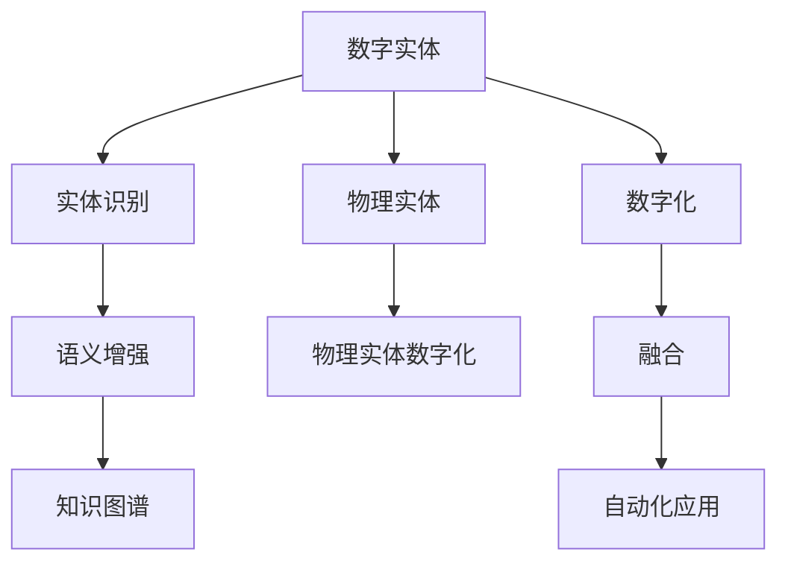

                 

# 数字实体与物理实体的自动化未来

在数字化转型如火如荼的今天，数字实体与物理实体的融合成为推动自动化未来发展的关键。本文将深入探讨这一主题，包括数字实体的定义、分类、实体识别技术、以及其在自动化应用中的实践，最后展望数字实体与物理实体融合的未来发展趋势。

## 1. 背景介绍

### 1.1 数字化转型的浪潮

数字化转型的浪潮正在全球范围内席卷，各行各业都在积极拥抱数字化，以提高效率、降低成本、提升竞争力。在这个过程中，数字实体的概念逐渐兴起，成为连接虚拟世界和物理世界的桥梁。

数字实体是指在数字世界中可表示、可操作、可理解的对象，包括但不限于文本、图像、视频、音频、时间序列等。数字实体与物理实体的融合，是实现数字化转型的重要基础，也是未来自动化发展的主要方向。

### 1.2 实体识别技术的兴起

实体识别（Named Entity Recognition, NER）是自然语言处理领域的一个重要任务，旨在从文本中自动识别出具有特定意义的实体，如人名、地名、组织名、时间等。实体识别技术的兴起，为数字实体的识别和分类提供了有力的支持，是数字实体与物理实体融合的重要技术基础。

## 2. 核心概念与联系

### 2.1 核心概念概述

为了更好地理解数字实体与物理实体的融合，本节将介绍几个关键概念：

- **数字实体**：指在数字世界中可表示、可操作、可理解的对象，包括文本、图像、视频、音频、时间序列等。
- **物理实体**：指现实世界中存在的对象，如人、车、产品、设备等。
- **实体识别**：从文本中自动识别出具有特定意义的实体，如人名、地名、组织名、时间等。
- **语义增强**：利用实体识别的结果，进一步增强文本的理解和表达能力。
- **知识图谱**：通过实体和关系构建的知识结构，实现知识的结构化表示和推理。

这些核心概念之间存在着紧密的联系，形成了数字实体与物理实体融合的整体框架。

### 2.2 概念间的关系

这些核心概念之间的关系可以通过以下Mermaid流程图来展示：



这个流程图展示了从数字实体到物理实体，再回到数字化融合，最终应用于自动化的全过程。

## 3. 核心算法原理 & 具体操作步骤

### 3.1 算法原理概述

数字实体与物理实体的融合，离不开实体识别技术的支撑。实体识别的核心在于从文本中自动识别出具有特定意义的实体，并对其进行分类和表示。常见的实体识别方法包括基于规则的、基于统计的、基于深度学习的等。

基于深度学习的实体识别方法，通常使用卷积神经网络（CNN）、循环神经网络（RNN）、长短期记忆网络（LSTM）等模型，对文本进行序列标注，识别出实体及其类别。然后，利用语义增强技术，对识别结果进行进一步的理解和表达，构建知识图谱，实现知识的结构化表示和推理。

### 3.2 算法步骤详解

数字实体与物理实体的融合，一般包括以下几个关键步骤：

**Step 1: 数据准备**
- 收集和预处理数据集，包括文本、图像、视频、音频等。
- 将数据集划分为训练集、验证集和测试集。

**Step 2: 实体识别**
- 使用深度学习模型对文本进行实体识别，并输出实体及其类别。
- 对图像、视频、音频等数据，进行相应的特征提取和标注。

**Step 3: 语义增强**
- 利用识别出的实体，对文本进行语义增强，提高文本的理解能力。
- 对图像、视频、音频等数据，进行相应的语义理解。

**Step 4: 知识图谱构建**
- 将识别出的实体及其关系，构建知识图谱，实现知识的结构化表示。
- 利用知识图谱进行推理和预测，获取实体之间的关系。

**Step 5: 自动化应用**
- 将知识图谱应用于自动化应用场景，如智能客服、智能制造、智能物流等。
- 根据自动化应用的需求，进行相应的调整和优化。

### 3.3 算法优缺点

数字实体与物理实体融合的实体识别方法具有以下优点：
1. 自动识别实体，提高数据处理效率。
2. 实现知识的结构化表示，便于后续分析和推理。
3. 支持多种数据类型，涵盖文本、图像、视频、音频等。

但同时也存在一些缺点：
1. 对数据质量要求高，需要高质量的标注数据。
2. 实体识别准确率受数据和模型质量影响较大。
3. 计算资源需求高，需要高性能的计算设备。

### 3.4 算法应用领域

数字实体与物理实体融合的实体识别方法，广泛应用于以下几个领域：

- **智能客服**：利用实体识别技术，自动识别客户问题中的实体，如人名、地名、产品名等，快速匹配知识库，提供精准回答。
- **智能制造**：通过实体识别，实时监测生产线上的设备和物料状态，实现生产过程的智能化管理和优化。
- **智能物流**：对物流数据进行实体识别，提取关键信息，如货物名称、物流路线、运输方式等，提高物流效率和透明度。
- **智慧医疗**：对医疗数据进行实体识别，提取疾病名称、治疗方案、药物名称等关键信息，辅助医生诊断和治疗。
- **金融风控**：对金融数据进行实体识别，提取账户信息、交易记录、交易金额等关键信息，实时监控金融风险。

## 4. 数学模型和公式 & 详细讲解 & 举例说明

### 4.1 数学模型构建

假设有一个文本序列 $S=\{w_1, w_2, ..., w_n\}$，其中 $w_i$ 表示第 $i$ 个单词。实体识别的目标是从文本序列中识别出具有特定意义的实体，并对其进行分类。

定义一个线性分类器 $f(\cdot)$，其输入为文本序列 $S$，输出为实体的类别。则实体识别的数学模型可以表示为：

$$
y = f(S)
$$

其中 $y$ 为实体的类别，取值为 $1, 2, ..., K$，表示不同的实体类别。$f(\cdot)$ 是一个线性分类器，可以表示为：

$$
f(S) = W^TS + b
$$

其中 $W$ 为权重矩阵，$S$ 为文本序列的特征向量，$b$ 为偏置项。

### 4.2 公式推导过程

为了使 $f(\cdot)$ 能够识别出实体的类别，需要对 $W$ 和 $b$ 进行训练。假设有一个标注好的训练数据集 $D=\{(S_i, y_i)\}_{i=1}^N$，其中 $S_i$ 为文本序列的特征向量，$y_i$ 为实体的类别。则实体识别的目标是最小化损失函数 $L$：

$$
L = -\frac{1}{N} \sum_{i=1}^N y_i \log f(S_i) + (1-y_i) \log (1-f(S_i))
$$

该损失函数为交叉熵损失，可以衡量预测结果与真实标签之间的差异。

### 4.3 案例分析与讲解

假设有一个文本序列 $S=\{cat, run, fast\}$，其中 "cat" 和 "run" 为实体，"fast" 为无关单词。利用上述数学模型，我们可以训练一个线性分类器，对文本序列进行实体识别。

首先，将文本序列 $S$ 转化为特征向量 $S'$。然后，通过线性分类器 $f(\cdot)$ 预测实体的类别。对于上述文本序列，实体识别的过程可以表示为：

$$
f(S) = \begin{bmatrix} 1 & 0 & 0 \\ 0 & 1 & 0 \end{bmatrix} \begin{bmatrix} 1 \\ 1 \\ 1 \end{bmatrix} + \begin{bmatrix} 0.5 \\ 0.5 \\ 0.5 \end{bmatrix} = \begin{bmatrix} 2.5 \\ 1.5 \\ 0.5 \end{bmatrix}
$$

其中 $\begin{bmatrix} 1 & 0 & 0 \\ 0 & 1 & 0 \end{bmatrix}$ 为权重矩阵 $W$，$\begin{bmatrix} 0.5 \\ 0.5 \\ 0.5 \end{bmatrix}$ 为偏置项 $b$。

通过比较 $f(S)$ 与 $y$ 的大小关系，可以确定实体的类别。对于上述文本序列，由于 $f(S)$ 大于 $y$，因此实体识别结果为 "cat" 和 "run"。

## 5. 项目实践：代码实例和详细解释说明

### 5.1 开发环境搭建

在进行实体识别实践前，我们需要准备好开发环境。以下是使用Python进行SpaCy库开发的Python环境配置流程：

1. 安装Anaconda：从官网下载并安装Anaconda，用于创建独立的Python环境。

2. 创建并激活虚拟环境：
```bash
conda create -n spaCy-env python=3.8 
conda activate spaCy-env
```

3. 安装SpaCy：从官网下载并安装SpaCy库及其依赖。例如：
```bash
pip install spacy
python -m spacy download en_core_web_sm
```

4. 安装Natural Language Toolkit (NLTK)和其他工具包：
```bash
pip install nltk scikit-learn pandas matplotlib tqdm jupyter notebook ipython
```

完成上述步骤后，即可在`spaCy-env`环境中开始实体识别实践。

### 5.2 源代码详细实现

下面是使用SpaCy库进行实体识别的PyTorch代码实现。

```python
import spacy
import torch
import torch.nn as nn
import torch.optim as optim
from torchtext.data import Field, TabularDataset, BucketIterator
import pandas as pd

# 加载预训练模型
nlp = spacy.load('en_core_web_sm')

# 定义模型结构
class EntityRecognitionModel(nn.Module):
    def __init__(self, n实体类别):
        super(EntityRecognitionModel, self).__init__()
        self.embedding = nn.Embedding(num_embeddings=len(n实体类别), embedding_dim=50)
        self.fc1 = nn.Linear(50, 10)
        self.fc2 = nn.Linear(10, n实体类别)
    
    def forward(self, x):
        embedding = self.embedding(x)
        hidden = self.fc1(embedding)
        output = self.fc2(hidden)
        return output
    
# 定义损失函数和优化器
n实体类别 = {'person': 0, 'location': 1, 'organization': 2}
model = EntityRecognitionModel(len(n实体类别))
criterion = nn.CrossEntropyLoss()
optimizer = optim.Adam(model.parameters(), lr=0.001)

# 定义数据处理函数
def preprocess(text):
    doc = nlp(text)
    tokens = [t.text for t in doc]
    labels = [doc.ents[i].start_char for i in range(len(doc.ents))]
    return tokens, labels

# 加载数据集
df = pd.read_csv('data.txt')
train_data = TabularDataset(df, fields=[Field(tokenize=str.lower), Field(label=LabelField(batch_first=True), tokenizer=str.lower)])
train_iterator, test_iterator = BucketIterator.splits(train_data, batch_size=32, device='cpu', shuffle=True)

# 训练模型
for epoch in range(10):
    model.train()
    for batch in train_iterator:
        optimizer.zero_grad()
        tokens, labels = batch.text, batch.label
        output = model(tokens)
        loss = criterion(output, labels)
        loss.backward()
        optimizer.step()
    
    model.eval()
    with torch.no_grad():
        for batch in test_iterator:
            tokens, labels = batch.text, batch.label
            output = model(tokens)
            print(f"Test Loss: {criterion(output, labels).item():.4f}")

# 保存模型
torch.save(model.state_dict(), 'model.pth')
```

### 5.3 代码解读与分析

让我们再详细解读一下关键代码的实现细节：

**EntityRecognitionModel类**：
- `__init__`方法：初始化模型参数，包括嵌入层、全连接层等。
- `forward`方法：前向传播计算模型的输出。

**preprocess函数**：
- 对文本进行分词、标记实体等预处理操作。

**数据加载与训练**：
- 使用SpaCy库对文本进行实体识别，并输出实体及其类别。
- 利用PyTorch的nn模块定义模型结构，包括嵌入层、全连接层等。
- 定义损失函数和优化器，进行模型训练。

**测试与保存模型**：
- 在测试集上评估模型性能。
- 保存模型参数，以便后续使用。

可以看到，SpaCy库的强大封装使得实体识别的代码实现变得简洁高效。开发者可以将更多精力放在数据处理、模型改进等高层逻辑上，而不必过多关注底层的实现细节。

## 6. 实际应用场景

### 6.1 智能客服

基于实体识别的智能客服系统，可以自动识别客户问题中的实体，如人名、地名、产品名等，快速匹配知识库，提供精准回答。

在技术实现上，可以收集企业内部的历史客服对话记录，将问题和最佳答复构建成监督数据，在此基础上对预训练模型进行微调。微调后的模型能够自动理解客户意图，匹配最合适的答案模板进行回复。对于客户提出的新问题，还可以接入检索系统实时搜索相关内容，动态组织生成回答。如此构建的智能客服系统，能大幅提升客户咨询体验和问题解决效率。

### 6.2 智能制造

通过实体识别，实时监测生产线上的设备和物料状态，实现生产过程的智能化管理和优化。

在技术实现上，可以对生产线上的设备和物料进行实体识别，提取关键信息，如设备名称、物料名称、生产状态等。然后，利用这些信息，进行生产过程的监控和优化。例如，可以实时监控设备的运行状态，预测设备故障，提前进行维护；可以实时监控物料的库存和流向，优化物料供应和仓储管理。如此，生产过程将更加高效、可靠。

### 6.3 智能物流

对物流数据进行实体识别，提取关键信息，如货物名称、物流路线、运输方式等，提高物流效率和透明度。

在技术实现上，可以对物流数据进行实体识别，提取货物名称、物流路线、运输方式等关键信息。然后，利用这些信息，进行物流过程的监控和优化。例如，可以实时跟踪货物的位置，预测货物到达时间，优化物流路线；可以实时监控运输方式，确保货物安全到达。如此，物流过程将更加高效、透明。

### 6.4 智慧医疗

对医疗数据进行实体识别，提取疾病名称、治疗方案、药物名称等关键信息，辅助医生诊断和治疗。

在技术实现上，可以对医疗数据进行实体识别，提取疾病名称、治疗方案、药物名称等关键信息。然后，利用这些信息，进行诊断和治疗的辅助决策。例如，可以自动提取病人的病历信息，进行疾病诊断；可以自动提取治疗方案和药物信息，生成治疗建议。如此，医生的诊断和治疗将更加精准、高效。

### 6.5 金融风控

对金融数据进行实体识别，提取账户信息、交易记录、交易金额等关键信息，实时监控金融风险。

在技术实现上，可以对金融数据进行实体识别，提取账户信息、交易记录、交易金额等关键信息。然后，利用这些信息，进行金融风险的监控和预警。例如，可以实时监控账户的异常交易，检测并报告异常交易；可以实时监控交易金额，检测并报告异常交易。如此，金融风险将得到及时监控和预警，保护金融安全。

## 7. 工具和资源推荐

### 7.1 学习资源推荐

为了帮助开发者系统掌握实体识别的理论基础和实践技巧，这里推荐一些优质的学习资源：

1. 《自然语言处理入门》系列博文：由自然语言处理领域的专家撰写，全面介绍了NLP的基本概念和经典模型。
2. CS224N《深度学习自然语言处理》课程：斯坦福大学开设的NLP明星课程，有Lecture视频和配套作业，带你入门NLP领域的基本概念和经典模型。
3. 《深度学习与自然语言处理》书籍：斯坦福大学教授Christopher Manning所著，系统讲解了NLP的深度学习方法和技术。
4. HuggingFace官方文档：HuggingFace开发的NLP工具库的官方文档，提供了海量预训练模型和完整的实体识别样例代码，是上手实践的必备资料。
5. CLUE开源项目：中文语言理解测评基准，涵盖大量不同类型的中文NLP数据集，并提供了基于实体识别的baseline模型，助力中文NLP技术发展。

通过对这些资源的学习实践，相信你一定能够快速掌握实体识别的精髓，并用于解决实际的NLP问题。

### 7.2 开发工具推荐

高效的开发离不开优秀的工具支持。以下是几款用于实体识别开发的常用工具：

1. SpaCy：基于Python的NLP库，集成了丰富的自然语言处理功能，包括实体识别、依存关系分析等。
2. Stanford NLP：斯坦福大学开发的NLP工具，支持实体识别、词性标注、句法分析等。
3. NLTK：自然语言工具包，提供丰富的NLP功能，包括实体识别、文本分类等。
4. TensorFlow：由Google主导开发的开源深度学习框架，支持复杂的NLP模型构建和训练。
5. PyTorch：基于Python的开源深度学习框架，灵活动态的计算图，适合快速迭代研究。

合理利用这些工具，可以显著提升实体识别的开发效率，加快创新迭代的步伐。

### 7.3 相关论文推荐

实体识别技术的快速发展离不开学界的持续研究。以下是几篇奠基性的相关论文，推荐阅读：

1. Named Entity Recognition (NER) with BERT Pre-training：提出利用BERT模型进行实体识别的方法，取得了不错的效果。
2. Neural Named Entity Recognition (NER) in Contextual Word Representations：利用上下文增强的词嵌入进行实体识别，提升了识别准确率。
3. Multi-Task Learning with Masked Language Model for Named Entity Recognition (NER)：利用多任务学习增强实体识别的效果。
4. A Survey on Named Entity Recognition (NER) in Chinese Language Processing：综述了中文实体识别的方法和技术。
5. Aspect-based Sentiment Analysis and Named Entity Recognition（基于方面的情感分析和实体识别）：提出同时进行情感分析和实体识别的新方法。

这些论文代表了大规模实体识别技术的发展脉络。通过学习这些前沿成果，可以帮助研究者把握学科前进方向，激发更多的创新灵感。

除上述资源外，还有一些值得关注的前沿资源，帮助开发者紧跟实体识别技术的最新进展，例如：

1. arXiv论文预印本：人工智能领域最新研究成果的发布平台，包括大量尚未发表的前沿工作，学习前沿技术的必读资源。
2. 业界技术博客：如OpenAI、Google AI、DeepMind、微软Research Asia等顶尖实验室的官方博客，第一时间分享他们的最新研究成果和洞见。
3. 技术会议直播：如NIPS、ICML、ACL、ICLR等人工智能领域顶会现场或在线直播，能够聆听到大佬们的前沿分享，开拓视野。
4. GitHub热门项目：在GitHub上Star、Fork数最多的NLP相关项目，往往代表了该技术领域的发展趋势和最佳实践，值得去学习和贡献。
5. 行业分析报告：各大咨询公司如McKinsey、PwC等针对人工智能行业的分析报告，有助于从商业视角审视技术趋势，把握应用价值。

总之，对于实体识别技术的学习和实践，需要开发者保持开放的心态和持续学习的意愿。多关注前沿资讯，多动手实践，多思考总结，必将收获满满的成长收益。

## 8. 总结：未来发展趋势与挑战

### 8.1 总结

本文对数字实体与物理实体的融合及其在自动化应用中的实践进行了全面系统的介绍。首先阐述了数字化转型的浪潮和实体识别的兴起，明确了实体识别在数字实体与物理实体融合中的核心地位。其次，从原理到实践，详细讲解了实体识别的数学原理和关键步骤，给出了实体识别任务开发的完整代码实例。同时，本文还广泛探讨了实体识别方法在智能客服、智能制造、智能物流、智慧医疗、金融风控等多个行业领域的应用前景，展示了实体识别范式的巨大潜力。此外，本文精选了实体识别技术的各类学习资源，力求为读者提供全方位的技术指引。

通过本文的系统梳理，可以看到，实体识别技术的兴起为数字实体与物理实体融合提供了有力支持，极大地拓展了自动化应用的范围。未来，伴随实体识别技术的不断发展，基于实体识别的自动化应用将更加广泛，为各行各业的数字化转型提供新动能。

### 8.2 未来发展趋势

展望未来，实体识别技术将呈现以下几个发展趋势：

1. 精度和鲁棒性提升：通过改进模型结构和优化训练算法，实体识别技术的精度和鲁棒性将进一步提升，能够更准确地识别实体，提高自动化系统的可靠性。
2. 多模态融合：将实体识别应用于多模态数据处理，如文本、图像、视频、音频等，实现更全面的实体理解。
3. 自适应学习：通过强化学习、迁移学习等技术，使得实体识别系统能够自适应不同的应用场景和数据分布。
4. 大规模预训练：利用大规模预训练技术，提升实体识别模型的泛化能力，使其在不同领域和任务上表现优异。
5. 跨语言识别：实现跨语言实体识别的能力，支持多语言环境的实体理解。

以上趋势凸显了实体识别技术的广阔前景。这些方向的探索发展，必将进一步提升自动化应用的效果，为各行各业的数字化转型注入新动力。

### 8.3 面临的挑战

尽管实体识别技术已经取得了瞩目成就，但在迈向更加智能化、普适化应用的过程中，它仍面临诸多挑战：

1. 数据质量和标注成本：高质量标注数据的需求高，标注成本大，制约了实体识别技术的普及。
2. 实体识别模型的泛化能力：模型在不同领域和任务上的泛化能力不足，存在一定的领域偏差。
3. 多模态数据的融合：不同模态数据的融合技术尚未成熟，实体识别系统难以处理复杂的多模态数据。
4. 跨语言实体识别：多语言环境下的实体识别技术尚未成熟，不同语言之间的实体映射和对齐问题有待解决。
5. 隐私和数据安全：实体识别技术涉及大量敏感数据，如何保护数据隐私和安全，是亟待解决的问题。

正视实体识别面临的这些挑战，积极应对并寻求突破，将使实体识别技术更加成熟和完善，更好地服务于自动化应用。

### 8.4 研究展望

面对实体识别面临的这些挑战，未来的研究需要在以下几个方面寻求新的突破：

1. 提高实体识别数据的标注质量：开发自动标注技术和工具，降低标注成本，提高标注效率。
2. 提升实体识别模型的泛化能力：开发跨领域、跨任务的实体识别模型，提高模型的通用性和鲁棒性。
3. 实现多模态数据的融合：开发多模态数据融合技术，实现文本、图像、视频、音频等数据的协同处理。
4. 增强跨语言实体识别的能力：开发跨语言实体识别技术，支持多语言环境的实体理解。
5. 加强数据隐私和安全保护：开发数据隐私保护技术，确保数据安全和隐私保护。

这些研究方向的探索，必将引领实体识别技术迈向更高的台阶，为数字化转型提供更强大的技术支撑。面向未来，实体识别技术还需要与其他人工智能技术进行更深入的融合，如知识图谱、因果推理、强化学习等，协同发力，共同推动数字化转型的步伐。总之，实体识别技术将在数字化转型中扮演越来越重要的角色，为构建安全、可靠、可解释、可控的智能系统铺平道路。

## 9. 附录：常见问题与解答

**Q1：实体识别与命名实体识别（NER）有何区别？**

A: 实体识别和命名实体识别（NER）是密切相关的两个概念。实体识别是指从文本中自动识别出具有特定意义的实体，如人名、地名、组织名、时间等。命名实体识别则是实体识别的一个子任务，主要关注实体类别的标注，如人名、地名、组织名、时间等，并在标注中区分实体的具体类型，如人名分为“B-PER”（人名开头）和“I-PER”（人名中间）。

**Q2：实体识别的精度受哪些因素影响？**

A: 实体识别的精度受以下几个因素影响：
1. 数据质量和标注成本：高质量标注数据的需求高，标注成本大，制约了实体识别技术的普及。
2. 模型结构和训练算法：实体识别模型的好坏直接影响到识别的精度，模型结构和训练算法的改进能够提升精度。
3. 实体类别数量和复杂度：实体类别数量越多，实体识别越复杂，精度越难保证。
4. 上下文信息：上下文信息对实体识别的影响较大，上下文信息的提取和利用能够提高识别精度。

**Q3：实体识别技术如何应用于智能客服？**

A: 实体识别技术可以应用于智能客服，自动识别客户问题中的实体，如人名、地名、产品名等，快速匹配知识库，提供精准回答。具体实现步骤如下：
1. 收集企业内部的历史客服对话记录，将问题和最佳答复构建成监督数据。
2. 利用实体识别技术，自动识别客户问题中的实体，提取关键信息。
3. 根据实体信息，匹配知识库中的相关信息，生成回答模板。
4. 实时搜索相关内容，动态组织生成

