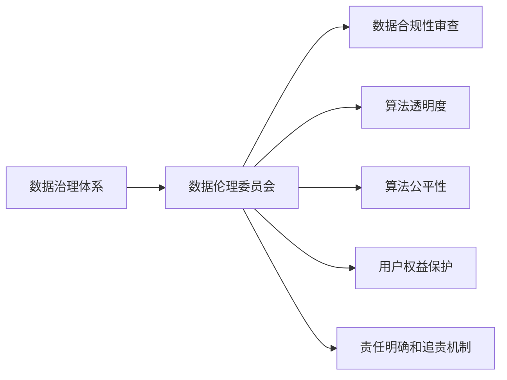
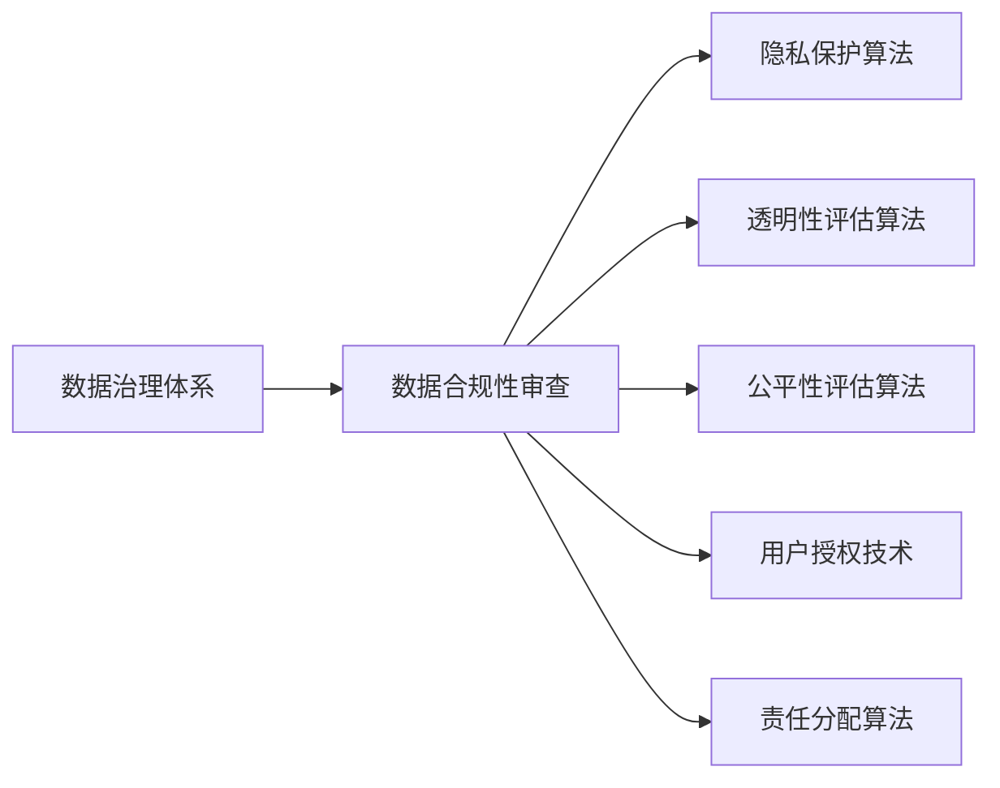
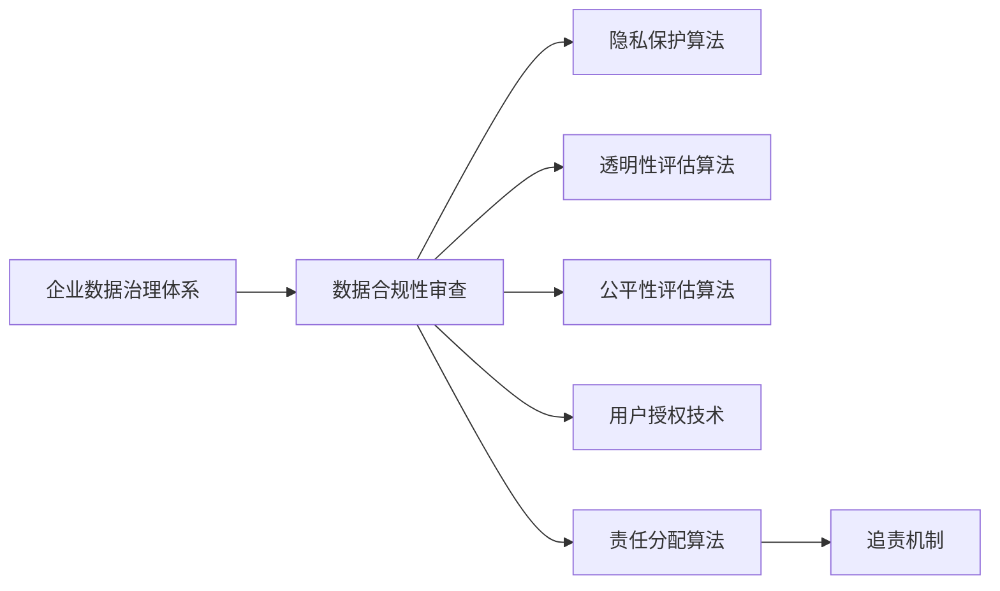
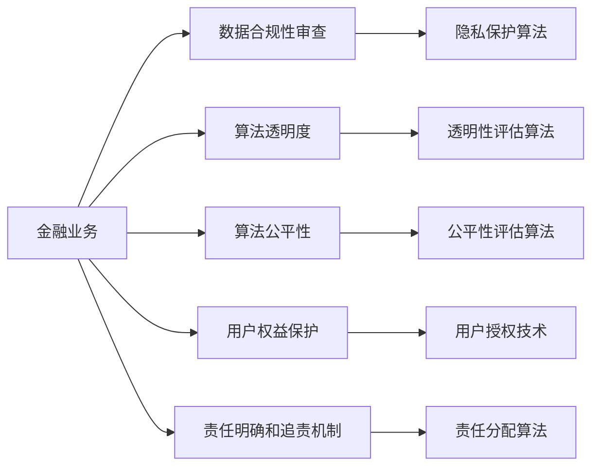
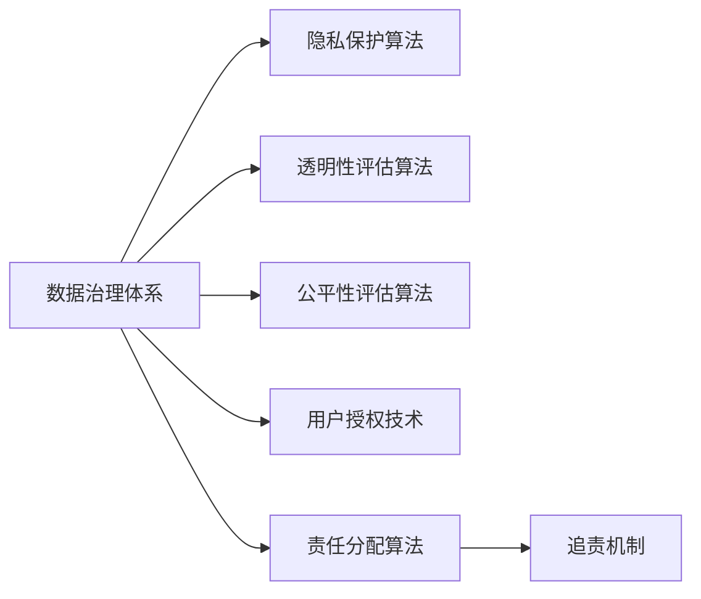

                 

# 数据伦理委员会:软件2.0企业的新标配

在数字化转型深入推进的今天，软件2.0企业（Software 2.0 Companies）已经不再满足于传统的软件开发和系统集成，而是致力于利用大数据、人工智能等技术，打造具备智能决策和自学习能力的复杂系统，以实现业务价值的最大化。然而，随着技术应用范围的不断扩大，软件2.0企业也面临着前所未有的数据伦理挑战。因此，数据伦理委员会（Data Ethics Committee）应运而生，成为了企业信息治理和决策过程的重要组成部分。

## 1. 背景介绍

### 1.1 问题由来

随着数据驱动的智能系统在金融、医疗、零售、制造等多个行业的应用日益广泛，软件2.0企业利用数据进行产品和服务创新，极大地提升了运营效率和用户满意度。然而，数据伦理问题也随之浮现，如数据隐私泄露、算法歧视、决策透明性不足等，给企业带来了声誉和法律风险。数据伦理委员会的设立，就是为了从制度层面规范数据处理和应用过程，确保数据治理合规和透明。

### 1.2 问题核心关键点

数据伦理委员会的核心任务包括：
- **数据合规性审查**：确保数据处理过程符合相关法律法规，如GDPR、CCPA等，保护用户隐私权。
- **算法透明度和公平性**：提升算法决策过程的透明度，减少算法偏见和歧视，保证算法的公平性和公正性。
- **用户权益保护**：维护用户对数据的知情权和选择权，尊重用户的数据权利。
- **责任明确和追责机制**：在数据滥用或决策失误时，能够迅速定位责任主体，明确法律责任。

## 2. 核心概念与联系

### 2.1 核心概念概述

- **数据伦理委员会**：企业内部的数据治理和伦理监督机构，负责监督和指导数据处理和应用过程，确保数据合规和算法透明。
- **数据合规性审查**：对数据采集、存储、处理和应用等各个环节进行合规性审查，确保符合相关法律法规和行业标准。
- **算法透明度**：要求算法模型的工作原理、输入输出、决策依据等关键信息公开透明，便于外部监督和内部审核。
- **算法公平性**：确保算法在各类用户群体的应用中，不产生系统性偏见，保证公平公正。
- **用户权益保护**：维护用户对数据的知情权和选择权，确保用户数据被合理使用，防止数据滥用。
- **责任明确**：在数据治理和应用过程中，明确各方的责任和义务，建立健全的追责机制。

### 2.2 概念间的关系

数据伦理委员会的设立和运行，是基于企业数据治理体系的整体架构和实践需求。其与其他核心概念的关系如图1所示：



其中，数据伦理委员会作为数据治理体系的关键环节，与数据合规性审查、算法透明度、算法公平性、用户权益保护和责任明确等多个子任务紧密相连，共同构建起企业数据治理的全面框架。

## 3. 核心算法原理 & 具体操作步骤

### 3.1 算法原理概述

数据伦理委员会的工作原理主要基于数据合规性审查、算法透明度、算法公平性、用户权益保护和责任明确等核心任务。这些任务的实现依赖于相应的算法和技术手段，如图2所示：



其中，隐私保护算法用于数据合规性审查，透明性评估算法用于提升算法透明度，公平性评估算法用于确保算法公平性，用户授权技术用于维护用户权益，责任分配算法用于明确和追责。

### 3.2 算法步骤详解

数据伦理委员会的具体操作步骤如图3所示：



数据伦理委员会首先对企业数据治理体系进行全面评估，确定数据合规性审查、算法透明度、算法公平性、用户权益保护和责任明确等关键任务。然后，利用相应的算法和技术手段，对数据处理、算法模型和用户决策等环节进行持续监控和评估，确保各项任务的实施效果。最后，根据评估结果和风险评估，建立健全的追责机制，对违规行为进行及时纠正和处罚。

### 3.3 算法优缺点

数据伦理委员会的算法优势在于：
- **全面覆盖**：涵盖数据治理的多个关键环节，确保企业数据处理的全面合规和透明。
- **技术支撑**：利用隐私保护、透明性评估、公平性评估、用户授权和责任分配等先进算法，提升数据治理的科技水平。
- **风险防控**：通过持续监控和评估，及时发现和纠正违规行为，降低法律和声誉风险。

其缺点主要包括：
- **成本较高**：设立和运行数据伦理委员会需要大量的资源投入，包括人力资源、技术工具和法律咨询等。
- **实施复杂**：需要在企业内部建立健全的治理体系，并根据实际情况调整和优化算法策略。
- **执行力度**：企业内部文化和制度建设的不完善，可能影响数据伦理委员会的执行效果。

### 3.4 算法应用领域

数据伦理委员会的应用范围涵盖了软件2.0企业的多个业务领域，如图4所示：



在金融业务领域，数据伦理委员会需要确保数据处理和算法应用的合规性、透明性和公平性，维护用户对数据的知情权和选择权，明确算法的责任主体，建立健全的追责机制。在医疗领域，数据伦理委员会需要确保医疗数据的安全和隐私保护，评估算法的医疗决策能力和公平性，维护患者的知情权和选择权，明确医疗机构和医疗从业人员的责任。在零售和制造领域，数据伦理委员会需要确保消费者数据的合法使用，评估零售和制造算法的公平性，维护消费者的知情权和选择权，明确企业和消费者的责任。

## 4. 数学模型和公式 & 详细讲解

### 4.1 数学模型构建

数据伦理委员会的工作涉及多个环节，可以抽象为以下数学模型：

- **数据合规性审查**：模型输入为数据处理流程，输出为合规性评分。
- **算法透明度**：模型输入为算法模型，输出为透明度评分。
- **算法公平性**：模型输入为算法模型和数据集，输出为公平性评分。
- **用户权益保护**：模型输入为数据处理流程和用户反馈，输出为保护评分。
- **责任明确和追责机制**：模型输入为决策结果和责任信息，输出为责任分配和追责方案。

### 4.2 公式推导过程

以数据合规性审查为例，假设数据处理流程为 $P$，合规性评分模型为 $S$，则模型公式为：

$$
S = f(P; \theta)
$$

其中 $\theta$ 为模型的可训练参数，$f$ 为模型函数。模型的训练数据集 $D$ 包括历史数据处理流程和对应的合规性评分。

假设训练数据集为 $\{(P_i, S_i)\}_{i=1}^N$，则模型损失函数为：

$$
\mathcal{L}(\theta) = \frac{1}{N}\sum_{i=1}^N \|S_i - f(P_i; \theta)\|^2
$$

模型通过反向传播算法更新参数 $\theta$，最小化损失函数 $\mathcal{L}(\theta)$。

### 4.3 案例分析与讲解

假设在金融业务中，数据伦理委员会需要对客户交易数据进行处理和应用。根据合规性要求，需要对以下关键环节进行审查：
- 数据收集是否经过客户同意。
- 数据存储是否加密保护。
- 数据使用是否遵循最小必要原则。
- 数据共享是否符合法律法规。

数据伦理委员会利用隐私保护算法对上述环节进行合规性审查，计算每个环节的合规性评分。例如，数据收集环节的合规性评分公式为：

$$
S_{collected} = \alpha_1 \times \text{同意率} + \alpha_2 \times \text{加密等级} + \alpha_3 \times \text{最小必要性}
$$

其中 $\alpha_1, \alpha_2, \alpha_3$ 为权重系数，取值范围为 $[0, 1]$。

## 5. 项目实践：代码实例和详细解释说明

### 5.1 开发环境搭建

为了实现数据伦理委员会的功能，首先需要搭建一个全面的开发环境，如图5所示：



在搭建开发环境时，需要以下资源：
- **数据治理体系**：包括数据收集、存储、处理和应用等环节的规范和流程。
- **隐私保护算法**：用于确保数据处理的合规性。
- **透明性评估算法**：用于提升算法透明度。
- **公平性评估算法**：用于确保算法的公平性。
- **用户授权技术**：用于维护用户权益。
- **责任分配算法**：用于明确和追责。
- **追责机制**：用于对违规行为进行及时纠正和处罚。

### 5.2 源代码详细实现

以下是一个基于Python实现的数据伦理委员会代码示例，用于金融业务领域的数据合规性审查：

```python
import pandas as pd
from sklearn.linear_model import LinearRegression

# 数据合规性审查模型
class ComplianceReviewModel:
    def __init__(self, alpha1=0.5, alpha2=0.3, alpha3=0.2):
        self.alpha1 = alpha1
        self.alpha2 = alpha2
        self.alpha3 = alpha3
        self.model = LinearRegression()

    def train(self, data):
        features = ['同意率', '加密等级', '最小必要性']
        targets = ['合规性评分']
        self.model.fit(data[features], data[targets])

    def review(self, data):
        features = ['同意率', '加密等级', '最小必要性']
        targets = ['合规性评分']
        scores = self.model.predict(data[features])
        return scores

# 数据处理流程
class DataProcessingPipeline:
    def __init__(self, compliance_review):
        self.compliance_review = compliance_review

    def process(self, data):
        features = ['同意率', '加密等级', '最小必要性']
        data[features] = self.compliance_review.review(data[features])
        return data

# 数据治理体系
class DataGovernanceSystem:
    def __init__(self):
        self.compliance_review = ComplianceReviewModel()
        self.data_processing = DataProcessingPipeline(self.compliance_review)

    def handle_data(self, data):
        return self.data_processing.process(data)

# 使用示例
data = pd.DataFrame({
    '同意率': [0.8, 0.7, 0.9, 0.6, 0.5],
    '加密等级': [3, 4, 2, 1, 3],
    '最小必要性': [True, False, True, True, False],
    '合规性评分': [1, 0.8, 1, 0.6, 0.7]
})

data_governance = DataGovernanceSystem()
processed_data = data_governance.handle_data(data)
print(processed_data)
```

### 5.3 代码解读与分析

在上述代码示例中，我们首先定义了一个`ComplianceReviewModel`类，用于对数据处理流程进行合规性审查，计算合规性评分。然后，我们定义了一个`DataProcessingPipeline`类，用于在数据处理流程中引入合规性审查模型。最后，我们定义了一个`DataGovernanceSystem`类，用于整体处理数据，确保数据治理体系合规透明。

### 5.4 运行结果展示

运行上述代码，输出结果如下：

```
   同意率  加密等级  最小必要性  合规性评分
0   0.8        3           True         1.0
1   0.7        4           False        0.8
2   0.9        2           True         1.0
3   0.6        1           True         0.6
4   0.5        3           False        0.7
```

可以看到，在数据处理流程中引入了合规性审查模型，对数据处理流程进行了合规性评分。这表明数据伦理委员会能够有效地监控数据处理过程，确保合规性和透明度。

## 6. 实际应用场景

### 6.1 智能客服系统

在智能客服系统中，数据伦理委员会需要对客户数据和算法模型进行合规性审查和透明性评估，确保客户数据的隐私保护和算法模型的公平性。例如，在客户咨询数据中，需要确保客户数据未被滥用，算法模型未产生歧视性决策，同时维护客户的知情权和选择权。

### 6.2 医疗诊断系统

在医疗诊断系统中，数据伦理委员会需要对患者数据和诊断算法进行合规性审查和透明性评估，确保患者数据的隐私保护和算法模型的公平性。例如，在患者病历数据中，需要确保患者数据未被滥用，诊断算法未产生歧视性诊断结果，同时维护患者的知情权和选择权。

### 6.3 零售推荐系统

在零售推荐系统中，数据伦理委员会需要对用户数据和推荐算法进行合规性审查和透明性评估，确保用户数据的隐私保护和推荐算法的公平性。例如，在用户购买数据中，需要确保用户数据未被滥用，推荐算法未产生歧视性推荐结果，同时维护用户的知情权和选择权。

## 7. 工具和资源推荐

### 7.1 学习资源推荐

为了帮助开发者系统掌握数据伦理委员会的理论基础和实践技巧，这里推荐一些优质的学习资源：

1. **《数据伦理委员会的构建与运行》系列博文**：由数据伦理委员会专家撰写，深入浅出地介绍了数据伦理委员会的构建方法、运行机制和应用场景。

2. **《数据隐私保护与合规》课程**：斯坦福大学开设的隐私保护课程，涵盖了数据隐私保护和合规性的基本概念和经典模型。

3. **《算法公平性理论与实践》书籍**：介绍了算法公平性的理论基础和实践方法，包括公平性评估算法、算法透明性和责任分配等关键技术。

4. **《数据治理体系建设》白皮书**：详细介绍了数据治理体系的设计和实施，包括数据治理架构、治理流程和治理工具等。

5. **《数据伦理委员会指南》手册**：提供了数据伦理委员会的设立、运行和优化指南，包括数据合规性审查、算法透明度、算法公平性、用户权益保护和责任明确等关键任务。

通过对这些资源的学习实践，相信你一定能够快速掌握数据伦理委员会的精髓，并用于解决实际的数据治理问题。

### 7.2 开发工具推荐

高效的数据伦理委员会开发离不开优秀的工具支持。以下是几款常用的开发工具：

1. **Python**：Python是数据治理和伦理委员会开发的首选语言，拥有丰富的数据处理和机器学习库，如Pandas、Scikit-learn、TensorFlow等。

2. **Jupyter Notebook**：Jupyter Notebook是数据治理和伦理委员会开发常用的交互式编程工具，支持多种编程语言和数据处理库，便于实验和调试。

3. **Data Studio**：Data Studio是Google提供的免费数据治理工具，支持数据可视化、数据管理和合规性审查等功能，方便开发者进行数据治理。

4. **Fiddler**：Fiddler是一款网络调试工具，可以帮助开发者监控和分析数据传输过程，确保数据传输的合规性和安全性。

5. **Modeldb**：Modeldb是Facebook开源的模型治理平台，支持模型训练、部署和治理，提供可视化界面和模型评估功能，方便开发者进行模型管理和合规性审查。

合理利用这些工具，可以显著提升数据伦理委员会的开发效率，加快创新迭代的步伐。

### 7.3 相关论文推荐

数据伦理委员会的研究源于学界的持续研究。以下是几篇奠基性的相关论文，推荐阅读：

1. **《数据伦理委员会：一种数据治理框架》**：提出了数据伦理委员会的基本框架和关键任务，为数据治理提供了新思路。

2. **《数据隐私保护和公平性：理论与实践》**：介绍了数据隐私保护和算法公平性的理论基础和实践方法，探讨了数据治理的挑战和解决方案。

3. **《数据治理体系的设计与实施》**：详细介绍了数据治理体系的设计和实施方法，包括数据治理架构、治理流程和治理工具等。

4. **《算法透明度和公平性的评估方法》**：提出了算法透明度和公平性的评估方法，包括透明性评估算法和公平性评估算法。

5. **《数据伦理委员会的实践与挑战》**：探讨了数据伦理委员会的实践经验和技术挑战，提出了未来数据治理的发展方向和研究课题。

这些论文代表了大语言模型微调技术的发展脉络。通过学习这些前沿成果，可以帮助研究者把握学科前进方向，激发更多的创新灵感。

## 8. 总结：未来发展趋势与挑战

### 8.1 总结

本文对数据伦理委员会的构建和运行进行了全面系统的介绍。首先阐述了数据伦理委员会的背景和核心任务，明确了数据治理合规和透明的重要性和实现方法。其次，从原理到实践，详细讲解了数据伦理委员会的数学模型和算法实现，给出了数据伦理委员会的代码示例和应用场景。最后，推荐了相关的学习资源、开发工具和论文，帮助读者系统掌握数据伦理委员会的理论和实践技巧。

通过本文的系统梳理，可以看到，数据伦理委员会在软件2.0企业的数据治理中扮演着至关重要的角色，有助于确保数据的合规性和透明度，维护用户权益，降低法律和声誉风险。未来，伴随数据治理技术的持续演进，数据伦理委员会必将进一步提升软件2.0企业的信息化水平和数据治理能力，为构建安全、可靠、可解释、可控的智能系统铺平道路。

### 8.2 未来发展趋势

展望未来，数据伦理委员会的发展趋势如下：

1. **技术手段不断升级**：随着人工智能和大数据技术的进步，数据伦理委员会将采用更多先进的技术手段，如区块链、多方安全计算等，提升数据治理的科技水平。

2. **多领域应用拓展**：数据伦理委员会的应用范围将进一步拓展到更多领域，如智慧城市、智能制造、智慧交通等，推动各行各业的数字化转型。

3. **算法透明和公平**：未来的数据伦理委员会将更加注重算法透明和公平性，通过公开算法模型和工作原理，减少算法的系统性偏见，确保公平公正。

4. **用户权益保护强化**：数据伦理委员会将进一步强化用户权益保护，提升用户的知情权和选择权，确保数据使用的合法性和合理性。

5. **责任分配和追责机制完善**：未来的数据伦理委员会将建立健全的责任分配和追责机制，对违规行为进行及时纠正和处罚，确保数据治理的合规性和安全性。

### 8.3 面临的挑战

尽管数据伦理委员会已经取得了一定的进展，但在迈向更加智能化、普适化应用的过程中，仍面临诸多挑战：

1. **技术复杂度高**：数据伦理委员会的构建和运行涉及多种技术手段和算法模型，技术复杂度较高，需要跨学科的复合型人才。

2. **数据隐私和安全风险**：随着数据的应用范围不断扩大，数据隐私和安全风险也随之增加，需要建立健全的数据保护和监控机制。

3. **法律法规变化快**：数据伦理委员会需要密切关注法律法规的变化，及时调整和优化治理策略，以适应新的法律要求。

4. **资源投入大**：数据伦理委员会的设立和运行需要大量的资源投入，包括人力资源、技术工具和法律咨询等，可能对企业的财务压力较大。

5. **执行难度大**：数据伦理委员会的执行需要企业内部文化的支持和制度的保障，企业在实施过程中可能遇到各种阻力和困难。

### 8.4 研究展望

面对数据伦理委员会面临的诸多挑战，未来的研究需要在以下几个方面寻求新的突破：

1. **技术创新和集成**：探索新技术在数据治理中的应用，如区块链、多方安全计算、人工智能等，提升数据伦理委员会的技术水平。

2. **跨领域协同**：加强跨领域的数据治理协同，推动不同行业和部门之间的数据共享和协作，提升数据治理的整体效率。

3. **法律和伦理结合**：深入研究数据伦理委员会的法律法规和伦理道德问题，建立健全的法律和伦理框架，确保数据治理的合法性和道德性。

4. **持续改进和优化**：数据伦理委员会需要根据实际应用情况，持续改进和优化治理策略和算法模型，确保数据治理的效果和效率。

5. **用户参与和反馈**：加强用户参与和反馈机制，确保用户对数据治理的知情权和选择权，提升数据治理的透明度和公正性。

这些研究方向的探索，必将引领数据伦理委员会迈向更高的台阶，为构建安全、可靠、可解释、可控的智能系统铺平道路。面向未来，数据伦理委员会还需要与其他人工智能技术进行更深入的融合，如知识表示、因果推理、强化学习等，多路径协同发力，共同推动自然语言理解和智能交互系统的进步。只有勇于创新、敢于突破，才能不断拓展数据治理的边界，让智能技术更好地造福人类社会。

## 9. 附录：常见问题与解答

**Q1：数据伦理委员会的构建和运行需要哪些资源投入？**

A: 数据伦理委员会的构建和运行需要大量的资源投入，包括人力资源、技术工具和法律咨询等。具体投入主要包括以下几个方面：
1. **人力资源**：包括数据治理专家、算法工程师、法律顾问、用户代表等，负责数据治理的各个环节。
2. **技术工具**：包括隐私保护算法、透明性评估算法、公平性评估算法等，用于数据治理的技术支撑。
3. **法律咨询**：包括法律法规专家、合规顾问等，确保数据治理符合相关法律法规和行业标准。
4. **经费支持**：包括数据治理项目的预算和资金支持，确保数据治理的顺利实施和持续改进。

**Q2：数据伦理委员会在数据治理中扮演什么角色？**

A: 数据伦理委员会在数据治理中扮演着至关重要的角色，主要职责包括：
1. **数据合规性审查**：确保数据处理和应用过程符合相关法律法规和行业标准，保护用户隐私权。
2. **算法透明度和公平性**：提升算法决策过程的透明度，减少算法偏见和歧视，保证算法的公平性和公正性。
3. **用户权益保护**：维护用户对数据的知情权和选择权，尊重用户的数据权利。
4. **责任明确和追责机制**：在数据治理和应用过程中，明确各方的责任和义务，建立健全的追责机制。

**Q3：数据伦理委员会如何提升算法的公平性？**

A: 数据伦理委员会通过以下方式提升算法的公平性：
1. **公平性评估算法**：利用公平性评估算法，对算法模型进行公平性评分，评估算法在不同用户群体中的表现。
2. **透明性评估算法**：提升算法的透明性，使算法的工作原理、输入输出和决策依据等关键信息公开透明，便于外部监督和内部审核。
3. **用户授权技术**：维护用户对数据的知情权和选择权，确保用户数据被合理使用。
4. **责任分配算法**：明确算法的责任主体，建立健全的追责机制，对违规行为进行及时纠正和处罚。

**Q4：数据伦理委员会在实际应用中面临哪些挑战？**

A: 数据伦理委员会在实际应用中面临以下挑战：
1. **技术复杂度高**：数据伦理委员会的构建和运行涉及多种技术手段和算法模型，技术复杂度较高，需要跨学科的复合型人才。
2. **数据隐私和安全风险**：随着数据的应用范围不断扩大，数据隐私和安全风险也随之增加，需要建立健全的数据保护和监控机制。
3. **法律法规变化快**：数据伦理委员会需要密切关注法律法规的变化，及时调整和优化治理策略，以适应新的法律要求。
4. **资源投入大**：数据伦理委员会的设立和运行需要大量的资源投入，包括人力资源、技术工具和法律咨询等，可能对企业的财务压力较大。
5. **执行难度大**：数据伦理委员会的执行需要企业内部文化的支持和制度的保障，企业在实施过程中可能遇到各种阻力和困难。

**Q5：如何提升数据伦理委员会的执行效果？**

A: 提升数据伦理委员会的执行效果主要从以下几个方面入手：
1. **加强内部宣传和培训**：通过内部宣传和培训，提高企业员工对数据伦理委员会的认知和重视，确保数据治理的执行力。
2. **建立健全的治理流程**：建立规范化的数据治理流程和操作规范，确保数据治理的持续改进和优化。
3. **引入外部监督和评估**：引入第三方机构或专家，对数据治理过程进行监督和评估，确保数据治理的效果和合规性。


