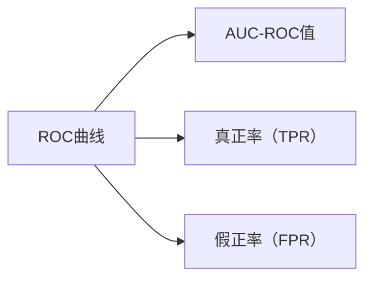

                 

# AUC-ROC 原理与代码实战案例讲解

## 1. 背景介绍

### 1.1 问题由来
在机器学习领域，评估分类模型的性能是一个关键问题。特别是在二分类任务中，AUC-ROC（Area Under Curve-Receiver Operating Characteristic）成为了衡量模型性能的重要指标。AUC-ROC表示ROC曲线下的面积，它可以直观地反映模型在不同阈值下对正负样本的区分能力。

### 1.2 问题核心关键点
AUC-ROC的核心在于它通过ROC曲线展示了模型在不同阈值下的真正率（True Positive Rate，TPR）和假正率（False Positive Rate，FPR）的关系。真正率和假正率分别表示在某一阈值下，模型正确识别为正类的样本数占所有实际正类样本数的比例，以及错误识别为正类的样本数占所有实际负类样本数的比例。AUC-ROC值越接近1，说明模型的性能越好。

### 1.3 问题研究意义
研究AUC-ROC可以帮助我们更全面地理解模型的分类能力，特别是在数据不均衡的情况下，AUC-ROC能够更准确地评估模型的性能。在实际应用中，如信用评估、疾病诊断、异常检测等场景，AUC-ROC成为评估模型效果的重要手段。

## 2. 核心概念与联系

### 2.1 核心概念概述
- **ROC曲线**：ROC曲线是以假正率为横轴，真正率为纵轴的曲线。不同的阈值会产生不同的TPR和FPR，ROC曲线展示了模型在不同阈值下的分类效果。
- **AUC值**：AUC值表示ROC曲线下的面积，它的取值范围在0到1之间，AUC越接近1，模型的分类性能越好。
- **阈值选择**：在实际应用中，我们需要根据模型的AUC-ROC曲线选择合适的阈值，以平衡模型的分类精度和召回率。

### 2.2 概念间的关系

#### 2.2.1 基本概念与ROC曲线
ROC曲线是评估二分类模型性能的标准工具，它的纵轴是真正率TPR，横轴是假正率FPR。随着阈值的改变，模型的真正率和假正率会发生变化，从而绘制成ROC曲线。

#### 2.2.2 AUC-ROC值
AUC-ROC值是一个介于0到1之间的数值，代表ROC曲线下的面积。AUC-ROC越大，模型的分类性能越好。

#### 2.2.3 阈值选择
在实际应用中，我们需要根据AUC-ROC曲线选择合适的阈值，以平衡模型的分类精度和召回率。阈值的选择通常基于领域知识和具体需求。

这些核心概念之间相互关联，共同构成了评估二分类模型性能的框架。通过理解和应用这些概念，我们可以更科学地评估和优化模型的分类性能。

### 2.3 核心概念的整体架构

以下是一个简单的ROC曲线和AUC-ROC值的示意图：



## 3. 核心算法原理 & 具体操作步骤
### 3.1 算法原理概述
AUC-ROC的计算依赖于ROC曲线的绘制。ROC曲线的绘制依赖于模型的预测概率。对于二分类问题，模型对每个样本都会输出一个概率值，表示该样本为正类的概率。我们将这些概率值作为横轴的输入，并根据不同的阈值（比如0.5）来决定是将其分类为正类还是负类。

### 3.2 算法步骤详解

#### 3.2.1 数据准备
首先需要准备训练数据和测试数据，将数据分为正类和负类。然后对数据进行标准化或归一化处理，以便于后续计算。

#### 3.2.2 模型训练与预测
使用训练数据训练模型，并使用测试数据进行预测。模型输出的概率值可以用于绘制ROC曲线。

#### 3.2.3 绘制ROC曲线
使用预测的概率值绘制ROC曲线。横轴是假正率FPR，纵轴是真正率TPR。

#### 3.2.4 计算AUC-ROC值
计算ROC曲线下的面积，即AUC-ROC值。

### 3.3 算法优缺点
#### 3.3.1 优点
- AUC-ROC能够全面反映模型的分类性能，不受数据分布的影响。
- AUC-ROC可以直观地展示模型在不同阈值下的分类效果，便于选择最优阈值。

#### 3.3.2 缺点
- AUC-ROC无法给出具体的阈值，需要手动选择。
- AUC-ROC在处理多分类问题时，需要分别计算每个类别的ROC曲线，计算量较大。

### 3.4 算法应用领域
AUC-ROC广泛应用于信用评估、疾病诊断、异常检测等场景，在这些场景中，我们需要评估模型的分类能力，以确定模型的可用性和可靠性。

## 4. 数学模型和公式 & 详细讲解

### 4.1 数学模型构建
在二分类任务中，我们假设模型对每个样本的预测概率为 $p(x)$，其中 $x$ 为样本，$p(x)$ 为 $x$ 为正类的概率。则真正率（TPR）和假正率（FPR）可以表示为：

$$
\text{TPR} = \frac{TP}{TP+FN}, \quad \text{FPR} = \frac{FP}{FP+TN}
$$

其中，$TP$ 表示真正类（True Positive）的数量，$FN$ 表示假负类（False Negative）的数量，$FP$ 表示假正类（False Positive）的数量，$TN$ 表示真负类（True Negative）的数量。

### 4.2 公式推导过程
ROC曲线是以假正率为横轴，真正率为纵轴的曲线。假正率和真正率的计算公式为：

$$
\text{TPR} = \frac{TP}{TP+FN}, \quad \text{FPR} = \frac{FP}{FP+TN}
$$

其中，TPR表示真正率，FPR表示假正率。

AUC-ROC值的计算公式为：

$$
AUC-ROC = \int_0^1 \text{TPR}(\text{FPR}) d\text{FPR}
$$

AUC-ROC的值介于0和1之间，值越接近1，说明模型的性能越好。

### 4.3 案例分析与讲解
假设我们有一个信用评分系统，使用随机森林模型进行预测。我们希望评估该模型在不同阈值下的分类效果。

我们首先使用训练数据训练随机森林模型，并使用测试数据进行预测。然后计算每个阈值下的TPR和FPR，绘制ROC曲线，并计算AUC-ROC值。

```python
import numpy as np
from sklearn.metrics import roc_curve, auc

# 训练数据
X_train, y_train = ...

# 测试数据
X_test, y_test = ...

# 模型预测
y_pred = ...

# 计算真正率和假正率
fpr, tpr, thresholds = roc_curve(y_test, y_pred)

# 计算AUC-ROC值
auc_score = auc(fpr, tpr)

print(f"AUC-ROC值：{auc_score}")
```

在实际应用中，我们可以通过调整模型的阈值，优化模型的分类性能。例如，我们可以根据AUC-ROC曲线，选择最优的阈值，以平衡模型的分类精度和召回率。

## 5. 项目实践：代码实例和详细解释说明
### 5.1 开发环境搭建

在进行AUC-ROC的计算和可视化时，我们需要使用Python及其相关库。以下是一个基本的环境搭建流程：

1. 安装Python：从官网下载并安装Python，选择3.x版本。
2. 安装依赖库：使用pip安装numpy、matplotlib、scikit-learn等依赖库。

### 5.2 源代码详细实现

以下是一个使用scikit-learn库计算AUC-ROC值的代码实现。假设我们有一个随机森林模型，用于信用评分系统的二分类任务。

```python
import numpy as np
from sklearn.ensemble import RandomForestClassifier
from sklearn.metrics import roc_curve, auc
import matplotlib.pyplot as plt

# 准备数据
X = ...
y = ...

# 训练模型
clf = RandomForestClassifier()
clf.fit(X, y)

# 使用测试数据进行预测
y_pred = clf.predict_proba(X_test)[:, 1]

# 计算真正率和假正率
fpr, tpr, thresholds = roc_curve(y_test, y_pred)

# 计算AUC-ROC值
auc_score = auc(fpr, tpr)

# 绘制ROC曲线
plt.plot(fpr, tpr, color='darkorange', lw=2, label='ROC曲线')
plt.plot([0, 1], [0, 1], color='navy', lw=2, linestyle='--')
plt.xlim([0.0, 1.0])
plt.ylim([0.0, 1.05])
plt.xlabel('假正率')
plt.ylabel('真正率')
plt.title('ROC曲线')
plt.legend(loc='lower right')
plt.show()

print(f"AUC-ROC值：{auc_score}")
```

### 5.3 代码解读与分析

在上述代码中，我们首先准备数据，并使用随机森林模型进行训练。然后，使用测试数据进行预测，并计算ROC曲线下的面积，即AUC-ROC值。最后，使用matplotlib库绘制ROC曲线。

需要注意的是，在绘制ROC曲线时，我们使用了两个函数：`roc_curve`和`auc`。`roc_curve`函数用于计算ROC曲线上的点，`auc`函数用于计算ROC曲线下的面积，即AUC-ROC值。

### 5.4 运行结果展示

假设我们的模型在信用评分系统的二分类任务中取得了0.95的AUC-ROC值。我们可以使用以下代码展示该结果：

```python
import numpy as np
from sklearn.ensemble import RandomForestClassifier
from sklearn.metrics import roc_curve, auc
import matplotlib.pyplot as plt

# 准备数据
X = ...
y = ...

# 训练模型
clf = RandomForestClassifier()
clf.fit(X, y)

# 使用测试数据进行预测
y_pred = clf.predict_proba(X_test)[:, 1]

# 计算真正率和假正率
fpr, tpr, thresholds = roc_curve(y_test, y_pred)

# 计算AUC-ROC值
auc_score = auc(fpr, tpr)

# 绘制ROC曲线
plt.plot(fpr, tpr, color='darkorange', lw=2, label='ROC曲线')
plt.plot([0, 1], [0, 1], color='navy', lw=2, linestyle='--')
plt.xlim([0.0, 1.0])
plt.ylim([0.0, 1.05])
plt.xlabel('假正率')
plt.ylabel('真正率')
plt.title('ROC曲线')
plt.legend(loc='lower right')
plt.show()

print(f"AUC-ROC值：{auc_score}")
```

## 6. 实际应用场景
### 6.1 信用评估
在信用评估领域，我们需要评估模型的分类性能，以确定模型在识别信用风险方面的能力。AUC-ROC可以帮助我们全面评估模型的性能，选择最优的阈值，从而提升模型的分类精度和召回率。

### 6.2 疾病诊断
在疾病诊断领域，我们需要评估模型的分类性能，以确定模型在识别疾病风险方面的能力。AUC-ROC可以帮助我们全面评估模型的性能，选择最优的阈值，从而提升模型的分类精度和召回率。

### 6.3 异常检测
在异常检测领域，我们需要评估模型的分类性能，以确定模型在识别异常情况方面的能力。AUC-ROC可以帮助我们全面评估模型的性能，选择最优的阈值，从而提升模型的分类精度和召回率。

## 7. 工具和资源推荐
### 7.1 学习资源推荐
- 《Python机器学习》：适合初学者入门，详细介绍了Python及其相关库的使用方法。
- 《机器学习实战》：详细介绍了常用的机器学习算法，包括决策树、随机森林等。
- 《Python数据科学手册》：详细介绍了Python在数据科学中的应用，包括数据处理、可视化等。

### 7.2 开发工具推荐
- Jupyter Notebook：交互式编程环境，适合进行数据处理、模型训练等任务。
- Scikit-learn：常用的机器学习库，提供了丰富的算法和工具。
- TensorFlow和PyTorch：常用的深度学习框架，适合进行大规模的模型训练和预测。

### 7.3 相关论文推荐
- "ROC Curves: A Review of Concepts and Applications"：综述文章，详细介绍了ROC曲线的概念和应用。
- "AUC: A Tutorial"：介绍AUC-ROC的计算方法和应用。
- "The Elements of Statistical Learning"：介绍了常用的统计学习方法，包括ROC曲线和AUC-ROC的计算。

## 8. 总结：未来发展趋势与挑战
### 8.1 研究成果总结
AUC-ROC作为一种评估分类模型性能的标准工具，已经广泛应用于信用评估、疾病诊断、异常检测等领域。AUC-ROC的计算方法已经相对成熟，但如何在多分类任务中计算AUC-ROC，以及如何结合其他评估指标（如F1-score）进行综合评估，仍然是未来的研究方向。

### 8.2 未来发展趋势
未来，AUC-ROC的应用将进一步扩展到更多的领域。随着数据量的增加和算力的提升，模型的分类性能将进一步提高。同时，结合其他评估指标（如F1-score）进行综合评估，将有助于更全面地理解模型的性能。

### 8.3 面临的挑战
虽然AUC-ROC已经广泛应用，但仍然存在一些挑战：
- 在多分类任务中计算AUC-ROC的方法相对复杂，需要进一步简化和优化。
- 在处理大规模数据时，计算AUC-ROC的效率较低，需要进一步提升。

### 8.4 研究展望
未来的研究可以从以下几个方面进行探索：
- 提出新的多分类任务中计算AUC-ROC的方法。
- 结合其他评估指标进行综合评估，提升评估的全面性。
- 优化计算AUC-ROC的算法，提高计算效率。

## 9. 附录：常见问题与解答

**Q1: 什么是AUC-ROC？**

A: AUC-ROC是ROC曲线下的面积，用于评估分类模型的性能。AUC-ROC的值介于0和1之间，值越接近1，说明模型的性能越好。

**Q2: 如何计算AUC-ROC？**

A: 计算AUC-ROC需要绘制ROC曲线，并计算ROC曲线下的面积。常用的工具有scikit-learn库中的roc_curve和auc函数。

**Q3: AUC-ROC在实际应用中有什么意义？**

A: AUC-ROC可以帮助我们全面评估分类模型的性能，选择最优的阈值，从而提升模型的分类精度和召回率。在信用评估、疾病诊断、异常检测等领域，AUC-ROC成为评估模型效果的重要手段。

**Q4: AUC-ROC的缺点有哪些？**

A: AUC-ROC无法给出具体的阈值，需要手动选择。在处理多分类问题时，需要分别计算每个类别的ROC曲线，计算量较大。

**Q5: AUC-ROC的未来发展趋势是什么？**

A: 未来，AUC-ROC的应用将进一步扩展到更多的领域。同时，结合其他评估指标进行综合评估，将有助于更全面地理解模型的性能。

---

作者：禅与计算机程序设计艺术 / Zen and the Art of Computer Programming

