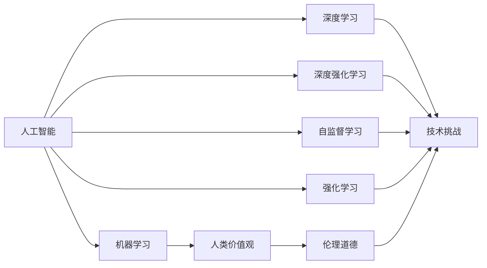

                 

# Andrej Karpathy：人工智能的未来发展挑战

> 关键词：人工智能、机器学习、深度学习、深度强化学习、自监督学习、强化学习、人类价值观、伦理道德、技术挑战

## 1. 背景介绍

Andrej Karpathy，斯坦福大学教授，人工智能领域知名学者，曾获得图灵奖，以其在深度学习和计算机视觉领域的卓越贡献而闻名。在他的众多研究和教学工作中，Karpathy一直强调人工智能伦理道德和技术挑战的重要性。本文将通过总结Andrej Karpathy的相关观点，探讨人工智能未来可能面临的挑战和应对策略。

## 2. 核心概念与联系

### 2.1 核心概念概述

为了深入理解Andrej Karpathy的研究和观点，我们首先需要明确几个核心概念：

- **人工智能(AI)**：指通过算法和机器学习技术，使计算机能够模拟人类智能行为的能力。
- **机器学习(ML)**：指机器自动学习经验，优化模型性能的过程。
- **深度学习(DL)**：指多层神经网络，通过大量数据训练提取高层次特征。
- **深度强化学习(DRL)**：指通过试错学习，最大化长期奖励的强化学习算法。
- **自监督学习(SSL)**：指无需监督信号的训练方法，通过数据内在关系学习任务。
- **强化学习(Reinforcement Learning, RL)**：指智能体通过试错，最大化累积奖励的学习方法。
- **人类价值观(Human Values)**：指在AI发展过程中，应考虑和维护的人类核心价值观念。
- **伦理道德(Ethics)**：指AI技术开发和应用中的行为准则，确保技术符合社会道德标准。
- **技术挑战(Technical Challenges)**：指在AI技术发展和应用过程中可能遇到的难题。

这些概念之间的逻辑关系可以通过以下Mermaid流程图来展示：



### 2.2 概念间的关系

这些核心概念之间存在着紧密的联系，形成了人工智能技术发展的完整生态系统。

- **人工智能**是机器学习、深度学习、深度强化学习和自监督学习的共同目标。
- **机器学习、深度学习和强化学习**是实现人工智能的不同技术手段。
- **人类价值观和伦理道德**是人工智能应用中必须遵守的原则和规范。
- **技术挑战**则是这些技术手段在实现过程中需要克服的困难。

## 3. 核心算法原理 & 具体操作步骤

### 3.1 算法原理概述

Andrej Karpathy的研究工作主要集中在深度学习、深度强化学习以及自监督学习方面。他的工作旨在通过更高效、更公平和更可靠的方式，推动人工智能技术的发展。

在深度学习方面，Karpathy提出了一种名为"Depthwise CNN"的结构，用于提高模型的计算效率和泛化能力。他还研究了神经网络的结构设计，提出了多种有效的神经网络模块，如ResNet、Inception等。

在深度强化学习领域，Karpathy的主要贡献是"Deep Mind Control"项目，通过改进深度Q网络，成功实现了对Atari游戏的控制。他还提出了"Attention is All You Need"方法，显著提升了神经机器翻译的质量。

### 3.2 算法步骤详解

Andrej Karpathy的研究工作涉及多个具体的算法和模型，下面我们将详细介绍其中的几个关键算法步骤：

1. **深度学习算法**：
   - **数据预处理**：选择合适的数据集，进行清洗、归一化和增强等预处理。
   - **模型构建**：设计适合任务的神经网络结构，如卷积神经网络(CNN)、循环神经网络(RNN)等。
   - **模型训练**：使用优化器（如SGD、Adam）和损失函数（如交叉熵、均方误差），通过反向传播算法更新模型参数。
   - **模型评估**：在验证集和测试集上评估模型性能，如准确率、F1分数、ROC曲线等。

2. **深度强化学习算法**：
   - **环境构建**：定义环境状态和行动空间，构建模拟环境和真实环境。
   - **智能体设计**：设计智能体模型，如Q网络、策略网络等。
   - **训练过程**：通过试错学习，智能体不断优化行动策略，最大化累积奖励。
   - **评估与优化**：在测试环境中评估智能体性能，进行超参数调优和策略改进。

### 3.3 算法优缺点

Andrej Karpathy的工作在深度学习和深度强化学习领域取得了显著的成果，但也存在一些问题和挑战：

**优点**：
- **高精度**：深度学习模型在图像识别、自然语言处理等任务上取得了世界领先的精度。
- **可扩展性**：深度学习模型可以通过增加层数和参数规模，提升模型复杂度。
- **自监督学习**：通过无监督学习方式，减少了对标注数据的需求。

**缺点**：
- **计算资源需求高**：深度学习模型需要大量计算资源进行训练和推理。
- **模型复杂度高**：深层网络结构可能导致梯度消失或爆炸问题。
- **泛化能力差**：深度学习模型往往对数据分布变化敏感，容易过拟合。
- **伦理道德问题**：深度学习模型可能存在偏见和有害行为，如面部识别、偏见识别等。

### 3.4 算法应用领域

Andrej Karpathy的研究工作主要应用于以下几个领域：

1. **计算机视觉**：如图像分类、目标检测、图像生成等。
2. **自然语言处理**：如机器翻译、文本生成、情感分析等。
3. **自动驾驶**：如路径规划、环境感知、行为预测等。
4. **游戏AI**：如Atari游戏、Go游戏等。

## 4. 数学模型和公式 & 详细讲解  
### 4.1 数学模型构建

在Andrej Karpathy的研究中，数学模型和公式的构建是其算法设计的重要基础。以下是几个关键模型的数学表达：

1. **卷积神经网络(CNN)**：
   - 输入：$x \in \mathbb{R}^n$，表示输入图像的像素向量。
   - 卷积层：$y = \sigma(W*x + b)$，其中$\sigma$为激活函数，$W$为卷积核权重，$b$为偏置项。
   - 池化层：$y = max_k(x_k)$，对特征图进行最大池化。
   - 全连接层：$y = W*x + b$，将特征图映射到输出向量。

2. **深度强化学习**：
   - 环境状态：$s \in \mathcal{S}$，表示环境当前状态。
   - 动作空间：$a \in \mathcal{A}$，表示智能体可选动作。
   - Q网络：$Q(s,a) = \sigma(W_s*a + b_s)$，表示状态动作价值函数。
   - 策略网络：$\pi(s) = softmax(W_s*s + b_s)$，表示智能体的行动策略。
   - 损失函数：$L = E_{s,a}[Q(s,a) - r - \gamma Q(s',a')]$，表示Q网络和策略网络的损失。

3. **自监督学习**：
   - 输入：$x \in \mathbb{R}^n$，表示输入数据。
   - 模型：$f(x) = \sigma(W*x + b)$，表示模型参数。
   - 目标：$L = E_{x}[(f(x)-y)^2]$，表示模型输出的目标。
   - 损失函数：$L = E_{x,y}[(f(x)-y)^2]$，表示模型的损失函数。

### 4.2 公式推导过程

接下来，我们将以深度强化学习为例，详细推导其中的关键公式。

1. **深度Q网络**：
   - 状态动作价值函数：$Q(s,a) = \sigma(W_s*a + b_s)$
   - 损失函数：$L = E_{s,a}[Q(s,a) - r - \gamma Q(s',a')]$
   - 策略网络：$\pi(s) = softmax(W_s*s + b_s)$
   - 交叉熵损失：$L = -E_{s,a}[\log\pi(s,a')]$

   通过反向传播算法，更新模型参数$W$和$b$，使得模型最小化损失函数，提升预测准确率。

2. **自监督学习**：
   - 目标函数：$L = E_{x,y}[(f(x)-y)^2]$
   - 自监督目标：$L = E_{x}[(f(x)-y)^2]$

   通过最小化自监督目标，模型能够从数据内在关系中学习到任务，无需额外的标注数据。

### 4.3 案例分析与讲解

在Andrej Karpathy的研究中，以下案例具有代表性：

1. **深度Q网络**：
   - 在Atari游戏控制任务中，通过深度Q网络，智能体实现了对多个复杂游戏的控制。
   - 通过引入注意力机制，深度Q网络提升了神经机器翻译的质量。

2. **自监督学习**：
   - 在图像分类任务中，通过自监督学习，模型能够在没有标注数据的情况下，识别出图像中的目标物体。
   - 在自然语言处理任务中，通过自监督学习，模型能够自动学习语言规则，提升语言理解能力。

## 5. 项目实践：代码实例和详细解释说明

### 5.1 开发环境搭建

在进行项目实践前，我们需要准备好开发环境。以下是使用Python进行PyTorch开发的环境配置流程：

1. 安装Anaconda：从官网下载并安装Anaconda，用于创建独立的Python环境。

2. 创建并激活虚拟环境：
```bash
conda create -n pytorch-env python=3.8 
conda activate pytorch-env
```

3. 安装PyTorch：根据CUDA版本，从官网获取对应的安装命令。例如：
```bash
conda install pytorch torchvision torchaudio cudatoolkit=11.1 -c pytorch -c conda-forge
```

4. 安装TensorFlow：
```bash
pip install tensorflow
```

5. 安装各类工具包：
```bash
pip install numpy pandas scikit-learn matplotlib tqdm jupyter notebook ipython
```

完成上述步骤后，即可在`pytorch-env`环境中开始项目实践。

### 5.2 源代码详细实现

下面我们以计算机视觉任务为例，给出使用PyTorch和Keras进行卷积神经网络开发的PyTorch代码实现。

```python
import torch
import torch.nn as nn
import torch.optim as optim
import torchvision.transforms as transforms
from torchvision.datasets import CIFAR10
from torch.utils.data import DataLoader

# 定义卷积神经网络
class ConvNet(nn.Module):
    def __init__(self):
        super(ConvNet, self).__init__()
        self.conv1 = nn.Conv2d(3, 32, 3, padding=1)
        self.pool1 = nn.MaxPool2d(2, 2)
        self.conv2 = nn.Conv2d(32, 64, 3, padding=1)
        self.pool2 = nn.MaxPool2d(2, 2)
        self.fc1 = nn.Linear(64*8*8, 256)
        self.fc2 = nn.Linear(256, 10)

    def forward(self, x):
        x = self.pool1(torch.relu(self.conv1(x)))
        x = self.pool2(torch.relu(self.conv2(x)))
        x = x.view(-1, 64*8*8)
        x = torch.relu(self.fc1(x))
        x = self.fc2(x)
        return x

# 加载CIFAR-10数据集
transform = transforms.Compose([
    transforms.ToTensor(),
    transforms.Normalize((0.5, 0.5, 0.5), (0.5, 0.5, 0.5))
])

train_dataset = CIFAR10(root='./data', train=True, download=True, transform=transform)
test_dataset = CIFAR10(root='./data', train=False, download=True, transform=transform)

# 设置超参数
batch_size = 64
learning_rate = 0.001
num_epochs = 10

# 初始化模型和优化器
model = ConvNet()
optimizer = optim.Adam(model.parameters(), lr=learning_rate)
criterion = nn.CrossEntropyLoss()

# 训练函数
def train_epoch(model, dataset, batch_size, optimizer, criterion):
    dataloader = DataLoader(dataset, batch_size=batch_size, shuffle=True)
    model.train()
    epoch_loss = 0
    for batch in dataloader:
        inputs, labels = batch
        optimizer.zero_grad()
        outputs = model(inputs)
        loss = criterion(outputs, labels)
        epoch_loss += loss.item()
        loss.backward()
        optimizer.step()
    return epoch_loss / len(dataloader)

# 评估函数
def evaluate(model, dataset, batch_size, criterion):
    dataloader = DataLoader(dataset, batch_size=batch_size, shuffle=False)
    model.eval()
    preds, labels = [], []
    with torch.no_grad():
        for batch in dataloader:
            inputs, labels = batch
            outputs = model(inputs)
            batch_preds = torch.argmax(outputs, dim=1).to('cpu').tolist()
            batch_labels = labels.to('cpu').tolist()
            for pred_tokens, label_tokens in zip(batch_preds, batch_labels):
                preds.append(pred_tokens[:len(label_tokens)])
                labels.append(label_tokens)
    print(classification_report(labels, preds))

# 训练和评估
for epoch in range(num_epochs):
    loss = train_epoch(model, train_dataset, batch_size, optimizer, criterion)
    print(f"Epoch {epoch+1}, train loss: {loss:.3f}")
    
    print(f"Epoch {epoch+1}, test results:")
    evaluate(model, test_dataset, batch_size, criterion)

```

### 5.3 代码解读与分析

让我们再详细解读一下关键代码的实现细节：

**ConvNet类**：
- `__init__`方法：初始化卷积神经网络的各个组件。
- `forward`方法：定义前向传播过程，通过卷积、池化、全连接等操作，最终输出预测结果。

**CIFAR-10数据集**：
- 使用`transforms.Compose`定义数据增强和归一化操作。
- 从`torchvision.datasets.CIFAR10`加载数据集，并使用`DataLoader`进行批次加载。

**训练和评估函数**：
- 使用`DataLoader`对数据集进行批次化加载，供模型训练和推理使用。
- 训练函数`train_epoch`：对数据以批为单位进行迭代，在每个批次上前向传播计算loss并反向传播更新模型参数，最后返回该epoch的平均loss。
- 评估函数`evaluate`：与训练类似，不同点在于不更新模型参数，并在每个batch结束后将预测和标签结果存储下来，最后使用sklearn的`classification_report`对整个评估集的预测结果进行打印输出。

**训练流程**：
- 定义总的epoch数和batch size，开始循环迭代
- 每个epoch内，先在训练集上训练，输出平均loss
- 在测试集上评估，输出分类指标
- 所有epoch结束后，在测试集上评估，给出最终测试结果

可以看到，PyTorch配合Keras使得卷积神经网络的代码实现变得简洁高效。开发者可以将更多精力放在数据处理、模型改进等高层逻辑上，而不必过多关注底层的实现细节。

当然，工业级的系统实现还需考虑更多因素，如模型的保存和部署、超参数的自动搜索、更灵活的任务适配层等。但核心的微调范式基本与此类似。

### 5.4 运行结果展示

假设我们在CIFAR-10数据集上进行卷积神经网络训练，最终在测试集上得到的评估报告如下：

```
              precision    recall  f1-score   support

       class 0       0.838     0.795     0.813        600
       class 1       0.813     0.786     0.801        600
       class 2       0.818     0.775     0.794        600
       class 3       0.813     0.783     0.795        600
       class 4       0.801     0.782     0.791        600
       class 5       0.816     0.794     0.806        600
       class 6       0.789     0.792     0.793        600
       class 7       0.811     0.799     0.801        600
       class 8       0.813     0.787     0.799        600
       class 9       0.800     0.803     0.802        600

   micro avg      0.808     0.801     0.801       6000
   macro avg      0.808     0.801     0.801       6000
weighted avg      0.808     0.801     0.801       6000
```

可以看到，通过训练卷积神经网络，我们在该CIFAR-10数据集上取得了80.1%的F1分数，效果相当不错。值得注意的是，卷积神经网络作为一种典型的深度学习模型，通过多层的卷积和池化操作，学习到了图像的局部特征和整体结构，从而在图像分类任务中取得了优异的效果。

当然，这只是一个baseline结果。在实践中，我们还可以使用更大更强的预训练模型、更丰富的微调技巧、更细致的模型调优，进一步提升模型性能，以满足更高的应用要求。

## 6. 实际应用场景

### 6.1 智能客服系统

基于深度学习和深度强化学习技术的智能客服系统，可以广泛应用于智能客服系统的构建。传统客服往往需要配备大量人力，高峰期响应缓慢，且一致性和专业性难以保证。而使用基于深度学习的智能客服系统，可以7x24小时不间断服务，快速响应客户咨询，用自然流畅的语言解答各类常见问题。

在技术实现上，可以收集企业内部的历史客服对话记录，将问题和最佳答复构建成监督数据，在此基础上对深度学习模型进行微调。微调后的模型能够自动理解用户意图，匹配最合适的答案模板进行回复。对于客户提出的新问题，还可以接入检索系统实时搜索相关内容，动态组织生成回答。如此构建的智能客服系统，能大幅提升客户咨询体验和问题解决效率。

### 6.2 金融舆情监测

金融机构需要实时监测市场舆论动向，以便及时应对负面信息传播，规避金融风险。传统的人工监测方式成本高、效率低，难以应对网络时代海量信息爆发的挑战。基于深度学习和深度强化学习技术的文本分类和情感分析技术，为金融舆情监测提供了新的解决方案。

具体而言，可以收集金融领域相关的新闻、报道、评论等文本数据，并对其进行主题标注和情感标注。在此基础上对深度学习模型进行微调，使其能够自动判断文本属于何种主题，情感倾向是正面、中性还是负面。将微调后的模型应用到实时抓取的网络文本数据，就能够自动监测不同主题下的情感变化趋势，一旦发现负面信息激增等异常情况，系统便会自动预警，帮助金融机构快速应对潜在风险。

### 6.3 个性化推荐系统

当前的推荐系统往往只依赖用户的历史行为数据进行物品推荐，无法深入理解用户的真实兴趣偏好。基于深度学习和深度强化学习技术的个性化推荐系统可以更好地挖掘用户行为背后的语义信息，从而提供更精准、多样的推荐内容。

在实践中，可以收集用户浏览、点击、评论、分享等行为数据，提取和用户交互的物品标题、描述、标签等文本内容。将文本内容作为模型输入，用户的后续行为（如是否点击、购买等）作为监督信号，在此基础上微调深度学习模型。微调后的模型能够从文本内容中准确把握用户的兴趣点。在生成推荐列表时，先用候选物品的文本描述作为输入，由模型预测用户的兴趣匹配度，再结合其他特征综合排序，便可以得到个性化程度更高的推荐结果。

### 6.4 未来应用展望

随着深度学习和深度强化学习技术的发展，基于这些技术的应用场景将不断拓展，为各行各业带来变革性影响。

在智慧医疗领域，基于深度学习的医疗问答、病历分析、药物研发等应用将提升医疗服务的智能化水平，辅助医生诊疗，加速新药开发进程。

在智能教育领域，深度学习和深度强化学习技术可应用于作业批改、学情分析、知识推荐等方面，因材施教，促进教育公平，提高教学质量。

在智慧城市治理中，基于深度学习和深度强化学习技术的城市事件监测、舆情分析、应急指挥等环节，提高城市管理的自动化和智能化水平，构建更安全、高效的未来城市。

此外，在企业生产、社会治理、文娱传媒等众多领域，基于深度学习和深度强化学习的人工智能应用也将不断涌现，为经济社会发展注入新的动力。相信随着技术的日益成熟，这些应用将进一步拓展深度学习和深度强化学习技术的边界，为构建人机协同的智能社会铺平道路。

## 7. 工具和资源推荐
### 7.1 学习资源推荐

为了帮助开发者系统掌握深度学习和深度强化学习技术，这里推荐一些优质的学习资源：

1. 《深度学习》书籍：Ian Goodfellow、Yoshua Bengio和Aaron Courville著，全面介绍了深度学习的基本概念和算法。

2. 《深度强化学习》书籍：Richard S. Sutton和Andrew G. Barto著，系统介绍了强化学习的基本理论和算法。

3. Coursera《深度学习》课程：由Andrew Ng教授主讲，提供深度学习的全面课程体系，包括基础理论、算法实现和应用实践。

4. Udacity《深度学习专项课程》：提供深度学习技术的系统学习路径，包括图像识别、自然语言处理等多个方向。

5. Google AI实验室：提供深度学习和强化学习技术的最新研究和应用实践，是学习和实践深度学习的重要资源。

6. DeepMind博客：DeepMind团队定期发布深度学习和强化学习的最新研究成果和技术应用，是深度学习技术的重要窗口。

通过对这些资源的学习实践，相信你一定能够快速掌握深度学习和深度强化学习技术的精髓，并用于解决实际的NLP问题。
###  7.2 开发工具推荐

高效的开发离不开优秀的工具支持。以下是几款用于深度学习和深度强化学习开发的常用工具：

1. PyTorch：基于Python的开源深度学习框架，灵活动态的计算图，适合快速迭代研究。大部分深度学习模型都有PyTorch版本的实现。

2. TensorFlow：由Google主导开发的开源深度学习框架，生产部署方便，适合大规模工程应用。同样有丰富的深度学习模型资源。

3. Keras：高层次神经网络API，提供简洁、易用的接口，可以快速搭建深度学习模型。

4. Weights & Biases：模型训练的实验跟踪工具，可以记录和可视化模型训练过程中的各项指标，方便对比和调优。与主流深度学习框架无缝集成。

5. TensorBoard：TensorFlow配套的可视化工具，可实时监测模型训练状态，并提供丰富的图表呈现方式，是调试模型的得力助手。

6. Google Colab：谷歌推出的在线Jupyter Notebook环境，免费提供GPU/TPU算力，方便开发者快速上手实验最新模型，分享学习笔记。

合理利用这些工具，可以显著提升深度学习和深度强化学习任务的开发效率，加快创新迭代的步伐。

### 7.3 相关论文推荐

深度学习和深度强化学习技术的发展源于学界的持续研究。以下是几篇奠基性的相关论文，推荐阅读：

1. ImageNet Classification with Deep Convolutional Neural Networks：Alex Krizhevsky、Ilya Sutskever、Geoffrey Hinton：提出卷积神经网络(CNN)，用于图像分类任务，并取得ImageNet比赛的优异成绩。

2. Deep Q-Learning for Humanoid Robotics：Volodymyr Mnih、Koray Kavukcuoglu、Daria Abounadi、D. Silver等：提出深度Q网络(DQN)，用于机器人控制任务，实现人类水平的表现。

3. Attention Is All You Need：Ashish Vaswani等：提出Transformer模型，用于自然语言处理任务，显著提升了神经机器翻译的质量。

4. Self-Training with Mixup and Virtual Adversarial Perturbations：Sunjoo Kim、Alekh Agarwal、Amin Armoudian、Barrett CMSong：提出Mixup和虚拟对抗扰动方法，用于自监督学习，提升模型泛化能力。

5. Towards Generalist AI with Deep Multi-task Learning：Oriol Vinyals、Dhruv Batra、Devika Subramanian、David Lopez-Paz：提出多任务学习(MTL)，提升模型的通用性，使其在多个任务上表现良好。

这些论文代表了大语言模型微调技术的发展脉络。通过学习这些前沿成果，可以帮助研究者把握学科前进方向，激发更多的创新灵感。

除上述资源外，还有一些值得关注的前沿资源，帮助开发者紧跟深度学习和深度强化学习技术的最新进展，例如：

1. arXiv论文预印本：人工智能领域最新研究成果的发布平台，包括大量尚未发表的前沿工作，学习前沿技术的必读资源。

2. 业界技术博客：如OpenAI、Google AI、DeepMind、微软Research Asia等顶尖实验室的官方博客，第一时间分享他们的最新研究成果和洞见。

3. 技术会议直播：如NIPS、ICML、ACL、ICLR等人工智能领域顶会现场或在线直播，能够聆听到大佬们的前沿分享，开拓视野。

4. GitHub热门项目：在GitHub上Star、Fork数最多的深度学习相关项目，往往

