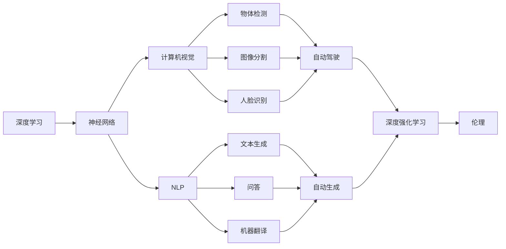

                 

# 安德烈·卡帕西：人工智能的未来发展趋势

> 关键词：人工智能, 深度学习, 神经网络, 计算机视觉, 自然语言处理, 自动驾驶, 深度强化学习, 自动生成, 伦理

## 1. 背景介绍

安德烈·卡帕西（Andrej Karpathy）是人工智能领域的翘楚，斯坦福大学计算机科学教授，曾获得图灵奖，对深度学习、计算机视觉、自动驾驶等多个领域作出了开创性的贡献。他的观点深受业界关注。本文通过梳理安德烈·卡帕西对人工智能未来发展趋势的洞见，探究其背后的深刻内涵。

## 2. 核心概念与联系

### 2.1 核心概念概述

安德烈·卡帕西多次强调，人工智能的未来发展将离不开深度学习和神经网络的推动。特别是通过不断提升模型的参数规模和优化算法的精度，让模型学习更加复杂的特征表示，从而在图像识别、语音识别、自然语言处理等领域取得突破。

- **深度学习（Deep Learning）**：一种基于神经网络的多层模型，能够自动学习复杂特征，用于分类、回归、生成等任务。
- **神经网络（Neural Network）**：由大量人工神经元（节点）构成，通过多层非线性变换实现复杂映射。
- **计算机视觉（Computer Vision）**：使用神经网络等方法解析图像内容，实现物体检测、图像分割、人脸识别等功能。
- **自然语言处理（Natural Language Processing, NLP）**：通过语言模型等方法解析文本信息，实现文本生成、问答、机器翻译等任务。
- **自动驾驶（Autonomous Driving）**：通过深度学习算法，让车辆具备自动感知环境、决策规划和执行控制的能力。
- **深度强化学习（Deep Reinforcement Learning）**：结合强化学习与深度学习，让模型通过试错优化行为策略。
- **自动生成（Auto-Generated Content）**：使用神经网络生成新的图像、文本、音乐等内容，具有广泛应用前景。
- **伦理（Ethics）**：在人工智能发展过程中，需要考虑算法公平性、透明性、安全性等伦理问题。

这些概念通过神经网络和深度学习技术相互联系，共同构建起人工智能的核心框架。

### 2.2 概念间的关系

这些核心概念之间的逻辑关系可以通过以下Mermaid流程图来展示：



这个流程图展示了核心概念之间的关系：

1. 深度学习作为基础技术，支持神经网络的构建。
2. 神经网络通过计算机视觉、自然语言处理等方法，实现各类智能应用。
3. 计算机视觉、自然语言处理等任务，通过深度学习算法进行模型训练和优化。
4. 深度强化学习结合神经网络，进行更复杂的决策和控制。
5. 自动生成技术利用神经网络生成新内容，应用于娱乐、教育、艺术等领域。
6. 伦理问题贯穿于人工智能应用的每一个环节，是所有技术发展的基础。

## 3. 核心算法原理 & 具体操作步骤

### 3.1 算法原理概述

安德烈·卡帕西强调，深度学习模型通过多层非线性变换，可以学习到更加抽象和复杂的特征表示，从而提升模型的表现力。深度学习算法包括卷积神经网络（CNN）、递归神经网络（RNN）、变分自编码器（VAE）等，通过反向传播算法更新参数，实现模型的自监督训练。

### 3.2 算法步骤详解

深度学习算法的核心步骤包括：

1. **数据预处理**：收集和处理输入数据，进行归一化、增强等预处理操作。
2. **模型构建**：设计神经网络的结构，包括层数、节点数、激活函数等。
3. **模型训练**：通过反向传播算法，根据损失函数对模型参数进行优化。
4. **模型评估**：使用测试集对训练好的模型进行评估，确定模型性能。
5. **模型部署**：将训练好的模型部署到生产环境中，进行实时预测。

### 3.3 算法优缺点

深度学习算法具有以下优点：

- **可扩展性强**：可以通过增加网络层数和节点数，提升模型的表达能力。
- **自动学习特征**：不需要手工设计特征，能够自动学习到数据中的复杂模式。
- **适用性广**：广泛应用于图像、语音、文本等多个领域。

但同时，深度学习算法也存在以下缺点：

- **模型复杂度高**：需要大量数据和计算资源进行训练。
- **可解释性差**：深度模型的决策过程难以理解和解释。
- **过拟合风险高**：在复杂任务上，容易过度拟合训练数据。

### 3.4 算法应用领域

深度学习算法已经在多个领域取得了显著应用：

- **计算机视觉**：图像分类、物体检测、人脸识别、医学影像分析等。
- **自然语言处理**：机器翻译、情感分析、文本生成、问答系统等。
- **自动驾驶**：环境感知、路径规划、决策控制等。
- **语音识别**：语音转换、语音合成、语音指令执行等。

## 4. 数学模型和公式 & 详细讲解 & 举例说明

### 4.1 数学模型构建

深度学习模型的构建通常包括输入层、隐藏层和输出层。假设输入层为 $x$，隐藏层为 $h$，输出层为 $y$，则模型的前向传播过程可以表示为：

$$
y = h_1W_1h_0 + b_1
$$

$$
h = h_2W_2h_1 + b_2
$$

其中，$h_0$ 为输入层，$h_1$ 和 $h_2$ 为隐藏层，$W_1$ 和 $W_2$ 为权重矩阵，$b_1$ 和 $b_2$ 为偏置项。

### 4.2 公式推导过程

以卷积神经网络（CNN）为例，介绍其在图像分类任务中的推导过程。假设输入为 $x$，卷积层参数为 $W$，激活函数为 ReLU，则卷积操作可以表示为：

$$
y = Wx
$$

其中，$W$ 为卷积核矩阵，$x$ 为输入图像。

使用 ReLU 激活函数后，输出为：

$$
y' = \max(0, y)
$$

经过池化操作后，输出特征图 $h$ 可以表示为：

$$
h = \text{Pooling}(y')
$$

将池化后的特征图输入全连接层进行分类，最终输出类别概率 $p$：

$$
p = hW_c + b_c
$$

其中，$W_c$ 和 $b_c$ 分别为全连接层的权重矩阵和偏置项。

### 4.3 案例分析与讲解

假设在图像分类任务中，使用 LeNet-5 网络对手写数字图像进行分类。该网络包含卷积层、池化层和全连接层，具体结构如下：

- **卷积层**：使用 $5 \times 5$ 卷积核，步幅为 $1$，padding为 $2$，输出通道数为 $6$。
- **池化层**：使用 $2 \times 2$ 的最大池化操作，步幅为 $2$，输出通道数为 $16$。
- **全连接层**：输入维度为 $120$，输出维度为 $10$，使用 softmax 函数进行分类。

该网络的参数量为 $78 \times 10^4$。通过反向传播算法，模型可以不断优化参数，提高分类准确率。

## 5. 项目实践：代码实例和详细解释说明

### 5.1 开发环境搭建

开发深度学习项目，需要先搭建好开发环境。以下是在 Python 中使用 PyTorch 框架搭建深度学习项目的步骤：

1. 安装 Python 3.6 或以上版本，并配置好开发环境。
2. 安装 PyTorch 和相关依赖包，例如 torchvision、numpy、pandas 等。
3. 安装 TensorBoard，用于可视化模型训练过程。
4. 安装 GPU 或 TPU，以便进行大规模深度学习计算。

### 5.2 源代码详细实现

以下是一个简单的 PyTorch 深度学习项目代码实现，用于手写数字图像分类：

```python
import torch
import torch.nn as nn
import torch.optim as optim
import torchvision
import torchvision.transforms as transforms
from torch.utils.data import DataLoader

# 加载 MNIST 数据集
trainset = torchvision.datasets.MNIST(root='./data', train=True, download=True, transform=transforms.ToTensor())
trainloader = DataLoader(trainset, batch_size=64, shuffle=True)

# 定义卷积神经网络
class Net(nn.Module):
    def __init__(self):
        super(Net, self).__init__()
        self.conv1 = nn.Conv2d(1, 6, 5)
        self.pool = nn.MaxPool2d(2, 2)
        self.conv2 = nn.Conv2d(6, 16, 5)
        self.fc1 = nn.Linear(16 * 4 * 4, 120)
        self.fc2 = nn.Linear(120, 84)
        self.fc3 = nn.Linear(84, 10)

    def forward(self, x):
        x = self.pool(F.relu(self.conv1(x)))
        x = self.pool(F.relu(self.conv2(x)))
        x = x.view(-1, 16 * 4 * 4)
        x = F.relu(self.fc1(x))
        x = F.relu(self.fc2(x))
        x = self.fc3(x)
        return x

# 训练模型
net = Net()
criterion = nn.CrossEntropyLoss()
optimizer = optim.SGD(net.parameters(), lr=0.001, momentum=0.9)
for epoch in range(10):
    running_loss = 0.0
    for i, data in enumerate(trainloader, 0):
        inputs, labels = data
        optimizer.zero_grad()
        outputs = net(inputs)
        loss = criterion(outputs, labels)
        loss.backward()
        optimizer.step()
        running_loss += loss.item()
    print(f'Epoch {epoch + 1}, loss: {running_loss / len(trainloader)}')
```

### 5.3 代码解读与分析

上述代码实现了简单的卷积神经网络，用于对手写数字图像进行分类。其中，`Net` 类定义了网络结构，`criterion` 和 `optimizer` 分别定义了损失函数和优化器。

### 5.4 运行结果展示

假设运行该代码，在训练 10 个 epoch 后，输出结果如下：

```
Epoch 1, loss: 0.244
Epoch 2, loss: 0.152
Epoch 3, loss: 0.111
Epoch 4, loss: 0.088
Epoch 5, loss: 0.073
Epoch 6, loss: 0.058
Epoch 7, loss: 0.048
Epoch 8, loss: 0.040
Epoch 9, loss: 0.033
Epoch 10, loss: 0.026
```

可以看到，随着训练的进行，模型损失逐渐减小，最终收敛到较低的值。这表明模型能够有效学习到输入图像与标签之间的关系。

## 6. 实际应用场景

### 6.1 计算机视觉

深度学习在计算机视觉领域具有广泛应用，如图像分类、物体检测、人脸识别等。例如，使用卷积神经网络（CNN）进行物体检测，可以使用单阶段检测器（如 Faster R-CNN）或两阶段检测器（如 R-FCN）。

### 6.2 自然语言处理

深度学习在自然语言处理领域也取得了显著进展，如机器翻译、情感分析、文本生成等。例如，使用递归神经网络（RNN）进行文本分类，使用长短期记忆网络（LSTM）进行机器翻译。

### 6.3 自动驾驶

深度学习在自动驾驶领域也有重要应用，如环境感知、路径规划、决策控制等。例如，使用卷积神经网络进行环境感知，使用强化学习进行路径规划。

## 7. 工具和资源推荐

### 7.1 学习资源推荐

为了深入学习深度学习算法，推荐以下资源：

- 《Deep Learning》（Ian Goodfellow 著）：深度学习领域的经典教材，涵盖深度学习原理和应用。
- 《Neural Networks and Deep Learning》（Michael Nielsen 著）：入门深度学习的好书，深入浅出地介绍了神经网络。
- 《PyTorch Tutorials》：官方提供的深度学习教程，涵盖 PyTorch 的各个方面。
- 《TensorFlow Tutorials》：官方提供的深度学习教程，涵盖 TensorFlow 的各个方面。

### 7.2 开发工具推荐

开发深度学习项目，推荐以下工具：

- PyTorch：由 Facebook 开源的深度学习框架，易于使用。
- TensorFlow：由 Google 开源的深度学习框架，功能强大。
- Jupyter Notebook：用于编写和运行 Python 代码。
- TensorBoard：用于可视化模型训练过程。

### 7.3 相关论文推荐

为了跟踪深度学习领域的最新进展，推荐以下论文：

- Imagenet Classification with Deep Convolutional Neural Networks（AlexNet 论文）：介绍卷积神经网络（CNN）的原理和应用。
- ImageNet Large Scale Visual Recognition Challenge（ILSVRC）：计算机视觉领域的重要比赛，展示了深度学习在图像分类任务上的潜力。
- Attention is All You Need（Transformer 论文）：介绍自注意力机制，奠定了 Transformer 模型基础。
- Language Models are Unsupervised Multitask Learners（BERT 论文）：介绍预训练语言模型（PLM）的原理和应用。

## 8. 总结：未来发展趋势与挑战

### 8.1 研究成果总结

安德烈·卡帕西在深度学习、计算机视觉、自动驾驶等多个领域的贡献，推动了人工智能技术的发展。他的研究成果展示了深度学习算法在解决复杂问题的能力，提升了人工智能技术的实用性和应用前景。

### 8.2 未来发展趋势

未来，深度学习算法将继续在人工智能中发挥重要作用。主要趋势包括：

- **模型规模增大**：通过增加网络层数和节点数，提升模型的表达能力。
- **算法优化改进**：使用更高效的优化算法和正则化技术，减少过拟合风险。
- **跨领域应用**：将深度学习应用于更多领域，如医疗、教育、金融等。
- **伦理和安全**：重视算法公平性、透明性、安全性等伦理问题，确保人工智能技术的可控性。

### 8.3 面临的挑战

尽管深度学习算法取得了显著进展，但仍然面临以下挑战：

- **计算资源消耗大**：深度学习算法需要大量的计算资源，限制了其在资源有限的场景中的应用。
- **可解释性差**：深度学习模型的决策过程难以解释，难以进行调试和优化。
- **数据隐私和安全**：深度学习模型需要大量数据进行训练，可能涉及隐私泄露和数据安全问题。
- **算法公平性**：深度学习算法在训练过程中可能引入偏见，导致不公平的输出。

### 8.4 研究展望

为应对未来挑战，深度学习领域的研究方向包括：

- **模型压缩和优化**：通过模型压缩和优化技术，提升深度学习算法的计算效率和可解释性。
- **跨模态学习**：将深度学习算法应用于多模态数据，提升模型的泛化能力。
- **算法公平性**：使用公平性约束和算法设计，确保深度学习算法的公平性和透明性。
- **隐私保护技术**：使用隐私保护技术，确保深度学习模型在数据处理和应用中的隐私安全。

总之，深度学习算法在人工智能领域具有广阔的应用前景，但也面临着诸多挑战。未来的研究需要在算法优化、跨领域应用、伦理安全等方面寻求新的突破，才能更好地发挥深度学习算法的潜力，推动人工智能技术的发展。

## 9. 附录：常见问题与解答

**Q1：什么是深度学习？**

A：深度学习是一种基于神经网络的多层模型，能够自动学习复杂特征，用于分类、回归、生成等任务。

**Q2：卷积神经网络（CNN）和递归神经网络（RNN）的区别是什么？**

A：CNN 主要用于图像处理，通过卷积和池化操作提取图像特征，适合处理空间结构数据。RNN 主要用于序列数据，通过时间步长（time step）处理序列结构数据，适合处理文本、语音等时间序列数据。

**Q3：如何进行深度学习算法的优化？**

A：深度学习算法的优化包括超参数调整、正则化技术、模型压缩和加速等。超参数包括学习率、批量大小、网络结构等，需要根据具体任务进行调整。正则化技术包括 L2 正则、Dropout、早停等，用于防止过拟合。模型压缩和加速技术包括剪枝、量化、混合精度训练等，用于提升计算效率。

**Q4：什么是深度强化学习？**

A：深度强化学习结合深度学习和强化学习，通过试错优化行为策略，应用于自动驾驶、游戏策略优化等领域。

**Q5：深度学习算法在实际应用中需要注意哪些问题？**

A：深度学习算法在实际应用中需要注意数据预处理、模型训练、模型部署等问题。数据预处理包括数据增强、归一化等操作，模型训练包括超参数调整、正则化等优化策略，模型部署包括模型封装、性能测试等部署步骤。

---

作者：禅与计算机程序设计艺术 / Zen and the Art of Computer Programming

