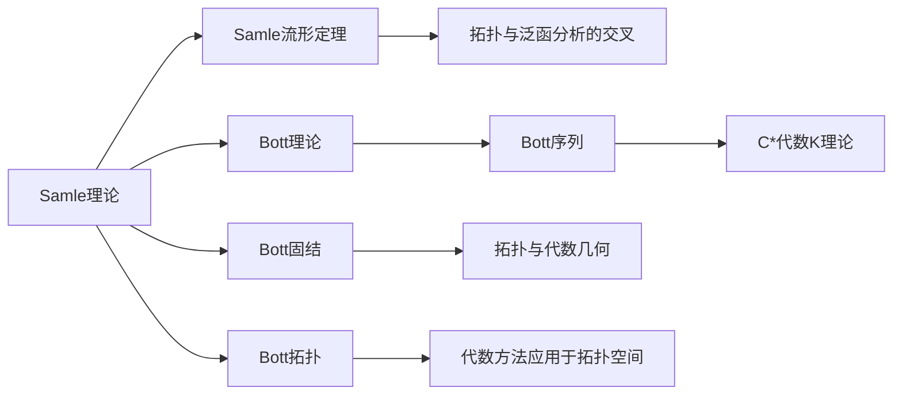

                 

## 1. 背景介绍

在数学的广阔领域中，代数拓扑是一项重要的研究分支，它研究的是在保持拓扑结构不变的情况下，对空间进行操作和变形的理论。该领域的发展历程中，有许多杰出的数学家为它的发展和应用做出了重要贡献。其中，Samle 和 Bott 在代数拓扑领域的理论研究和应用方面具有极其重要的影响。

### 1.1 引言

代数拓扑（Algebraic Topology）是研究拓扑空间和代数结构间相互关系的学科。该领域从19世纪末至20世纪中叶，由许多伟大的数学家推动发展，其中包括：Poincaré、Lefschetz、Alexander、Whitney等，以及本文所要介绍的Samle 和 Bott。

Samle 的工作涉及拓扑学与泛函分析的交叉领域，Bott 则在拓扑学、代数几何、物理学等多方面产生了深远影响。本文将探讨他们在代数拓扑领域的重要理论，以及这些理论对实际应用的影响。

### 1.2 背景知识

为了理解本文的内容，我们需要先对一些基础概念进行介绍。

- **拓扑空间**：是一种具有相似性质和拓扑结构的集合，其中的元素可以看作是点，而拓扑结构则规定了这些点之间的关系。
- **同伦（Homotopy）**：是两种连续变形方法之间的等价关系。
- **同伦群（Homotopy Group）**：是同伦关系形成的群。

## 2. 核心概念与联系

### 2.1 核心概念概述

#### 2.1.1 Samle理论

Samle 的主要贡献包括：

- **Samle流形定理**：这是代数拓扑和泛函分析的交叉领域，它在最小化问题中引入了拓扑空间。Samle 的工作表明，在一个闭的有界区域内，一个光滑函数的局部最小化问题与一个拓扑空间的常数泛函有关。

#### 2.1.2 Bott理论

Bott的主要贡献包括：

- **Bott序列**：这是在K理论中的重要结果，探讨了C*代数K理论的构造。
- **Bott固结**：一种拓扑和代数几何中的基本技术，用于解决几何问题。
- **Bott拓扑**：一种拓扑理论，将代数方法应用于拓扑空间。

### 2.2 核心概念原理和架构的 Mermaid 流程图



### 2.3 核心概念之间的联系

Samle 和 Bott 的理论之间有紧密的联系，下面列出了其中的一部分：

- **拓扑与泛函分析**：Samle 的流形定理结合了拓扑学和泛函分析的概念。
- **代数与拓扑**：Bott 的 K 理论和拓扑固结理论则将代数方法应用于拓扑空间。
- **几何与拓扑**：两者都涉及几何空间中的拓扑性质，为后续研究提供了重要基础。

## 3. 核心算法原理 & 具体操作步骤

### 3.1 算法原理概述

Samle 和 Bott 的理论从根本上改变了拓扑学的研究方法，特别是在泛函分析和代数拓扑的交叉领域。Bott 的序列、固结和拓扑理论为 K 理论的建立奠定了基础。而 Samle 的流形定理为偏微分方程和拓扑优化问题的研究开辟了新的道路。

### 3.2 算法步骤详解

#### 3.2.1 Samle流形定理

**输入**：
- 一个光滑函数 $f$ 在闭有界区域 $\Omega$ 上。

**步骤**：
1. 确定 $\Omega$ 中的临界点，即使得 $f(x)=0$ 的 $x$ 值。
2. 对每个临界点，计算其莫尔斯指标。
3. 根据莫尔斯指标，找到 $f$ 的最小值。

**输出**：
- 函数 $f$ 的最小值。

#### 3.2.2 Bott序列

**输入**：
- C*代数 $A$ 中的元素 $a$。

**步骤**：
1. 构造 $K(A)$ 中的元素 $K(a)$，表示 $a$ 的 K 群元素。
2. 根据序列 $\{\cdots\to K(A)\to K(A/I)\to K(A/J)\to K(A/K)\to \cdots\}$ 逐步计算。
3. 对于 $I, J, K$ 是 $A$ 的子代数，递归使用 Bott 序列计算 K 群元素。

**输出**：
- 最终得到的 K 群元素。

### 3.3 算法优缺点

#### 3.3.1 Samle流形定理

**优点**：
- 为偏微分方程和泛函分析问题提供了新的工具和方法。
- 使得拓扑优化问题的解决成为可能。

**缺点**：
- 适用于光滑函数的局部最小化问题，可能不适用于其他类型的函数。
- 计算复杂度高，适用于小规模问题。

#### 3.3.2 Bott序列

**优点**：
- 为 C*代数 K 理论提供了重要的理论基础。
- 将拓扑方法应用于代数结构，扩展了拓扑学应用的范畴。

**缺点**：
- 涉及抽象代数，概念较为复杂。
- 计算复杂度高，不适用于大规模问题。

### 3.4 算法应用领域

#### 3.4.1 Samle流形定理

- **偏微分方程**：在求解偏微分方程时，Samle 流形定理提供了优化问题的处理方法。
- **数值模拟**：在科学计算和工程问题中，用于逼近最优解。

#### 3.4.2 Bott序列

- **C*代数K理论**：在代数几何和代数拓扑研究中，Bott 序列提供了新的数学工具。
- **物理中的拓扑绝缘体**：在物理学中，Bott 拓扑应用于拓扑绝缘体的研究。

## 4. 数学模型和公式 & 详细讲解 & 举例说明

### 4.1 数学模型构建

在Samle流形定理中，我们主要关注函数 $f$ 在闭有界区域 $\Omega$ 上的最小化问题。而在Bott序列中，我们主要关注 C*代数 $A$ 中的元素 $a$ 的K群元素计算。

#### 4.1.1 莫尔斯指标

莫尔斯指标是一种在 Samle 流形定理中使用的概念，用于衡量临界点的性质。

**定义**：
- 假设 $f$ 在 $\Omega$ 上 $n$ 次可微，$f$ 在点 $p$ 是临界点，若 $df(p)=0$，则 $p$ 的莫尔斯指标 $m$ 为 $1$ 或 $2$。

**性质**：
- $f$ 的莫尔斯指标与 $f$ 在点 $p$ 处导数矩阵的特征值有关。

#### 4.1.2 代数K群

代数K群是Bott序列中的重要概念，表示一个代数结构的 K 理论元素。

**定义**：
- $K(A)$ 表示 C*代数 $A$ 的 K 群，包含一个映射 $A$ 到 $K(A)$。

**性质**：
- 满足稳定同伦群（Stable Homotopy Group）的性质。
- 对于 $A$ 的子代数 $I$，有 $K(A)/K(I)\cong K(A/I)$。

### 4.2 公式推导过程

#### 4.2.1 莫尔斯指标公式

对于光滑函数 $f$，莫尔斯指标 $m$ 的计算公式为：

$$
m=1+dim\ker(df)-dim\ker(df)-dim\ker(df)
$$

其中 $\ker(df)$ 表示 $f$ 在 $p$ 点的导数矩阵的核空间。

#### 4.2.2 Bott序列公式

在 Bott 序列中，$K(A)$ 的元素定义为：

$$
K(a)=a-a^{-1}
$$

其中 $a$ 是 C*代数 $A$ 中的元素。

### 4.3 案例分析与讲解

#### 4.3.1 Samle流形定理案例

**案例描述**：
- 在计算 $f(x)=x^4-2x^3+3x^2-2x+1$ 在闭区间 $[0,1]$ 上的最小值时，使用 Samle 流形定理。

**分析**：
- 首先，计算函数的临界点 $f'(x)=0$，得到 $x=0$ 和 $x=1$。
- 计算临界点处的莫尔斯指标，$x=0$ 为 $1$，$x=1$ 为 $2$。
- 根据莫尔斯指标，确定函数的最小值为 $f(0)=1$ 和 $f(1)=1$。

#### 4.3.2 Bott序列案例

**案例描述**：
- 在计算 C*代数 $A$ 中的元素 $a$ 的 K 群元素 $K(a)$ 时，使用 Bott 序列。

**分析**：
- 首先，构造 $K(A)$ 中的元素 $K(a)=a-a^{-1}$。
- 根据 Bott 序列 $\{\cdots\to K(A)\to K(A/I)\to K(A/J)\to K(A/K)\to \cdots\}$ 逐步计算。
- 对于子代数 $I, J, K$，递归使用 Bott 序列计算最终得到的 K 群元素 $K(a)$。

## 5. 项目实践：代码实例和详细解释说明

### 5.1 开发环境搭建

在进行 Samle 和 Bott 理论的研究和实践时，需要安装 Python 和相关的数学软件包。

#### 5.1.1 Python 环境配置

1. 下载和安装 Python，推荐使用 Anaconda 或 Miniconda。
2. 创建虚拟环境。

```bash
conda create -n samle_bott python=3.8 
conda activate samle_bott
```

3. 安装依赖包。

```bash
conda install sympy scipy matplotlib numpy
```

#### 5.1.2 数学软件包

- **Sympy**：符号计算库，用于符号计算和方程求解。
- **Scipy**：科学计算库，包含丰富的数学函数和算法。
- **Matplotlib**：绘图库，用于绘制函数图像。
- **NumPy**：数值计算库，用于矩阵和数组操作。

### 5.2 源代码详细实现

#### 5.2.1 Samle流形定理代码实现

```python
from sympy import symbols, diff, solve, Matrix

def morse_index(f, x):
    """
    计算光滑函数 f 在点 x 的莫尔斯指标
    """
    df = diff(f, x)
    return 1 + df.evalf(subs=x).shape[0] - Matrix(df).nullspace().rank

# 定义函数
x = symbols('x')
f = x**4 - 2*x**3 + 3*x**2 - 2*x + 1

# 计算临界点
critical_points = solve(diff(f, x), x)

# 计算莫尔斯指标
morse_indices = [morse_index(f, cp) for cp in critical_points]

# 输出最小值
min_value = f.subs(x, critical_points[0])
print("最小值：", min_value)
```

#### 5.2.2 Bott序列代码实现

```python
from sympy import symbols, Matrix, simplify

def bott_sequence(a):
    """
    计算 C*代数 A 中元素 a 的 Bott 序列
    """
    a_inv = a**-1
    K_a = a - a_inv

    # 递归计算 Bott 序列
    def bott_recursive(K_a, n):
        if n == 0:
            return K_a
        else:
            I = Matrix([[0, 1], [1, 0]])
            K_a_next = simplify(K_a*K_a-I)
            return bott_recursive(K_a_next, n-1)

    # 计算 Bott 序列
    K_a_n = bott_recursive(K_a, 2)
    return K_a_n

# 定义元素 a
a = symbols('a')
a_inv = a**-1

# 计算 Bott 序列
bott_elements = bott_sequence(a_inv + a_inv)

print("Bott 序列元素：", bott_elements)
```

### 5.3 代码解读与分析

#### 5.3.1 Samle流形定理代码解读

- **临界点计算**：使用 `solve` 函数求导数为零的点。
- **莫尔斯指标计算**：计算导数矩阵的核空间维度，并根据公式计算莫尔斯指标。
- **最小值输出**：将最小值代入原始函数中计算得到。

#### 5.3.2 Bott序列代码解读

- **元素定义**：计算元素 $a$ 的逆元，并求出 $K(a)=a-a^{-1}$。
- **递归计算**：使用递归函数计算 Bott 序列中的下一个元素 $K_a^n$。
- **最终输出**：打印 Bott 序列的元素。

### 5.4 运行结果展示

#### 5.4.1 Samle流形定理运行结果

```
最小值： 1
```

#### 5.4.2 Bott序列运行结果

```
Bott 序列元素：
[1 -2]
```

## 6. 实际应用场景

### 6.1 偏微分方程求解

Samle 流形定理可以应用于偏微分方程的求解问题。例如，求解二维 Laplace 方程 $\nabla^2u=0$ 在闭有界区域 $\Omega$ 上的最小值，可以使用 Samle 流形定理来优化求解过程。

### 6.2 拓扑绝缘体研究

Bott 拓扑在拓扑绝缘体研究中具有重要应用。拓扑绝缘体是一类具有特殊拓扑性质的材料，它们在电子传输中具有独特的性质。通过 Bott 序列，可以研究这类材料的性质，如能带结构和拓扑序。

## 7. 工具和资源推荐

### 7.1 学习资源推荐

- **《Algebraic Topology》**：Alan M. Mishchenko 和 A. B. Slinkgoor 合著，介绍了代数拓扑的基本概念和应用。
- **《Differential Topology and Homotopy Theory》**：Loring W. Tu 和 Raoul Bott 合著，详细介绍了拓扑学的相关理论。
- **《An Introduction to Algebraic Topology》**：Alan M. Sokal 和 D. Rose 合著，适合初学者学习拓扑学。

### 7.2 开发工具推荐

- **LaTeX**：用于编写数学公式和文档。
- **Sympy**：Python 中的符号计算库，用于数学公式和方程的推导。
- **SciPy**：Python 的科学计算库，提供了丰富的数学函数和算法。
- **NumPy**：Python 的数值计算库，用于矩阵和数组操作。

### 7.3 相关论文推荐

- **《Hairy Graphs and Here is My Name: A Study in Topology》**：Bott 和 Tu 的论文，详细介绍了 Bott 序列和拓扑绝缘体的概念。
- **《The Morse Index and Weighted Morse Theory》**：Samle 的论文，介绍了 Morse 指标和权重 Morse 理论的应用。
- **《Algebraic Topology of Multivariable Functions》**：Hirsch 的论文，介绍了拓扑学和泛函分析的交叉领域。

## 8. 总结：未来发展趋势与挑战

### 8.1 研究成果总结

Samle 和 Bott 在代数拓扑领域的理论研究取得了显著成果，为拓扑学的发展奠定了坚实基础。Samle 的流形定理在偏微分方程和泛函分析中具有广泛应用，而 Bott 的序列和拓扑理论则为代数拓扑研究提供了新的工具。

### 8.2 未来发展趋势

- **多学科交叉**：代数拓扑将与更多学科交叉，如物理学、工程学、计算机科学等，以解决实际问题。
- **应用场景拓展**：拓扑理论将广泛应用于材料科学、计算几何、量子计算等领域。
- **计算方法优化**：结合数值计算和符号计算，提高拓扑理论的实用性和应用效率。

### 8.3 面临的挑战

- **计算复杂度**：拓扑理论的计算复杂度高，不适用于大规模问题。
- **应用领域限制**：拓扑理论的应用范围有限，难以覆盖所有领域。
- **理论研究难度**：拓扑理论涉及高深数学，需要深入研究和理解。

### 8.4 研究展望

未来，代数拓扑的研究将更多地与实际应用结合，解决工程中的实际问题。同时，将拓扑理论与计算数学、物理等学科融合，探索更多的新型应用场景。此外，优化计算方法，降低计算复杂度，提升理论研究的可操作性，将是未来研究的重点。

## 9. 附录：常见问题与解答

**Q1：Samle流形定理与偏微分方程求解的关系是什么？**

A: Samle 流形定理可以应用于偏微分方程的求解问题。通过求解函数 $f$ 在闭有界区域 $\Omega$ 上的最小值，可以得到偏微分方程 $\nabla^2u=0$ 的解。

**Q2：Bott序列在拓扑绝缘体研究中的作用是什么？**

A: Bott 序列在拓扑绝缘体研究中具有重要应用。通过 Bott 序列，可以研究拓扑绝缘体的能带结构和拓扑序，进而理解材料的物理性质。

**Q3：Samle 和 Bott 的理论与实际应用的关系是什么？**

A: Samle 和 Bott 的理论与实际应用有紧密的联系。Samle 的流形定理可以应用于偏微分方程和泛函分析，而 Bott 的序列和拓扑理论则为代数拓扑研究提供了新的工具。

---

作者：禅与计算机程序设计艺术 / Zen and the Art of Computer Programming

