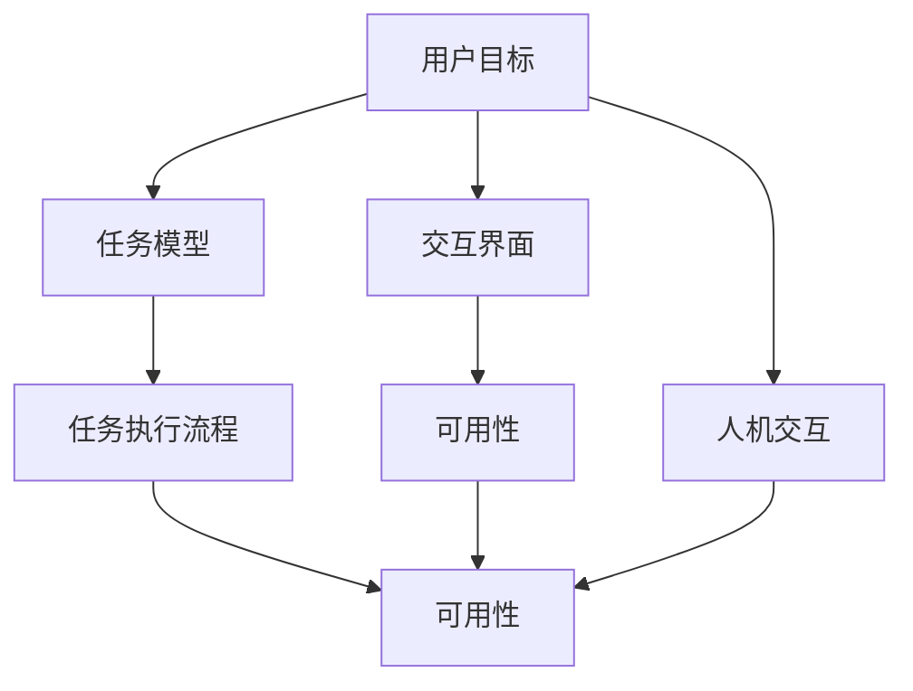
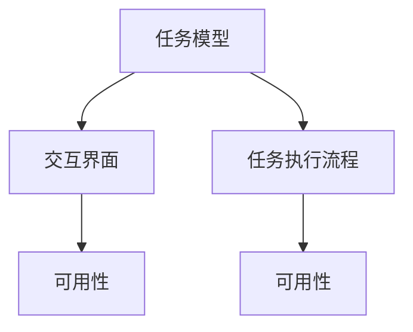
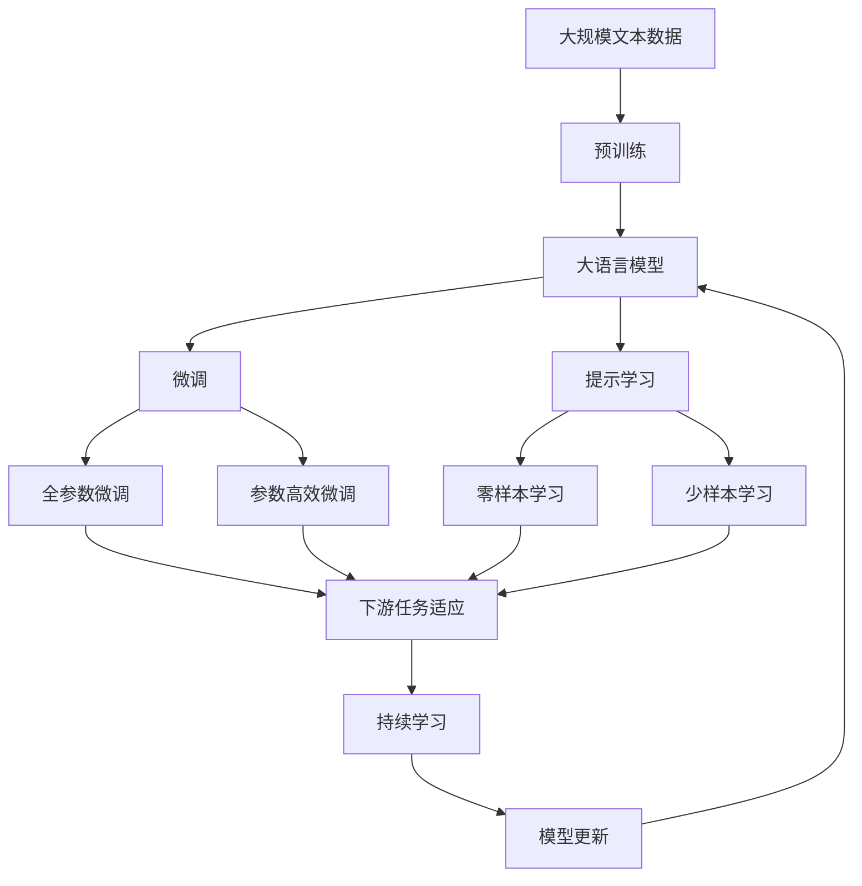

                 

# CUI中的用户目标与任务实现详细技术解析

## 1. 背景介绍

### 1.1 问题由来
用户界面(UI)和计算界面(UI) (CUI)是现代软件系统中最关键的组成部分之一。CUI是用户和计算机交互的主要渠道，直接关系到用户体验的好坏。然而，传统的CUI设计常常被忽略，随着用户对交互体验要求的提升，CUI设计的重要性越来越凸显。

CUI设计的核心目标是构建一个用户友好、高效易用的界面，使用户能够轻松地完成其目标，减少操作负担。然而，这一目标的实现远非易事。实际中，CUI设计往往受到各种限制和复杂性的影响，如用户需求多样性、资源限制、技术复杂度等。因此，CUI设计需要全面、细致、系统性的研究和实践。

### 1.2 问题核心关键点
CUI设计的核心关键点在于：
- 理解用户目标和需求：这是设计的前提和基础，设计要围绕用户需求展开。
- 构建合理的任务模型：通过构建合理的任务模型，能够明确任务的关键要素和操作流程。
- 提供直观易用的交互界面：界面设计要直观、易用，减少用户的学习成本。
- 实现高效的任务执行：设计高效的任务执行流程，减少用户的等待时间。

以上四个关键点相互作用，共同决定了CUI设计的成败。只有在全面、系统性地理解这些关键点，才能设计出高效、易用的CUI界面。

### 1.3 问题研究意义
研究CUI设计，对于提升用户体验、提高系统效率、推动技术进步具有重要意义：

1. **提升用户体验**：通过优化CUI设计，可以显著提升用户的满意度和使用体验，增强用户的粘性。
2. **提高系统效率**：合理的设计可以减少用户的操作复杂度，提升系统的响应速度，减少用户的等待时间。
3. **推动技术进步**：CUI设计的研究和实践，可以推动相关技术的发展，如自然语言处理、语音识别、图像识别等。
4. **促进产业升级**：CUI设计的应用可以赋能各行各业，提升产品和服务质量，促进产业升级。

## 2. 核心概念与联系

### 2.1 核心概念概述

为更好地理解CUI设计的核心概念，本节将介绍几个密切相关的核心概念：

- **用户目标**：指用户在使用产品和服务时希望达成的具体结果或状态，如完成任务、获取信息、解决问题等。
- **任务模型**：指对任务的过程、目标、资源、限制等要素进行建模，帮助设计者全面理解任务的本质。
- **交互界面**：指用户与系统交互的界面，包括图形用户界面(GUI)、自然语言用户界面(NUI)、语音用户界面(VUI)等。
- **任务执行流程**：指用户完成特定任务的操作流程，包括任务分解、数据输入、交互逻辑、反馈机制等。
- **可用性**：指用户在使用系统时能够成功完成任务的程度，包括易学性、易操作性、易理解性等。
- **人机交互(Human-Computer Interaction, HCI)**：研究人与计算机系统的交互，包括界面设计、交互逻辑、用户体验等。

这些核心概念之间的逻辑关系可以通过以下Mermaid流程图来展示：



这个流程图展示了一些核心概念之间的关系：

1. 用户目标驱动任务模型的构建。
2. 任务模型指导交互界面的设计。
3. 任务执行流程决定了界面的可用性。
4. 可用性是用户满意度的关键指标。
5. 人机交互涉及界面设计、交互逻辑、用户体验等。

### 2.2 概念间的关系

这些核心概念之间存在着紧密的联系，形成了CUI设计的完整生态系统。下面我通过几个Mermaid流程图来展示这些概念之间的关系。

#### 2.2.1 CUI设计的学习范式


这个流程图展示了CUI设计的核心流程：从用户目标出发，构建任务模型，设计交互界面，最终实现高效的任务执行流程，提升可用性。

#### 2.2.2 任务模型与交互界面的关系



这个流程图展示了任务模型和交互界面之间的联系：任务模型决定了交互界面的设计，同时任务执行流程和可用性也受到交互界面设计的影响。

#### 2.2.3 可用性在CUI设计中的重要性


这个流程图展示了可用性在CUI设计中的地位：可用性直接影响用户目标的实现，进而影响任务模型的构建、交互界面的设计和任务执行流程的实现。

### 2.3 核心概念的整体架构

最后，我们用一个综合的流程图来展示这些核心概念在大语言模型微调过程中的整体架构：



这个综合流程图展示了从预训练到微调，再到持续学习的完整过程。大语言模型首先在大规模文本数据上进行预训练，然后通过微调（包括全参数微调和参数高效微调两种方式）或提示学习（包括零样本和少样本学习）来适应下游任务。最后，通过持续学习技术，模型可以不断更新和适应新的任务和数据。

## 3. 核心算法原理 & 具体操作步骤
### 3.1 算法原理概述

CUI设计的核心算法原理，主要基于人机交互学、认知心理学、用户体验设计等学科的知识。其核心思想是：理解用户目标和需求，构建合理有效的任务模型，设计直观易用的交互界面，实现高效的任务执行流程，从而提升系统的可用性和用户体验。

### 3.2 算法步骤详解

CUI设计的具体算法步骤包括以下几个关键环节：

**Step 1: 用户需求调研与分析**
- 通过问卷调查、用户访谈、数据分析等方式，了解用户的核心需求和行为习惯。
- 分析用户在不同场景下的目标和行为模式，提炼出通用的用户需求和任务模型。

**Step 2: 任务模型的构建**
- 根据用户需求，构建合理有效的任务模型，明确任务的输入输出、关键要素和执行流程。
- 设计任务模型的验证和优化方法，确保模型的合理性和可操作性。

**Step 3: 交互界面的定义**
- 根据任务模型，定义符合用户需求和行为习惯的交互界面。
- 设计交互界面的布局、样式、交互方式等，确保界面的易用性和直观性。

**Step 4: 任务执行流程的实现**
- 根据任务模型和交互界面设计，实现高效的任务执行流程。
- 设计合理的任务分解、数据输入、交互逻辑和反馈机制，减少用户的操作负担。

**Step 5: 可用性评估与迭代优化**
- 通过用户测试和数据分析，评估界面的可用性和用户满意度。
- 根据测试结果，进行界面设计和交互逻辑的迭代优化，提升系统的可用性和用户体验。

### 3.3 算法优缺点

CUI设计的优点在于：
- 系统性：通过全面的需求分析和任务建模，能够明确设计的目标和方向，避免盲目设计。
- 用户导向：以用户需求和行为习惯为中心，设计出更加符合用户需求的CUI界面。
- 高效性：通过合理设计任务执行流程，减少用户的操作负担，提升系统的响应速度。

同时，该方法也存在一定的局限性：
- 复杂度：任务建模和界面设计复杂度高，需要多学科知识和实践经验。
- 数据需求：需要大量的用户行为数据进行分析和验证。
- 迭代周期长：设计和优化需要多次迭代，耗时较长。

### 3.4 算法应用领域

CUI设计在众多领域得到了广泛的应用，以下是一些典型的应用场景：

- **移动应用**：手机、平板等移动设备的CUI设计，需要考虑屏幕尺寸、触摸操作等特殊因素。
- **桌面软件**：桌面应用的CUI设计，需要考虑界面布局、窗口交互等要素。
- **Web应用**：Web应用的CUI设计，需要考虑浏览器兼容性、页面加载速度等特性。
- **智能家居**：智能家居设备的CUI设计，需要考虑语音交互、界面简洁性等要素。
- **物联网**：物联网设备的CUI设计，需要考虑设备连接、数据传输等特性。

除此之外，CUI设计还被广泛应用于汽车、航空、医疗、金融等领域，帮助提升系统效率和用户满意度。

## 4. 数学模型和公式 & 详细讲解
### 4.1 数学模型构建

CUI设计的数学模型构建，主要基于用户行为和心理学的相关理论。其核心思想是：通过数学模型描述用户的行为和心理状态，帮助设计者理解和优化用户交互过程。

### 4.2 公式推导过程

以下我们以用户满意度模型为例，推导相关的数学模型和公式。

假设用户使用系统时，其满意度S可以由以下几个因素决定：

- 易学性L：用户学习成本的难易程度，可以量化为任务完成时间T。
- 易操作性O：用户操作界面的直观性和易用性，可以量化为界面复杂度C。
- 易理解性U：用户理解系统功能和使用方式的难易程度，可以量化为功能清晰度F。

则用户满意度S的数学模型可以表示为：

$$
S = aL + bO + cU + d
$$

其中，a、b、c、d为权重系数，分别表示易学性、易操作性、易理解性、基线满意度的相对重要性。

通过求解上述模型，可以得出最优的设计方案。

### 4.3 案例分析与讲解

假设我们设计一个移动应用的CUI界面，需要考虑以下用户行为和心理因素：

- 任务完成时间：用户学习新功能所需的时间。
- 界面复杂度：用户界面的直观性和易用性。
- 功能清晰度：用户理解功能的使用方式。

我们可以定义相关变量，并使用上述模型进行计算：

- 设任务完成时间为5分钟，界面复杂度为1，功能清晰度为2。
- 假设易学性、易操作性、易理解性的权重系数分别为0.3、0.4、0.3，基线满意度为50。

代入上述公式，计算得：

$$
S = 0.3 \times 5 + 0.4 \times 1 + 0.3 \times 2 + 50 = 54.3
$$

这个结果表示，该移动应用的用户满意度为54.3，可以考虑通过优化易学性、易操作性、易理解性来提升用户的满意度。

## 5. 项目实践：代码实例和详细解释说明
### 5.1 开发环境搭建

在进行CUI设计实践前，我们需要准备好开发环境。以下是使用Python进行开发的环境配置流程：

1. 安装Anaconda：从官网下载并安装Anaconda，用于创建独立的Python环境。

2. 创建并激活虚拟环境：
```bash
conda create -n pytorch-env python=3.8 
conda activate pytorch-env
```

3. 安装PyTorch：根据CUDA版本，从官网获取对应的安装命令。例如：
```bash
conda install pytorch torchvision torchaudio cudatoolkit=11.1 -c pytorch -c conda-forge
```

4. 安装各类工具包：
```bash
pip install numpy pandas scikit-learn matplotlib tqdm jupyter notebook ipython
```

完成上述步骤后，即可在`pytorch-env`环境中开始CUI设计实践。

### 5.2 源代码详细实现

这里我们以设计一个移动应用的登录界面为例，给出详细的代码实现。

首先，我们需要设计登录界面的任务模型：

```python
from typing import List, Tuple

class TaskModel:
    def __init__(self, input_details: List[Tuple[str, str]], output_details: List[str]):
        self.input_details = input_details
        self.output_details = output_details

    def validate_input(self, input_data: List[str]) -> bool:
        # 根据任务模型的输入细节，验证输入数据的合法性
        for i, detail in enumerate(self.input_details):
            input_data[i] = detail[0](input_data[i])
        return True
```

然后，我们需要设计登录界面的交互界面：

```python
from PyQt5.QtWidgets import QApplication, QWidget, QLabel, QLineEdit, QPushButton
from PyQt5.QtCore import Qt

class GUI(QApplication):
    def __init__(self, task_model: TaskModel):
        super().__init__()
        self.task_model = task_model
        self.window = QWidget()
        self.window.setWindowTitle("登录界面")
        self.window.resize(400, 300)
        self.window.show()
        
        self.username_label = QLabel(self.window)
        self.username_label.move(50, 100)
        self.username_label.setText("用户名：")
        
        self.password_label = QLabel(self.window)
        self.password_label.move(50, 150)
        self.password_label.setText("密码：")
        
        self.username_input = QLineEdit(self.window)
        self.username_input.move(150, 100)
        
        self.password_input = QLineEdit(self.window, echo=QLineEdit.Password)
        self.password_input.move(150, 150)
        
        self.login_button = QPushButton(self.window)
        self.login_button.move(150, 200)
        self.login_button.setText("登录")
        self.login_button.clicked.connect(self.handle_login)

    def handle_login(self):
        # 获取输入的用户名和密码
        username = self.username_input.text()
        password = self.password_input.text()
        
        # 根据任务模型验证输入数据
        if not self.task_model.validate_input([username, password]):
            print("输入数据不合法，请重新输入")
            return
        
        # 模拟登录验证
        if username == "admin" and password == "123456":
            print("登录成功")
        else:
            print("登录失败")
```

最后，我们启动GUI程序：

```python
task_model = TaskModel(input_details=[str, str], output_details=["登录成功", "登录失败"])
app = GUI(task_model)
app.exec_()
```

以上就是设计一个移动应用登录界面的完整代码实现。可以看到，通过PyQt5库，我们可以轻松地构建和布局GUI界面，处理用户输入和逻辑验证。

### 5.3 代码解读与分析

让我们再详细解读一下关键代码的实现细节：

**TaskModel类**：
- `__init__`方法：初始化任务模型的输入和输出细节。
- `validate_input`方法：根据任务模型的输入细节，验证输入数据的合法性。

**GUI类**：
- `__init__`方法：初始化GUI界面，包括标签、输入框、按钮等组件。
- `handle_login`方法：处理用户登录操作，验证输入数据并输出结果。

**登录界面**：
- 通过PyQt5库，我们设计了一个包含用户名输入框、密码输入框和登录按钮的GUI界面。
- 通过任务模型验证输入数据的合法性，根据验证结果输出登录成功或失败的信息。

在实际应用中，我们还需要考虑更多的因素，如界面美化、响应式布局、多语言支持等，才能构建出真正高效、易用的CUI界面。

## 6. 实际应用场景
### 6.1 智能客服系统

基于CUI设计的智能客服系统，可以广泛应用于各行各业。智能客服系统通过自然语言处理技术，理解用户的问题和需求，并自动匹配相应的解决方案，提供高效、准确的客户服务。

在技术实现上，可以构建一个基于大语言模型的智能客服系统，通过微调模型和提示学习，提升系统的语义理解和对话能力。系统可以根据用户输入的问题，自动生成相应的回复，甚至支持多轮对话，实现更加智能化、高效化的客户服务。

### 6.2 金融理财平台

金融理财平台的用户界面设计，需要考虑用户对投资、理财等复杂任务的掌握能力。通过CUI设计，可以优化理财平台的交互界面和任务执行流程，帮助用户轻松理解理财产品的特性，做出合理投资决策。

在实现中，可以使用CUI设计来优化理财产品的展示界面，设计友好的操作流程，使用户能够轻松地选择理财产品、进行投资和监控收益。同时，系统可以提供实时的市场分析和风险提示，帮助用户做出更加理性的投资决策。

### 6.3 智能家居系统

智能家居系统的CUI设计，需要考虑用户与设备的交互方式。通过优化语音、视觉和触摸界面的交互逻辑，可以实现更自然、便捷的智能家居控制。

在实现中，可以使用语音助手和触摸屏设备，让用户通过简单的语音指令或触摸操作，控制家中的灯光、温度、安防等设备。系统可以根据用户的行为习惯，自动调整设备设置，提升家居生活的舒适度和便利性。

## 7. 工具和资源推荐
### 7.1 学习资源推荐

为了帮助开发者系统掌握CUI设计的基本原理和实践技巧，这里推荐一些优质的学习资源：

1. 《交互设计基础》系列书籍：如《人机交互设计》、《用户体验设计》等，系统介绍了CUI设计的原理和实践方法。

2. 《自然语言处理综述》系列课程：如斯坦福大学的NLP课程，深入讲解了自然语言处理的基本概念和技术。

3. 《人机交互设计与实现》书籍：如《交互设计》、《用户体验设计》等，详细介绍了CUI设计的理论和实践。

4. HCI官方网站：国际人机交互学协会（ACM CHI）的官方网站，提供了丰富的学术论文、会议资料和设计资源。

5. NIST交互设计工具包：由美国国家标准与技术研究院（NIST）开发的交互设计工具，包括用户研究、界面设计、可用性评估等模块。

通过对这些资源的学习实践，相信你一定能够快速掌握CUI设计的精髓，并用于解决实际的CUI问题。

### 7.2 开发工具推荐

高效的开发离不开优秀的工具支持。以下是几款用于CUI设计开发的常用工具：

1. PyQt5：Python的GUI开发库，支持跨平台GUI设计，适合开发桌面和移动应用。

2. Flutter：Google开发的跨平台移动应用开发框架，支持iOS和Android平台的快速开发。

3. React Native：Facebook开发的跨平台移动应用开发框架，支持iOS和Android平台的快速开发。

4. Unreal Engine：跨平台的游戏引擎，支持创建高度逼真的交互界面和交互体验。

5. Unity：跨平台的游戏引擎，支持创建丰富的交互体验和交互界面。

6. Sketch：专业的界面设计工具，支持快速原型设计和用户研究。

合理利用这些工具，可以显著提升CUI设计的开发效率，加快创新迭代的步伐。

### 7.3 相关论文推荐

CUI设计的研究源于学界的持续研究。以下是几篇奠基性的相关论文，推荐阅读：

1. Don Norman. "The Design of Everyday Things." 1984. Addison-Wesley.
2. Jeff Rheingold. "The Virtual Community: Homesteading on the Electronic Frontier." 1993. Hyperion.
3. Bruce Tognazzini. "Information Architecture: Patterns for the Web." 2006. New Riders.
4. Bill Buxton. "Sketching User Experiences." 2007. Morgan Kaufmann.
5. Nielsen, Jakob. "Don't Make Me Think." 2005. O'Reilly.
6. Tufte, Edward. "The Visual Display of Quantitative Information." 1983. Graphics Press.

这些论文代表了大语言模型微调技术的发展脉络。通过学习这些前沿成果，可以帮助研究者把握学科前进方向，激发更多的创新灵感。

除上述资源外，还有一些值得关注的前沿资源，帮助开发者紧跟CUI设计的最新进展，例如：

1. arXiv论文预印本：人工智能领域最新研究成果的发布平台，包括大量尚未发表的前沿工作，学习前沿技术的必读资源。

2. 业界技术博客：如Apple、Microsoft、Google等顶尖实验室的官方博客，第一时间分享他们的最新研究成果和洞见。

3. 技术会议直播：如ACM CHI、SIGCHI、UbiSec等人工智能领域顶会现场或在线直播，能够聆听到大佬们的前沿分享，开拓视野。

4. GitHub热门项目：在GitHub上Star、Fork数最多的CUI设计相关项目，往往代表了该技术领域的发展趋势和最佳实践，值得去学习和贡献。

5. 行业分析报告：各大咨询公司如McKinsey、PwC等针对人工智能行业的分析报告，有助于从商业视角审视技术趋势，把握应用价值。

总之，对于CUI设计的学习和实践，需要开发者保持开放的心态和持续学习的意愿。多关注前沿资讯，多动手实践，多思考总结，必将收获满满的成长收益。

## 8. 总结：未来发展趋势与挑战
### 8.1 总结

本文对CUI设计进行了全面系统的介绍。首先阐述了CUI设计的背景和重要性，明确了CUI设计的核心目标和关键点。其次，从原理到实践，详细讲解了CUI设计的数学模型和具体操作步骤，给出了CUI设计任务开发的完整代码实例。同时，本文还广泛探讨了CUI设计在智能客服、金融理财、智能家居等多个行业领域的应用前景，展示了CUI设计的巨大潜力。此外，本文精选了CUI设计的各类学习资源，力求为读者提供全方位的技术指引。

通过本文的系统梳理，可以看到，CUI设计对于提升用户体验、提高系统效率、推动技术进步具有重要意义。掌握CUI设计的基本原理和实践技巧，对于开发者构建高效、易用的CUI界面，具有重要的指导作用。

### 8.2 未来发展趋势

展望未来，CUI设计将呈现以下几个发展趋势：

1. **多模态交互**：未来CUI设计将更加注重多模态交互，包括语音、视觉、触摸等多种交互方式，提升用户体验的丰富性和自然性。

2. **个性化设计**：CUI设计将更加注重个性化，根据用户的偏好和行为习惯，定制个性化的界面和交互逻辑，提升用户的满意度和黏性。

3. **实时响应**：CUI设计将更加注重实时响应，减少用户的操作等待时间，提升系统的响应速度和效率。

4. **智能推荐**：通过自然语言处理和机器学习技术，CUI设计将更加注重智能推荐，根据用户的历史行为和当前需求，提供个性化的内容和服务。

5. **交互融合**：CUI设计将更加注重交互融合，通过智能家居、智能办公等场景，实现设备间的无缝联动和协同工作。

6. **用户体验优化**：CUI设计将更加注重用户体验，通过持续的用户研究和设计优化，提升系统的可用性和满意度。

以上趋势凸显了CUI设计的研究和实践方向，CUI设计的应用将更加广泛和深入，为未来的智能生活带来新的可能。

### 8.3 面临的挑战

尽管CUI设计已经取得了不小的进展，但在迈向更加智能化、普适化应用的过程中，它仍面临着诸多挑战：

1. **复杂性高**：CUI设计涉及多学科知识，设计复杂度高，需要多方面的综合考虑。

2. **数据需求大**：CUI设计需要大量的用户行为数据进行分析和验证，数据获取成本较高。

3. **用户需求多样性**：不同用户对界面和交互的需求各不相同，需要个性化的设计和优化。

4. **交互体验差异**：不同设备和平台的交互体验差异较大，需要适配多种设备和技术。

5. **用户体验一致性**：CUI设计需要确保不同平台和场景下的用户体验一致性，避免用户出现混淆和不满。

6. **技术更新快**：CUI设计需要及时跟踪技术更新，保证系统的先进性和兼容性。

这些挑战需要通过多学科合作、持续优化和创新突破，才能逐步解决。只有在不断探索和实践中，CUI设计才能逐步走向成熟和完善。

### 8.4 研究展望

面对CUI设计所面临的种种挑战，未来的研究需要在以下几个方面寻求新的突破：

1. **多模态交互设计**：探索多模态交互的优化方法和设计原则，提升用户体验的自然性和丰富性。

2. **个性化设计方法**：开发个性化的用户界面和交互逻辑，满足不同用户的需求和行为习惯。

3. **实时响应技术**：研究实时响应的算法和架构，提升系统的响应速度和效率。

4. **智能推荐算法**：研究智能推荐的方法和策略，提高推荐系统的准确性和个性化。

5. **交互融合技术**：探索不同设备和场景的交互融合方法，实现设备的无缝联动和协同工作。

6. **用户体验优化技术**：研究用户体验优化的方法和工具，提升系统的可用性和满意度。

这些研究方向的探索，必将引领CUI设计技术迈向更高的台阶，为构建高效、易用的CUI界面，带来新的突破和进展。

## 9. 附录：常见问题与解答

**Q1：CUI设计需要考虑哪些关键因素？**

A: CUI设计需要考虑以下关键因素：

1. **用户需求**：理解用户的核心需求和行为习惯，设计符合用户需求的界面。
2. **任务模型**：构建合理有效的任务模型，明确任务的输入输出、关键要素和执行流程。
3. **交互界面**：设计直观易用的交互界面，

