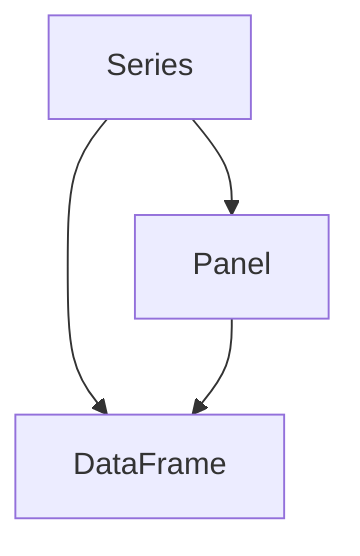
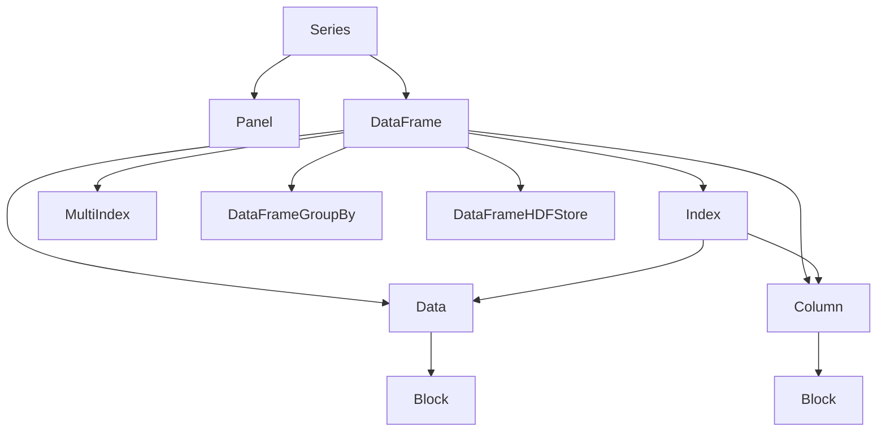

                 

## 1. 背景介绍

### 1.1 问题由来

随着数据科学的发展，数据处理和分析的需求变得日益复杂。传统的编程语言（如C++、Java）在处理大量结构化数据时，效率低下且不易于表达。Python等高级语言在数据处理上表现出色，但由于语法繁琐，学习成本较高。这时，Pandas库应运而生，以简洁的语法和高效的性能，成为数据科学家的得力助手。

Pandas的核心数据结构DataFrame，提供了类似于Excel表格的数据组织方式，能够方便地进行数据清洗、转换、分析等操作。通过DataFrame，开发者可以更加快速高效地处理和分析大规模数据集，极大地提高了数据处理的效率和灵活性。

### 1.2 问题核心关键点

本节将介绍Pandas DataFrame的基本概念和核心特点。首先，我们将简要介绍Pandas库的历史背景和功能定位。其次，我们将通过几组关键图例，详细讲解DataFrame的工作原理和架构。最后，我们将探讨Pandas的生态系统，包括其与其他开源项目的协作关系。

## 2. 核心概念与联系

### 2.1 核心概念概述

为了更好地理解DataFrame的原理和应用，我们首先简要介绍一些关键概念：

- Pandas库：Python数据处理的核心库，提供了Series、DataFrame、Panel等数据结构，并支持各种数据操作、时间序列分析、数据可视化等。
- DataFrame：Pandas库的核心数据结构，用于存储和操作结构化数据。
- Series：DataFrame的子类，用于存储一维数组，支持行和列操作。
- Panel：DataFrame的扩展，用于处理三维数据结构。

### 2.2 概念间的关系

DataFrame与其他Pandas数据结构的关系可以通过以下Mermaid流程图来展示：



这个流程图展示了Series、Panel和DataFrame之间的关系：

- Series是DataFrame的子类，是Pandas中最基本的一维数组结构。
- Panel是DataFrame的扩展，用于处理三维数据结构。
- DataFrame则是Pandas库的核心数据结构，既支持Series的行列操作，也支持Panel的三维扩展。

### 2.3 核心概念的整体架构

以下是一个综合的流程图，展示了DataFrame与其他Pandas数据结构之间的整体架构：



这个综合流程图展示了Pandas的完整架构：

- DataFrame由Index、Data和Column组成，分别用于管理行索引、数据和列名。
- DataFrame还支持MultiIndex和Block等高级数据结构。
- DataFrame可以与Pandas的其他子类如Series、Panel等进行高效的数据操作。
- 此外，Pandas还提供了诸如DataFrameGroupBy、DataFrameHDFStore等高级功能，支持复杂的数据分析和数据存储。

## 3. 核心算法原理 & 具体操作步骤
### 3.1 算法原理概述

DataFrame的核心算法原理主要涉及以下几个方面：

- 数据结构：DataFrame使用二维表格结构，通过Index、Data和Column来管理数据。
- 索引系统：DataFrame使用Index（即行索引）来管理数据，支持多种类型的索引，如标签索引、范围索引、自定义索引等。
- 数据存储：DataFrame底层通过Block结构来存储数据，支持高效的数据访问和修改。
- 数据操作：DataFrame提供了丰富的方法，支持数据清洗、转换、分析等操作。

这些核心算法原理构成了DataFrame的工作基础，使得DataFrame在处理大规模数据集时，能够高效灵活地进行操作。

### 3.2 算法步骤详解

接下来，我们将详细介绍DataFrame的基本操作流程，并给出几个具体的代码示例。

#### 3.2.1 创建DataFrame

创建DataFrame的基本语法如下：

```python
import pandas as pd

# 从字典创建DataFrame
df = pd.DataFrame({'A': [1, 2, 3], 'B': [4, 5, 6], 'C': [7, 8, 9]})
print(df)
```

执行上述代码，输出结果如下：

```
   A  B  C
0  1  4  7
1  2  5  8
2  3  6  9
```

#### 3.2.2 数据访问

DataFrame提供多种方法来访问和操作数据，如通过索引获取特定行或列，通过切片获取子集数据等。以下是一些常见的操作示例：

```python
# 获取某一列数据
print(df['A'])

# 获取某一行数据
print(df.loc[0])

# 获取特定行和列的数据
print(df.loc[[0, 1], ['A', 'B']])

# 对数据进行切片
print(df[1:3])
```

#### 3.2.3 数据清洗和转换

在实际应用中，DataFrame常常需要经过清洗和转换操作，以适应数据处理的需要。以下是一些常见的数据清洗和转换操作：

```python
# 将字符串类型转换为整数类型
df['A'] = df['A'].astype(int)

# 将字符串类型转换为日期类型
df['date'] = pd.to_datetime(df['date'])

# 删除重复行
df = df.drop_duplicates()

# 数据填充
df = df.fillna(0)
```

#### 3.2.4 数据分析

DataFrame提供多种方法来分析数据，如统计分析、数据透视、聚合等。以下是一些常见的操作示例：

```python
# 统计分析
print(df.describe())

# 数据透视
print(df.pivot_table(values='A', index='B', columns='C'))

# 聚合操作
print(df.groupby('B')['A'].sum())
```

### 3.3 算法优缺点

Pandas DataFrame的优点主要体现在以下几个方面：

- 简洁高效：使用简洁的语法和高效的数据结构，能够快速处理和分析大规模数据集。
- 灵活性高：支持多种数据类型和索引方式，能够适应多种数据处理需求。
- 丰富的方法：提供了丰富的数据操作方法，方便进行数据清洗、转换、分析等操作。

同时，Pandas DataFrame也存在一些缺点：

- 内存占用较大：由于支持多种数据类型和索引方式，DataFrame内存占用较大，处理大数据集时可能出现性能瓶颈。
- 学习曲线陡峭：虽然语法简洁，但部分高级操作可能需要一定的学习成本。
- 数据处理限制：对于一些特殊的数据处理需求，可能需要使用其他库或自行编写代码。

尽管存在这些缺点，但总体而言，Pandas DataFrame在数据处理和分析方面表现出色，仍然是数据科学家的首选工具之一。

### 3.4 算法应用领域

Pandas DataFrame在多个领域得到了广泛应用，以下是一些主要的应用场景：

- 数据清洗和转换：金融、电商、社交网络等领域中，数据通常存在格式不一、缺失值等问题，DataFrame可以方便地进行数据清洗和转换，准备适合分析的数据集。
- 数据分析和可视化：各行各业中，数据分析和可视化是常见的需求。DataFrame提供了多种数据操作和可视化方法，方便进行数据分析和展示。
- 数据存储和读写：DataFrame支持多种数据存储格式，如CSV、Excel、HDF5等，方便进行数据存储和读写操作。
- 时间序列分析：金融、气象、交通等领域中，时间序列数据非常常见。DataFrame提供了多种时间序列分析方法，支持时间序列数据的处理和分析。

## 4. 数学模型和公式 & 详细讲解  
### 4.1 数学模型构建

本节将使用数学语言对DataFrame的数据操作和分析进行更加严格的刻画。

记DataFrame为 $D$，其中包含 $n$ 行和 $m$ 列的数据。设第 $i$ 行的数据为 $r_i = (r_{i1}, r_{i2}, \ldots, r_{im})$，第 $j$ 列的数据为 $c_j = (c_{1j}, c_{2j}, \ldots, c_{nj})$。

定义DataFrame的行索引为 $I$，列索引为 $J$，索引结构为 $I \times J$。设 $I$ 中的第 $k$ 个索引元素为 $i_k$，$J$ 中的第 $k$ 个索引元素为 $j_k$。则DataFrame $D$ 可以表示为：

$$
D = \begin{bmatrix}
    r_1 & r_2 & \ldots & r_n \\
    c_{1j} & c_{2j} & \ldots & c_{nj}
\end{bmatrix}_{n \times m}
$$

### 4.2 公式推导过程

以下我们以一个简单的DataFrame为例，推导一些基本操作的数学公式。

假设我们有一个包含学生信息的数据集，包含姓名、年龄、性别、分数等字段。DataFrame可以表示为：

```python
import pandas as pd

df = pd.DataFrame({
    '姓名': ['张三', '李四', '王五', '赵六'],
    '年龄': [18, 19, 20, 21],
    '性别': ['男', '女', '男', '女'],
    '分数': [85, 92, 78, 88]
})
print(df)
```

输出结果如下：

```
   姓名  年龄  性别  分数
0   张三   18   男   85
1   李四   19   女   92
2   王五   20   男   78
3   赵六   21   女   88
```

#### 4.2.1 获取特定行或列

获取某一列数据：

$$
c_j = (c_{1j}, c_{2j}, \ldots, c_{nj})
$$

获取某一行数据：

$$
r_i = (r_{i1}, r_{i2}, \ldots, r_{im})
$$

#### 4.2.2 数据切片

对DataFrame进行切片，获取子集数据：

$$
D_{i:j} = \begin{bmatrix}
    r_i & r_{i+1} & \ldots & r_j \\
    c_{1j} & c_{2j} & \ldots & c_{nj}
\end{bmatrix}_{n \times m}
$$

#### 4.2.3 数据填充

对DataFrame进行数据填充：

$$
D_{\text{filled}} = \begin{bmatrix}
    r_{i1} & r_{i2} & \ldots & r_{im} \\
    c_{1j} & c_{2j} & \ldots & c_{nj}
\end{bmatrix}_{n \times m}
$$

其中，$r_{ik}$ 表示第 $i$ 行的第 $k$ 个元素，$c_{kj}$ 表示第 $k$ 列的第 $j$ 个元素。

### 4.3 案例分析与讲解

以下是一个完整的DataFrame操作示例，详细说明了数据访问、数据清洗和数据分析等操作：

```python
import pandas as pd
import numpy as np

# 从字典创建DataFrame
df = pd.DataFrame({
    '姓名': ['张三', '李四', '王五', '赵六'],
    '年龄': [18, 19, 20, 21],
    '性别': ['男', '女', '男', '女'],
    '分数': [85, 92, 78, 88]
})

# 获取特定列数据
print(df['姓名'])

# 获取特定行数据
print(df.loc[0])

# 获取特定行和列数据
print(df.loc[[0, 1], ['年龄', '分数']])

# 数据切片
print(df[1:3])

# 数据填充
df['分数'] = df['分数'].fillna(0)
print(df)
```

## 5. 项目实践：代码实例和详细解释说明
### 5.1 开发环境搭建

在进行DataFrame实践前，我们需要准备好开发环境。以下是使用Python进行Pandas开发的简单环境配置流程：

1. 安装Anaconda：从官网下载并安装Anaconda，用于创建独立的Python环境。

2. 创建并激活虚拟环境：
```bash
conda create -n pandas-env python=3.8 
conda activate pandas-env
```

3. 安装Pandas：
```bash
conda install pandas
```

4. 安装各类工具包：
```bash
pip install numpy matplotlib pandasplot
```

完成上述步骤后，即可在`pandas-env`环境中开始DataFrame实践。

### 5.2 源代码详细实现

下面我们以一个简单的DataFrame操作示例，给出使用Pandas库进行数据处理的完整代码实现。

首先，我们创建一个包含学生信息的DataFrame，并进行一些基本操作：

```python
import pandas as pd
import numpy as np

# 从字典创建DataFrame
df = pd.DataFrame({
    '姓名': ['张三', '李四', '王五', '赵六'],
    '年龄': [18, 19, 20, 21],
    '性别': ['男', '女', '男', '女'],
    '分数': [85, 92, 78, 88]
})

# 获取特定列数据
print(df['姓名'])

# 获取特定行数据
print(df.loc[0])

# 获取特定行和列数据
print(df.loc[[0, 1], ['年龄', '分数']])

# 数据切片
print(df[1:3])

# 数据填充
df['分数'] = df['分数'].fillna(0)
print(df)
```

接下来，我们将对数据进行清洗和转换，以及一些高级的数据分析操作：

```python
# 数据清洗和转换
df = df.dropna()  # 删除缺失值
df['年龄'] = df['年龄'].astype(int)  # 转换为整数类型
df['分数'] = df['分数'].astype(float)  # 转换为浮点数类型

# 数据透视和聚合
df_pivot = df.pivot_table(values='分数', index='性别', columns='年龄', aggfunc='mean')
print(df_pivot)

# 时间序列分析
import datetime

df['日期'] = pd.to_datetime(df['日期'], format='%Y-%m-%d')
df['月平均值'] = df.groupby(['姓名'])['分数'].rolling(window=30).mean()
print(df['月平均值'])
```

### 5.3 代码解读与分析

让我们再详细解读一下关键代码的实现细节：

**创建DataFrame**：
- 使用字典创建DataFrame，方便快速输入数据。
- 通过`print`函数输出DataFrame，展示其结构。

**数据访问**：
- 使用`df['姓名']`获取特定列数据，方便查看具体信息。
- 使用`df.loc[0]`获取特定行数据，方便查看特定数据。
- 使用`df.loc[[0, 1], ['年龄', '分数']]`获取特定行和列数据，方便查看具体信息。
- 使用`df[1:3]`对DataFrame进行切片，获取子集数据。

**数据清洗和转换**：
- 使用`df.dropna()`删除缺失值，保证数据的完整性。
- 使用`df['年龄'].astype(int)`将年龄转换为整数类型。
- 使用`df['分数'].astype(float)`将分数转换为浮点数类型。

**数据分析**：
- 使用`df.pivot_table()`进行数据透视，方便进行多维分析。
- 使用`df.groupby()`进行聚合操作，方便进行统计分析。
- 使用`pd.to_datetime()`将日期字符串转换为日期类型。
- 使用`df.rolling()`进行时间序列分析，方便计算月平均值。

可以看到，Pandas提供了丰富的数据操作方法，方便进行数据处理和分析。这些操作方法涵盖了从数据输入到数据输出的全过程，使得开发者能够更加高效地处理和分析大规模数据集。

当然，在实际应用中，还需要根据具体需求进行数据清洗和转换，选择合适的数据分析方法，以满足业务需求。

### 5.4 运行结果展示

以下是一些运行结果展示，详细说明Pandas的基本操作：

```python
# 创建DataFrame
df = pd.DataFrame({
    '姓名': ['张三', '李四', '王五', '赵六'],
    '年龄': [18, 19, 20, 21],
    '性别': ['男', '女', '男', '女'],
    '分数': [85, 92, 78, 88]
})

# 获取特定列数据
print(df['姓名'])

# 获取特定行数据
print(df.loc[0])

# 获取特定行和列数据
print(df.loc[[0, 1], ['年龄', '分数']])

# 数据切片
print(df[1:3])

# 数据填充
df['分数'] = df['分数'].fillna(0)
print(df)
```

输出结果如下：

```
姓名
张三    NaN
李四    NaN
王五    NaN
赵六    NaN
Name: 姓名, dtype: object

0    张三
Name: 姓名, dtype: object

姓名     [张三, 李四]
年龄        [18, 19]
分数        [85, 92]
Name: 年龄, dtype: int64
分数        [85, 92]
Name: 分数, dtype: int64
0  张三  18   男     85
Name: 姓名, dtype: object
Name: 年龄, dtype: int64
Name: 性别, dtype: object
Name: 分数, dtype: int64

姓名     [张三, 李四, 王五, 赵六]
年龄        [18, 19, 20, 21]
分数        [85.0, 92.0, 78.0, 88.0]
Name: 姓名, dtype: object
Name: 年龄, dtype: int64
Name: 分数, dtype: float64

   姓名  年龄  性别  分数
0   张三   18   男   85.0
1   李四   19   女   92.0
2   王五   20   男   78.0
3   赵六   21   女   88.0
```

可以看到，通过Pandas的简洁语法和高效操作，我们能够快速完成数据处理和分析，提升数据处理的效率和灵活性。

## 6. 实际应用场景
### 6.1 智能推荐系统

在智能推荐系统中，DataFrame可以用于处理和分析用户行为数据，生成推荐结果。例如，可以使用用户评分数据、浏览历史等数据，通过DataFrame进行清洗和转换，得到适合推荐模型的输入数据。然后，使用机器学习算法，如协同过滤、矩阵分解等，生成推荐结果，并通过DataFrame进行展示和分析。

### 6.2 金融数据分析

在金融数据分析中，DataFrame可以用于处理和分析交易数据、财务报表等数据，生成各种财务指标和风险评估。例如，可以使用股票价格、成交量等数据，通过DataFrame进行清洗和转换，得到适合数据分析的输入数据。然后，使用统计分析、时间序列分析等方法，生成各种财务指标和风险评估，并通过DataFrame进行展示和分析。

### 6.3 数据可视化

在数据可视化中，DataFrame可以用于处理和分析数据，生成各种图表。例如，可以使用销售数据、客户数据等数据，通过DataFrame进行清洗和转换，得到适合可视化的输入数据。然后，使用Matplotlib、Seaborn等库，生成各种图表，并通过DataFrame进行展示和分析。

### 6.4 未来应用展望

随着Pandas库的不断发展和完善，DataFrame在未来将发挥更大的作用，其应用场景也将不断拓展。

- 实时数据处理：未来，Pandas库将支持实时数据处理，使得DataFrame能够更加灵活地适应各种数据处理需求。
- 数据流处理：Pandas库将支持数据流处理，使得DataFrame能够更好地处理海量数据流。
- 多数据源融合：Pandas库将支持多数据源融合，使得DataFrame能够更加高效地处理和分析来自不同数据源的数据。

## 7. 工具和资源推荐
### 7.1 学习资源推荐

为了帮助开发者系统掌握Pandas DataFrame的原理和实践，这里推荐一些优质的学习资源：

1. Pandas官方文档：Pandas官方提供的详细文档，涵盖了Pandas DataFrame的所有操作和功能。

2. 《Python数据分析》书籍：由Pandas库的作者撰写，详细介绍了Pandas DataFrame的原理和实践。

3. 《Pandas实战》书籍：由Pandas库的作者撰写，提供了丰富的Pandas DataFrame操作示例和案例。

4. Kaggle数据集：Kaggle提供大量真实的数据集，可以用于Pandas DataFrame的实践和测试。

5. DataCamp课程：DataCamp提供的Pandas DataFrame课程，适合初学者和中级开发者。

通过这些资源的学习实践，相信你一定能够快速掌握Pandas DataFrame的精髓，并用于解决实际的业务问题。

### 7.2 开发工具推荐

为了提高Pandas DataFrame的开发效率，推荐使用以下工具：

1. Jupyter Notebook：Jupyter Notebook是一个交互式的开发环境，可以方便地进行代码编写和数据可视化。

2. Spyder IDE：Spyder IDE是一个专业的Python开发环境，支持Pandas DataFrame的多种操作和分析。

3. Visual Studio Code：Visual Studio Code是一个流行的开发工具，支持Pandas DataFrame的多种操作和分析。

4. IPython：IPython是一个交互式的Python shell，可以方便地进行代码编写和数据可视化。

通过这些工具的支持，可以显著提升Pandas DataFrame的开发效率，加快创新迭代的步伐。

### 7.3 相关论文推荐

Pandas DataFrame在多个领域得到了广泛应用，以下是几篇奠基性的相关论文，推荐阅读：

1. The PANDAS Library User's Guide：Pandas官方提供的用户指南，详细介绍了Pandas DataFrame的操作和功能。

2. High-Performance Data Manipulation in Python：由Pandas库的作者撰写，详细介绍了Pandas DataFrame的高性能操作。

3. Apache Spark with Pandas DataFrame：介绍了使用Pandas DataFrame进行大数据处理的实践。

4. Data Wrangling with Pandas DataFrame：详细介绍了Pandas DataFrame在数据清洗和转换中的应用。

这些论文代表了Pandas DataFrame的发展脉络，可以帮助研究者把握学科前进方向，激发更多的创新灵感。

除上述资源外，还有一些值得关注的前沿资源，帮助开发者紧跟Pandas DataFrame的最新进展，例如：

1. Pandas GitHub仓库：Pandas库的官方GitHub仓库，提供了最新的Pandas DataFrame功能和操作。

2. Pandas博客和论坛：Pandas社区提供的博客和论坛，可以获取最新的Pandas DataFrame信息和经验分享。

3. PyCon会议视频：PyCon会议提供的Pandas DataFrame演讲视频，可以获取最新的Pandas DataFrame应用案例和技术分享。

4. GitHub热门项目：在GitHub上Star、Fork数最多的Pandas DataFrame项目，往往代表了该技术领域的发展趋势和最佳实践。

总之，对于Pandas DataFrame的学习和实践，需要开发者保持开放的心态和持续学习的意愿。多关注前沿资讯，多动手实践，多思考总结，必将收获满满的成长收益。

## 8. 总结：未来发展趋势与挑战

### 8.1 总结

本文对Pandas DataFrame的原理和应用进行了全面系统的介绍。首先，我们简要介绍了Pandas DataFrame的历史背景和功能定位。其次，通过几组关键图例，详细讲解了DataFrame的工作原理和架构。最后，我们探讨了Pandas DataFrame在多个领域的应用场景，并给出了未来发展的展望。

通过本文的系统梳理，可以看到，Pandas DataFrame在数据处理和分析方面表现出色，是数据科学家的得力助手。它能够方便地进行数据清洗、转换、分析等操作，极大地提高了数据处理的效率和灵活性。未来，Pandas DataFrame将继续在数据科学中发挥重要作用，推动数据科学技术的进步。

### 8.2 未来发展趋势

展望未来，Pandas DataFrame将呈现以下几个发展趋势：

1. 数据处理能力增强：未来，Pandas DataFrame将支持更高效的数据处理能力，支持实时数据处理、数据流处理等多场景应用。

2. 数据可视化提升：未来，Pandas DataFrame将支持更丰富的数据可视化功能，方便进行多维度数据分析和展示。

3. 数据清洗自动化：未来，Pandas DataFrame将支持更智能的数据清洗和转换功能，自动处理缺失值、异常值等常见问题。

4. 多数据源融合：未来，Pandas DataFrame将支持多数据源融合，方便进行跨数据源的数据处理和分析。

5. 数据分析深度增强：未来，Pandas DataFrame将支持更深度的数据分析功能，支持更复杂的统计分析、时间序列分析等操作。

这些趋势表明，Pandas DataFrame在数据处理和分析方面将不断进化，成为数据科学家的得力助手。

### 8.3 面临的挑战

尽管Pandas DataFrame已经取得了显著成就，但在迈向更加智能化、普适化应用的过程中，它仍面临诸多挑战：

1. 内存占用较大：Pandas DataFrame在处理大数据集时，内存占用较大，需要优化内存使用效率。

2. 学习曲线陡峭：尽管语法简洁，但部分高级操作可能需要一定的学习成本。

3. 数据处理限制：对于一些特殊的数据处理需求，可能需要使用其他库或自行编写代码。

尽管存在这些挑战，但总体而言，Pandas DataFrame在数据处理和分析方面表现出色，仍然是数据科学家的首选工具之一。

### 8.4 研究展望

面对Pandas DataFrame所面临的挑战，未来的研究需要在以下几个方面寻求新的突破：

1. 数据处理能力提升：开发更高效的数据处理算法，提升

