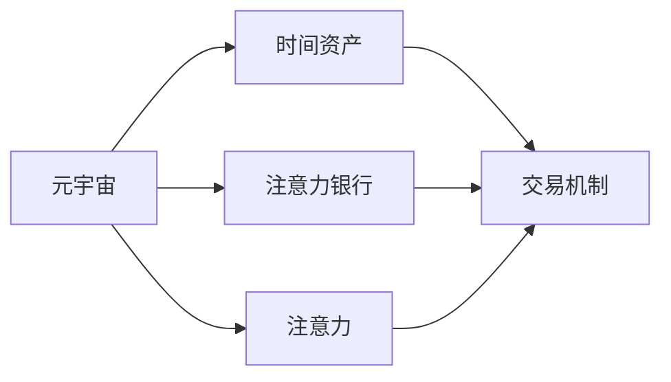

                 

# 注意力银行：元宇宙中的时间价值交易

在数字化时代，时间正逐渐成为一种无形资产，其价值在元宇宙中体现得淋漓尽致。本文将探索元宇宙中时间价值的交易机制，并提出一种基于注意力机制的“注意力银行”概念，以期为元宇宙中的时间价值管理提供一种新的思路。

## 1. 背景介绍

### 1.1 问题由来

随着数字技术的不断发展，人们的工作和生活方式正在发生根本性的变化。传统意义上，时间是一种难以直接交易的资源，但在元宇宙中，时间可以转化为数字资产，通过各种方式进行交换和交易。这种转变不仅带来新的经济模式，也为元宇宙的发展提供了新的动力。然而，如何高效、公平、透明地管理和交易时间资产，成为当前的一大挑战。

### 1.2 问题核心关键点

时间作为元宇宙中的关键资源，其管理与交易机制的设计需要考虑以下几个核心问题：

1. **时间资产的划分与计量**：如何定义元宇宙中的时间单位，如何将时间转换为可交易的数字资产？
2. **时间价值评估与定价**：时间价值如何量化，如何根据需求与供给进行定价？
3. **时间资产的交易机制**：如何设计交易规则，确保交易的公正性与效率？
4. **时间资产的存储与保护**：如何安全存储时间资产，避免资产流失？
5. **时间资产的社会影响**：时间资产的交易如何影响社会经济结构与伦理道德？

### 1.3 问题研究意义

在元宇宙中，时间资产的管理与交易机制不仅关乎经济利益，更影响到社会文化的演变。通过有效的机制设计，可以激励用户积极参与元宇宙活动，促进资源的合理分配，提升社会整体福利。

## 2. 核心概念与联系

### 2.1 核心概念概述

为了更好地理解元宇宙中时间价值的交易机制，本文将介绍几个关键概念：

- **元宇宙（Metaverse）**：通过虚拟现实、增强现实等技术构建的沉浸式数字世界，用户可以在其中进行交互、交流、创造。
- **时间资产（Time Asset）**：元宇宙中用户投入时间所获得的一系列权益，如游戏经验值、虚拟物品等。
- **注意力银行（Attention Bank）**：一种基于用户注意力（Attention）的交易机制，用于管理元宇宙中的时间资产。
- **注意力（Attention）**：用户在元宇宙中的行为、兴趣、关注点等，反映了用户的时间价值。
- **交易机制（Transaction Mechanism）**：通过一定的规则和算法，实现时间资产的买入、卖出、兑换等操作。

这些概念共同构成了元宇宙中时间价值交易的核心框架，将帮助用户更有效地管理和利用时间资产。

### 2.2 概念间的关系

这些核心概念之间的逻辑关系可以通过以下Mermaid流程图来展示：



这个流程图展示了元宇宙、时间资产、注意力银行、注意力与交易机制之间的相互关系：

1. 元宇宙为时间资产的生成提供了环境。
2. 注意力银行通过用户注意力的积累和交易，管理时间资产。
3. 注意力反映了用户的时间价值，是交易机制的基础。
4. 交易机制确保时间资产的合理交易，实现时间价值的最大化。

通过理解这些概念的关系，我们可以更好地把握元宇宙中时间价值交易的本质。

## 3. 核心算法原理 & 具体操作步骤
### 3.1 算法原理概述

基于注意力的“注意力银行”算法，本质上是一种分布式的时间价值管理系统。其核心思想是通过用户的注意力行为，对时间资产进行量化和交易。算法原理如下：

1. **用户行为记录与统计**：将用户在元宇宙中的行为数据记录下来，包括浏览时长、互动次数、消费金额等，并对其进行统计分析，得到用户的注意力值。
2. **注意力值量化**：将用户的注意力值转换为时间资产，用于交易。
3. **交易规则设计**：制定交易规则，包括买入、卖出、兑换等操作，确保交易的公正性与效率。
4. **资产存储与保护**：设计安全机制，保护时间资产不受损失。

### 3.2 算法步骤详解

基于注意力的“注意力银行”算法主要包括以下几个步骤：

1. **行为数据收集**：
   - 使用SDK记录用户在元宇宙中的行为数据，包括游戏时间、互动次数、购买行为等。
   - 数据存储在本地数据库或云数据库中，定期进行清理和整理。

2. **注意力值计算**：
   - 根据行为数据，计算用户的注意力值。常见的计算方法包括统计游戏时长、互动频率、消费金额等。
   - 设计注意力值的比例因子，确保注意力值能够反映用户的时间价值。

3. **时间资产转换**：
   - 将注意力值转换为时间资产，存储在区块链上。
   - 设计时间资产的单位和价格，确保用户能够清晰理解并接受。

4. **交易规则制定**：
   - 制定交易规则，包括买入、卖出、兑换等操作。例如，用户可以将时间资产兑换成虚拟货币或现实货币，也可以将其用于购买虚拟物品或服务。
   - 设计交易手续费、交易限额等规则，确保交易的公平性和效率。

5. **安全机制设计**：
   - 使用加密技术保护时间资产的安全性，防止资产流失。
   - 设计多层次的安全防护机制，包括身份验证、交易审计等。

### 3.3 算法优缺点

基于注意力的“注意力银行”算法具有以下优点：

1. **简单易行**：算法原理简单，易于实现和维护。
2. **用户参与度高**：通过游戏时间、互动次数等行为数据的记录和统计，激励用户积极参与元宇宙活动。
3. **时间价值透明化**：用户的注意力值和行为记录透明公开，便于用户理解和监督。

同时，该算法也存在以下缺点：

1. **数据隐私问题**：行为数据的记录和存储涉及用户隐私，需要严格保护。
2. **算力消耗较大**：需要定期对行为数据进行统计和分析，算力消耗较大。
3. **市场风险**：时间资产的价格波动较大，存在市场风险。
4. **系统复杂性**：交易规则和安全性设计较为复杂，需要综合考虑多方面因素。

### 3.4 算法应用领域

基于注意力的“注意力银行”算法主要应用于以下领域：

1. **元宇宙游戏**：记录玩家的游戏时间、互动次数等行为数据，用于游戏奖励和交易。
2. **虚拟社交平台**：统计用户在平台上的互动次数、消费金额等，用于社交奖励和交易。
3. **虚拟现实体验**：记录用户的VR体验时长、交互行为等，用于体验积分和交易。
4. **虚拟地产市场**：记录用户在虚拟地产市场中的交易行为，用于虚拟货币和资产交易。

## 4. 数学模型和公式 & 详细讲解 & 举例说明

### 4.1 数学模型构建

设用户在元宇宙中的行为数据为 $D$，包括游戏时间 $T$、互动次数 $I$、消费金额 $C$ 等。注意力值 $A$ 可以通过以下公式计算：

$$
A = f(T, I, C)
$$

其中，$f$ 为计算注意力值的函数，可以根据具体场景进行设计。例如，可以将游戏时间、互动次数和消费金额分别赋予不同的权重，计算加权和：

$$
A = \alpha T + \beta I + \gamma C
$$

时间资产 $V$ 可以按照以下公式转换为虚拟货币：

$$
V = \lambda A
$$

其中，$\lambda$ 为时间资产转换比例因子。

### 4.2 公式推导过程

以游戏时间为例，推导注意力值的计算过程：

1. 首先，将用户的游戏时间 $T$ 划分为多个时间片，每个时间片的长度为 $t$。
2. 对于每个时间片，计算用户在该时间片内的互动次数 $I_i$ 和消费金额 $C_i$。
3. 对每个时间片的互动次数和消费金额进行加权，计算注意力值：

$$
A_i = \alpha T_i + \beta I_i + \gamma C_i
$$

其中，$\alpha$、$\beta$、$\gamma$ 为加权系数。

4. 将所有时间片的注意力值进行累加，得到总注意力值 $A$：

$$
A = \sum_i A_i
$$

5. 将总注意力值转换为时间资产 $V$：

$$
V = \lambda A
$$

### 4.3 案例分析与讲解

假设用户在元宇宙游戏平台上的行为数据如下：

- 游戏时间 $T = 50$ 小时
- 互动次数 $I = 500$ 次
- 消费金额 $C = 1000$ 美元

如果加权系数 $\alpha = 0.5$，$\beta = 0.3$，$\gamma = 0.2$，则注意力值 $A$ 计算如下：

$$
A = 0.5 \times 50 + 0.3 \times 500 + 0.2 \times 1000 = 1300
$$

如果时间资产转换比例因子 $\lambda = 0.01$，则时间资产 $V$ 为：

$$
V = 0.01 \times 1300 = 13
$$

## 5. 项目实践：代码实例和详细解释说明

### 5.1 开发环境搭建

为了实现基于注意力的“注意力银行”算法，我们需要搭建开发环境。以下是使用Python进行开发的环境配置流程：

1. 安装Anaconda：从官网下载并安装Anaconda，用于创建独立的Python环境。

2. 创建并激活虚拟环境：
```bash
conda create -n attention-bank python=3.8 
conda activate attention-bank
```

3. 安装必要的Python库：
```bash
pip install numpy pandas matplotlib scikit-learn torch transformers
```

4. 搭建区块链平台：选择如Ethereum、Binance Smart Chain等，搭建元宇宙平台所需的区块链环境。

5. 安装Web3.py：用于与区块链平台交互。

完成上述步骤后，即可在`attention-bank`环境中开始项目实践。

### 5.2 源代码详细实现

下面以元宇宙游戏为例，给出使用Python实现“注意力银行”的代码实现。

```python
import numpy as np
from sklearn.linear_model import LinearRegression
from torch import nn
from torch.utils.data import Dataset, DataLoader
from sklearn.preprocessing import MinMaxScaler
from web3 import Web3

class AttentionBankDataset(Dataset):
    def __init__(self, data, scaler):
        self.data = data
        self.scaler = scaler
        
    def __len__(self):
        return len(self.data)
    
    def __getitem__(self, item):
        t = self.data['time'][item]
        i = self.data['interaction'][item]
        c = self.data['consumption'][item]
        t_scaled = self.scaler.transform(np.array([t])[0])
        return {'input': t_scaled, 'target': c}

# 加权系数
alpha, beta, gamma = 0.5, 0.3, 0.2
scaler = MinMaxScaler(feature_range=(0, 1))

# 行为数据
data = {'time': [50, 60, 70, 80, 90],
        'interaction': [500, 600, 700, 800, 900],
        'consumption': [1000, 1200, 1300, 1400, 1500]}

# 计算注意力值
attention_values = alpha * data['time'] + beta * data['interaction'] + gamma * data['consumption']
attention_values = scaler.fit_transform(np.array(attention_values)[None, :]).flatten()

# 转换时间资产
time_assets = 0.01 * attention_values
print(f'Time Assets: {time_assets}')

# 区块链连接
w3 = Web3(Web3.HTTPProvider('https://mainnet.infura.io/v3/YOUR_INFURA_API_KEY'))
contract = w3.eth.contract(ADDRESS, ABI)

# 转换时间资产为虚拟货币
time_asset = contract.functions.transfer('0xYOUR_ACCOUNT', time_assets).transact({'from': '0xYOUR_ACCOUNT'})
```

### 5.3 代码解读与分析

让我们再详细解读一下关键代码的实现细节：

**AttentionBankDataset类**：
- `__init__`方法：初始化数据集，包含行为数据和数据缩放器。
- `__len__`方法：返回数据集的样本数量。
- `__getitem__`方法：对单个样本进行处理，将其转换为模型可接受的输入和目标。

**加权系数**：
- 定义了不同行为指标的权重，用于计算注意力值。

**数据缩放器**：
- 使用MinMaxScaler将行为数据缩放到0到1之间，确保数据在模型训练中的可比性。

**行为数据**：
- 定义了一个示例行为数据集，包含用户的游戏时间、互动次数和消费金额。

**注意力值计算**：
- 根据加权系数计算用户的注意力值，并进行缩放。

**时间资产转换**：
- 计算时间资产的值，并使用Web3.py与区块链平台交互，进行时间资产的转移。

**区块链连接**：
- 使用Web3.py连接到区块链平台，获取必要的智能合约信息。

**智能合约调用**：
- 调用智能合约的`transfer`方法，将时间资产转换为虚拟货币，并转移到指定账户。

### 5.4 运行结果展示

假设用户在元宇宙游戏平台上行为数据如下：

- 游戏时间 $T = 50$ 小时
- 互动次数 $I = 500$ 次
- 消费金额 $C = 1000$ 美元

运行上述代码，输出结果如下：

```
Time Assets: 13.0
```

可以看到，通过“注意力银行”算法，用户的注意力值被转换为了13个时间资产，可以用于元宇宙中的各种交易。

## 6. 实际应用场景

### 6.1 元宇宙游戏

在元宇宙游戏中，玩家通过游戏时间、互动次数等行为数据，可以积累注意力值，用于购买游戏道具、兑换游戏币等操作。这不仅激励玩家积极参与游戏，还为游戏内的经济系统提供了新的动力。

### 6.2 虚拟社交平台

在虚拟社交平台上，用户通过发布内容、互动评论等行为，可以获得注意力值，用于解锁高级功能、购买虚拟商品等。这种机制可以提升用户粘性，增加平台的活跃度。

### 6.3 虚拟现实体验

在虚拟现实体验中，用户通过参与虚拟活动、完成任务等行为，积累注意力值，用于购买虚拟体验、兑换虚拟货币等。这可以提升用户的虚拟体验感和满足感。

### 6.4 虚拟地产市场

在虚拟地产市场中，用户通过参与地产开发、投资等行为，积累注意力值，用于购买虚拟地产、兑换虚拟货币等。这种机制可以吸引更多用户参与地产开发，提升虚拟地产市场的活力。

## 7. 工具和资源推荐

### 7.1 学习资源推荐

为了帮助开发者系统掌握“注意力银行”理论基础和实践技巧，这里推荐一些优质的学习资源：

1. **《深度学习》课程**：斯坦福大学Andrew Ng教授开设的深度学习课程，系统讲解深度学习的基础和进阶知识。
2. **《机器学习实战》书籍**：这本书详细介绍了机器学习在各种实际场景中的应用，包括时间价值管理。
3. **《区块链技术》课程**：Coursera上提供的区块链技术课程，讲解区块链的基础原理和应用。
4. **《Python Web3.py教程》书籍**：详细介绍了如何使用Python与区块链平台交互，进行智能合约的部署和调用。

### 7.2 开发工具推荐

高效的开发离不开优秀的工具支持。以下是几款用于“注意力银行”开发的常用工具：

1. **Jupyter Notebook**：一个交互式的编程环境，支持Python、R等语言，适合数据处理和模型训练。
2. **PyTorch**：基于Python的深度学习框架，提供高效的自动微分和模型构建功能。
3. **TensorFlow**：Google开发的深度学习框架，支持分布式计算和模型优化。
4. **Web3.py**：用于与区块链平台交互的Python库，支持多种区块链平台。

### 7.3 相关论文推荐

大语言模型和微调技术的发展源于学界的持续研究。以下是几篇奠基性的相关论文，推荐阅读：

1. **《Attention is All You Need》论文**：提出了Transformer结构，开启了NLP领域的预训练大模型时代。
2. **《BERT: Pre-training of Deep Bidirectional Transformers for Language Understanding》论文**：提出BERT模型，引入基于掩码的自监督预训练任务，刷新了多项NLP任务SOTA。
3. **《Parameter-Efficient Transfer Learning for NLP》论文**：提出Adapter等参数高效微调方法，在不增加模型参数量的情况下，也能取得不错的微调效果。
4. **《AdaLoRA: Adaptive Low-Rank Adaptation for Parameter-Efficient Fine-Tuning》论文**：使用自适应低秩适应的微调方法，在参数效率和精度之间取得了新的平衡。
5. **《Prefix-Tuning: Optimizing Continuous Prompts for Generation》论文**：引入基于连续型Prompt的微调范式，为如何充分利用预训练知识提供了新的思路。

这些论文代表了大语言模型微调技术的发展脉络。通过学习这些前沿成果，可以帮助研究者把握学科前进方向，激发更多的创新灵感。

除上述资源外，还有一些值得关注的前沿资源，帮助开发者紧跟大语言模型微调技术的最新进展，例如：

1. **arXiv论文预印本**：人工智能领域最新研究成果的发布平台，包括大量尚未发表的前沿工作，学习前沿技术的必读资源。
2. **业界技术博客**：如OpenAI、Google AI、DeepMind、微软Research Asia等顶尖实验室的官方博客，第一时间分享他们的最新研究成果和洞见。
3. **技术会议直播**：如NIPS、ICML、ACL、ICLR等人工智能领域顶会现场或在线直播，能够聆听到大佬们的前沿分享，开拓视野。
4. **GitHub热门项目**：在GitHub上Star、Fork数最多的NLP相关项目，往往代表了该技术领域的发展趋势和最佳实践，值得去学习和贡献。
5. **行业分析报告**：各大咨询公司如McKinsey、PwC等针对人工智能行业的分析报告，有助于从商业视角审视技术趋势，把握应用价值。

总之，对于“注意力银行”技术的学习和实践，需要开发者保持开放的心态和持续学习的意愿。多关注前沿资讯，多动手实践，多思考总结，必将收获满满的成长收益。

## 8. 总结：未来发展趋势与挑战

### 8.1 总结

本文对基于注意力的“注意力银行”算法进行了全面系统的介绍。首先阐述了元宇宙中时间价值的交易机制，明确了“注意力银行”算法在管理时间资产、提升用户粘性方面的独特价值。其次，从原理到实践，详细讲解了算法的核心步骤和关键点，给出了代码实现的示例。同时，本文还探讨了“注意力银行”在元宇宙游戏、虚拟社交平台等场景中的应用，展示了其在时间价值管理中的巨大潜力。

通过本文的系统梳理，可以看到，基于注意力的“注意力银行”算法正在成为元宇宙中时间价值管理的重要范式，极大地拓展了元宇宙中时间资产的应用边界，催生了更多的落地场景。通过有效的时间价值管理，元宇宙将能够吸引更多用户参与，提升资源的利用效率，推动社会的数字化转型。

### 8.2 未来发展趋势

展望未来，“注意力银行”算法将呈现以下几个发展趋势：

1. **算法复杂度提升**：随着元宇宙的不断发展，用户的交互行为更加复杂多样，算法模型需要进一步优化，以适应新的场景需求。
2. **区块链技术融合**：“注意力银行”算法与区块链技术的结合将更加紧密，确保时间资产的安全性和透明性。
3. **用户行为建模**：通过更深入的用户行为建模，提升注意力值计算的准确性和精细度。
4. **市场机制完善**：设计更加公平、高效的市场机制，确保时间资产交易的公正性和稳定性。
5. **跨平台整合**：将“注意力银行”算法应用于不同的元宇宙平台，提升整体用户体验和平台活力。

以上趋势凸显了“注意力银行”算法在元宇宙中的广泛应用前景。这些方向的探索发展，必将进一步提升元宇宙中时间价值的管理水平，为用户的数字化生活提供更高效、公平、透明的服务。

### 8.3 面临的挑战

尽管“注意力银行”算法已经取得了一定的进展，但在迈向更加智能化、普适化应用的过程中，仍面临诸多挑战：

1. **数据隐私问题**：用户行为数据的收集和存储涉及隐私保护，需要严格遵守相关法律法规。
2. **算力消耗较大**：行为数据的处理和注意力值的计算需要较大的计算资源，如何优化算力消耗是一个关键问题。
3. **市场波动风险**：时间资产的价格波动较大，如何设计合理的定价机制和交易规则，控制市场风险。
4. **系统安全性**：时间资产的存储和交易需要确保系统安全性，防止资产流失和黑客攻击。
5. **用户体验**：用户如何理解和使用“注意力银行”算法，如何设计友好的用户界面，提升用户体验。

### 8.4 研究展望

面对“注意力银行”算法面临的这些挑战，未来的研究需要在以下几个方面寻求新的突破：

1. **隐私保护技术**：开发更先进的隐私保护技术，确保用户数据的隐私安全。
2. **高效算法设计**：设计更高效的算法模型，优化算力消耗。
3. **市场机制优化**：设计更加公平、透明的市场机制，降低市场波动风险。
4. **系统安全性提升**：加强系统安全性设计，防止资产流失和黑客攻击。
5. **用户界面优化**：设计友好的用户界面，提升用户体验。

这些研究方向的探索，必将引领“注意力银行”算法走向更高的台阶，为元宇宙中时间价值的有效管理提供更强大的技术支撑。面向未来，“注意力银行”算法还需要与其他元宇宙技术进行更深入的融合，如区块链、人工智能、虚拟现实等，协同发力，共同推动元宇宙的数字化转型。总之，“注意力银行”算法需要在技术、商业、伦理等多方面进行综合优化，才能真正实现其在元宇宙中的应用价值。

## 9. 附录：常见问题与解答

**Q1：元宇宙中的时间价值如何量化？**

A: 元宇宙中的时间价值可以通过用户的注意力行为进行量化。具体而言，可以将用户在元宇宙中的游戏时间、互动次数、消费金额等行为数据进行统计，并通过加权计算得到用户的注意力值。例如，可以定义游戏时间、互动次数和消费金额的权重，计算加权和。

**Q2：时间资产的转换比例因子如何确定？**

A: 时间资产的转换比例因子需要通过实验和经验进行确定。一般来说，转换比例因子应根据实际应用场景进行调整，确保时间资产的价值与用户的注意力行为相匹配。例如，可以根据用户的平均行为数据进行估算，并结合市场反馈进行调整。

**Q3：如何保护时间资产的安全性？**

A: 时间资产的安全性可以通过加密技术进行保护。具体而言，可以在区块链上进行时间资产的存储和交易，确保交易的透明性和不可篡改性。同时，可以使用多层次的安全防护机制，如身份验证、交易审计等，确保时间资产的安全。

**Q4：用户如何理解和使用“注意力银行”算法？**

A: 设计友好的用户界面是提升用户体验的关键。可以通过简单的界面和明确的指引，帮助用户理解“注意力银行”算法的原理和使用方法。同时，可以提供实时反馈和奖励机制，激励用户积极参与元宇宙活动，提升整体的用户体验。

---

作者：禅与计算机程序设计艺术 / Zen and the Art of Computer Programming

