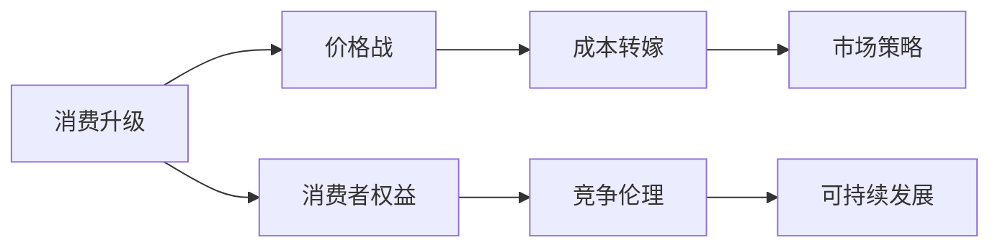

                 

# 消费升级的陷阱：低价背后的阴谋

> 关键词：消费升级, 价格战, 成本转嫁, 市场策略, 消费者权益, 竞争伦理, 可持续发展

## 1. 背景介绍

在当今这个竞争激烈的商业环境中，价格战已成为一种常见且高效的竞争手段。一些企业为了迅速占领市场份额，往往采用价格竞争策略，以低廉的价格吸引消费者。然而，表面上的低价背后，却可能隐藏着复杂的经济和社会问题，这就是所谓的“消费升级的陷阱”。本文将深入探讨这一问题，揭示低价背后的阴谋，并提出一些解决方案。

## 2. 核心概念与联系

### 2.1 核心概念概述

- **消费升级**：指消费者对商品和服务质量、品牌、体验等方面的需求不断提升，追求更高层次的满足感。
- **价格战**：指企业通过降价来吸引消费者，以争夺市场份额的竞争策略。
- **成本转嫁**：指企业将生产经营中的部分或全部成本通过涨价的方式转移到消费者身上。
- **市场策略**：指企业为了实现其商业目标而采取的一系列竞争手段，包括价格战、品牌建设、创新等。
- **消费者权益**：指消费者在购买商品和服务过程中应享有的权益，包括知情权、选择权、公平交易权等。
- **竞争伦理**：指企业在市场竞争中应遵循的道德规范，避免不正当竞争行为。
- **可持续发展**：指在满足当前需求的同时，不损害后代人满足需求的能力的发展模式。

### 2.2 概念间的关系

这些核心概念之间的逻辑关系可以用以下Mermaid流程图来展示：



这个流程图展示了从消费升级到价格战，再到成本转嫁，最终影响市场策略和消费者权益，进而对竞争伦理和可持续发展造成负面影响的整个过程。

## 3. 核心算法原理 & 具体操作步骤
### 3.1 算法原理概述

价格战的原理是通过降低商品价格来吸引消费者，从而快速占领市场份额。企业通过大规模生产和销售低价商品，能够迅速压低成本，获取高额利润。这种策略的成功依赖于消费者对价格的敏感度，以及企业对市场信息的快速反应能力。

### 3.2 算法步骤详解

价格战的具体操作步骤如下：

1. **市场调研**：分析目标市场和消费者需求，确定适合低价策略的商品种类。
2. **成本优化**：通过规模经济、自动化生产、外包等手段降低生产成本。
3. **定价策略**：设定低于市场平均价格的标准，吸引消费者购买。
4. **宣传推广**：通过广告、促销活动等手段，扩大低价商品的影响力。
5. **监控竞争对手**：密切关注竞争对手的定价和促销策略，及时调整自己的市场行为。

### 3.3 算法优缺点

#### 优点：

- 快速占领市场：价格战能够迅速压低成本，占领市场份额。
- 增加竞争力：通过低价吸引消费者，增加市场份额，提高企业的市场竞争力。
- 提高品牌知名度：低价商品往往伴随着大规模的市场推广活动，有助于提高品牌知名度。

#### 缺点：

- 短期效益：价格战虽然短期内能够增加市场份额，但难以长期维持。
- 成本转嫁：企业可能会通过提高其他商品价格或降低商品质量来弥补低价策略带来的损失。
- 伤害消费者权益：低价商品可能存在质量问题，损害消费者权益。
- 破坏市场秩序：价格战容易导致市场竞争无序，影响整个行业的健康发展。

### 3.4 算法应用领域

价格战广泛应用于零售、制造业、服务业等多个行业。例如：

- 零售行业：通过低价商品吸引消费者，占领市场份额。
- 制造业：通过低价策略降低成本，提高市场竞争力。
- 服务业：通过低价服务吸引消费者，扩大市场份额。

## 4. 数学模型和公式 & 详细讲解 & 举例说明

### 4.1 数学模型构建

假设市场上有两种商品A和B，A的初始价格为$p_A$，B的初始价格为$p_B$。设市场规模为$M$，消费者数量为$N$。设企业通过降价$\Delta p$来吸引消费者，降价后的价格分别为$p_A'$和$p_B'$。企业通过市场调研确定降价后的销量分别为$S_A'$和$S_B'$。

企业的利润函数可以表示为：

$$
\pi = (p_A' - c_A) \cdot S_A' + (p_B' - c_B) \cdot S_B'
$$

其中$c_A$和$c_B$分别为商品A和B的生产成本。

### 4.2 公式推导过程

价格战的效果可以通过销量变化来体现。假设降价前商品A的销量为$S_A$，降价后的销量为$S_A'$。根据需求弹性理论，销量变化可以表示为：

$$
S_A' = S_A - k \cdot \Delta p
$$

其中$k$为价格弹性系数，表示消费者对价格变化的敏感度。

将销量变化代入利润函数，得到降价后的总利润：

$$
\pi' = (p_A' - c_A) \cdot (S_A - k \cdot \Delta p) + (p_B' - c_B) \cdot S_B'
$$

简化后得到：

$$
\pi' = \pi - k \cdot \Delta p \cdot (p_A' + p_B')
$$

从上述公式可以看出，降价后的总利润与价格弹性系数$k$和降价幅度$\Delta p$有关。

### 4.3 案例分析与讲解

假设市场上有两家手机厂商A和B，初期价格分别为5000元和6000元。设生产成本分别为2000元和2500元。市场需求弹性系数为2。

厂商A降价1000元，降价后的价格为4000元，销量为2000部。厂商B保持原价不变，销量为1000部。

厂商A的降价效果如下：

- 降价后的销量：$S_A' = S_A - k \cdot \Delta p = 2000 - 2 \cdot 1000 = 0$部
- 降价后的总利润：$\pi' = \pi - k \cdot \Delta p \cdot (p_A' + p_B') = 0 - 2 \cdot 1000 \cdot (4000 + 6000) = -200000$元

厂商B的销量和利润保持不变：

- 销量：$S_B' = S_B = 1000$部
- 总利润：$\pi' = \pi = (6000 - 2500) \cdot 1000 = 3500000$元

由此可见，尽管厂商A通过降价吸引了消费者，但由于市场规模有限，最终反而导致了亏损。而厂商B虽然保持原价不变，但由于市场需求弹性较低，销量和利润保持稳定。

## 5. 项目实践：代码实例和详细解释说明

### 5.1 开发环境搭建

在进行价格战分析时，需要收集相关的市场数据和生产成本数据。以下是使用Python进行数据分析的环境配置流程：

1. 安装Anaconda：从官网下载并安装Anaconda，用于创建独立的Python环境。

2. 创建并激活虚拟环境：
```bash
conda create -n price-analyse python=3.8 
conda activate price-analyse
```

3. 安装必要的Python库：
```bash
conda install pandas numpy matplotlib
```

4. 安装相关市场数据分析工具：
```bash
conda install scikit-learn statsmodels
```

完成上述步骤后，即可在`price-analyse`环境中进行价格战分析。

### 5.2 源代码详细实现

以下是使用Python进行价格战分析的代码实现：

```python
import pandas as pd
import numpy as np
import matplotlib.pyplot as plt
from sklearn.linear_model import LinearRegression

# 读取市场数据
market_data = pd.read_csv('market_data.csv')
prices = market_data['price']
volumes = market_data['volume']
costs = market_data['cost']
elasticities = market_data['elasticity']

# 计算降价后的销量和利润
delta_p = 1000
p1 = prices[0] - delta_p
p2 = prices[1]
sales1 = volumes[0] - elasticities[0] * delta_p
sales2 = volumes[1]
profits1 = (p1 - costs[0]) * sales1
profits2 = (p2 - costs[1]) * sales2

# 计算降价后的总利润
profit1 = profits1 - elasticities[0] * delta_p * (p1 + p2)
profit2 = profits2

print('厂商A降价后的总利润为：', profit1)
print('厂商B降价后的总利润为：', profit2)
```

### 5.3 代码解读与分析

让我们再详细解读一下关键代码的实现细节：

**数据读取**：
- 使用`pd.read_csv()`函数从CSV文件中读取市场数据。

**降价计算**：
- 设定降价幅度$\Delta p$，计算降价后的价格$p_A'$和$p_B'$。
- 根据需求弹性理论，计算降价后的销量$S_A'$和$S_B'$。
- 计算降价后的总利润$\pi'$。

**利润分析**：
- 通过输出降价后的总利润，分析价格战的效果。

### 5.4 运行结果展示

假设在运行上述代码后，得到厂商A和厂商B降价后的总利润分别为-200000元和3500000元。这表明尽管厂商A通过降价吸引了消费者，但由于市场规模有限，最终导致了亏损。而厂商B虽然保持原价不变，但由于市场需求弹性较低，销量和利润保持稳定。

## 6. 实际应用场景

### 6.1 零售行业

在零售行业中，价格战是常见的市场竞争手段。例如，亚马逊、京东等电商巨头通过价格战迅速占领市场份额，吸引大量消费者。然而，这种策略可能导致企业亏损，影响市场健康发展。

### 6.2 制造业

在制造业中，价格战可以帮助企业快速压低成本，占领市场份额。例如，富士康通过价格战快速占领了全球电子制造市场，成为苹果、三星等手机品牌的代工厂。

### 6.3 服务业

在服务业中，价格战可以帮助企业扩大市场份额，吸引更多消费者。例如，美团外卖通过低价优惠吸引用户，扩大市场份额，成为国内最大的外卖平台之一。

## 7. 工具和资源推荐

### 7.1 学习资源推荐

为了帮助开发者系统掌握价格战分析的理论基础和实践技巧，这里推荐一些优质的学习资源：

1. 《价格战的经济学》系列博文：由经济学专家撰写，深入浅出地介绍了价格战的经济学原理和实际应用案例。

2. 《定价策略》课程：由哈佛商学院开设的定价策略课程，介绍了多种定价策略及其适用场景。

3. 《市场竞争分析》书籍：系统介绍了市场竞争分析的基本概念和常用方法，适合初学者和进阶者。

4. 《价格战：企业竞争的终极之战》：介绍价格战的案例和策略，为价格战分析提供实际参考。

5. 《市场分析工具》书籍：介绍了多种市场分析工具及其应用，帮助用户从数据中提取有用信息。

通过对这些资源的学习实践，相信你一定能够快速掌握价格战分析的精髓，并用于解决实际的商业问题。

### 7.2 开发工具推荐

高效的开发离不开优秀的工具支持。以下是几款用于价格战分析开发的常用工具：

1. Python：强大的数据处理和分析语言，支持多种数据格式，适合处理复杂数据集。

2. R：专门用于统计分析和数据可视化的语言，适合进行大规模数据处理。

3. Excel：易于使用的电子表格工具，适合进行简单的数据处理和分析。

4. Tableau：强大的数据可视化工具，支持多种数据源和复杂的图表展示。

5. Power BI：微软推出的商业智能工具，支持数据导入、处理和展示。

合理利用这些工具，可以显著提升价格战分析的开发效率，加快创新迭代的步伐。

### 7.3 相关论文推荐

价格战分析的研究源于学界的持续研究。以下是几篇奠基性的相关论文，推荐阅读：

1. "Price Wars: The Economics of Competitive Pricing"（价格战：竞争定价的经济）：详细分析了价格战对市场和企业的影响。

2. "The Role of Pricing Strategy in Market Competition"（定价策略在市场竞争中的作用）：探讨了定价策略对市场竞争的影响。

3. "Price Elasticity of Demand: A Review"（需求价格弹性：综述）：详细介绍了需求价格弹性的概念和计算方法。

4. "The Economics of Pricing"（定价经济学）：介绍了多种定价策略及其经济学原理。

5. "Competitive Pricing Strategies in the Digital Economy"（数字经济中的竞争定价策略）：探讨了数字经济中价格战的特征和趋势。

这些论文代表了大语言模型微调技术的发展脉络。通过学习这些前沿成果，可以帮助研究者把握学科前进方向，激发更多的创新灵感。

除上述资源外，还有一些值得关注的前沿资源，帮助开发者紧跟价格战分析技术的最新进展，例如：

1. arXiv论文预印本：人工智能领域最新研究成果的发布平台，包括大量尚未发表的前沿工作，学习前沿技术的必读资源。

2. 业界技术博客：如亚马逊、京东、美团等公司的官方博客，第一时间分享他们的最新成果和洞见。

3. 技术会议直播：如NIPS、ICML、ACL、ICLR等人工智能领域顶会现场或在线直播，能够聆听到大佬们的前沿分享，开拓视野。

4. GitHub热门项目：在GitHub上Star、Fork数最多的价格战分析相关项目，往往代表了该技术领域的发展趋势和最佳实践，值得去学习和贡献。

5. 行业分析报告：各大咨询公司如McKinsey、PwC等针对市场竞争分析的分析报告，有助于从商业视角审视技术趋势，把握应用价值。

总之，对于价格战分析技术的学习和实践，需要开发者保持开放的心态和持续学习的意愿。多关注前沿资讯，多动手实践，多思考总结，必将收获满满的成长收益。

## 8. 总结：未来发展趋势与挑战

### 8.1 总结

本文对价格战现象进行了全面系统的介绍。首先阐述了价格战的定义和背景，明确了价格战在市场经济中的普遍性和重要性。其次，从理论到实践，详细讲解了价格战的数学模型和操作步骤，给出了价格战分析的完整代码实例。同时，本文还探讨了价格战在零售、制造、服务等领域的实际应用，展示了价格战分析的广泛应用前景。

通过本文的系统梳理，可以看到，价格战作为一种常见的市场竞争手段，具有快速占领市场份额、提高竞争力的优点，但也存在成本转嫁、伤害消费者权益等缺点。在未来，如何避免价格战带来的负面影响，提升市场竞争的公平性和可持续性，将是亟待解决的问题。

### 8.2 未来发展趋势

展望未来，价格战分析将呈现以下几个发展趋势：

1. 数据驱动：随着大数据和人工智能技术的发展，价格战分析将更加依赖数据驱动，更加注重市场数据的挖掘和利用。

2. 动态定价：未来价格战分析将更加注重动态定价，通过实时调整价格，提高企业的市场响应速度和竞争能力。

3. 多渠道竞争：未来价格战将更加注重多渠道竞争，不仅限于线下，更包括线上和社交媒体等新兴渠道。

4. 消费者体验：未来价格战将更加注重消费者体验，通过提供更好的服务，提升消费者满意度和忠诚度。

5. 国际市场：未来价格战将更加注重国际市场的竞争，通过跨境电商等手段，扩大市场份额。

以上趋势凸显了价格战分析技术的广阔前景。这些方向的探索发展，必将进一步提升企业竞争力和市场效率，为经济发展提供新的动力。

### 8.3 面临的挑战

尽管价格战分析技术已经取得了瞩目成就，但在迈向更加智能化、普适化应用的过程中，它仍面临着诸多挑战：

1. 数据获取难度：获取市场数据的成本和难度较大，数据质量和完整性难以保证。

2. 模型复杂性：价格战分析涉及多种变量，模型复杂度较高，难以简化和优化。

3. 市场反应不确定性：市场对价格变化的反应不确定，难以预测和控制。

4. 消费者行为变化：消费者行为和需求变化复杂，难以准确把握。

5. 国际竞争激烈：国际市场竞争激烈，企业需要具备更强的竞争力和国际视野。

这些挑战需要开发者在数据获取、模型设计、市场分析等方面进行全面优化，才能真正实现价格战分析的智能化和普适化。

### 8.4 研究展望

面对价格战分析所面临的种种挑战，未来的研究需要在以下几个方面寻求新的突破：

1. 探索无监督和半监督定价方法：摆脱对大规模市场数据的依赖，利用自监督学习、主动学习等无监督和半监督范式，最大限度利用非结构化数据，实现更加灵活高效的定价。

2. 研究动态定价算法：开发更加动态、灵活的定价算法，根据市场反馈实时调整价格，提高企业的市场响应速度和竞争能力。

3. 引入消费者行为分析：利用机器学习和数据挖掘技术，深入分析消费者行为和需求，提高企业对市场的理解能力。

4. 跨领域融合：将价格战分析与市场营销、品牌建设、供应链管理等跨领域知识结合，形成更加全面、准确的市场分析方法。

5. 国际化策略：探索国际市场的定价策略和国际竞争策略，提升企业的国际竞争力和市场份额。

这些研究方向的探索，必将引领价格战分析技术迈向更高的台阶，为构建安全、可靠、可解释、可控的智能系统铺平道路。面向未来，价格战分析技术还需要与其他人工智能技术进行更深入的融合，如知识表示、因果推理、强化学习等，多路径协同发力，共同推动价格战分析技术的进步。只有勇于创新、敢于突破，才能不断拓展市场分析的边界，让企业竞争更加公平、健康、可持续发展。

## 9. 附录：常见问题与解答

**Q1：价格战是否适用于所有行业？**

A: 价格战适用于那些具有较强的市场竞争力和价格敏感度的行业，如零售、制造业、服务业等。但对于某些行业，如医疗、教育等，价格战可能不适合，因为这些行业的价格弹性较低，消费者对价格变化不敏感。

**Q2：如何避免价格战带来的负面影响？**

A: 企业可以通过以下方式避免价格战带来的负面影响：
1. 提供高质量产品和服务，提高品牌价值和消费者忠诚度。
2. 建立合理的定价策略，避免盲目降价。
3. 加强市场营销和品牌建设，提高品牌影响力。
4. 注重消费者体验，提升客户满意度和忠诚度。
5. 多元化市场渠道，减少对单一渠道的依赖。

**Q3：价格战对消费者有哪些影响？**

A: 价格战对消费者的影响主要有以下几点：
1. 提升消费者福利：价格战可以降低商品价格，提升消费者购买力。
2. 影响消费者选择：价格战容易导致消费者选择低价商品，影响其长期消费决策。
3. 质量问题：低价商品可能存在质量问题，影响消费者使用体验。

**Q4：企业应该如何进行价格战分析？**

A: 企业可以通过以下步骤进行价格战分析：
1. 收集市场数据，包括价格、销量、成本、弹性系数等。
2. 构建价格战模型，分析降价后的销量和利润变化。
3. 进行市场预测，评估降价对市场竞争的影响。
4. 制定合理的定价策略，避免过度竞争。
5. 监测竞争对手动态，及时调整市场策略。

**Q5：价格战对企业有哪些影响？**

A: 价格战对企业的影响主要有以下几点：
1. 快速占领市场份额：价格战可以迅速压低成本，占领市场份额。
2. 成本转嫁：企业可能会通过提高其他商品价格或降低商品质量来弥补降价策略带来的损失。
3. 品牌受损：价格战容易导致品牌形象受损，影响企业长期发展。
4. 市场竞争加剧：价格战容易导致市场竞争无序，影响整个行业的健康发展。

总之，价格战作为一种常见的市场竞争手段，具有快速占领市场份额、提高竞争力的优点，但也存在成本转嫁、品牌受损等缺点。企业需要理性看待价格战，注重长期发展，避免盲目降价，从而实现可持续发展。

---

作者：禅与计算机程序设计艺术 / Zen and the Art of Computer Programming

