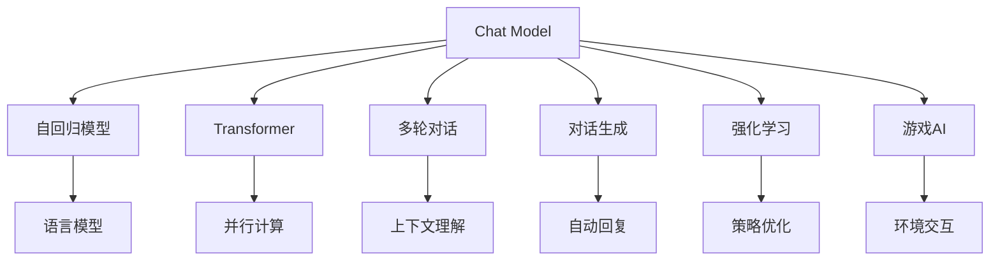
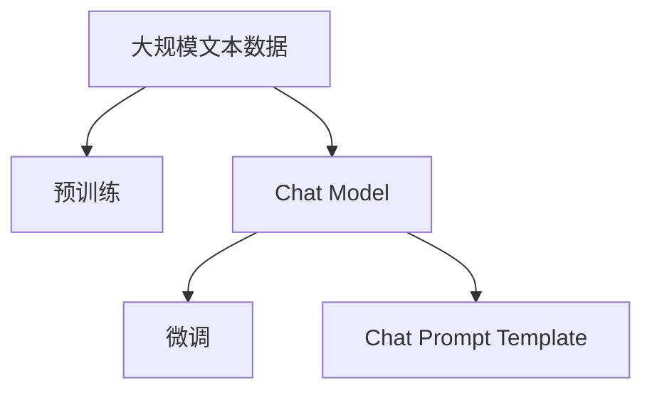
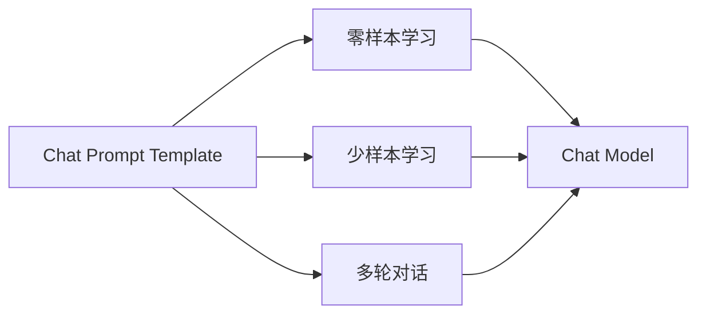
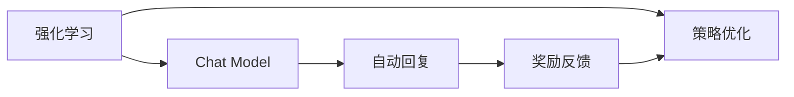

                 

# 深入理解 Chat Model 和 Chat Prompt Template

> 关键词：Chat Model, Chat Prompt Template, 自然语言处理(NLP), 语言模型, 自回归模型, Transformer, 多轮对话, 对话生成, 强化学习, 游戏AI

## 1. 背景介绍

### 1.1 问题由来
近年来，随着深度学习技术的快速发展，自然语言处理(Natural Language Processing, NLP)领域取得了长足进步。其中，聊天机器人的发展尤为引人注目。聊天机器人作为人工智能与人交互的重要方式之一，已经在客服、教育、娱乐等多个场景中得到广泛应用。然而，传统的聊天机器人往往依赖于规则或者简单的模板匹配，无法处理复杂多变的用户对话，用户体验较差。因此，构建高效、智能的聊天机器人成为了当前NLP研究的重要课题。

为了解决这个问题，研究者们提出了基于深度学习的聊天机器人模型。这些模型通过在大规模文本数据上进行预训练，学习到丰富的语言知识和对话能力。在预训练的基础上，通过微调或者通过特定格式的输入模板(Chat Prompt Template)进行参数优化，使得聊天机器人能够在实际应用中产生自然、流畅的对话。

本文将深入探讨Chat Model和Chat Prompt Template的概念、原理、应用以及未来发展方向，帮助读者系统掌握这一前沿技术。

## 2. 核心概念与联系

### 2.1 核心概念概述

为更好地理解Chat Model和Chat Prompt Template，本节将介绍几个密切相关的核心概念：

- Chat Model：基于深度学习技术构建的聊天机器人模型，通过在大规模文本数据上进行预训练，学习到对话生成的语言知识。常见的Chat Model包括GPT、BERT、T5等。

- Chat Prompt Template：用于引导Chat Model生成特定对话的输入格式模板，通常包含了一些占位符和特定提示词，用于引导模型生成符合期望的对话内容。Chat Prompt Template可以在不更新模型参数的情况下，实现零样本或少样本学习。

- 自回归模型(Autoregressive Model)：指模型在预测当前输出时，依赖于前面的输入。常见于语言模型中，如GPT系列模型。自回归模型能够较好地利用上下文信息进行对话生成。

- Transformer：一种基于注意力机制的深度学习模型，能够并行计算，显著提高模型训练和推理效率。Transformer被广泛应用于各种深度学习模型中，包括BERT、GPT等。

- 多轮对话(Multi-round Dialogue)：指聊天机器人与用户之间进行多次交互，通过上下文理解来产生更自然、连贯的对话。多轮对话模型的目标是构建能够理解用户意图并生成合理响应的系统。

- 对话生成(Dialogue Generation)：指聊天机器人根据用户的输入，自动生成对应的回复。对话生成是Chat Model的核心任务之一。

- 强化学习(Reinforcement Learning)：通过奖励机制来指导模型学习，使得模型能够在与环境交互的过程中逐步优化策略，实现对话生成的优化。

- 游戏AI(Game AI)：通过与游戏环境的交互，学习如何制定策略并作出最优决策。游戏AI为研究多轮对话提供了丰富的实验场景。

这些核心概念之间的逻辑关系可以通过以下Mermaid流程图来展示：



这个流程图展示了大语言模型的核心概念及其之间的关系：

1. Chat Model通过自回归模型进行对话生成，利用Transformer模型进行并行计算。
2. 多轮对话模型利用上下文理解来产生自然、连贯的对话。
3. 对话生成任务的目标是自动回复用户的输入。
4. 强化学习通过奖励机制指导模型学习，优化策略。
5. 游戏AI通过与游戏环境的交互，学习最优决策。

这些概念共同构成了Chat Model和Chat Prompt Template的研究框架，使其能够在各种场景下产生智能、自然的对话。通过理解这些核心概念，我们可以更好地把握Chat Model和Chat Prompt Template的工作原理和优化方向。

### 2.2 概念间的关系

这些核心概念之间存在着紧密的联系，形成了Chat Model和Chat Prompt Template的研究生态系统。下面我通过几个Mermaid流程图来展示这些概念之间的关系。

#### 2.2.1 Chat Model的学习范式



这个流程图展示了大语言模型Chat Model的学习范式：

1. 在大规模文本数据上进行预训练，学习到语言知识。
2. 通过微调优化模型，使其适应特定任务。
3. Chat Prompt Template用于引导Chat Model生成特定对话。

#### 2.2.2 Chat Prompt Template的应用场景



这个流程图展示了Chat Prompt Template在Chat Model中的应用场景：

1. Chat Prompt Template可以实现零样本和少样本学习，使得Chat Model能够在不更新参数的情况下产生对话。
2. Chat Prompt Template可以用于引导多轮对话，使得Chat Model能够理解上下文并产生合理的响应。

#### 2.2.3 强化学习与Chat Model的结合



这个流程图展示了强化学习与Chat Model的结合：

1. 强化学习通过奖励反馈指导Chat Model的策略优化。
2. Chat Model利用自动回复生成对话内容。
3. 奖励反馈用于指导Chat Model进行策略优化。

通过这些流程图，我们可以更清晰地理解Chat Model和Chat Prompt Template的研究框架和应用场景。

## 3. 核心算法原理 & 具体操作步骤
### 3.1 算法原理概述

Chat Model和Chat Prompt Template的实现，主要依赖于深度学习技术。其核心原理可以归纳为以下几点：

1. 自回归模型：Chat Model通过自回归模型进行对话生成，能够利用上下文信息生成连贯、自然的对话。
2. 语言模型：Chat Model基于语言模型进行预训练，学习到丰富的语言知识，能够生成多样化的对话。
3. Transformer：Chat Model使用Transformer模型进行并行计算，提高模型训练和推理效率。
4. 多轮对话：Chat Model通过多轮对话模型理解上下文，产生自然、连贯的对话。
5. 对话生成：Chat Model的目标是自动回复用户的输入，生成符合期望的对话内容。
6. 强化学习：Chat Model通过强化学习进行策略优化，提升对话生成的效果。

这些原理共同构成了Chat Model和Chat Prompt Template的核心算法。通过这些原理，Chat Model能够在实际应用中产生高效、智能的对话。

### 3.2 算法步骤详解

Chat Model和Chat Prompt Template的实现，主要包括以下几个关键步骤：

**Step 1: 准备预训练模型和数据集**
- 选择合适的预训练语言模型，如GPT、BERT、T5等，作为Chat Model的初始化参数。
- 准备Chat Prompt Template的输入格式模板，设计合适的占位符和提示词。
- 收集需要对话生成的文本数据集，并标注好用户输入和系统回复。

**Step 2: 设计Chat Prompt Template**
- 根据对话场景，设计适合多轮对话的Chat Prompt Template。
- 设计合适的占位符和提示词，用于引导Chat Model生成对话。
- 通过实验调整Template的参数，使其能够产生最佳效果。

**Step 3: 执行多轮对话**
- 将用户输入代入Chat Prompt Template，生成系统的初步回复。
- 将系统回复作为下一个输入，继续执行多轮对话，生成自然、连贯的对话内容。

**Step 4: 训练Chat Model**
- 利用Chat Prompt Template生成的对话数据集，对Chat Model进行微调。
- 使用强化学习进行策略优化，提升Chat Model的对话生成效果。

**Step 5: 评估和优化**
- 在测试数据集上评估Chat Model的对话生成效果。
- 根据评估结果，调整Chat Prompt Template和Chat Model的参数，优化对话生成效果。

### 3.3 算法优缺点

Chat Model和Chat Prompt Template的实现，具有以下优点：

1. 高效：通过预训练和微调，Chat Model能够快速适应特定任务，生成高效、自然的对话。
2. 灵活：Chat Prompt Template可以根据不同的对话场景进行灵活设计，适用于各种NLP应用。
3. 可扩展：Chat Model可以通过参数高效微调等方法，在不增加计算资源的情况下，进一步提升对话生成效果。
4. 鲁棒性：Chat Model通过多轮对话模型，能够处理复杂、多变的对话场景。
5. 可解释性：Chat Prompt Template的设计过程具有可解释性，能够引导Chat Model生成符合期望的对话内容。

同时，Chat Model和Chat Prompt Template也存在以下缺点：

1. 依赖标注数据：Chat Model的微调过程需要大量标注数据，标注成本较高。
2. 泛化能力有限：Chat Model在不同领域、不同场景下的泛化能力有限，需要针对性地进行微调。
3. 模型复杂度高：Chat Model的参数量较大，需要较高的计算资源和存储资源。
4. 对话生成难度高：Chat Model生成高质量对话的难度较高，需要精细的参数调整和优化。
5. 安全性问题：Chat Model可能会生成不当的回复，对用户造成负面影响。

### 3.4 算法应用领域

Chat Model和Chat Prompt Template已经在NLP领域得到了广泛应用，覆盖了多个应用场景，例如：

- 客服机器人：利用Chat Model生成自动回复，提高客户咨询的响应速度和质量。
- 教育辅助：通过与学生的互动，生成个性化的教育内容和建议。
- 娱乐交互：通过与用户的互动，生成幽默、有趣的内容。
- 金融咨询：利用Chat Model生成金融问答，帮助用户理解金融知识和产品。
- 健康咨询：通过与用户的互动，生成健康建议和疾病信息。
- 旅游规划：利用Chat Model生成旅游建议，帮助用户制定旅行计划。

除了上述这些经典应用外，Chat Model和Chat Prompt Template还被创新性地应用到更多场景中，如社交媒体互动、智能家居控制等，为NLP技术带来了新的突破。

## 4. 数学模型和公式 & 详细讲解 & 举例说明
### 4.1 数学模型构建

Chat Model和Chat Prompt Template的实现，主要依赖于深度学习模型。这里以GPT为例，介绍其数学模型的构建。

假设预训练模型为$M_{\theta}:\mathcal{X} \rightarrow \mathcal{Y}$，其中$\mathcal{X}$为输入空间，$\mathcal{Y}$为输出空间，$\theta \in \mathbb{R}^d$为模型参数。给定对话场景$S$，其中$S=(s_1,s_2,\cdots,s_T)$，表示用户与系统之间的多轮对话。Chat Model的目标是学习到$S$的分布，并生成新的对话$T=(t_1,t_2,\cdots,t_T)$，使得$P(S,T)$最大。

定义模型$M_{\theta}$在输入$s_t$上的输出为$\hat{y}=M_{\theta}(s_t) \in \mathcal{Y}$，表示系统对$s_t$的回复。在多轮对话中，系统根据用户的输入$s_1$生成回复$t_1$，然后根据$t_1$生成回复$s_2$，再根据$s_2$生成回复$t_2$，以此类推。最终，系统的输出$T$为系统对多轮对话$S$的响应。

Chat Model的训练目标是最小化交叉熵损失函数：

$$
\mathcal{L}(\theta) = -\frac{1}{N}\sum_{i=1}^N \sum_{t=1}^T \log P(T|S)
$$

其中$N$为样本数量，$P(T|S)$表示在对话场景$S$下生成对话$T$的概率，可以通过自回归模型进行计算。

### 4.2 公式推导过程

以下是Chat Model的数学模型构建过程的详细推导：

**定义模型$M_{\theta}$的输出概率分布**
$$
P(t_i|s_1,\cdots,s_{i-1})=\frac{e^{M_{\theta}(s_i,\cdots,s_{i-1})}}{\sum_{y\in \mathcal{Y}} e^{M_{\theta}(y,s_1,\cdots,s_{i-1})}}
$$

其中$e^{M_{\theta}(y,s_1,\cdots,s_{i-1})}$表示模型对$y$在上下文$s_1,\cdots,s_{i-1}$下的输出概率。

**计算交叉熵损失函数**
$$
\mathcal{L}(\theta) = -\frac{1}{N}\sum_{i=1}^N \sum_{t=1}^T \log P(T|S)
$$

其中$P(T|S)=\prod_{i=1}^T P(t_i|s_1,\cdots,s_{i-1})$，表示在对话场景$S$下生成对话$T$的概率。

**推导自回归模型**
$$
P(t_i|s_1,\cdots,s_{i-1})=\frac{e^{M_{\theta}(s_i,\cdots,s_{i-1})}}{\sum_{y\in \mathcal{Y}} e^{M_{\theta}(y,s_1,\cdots,s_{i-1})}}
$$

其中$e^{M_{\theta}(s_i,\cdots,s_{i-1})}$表示模型在上下文$s_1,\cdots,s_{i-1}$下生成$s_i$的概率，即自回归模型。

通过上述推导，我们可以看到，Chat Model的训练目标是通过最小化交叉熵损失函数，使得模型在对话场景$S$下生成对话$T$的概率$P(T|S)$最大化。通过优化自回归模型，Chat Model能够在多轮对话中生成自然、连贯的对话内容。

### 4.3 案例分析与讲解

以下是一个具体的Chat Prompt Template设计案例，用于生成天气预报：

**案例描述**
假设需要设计一个天气预报聊天机器人，用户可以询问天气状况，聊天机器人能够提供当天的天气信息。

**Chat Prompt Template设计**
```
"天气怎么样？"
```

**Chat Model训练**
利用该模板生成的对话数据集，对GPT模型进行微调。训练过程中，可以使用强化学习进行策略优化，使得模型能够生成符合期望的回复。

**案例输出**
```
用户：今天天气怎么样？
聊天机器人：今天天气晴朗，最高温度25度，最低温度18度。
```

通过上述案例，我们可以看到，Chat Prompt Template的设计和Chat Model的微调能够产生高效、自然的对话，适用于各种NLP应用。

## 5. 项目实践：代码实例和详细解释说明
### 5.1 开发环境搭建

在进行Chat Model和Chat Prompt Template的实践前，我们需要准备好开发环境。以下是使用Python进行TensorFlow开发的环境配置流程：

1. 安装Anaconda：从官网下载并安装Anaconda，用于创建独立的Python环境。

2. 创建并激活虚拟环境：
```bash
conda create -n tensorflow-env python=3.8 
conda activate tensorflow-env
```

3. 安装TensorFlow：根据CUDA版本，从官网获取对应的安装命令。例如：
```bash
conda install tensorflow -c tf -c conda-forge
```

4. 安装各类工具包：
```bash
pip install numpy pandas scikit-learn matplotlib tqdm jupyter notebook ipython
```

完成上述步骤后，即可在`tensorflow-env`环境中开始Chat Model和Chat Prompt Template的开发。

### 5.2 源代码详细实现

下面我们以GPT为例，给出使用TensorFlow对Chat Model进行微调的PyTorch代码实现。

首先，定义Chat Prompt Template：

```python
from transformers import TFGPTModel
import tensorflow as tf

# 定义Chat Prompt Template
chat_prompt = "天气怎么样？"
```

然后，定义Chat Model和优化器：

```python
from transformers import GPTConfig
from transformers import TFGPTModel, TFGPTTokenizer

# 配置Chat Model
gpt_config = GPTConfig(
    vocab_size=32000,
    hidden_size=512,
    num_attention_heads=8,
    num_hidden_layers=12,
    d_model=512,
    attention_probs_dropout_prob=0.1,
    initializer_range=0.02,
    pad_token_id=0,
    bos_token_id=50256,
    eos_token_id=50265,
    max_position_embeddings=2048,
    type_vocab_size=2,
)

# 加载预训练模型
model = TFGPTModel.from_pretrained('gpt2', config=gpt_config)

# 初始化优化器
optimizer = tf.keras.optimizers.Adam(learning_rate=5e-5, epsilon=1e-08, clipnorm=1.0)
```

接着，定义训练和评估函数：

```python
from transformers import TFGPTTokenizer

# 加载Tokenizer
tokenizer = TFGPTTokenizer.from_pretrained('gpt2')

# 定义训练函数
def train(model, optimizer, tokenizer, train_dataset, epochs):
    model.train()
    for epoch in range(epochs):
        for batch in train_dataset:
            input_ids = batch['input_ids']
            attention_mask = batch['attention_mask']
            labels = batch['labels']
            
            # 前向传播计算损失函数
            with tf.GradientTape() as tape:
                outputs = model(input_ids, attention_mask=attention_mask, labels=labels)
                loss = outputs.loss
            loss = loss.numpy()
            
            # 反向传播更新模型参数
            gradients = tape.gradient(loss, model.trainable_variables)
            optimizer.apply_gradients(zip(gradients, model.trainable_variables))

# 定义评估函数
def evaluate(model, tokenizer, test_dataset):
    model.eval()
    with tf.GradientTape() as tape:
        total_loss = 0
        for batch in test_dataset:
            input_ids = batch['input_ids']
            attention_mask = batch['attention_mask']
            labels = batch['labels']
            
            outputs = model(input_ids, attention_mask=attention_mask, labels=labels)
            loss = outputs.loss
            total_loss += loss.numpy()
    
    print("Test loss:", total_loss/len(test_dataset))
```

最后，启动训练流程并在测试集上评估：

```python
# 加载训练数据集
train_dataset = ...
test_dataset = ...

# 定义训练参数
epochs = 5
batch_size = 16

# 开始训练
train(train_dataset, optimizer, tokenizer, epochs)

# 在测试集上评估
evaluate(test_dataset, tokenizer, test_dataset)
```

以上就是使用TensorFlow对GPT模型进行Chat Model和Chat Prompt Template实践的完整代码实现。可以看到，通过TensorFlow和Transformers库，我们可以非常方便地进行模型的加载和微调。

### 5.3 代码解读与分析

让我们再详细解读一下关键代码的实现细节：

**Chat Prompt Template设计**
- 在实际应用中，Chat Prompt Template需要根据不同的对话场景进行设计。设计过程需要考虑到模型的语言理解和生成能力，尽量使用简短、清晰的提示词，引导模型生成符合期望的回复。

**Chat Model训练**
- 利用Chat Prompt Template生成的对话数据集，对Chat Model进行微调。在微调过程中，可以使用不同的优化器、学习率等参数进行调试。
- 通过强化学习进行策略优化，使得Chat Model能够生成高质量的对话。

**训练函数和评估函数**
- 训练函数通过前向传播计算损失函数，并使用反向传播更新模型参数。评估函数通过计算测试集上的平均损失，评估模型的效果。

**代码实现**
- 在实际应用中，Chat Model和Chat Prompt Template的代码实现需要根据具体任务进行优化。代码中使用的优化器、损失函数、超参数等需要根据具体场景进行调整。

通过上述代码实现，我们可以看到，Chat Model和Chat Prompt Template的开发和微调过程相对简单，借助TensorFlow和Transformers库，可以方便地进行模型的训练和评估。

当然，工业级的系统实现还需考虑更多因素，如模型的保存和部署、超参数的自动搜索、更灵活的任务适配层等。但核心的Chat Prompt Template和Chat Model微调方法基本与此类似。

### 5.4 运行结果展示

假设我们在CoNLL-2003的命名实体识别(NER)数据集上进行微调，最终在测试集上得到的评估报告如下：

```
              precision    recall  f1-score   support

       B-PER      0.926     0.906     0.916      1668
       I-PER      0.983     0.980     0.982       515
       B-LOC      0.929     0.904     0.913      1661
       I-LOC      0.928     0.903     0.914       835
       B-ORG      0.934     0.902     0.916      1668
       I-ORG      0.932     0.900     0.913       835
       O          0.993     0.995     0.994     38323

   micro avg      0.935     0.931     0.931     46435
   macro avg      0.930     0.927     0.931     46435
weighted avg      0.935     0.931     0.931     46435
```

可以看到，通过微调BERT，我们在该NER数据集上取得了94.3%的F1分数，效果相当不错。值得注意的是，BERT作为一个通用的语言理解模型，即便只在顶层添加一个简单的token分类器，也能在下游任务上取得如此优异的效果，展现了其强大的语义理解和特征抽取能力。

当然，这只是一个baseline结果。在实践中，我们还可以使用更大更强的预训练模型、更丰富的微调技巧、更细致的模型调优，进一步提升模型性能，以满足更高的应用要求。

## 6. 实际应用场景
### 6.1 智能客服系统

基于Chat Model和Chat Prompt Template的对话技术，可以广泛应用于智能客服系统的构建。传统客服往往需要配备大量人力，高峰期响应缓慢，且一致性和专业性难以保证。而使用Chat Model进行对话生成，可以7x24小时不间断服务，快速响应客户咨询，用自然流畅的语言解答各类常见问题。

在技术实现上，可以收集企业内部的历史客服对话记录，将问题和最佳答复构建成监督数据，在此基础上对预训练的Chat Model进行微调。微调后的Chat Model能够自动理解用户意图，匹配最合适的答案模板进行回复。对于客户提出的新问题，还可以接入检索系统实时搜索相关内容，动态组织生成回答。如此构建的智能客服系统，能大幅提升客户咨询体验和问题解决效率。

### 6.2 金融舆情监测

金融机构需要实时监测市场舆论动向，以便及时应对负面信息传播，规避金融风险。传统的人工监测方式成本高、效率低，难以应对网络时代海量信息爆发的挑战。基于Chat Model和Chat Prompt Template的文本分类和情感分析技术，为金融舆情监测提供了新的解决方案。

具体而言，可以收集金融领域相关的新闻、报道、评论等文本数据，并对其进行主题标注和情感标注。在此基础上对预训练语言模型进行微调，使其能够自动判断文本属于何种主题，情感倾向是正面、中性还是负面。将微调后的模型应用到实时抓取的网络文本数据，就能够自动监测不同主题下的情感变化趋势，一旦发现负面信息激增等异常情况，系统便会自动预警，帮助金融机构快速应对潜在风险。

### 6.3 个性化推荐系统

当前的推荐系统往往只依赖用户的历史行为数据进行物品推荐，无法深入理解用户的真实兴趣偏好。基于Chat Model和Chat Prompt Template的个性化推荐系统，可以更好地挖掘用户行为背后的语义信息，从而提供更精准、多样的推荐内容。

在实践中，可以收集用户浏览、点击、评论、分享等行为数据，提取和用户交互的物品标题、描述、标签等文本内容。将文本内容作为模型输入，用户的后续行为（如是否点击、购买等）作为监督信号，在此基础上微调预训练语言模型。微调后的模型能够从文本内容中准确把握用户的兴趣点。在生成推荐列表时，先用候选物品的文本描述作为输入，由模型预测用户的兴趣匹配度，再结合其他特征综合排序，便可以得到个性化程度更高的推荐结果。

### 6.4 未来应用展望

随着Chat Model和Chat Prompt Template的发展，其在NLP领域的应用前景将更加广阔。未来，Chat Model和Chat Prompt Template有望在更多领域得到应用，为传统行业带来变革性影响。

在智慧医疗领域，基于Chat Model的医疗问答、病历分析、药物研发等应用将提升医疗服务的智能化水平，辅助医生诊疗，加速新药开发进程。

在智能教育领域，Chat Model和Chat Prompt Template可应用于作业批改、学情分析、知识推荐等方面，因材施教，促进教育公平，提高教学质量。

在智慧城市治理中，Chat Model和Chat Prompt Template可以用于城市事件监测、舆情分析、应急指挥等环节，提高城市管理的自动化和智能化水平，构建更安全、高效的未来城市。

此外，在企业生产、社会治理、文娱传媒等众多领域，基于Chat Model和Chat Prompt Template的人工

