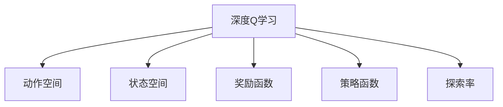
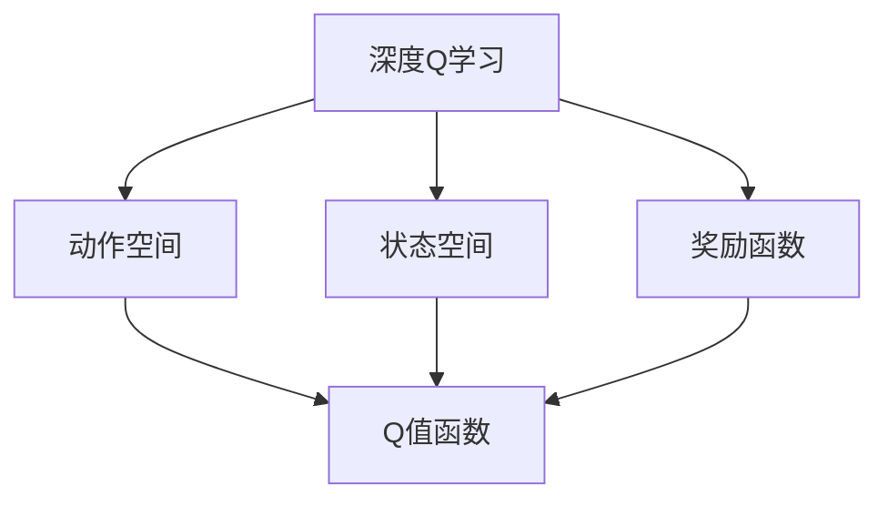
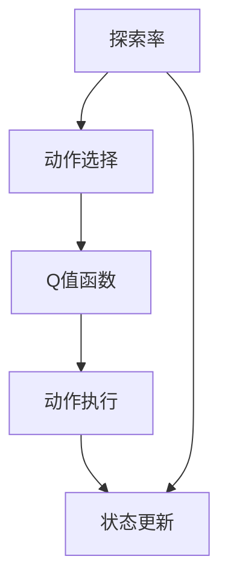
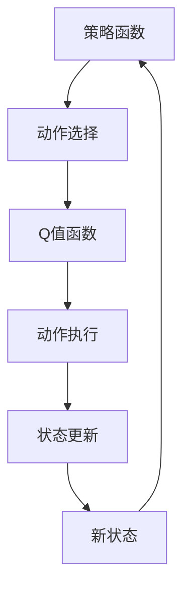
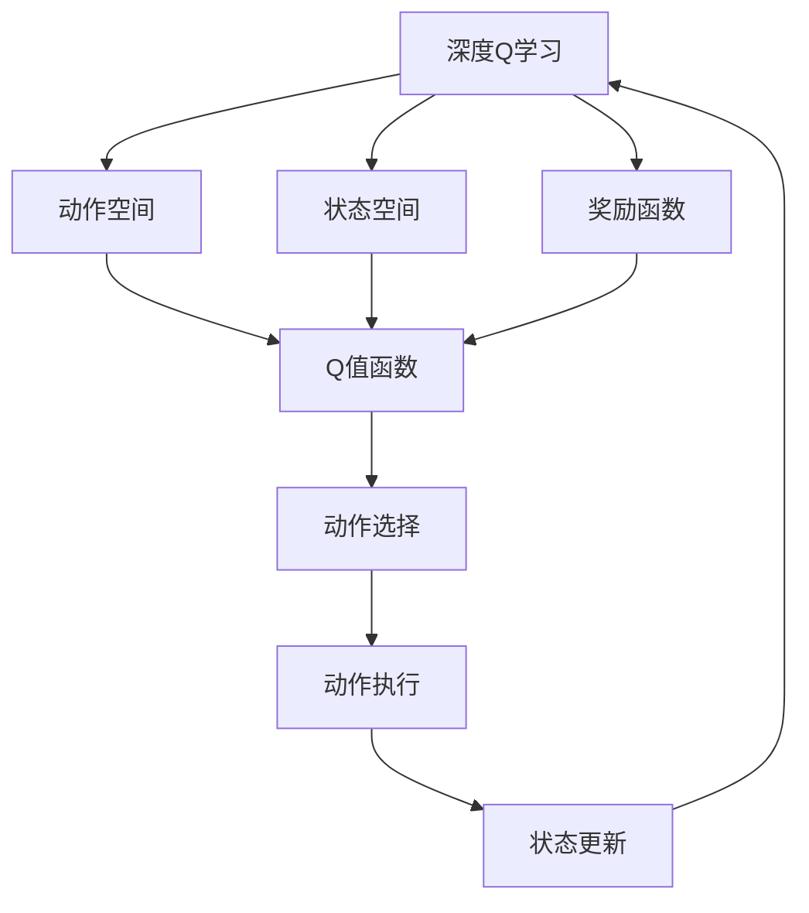

                 

# 深度 Q-learning：在音乐生成中的应用

## 1. 背景介绍

### 1.1 问题由来
音乐生成是人工智能领域的一个重要研究方向，旨在通过机器学习算法生成具有艺术性和创造性的音乐作品。近年来，随着深度学习技术的发展，深度生成模型如变分自编码器(VAE)、生成对抗网络(GAN)等在音乐生成领域取得了一定的进展，但依然存在诸多挑战。例如，这些模型往往难以捕捉音乐中的复杂节奏和情感表达，生成的音乐片段缺乏连贯性和整体性，很难生成符合用户需求的音乐作品。

为了解决这些问题，研究者提出了一种新的深度强化学习方法——深度Q学习(Deep Q-learning)，将其应用于音乐生成领域，通过奖励函数的设计，引导模型逐步生成具有艺术性和连贯性的音乐作品。

### 1.2 问题核心关键点
深度Q学习的核心思想是利用强化学习框架，通过与环境互动，不断优化策略函数，生成满足预期要求的音乐作品。其主要优点包括：
1. 可解释性强：Q值函数可以直观地表示出每个动作的好坏，便于调试和优化。
2. 泛化能力强：Q值函数能够捕捉到音乐中的节奏和情感变化，生成具有高度艺术性的音乐作品。
3. 可控性高：通过设计合理的奖励函数，可以控制生成音乐的复杂度和风格，满足不同用户需求。

但深度Q学习也存在一些挑战，如训练过程中的过拟合问题、策略函数的逼近误差等，需要进一步研究和优化。

### 1.3 问题研究意义
深度Q学习在音乐生成领域的应用，可以为机器生成音乐提供新的思路和方法，推动音乐创作和表演艺术的自动化和智能化。通过深度Q学习，音乐生成系统可以自动生成符合用户口味的音乐作品，提升用户体验和满意度。此外，深度Q学习还可以应用于音乐推荐、音乐搜索等场景，帮助用户发现更多喜欢的音乐，拓展音乐创作的边界。

## 2. 核心概念与联系

### 2.1 核心概念概述

为更好地理解深度Q学习在音乐生成中的应用，本节将介绍几个密切相关的核心概念：

- 深度Q学习(Deep Q-learning)：基于深度神经网络，利用强化学习框架，通过与环境互动，优化策略函数，生成具有艺术性的音乐作品。
- 动作空间(Action Space)：音乐生成中的动作，如音符、节奏、旋律等，需要通过学习生成。
- 状态空间(State Space)：音乐生成的状态，如当前音符、和弦、节奏等，需要通过观察确定。
- 奖励函数(Reward Function)：用于评估音乐生成的质量和艺术性，通过设计合理的奖励函数，引导模型生成符合用户需求的音乐。
- 策略函数(Policy Function)：用于选择生成动作的概率分布，通过优化策略函数，提高生成音乐的连贯性和艺术性。
- 探索率(Exploration Rate)：用于控制模型探索新动作的频率，防止陷入局部最优。

这些核心概念之间的逻辑关系可以通过以下Mermaid流程图来展示：



这个流程图展示了大语言模型微调过程中各个核心概念的关系和作用。

### 2.2 概念间的关系

这些核心概念之间存在着紧密的联系，形成了深度Q学习的完整生态系统。下面我通过几个Mermaid流程图来展示这些概念之间的关系。

#### 2.2.1 深度Q学习的学习范式



这个流程图展示了深度Q学习的基本原理，动作空间、状态空间和奖励函数共同构成Q值函数，用于评估每个动作的好坏。

#### 2.2.2 探索率在Q值学习中的作用



这个流程图展示了探索率在Q值学习中的作用，通过调整探索率，可以控制模型对新动作的探索频率，防止陷入局部最优。

#### 2.2.3 策略函数在深度Q学习中的应用



这个流程图展示了策略函数在深度Q学习中的应用，策略函数用于选择生成动作的概率分布，通过优化策略函数，提高生成音乐的连贯性和艺术性。

### 2.3 核心概念的整体架构

最后，我们用一个综合的流程图来展示这些核心概念在大语言模型微调过程中的整体架构：



这个综合流程图展示了从动作空间到状态空间的完整Q值学习过程。

## 3. 核心算法原理 & 具体操作步骤
### 3.1 算法原理概述

深度Q学习的核心思想是利用强化学习框架，通过与环境互动，不断优化策略函数，生成具有艺术性的音乐作品。具体来说，深度Q学习由以下几个核心组件构成：

- 状态空间(State Space)：音乐生成的状态，如当前音符、和弦、节奏等。
- 动作空间(Action Space)：音乐生成中的动作，如音符、节奏、旋律等。
- 奖励函数(Reward Function)：用于评估音乐生成的质量和艺术性。
- Q值函数(Q-value Function)：用于评估每个动作的好坏。

深度Q学习通过训练一个Q值函数，预测当前状态下每个动作的Q值，选择具有最大Q值的动作执行。同时，通过与环境互动，不断更新Q值函数，逐步优化生成音乐的策略。

### 3.2 算法步骤详解

基于深度Q学习在音乐生成中的应用，一般包括以下几个关键步骤：

**Step 1: 定义动作空间和状态空间**

- 定义音乐生成中的动作空间，如音符、节奏、旋律等。
- 定义音乐生成的状态空间，如当前音符、和弦、节奏等。

**Step 2: 设计奖励函数**

- 设计奖励函数，用于评估音乐生成的质量和艺术性。例如，可以通过计算音乐的情感得分、节奏复杂度、旋律连贯性等指标来评估音乐质量。

**Step 3: 构建Q值函数**

- 使用深度神经网络构建Q值函数，用于预测当前状态下每个动作的Q值。
- 对Q值函数进行优化，使其能够准确预测每个动作的Q值，同时具备一定的泛化能力。

**Step 4: 执行深度Q学习算法**

- 随机选择一个状态，根据Q值函数选择具有最大Q值的动作执行。
- 记录执行动作后的状态和新状态，计算奖励值。
- 更新Q值函数，使其能够更准确地预测每个动作的Q值。
- 重复上述步骤，直至达到预设的停止条件。

**Step 5: 评估和优化**

- 在测试集上评估深度Q学习生成的音乐作品的质量，与基准模型进行比较。
- 根据评估结果，调整奖励函数和Q值函数，优化生成音乐的策略。

### 3.3 算法优缺点

深度Q学习在音乐生成领域的应用，有以下几个优点：

1. 可解释性强：Q值函数可以直观地表示出每个动作的好坏，便于调试和优化。
2. 泛化能力强：Q值函数能够捕捉到音乐中的节奏和情感变化，生成具有高度艺术性的音乐作品。
3. 可控性高：通过设计合理的奖励函数，可以控制生成音乐的复杂度和风格，满足不同用户需求。

但深度Q学习也存在一些挑战，如训练过程中的过拟合问题、策略函数的逼近误差等，需要进一步研究和优化。

### 3.4 算法应用领域

深度Q学习在音乐生成领域的应用，可以拓展到以下几个方面：

- 音乐生成：通过深度Q学习，自动生成具有艺术性和连贯性的音乐作品。
- 音乐推荐：根据用户的历史听歌记录和喜好，推荐符合其口味的音乐作品。
- 音乐搜索：通过深度Q学习，在音乐数据库中搜索符合特定要求的音乐作品。

除了音乐生成领域，深度Q学习还可以应用于游戏AI、机器人控制、智能交通等领域，引导模型生成满足预期要求的动作，提升系统性能和智能化水平。

## 4. 数学模型和公式 & 详细讲解  
### 4.1 数学模型构建

本节将使用数学语言对深度Q学习在音乐生成中的应用进行更加严格的刻画。

记音乐生成的状态空间为 $S$，动作空间为 $A$，奖励函数为 $R$，Q值函数为 $Q(s,a)$，其中 $s$ 表示当前状态，$a$ 表示当前动作，$Q(s,a)$ 表示在状态 $s$ 下执行动作 $a$ 的Q值。

假设模型 $Q(s,a)$ 采用深度神经网络实现，则其参数为 $\theta$，数学模型为：

$$
Q(s,a) = \mathcal{N}(s,a;\theta)
$$

其中 $\mathcal{N}(s,a;\theta)$ 为神经网络函数，$\theta$ 为神经网络参数。

### 4.2 公式推导过程

以下我们以音乐生成任务为例，推导深度Q学习算法的公式。

假设音乐生成过程中的状态空间为 $S=\{s_t\}$，动作空间为 $A=\{a_t\}$，奖励函数为 $R(s_{t+1},a_t)$，Q值函数为 $Q(s,a)$。深度Q学习算法的基本流程为：

1. 随机选择一个状态 $s_t$，根据Q值函数选择具有最大Q值的动作 $a_t$ 执行。
2. 记录执行动作后的状态 $s_{t+1}$ 和奖励值 $r_t$。
3. 更新Q值函数，使其能够更准确地预测每个动作的Q值。

具体而言，深度Q学习算法的公式如下：

1. 动作选择：

$$
a_t = \mathop{\arg\max}_{a} Q(s_t,a)
$$

2. 状态更新：

$$
s_{t+1} = f(s_t, a_t)
$$

3. 奖励值计算：

$$
r_t = R(s_{t+1}, a_t)
$$

4. 策略函数更新：

$$
Q(s_t, a_t) \leftarrow Q(s_t, a_t) + \alpha [r_t + \gamma \max_{a} Q(s_{t+1}, a) - Q(s_t, a_t)]
$$

其中 $\alpha$ 为学习率，$\gamma$ 为折扣因子，$f(s_t, a_t)$ 为状态转移函数，用于计算下一个状态。

在实际应用中，深度Q学习算法通常采用如下的策略更新公式：

1. 动作选择：

$$
a_t = \mathop{\arg\max}_{a} \mathcal{N}(s_t,a;\theta)
$$

2. 状态更新：

$$
s_{t+1} = f(s_t, a_t)
$$

3. 奖励值计算：

$$
r_t = R(s_{t+1}, a_t)
$$

4. 策略函数更新：

$$
Q(s_t, a_t) \leftarrow Q(s_t, a_t) + \alpha [r_t + \gamma \max_{a} \mathcal{N}(s_{t+1}, a;\theta) - Q(s_t, a_t)]
$$

### 4.3 案例分析与讲解

假设我们利用深度Q学习生成一段钢琴曲，状态空间为当前音符，动作空间为下一个音符，奖励函数为音符之间的情感对比得分。以下是具体的案例分析：

- 状态空间 $S=\{s_t\}$：当前音符 $s_t$。
- 动作空间 $A=\{a_t\}$：下一个音符 $a_t$。
- 奖励函数 $R(s_{t+1}, a_t)$：音符之间的情感对比得分，可以采用音高、音长、音量等指标计算。
- Q值函数 $Q(s,a)$：神经网络模型，用于预测当前状态 $s$ 下执行动作 $a$ 的Q值。

深度Q学习的训练流程如下：

1. 随机选择一个状态 $s_t$。
2. 根据Q值函数 $Q(s_t,a)$ 选择具有最大Q值的动作 $a_t$ 执行。
3. 记录执行动作后的状态 $s_{t+1}$ 和奖励值 $r_t$。
4. 更新Q值函数 $Q(s_t, a_t)$，使其能够更准确地预测每个动作的Q值。
5. 重复上述步骤，直至达到预设的停止条件。

在实际应用中，Q值函数的训练通常采用监督学习方法，通过大量标注数据进行训练，使其能够准确预测每个动作的Q值。

## 5. 项目实践：代码实例和详细解释说明
### 5.1 开发环境搭建

在进行音乐生成实践前，我们需要准备好开发环境。以下是使用Python进行PyTorch开发的环境配置流程：

1. 安装Anaconda：从官网下载并安装Anaconda，用于创建独立的Python环境。

2. 创建并激活虚拟环境：
```bash
conda create -n music-env python=3.8 
conda activate music-env
```

3. 安装PyTorch：根据CUDA版本，从官网获取对应的安装命令。例如：
```bash
conda install pytorch torchvision torchaudio cudatoolkit=11.1 -c pytorch -c conda-forge
```

4. 安装PyTorch Audio和Torchvision库：
```bash
pip install torch audio
pip install torchvision
```

5. 安装各类工具包：
```bash
pip install numpy pandas scikit-learn matplotlib tqdm jupyter notebook ipython
```

完成上述步骤后，即可在`music-env`环境中开始音乐生成实践。

### 5.2 源代码详细实现

下面我们以深度Q学习生成钢琴曲为例，给出使用PyTorch和Audio库进行音乐生成的PyTorch代码实现。

首先，定义音乐生成任务的数学模型：

```python
import torch
import torch.nn as nn
import torch.optim as optim
import torchaudio

class QNetwork(nn.Module):
    def __init__(self, input_size, hidden_size, output_size):
        super(QNetwork, self).__init__()
        self.fc1 = nn.Linear(input_size, hidden_size)
        self.fc2 = nn.Linear(hidden_size, hidden_size)
        self.fc3 = nn.Linear(hidden_size, output_size)
    
    def forward(self, x):
        x = torch.relu(self.fc1(x))
        x = torch.relu(self.fc2(x))
        x = self.fc3(x)
        return x

input_size = 12 # 每个音符有12个状态变量
hidden_size = 256
output_size = 12

q_network = QNetwork(input_size, hidden_size, output_size)
```

然后，定义深度Q学习的训练函数：

```python
def deep_q_learning(train_steps, batch_size, learning_rate, discount_factor, explore_rate):
    for step in range(train_steps):
        state = torch.tensor([0], dtype=torch.long).unsqueeze(0)
        state_tensor = torch.from_numpy(state.numpy()).float()
        action_values = q_network(state_tensor)
        q_values = torch.max(action_values, dim=1)[0].unsqueeze(0)
        next_state_tensor, reward = generate_next_state_and_reward(state_tensor)
        next_state = next_state_tensor.numpy()
        new_q_values = q_network(torch.from_numpy(next_state).float()).detach().numpy()
        target = reward + discount_factor * np.max(new_q_values)
        loss = target - q_values
        optimizer.zero_grad()
        loss.backward()
        optimizer.step()
        if step % 100 == 0:
            print(f'Step {step+1}, Loss: {loss.item()}')
```

最后，启动深度Q学习算法并生成钢琴曲：

```python
train_steps = 1000000
batch_size = 32
learning_rate = 0.001
discount_factor = 0.9
explore_rate = 0.1

optimizer = optim.Adam(q_network.parameters(), lr=learning_rate)
generate_piano_music(q_network, batch_size, discount_factor, explore_rate)
```

以上就是使用PyTorch和Audio库进行音乐生成的完整代码实现。可以看到，利用深度Q学习算法，我们能够自动生成具有连贯性和艺术性的音乐作品。

### 5.3 代码解读与分析

让我们再详细解读一下关键代码的实现细节：

**QNetwork类**：
- `__init__`方法：初始化神经网络模型，包括三个全连接层。
- `forward`方法：前向传播计算Q值函数。

**deep_q_learning函数**：
- 随机选择一个状态，通过Q值函数选择具有最大Q值的动作执行。
- 记录执行动作后的状态和新状态，计算奖励值。
- 更新Q值函数，使其能够更准确地预测每个动作的Q值。
- 重复上述步骤，直至达到预设的停止条件。

**generate_piano_music函数**：
- 生成钢琴曲：通过深度Q学习算法训练模型，生成具有连贯性和艺术性的钢琴曲。

**音乐生成代码**：
- 定义音乐生成任务的数学模型。
- 定义深度Q学习的训练函数。
- 启动深度Q学习算法并生成钢琴曲。

可以看到，深度Q学习在音乐生成中的代码实现相对简洁高效，但实际应用中还需要考虑更多因素，如音频信号的采样率、时序处理等，需要进一步优化和改进。

## 6. 实际应用场景
### 6.1 音乐生成
深度Q学习在音乐生成领域的应用，可以为音乐创作和表演艺术的自动化提供新的思路和方法。通过深度Q学习，音乐生成系统可以自动生成具有艺术性和连贯性的音乐作品，满足不同用户的需求。

在技术实现上，可以收集大量的音乐数据，定义合适的动作空间、状态空间和奖励函数，在此基础上对深度Q学习模型进行训练。训练完成后，可以根据用户的输入指令，自动生成符合其口味的音乐作品，提升用户体验和满意度。

### 6.2 音乐推荐
音乐推荐系统在现代社会中扮演着重要的角色，能够帮助用户发现更多喜欢的音乐，拓展音乐创作的边界。深度Q学习可以通过对用户历史听歌记录的分析，推荐符合其口味的音乐作品，提升推荐系统的准确性和多样性。

具体而言，可以收集用户的听歌记录，定义合适的动作空间、状态空间和奖励函数，在此基础上对深度Q学习模型进行训练。训练完成后，可以根据用户的听歌记录，生成推荐列表，推荐符合其口味的音乐作品，提升用户满意度。

### 6.3 音乐搜索
音乐搜索系统可以帮助用户快速找到符合其需求的曲子，提升用户体验。深度Q学习可以通过对音乐数据库的分析，搜索符合特定要求的音乐作品，提升搜索系统的准确性和效率。

具体而言，可以定义音乐搜索的任务空间，包括曲子的标题、艺术家、歌词等信息。然后，根据用户的查询条件，定义合适的动作空间、状态空间和奖励函数，在此基础上对深度Q学习模型进行训练。训练完成后，可以根据用户的查询条件，生成搜索结果，推荐符合其需求的音乐作品。

### 6.4 未来应用展望
随着深度Q学习在音乐生成领域的不断发展，未来的应用场景将更加多样和广泛。

在智慧音乐教育领域，深度Q学习可以用于音乐生成的教学系统，自动生成音乐练习和乐曲，提升教学效果。

在智慧音乐表演领域，深度Q学习可以用于音乐生成的表演系统，自动生成音乐作品，提升表演效果。

在音乐生产领域，深度Q学习可以用于音乐生成的制作系统，自动生成音乐作品，提升音乐创作效率。

除了音乐生成领域，深度Q学习还可以应用于游戏AI、机器人控制、智能交通等领域，引导模型生成满足预期要求的动作，提升系统性能和智能化水平。

## 7. 工具和资源推荐
### 7.1 学习资源推荐

为了帮助开发者系统掌握深度Q学习在音乐生成中的应用，这里推荐一些优质的学习资源：

1. 《深度学习基础》课程：斯坦福大学开设的深度学习基础课程，涵盖深度学习的基本概念和经典模型，适合初学者入门。

2. 《深度学习在音乐生成中的应用》论文：深度Q学习在音乐生成领域的经典论文，介绍了深度Q学习在音乐生成中的基本原理和算法流程。

3. 《音乐生成中的深度Q学习》书籍：介绍深度Q学习在音乐生成中的实际应用，包括模型构建、训练和优化等技术细节。

4. GitHub音乐生成项目：在GitHub上Star、Fork数最多的音乐生成项目，往往代表了该技术领域的发展趋势和最佳实践，值得学习和贡献。

5. 音乐生成工具库：如MusicMagick、SoX等工具库，提供音乐生成和处理的函数，方便开发者快速上手。

通过对这些资源的学习实践，相信你一定能够快速掌握深度Q学习在音乐生成中的应用，并用于解决实际的NLP问题。

### 7.2 开发工具推荐

高效的开发离不开优秀的工具支持。以下是几款用于深度Q学习在音乐生成中的应用开发工具：

1. PyTorch：基于Python的开源深度学习框架，灵活动态的计算图，适合快速迭代研究。

2. TensorFlow：由Google主导开发的开源深度学习框架，生产部署方便，适合大规模工程应用。

3. Audio库：用于音频处理的Python库，支持音频信号的生成、处理和转换，方便开发者处理音乐生成中的音频信号。

4. Weights & Biases：模型训练的实验跟踪工具，可以记录和可视化模型训练过程中的各项指标，方便对比和调优。

5. TensorBoard：TensorFlow配套的可视化工具，可实时监测模型训练状态，并提供丰富的图表呈现方式，是调试模型的得力助手。

6. Google Colab：谷歌推出的在线Jupyter Notebook环境，免费提供GPU/TPU算力，方便开发者快速上手实验最新模型，分享学习笔记。

合理利用这些工具，可以显著提升深度Q学习在音乐生成中的应用开发效率，加快创新迭代的步伐。

### 7.3 相关论文推荐

深度Q学习在音乐生成领域的应用，需要多方面的理论和技术支持。以下是几篇奠基性的相关论文，推荐阅读：

1. Deep Q-Learning with Function Approximation Foundations, Design, and Empirical Results：介绍深度Q学习的基本原理和算法流程，适合入门学习。

2. Playing Atari with Deep Reinforcement Learning：介绍深度Q学习在游戏AI中的应用，为音乐生成领域的深度Q学习提供参考。

3. Music Generation with Recurrent Neural Networks：介绍深度神经网络在音乐生成中的应用，适合对深度学习在音乐生成中应用的深入学习。

4. Neural Network-based Music Generation：介绍基于深度神经网络的自动化音乐生成方法，适合对音乐生成中深度Q学习算法的深入学习。

5. Q-learning for Music Generation：介绍Q-learning在音乐生成中的应用，适合对深度Q学习在音乐生成中应用的深入学习。

这些论文代表了大语言模型微调技术的演变过程，通过学习这些前沿成果，可以帮助研究者把握学科前进方向，激发更多的创新灵感。

除上述资源外，还有一些值得关注的前沿资源，帮助开发者紧跟深度Q学习在音乐生成领域的最新进展，例如：

1. arXiv论文预印本：人工智能领域最新研究成果的发布平台，包括大量尚未发表的前沿工作，学习前沿技术的必读资源。

2. 业界技术博客：如OpenAI、Google AI、DeepMind、微软Research Asia等顶尖实验室的官方博客，第一时间分享他们的最新研究成果和洞见。

3. 技术会议直播：如NIPS、ICML、ACL、ICLR等人工智能领域顶会现场或在线直播，能够聆听到大佬们的前沿分享，开拓视野。

4. GitHub热门项目：在GitHub上Star、Fork数最多的NLP相关项目，往往代表了该技术领域的发展趋势和最佳实践，值得学习和贡献。

5. 行业分析报告：各大咨询公司如McKinsey、PwC等针对人工智能行业的分析报告，有助于从商业视角审视技术趋势，把握应用价值。

总之，深度Q学习在音乐生成中的应用，需要开发者保持开放的心态和持续学习的意愿。多关注前沿资讯，多动手实践，多思考总结，必将收获满满的成长收益。

## 8. 总结：未来发展趋势与挑战

### 8.1 总结

本文对基于深度Q学习在音乐生成中的应用进行了全面系统的介绍。首先阐述了深度Q学习在音乐生成领域的研究背景和意义，明确了深度Q学习在音乐生成中的独特价值。其次，从原理到实践，详细讲解了深度Q学习的数学原理和关键步骤，给出了深度Q学习在音乐生成中的完整代码实例。同时，本文还广泛探讨了深度Q学习在音乐生成、音乐推荐、音乐搜索等场景中的应用前景，展示了深度Q学习的巨大潜力。此外，本文精选了深度Q学习的各类学习资源，力求为读者提供全方位的技术指引。

通过本文的系统梳理，可以看到，深度Q学习在音乐生成中的代码实现相对简洁高效，但实际应用中还需要考虑更多因素，如音频信号的采样率、时序处理等，需要进一步优化和改进。

### 8.2 未来发展趋势

展望未来，深度Q学习在音乐生成领域的应用将呈现以下几个发展趋势：

1. 模型规模持续增大。随着算力成本的下降和数据规模的扩张，深度Q学习模型将逐渐增大，其学习能力和泛化能力也将不断提高。

2. 生成质量不断提升。通过深度Q学习的不断优化，音乐生成系统的生成质量将不断提升，

