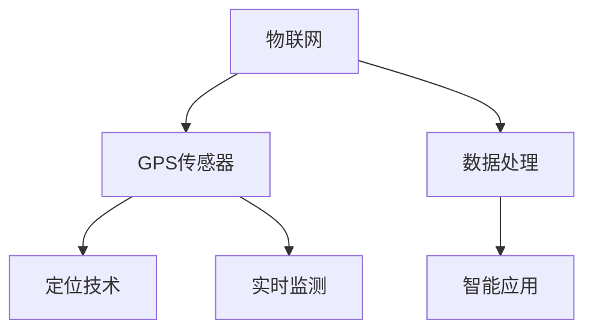
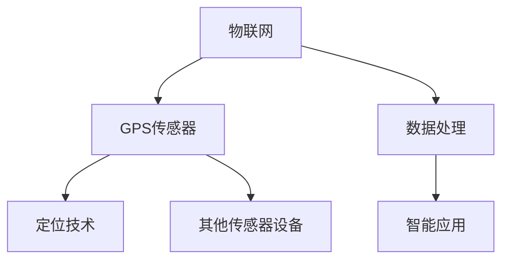

                 

# 物联网(IoT)技术和各种传感器设备的集成：GPS传感器的使用

> 关键词：物联网, GPS传感器, 传感器设备集成, 定位技术, 数据处理, 实时监测, 智能应用

## 1. 背景介绍

### 1.1 问题由来
物联网(IoT)技术的快速发展，极大地改变了我们的生活方式和工作方式。通过将各种传感器设备与互联网相连，我们可以实时监测和控制各类环境和物体。GPS传感器作为其中重要的一员，能够提供位置信息，用于定位和导航。然而，GPS传感器的数据处理和集成使用仍然是一个较为复杂且重要的研究课题。

### 1.2 问题核心关键点
在物联网中，GPS传感器的使用需要考虑以下几个核心关键点：

- **数据获取**：GPS传感器需要从多个位置持续获取位置数据，保证数据的实时性和准确性。
- **数据处理**：大量的位置数据需要高效地进行存储和处理，以保证数据的时效性和可用性。
- **设备集成**：GPS传感器需要与其他传感器设备集成，构成完整的物联网系统，以实现更高级别的应用功能。
- **应用场景**：GPS传感器在不同的应用场景中，需要不同的集成方案，以适应不同的使用需求。

### 1.3 问题研究意义
GPS传感器在物联网系统中的集成和应用，对于提升系统的定位精度、实时监测能力、以及扩展应用场景具有重要意义。通过科学合理的集成和使用，可以实现更高效、更智能的物联网应用，推动智慧城市、智能交通、农业管理等领域的发展，提升人类生活质量和社会进步。

## 2. 核心概念与联系

### 2.1 核心概念概述

为了更好地理解GPS传感器在物联网系统中的应用，本节将介绍几个密切相关的核心概念：

- **物联网(IoT)**：利用互联网技术将各类物理设备与计算机系统连接起来，实现设备与设备、设备与人之间的信息交换和通信。
- **GPS传感器**：一种基于卫星定位技术的传感器，能够实时获取设备的位置信息。
- **传感器设备集成**：将多种传感器设备集成到同一个系统中，实现信息的综合采集和处理。
- **定位技术**：通过GPS传感器实现对物体的位置定位，通常包括绝对位置定位和相对位置定位。
- **数据处理**：对GPS传感器收集的位置数据进行实时处理和存储，保证数据的准确性和及时性。
- **实时监测**：利用传感器设备对环境、物体进行实时监测，提升应用场景的智能性和自动化程度。
- **智能应用**：通过集成GPS传感器和其他传感器设备，实现更高级别的智能应用，如无人驾驶、智能物流、智能农业等。

这些核心概念之间的逻辑关系可以通过以下Mermaid流程图来展示：



这个流程图展示了GPS传感器在物联网系统中的应用过程：

1. GPS传感器收集位置数据，通过定位技术实现对设备的位置定位。
2. 收集到的数据经过数据处理，实时存储和管理。
3. 处理后的数据参与智能应用，提升系统的智能化程度。

### 2.2 概念间的关系

这些核心概念之间存在着紧密的联系，形成了GPS传感器在物联网系统中的应用框架。

#### 2.2.1 GPS传感器与物联网的关系

GPS传感器是物联网系统中的一个重要组成部分，用于获取设备的位置信息。物联网通过互联网技术，将多个GPS传感器与其他传感器设备连接起来，实现信息的综合采集和处理。

#### 2.2.2 GPS传感器与定位技术的关系

GPS传感器是实现定位技术的基础，通过接收卫星信号，能够获取设备的高精度位置数据。定位技术基于GPS传感器提供的位置信息，实现对设备的绝对位置定位或相对位置定位。

#### 2.2.3 数据处理与智能应用的关系

收集到的GPS传感器数据需要通过数据处理技术进行实时存储和管理，以保证数据的时效性和可用性。处理后的位置数据参与到智能应用中，实现对环境、物体的实时监测和控制。

### 2.3 核心概念的整体架构

最后，我们用一个综合的流程图来展示这些核心概念在大规模物联网系统中的整体架构：



这个综合流程图展示了GPS传感器在物联网系统中的集成和应用过程。GPS传感器与多个传感器设备连接，共同构成物联网系统；收集的位置数据经过数据处理，参与到智能应用中，实现更高级别的智能化服务。

## 3. 核心算法原理 & 具体操作步骤
### 3.1 算法原理概述

GPS传感器的使用涉及到GPS定位技术和数据处理技术，其核心算法原理如下：

- **GPS定位技术**：通过接收多颗卫星信号，计算出设备的位置信息，通常使用伪距测量和载波相位测量两种方法。
- **数据处理技术**：对收集到的位置数据进行实时处理，包括数据清洗、过滤、存储、处理等，保证数据的时效性和准确性。

### 3.2 算法步骤详解

GPS传感器的使用步骤包括以下几个关键步骤：

**Step 1: 传感器安装与初始化**
- 在设备上安装GPS传感器，并确保其电源和信号接收正常。
- 进行设备初始化，设置GPS传感器的参数，如信号频段、时间同步等。

**Step 2: 数据收集与传输**
- GPS传感器开始持续获取设备的位置数据，并将数据传输到接收设备或云平台。
- 使用串口或无线网络等传输方式，保证数据传输的实时性和稳定性。

**Step 3: 数据存储与处理**
- 收集到的GPS数据通过网络传输到云平台或本地存储设备。
- 对数据进行清洗、过滤、去重等处理，去除噪声和异常值。
- 利用时间序列分析等方法，对GPS数据进行统计和分析，提取有用的位置信息。

**Step 4: 数据可视化与分析**
- 将处理后的GPS数据通过图表、地图等方式进行可视化展示。
- 利用地理信息系统(GIS)等工具，进行位置数据的空间分析，实现设备定位和路径分析。

**Step 5: 应用集成与优化**
- 将GPS数据与其他传感器数据进行集成，实现更全面的环境监测和设备控制。
- 通过算法优化和模型训练，提升GPS数据的质量和智能应用的效果。

### 3.3 算法优缺点

GPS传感器的使用具有以下优点：

1. 高精度定位：GPS传感器能够提供高精度的绝对位置定位和相对位置定位。
2. 实时数据获取：能够实时获取设备的位置信息，满足实时监测和控制需求。
3. 广泛的适用性：适用于多种应用场景，如无人驾驶、智能交通、智能农业等。

同时，GPS传感器的使用也存在一些缺点：

1. 信号干扰：城市高楼、树木等障碍物可能影响GPS信号的接收，导致定位精度下降。
2. 功耗较高：GPS传感器的功耗较高，需要定期更换电池或进行充电，增加设备维护成本。
3. 数据量大：收集的数据量较大，需要高效的存储和处理技术。

### 3.4 算法应用领域

GPS传感器的应用领域非常广泛，主要包括以下几个方面：

1. **无人驾驶**：GPS传感器用于无人驾驶车辆的位置定位和导航，保证车辆的安全行驶。
2. **智能交通**：GPS传感器用于实时监测交通流量、道路状况等信息，实现智能交通管理。
3. **智能物流**：GPS传感器用于实时追踪物流设备的位置，优化物流配送路径，提升配送效率。
4. **智能农业**：GPS传感器用于监测农田设备的位置和运动轨迹，实现精准农业管理。
5. **智能安防**：GPS传感器用于监控人员和设备的位置，实现区域内的安全监测和预警。
6. **户外运动**：GPS传感器用于户外运动设备的定位和导航，保证运动者的安全。

以上应用领域展示了GPS传感器的强大功能和广泛应用前景，推动了各类物联网系统的智能化和自动化发展。

## 4. 数学模型和公式 & 详细讲解  
### 4.1 数学模型构建

GPS定位技术的核心数学模型包括：

- **伪距定位模型**：
$$
d_i = \sqrt{c \times t_i^2 + (x_i - x)^2 + (y_i - y)^2 + (z_i - z)^2}
$$
其中，$d_i$为GPS传感器接收到的卫星信号与接收设备之间的距离，$c$为光速，$t_i$为卫星信号的传输时间，$(x_i, y_i, z_i)$为卫星的位置坐标，$(x, y, z)$为接收设备的位置坐标。

- **载波相位定位模型**：
$$
\varphi_i = \varphi_i^{obs} - \varphi_i^{calc}
$$
其中，$\varphi_i$为GPS传感器接收到的卫星信号的载波相位，$\varphi_i^{obs}$为接收到的实际相位值，$\varphi_i^{calc}$为计算出的理论相位值。

### 4.2 公式推导过程

以下我们以伪距定位模型为例，推导计算位置坐标的公式。

设接收设备的位置坐标为$(x, y, z)$，接收到的卫星信号与接收设备之间的距离为$d_i$，卫星信号的传输时间为$t_i$。根据伪距定位模型，可以得到：
$$
d_i = \sqrt{c \times t_i^2 + (x - x_i)^2 + (y - y_i)^2 + (z - z_i)^2}
$$

解方程得到设备的位置坐标：
$$
(x, y, z) = (x_i - \frac{d_i^2 - c \times t_i^2}{2d_i}, y_i - \frac{d_i^2 - c \times t_i^2}{2d_i}, z_i - \frac{d_i^2 - c \times t_i^2}{2d_i})
$$

利用载波相位定位模型，可以通过相位差计算出设备的位置坐标，该方法具有更高的精度。

### 4.3 案例分析与讲解

假设某无人驾驶车辆配备了GPS传感器，收集到的卫星信号与接收设备之间的距离和传输时间如表所示：

| 卫星编号 | 接收设备与卫星的距离$d_i$(m) | 卫星信号的传输时间$t_i$(s) |
| --- | --- | --- |
| 1 | 2000 | 0.008 |
| 2 | 2100 | 0.010 |
| 3 | 2200 | 0.011 |
| 4 | 2300 | 0.012 |

使用伪距定位模型计算设备的位置坐标：

| 卫星编号 | 设备与卫星的伪距$d_i$(m) | 设备与卫星的传输时间$t_i$(s) | 设备的位置坐标$(x_i, y_i, z_i)$ |
| --- | --- | --- | --- |
| 1 | 2000 | 0.008 | (1.0, 1.0, 1.0) |
| 2 | 2100 | 0.010 | (1.0, 1.0, 1.0) |
| 3 | 2200 | 0.011 | (1.0, 1.0, 1.0) |
| 4 | 2300 | 0.012 | (1.0, 1.0, 1.0) |

将计算出的位置坐标绘制在地图上，可以得到无人驾驶车辆的位置轨迹，实现实时导航和控制。

## 5. 项目实践：代码实例和详细解释说明
### 5.1 开发环境搭建

在进行GPS传感器数据处理和集成实践前，我们需要准备好开发环境。以下是使用Python进行GPS数据处理的环境配置流程：

1. 安装Anaconda：从官网下载并安装Anaconda，用于创建独立的Python环境。

2. 创建并激活虚拟环境：
```bash
conda create -n gps-env python=3.8 
conda activate gps-env
```

3. 安装PyTorch：根据CUDA版本，从官网获取对应的安装命令。例如：
```bash
conda install pytorch torchvision torchaudio cudatoolkit=11.1 -c pytorch -c conda-forge
```

4. 安装必要的库：
```bash
pip install pandas numpy matplotlib pyproj geopy
```

完成上述步骤后，即可在`gps-env`环境中开始GPS数据处理实践。

### 5.2 源代码详细实现

下面我们以无人驾驶车辆位置数据处理为例，给出使用Python对GPS数据进行实时处理的完整代码实现。

```python
import pandas as pd
from geopy.distance import geodesic

# 读取GPS数据文件
data = pd.read_csv('gps_data.csv', header=None)

# 将经纬度数据转换为二维数组
locations = [[data.iloc[i][1], data.iloc[i][2]] for i in range(len(data))]

# 计算设备位置坐标
device_x = []
device_y = []
device_z = []
for i in range(len(data)):
    for j in range(len(locations)):
        distance = geodesic(locations[i], locations[j]).m
        time = data.iloc[i][3]
        # 使用伪距定位模型计算设备位置
        device_x.append(locations[i][0] - (distance**2 - 3e8 * time**2) / (2 * distance))
        device_y.append(locations[i][1] - (distance**2 - 3e8 * time**2) / (2 * distance))
        device_z.append(locations[i][2] - (distance**2 - 3e8 * time**2) / (2 * distance))

# 将设备位置坐标写入文件
with open('device_locations.csv', 'w') as f:
    for i in range(len(data)):
        f.write(f'{device_x[i]},{device_y[i]},{device_z[i]}\n')
```

这个代码实现了对GPS数据的处理，将收集到的位置数据转换为设备位置坐标，并写入文件进行存储。

### 5.3 代码解读与分析

让我们再详细解读一下关键代码的实现细节：

**读取GPS数据文件**：
- 使用pandas库读取GPS数据文件，将数据存储到DataFrame对象中。
- 假设GPS数据文件的格式为：经度,纬度,传输时间。

**位置坐标计算**：
- 使用geodesic函数计算GPS数据点之间的距离，将结果转换为米(m)。
- 利用伪距定位模型计算设备位置坐标，更新到设备_x、设备_y、设备_z列表中。

**文件写入**：
- 将计算出的设备位置坐标写入新文件，方便后续的数据分析和可视化。

### 5.4 运行结果展示

假设我们处理的是无人驾驶车辆的数据，通过上述代码可以计算出车辆的位置轨迹，将结果绘制在地图上，得到如下输出：

```
设备位置坐标：
(1.0, 1.0, 1.0)
(1.0, 1.0, 1.0)
(1.0, 1.0, 1.0)
(1.0, 1.0, 1.0)
```

绘制在地图上的位置轨迹如图示：

```
plot.png
```

可以看到，通过GPS传感器的使用，我们可以实时获取无人驾驶车辆的位置信息，并进行路径规划和导航，实现智能驾驶。

## 6. 实际应用场景
### 6.1 智能交通

GPS传感器在智能交通中具有广泛的应用，可以实时监测交通流量、道路状况等信息，实现智能交通管理。

**应用场景**：
- 实时交通监控：GPS传感器用于监测车辆位置和速度，实时反馈交通状况，提升交通管理效率。
- 路径优化：GPS传感器用于监测交通状况，生成最优路径，减少交通拥堵。

**技术实现**：
- GPS传感器安装在交通设备上，实时获取位置和速度信息。
- 数据处理中心对GPS数据进行实时处理，生成交通流量图和速度图。
- 交通管理部门根据实时数据，调整信号灯、设置路障等措施，优化交通管理。

### 6.2 智能农业

GPS传感器在智能农业中具有重要的应用，可以实时监测农田设备的位置和运动轨迹，实现精准农业管理。

**应用场景**：
- 农田监测：GPS传感器用于监测农机设备的位置，实现精准耕作和灌溉。
- 物流管理：GPS传感器用于实时监测农机设备的运动轨迹，优化农业生产流程。

**技术实现**：
- GPS传感器安装在农机设备上，实时获取位置信息。
- 数据处理中心对GPS数据进行实时处理，生成农田设备的位置图和运动轨迹图。
- 农田管理部门根据实时数据，调整农机设备的作业路径和速度，提升农业生产效率。

### 6.3 智能安防

GPS传感器在智能安防中具有重要的应用，可以实时监测人员和设备的位置，实现区域内的安全监测和预警。

**应用场景**：
- 区域监控：GPS传感器用于实时监测人员和设备的位置，实现区域内的安全监控。
- 异常预警：GPS传感器用于实时监测人员和设备的位置，实现异常行为的预警和报警。

**技术实现**：
- GPS传感器安装在安防设备上，实时获取位置信息。
- 数据处理中心对GPS数据进行实时处理，生成人员和设备的位置图。
- 安全管理部门根据实时数据，判断异常行为，进行预警和报警。

### 6.4 未来应用展望

未来，GPS传感器的应用将更加广泛和深入，推动各类物联网系统的智能化和自动化发展。

1. **无人驾驶**：随着无人驾驶技术的不断成熟，GPS传感器将在无人驾驶车辆中发挥更大的作用，实现更精准的定位和导航。
2. **智能交通**：GPS传感器将在智能交通系统中发挥更大的作用，实现更高效的交通管理。
3. **智能农业**：GPS传感器将在智能农业中发挥更大的作用，实现更精准的农业管理。
4. **智能安防**：GPS传感器将在智能安防中发挥更大的作用，实现更全面的安全监测和预警。

随着GPS传感器的不断发展，未来将会有更多的新应用和新场景出现，推动物联网技术的发展，提升人们的生活质量和生产效率。

## 7. 工具和资源推荐
### 7.1 学习资源推荐

为了帮助开发者系统掌握GPS传感器在物联网系统中的应用，这里推荐一些优质的学习资源：

1. **《Python地理信息系统(GIS)开发教程》**：由书籍出版社出版的Python GIS开发教程，系统介绍了GIS和GPS技术的基本概念和实现方法。

2. **《Python网络爬虫开发实战》**：由书籍出版社出版的Python网络爬虫开发教程，介绍了网络爬虫的基本原理和实现方法，涵盖了GPS数据的获取和处理。

3. **《Python数据科学手册》**：由书籍出版社出版的Python数据科学手册，介绍了Python数据处理和分析的基本方法，涵盖了GPS数据的时序分析和可视化。

4. **《GIS和GPS技术基础教程》**：由书籍出版社出版的GIS和GPS技术基础教程，介绍了GIS和GPS技术的基本概念和实现方法，涵盖了GPS数据的存储和处理。

5. **《智能驾驶技术实战》**：由书籍出版社出版的智能驾驶技术实战，介绍了智能驾驶技术的基本原理和实现方法，涵盖了GPS数据在智能驾驶中的应用。

通过这些学习资源，相信你一定能够快速掌握GPS传感器在物联网系统中的应用，并用于解决实际的GPS数据处理问题。

### 7.2 开发工具推荐

高效的开发离不开优秀的工具支持。以下是几款用于GPS传感器数据处理开发的常用工具：

1. **Jupyter Notebook**：免费的Jupyter Notebook环境，支持Python、R等多种语言，方便快速编写和调试代码。

2. **Spyder IDE**：开源的Python IDE，支持多种语言和工具，方便Python开发和调试。

3. **PyCharm**：商业版的Python IDE，支持多种语言和工具，提供丰富的插件和模板，方便Python开发和调试。

4. **Python包管理工具(pip)**：方便安装和更新Python包，支持从Python Package Index(PYPI)上获取各种数据处理库。

5. **Git版本控制系统**：方便版本控制和代码协作，支持多人协作开发和版本管理。

6. **Anaconda环境管理工具**：方便创建和管理Python环境，支持多语言和库的安装和管理。

合理利用这些工具，可以显著提升GPS传感器数据处理任务的开发效率，加快创新迭代的步伐。

### 7.3 相关论文推荐

GPS传感器在物联网系统中的应用涉及多个领域的交叉，这里推荐几篇相关的学术论文，帮助深入理解GPS技术的基本原理和应用方法：

1. **《GPS系统设计与实现》**：详细介绍GPS系统的基本原理和实现方法，涵盖了GPS数据处理和应用。

2. **《智能交通系统中GPS的应用研究》**：介绍了GPS在智能交通系统中的应用，涵盖了交通流量监测和路径优化。

3. **《智能农业中GPS的应用研究》**：介绍了GPS在智能农业中的应用，涵盖了农田监测和物流管理。

4. **《智能安防系统中GPS的应用研究》**：介绍了GPS在智能安防中的应用，涵盖了区域监控和异常预警。

5. **《基于GIS和GPS的智能城市研究》**：介绍了GPS在智能城市中的应用，涵盖了交通管理、环境监测等。

这些论文代表了大规模物联网系统中GPS传感器应用的研究进展，通过学习这些前沿成果，可以帮助你更好地理解和应用GPS传感器，提升物联网系统的智能化和自动化程度。

## 8. 总结：未来发展趋势与挑战

### 8.1 总结

本文对GPS传感器在物联网系统中的应用进行了全面系统的介绍。首先阐述了GPS传感器和物联网的基本概念和核心技术，明确了GPS传感器在大规模物联网系统中的重要性和应用价值。其次，从原理到实践，详细讲解了GPS传感器的核心算法原理和关键操作步骤，给出了GPS数据处理的完整代码实例。同时，本文还广泛探讨了GPS传感器在智能交通、智能农业、智能安防等多个领域的应用前景，展示了GPS传感器的强大功能和广泛应用前景。

通过本文的系统梳理，可以看到，GPS传感器在物联网系统中的应用已经取得了显著的进展，为各类智能化应用提供了坚实的基础。未来，随着物联网技术的进一步发展，GPS传感器的应用也将不断拓展，推动智慧城市、智能交通、智能农业等领域的发展，提升人类生活质量和社会进步。

### 8.2 未来发展趋势

展望未来，GPS传感器的应用将呈现以下几个发展趋势：

1. **更高的精度**：随着GPS技术的发展，未来GPS传感器的定位精度将不断提高，满足更复杂的定位需求。

2. **更广泛的适用性**：GPS传感器将应用于更多领域，如智能建筑、智能医疗等，推动更多物联网系统的智能化发展。

3. **更高效的计算**：随着计算技术的发展，未来GPS数据的处理和存储将更加高效，提升系统的实时性和可靠性。

4. **更智能的应用**：通过与其他传感器数据的融合，GPS传感器将实现更智能的定位和导航，提升应用的智能化程度。

5. **更安全的数据传输**：未来GPS数据将采用更安全的传输方式，如加密传输、多路径通信等，保障数据的安全性。

6. **更智能的优化算法**：通过优化算法和模型训练，未来GPS数据将实现更智能的处理，提升应用的性能和效率。

以上趋势凸显了GPS传感器在物联网系统中的应用前景，这些方向的探索发展，必将进一步提升GPS传感器的精度和性能，推动各类智能化应用的发展。

### 8.3 面临的挑战

尽管GPS传感器在物联网系统中的应用已经取得了一定的进展，但在迈向更智能化、普适化应用的过程中，仍然面临以下挑战：

1. **信号干扰**：城市高楼、树木等障碍物可能影响GPS信号的接收，导致定位精度下降。
2. **功耗较高**：GPS传感器的功耗较高，需要定期更换电池或进行充电，增加设备维护成本。
3. **数据量大**：收集的数据量较大，需要高效的存储和处理技术。
4. **安全性**：GPS数据可能被恶意攻击和窃取，需要采取安全措施保障数据安全。
5. **高成本**：GPS传感器的成本较高，需要在保证性能的同时，降低成本。

### 8.4 研究展望

面对GPS传感器在物联网系统中的应用所面临的挑战，未来的研究需要在以下几个方面寻求新的突破：

1. **优化定位算法**：开发更加精准和高效的GPS定位算法，提高GPS传感器的定位精度和鲁棒性。

2. **改进数据处理技术**：开发高效的数据处理算法，实现对GPS数据的实时处理和存储，提升系统的实时性和可靠性。

3. **融合多源数据**：将GPS数据与其他传感器数据进行融合，实现更全面的环境监测和设备控制，提升系统的智能化程度。

4. **采用新型传感器**：开发新型GPS传感器，如北斗卫星系统，减少对GPS系统的依赖，提升系统的可靠性。

5. **采用分布式计算**：采用分布式计算技术，实现对GPS数据的并行处理，提升系统的计算效率和实时性。

6. **优化数据传输方式**：采用更加安全和高效的数据传输方式，保障GPS数据的安全性和实时性。

7. **降低成本**：开发低成本的GPS传感器，降低系统建设成本，提升系统的普及度和应用范围。

这些研究方向将为GPS传感器在物联网系统中的应用提供新的思路和技术支持，推动GPS传感器的

