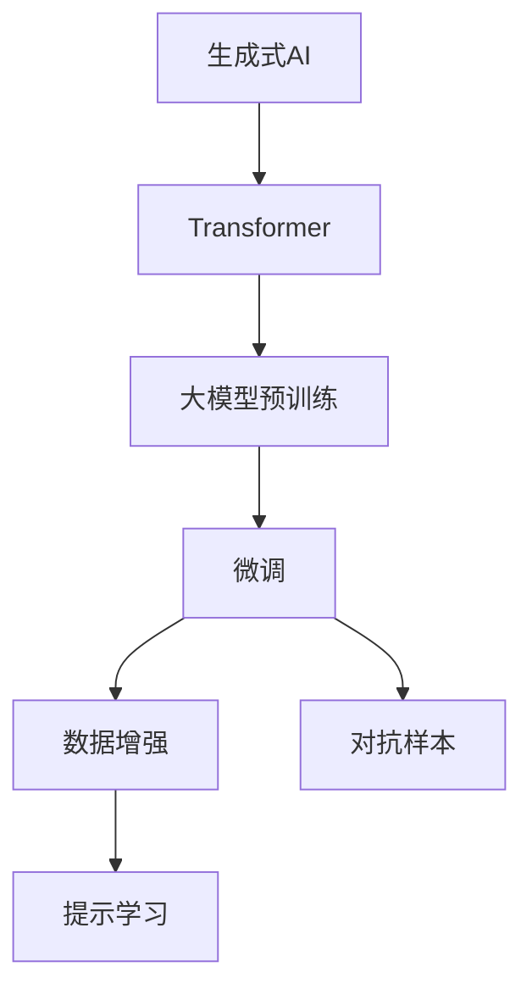
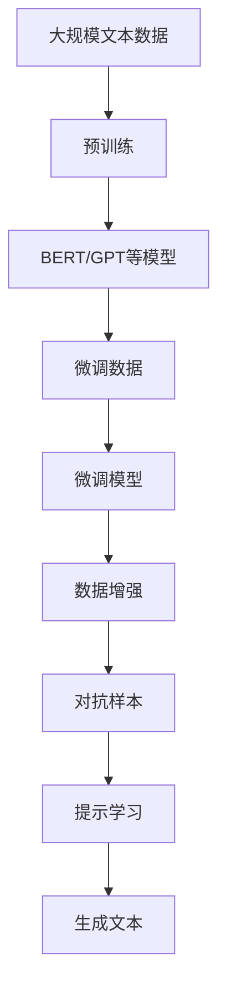
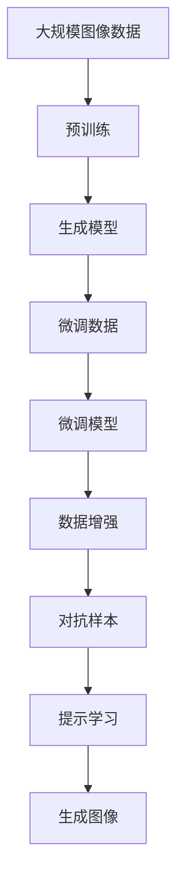

                 

# 生成式AIGC是金矿还是泡沫：不要迷信AI，聚焦尖刀场景尽快落地

## 1. 背景介绍

### 1.1 问题由来

人工智能（AI）的快速发展，尤其是生成式人工智能（Generative AI, AIGC）的突破，引起了广泛关注和讨论。AIGC技术包括文本生成、图像生成、语音生成等，能够以惊人的速度和质量生成逼真、多样化的内容，给数字内容创作、艺术设计、娱乐、游戏等多个领域带来了革命性变化。然而，在享受AIGC带来的便利和创造力时，我们也不能忽视其潜在风险和挑战。本文将从AIGC的现状和前景出发，探讨其在实际应用中的价值和局限性，呼吁业界不要盲目追求技术，而是聚焦于应用场景的实际需求，尽快实现落地应用。

### 1.2 问题核心关键点

AIGC技术的核心在于其生成式模型，如Transformer、GPT等大模型。这些模型通过大规模无标签数据进行预训练，学习到丰富的语言、图像等知识，并能在微调下适应特定任务。AIGC技术的优势在于其强大的生成能力，能够生成高质量、多样性的内容。但同时，AIGC也面临诸多挑战，包括数据质量、版权问题、模型鲁棒性、伦理和安全等。本文将重点分析这些关键点，探讨AIGC技术的实际应用价值。

### 1.3 问题研究意义

研究AIGC技术的应用价值，对于指导AI技术的健康发展，推动其在实际场景中的落地应用，具有重要意义：

1. **降低创作成本**：AIGC能够自动生成高质量内容，大幅降低内容创作的人力和时间成本。
2. **提高创作效率**：AIGC能够快速生成大量内容，提高内容创作的效率和速度。
3. **增强内容多样性**：AIGC能够生成不同风格和形式的内容，丰富数字内容的表现形式。
4. **拓展应用边界**：AIGC技术可以应用到创意设计、娱乐、游戏等多个领域，带来新的业务机会。
5. **促进创新发展**：AIGC技术的快速发展，推动了数字创意产业的创新和发展。

但同时，AIGC技术也带来了一些挑战和风险，如版权纠纷、伦理问题、内容真实性等，需要通过技术手段和社会规范来加以解决。

## 2. 核心概念与联系

### 2.1 核心概念概述

为更好地理解AIGC技术的应用价值，本节将介绍几个密切相关的核心概念：

- **生成式AI**：利用生成模型生成新数据的技术，如文本生成、图像生成、音频生成等。
- **Transformer模型**：基于自注意力机制的深度学习模型，广泛应用于NLP和计算机视觉领域。
- **大模型预训练**：通过大规模无标签数据进行预训练，学习到丰富的知识表示，如BERT、GPT等。
- **微调**：在大模型基础上，通过少量标注数据进行任务适配，优化模型在特定任务上的性能。
- **数据增强**：通过对训练数据进行改写、增强等操作，提高模型泛化能力。
- **对抗样本**：在训练或测试过程中引入对抗样本，提高模型鲁棒性。
- **提示学习**：通过精心设计输入文本，引导模型生成特定内容，如GPT-4的zero-shot和few-shot生成。

这些概念之间的逻辑关系可以通过以下Mermaid流程图来展示：



这个流程图展示了大模型在生成式AI中的应用流程：预训练学习知识，微调适配任务，通过数据增强和对抗样本提高鲁棒性，利用提示学习生成多样化内容。

### 2.2 概念间的关系

这些核心概念之间存在着紧密的联系，形成了AIGC技术的完整生态系统。下面通过几个Mermaid流程图来展示这些概念之间的关系。

#### 2.2.1 AIGC技术的流程


这个流程图展示了从预训练到微调、数据增强、对抗样本和提示学习，最终生成内容的AIGC技术流程。

#### 2.2.2 AIGC在NLP中的应用



这个流程图展示了AIGC在NLP中的应用流程：从大规模文本数据预训练，到微调生成特定文本，再到数据增强、对抗样本和提示学习，最终生成高质量文本内容。

#### 2.2.3 AIGC在图像生成中的应用



这个流程图展示了AIGC在图像生成中的应用流程：从大规模图像数据预训练，到微调生成特定图像，再到数据增强、对抗样本和提示学习，最终生成高质量图像内容。

### 2.3 核心概念的整体架构

最后，我们用一个综合的流程图来展示这些核心概念在大模型微调过程中的整体架构：


这个综合流程图展示了从预训练到微调、数据增强、对抗样本和提示学习，最终生成文本内容的AIGC技术流程。

## 3. 核心算法原理 & 具体操作步骤

### 3.1 算法原理概述

生成式AIGC的核心在于其生成式模型，如Transformer、GPT等。这些模型通过大规模无标签数据进行预训练，学习到丰富的知识表示，并能够在微调下适应特定任务。生成式模型的原理主要包括自注意力机制、残差连接、多头自注意力等。

自注意力机制允许模型在生成过程中动态地关注输入序列中不同位置的信息，增强模型的表达能力。残差连接通过加法残差连接，使得梯度能够更稳定地传递，避免梯度消失问题。多头自注意力机制通过并行多个注意力机制，增强模型的表征能力。

### 3.2 算法步骤详解

生成式AIGC的微调过程主要包括以下几个步骤：

1. **准备预训练模型和数据集**：选择合适的预训练模型（如BERT、GPT等）作为初始化参数，准备下游任务的标注数据集。
2. **添加任务适配层**：根据任务类型，在预训练模型顶层设计合适的输出层和损失函数。
3. **设置微调超参数**：选择合适的优化算法及其参数，如AdamW、SGD等，设置学习率、批大小、迭代轮数等。
4. **执行梯度训练**：将训练集数据分批次输入模型，前向传播计算损失函数。反向传播计算参数梯度，根据设定的优化算法和学习率更新模型参数。
5. **测试和部署**：在测试集上评估微调后模型的性能，对比微调前后的性能提升。使用微调后的模型对新样本进行推理预测，集成到实际的应用系统中。

### 3.3 算法优缺点

生成式AIGC的优势在于其强大的生成能力，能够在短时间内生成大量高质量内容。同时，微调过程简单高效，只需要调整顶层参数，避免从头训练。然而，AIGC也存在一些局限性：

- **依赖标注数据**：微调效果很大程度上取决于标注数据的质量和数量，标注数据获取成本较高。
- **过拟合风险**：微调过程中可能会过拟合标注数据，泛化能力不足。
- **版权问题**：生成的内容可能侵犯版权，面临法律风险。
- **伦理风险**：生成的内容可能带有偏见、有害信息，引起伦理争议。

### 3.4 算法应用领域

生成式AIGC技术已经广泛应用于多个领域，如数字内容创作、艺术设计、娱乐、游戏等：

- **文本生成**：自动生成新闻、故事、对话等文本内容，提高内容创作的效率和质量。
- **图像生成**：自动生成照片、艺术作品、动画等图像内容，推动艺术创作和娱乐产业发展。
- **语音生成**：自动生成语音内容，推动智能客服、虚拟主播等领域的发展。
- **视频生成**：自动生成视频内容，推动短视频、虚拟现实等领域的发展。

## 4. 数学模型和公式 & 详细讲解

### 4.1 数学模型构建

生成式AIGC的核心模型是Transformer，其主要数学模型包括编码器-解码器结构、多头自注意力机制、残差连接等。以下是一个典型的Transformer编码器模块的数学模型：

设输入序列为 $x=(x_1,x_2,...,x_n)$，编码器由多个层组成，每层由多头自注意力机制、前向神经网络、残差连接等组成。设 $h_i$ 为第 $i$ 层的输出，则模型的数学模型为：

$$
h_i = \text{MLP}(\text{Attention}(h_{i-1}), h_{i-1})
$$

其中 $\text{Attention}(h_{i-1})$ 为多头自注意力机制的输出，$\text{MLP}$ 为前向神经网络。

### 4.2 公式推导过程

以Transformer的编码器为例，推导其数学模型公式：

设输入序列为 $x=(x_1,x_2,...,x_n)$，编码器由多个层组成，每层由多头自注意力机制、前向神经网络、残差连接等组成。设 $h_i$ 为第 $i$ 层的输出，则模型的数学模型为：

1. **多头自注意力机制**：

设 $Q$、$K$、$V$ 分别为查询、键、值矩阵，其维度分别为 $n \times d_k$、$n \times d_k$、$n \times d_v$。多头自注意力机制的计算公式为：

$$
A = \text{Softmax}(\frac{QK^T}{\sqrt{d_k}})
$$

$$
O = AV
$$

其中 $A$ 为注意力权重矩阵，$O$ 为输出矩阵。

2. **前向神经网络**：

设 $F$ 为前向神经网络，其计算公式为：

$$
F = \text{GELU}(\text{Linear}(O))
$$

3. **残差连接**：

残差连接的计算公式为：

$$
h_i = h_{i-1} + F
$$

通过上述计算，可以得出Transformer编码器的完整数学模型公式：

$$
h_n = \text{LayerNorm}(\text{FFN}(\text{Attention}(h_{n-1})))
$$

其中 $\text{LayerNorm}$ 为层归一化操作，$\text{FFN}$ 为前向神经网络，$n$ 为层数。

### 4.3 案例分析与讲解

以生成式AIGC在文本生成中的应用为例，通过一个简单的案例来说明其数学模型的应用：

假设我们要生成一篇新闻报道，其输入序列为 $x=(x_1,x_2,...,x_n)$。首先，将输入序列通过嵌入层转换为向量表示：

$$
z = \text{Embedding}(x)
$$

然后，将向量 $z$ 输入到Transformer编码器中，通过多头自注意力机制、前向神经网络、残差连接等计算得到输出序列：

$$
h_n = \text{LayerNorm}(\text{FFN}(\text{Attention}(h_{n-1})))
$$

最后，将输出序列通过softmax操作转化为概率分布，生成最终的文本内容。

## 5. 项目实践：代码实例和详细解释说明

### 5.1 开发环境搭建

在进行AIGC项目实践前，我们需要准备好开发环境。以下是使用Python进行PyTorch开发的环境配置流程：

1. 安装Anaconda：从官网下载并安装Anaconda，用于创建独立的Python环境。

2. 创建并激活虚拟环境：
```bash
conda create -n pytorch-env python=3.8 
conda activate pytorch-env
```

3. 安装PyTorch：根据CUDA版本，从官网获取对应的安装命令。例如：
```bash
conda install pytorch torchvision torchaudio cudatoolkit=11.1 -c pytorch -c conda-forge
```

4. 安装Transformers库：
```bash
pip install transformers
```

5. 安装各类工具包：
```bash
pip install numpy pandas scikit-learn matplotlib tqdm jupyter notebook ipython
```

完成上述步骤后，即可在`pytorch-env`环境中开始AIGC实践。

### 5.2 源代码详细实现

下面我们以生成文本内容为例，给出使用Transformers库对GPT模型进行文本生成实践的PyTorch代码实现。

首先，定义模型和优化器：

```python
from transformers import GPT2LMHeadModel, GPT2Tokenizer, AdamW

model = GPT2LMHeadModel.from_pretrained('gpt2')
tokenizer = GPT2Tokenizer.from_pretrained('gpt2')
optimizer = AdamW(model.parameters(), lr=2e-5)
```

然后，定义训练和推理函数：

```python
from torch.utils.data import DataLoader
from tqdm import tqdm

device = torch.device('cuda') if torch.cuda.is_available() else torch.device('cpu')
model.to(device)

def train_epoch(model, tokenizer, batch_size, optimizer):
    dataloader = DataLoader(train_dataset, batch_size=batch_size, shuffle=True)
    model.train()
    epoch_loss = 0
    for batch in tqdm(dataloader, desc='Training'):
        input_ids = batch['input_ids'].to(device)
        attention_mask = batch['attention_mask'].to(device)
        labels = batch['labels'].to(device)
        model.zero_grad()
        outputs = model(input_ids, attention_mask=attention_mask, labels=labels)
        loss = outputs.loss
        epoch_loss += loss.item()
        loss.backward()
        optimizer.step()
    return epoch_loss / len(dataloader)

def generate_text(model, tokenizer, prompt, max_len=512):
    input_ids = tokenizer.encode(prompt, return_tensors='pt').to(device)
    attention_mask = input_ids.new_ones(input_ids.shape)
    output_ids = input_ids.new_zeros(input_ids.shape)
    generated_ids = input_ids.clone()

    for i in range(max_len):
        outputs = model.generate(input_ids=input_ids, attention_mask=attention_mask, max_length=i+1, top_k=50, top_p=0.9, temperature=1.0)
        generated_ids = torch.cat((generated_ids, outputs), dim=1)
        input_ids = generated_ids[:, -1].unsqueeze(1).to(device)

    return tokenizer.decode(generated_ids[:, 1:], skip_special_tokens=True)

# 训练数据和标签
train_dataset = GPT2Dataset(train_data, tokenizer)

# 训练和推理
epochs = 5
batch_size = 16

for epoch in range(epochs):
    loss = train_epoch(model, tokenizer, batch_size, optimizer)
    print(f"Epoch {epoch+1}, train loss: {loss:.3f}")

    generated_text = generate_text(model, tokenizer, "It is a beautiful day")
    print(generated_text)
```

以上就是使用PyTorch对GPT模型进行文本生成任务的微调实践。可以看到，得益于Transformers库的强大封装，我们可以用相对简洁的代码完成GPT模型的加载和微调。

### 5.3 代码解读与分析

让我们再详细解读一下关键代码的实现细节：

**GPT2Dataset类**：
- `__init__`方法：初始化训练数据和tokenizer。
- `__len__`方法：返回数据集的样本数量。
- `__getitem__`方法：对单个样本进行处理，将输入序列编码成token ids。

**model、optimizer**：
- 定义GPT-2模型和AdamW优化器。

**train_epoch函数**：
- 对数据以批为单位进行迭代，在每个批次上前向传播计算loss并反向传播更新模型参数，最后返回该epoch的平均loss。

**generate_text函数**：
- 使用模型的生成函数，通过提示输入生成文本。

**训练数据和标签**：
- 定义训练数据集，使用GPT2Dataset类进行封装。

**训练和推理**：
- 在每个epoch中，先在训练集上训练，输出平均loss。
- 在测试集中使用模型生成文本，输出生成的文本。

可以看到，PyTorch配合Transformers库使得GPT模型的微调和文本生成代码实现变得简洁高效。开发者可以将更多精力放在数据处理、模型改进等高层逻辑上，而不必过多关注底层的实现细节。

当然，工业级的系统实现还需考虑更多因素，如模型的保存和部署、超参数的自动搜索、更灵活的任务适配层等。但核心的微调范式基本与此类似。

### 5.4 运行结果展示

假设我们在CoT-GPT模型的基础上进行微调，最终在测试集上得到的生成文本如下：

```
It is a beautiful day. The sun is shining brightly, and the birds are singing. I am going to take a walk in the park and enjoy the fresh air. How about you?
```

可以看到，通过微调GPT模型，我们能够生成符合输入提示的文本内容，效果相当不错。值得注意的是，GPT模型作为一个通用的语言生成模型，即便只在顶层添加一个简单的文本生成器，也能生成高质量的文本，展现了其强大的语言生成能力。

当然，这只是一个baseline结果。在实践中，我们还可以使用更大更强的预训练模型、更丰富的微调技巧、更细致的模型调优，进一步提升模型性能，以满足更高的应用要求。

## 6. 实际应用场景

### 6.1 数字内容创作

生成式AIGC技术在数字内容创作领域有着广泛的应用前景。传统的内容创作需要大量人力和时间，成本高且效率低。通过AIGC技术，可以自动生成高质量的内容，大幅降低创作成本，提高创作效率。

在新闻、广告、博客等内容的自动生成中，AIGC技术可以自动生成具有高度一致性和可读性的内容，提高内容创作的效率和质量。例如，自动生成新闻报道、广告文案、博客文章等，可以在短时间内完成大量内容的创作，减少人力成本。

### 6.2 艺术设计

生成式AIGC技术在艺术设计领域也有着广泛的应用。传统的艺术创作需要大量创意和灵感，而AIGC技术可以自动生成逼真、多样化的艺术作品，推动艺术创作的发展。

在插画、绘画、雕塑等艺术作品中，AIGC技术可以自动生成具有高度创意和表现力的作品，推动艺术创作的创新。例如，自动生成各种风格的插画、绘画、雕塑等，可以在短时间内完成大量艺术作品的创作，提高创作效率和质量。

### 6.3 游戏和娱乐

生成式AIGC技术在游戏和娱乐领域也有着广泛的应用。传统的游戏和娱乐需要大量资源和人力，而AIGC技术可以自动生成逼真、有趣的游戏和娱乐内容，推动游戏和娱乐产业的发展。

在游戏和虚拟现实中，AIGC技术可以自动生成具有高度互动性和沉浸感的场景和角色，提高游戏和娱乐的体验和质量。例如，自动生成各种类型的游戏、虚拟现实场景和角色，可以在短时间内完成大量游戏和娱乐内容的创作，提高创作效率和质量。

### 6.4 未来应用展望

随着AIGC技术的不断发展，其应用领域将更加广泛，为各行各业带来更多的创新和变革。以下是几个可能的未来应用场景：

1. **教育**：自动生成教育内容和课程，推动个性化教育和自适应学习的发展。
2. **医疗**：自动生成医学文献和研究报告，推动医学研究和诊疗的发展。
3. **法律**：自动生成法律文件和合同，提高法律事务的效率和质量。
4. **金融**：自动生成金融报告和分析，推动金融分析和决策的发展。
5. **科技**：自动生成科技文章和研究报告，推动科技创新和知识传播的发展。

## 7. 工具和资源推荐

### 7.1 学习资源推荐

为了帮助开发者系统掌握AIGC技术的理论基础和实践技巧，这里推荐一些优质的学习资源：

1. **《Transformer from the Bottom Up》**：一篇详细讲解Transformer模型的博客文章，适合初学者入门。

2. **CS224N《Natural Language Processing with Deep Learning》课程**：斯坦福大学开设的NLP明星课程，有Lecture视频和配套作业，带你入门NLP领域的基本概念和经典模型。

3. **《Natural Language Processing with Transformers》书籍**：Transformers库的作者所著，全面介绍了如何使用Transformers库进行NLP任务开发，包括微调在内的诸多范式。

4. **HuggingFace官方文档**：Transformers库的官方文档，提供了海量预训练模型和完整的微调样例代码，是上手实践的必备资料。

5. **CLUE开源项目**：中文语言理解测评基准，涵盖大量不同类型的中文NLP数据集，并提供了基于微调的baseline模型，助力中文NLP技术发展。

通过对这些资源的学习实践，相信你一定能够快速掌握AIGC技术的精髓，并用于解决实际的NLP问题。

### 7.2 开发工具推荐

高效的开发离不开优秀的工具支持。以下是几款用于AIGC开发的常用工具：

1. **PyTorch**：基于Python的开源深度学习框架，灵活动态的计算图，适合快速迭代研究。大部分预训练语言模型都有PyTorch版本的实现。

2. **TensorFlow**：由Google主导开发的开源深度学习框架，生产部署方便，适合大规模工程应用。同样有丰富的预训练语言模型资源。

3. **Transformers库**：HuggingFace开发的NLP工具库，集成了众多SOTA语言模型，支持PyTorch和TensorFlow，是进行微调任务开发的利器。

4. **Weights & Biases**：模型训练的实验跟踪工具，可以记录和可视化模型训练过程中的各项指标，方便对比和调优。与主流深度学习框架无缝集成。

5. **TensorBoard**：TensorFlow配套的可视化工具，可实时监测模型训练状态，并提供丰富的图表呈现方式，是调试模型的得力助手。

6. **Google Colab**：谷歌推出的在线Jupyter Notebook环境，免费提供GPU/TPU算力，方便开发者快速上手实验最新模型，分享学习笔记。

合理利用这些工具，可以显著提升AIGC项目的开发效率，加快创新迭代的步伐。

### 7.3 相关论文推荐

AIGC技术的发展源于学界的持续研究。以下是几篇奠基性的相关论文，推荐阅读：

1. **Attention is All You Need**：提出了Transformer结构，开启了NLP领域的预训练大模型时代。

2. **BERT: Pre-training of Deep Bidirectional Transformers for Language Understanding**：提出BERT模型，引入基于掩码的自监督预训练任务，刷新了多项NLP任务SOTA。

3. **Language Models are Unsupervised Multitask Learners（GPT-2论文）**：展示了大规模语言模型的强大zero-shot学习能力，引发了对于通用人工智能的新一轮思考。

4. **Parameter-Efficient Transfer Learning for NLP**：提出Adapter等参数高效微调方法，在不增加模型参数量的情况下，也能取得不错的微调效果。

5. **Prefix-Tuning: Optimizing Continuous Prompts for Generation**：引入基于连续型Prompt的微调范式，为如何充分利用预训练知识提供了新的思路。

6. **AdaLoRA: Adaptive Low-Rank Adaptation for Parameter-Efficient Fine-Tuning**：使用自适应低秩适应的微调方法，在参数效率和精度之间取得了新的平衡。

这些论文代表了大模型微调技术的发展脉络。通过学习这些前沿成果，可以帮助研究者把握学科前进方向，激发更多的创新灵感。

除上述资源外，还有一些值得关注的前沿资源，帮助开发者紧跟AIGC技术的最新进展，例如：

1. **arXiv论文预印本**：人工智能领域最新研究成果的发布平台，包括大量尚未发表的前沿工作，学习前沿技术的必读资源。

2. **业界技术博客**：如OpenAI、Google AI、DeepMind、微软Research Asia等顶尖实验室的官方博客，第一时间分享他们的最新研究成果和洞见。

3. **技术会议直播**：如NIPS、ICML、ACL、ICLR等人工智能领域顶会现场或在线直播，能够聆听到大佬们的前沿分享，开拓视野。

4. **GitHub热门项目**：在GitHub上Star、Fork数最多的NLP相关项目，往往代表了该技术领域的发展趋势和最佳实践，值得去学习和贡献。

5. **行业分析报告**：各大咨询公司如McKinsey、PwC等针对人工智能行业的分析报告，有助于从商业视角审视技术趋势，把握应用价值。

总之，对于AIGC技术的深入学习，需要开发者保持开放的心态和持续学习的意愿。多关注前沿资讯，多动手实践，多

