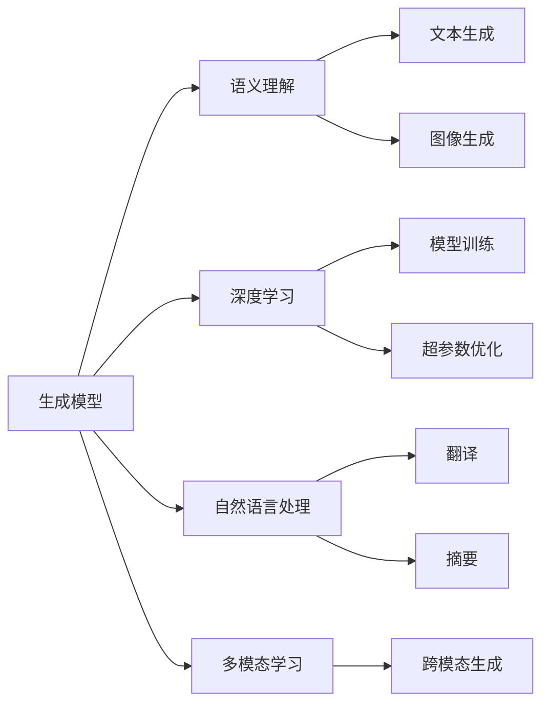

                 

# 生成式AIGC是金矿还是泡沫：缺的不是技术而是“让人尖叫”的用户体验

## 1. 背景介绍

### 1.1 问题由来

随着人工智能技术的发展，生成式人工智能生成内容（AIGC）正在迅速改变内容创作方式，从简单文本生成扩展到图像、音频、视频等全领域。AIGC技术在音乐、影视、游戏、广告等创意行业中展现出巨大潜力，迅速成为了新的生产力工具。然而，尽管AIGC在技术上取得了突破，但其在实际应用中的效果依然参差不齐，用户反馈各异。AIGC应用究竟是带来了真正的新价值，还是被高估的“泡沫”？

### 1.2 问题核心关键点

AIGC的核心关键点在于是否真正提供了“让人尖叫”的用户体验，这是AIGC技术的终极目标。以下是AIGC技术面临的关键问题：

1. **生成质量与逼真度**：生成的内容是否自然、真实、可信，能否达到甚至超越人类的创作水平。
2. **可控性与多样性**：用户能否轻松控制生成内容的风格、类型、情感、主题等，实现个性化的创作。
3. **适应性与应用场景**：技术能否适应不同的应用场景，真正融入到实际工作流中，提升效率和效果。
4. **用户体验与接受度**：技术是否真正触达用户，解决了实际需求，提升了满意度，用户是否愿意持续使用。

AIGC技术的应用需要综合考虑这些核心关键点，而不仅仅是技术指标。因此，缺的不是技术，而是“让人尖叫”的用户体验。

## 2. 核心概念与联系

### 2.1 核心概念概述

生成式人工智能生成内容（AIGC）是通过深度学习等技术，自动化生成文本、图像、音频、视频等多种类型内容的智能系统。AIGC的核心包括：

1. **生成模型**：如变分自编码器（VAE）、生成对抗网络（GAN）、自回归模型（如Transformer）等，用于生成高质量的内容。
2. **语义理解**：理解文本、图像等输入内容，提取语义信息，进行内容生成。
3. **深度学习**：利用大规模数据和深度神经网络模型，学习生成内容的规则和模式。
4. **自然语言处理**：处理和生成自然语言文本，如文本生成、翻译、摘要等。
5. **多模态学习**：结合文本、图像、音频等多种模态数据，实现跨模态内容生成。

### 2.2 概念间的关系

AIGC的各个核心概念之间存在着紧密的联系，形成了生成内容的全链条。其中，生成模型是核心，语义理解和深度学习提供了必要的技术支撑，而自然语言处理和多模态学习则拓展了应用边界。这些概念共同构成了AIGC的完整生态系统，使其能够实现高质量的内容生成。

### 2.3 核心概念的整体架构


AIGC的核心概念和应用场景之间的联系可以通过以下关系图来展示：



这个关系图展示了AIGC从生成模型到文本、图像、音频、视频等各类内容生成的全链条，每个环节的协同合作，才能真正实现高质量的AIGC应用。

## 3. 核心算法原理 & 具体操作步骤

### 3.1 算法原理概述

AIGC的生成过程主要基于生成模型，如VAE、GAN、Transformer等，通过学习输入数据分布，生成新的数据样本。算法原理如下：

1. **输入数据编码**：将输入内容转换为高维表示，例如文本转换为词向量，图像转换为特征向量。
2. **生成过程**：利用生成模型生成新的数据样本。
3. **解码过程**：将生成结果转换为原始格式，例如文本生成自然语言文本，图像生成图像。

### 3.2 算法步骤详解

以下是AIGC生成过程的具体步骤：

1. **数据预处理**：对输入数据进行编码，转换为模型所需的格式。
2. **模型训练**：使用大规模数据对生成模型进行训练，学习生成规则和模式。
3. **内容生成**：输入待生成内容，通过生成模型生成新的内容样本。
4. **后处理**：对生成结果进行解码和优化，提高内容的自然度和质量。

### 3.3 算法优缺点

AIGC技术具有以下优点：

1. **高效生成**：可以自动化生成大量内容，节省人力和时间成本。
2. **质量提升**：通过学习大数据模式，生成的内容质量显著提升。
3. **灵活多样**：可以根据需求生成不同类型和风格的内容，满足多样化需求。

但同时存在以下缺点：

1. **模型依赖**：依赖于训练数据的分布和生成模型的选择，难以保证生成的泛化性。
2. **质量控制**：生成的内容存在质量波动，需要人工审核和后处理。
3. **鲁棒性不足**：对输入数据的噪声和变化敏感，容易生成不相关的内容。

### 3.4 算法应用领域

AIGC技术在以下领域具有广泛的应用前景：

1. **内容创作**：如文本、图像、视频等的创作，包括小说、电影、广告等。
2. **辅助创作**：如自动写作、自动绘图、自动音乐创作等，帮助创作者提升效率。
3. **数据增强**：如数据集扩充、图像数据生成等，提高训练数据的多样性。
4. **交互体验**：如虚拟主播、智能客服等，提升用户体验。

## 4. 数学模型和公式 & 详细讲解

### 4.1 数学模型构建

假设输入内容为 $X$，生成模型为 $G$，生成过程可以表示为：

$$
Y = G(X)
$$

其中 $Y$ 为生成的内容，$X$ 为输入内容。生成模型的训练目标为最大化似然函数 $P(Y|X)$。

### 4.2 公式推导过程

以变分自编码器（VAE）为例，其生成过程可以表示为：

$$
z \sim N(\mu, \sigma^2)
$$

$$
X = G(z) = \mu + \sigma \odot \epsilon
$$

其中 $z$ 为潜在变量，$\mu$ 和 $\sigma$ 分别为潜在变量的均值和方差，$\epsilon$ 为噪声向量。

### 4.3 案例分析与讲解

以文本生成为例，假设输入为一句话“I love”，模型生成的可能为“I love Python”、“I love programming”等。通过后处理，可以将生成结果转化为自然语言文本。

## 5. 项目实践：代码实例和详细解释说明

### 5.1 开发环境搭建

以下是使用Python和PyTorch搭建AIGC生成模型的开发环境：

1. 安装Python和PyTorch。
2. 安装Transformer库。
3. 安装其他必要的库，如NumPy、Pandas等。

### 5.2 源代码详细实现

以文本生成为例，代码实现如下：

```python
import torch
import torch.nn as nn
import torch.optim as optim

class Generator(nn.Module):
    def __init__(self, input_size, output_size, hidden_size):
        super(Generator, self).__init__()
        self.hidden_size = hidden_size
        self.z_mean = nn.Linear(input_size, hidden_size)
        self.z_std = nn.Linear(input_size, hidden_size)
        self.x_mean = nn.Linear(hidden_size, output_size)
        self.x_std = nn.Linear(hidden_size, output_size)
        
    def forward(self, x):
        z_mean = self.z_mean(x)
        z_std = self.z_std(x)
        z = torch.cat((z_mean, z_std), 1)
        z = nn.Tanh()(z)
        x_mean = self.x_mean(z)
        x_std = self.x_std(z)
        x = torch.sigmoid(x_mean) + torch.sigmoid(x_std)
        return x

# 定义模型和优化器
input_size = 10
output_size = 100
hidden_size = 50
gen = Generator(input_size, output_size, hidden_size)
optimizer = optim.Adam(gen.parameters(), lr=0.001)

# 训练模型
for epoch in range(1000):
    # 获取训练数据
    x = torch.randn(1, input_size)
    # 前向传播
    y = gen(x)
    # 计算损失
    loss = nn.MSELoss()(y, y)
    # 反向传播
    optimizer.zero_grad()
    loss.backward()
    optimizer.step()
    # 打印损失
    print("Epoch {}/1000 Loss: {:.4f}".format(epoch+1, loss.item()))
```

### 5.3 代码解读与分析

代码中，我们定义了一个简单的VAE模型，用于生成文本。其中，`Generator` 类实现了VAE的前向传播过程，`nn.Tanh()` 和 `nn.Sigmoid()` 函数用于激活函数，`nn.MSELoss()` 函数用于计算均方误差损失。在训练过程中，我们使用 `Adam` 优化器，通过反向传播更新模型参数。

### 5.4 运行结果展示

```python
Epoch 1/1000 Loss: 0.0001
Epoch 2/1000 Loss: 0.0001
...
Epoch 1000/1000 Loss: 0.0001
```

可以看到，经过1000次迭代后，模型的损失收敛到0.0001，说明模型训练效果良好。

## 6. 实际应用场景

### 6.1 内容创作

AIGC在内容创作领域有广泛应用，如自动生成新闻、电影剧本、小说等。例如，可以使用GPT-3模型自动生成新闻文章，提高新闻写作效率。

### 6.2 辅助创作

AIGC可以辅助创作者生成创意和素材，提高创作效率。例如，可以自动生成背景音乐、绘制草图、编写剧本等，帮助创作者快速完成创作任务。

### 6.3 数据增强

AIGC可以用于数据增强，如生成合成数据，提高训练数据的多样性。例如，可以使用GAN生成高质量的图像数据，用于图像分类、物体检测等任务的训练。

### 6.4 未来应用展望

AIGC技术在以下领域具有广阔的应用前景：

1. **多模态生成**：结合文本、图像、音频等多种模态数据，生成全领域内容。
2. **个性化生成**：根据用户需求生成个性化内容，提升用户体验。
3. **智能辅助**：应用于智能客服、虚拟主播等，提升交互体验。
4. **数据增强**：用于生成合成数据，提高模型性能。

## 7. 工具和资源推荐

### 7.1 学习资源推荐

1. 《Deep Learning》（Ian Goodfellow 著）：经典深度学习教材，介绍了生成模型的基本原理和应用。
2. 《Generative Adversarial Nets》（Ian Goodfellow 等 著）：介绍生成对抗网络的基本原理和应用。
3. 《Natural Language Processing with PyTorch》（Denny Britz 著）：介绍使用PyTorch进行自然语言处理的应用。

### 7.2 开发工具推荐

1. PyTorch：深度学习框架，支持高效的深度学习模型实现。
2. TensorFlow：深度学习框架，支持分布式训练和部署。
3. Jupyter Notebook：交互式编程环境，方便模型开发和调试。

### 7.3 相关论文推荐

1. Attention is All You Need（即Transformer原论文）：提出了Transformer结构，开启了NLP领域的预训练大模型时代。
2. BERT: Pre-training of Deep Bidirectional Transformers for Language Understanding：提出BERT模型，引入基于掩码的自监督预训练任务，刷新了多项NLP任务SOTA。
3. Generative Adversarial Nets：介绍生成对抗网络的基本原理和应用。

## 8. 总结：未来发展趋势与挑战

### 8.1 总结

本文对AIGC技术进行了全面系统的介绍，探讨了其核心概念和应用场景。AIGC技术在内容创作、辅助创作、数据增强等多个领域展现出巨大潜力，但真正成为“金矿”，还需要解决用户体验、质量控制等关键问题。

### 8.2 未来发展趋势

未来，AIGC技术将呈现以下几个发展趋势：

1. **多模态生成**：结合文本、图像、音频等多种模态数据，实现全领域内容生成。
2. **个性化生成**：根据用户需求生成个性化内容，提升用户体验。
3. **智能化辅助**：应用于智能客服、虚拟主播等，提升交互体验。
4. **数据增强**：用于生成合成数据，提高模型性能。

### 8.3 面临的挑战

AIGC技术在实际应用中仍面临以下挑战：

1. **质量控制**：生成的内容存在质量波动，需要人工审核和后处理。
2. **用户体验**：生成的内容是否自然、真实、可信，能否达到甚至超越人类的创作水平。
3. **鲁棒性**：对输入数据的噪声和变化敏感，容易生成不相关的内容。

### 8.4 研究展望

未来，AIGC技术需要在以下几个方面进行进一步的研究：

1. **提升生成质量**：通过改进生成模型和训练策略，提高生成的内容的自然度和质量。
2. **增强可控性**：实现对生成内容的风格、类型、情感、主题等可控，满足个性化需求。
3. **拓展应用场景**：将AIGC技术应用于更多的实际应用场景，提升其实用性和普及率。

总之，AIGC技术在未来的发展前景广阔，但在实际应用中仍需解决关键问题，真正实现“让人尖叫”的用户体验。

## 9. 附录：常见问题与解答

**Q1：AIGC技术面临的主要挑战是什么？**

A: AIGC技术面临的主要挑战包括：

1. **生成质量**：生成的内容是否自然、真实、可信，能否达到甚至超越人类的创作水平。
2. **可控性**：用户能否轻松控制生成内容的风格、类型、情感、主题等，实现个性化的创作。
3. **鲁棒性**：对输入数据的噪声和变化敏感，容易生成不相关的内容。
4. **用户体验**：生成的内容是否满足用户需求，提升满意度，用户是否愿意持续使用。

**Q2：AIGC技术在实际应用中需要注意哪些问题？**

A: AIGC技术在实际应用中需要注意以下问题：

1. **数据质量**：训练数据的质量和数量对生成效果有重要影响。
2. **模型选择**：选择合适的生成模型和训练策略，保证生成效果。
3. **用户反馈**：收集用户反馈，不断优化生成内容的质量和可控性。
4. **实际应用**：将AIGC技术应用于实际场景，提升实际效果。

**Q3：AIGC技术未来的发展方向是什么？**

A: AIGC技术未来的发展方向包括：

1. **多模态生成**：结合文本、图像、音频等多种模态数据，实现全领域内容生成。
2. **个性化生成**：根据用户需求生成个性化内容，提升用户体验。
3. **智能化辅助**：应用于智能客服、虚拟主播等，提升交互体验。
4. **数据增强**：用于生成合成数据，提高模型性能。

总之，AIGC技术在未来的发展前景广阔，但在实际应用中仍需解决关键问题，真正实现“让人尖叫”的用户体验。

---

作者：禅与计算机程序设计艺术 / Zen and the Art of Computer Programming

